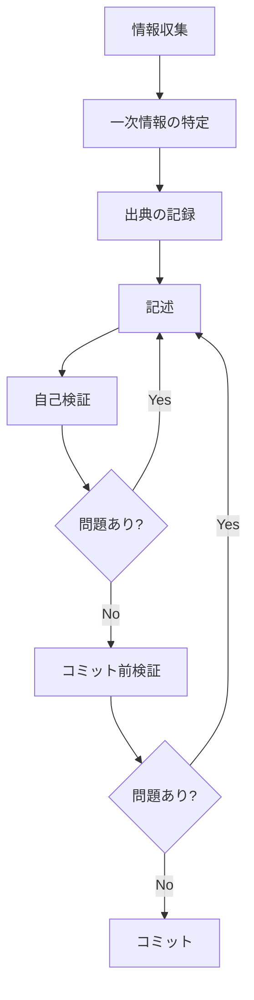
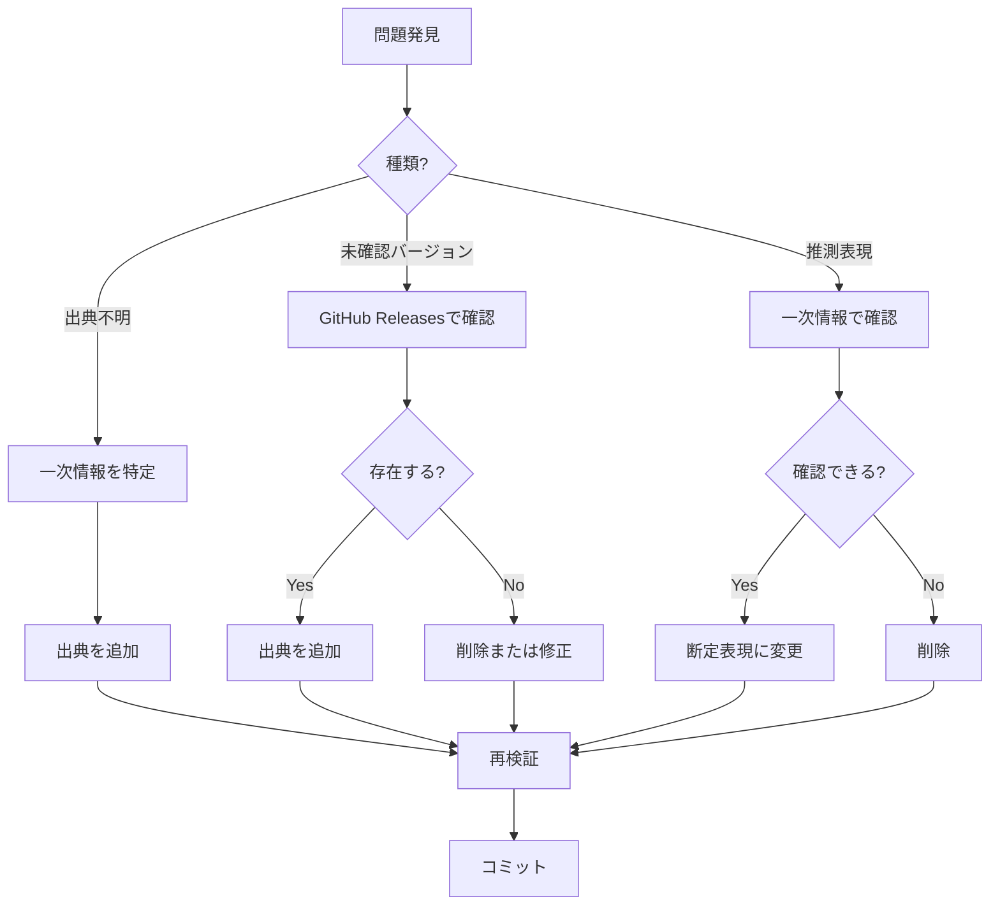

# ドキュメント作成ワークフロー

このガイドは、ドキュメントの品質を保証するための作業プロセスを定義します。

---

## 📋 作業フロー



---

## 1️⃣ 情報収集

### 情報源の優先順位

1. **一次情報**（最優先）
   - GitHub Releases
   - 公式ドキュメント
   - ソースコード

2. **二次情報**（参考）
   - 公式ブログ
   - AWS公式記事

3. **三次情報**（使用禁止）
   - 個人ブログ
   - Stack Overflow
   - 非公式情報

### 情報収集の原則

- ✅ 公式情報を最優先
- ✅ 複数の情報源で確認
- ❌ 推測で記述しない
- ❌ 未確認の情報を記載しない

---

## 2️⃣ 一次情報の特定

### バージョン情報

**Q CLIバージョン**:
```bash
# GitHub Releasesで確認
curl -s "https://api.github.com/repos/aws/amazon-q-developer-cli/releases" | jq -r '.[] | {tag_name, published_at, name}'
```

**技術的変更**:
```bash
# リリースノートで確認
curl -s "https://api.github.com/repos/aws/amazon-q-developer-cli/releases" | jq -r '.[] | select(.tag_name == "v1.x.x") | .body'
```

**ソースコード**:
- GitHub: https://github.com/aws/amazon-q-developer-cli
- 設定スキーマ: `crates/q_cli/schemas/`
- 実装: `crates/`

### 設定情報

**スキーマファイル**:
- グローバル設定: `global-config.schema.json`
- Agent設定: `agent-config.schema.json`
- MCP設定: Agent設定内の`mcpServers`

**デフォルト値**:
- ソースコードで確認
- スキーマファイルで確認

---

## 3️⃣ 出典の記録

### 記録方法

#### 方法1: インライン出典

```markdown
Amazon Q CLIは、HTTPクライアントライブラリ（`reqwest`）を使用しており、
標準的なプロキシ環境変数を認識します。

**技術的根拠**:
- ソースコード: [`Cargo.toml`](https://github.com/aws/amazon-q-developer-cli/blob/main/Cargo.toml)
```

#### 方法2: 参照セクション

```markdown
## 参考情報

- [GitHub Release v1.18.0](https://github.com/aws/amazon-q-developer-cli/releases/tag/1.18.0)
- [AWS公式ドキュメント](https://docs.aws.amazon.com/...)
```

#### 方法3: 注釈

```markdown
> **注**: GitHubのタグ名は`v.1.15.0`（ドット付き）ですが、正式なバージョン番号は`v1.15.0`です。
> - **GitHub Release**: [v.1.15.0](https://github.com/aws/amazon-q-developer-cli/releases/tag/v.1.15.0)
```

---

## 4️⃣ 記述

### 記述の原則

1. **正確性**
   - ✅ 一次情報に基づく
   - ✅ 検証可能
   - ❌ 推測しない

2. **明確性**
   - ✅ 具体的
   - ✅ 曖昧さがない
   - ❌ 「おそらく」等を使わない

3. **完全性**
   - ✅ 必要な情報を全て記載
   - ✅ 出典を明記
   - ❌ 情報を省略しない

### 禁止表現

- ❌ 「おそらく」
- ❌ 「と思われる」
- ❌ 「かもしれない」
- ❌ 「だろう」
- ❌ 「推測」
- ❌ 「予想」（分析ドキュメント以外）

### 推奨表現

- ✅ 「〜です」（断定）
- ✅ 「〜と記載されています」（出典明記）
- ✅ 「〜を確認しました」（検証済み）
- ✅ 「〜によると」（出典引用）

---

## 5️⃣ 自己検証

### チェック項目

#### 出典の確認

- [ ] 全ての技術的記述に出典がある
- [ ] 出典リンクが有効である
- [ ] 出典が一次情報である

#### バージョン番号の確認

- [ ] GitHub Releasesで確認済み
- [ ] リリース日が正確
- [ ] タグ名が正確（v1.15.0 → `v.1.15.0`に注意）

#### 表現の確認

- [ ] 推測表現を使用していない
- [ ] 曖昧な表現を避けている
- [ ] 断定的な記述に根拠がある

#### リンクの確認

- [ ] 内部リンクが有効
- [ ] 外部リンクが有効
- [ ] GitHubリンクが正確

---

## 6️⃣ コミット前検証

### 自動検証

```bash
# バージョン番号と推測表現を検証
cd /home/katoh/work_records/20251018
python3 verify_documentation.py
```

### 手動検証

```bash
# リンクチェック
cd /home/katoh/projects/q-cli-docs
npm run check-links  # または手動確認
```

### チェックリスト確認

[コミット前チェックリスト](COMMIT_CHECKLIST.md)を確認

---

## 7️⃣ コミット

### コミットメッセージ

```
<type>: <subject>

<body>

出典: <source>
```

### 例

```
docs: v1.18.0バージョン履歴追加

- v1.18.0の主要機能を追加
- Agent Delegate Toolの説明を追加
- リリース日: 2025-10-13

出典: https://github.com/aws/amazon-q-developer-cli/releases/tag/1.18.0
```

---

## 🔄 問題発見時の対応

### 問題の種類

1. **出典不明の記述**
   - 一次情報を特定
   - 出典を追加
   - 検証不可能な場合は削除

2. **未確認のバージョン番号**
   - GitHub Releasesで確認
   - 存在しない場合は削除または修正

3. **推測表現**
   - 一次情報で確認
   - 確認できない場合は削除
   - 分析ドキュメントの場合は明示的に予測であることを記載

### 修正フロー



---

## 📊 品質指標

### 目標

- 出典不明の記述: **0件**
- 未確認のバージョン番号: **0件**
- 推測表現: **0件**（分析ドキュメント除く）
- リンク切れ: **0件**

### 測定方法

```bash
# 自動検証スクリプトで測定
python3 verify_documentation.py

# 結果確認
cat verification_results.json | jq '.invalid_versions | length'
cat verification_results.json | jq '.speculations | length'
```

---

## 🔗 関連ドキュメント

- [コミット前チェックリスト](COMMIT_CHECKLIST.md)
- [品質保証ガイド](../docs/05_meta/QUALITY_ASSURANCE.md)
- [検証チェックリスト](../docs/05_meta/VERIFICATION_CHECKLIST.md)

---

**最終更新**: 2025-10-18  
**作成者**: Amazon Q Developer CLI
