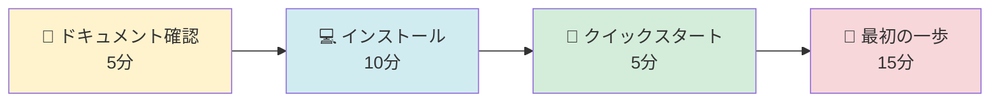

# Amazon Q Developer CLI 調査プロジェクト

## 🚀 クイックスタート

### 初めての方へ - 4ステップで始める

1. **[📖 ドキュメントサイト全体を確認](docs/README.md)** ← まずここから！（5分）
2. **[💻 インストール](docs/for-users/getting-started/installation.md)** - Q CLIのインストール方法（10分）
3. **[🚀 クイックスタート](docs/for-users/getting-started/quick-start.md)** - 5分で始めるQ CLI（5分）
4. **[👣 最初の一歩](docs/for-users/getting-started/first-steps.md)** - 基本的な使い方（15分）

### 設定を始める

1. **基本設定を確認**: [Getting Started](docs/for-users/getting-started/README.md)
2. **環境変数を設定**: [環境変数ガイド](docs/for-users/configuration/environment-variables.md)
3. **Agent設定を作成**: [Agent設定ガイド](docs/for-users/configuration/agent-configuration.md)
4. **設定を確認**: [設定優先順位ガイド](docs/for-users/configuration/priority-rules.md)

### トラブルシューティング

問題が発生した場合：
1. [トラブルシューティングガイド](docs/for-users/troubleshooting/common-issues.md)を確認
2. [設定優先順位ガイド](docs/for-users/configuration/priority-rules.md)で優先順位を理解
3. [GitHub ISSUE](https://github.com/aws/amazon-q-developer-cli/issues)で既知の問題を検索

---

## Amazon Q Developer CLIとは

Amazon Q Developer CLI（Q CLI）は、AWSが提供する**AI駆動**の開発者支援ツールです。

> **💡 ワンポイント**: AWS CLIとの違い
> - **AWS CLI**: AWSサービスを操作するコマンドラインツール（`aws s3 ls`など）
> - **Q CLI**: AIが自然言語を理解し、コード生成やファイル操作を支援（`q chat "S3バケットを作成して"`など）

コマンドラインから自然言語で質問し、コード生成、ファイル操作、AWS操作などを実行できます。

> **💡 ワンポイント**: 主要な用語
> - **Agent（エージェント）**: Q CLIの動作をカスタマイズする設定ファイル。プロジェクトごとに異なる設定が可能
> - **MCP（Model Context Protocol）**: 外部ツールと連携するためのプロトコル。MCPサーバーを追加することで機能を拡張できる

## 概要

このプロジェクトは、Amazon Q Developer CLI (Q CLI) の包括的な調査・分析を目的としています。設定ファイルの仕様、バージョン履歴、ロードマップ、ソースコード構造など、Q CLIを効果的に活用するための詳細なドキュメントを提供します。

---

## 📖 ドキュメントサイト

### 🎯 **[→ ドキュメント全体を見る（docs/README.md）](docs/README.md)** ← 最初にここを確認！

このプロジェクトには**65文書**の体系的なドキュメントがあります。

**[ドキュメントサイト](docs/README.md)** では以下が確認できます：
- 📊 全65文書の一覧（カテゴリ別、対象ユーザー別）
- 🎯 目的別ガイド（やりたいことから適切なドキュメントを発見）
- 📈 統計情報とナビゲーション

---

## 🎯 主要な調査結果

### 設定システム

- **設定項目**: 35項目（テレメトリ、チャット、Knowledge、MCP等）
- **環境変数**: 23項目（Q CLI固有18項目 + システム5項目）
- **優先順位**: 5段階（コマンドライン引数 → 環境変数 → Agent設定 → グローバル設定 → デフォルト値）
- **環境変数展開**: `${env:VAR_NAME}`構文をサポート（MCP設定、Agent設定）

### バージョン履歴（v1.13.0～v1.17.0）

- **期間**: 2025-07-31 ～ 2025-09-29（2ヶ月）
- **PR数**: 135+件
- **新規コントリビューター**: 13名
- **主要機能**:
  - Agent機能の成熟化（スキーマ、管理コマンド、編集機能）
  - MCP進化（rmcp移行、リモート対応、OAuth統合）
  - Knowledge機能ベータ改善（BM25サポート）
  - セキュリティ強化（execute_bash権限厳格化、fs_read制限）

### ロードマップ

- **総アイテム数**: 35件（オープン: 28件、クローズド: 7件）
- **完了率**: 20%
- **最優先項目**:
  1. Windows Support (#2602)
  2. Remote MCP Servers (#2706) - エンタープライズブロッカー
  3. UX Rewrite using Ratatui (#2550) - 実質的な「Qv2」
  4. ADC Support (#2600)

### エンタープライズ採用への障壁

1. **Windows未対応** - 多くのエンタープライズ環境はWindows中心
2. **リモートMCP + OAuth未完成** - エンタープライズツールとの統合困難
3. **ADC未対応** - エンタープライズネットワーク環境での制限
4. **管理機能の不足** - 使用状況の可視化、管理者ダッシュボード

---

## プロジェクト目的

- **機能調査**: Q CLIの設定、環境変数、Agent機能の詳細分析
- **アップデート追跡**: バージョン履歴と新機能の評価
- **ロードマップ分析**: 開発計画とエンタープライズ採用への課題
- **ベストプラクティス**: 実践的な設定例とトラブルシューティング

## 公式リポジトリ

- GitHub: https://github.com/aws/amazon-q-developer-cli
- 対象バージョン: v1.17.0以降

---

## 📊 ドキュメント統計

- **総ドキュメント数**: 65文書
- **総文字数**: 約441,000文字
- **ベストプラクティス**: 4文書（42,176バイト）
  - configuration.md: ✅ 完了（12,732バイト）
  - security.md: ✅ 完了（14,076バイト）
  - performance.md: ✅ 完了（14,564バイト）
- **Mermaid図**: 11図
  - フローチャート: 2図
  - グラフ: 1図
  - シーケンス図: 4図
  - クラス図: 1図
  - 構造図: 3図
- **調査期間**: 2025-10-08～2025-10-09（2日）
- **整合性**: 平均100%（実装との完全一致）

---

## 🔍 調査方法

### 情報源

1. **公式リポジトリ**: ソースコード、ドキュメント、スキーマ
2. **GitHub API**: リリース情報、ISSUE、PR、ロードマップ
3. **ソースコード分析**: Rust実装の詳細調査

### 調査ツール

- **ripgrep (rg)**: 高速検索で設定項目を抽出
- **GitHub API**: リリース情報とISSUEの取得
- **Mermaid**: 図解の作成

---

## 📅 更新履歴

| 日付 | 内容 |
|------|------|
| 2025-10-11 | プロジェクト新規作成（総ドキュメント数: 65文書） |

---

## 🤝 貢献者

- **調査担当**: AI Assistant
- **レビュー**: katoh

---

## 📝 ライセンス

このプロジェクトは [MIT License](LICENSE) の下で公開されています。

---

## ⚠️ 免責事項

> **重要な免責事項**
> 
> このプロジェクトは **非公式** のドキュメントです。Amazon Web Services, Inc.またはその関連会社によって作成、承認、または保証されたものではありません。
> 
> - **商標について**: "Amazon Q Developer"、"AWS"、"Amazon Web Services" は Amazon.com, Inc. またはその関連会社の商標です
> - **情報の正確性**: 本ドキュメントの情報は調査時点のものであり、正確性を保証するものではありません
> - **責任の制限**: 本ドキュメントの使用により生じた損害について、作成者は一切の責任を負いません
> - **公式情報**: 最新かつ正確な情報は [Amazon Q Developer 公式サイト](https://aws.amazon.com/q/developer/) をご確認ください

---

## 管理方針

- 調査結果はGitHubで管理
- 定期的な更新（週次/月次）
- 構造化されたドキュメント形式での記録
- 変更履歴の適切な管理

---

## 🔗 関連リンク

- [Amazon Q Developer CLI 公式リポジトリ](https://github.com/aws/amazon-q-developer-cli)
- [Amazon Q Developer 公式サイト](https://aws.amazon.com/q/developer/)
- [AWS CLI Documentation](https://docs.aws.amazon.com/)

---

*このプロジェクトは継続的な調査と分析を通じて、Q CLIの効果的な活用を支援することを目指しています。*
