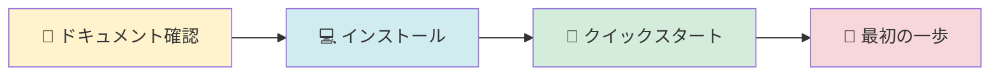

# 猫でもわかるAmazon Q Developer CLI 解体新書

## 💡 なぜこのサイトを作ったのか

Amazon Q Developer CLIは、開発効率を劇的に向上させる強力なツールです。しかし、その真の力はまだ十分に知られていないと感じています。

このサイトでは、Q CLI自身を使ってQ CLIのソースコードを解析することで、Q CLIの可能性を示す実例となることを目指しました。公式ドキュメントには載っていない深い知見を発見し、体系的にまとめることを最終目的にしています。

目指したのは、初心者でも理解できる分かりやすさと、実務で即使える実践的な内容の両立です。

AWS技術者として、Q CLIの可能性をもっと多くの人に知ってもらい、実際に使ってもらいたい。その思いが、このサイトの原動力です。

---

## 公式リポジトリ

- GitHub: https://github.com/aws/amazon-q-developer-cli
- 対象バージョン: v1.19.3以降

---

## 📚 ドキュメント構成

このサイトには**114文書**の体系的なドキュメントがあります：

```
docs/
├── 01_for-users/        # ユーザーガイド（73文書）
│   ├── 入門・機能・設定・ベストプラクティス
│   ├── デプロイ・トラブルシューティング
│   └── リファレンス・ガイド・セキュリティ・仕様
├── 02_for-developers/   # 開発者ガイド（11文書）
│   ├── コントリビューション（4文書）
│   └── アーキテクチャ（4文書）
├── 03_for-community/    # コミュニティ（14文書）
│   ├── アップデート情報（4文書）
│   ├── コミュニティ（3文書）
│   └── 分析レポート（3文書）
├── 04_issues/           # 課題管理（1文書）
└── 05_meta/             # メタドキュメント（14文書）
    └── 品質保証・コントリビューション
```

📖 **[→ 詳細なファイル一覧を見る（docs/README.md）](docs/README.md)** - 全114ファイルの完全なツリー構造

---

## 📊 品質保証

このプロジェクトは、**3つの柱**で品質を保証しています：

1. **自動化ツール** - 1,849項目を機械的にチェック
2. **手動チェック** - 人間が内容を確認
3. **作業原則** - 品質を保つルール

日々、品質向上のため人間による目視レビューを実施しています。

### 詳細情報

品質保証の詳細は **[Meta（メタドキュメント）](docs/05_meta/README.md)** をご覧ください。

---

## 🚀 クイックスタート

### 初めての方へ - 4ステップで始める



1. **[📖 ドキュメントサイト全体を確認](docs/README.md)** ← ⭐まずここから！
2. **[💻 インストール](docs/01_for-users/01_getting-started/01_installation.md)** - Q CLIのインストール方法
3. **[🚀 クイックスタート](docs/01_for-users/01_getting-started/02_quick-start.md)** - 5分で始めるQ CLI
4. **[👣 最初の一歩](docs/01_for-users/01_getting-started/03_first-steps.md)** - 基本的な使い方

### 設定を始める

1. **基本設定を確認**: [Getting Started](docs/01_for-users/01_getting-started/README.md)
2. **環境変数を設定**: [環境変数ガイド](docs/01_for-users/03_configuration/06_environment-variables.md)
3. **Agent設定を作成**: [Agent設定ガイド](docs/01_for-users/03_configuration/03_agent-configuration.md)
4. **設定を確認**: [設定優先順位ガイド](docs/01_for-users/03_configuration/07_priority-rules.md)

### 🎯 コンテキスト管理を理解する【重要】

**Q CLIを効果的に使うための最重要ガイド**

Q CLIの応答品質は**コンテキスト管理**で決まります。以下のガイドで体系的に学習できます：

#### 📚 **[コンテキスト管理完全ガイド](docs/01_for-users/08_guides/README.md)** ← ⭐必読！

全8章構成の包括的ガイド：
1. **[本質編](docs/01_for-users/08_guides/01_essence.md)** - コンテキストとは何か
2. **[仕組み編](docs/01_for-users/08_guides/02_mechanism.md)** - 内部動作の理解
3. **[効果編](docs/01_for-users/08_guides/03_effects.md)** - 何ができるか
4. **[ベストプラクティス編](docs/01_for-users/08_guides/04_best-practices.md)** - 設計原則と実装パターン
5. **[実践ガイド編](docs/01_for-users/08_guides/05_practical-guide.md)** - プロジェクト別実装例
6. **[トラブルシューティング編](docs/01_for-users/08_guides/06_troubleshooting.md)** - 問題解決
7. **[上級編](docs/01_for-users/08_guides/07_advanced.md)** - 最適化とチーム開発
8. **[リファレンス編](docs/01_for-users/08_guides/08_reference.md)** - 技術仕様とFAQ

> **💡 学習の進め方**
> - **初心者**: 第1章→第3章→第5章（基本を理解して実践）
> - **中級者**: 第4章→第5章→第6章（ベストプラクティスを習得）
> - **上級者**: 第7章→第8章（最適化とチーム開発）

### トラブルシューティング

問題が発生した場合：
1. [コンテキスト管理トラブルシューティング](docs/01_for-users/08_guides/06_troubleshooting.md)を確認
2. [一般的なトラブルシューティング](docs/01_for-users/06_troubleshooting/02_common-issues.md)を確認
3. [設定優先順位ガイド](docs/01_for-users/03_configuration/07_priority-rules.md)で優先順位を理解
4. [GitHub ISSUE](https://github.com/aws/amazon-q-developer-cli/issues)で既知の問題を検索

---

## Amazon Q Developer CLIとは

Amazon Q Developer CLI（Q CLI）は、AWSが提供する**AI駆動**の開発者支援ツールです。

> **💡 ワンポイント**: AWS CLIとの違い
> - **AWS CLI**: AWSサービスを操作するコマンドラインツール（`aws s3 ls`など）
> - **Q CLI**: AIが自然言語を理解し、コード生成やファイル操作を支援（`q chat "S3バケットを作成して"`など）

コマンドラインから自然言語で質問し、コード生成、ファイル操作、AWS操作などを実行できます。

> **💡 ワンポイント**: 主要な用語
> - **Agent（エージェント）**: Q CLIの動作をカスタマイズする設定ファイル。プロジェクトごとに異なる設定が可能
> - **MCP（Model Context Protocol）**: 外部ツールと連携するためのプロトコル。MCPサーバーを追加することで機能を拡張できる

## 概要

このプロジェクトは、Amazon Q Developer CLI (Q CLI) の包括的な調査・分析を目的としています。設定ファイルの仕様、バージョン履歴、ロードマップ、ソースコード構造など、Q CLIを効果的に活用するための詳細なドキュメントを提供します。

---

## 📖 ドキュメントサイト

### 🎯 **[→ ドキュメント全体を見る（docs/README.md）](docs/README.md)** ← 最初にここを確認！

このプロジェクトには**114文書**の体系的なドキュメントがあります。

**[ドキュメントサイト](docs/README.md)** では以下が確認できます：
- 📊 全114文書の一覧（カテゴリ別、対象ユーザー別）
- 🎯 目的別ガイド（やりたいことから適切なドキュメントを発見）
- 📈 統計情報とナビゲーション

---

## 🎯 主要な調査結果

### 設定システム

- **設定項目**: 45項目（テレメトリ、チャット、Knowledge、MCP等）
- **環境変数**: 28項目（Q CLI固有19項目 + その他9項目）
- **優先順位**: 5段階（コマンドライン引数 → 環境変数 → Agent設定 → グローバル設定 → デフォルト値）
- **環境変数展開**: `${env:VAR_NAME}`構文をサポート（MCP設定、Agent設定）

### バージョン履歴（v1.13.0～v1.19.3）

**[→ 詳細なバージョン履歴を見る](docs/03_for-community/01_updates/03_version-history-v1.13-latest.md)**

- **期間**: 2025-07-31 ～ 2025-10-29（約3ヶ月）
- **最新バージョン**: v1.19.3 (2025-10-29)
- **主要機能**:
  - Agent機能の成熟化（スキーマ、管理コマンド、編集機能）
  - MCP進化（rmcp移行、リモート対応、OAuth統合）
  - Knowledge機能ベータ改善（BM25サポート、PDF対応）
  - セキュリティ強化（execute_bash権限厳格化、fs_read制限）

### セキュリティとプライバシー

Q CLIのセキュリティとプライバシーについて理解することは重要です：

- **[セキュリティ概要](docs/01_for-users/09_security/01_security-overview.md)** - セキュリティの基本原則とトピック
- **[データプライバシー](docs/01_for-users/09_security/02_data-privacy.md)** - データの取り扱いとプライバシー保護
- **[テレメトリー設定](docs/01_for-users/03_configuration/05_telemetry.md)** - 使用状況データの収集と無効化方法

### Pro/Enterpriseプランのメリット

- **データプライバシー保護**: コンテンツ（質問、コード、応答）がサービス改善やモデル学習に使用されない
- **Freeプランとの違い**: Freeプランではコンテンツがサービス改善に使用される可能性がある
- **エンタープライズ適合性**: 機密情報を扱う組織に最適
- **詳細**: [料金プラン比較](docs/01_for-users/05_deployment/02_pricing-comparison.md)

### エンタープライズ採用への障壁

1. **Windows未対応** - 多くのエンタープライズ環境はWindows中心
2. **リモートMCP + OAuth未完成** - エンタープライズツールとの統合困難
3. **ADC未対応** - エンタープライズネットワーク環境での制限
4. **管理機能の不足** - 使用状況の可視化、管理者ダッシュボード

**詳細**: [エンタープライズ展開ガイド](docs/01_for-users/05_deployment/01_enterprise-deployment.md)、[セキュリティチェックリスト](docs/01_for-users/05_deployment/03_security-checklist.md)

---

## プロジェクト目的

- **機能調査**: Q CLIの設定、環境変数、Agent機能の詳細分析
- **アップデート追跡**: バージョン履歴と新機能の評価
- **ロードマップ分析**: 開発計画とエンタープライズ採用への課題
- **ベストプラクティス**: 実践的な設定例とトラブルシューティング

---

## 🔍 調査方法

### 情報源

1. **公式リポジトリ**: ソースコード、ドキュメント、スキーマ
2. **GitHub API**: リリース情報、ISSUE、PR、ロードマップ
3. **AWS Blog**: 最新情報、アップデート、ベストプラクティス
4. **ソースコード分析**: Rust実装の詳細調査

### 調査ツール

- **Amazon Q Developer CLI**: AI支援による調査・分析・ドキュメント作成
- **ripgrep (rg)**: 高速検索で設定項目を抽出
- **GitHub API**: リリース情報とISSUEの取得
- **Mermaid**: 図解の作成

---

## 📅 更新履歴

| 日付 | 内容 |
|------|------|
| 2025-11-01 | v1.19.3対応 |
| 2025-10-29 | JAWS-UG AI/ML #32 発表（一般公開開始） |

---

## 🤝 貢献者

- **調査担当**: Amazon Q Developer CLI
- **レビュー**: katoh

---

## 📝 ライセンス

このプロジェクトは [MIT License](LICENSE) の下で公開されています。

---

## ⚠️ 免責事項

> **重要な免責事項**
> 
> このプロジェクトは **非公式** のドキュメントです。Amazon Web Services, Inc.またはその関連会社によって作成、承認、または保証されたものではありません。
> 
> - **商標について**: "Amazon Q Developer"、"AWS"、"Amazon Web Services" は Amazon.com, Inc. またはその関連会社の商標です
> - **情報の正確性**: 本ドキュメントの情報は調査時点のものであり、正確性を保証するものではありません
> - **責任の制限**: 本ドキュメントの使用により生じた損害について、作成者は一切の責任を負いません
> - **公式情報**: 最新かつ正確な情報は [Amazon Q Developer 公式サイト](https://aws.amazon.com/q/developer/) をご確認ください

---

## 管理方針

- 調査結果はGitHubで管理
- 定期的な更新（週次/月次）
- 構造化されたドキュメント形式での記録
- 変更履歴の適切な管理

---

## 🔗 関連リンク

- [Amazon Q Developer CLI 公式リポジトリ](https://github.com/aws/amazon-q-developer-cli)
- [Amazon Q Developer 公式サイト](https://aws.amazon.com/q/developer/)
- [AWS CLI Documentation](https://docs.aws.amazon.com/)
- [Amazon Q Developer CLI 調査プロジェクト - Qiita](https://qiita.com/kamogashira/items/672fbc6cbc48c28364ff)

---

*このプロジェクトは継続的な調査と分析を通じて、Q CLIの効果的な活用を支援することを目指しています。*
