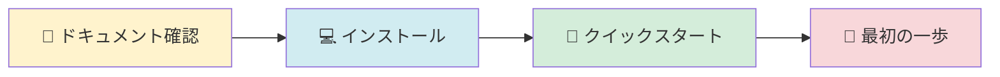

# 猫でもわかるkiro-cli アップデート情報

**[Kiro CLI](https://kiro.dev/cli/)（旧 Amazon Q Developer CLI）のアップデート情報を、初心者にも分かりやすく解説するプロジェクトです。** より正確な情報発信を心がけて今後も更新していきます。

> **旧称**: 猫でもわかるAmazon Q Developer CLI 解体新書
> 旧 Amazon Q Developer CLI（2025年11月17日 開発終了）のドキュメントは [docs/](docs/README.md) にアーカイブとして保存しています（本ページ後半にも旧情報のアーカイブ節があります）。

## 🚀 クイックスタート

1. **[📖 猫でもわかるkiro-cli アップデート情報](kiro-docs/README.md)** ← ⭐まずここから！
2. **[💻 公式インストール手順](kiro-docs/03_deployment/03_official-installation.md)** - macOS / Windows 11 / Linux 別のインストール方法
3. **[📚 機能詳細ガイド](kiro-docs/01_features/README.md)** - 32機能をカテゴリ別に解説
4. **[🔍 リファレンス](kiro-docs/04_reference/README.md)** - Settings / Slashコマンド / CLIコマンド / Built-in Tools の辞書
5. **[📋 変更履歴](kiro-docs/02_update/01_changelog.md)** - 全バージョンの詳細な変更内容

## 📢 Amazon Q Developer CLI から Kiro CLI へ

2025年11月17日のv1.19.7リリースを最後に、Amazon Q CLIはオープンソースプロジェクトとしての積極的な開発を終了しました。今後は**重要なセキュリティ修正のみ**が提供される予定です。

Amazon Q Developer CLIは、**[Kiro CLI](https://kiro.dev/cli/)** として生まれ変わりました（v1.19.7リリース（2025年11月17日）の翌日に公式発表）：

- **新しい名称**: Kiro CLI
- **開発形態**: クローズドソース製品
- **ライセンス**: AWS Intellectual Property License
- **継続性**: 既存のワークフローと購読はそのまま継続
- **最新機能**: Kiro CLIで提供
- **Issue管理**: [GitHub - kirodotdev/Kiro](https://github.com/kirodotdev/Kiro) で継続

### 🔗 関連AWS公式ブログ記事

#### Kiro CLI公式発表
- **[Introducing Kiro CLI](https://aws.amazon.com/jp/blogs/news/introducing-kiro-cli/)**
  - Kiro CLIの公式発表記事
  - 基本概念と主要機能の紹介
  - Amazon Q Developer CLIからの進化について

#### 移行ガイド
- **[Kiroweeeeeeek in Japan Day 6: Amazon Q Developer CLI to Kiro CLI](https://aws.amazon.com/jp/blogs/news/kiroweeeeeeek-in-japan-day-6-amazon-q-developer-cli-to-kiro-cli/)**
  - Amazon Q Developer CLIからKiro CLIへの移行ガイド
  - 日本での導入事例とベストプラクティス
  - 移行時の注意点と推奨事項

### 📚 Kiro CLI v2.x 主要アップデート

Kiro CLI v2.x 系では **Windows対応・Headless Mode・新TUI** を中心に大幅な機能拡張が行われ、**v2.8.0 では CLI v3（Early Access）** が登場、**v2.11.0〜v2.12.0 では MCP OAuth 認証管理・事前登録アプリ対応**が強化され、**v2.12.2 で ACP・セッション周りの安定性**が改善されました：

1. **[v2.12.2 / v2.12.1 / v2.12.0 / v2.11.0 MCP OAuth 認証管理・事前登録アプリ対応＋安定性修正](kiro-docs/02_update/01_changelog.md)**（2026-07-14 / 07-09 / 07-09 / 07-02）
   - v2.11.0: `/mcp auth`・`/mcp cancel-auth`・`/mcp logout`（リモートMCPのOAuth再認証/中止/資格情報削除）、MCPパネルショートカット（`^A`/`^X`/`^R`）
   - v2.11.0: `/usage` がプリペイド「Additional credits」表示に刷新（使用上限なしはプログレスバー非表示）
   - v2.12.0: MCP OAuth 事前登録アプリ対応（`clientSecret`・`redirectUri` フルURL・カスタム `clientId` 時 DCR スキップ）、全TUIグリフの ASCIIモード尊重、shell 権限検出器の強化（セキュリティ）
   - v2.12.1: モデル拒否通知（拒否理由をエラーアラート表示）
   - v2.12.2: ACP `--agent` を新規セッションごとに適用（デフォルトエージェント/MCPへのフォールバック防止）、アクティブセッション再読込で旧インスタンス終了（MCPサーバープロセスのリーク防止）、パイプ/非対話 stdin 時に `chat` が TUI 非描画

2. **[v2.10.0 / v2.9.0 設定ホットリロード・リソース継承制御・V3安定化](kiro-docs/02_update/01_changelog.md)**（2026-06-26 / 06-24）
   - v2.10.0: MCP・エージェント設定のホットリロード（file watcher で `.kiro/agents`・`mcp.json` を監視、変更サーバーのみ再起動、会話コンテキスト保持）
   - v2.10.0: `chat.disableInheritingDefaultResources`（カスタムエージェントの既定リソース継承をオプトアウト、組み込みは常に継承） → [kiro-docs/01_features/31](kiro-docs/01_features/31_v210ConfigHotReload.md)
   - v2.9.0: V3（Early Access）安定化（[V3] ツールカード1行プレビュー）、Entra ID セッション更新修正、カスタムエージェント二重読込修正

3. **[v2.8.0 / v2.8.1 CLI v3 Early Access](kiro-docs/02_update/01_changelog.md)**（2026-06-17）
   - `kiro-cli --v3` で V3 エンジンを先行公開（2.x と併存、Early Access）。統一エンジン＋仕様駆動開発
   - 4本柱（Spec / `permissions.yaml` / Hooks / タグベース Agent設定）、Breaking changes・Known gaps（→ [kiro-docs/09_v3/](kiro-docs/09_v3/README.md)）
   - v2.8.1: MCP OAuth のクリップボードコピー・spec ワークフロー表示の改善

4. **[v2.7.0 /goal・Queue Steering・enriched /rewind](kiro-docs/02_update/01_changelog.md)**（2026-06-12）
   - `/goal`（受入基準を満たすまで自己検証する自律ループ、最大5反復既定 / `--max`）
   - Queue Steering（`Ctrl+S` で steer/queue 切替、ターン実行中に方向修正）
   - enriched `/rewind` preview（各ターンのツール呼び出し・ファイル変更・コンテキスト使用量を表示）
   - `chat.terminalTitle` 設定追加、`/settings` UI統一・`theme Custom` ウィザード化

5. **[v2.6.1 Linux: libasound.so.2 依存除去](kiro-docs/02_update/01_changelog.md)**（2026-06-08）
   - Linux ビルドが起動時に `libasound.so.2` を要求しなくなる（オーディオ依存パッケージ不要）

6. **[v2.6.0 Transcript Export・/title・永続化](kiro-docs/02_update/01_changelog.md)**（2026-06-05）
   - `/transcript save`（会話を Markdown/プレーンテキスト/JSON でエクスポート）
   - `/title`（ターミナルウィンドウタイトルの設定）
   - `--effort` 起動フラグ（`kiro-cli chat` 起動時に推論レベル指定）
   - `/model`・`/effort` の自動永続化（`set-current-as-default` 不要に）

7. **[v2.5.1 APIエンドポイント移行](kiro-docs/02_update/01_changelog.md)**（2026-06-01）
   - API エンドポイントを `*.kiro.dev` へ移行（firewall 許可リスト要確認）

8. **[v2.5.0 Thinking Display・Review Loops](kiro-docs/02_update/01_changelog.md)**（2026-05-29）
   - Thinking Display（エージェントの推論をリアルタイム表示、既定有効）
   - Subagent Review Loops（reviewer→implementer の自動差し戻し）
   - `/settings display`（表示トグル）、プロンプト履歴のセッション単位化

9. **[v2.4.2 Windowsクラッシュ修正](kiro-docs/02_update/01_changelog.md)**（2026-05-26）
   - Windows 環境で発生していた koffi/createRequire 起因クラッシュ修正（terminal input handling）

10. **[v2.4.1 MCP環境変数展開修正](kiro-docs/02_update/01_changelog.md)**（2026-05-21）
   - MCPサーバー設定での `${VAR_NAME}` 環境変数展開構文の修正

11. **[v2.4.0 /rewind・/effort・/settings](kiro-docs/02_update/01_changelog.md)**（2026-05-20）
   - `/rewind`（会話の任意ターンに戻り新セッションで分岐）
   - `/effort`（モデル推論レベル5段階制御: low〜max）
   - `/settings`（theme/keybindings/terminal統合メニュー）
   - Workspace初期化88%高速化（652ms → 76ms）

12. **[v2.3.0 MCP OAuth・KIRO_HOME・Keybindings](kiro-docs/02_update/01_changelog.md)**（2026-05-12）
   - OAuth clientId設定（DCR非対応MCPサーバー接続）
   - KIRO_HOME環境変数（`~/.kiro`ディレクトリのオーバーライド）
   - V2 TUIキーバインド設定（cancel/close menu/quit）
   - Agent Output Side Channels（`$AGENT_DISPLAY_OUT`/`$AGENT_CONTEXT_OUT`）

13. **[v2.2.2 MCPガバナンス強化](kiro-docs/02_update/01_changelog.md)**（2026-05-05）
   - V2 TUIモードでのMCP governance強制適用（エンタープライズ・API keyユーザー）

14. **[v2.2.1 UX改善・安定性修正](kiro-docs/02_update/01_changelog.md)**（2026-05-04）
   - `chat.disableWrap`設定追加、`/model set-current-as-default`の保存先変更、9件のバグ修正

15. **[v2.2.0 Adaptive Thinking](kiro-docs/02_update/01_changelog.md)**（2026-04-27）
   - マルチターン会話でモデルの推論を保持し応答品質を向上

16. **[v2.1.0 Shell Streaming・Tool Search](kiro-docs/02_update/01_changelog.md)**（2026-04-24）
   - シェルコマンド出力のリアルタイムストリーミング
   - Skills as Slash Commands（`/skill-name`で直接呼び出し）
   - Device Flow認証（ポートフォワーディング不要）

17. **[v2.0.0 Windows・Headless Mode](kiro-docs/02_update/01_changelog.md)**（2026-04-13）
   - Windows 11ネイティブ対応
   - CI/CD向けHeadless Mode（`KIRO_API_KEY`認証）
   - 新Terminal UIがデフォルト化（Crew Monitor、/theme、/spawn等）

詳細は **[kiro-docs/02_update/01_changelog.md](kiro-docs/02_update/01_changelog.md)** をご覧ください。

### 📚 Kiro CLI v1.26.0 主要アップデート（2026-02-12）

Kiro CLI v1.26.0では、**UX改善とSkills自動読み込み**を中心に多数の機能追加が行われました：

1. **[@file/@directory展開](kiro-docs/01_features/README.md)**
   - インラインコンテンツ参照の展開機能
   - チャット入力でファイル/ディレクトリ内容を直接参照

2. **[統合エントリポイント](kiro-docs/01_features/README.md)**
   - `kiro-cli integrations install kiro-command-router`
   - Kiro統合コマンドルーター

3. **[Skills自動読み込み](kiro-docs/01_features/07_Skills.md)**
   - `.kiro/skills/`と`~/.kiro/skills/`からデフォルトエージェントに自動提供
   - Agent設定での明示的指定が不要に

4. **[ACP強化](kiro-docs/01_features/13_ACP.md)**
   - `--agent`フラグでエージェント指定
   - ACP/subagent用`code`ツール追加

5. **UX改善**
   - Agent名・モデル名のタブ補完とゴーストテキスト
   - `/tools`でトークン数表示
   - Shell tool `working_dir`パラメータ

⚠️ **動作変更**: Agent名が位置引数に変更（`kiro-cli agent create my-agent`）

詳細は **[kiro-docs/02_update/01_changelog.md](kiro-docs/02_update/01_changelog.md)** をご覧ください。

### 📚 Kiro CLI v1.24.0 主要アップデート（2026-01-16）

Kiro CLI v1.24.0では、**7つの主要機能**が追加されました：

1. **[Skills機能（Progressive Context Loading）](kiro-docs/01_features/07_Skills.md)**
   - 大規模ドキュメント向けの段階的コンテキストロード
   - メタデータのみ起動時、本文はオンデマンド

2. **[Custom Diff Tools機能](kiro-docs/01_features/08_CustomDiffTools.md)**
   - 外部Diffツール統合（15種類対応）
   - delta、difftastic、VS Code等

3. **[AST Pattern Tools機能（Precise Refactoring）](kiro-docs/01_features/09_ASTPatternTools.md)**
   - 構文木ベースの精密なコード検索・変換
   - 誤検出排除、安全なリファクタリング

4. **[Improved Code Intelligence](kiro-docs/01_features/01_LSP.md)**
   - 18言語組み込み対応（v1.22.0は7言語）
   - /code overviewコマンド追加

5. **[Conversation Compaction機能](kiro-docs/01_features/10_ConversationCompaction.md)**
   - 会話履歴の圧縮でコンテキストスペースを解放
   - 手動・自動実行、元セッション復帰可能

6. **[Granular URL Permissions機能](kiro-docs/01_features/11_URLPermissions.md)**
   - web_fetchツールのURL権限細粒度制御
   - 正規表現パターン、信頼・ブロックパターン

7. **[Remote Authentication機能](kiro-docs/01_features/12_RemoteAuth.md)**
   - リモートマシンでのGoogle/GitHub認証対応
   - SSH/SSM/コンテナ環境対応

詳細は **[kiro-docs/01_features/](kiro-docs/01_features/README.md)** をご覧ください。

### 📂 Kiro CLIドキュメント構成

```
kiro-docs/
├── 00_information/   # 基本情報・公式サイト情報
├── 01_features/      # 機能詳細ガイド（v2.12.2対応）
├── 02_update/        # アップデート情報
├── 03_deployment/    # デプロイメント・環境構築
├── 04_reference/     # リファレンス（Settings/Slash/CLI/Tools）
├── 07_aidlc/         # AI-DLC（Kiro CLI で実践する選択肢）
├── 08_cdk-skills/    # cdk-skills（CDK 開発支援 Skills 集）
└── 09_v3/            # Kiro CLI v3（Early Access）— 仕様駆動開発・IDE比較 🆕
```

**主要ドキュメント**:
- **[機能詳細ガイド](kiro-docs/01_features/README.md)** - 32機能の詳細解説
- **[アップデート情報](kiro-docs/02_update/README.md)** - バージョン履歴
- **[環境構築ガイド](kiro-docs/03_deployment/README.md)** - デプロイメント手順

### 📖 このサイトの価値

このサイトは、**Kiro CLI のアップデート情報を追い続ける**とともに、Amazon Q CLI の**最後の包括的なドキュメント**として以下の価値を提供し続けます：

- **最新情報の解説**: Kiro CLI の各バージョンの変更内容を初心者にも分かりやすく解説
- **歴史的記録**: オープンソース時代のQ CLIの全機能と設定の詳細
- **移行支援**: Kiro CLIへの移行時の参考資料
- **学習資源**: AI駆動開発ツールの理解を深める教材
- **技術資産**: 127文書に及ぶ体系的な知識ベース（旧Q CLIアーカイブ）

**Kiro CLIの最新情報は [公式サイト](https://kiro.dev/cli/) をご確認ください。**

---

## 🗄️ アーカイブ: 猫でもわかるAmazon Q Developer CLI 解体新書

> **⚠️ ここから下は旧 Amazon Q Developer CLI（2025年11月17日 開発終了）時代のコンテンツのアーカイブです。**
> 現行の **Kiro CLI** の情報は **[kiro-docs/](kiro-docs/README.md)** をご覧ください。

### 💡 なぜこのサイトを作ったのか

Amazon Q Developer CLIは、開発効率を劇的に向上させる強力なツールです。しかし、その真の力はまだ十分に知られていないと感じています。

このサイトでは、Q CLI自身を使ってQ CLIのソースコードを解析することで、Q CLIの可能性を示す実例となることを目指しました。公式ドキュメントには載っていない深い知見を発見し、体系的にまとめることを最終目的にしています。

目指したのは、初心者でも理解できる分かりやすさと、実務で即使える実践的な内容の両立です。

AWS技術者として、Q CLIの可能性をもっと多くの人に知ってもらい、実際に使ってもらいたい。その思いが、このサイトの原動力です。

---

### 公式リポジトリ

- GitHub: https://github.com/aws/amazon-q-developer-cli
- 最終バージョン: v1.19.7（2025-11-17。以後は重要なセキュリティ修正のみ）

---

### 📚 ドキュメント構成

このサイトには**127文書**の体系的なドキュメントがあります：

```
docs/
├── 01_for-users/        # ユーザーガイド（84文書）
│   ├── 入門・機能・設定・ベストプラクティス
│   ├── デプロイ・トラブルシューティング
│   └── リファレンス・ガイド・セキュリティ・仕様
├── 02_for-developers/   # 開発者ガイド（11文書）
│   ├── コントリビューション（4文書）
│   └── アーキテクチャ（4文書）
├── 03_for-community/    # コミュニティ（15文書）
│   ├── アップデート情報（5文書）
│   ├── コミュニティ（3文書）
│   └── 分析レポート（3文書）
├── 04_issues/           # 課題管理（1文書）
└── 05_meta/             # メタドキュメント（15文書）
    └── 品質保証・コントリビューション
```

📖 **[→ 詳細なファイル一覧を見る（docs/README.md）](docs/README.md)** - 全127文書の完全なツリー構造

---

### 📊 品質保証

このプロジェクトは、**3つの柱**で品質を保証しています：

1. **自動化ツール** - 1,849項目を機械的にチェック
2. **手動チェック** - 人間が内容を確認
3. **作業原則** - 品質を保つルール

日々、品質向上のため人間による目視レビューを実施しています。

#### 詳細情報

品質保証の詳細は **[Meta（メタドキュメント）](docs/05_meta/README.md)** をご覧ください。

---

### 🚀 クイックスタート（旧 Q CLI）

#### 初めての方へ - 4ステップで始める


```mermaid
graph LR
    A[📖 ドキュメント確認] --> B[💻 インストール]
    B --> C[🚀 クイックスタート]
    C --> D[👣 最初の一歩]
    
    style A fill:#fff3cd
    style B fill:#d1ecf1
    style C fill:#d4edda
    style D fill:#f8d7da
```

1. **[📖 ドキュメントサイト全体を確認](docs/README.md)**
2. **[💻 インストール](docs/01_for-users/01_getting-started/01_installation.md)** - Q CLIのインストール方法
3. **[🚀 クイックスタート](docs/01_for-users/01_getting-started/02_quick-start.md)** - 5分で始めるQ CLI
4. **[👣 最初の一歩](docs/01_for-users/01_getting-started/03_first-steps.md)** - 基本的な使い方
5. **[🧠 記憶管理ガイド](docs/01_for-users/08_guides/09_memory-management.md)** ← ⭐必読！ - Q CLIの記憶の仕組みを理解

#### 設定を始める

1. **基本設定を確認**: [Getting Started](docs/01_for-users/01_getting-started/README.md)
2. **環境変数を設定**: [環境変数ガイド](docs/01_for-users/03_configuration/06_environment-variables.md)
3. **Agent設定を作成**: [Agent設定ガイド](docs/01_for-users/03_configuration/03_agent-configuration.md)
4. **設定を確認**: [設定優先順位ガイド](docs/01_for-users/03_configuration/07_priority-rules.md)

#### 🎯 コンテキスト管理を理解する【重要】

**Q CLIを効果的に使うための最重要ガイド**

Q CLIの応答品質は**コンテキスト管理**で決まります。以下のガイドで体系的に学習できます：

#### 📚 **[コンテキスト管理完全ガイド](docs/01_for-users/08_guides/README.md)** ← ⭐必読！

全8章構成の包括的ガイド：
1. **[本質編](docs/01_for-users/08_guides/01_essence.md)** - コンテキストとは何か
2. **[仕組み編](docs/01_for-users/08_guides/02_mechanism.md)** - 内部動作の理解
3. **[効果編](docs/01_for-users/08_guides/03_effects.md)** - 何ができるか
4. **[ベストプラクティス編](docs/01_for-users/08_guides/04_best-practices.md)** - 設計原則と実装パターン
5. **[実践ガイド編](docs/01_for-users/08_guides/05_practical-guide.md)** - プロジェクト別実装例
6. **[トラブルシューティング編](docs/01_for-users/08_guides/06_troubleshooting.md)** - 問題解決
7. **[上級編](docs/01_for-users/08_guides/07_advanced.md)** - 最適化とチーム開発
8. **[リファレンス編](docs/01_for-users/08_guides/08_reference.md)** - 技術仕様とFAQ

> **💡 学習の進め方**
> - **初心者**: 第1章→第3章→第5章（基本を理解して実践）
> - **中級者**: 第4章→第5章→第6章（ベストプラクティスを習得）
> - **上級者**: 第7章→第8章（最適化とチーム開発）

#### トラブルシューティング

問題が発生した場合：
1. [コンテキスト管理トラブルシューティング](docs/01_for-users/08_guides/06_troubleshooting.md)を確認
2. [一般的なトラブルシューティング](docs/01_for-users/06_troubleshooting/02_common-issues.md)を確認
3. [設定優先順位ガイド](docs/01_for-users/03_configuration/07_priority-rules.md)で優先順位を理解
4. [GitHub ISSUE](https://github.com/aws/amazon-q-developer-cli/issues)で既知の問題を検索

---

### Amazon Q Developer CLIとは

Amazon Q Developer CLI（Q CLI）は、AWSが提供する**AI駆動**の開発者支援ツールです。

> **💡 ワンポイント**: AWS CLIとの違い
> - **AWS CLI**: AWSサービスを操作するコマンドラインツール（`aws s3 ls`など）
> - **Q CLI**: AIが自然言語を理解し、コード生成やファイル操作を支援（`q chat "S3バケットを作成して"`など）

コマンドラインから自然言語で質問し、コード生成、ファイル操作、AWS操作などを実行できます。

> **💡 ワンポイント**: 主要な用語
> - **Agent（エージェント）**: Q CLIの動作をカスタマイズする設定ファイル。プロジェクトごとに異なる設定が可能
> - **MCP（Model Context Protocol）**: 外部ツールと連携するためのプロトコル。MCPサーバーを追加することで機能を拡張できる

### 概要（旧プロジェクトの目的）

旧プロジェクトは、Amazon Q Developer CLI (Q CLI) の包括的な調査・分析を目的としていました。設定ファイルの仕様、バージョン履歴、ロードマップ、ソースコード構造など、Q CLIを効果的に活用するための詳細なドキュメントを提供します。

---

### 📖 ドキュメントサイト（旧 Q CLI アーカイブ）

#### 🎯 **[→ ドキュメント全体を見る（docs/README.md）](docs/README.md)**

旧 Q CLI 向けに**127文書**の体系的なドキュメントがあります。

**[ドキュメントサイト](docs/README.md)** では以下が確認できます：
- 📊 全127文書の一覧（カテゴリ別、対象ユーザー別）
- 🎯 目的別ガイド（やりたいことから適切なドキュメントを発見）
- 📈 統計情報とナビゲーション

---

### 🎯 主要な調査結果

#### 設定システム

- **設定項目**: 45項目（テレメトリ、チャット、Knowledge、MCP等）
- **環境変数**: 28項目（Q CLI固有19項目 + その他9項目）
- **優先順位**: 5段階（コマンドライン引数 → 環境変数 → Agent設定 → グローバル設定 → デフォルト値）
- **環境変数展開**: `${env:VAR_NAME}`構文をサポート（MCP設定、Agent設定）

#### バージョン履歴（v1.13.0～v1.19.7）

**[→ 詳細なバージョン履歴を見る](docs/03_for-community/01_updates/03_version-history-v1.13-latest.md)**

- **期間**: 2025-07-31 ～ 2025-11-17（約3.5ヶ月）
- **最新バージョン**: v1.19.7 (2025-11-17)
- **主要機能**:
  - Agent機能の成熟化（スキーマ、管理コマンド、編集機能、重複検出）
  - MCP進化（rmcp移行、リモート対応、OAuth統合）
  - Knowledge機能ベータ改善（BM25サポート、PDF対応）
  - セキュリティ強化（execute_bash権限厳格化、fs_read制限、危険パターンブロック）
  - コード品質向上（リファクタリング、モジュール分割、環境変数一元化）

#### セキュリティとプライバシー

Q CLIのセキュリティとプライバシーについて理解することは重要です：

- **[セキュリティアーキテクチャ設計思想](docs/01_for-users/09_security/00_security-architecture.md)** - なぜユーザーアカウント配下にインストールされるのか
- **[セキュリティ概要](docs/01_for-users/09_security/01_security-overview.md)** - セキュリティの基本原則とトピック
- **[データプライバシー](docs/01_for-users/09_security/02_data-privacy.md)** - データの取り扱いとプライバシー保護
- **[テレメトリー設定](docs/01_for-users/03_configuration/05_telemetry.md)** - 使用状況データの収集と無効化方法

#### Pro/Enterpriseプランのメリット

- **データプライバシー保護**: コンテンツ（質問、コード、応答）がサービス改善やモデル学習に使用されない
- **Freeプランとの違い**: Freeプランではコンテンツがサービス改善に使用される可能性がある
- **エンタープライズ適合性**: 機密情報を扱う組織に最適
- **詳細**: [料金プラン比較](docs/01_for-users/05_deployment/02_pricing-comparison.md)

#### エンタープライズ採用への障壁

1. **~~Windows未対応~~（v2.0.0で対応済み）** - Kiro CLI v2.0.0でWindows 11ネイティブ対応
2. **リモートMCP + OAuth未完成** - エンタープライズツールとの統合困難
3. **ADC未対応** - エンタープライズネットワーク環境での制限
4. **管理機能の不足** - 使用状況の可視化、管理者ダッシュボード

**詳細**: [エンタープライズ展開ガイド](docs/01_for-users/05_deployment/01_enterprise-deployment.md)、[セキュリティチェックリスト](docs/01_for-users/05_deployment/03_security-checklist.md)

---

### プロジェクト目的（旧）

- **機能調査**: Q CLIの設定、環境変数、Agent機能の詳細分析
- **アップデート追跡**: バージョン履歴と新機能の評価
- **ロードマップ分析**: 開発計画とエンタープライズ採用への課題
- **ベストプラクティス**: 実践的な設定例とトラブルシューティング

---

### 🔍 調査方法

#### 情報源

1. **公式リポジトリ**: ソースコード、ドキュメント、スキーマ
2. **GitHub API**: リリース情報、ISSUE、PR、ロードマップ
3. **AWS Blog**: 最新情報、アップデート、ベストプラクティス
4. **ソースコード分析**: Rust実装の詳細調査

#### 調査ツール

- **Amazon Q Developer CLI**: AI支援による調査・分析・ドキュメント作成
- **ripgrep (rg)**: 高速検索で設定項目を抽出
- **GitHub API**: リリース情報とISSUEの取得
- **Mermaid**: 図解の作成

---

## 📅 更新履歴

| 日付 | 内容 |
|------|------|
| 2026-07-15 | v2.12.2対応 |
| 2026-07-12 | v2.11.0、v2.12.0、v2.12.1対応 |
| 2026-06-28 | v2.10.0、v2.9.0対応 |
| 2026-06-21 | v2.7.1、v2.8.0、v2.8.1・v3（Early Access）対応 |
| 2026-06-21 | v2.7.0、v2.6.1対応 |
| 2026-06-07 | v2.6.0、v2.5.1、v2.5.0対応 |
| 2026-05-28 | v2.4.2対応 |
| 2026-05-23 | v2.4.0、v2.4.1対応 |
| 2026-05-13 | v2.3.0対応 |
| 2026-05-10 | v2.2.1、v2.2.2対応 |
| 2026-05-03 | v2.2.0対応 |
| 2025-12-14 | v1.19.7対応 |
| 2025-11-15 | v1.19.6対応 |
| 2025-11-13 | v1.19.5対応 |
| 2025-11-13 | v1.19.4対応 |
| 2025-11-01 | v1.19.3対応 |
| 2025-10-29 | v1.19.0対応：JAWS-UG AI/ML #32 発表（一般公開開始） |

---

## 🤝 貢献者

- **調査担当**: Amazon Q Developer CLI
- **レビュー**: katoh

---

## 📝 ライセンス

このプロジェクトは [MIT License](LICENSE) の下で公開されています。

---

## ⚠️ 免責事項

> **重要な免責事項**
> 
> このプロジェクトは **非公式** のドキュメントです。Amazon Web Services, Inc.またはその関連会社によって作成、承認、または保証されたものではありません。
> 
> - **商標について**: "Amazon Q Developer"、"AWS"、"Amazon Web Services" は Amazon.com, Inc. またはその関連会社の商標です
> - **情報の正確性**: 本ドキュメントの情報は調査時点のものであり、正確性を保証するものではありません
> - **責任の制限**: 本ドキュメントの使用により生じた損害について、作成者は一切の責任を負いません
> - **公式情報**: 最新かつ正確な情報は [Amazon Q Developer 公式サイト](https://aws.amazon.com/q/developer/) をご確認ください

---

## 管理方針

- 調査結果はGitHubで管理
- 定期的な更新（週次/月次）
- 構造化されたドキュメント形式での記録
- 変更履歴の適切な管理

---

## 🔗 関連リンク

### Kiro CLI（現行）
- [Kiro CLI 公式サイト](https://kiro.dev/cli/)
- [Kiro CLI GitHub](https://github.com/kirodotdev/Kiro)
- [Introducing Kiro CLI - AWS公式ブログ](https://aws.amazon.com/jp/blogs/news/introducing-kiro-cli/)
- [移行ガイド - AWS公式ブログ](https://aws.amazon.com/jp/blogs/news/kiroweeeeeeek-in-japan-day-6-amazon-q-developer-cli-to-kiro-cli/)

### Amazon Q Developer CLI（旧）
- [Amazon Q Developer CLI 公式リポジトリ](https://github.com/aws/amazon-q-developer-cli)
- [Amazon Q Developer 公式サイト](https://aws.amazon.com/q/developer/)
- [Amazon Q Developer CLI 調査プロジェクト - Qiita](https://qiita.com/kamogashira/items/672fbc6cbc48c28364ff)

### その他
- [AWS CLI Documentation](https://docs.aws.amazon.com/)
- [AWSジャパンContributor(小西さん) - Zenn](https://zenn.dev/konippi)

---

*このプロジェクトは継続的な調査と分析を通じて、Q CLIの効果的な活用を支援することを目指しています。*
