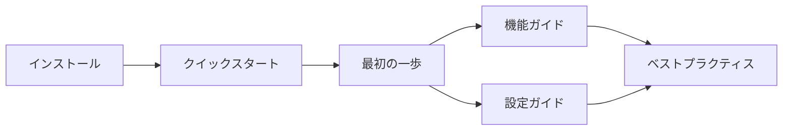

[ホーム](../../README.md) > [ユーザーガイド](../README.md) > [Getting Started](README.md)

---

# Getting Started - はじめに

**最終更新**: 2025-10-11

---

## 🎯 このセクションについて

Getting Startedセクションでは、Amazon Q CLI（Amazon Q CLI）を初めて使う方向けに、インストールから基本的な使い方までを段階的に説明します。

---

## 🚀 推奨学習順序

### 初めての方

1. **[インストールガイド](01_installation.md)** でQ CLIをインストール
2. **[クイックスタート](02_quick-start.md)** で基本的な使い方を体験
3. **[最初の一歩](03_first-steps.md)** で詳しい操作方法を学習

### 既にインストール済みの方

1. **[クイックスタート](02_quick-start.md)** で基本を確認
2. **[最初の一歩](03_first-steps.md)** で詳しい操作方法を学習

### 学習フロー



---

## 📚 ドキュメント一覧

| # | ドキュメント | 所要時間 | 対象ユーザー | 内容 |
|---|-------------|---------|-------------|------|
| 1 | [インストールガイド](01_installation.md) | 10-15分 | 初めてインストールする方 | OS別インストール手順、認証設定、トラブルシューティング |
| 2 | [クイックスタート](02_quick-start.md) | 5分 | すぐに試したい方 | 最短で始めるガイド、基本的なコマンド |
| 3 | [最初の一歩](03_first-steps.md) | 15-20分 | 体系的に学びたい方 | 基本操作の詳細、Tips & Tricks |
| 4 | [料金情報](04_pricing.md) | 5分 | 料金を知りたい方 | Free/Proプランの違い、料金体系、エンタープライズ向けオプション |


---

### 2. [クイックスタート](02_quick-start.md)
**所要時間**: 5分  
**内容**: 最短でQ CLIを使い始めるためのガイドです。

- インストール（簡易版）
- 初回起動と認証
- 最初のチャット
- 基本的なコマンド

**こんな方におすすめ**:
- すぐにQ CLIを試したい方
- 基本的な使い方を素早く学びたい方

---

### 3. [最初の一歩](03_first-steps.md)
**所要時間**: 15-20分  
**内容**: Amazon Q CLIの基本操作を詳しく学びます。

- チャットの基本操作
- ファイル操作
- コマンド実行
- Agent切り替え
- 履歴管理
- 便利な機能
- キーボードショートカット
- 設定のカスタマイズ
- Tips & Tricks
- よくある問題

**こんな方におすすめ**:
- Amazon Q CLIの機能を体系的に学びたい方
- 効果的な使い方を知りたい方

---

## 💡 学習のヒント

### 実際に試しながら学ぶ

ドキュメントを読むだけでなく、実際にQ CLIを起動して試してみましょう。

```bash
q
```

### 小さく始める

最初から複雑なことをしようとせず、簡単な質問やコマンドから始めましょう。

```
> Hello, Q!
> What is Python?
> Create a simple hello world script
```

### エラーを恐れない

Amazon Q CLIは安全に設計されています。エラーが発生しても、システムに影響はありません。

---

## 🚀 クイックアクセス

### よく使う情報

- **[クイックリファレンス](../07_reference/08_quick-reference.md)** ⭐ - よく使うコマンドと設定の早見表
- **[トピック別インデックス](../07_reference/09_topic-index.md)** ⭐ - やりたいことから適切なドキュメントを発見

---

## 🔗 次のステップ

Getting Startedを完了したら、以下のセクションに進んでください：

### 機能を学ぶ
- **[チャット機能](../02_features/01_chat.md)** - チャット機能の詳細
- **[Agent機能](../02_features/02_agents.md)** - Agentのカスタマイズ
- **[MCP 設定](../03_configuration/06_mcp-configuration.md)** - 外部ツールとの連携

### MCPサーバーで機能拡張

Q CLIは、MCPサーバーを追加することで機能を拡張できます。

- **[AWS Labs MCP](https://github.com/awslabs/mcp)** - AWS公式MCPサーバー（最新情報）
- **[MCP設定ガイド](../03_configuration/06_mcp-configuration.md)** - 設定方法

### 設定をカスタマイズする
- **[設定ガイド](../03_configuration/01_overview.md)** - 設定の全体像
- **[Agent設定](../03_configuration/04_agent-configuration.md)** - Agent設定の詳細
- **[設定例集](../03_configuration/07_examples.md)** - 実践的な設定例

### ベストプラクティスを学ぶ
- **[設定のベストプラクティス](../04_best-practices/01_configuration.md)** - 推奨設定
- **[セキュリティ](../04_best-practices/02_security.md)** - セキュリティのベストプラクティス

---

## 🆘 困ったときは

### トラブルシューティング
- **[よくある問題](../06_troubleshooting/02_common-issues.md)** - 一般的な問題と解決方法
- **[FAQ](../06_troubleshooting/01_faq.md)** - よくある質問

### コミュニティ
- **[GitHub Issues](https://github.com/aws/amazon-q-developer-cli/issues)** - バグ報告や機能要望
- **[リソース集](../../03_for-community/02_community/02_resources.md)** - 関連リンク・ツール

---

## 📝 フィードバック

このドキュメントへのフィードバックを歓迎します！

- 分かりにくい箇所
- 不足している情報
- 誤字・脱字

[GitHub Issues](https://github.com/aws/amazon-q-developer-cli/issues) でお知らせください。

---

**作成日**: 2025-10-11  
**最終更新日**: 2025-10-11

## 関連ドキュメント

- [セキュリティ概要](../09_security/01_security-overview.md) - セキュリティの基本原則
- [料金プラン比較ガイド](../05_deployment/02_pricing-comparison.md) - Free/Pro/Enterpriseプランの違い
- [エンタープライズ展開ガイド](../05_deployment/01_enterprise-deployment.md) - 組織での導入方法
