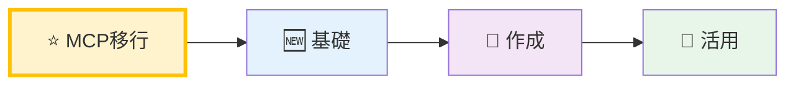
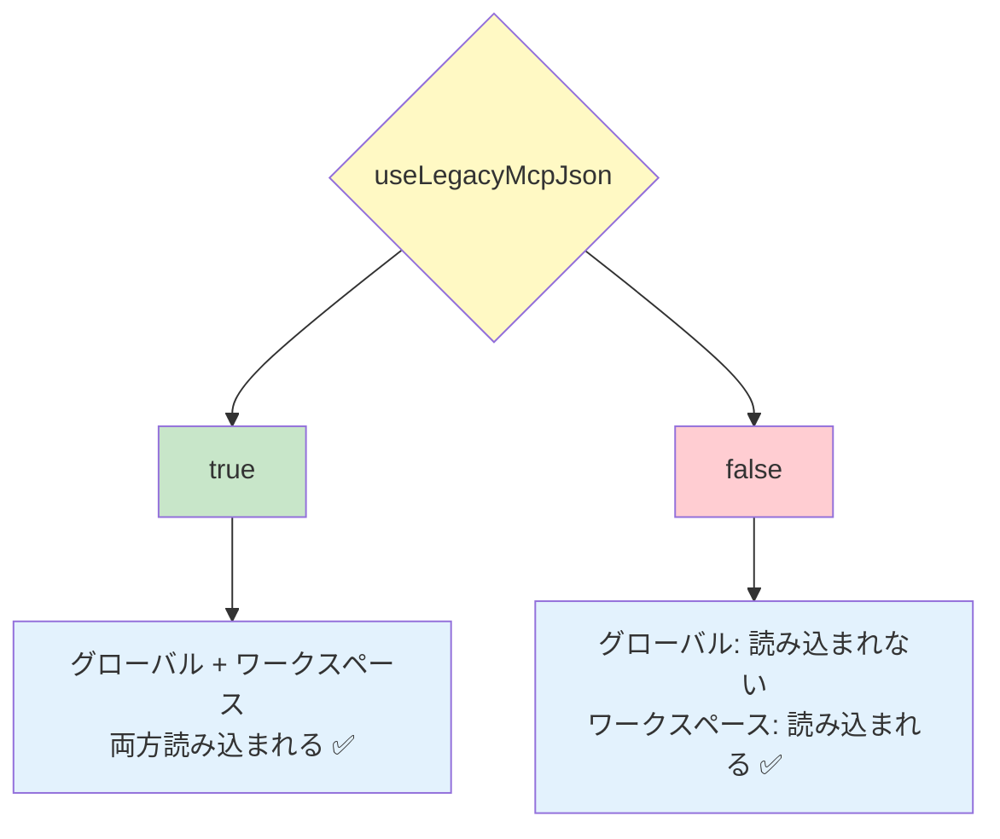

[ホーム](../../README.md) > [ユーザーガイド](../README.md) > [機能ガイド](README.md) > 02 Agents

---

# Agent機能

最終更新: 2025-10-11  
**対象バージョン**: v1.17.0以降

---

## 📋 概要

Agentは、Amazon Q CLIの動作をカスタマイズする機能です。システムプロンプト、利用可能なツール、MCPサーバー連携などを設定できます。

---

## 🚀 クイックナビゲーション

### あなたの状況に合わせて選んでください



**学習パス**:
- ⭐ **MCP移行** (10-15分): レガシーMCP設定からAgent設定への移行
  - 🚨 **`~/.aws/amazonq/mcp.json`使用中の方は必読** → [移行ガイド](#-レガシーmcp設定からの移行ガイド)
- 🆕 **基礎** (5分): Agentの基本概念と仕組みを理解
- 🎨 **作成** (10分): 実際にAgent設定ファイルを作成
- 🔧 **活用** (15分): 高度な設定とカスタマイズ

---

### 📖 このページの構成

| セクション | 内容 | 対象 | 所要時間 |
|-----------|------|------|----------|
| 🤖 **Agentとは** | 基本概念、5ステップ学習、実践例 | 初心者 ⭐ | 約15分 |
| 🔄 **移行ガイド** | レガシーMCP→Agent移行（3シナリオ） | MCP移行者 ⭐ | 約25分 |
| 📝 **Agent管理** | 一覧、切り替え、デフォルト設定 | 初心者〜中級者 | 約3分 |
| 🎨 **Agent作成** | 作成手順、設定例 | 初心者〜中級者 ⭐ | 約2分 |
| 📚 **詳細ガイド** | 設定項目の詳細 | 中級者〜上級者 | 約1分 |
| 💡 **使用例** | 具体的な設定例 | 初心者〜中級者 | 約2分 |
| 🎯 **ユースケース** | 実践的なシナリオ | 中級者 | 約5分 |
| 🔧 **高度な設定** | カスタマイズ、トラブルシューティング | 上級者 | 約7分 |

**推奨する読み方**:

**🟢 初心者向け**（所要時間: 約25分）
- 必読: Agentとは（基本概念）
- 推奨: Agent管理（操作方法） → Agent作成（実践）
- 参考: 使用例（応用）

**🔵 MCP移行者向け**（所要時間: 約30分）
- 必読: 移行ガイド（既存設定を移行）
- 推奨: Agent管理（新しい管理方法） → Agent作成（カスタマイズ）

**🟡 既存ユーザー向け**（所要時間: 約15分）
- 推奨: ユースケース（実践例） → 高度な設定（最適化）
- 参考: 詳細ガイド（設定項目の詳細）

**🔴 トラブルシューティング**（所要時間: 約10分）
- 直接: 高度な設定 > トラブルシューティング項目

---

## 🤖 Agentとは

### 5分で理解するAgent

**Agent = あなた専用のAIアシスタント設定**

Amazon Q Developerを**タスクごとに最適化**する機能です。

---

### ステップ1: Agentの基本を理解する

#### Agentがない場合
```bash
q chat
→ すべてのツールが有効
→ 汎用的な応答
→ 毎回設定を説明する必要がある
```

#### Agentがある場合
```bash
q chat --agent my-project
→ プロジェクト専用のツールのみ
→ プロジェクトに特化した応答
→ 設定を自動で読み込み
```

---

### ステップ2: 実際の問題を見てみる

#### 問題: 「テーブル」の混乱

あなたがウェブアプリケーション開発者だとします：

**シーン1: デザイナーとの会話**
- あなた: 「テーブルのレイアウトを確認したい」
- デザイナー: 「Figmaで確認できます」
- → HTMLテーブルの話

**シーン2: データベース管理者との会話**
- あなた: 「テーブルのスキーマを確認したい」
- DBA: 「PostgreSQLで確認できます」
- → SQLテーブルの話

**問題**: Amazon Q Developerに「テーブルはいくつありますか？」と聞いた時、どちらの意味か分からない！

#### 解決: Agentで文脈を明確化

```bash
# フロントエンド作業時
q chat --agent front-end
> テーブルはいくつありますか？
→ AIはHTMLテーブルとして理解（Figmaツールを使用）

# バックエンド作業時
q chat --agent back-end
> テーブルはいくつありますか？
→ AIはSQLテーブルとして理解（PostgreSQLツールを使用）
```

---

### ステップ3: Agentでできること（4つの機能）

**出典**: [AWS公式ドキュメント - カスタムエージェント設定リファレンス](https://docs.aws.amazon.com/ja_jp/amazonq/latest/qdeveloper-ug/command-line-custom-agents-configuration.html)

#### 機能1: MCPサーバーの切り替え

**何ができる？**: タスクに必要な外部ツールだけを有効化

**例**:
```json
// front-end.json
{
  "mcpServers": {
    "Figma": {
      "command": "npx",
      "args": ["mcp-remote", "http://127.0.0.1:3845/sse"]
    }
  }
}
```

**効果**: デザイン作業時はFigmaツールのみ、データベース作業時はPostgreSQLツールのみ

#### 機能2: ツール権限の制御

**何ができる？**: どのツールを自動承認するか制御

**例**:
```json
{
  "allowedTools": [
    "fs_read",        // ファイル読み取り: 自動承認
    "fs_write",       // ファイル書き込み: 自動承認
    "@Figma"          // Figmaツール全て: 自動承認
  ]
}
```

**効果**: 安全なツールは自動承認、危険なツールは毎回確認

#### 機能3: コンテキストファイルの自動読み込み

**何ができる？**: プロジェクト固有の設定を自動で読み込み

**例**:
```json
{
  "resources": [
    "file://README.md",
    "file://~/.aws/amazonq/react-preferences.md"
  ]
}
```

**効果**: 毎回説明しなくても、AIがプロジェクトを理解

**詳細**: [コンテキスト管理ガイド](../08_guides/README.md) - コンテキストの概念、設定方法、ベストプラクティスを包括的に解説

#### 機能4: 起動時の自動実行

**何ができる？**: Agent起動時にコマンドを自動実行

**例**:
```json
{
  "hooks": {
    "agentSpawn": [
      { "command": "git status" },
      { "command": "npm run" }
    ]
  }
}
```

**効果**: 現在の状態を自動でAIに伝える

---

### ステップ4: 実践例

**出典**: [AWS公式ドキュメント - カスタムエージェントの例](https://docs.aws.amazon.com/ja_jp/amazonq/latest/qdeveloper-ug/command-line-custom-agents-examples.html)

#### 例1: フロントエンド開発者向けAgent

**用途**: React + Figmaでのフロントエンド開発

**設定ファイル**: `~/.aws/amazonq/cli-agents/front-end.json`

```json
{
  "name": "front-end",
  "description": "React + Figmaでのフロントエンド開発用",
  "mcpServers": {
    "Figma": {
      "command": "npx",
      "args": ["mcp-remote", "http://127.0.0.1:3845/sse"]
    }
  },
  "tools": ["*"],
  "allowedTools": [
    "fs_read",
    "fs_write",
    "report_issue",
    "@Figma"
  ],
  "resources": [
    "file://README.md",
    "file://~/.aws/amazonq/react-preferences.md"
  ],
  "hooks": {
    "agentSpawn": [
      { "command": "git status" }
    ]
  }
}
```

**使い方**:
```bash
q chat --agent front-end
> Figmaのデザインを確認して、Reactコンポーネントを作成して
```

**効果**:
- ✅ Figmaツールが自動で有効
- ✅ React設定が自動で読み込まれる
- ✅ Git状態が自動で確認される
- ✅ ファイル操作が自動承認される

#### 例2: バックエンド開発者向けAgent

**用途**: Python + PostgreSQLでのバックエンド開発

**設定ファイル**: `~/.aws/amazonq/cli-agents/back-end.json`

```json
{
  "name": "back-end",
  "description": "Python + PostgreSQLでのバックエンド開発用",
  "mcpServers": {
    "PostgreSQL": {
      "command": "uvx",
      "args": [
        "awslabs.postgres-mcp-server@latest",
        "--resource_arn", "arn:aws:rds:us-east-1:xxxxxxxxxxxx:cluster:xxxxxx",
        "--secret_arn", "arn:aws:secretsmanager:us-east-1:xxxxxxxxxxxx:secret:xxxxx",
        "--database", "dev",
        "--region", "us-east-1",
        "--readonly", "True"
      ]
    }
  },
  "tools": ["*"],
  "allowedTools": [
    "fs_read",
    "report_issue",
    "@PostgreSQL/get_table_schema"
  ],
  "resources": [
    "file://README.md",
    "file://~/.aws/amazonq/python-preferences.md",
    "file://~/.aws/amazonq/sql-preferences.md"
  ],
  "hooks": {
    "agentSpawn": [
      { "command": "git status" }
    ]
  }
}
```

**使い方**:
```bash
q chat --agent back-end
> データベースのスキーマを確認して、FastAPIのエンドポイントを作成して
```

**効果**:
- ✅ PostgreSQLツールが自動で有効
- ✅ Python/SQL設定が自動で読み込まれる
- ✅ データベースは読み取り専用（安全）
- ✅ ファイル書き込みは毎回確認（安全）

---

### ステップ5: 今すぐ始める

#### 最初の一歩

1. **デフォルトAgentを確認**
   ```bash
   q agent list
   ```

2. **Agentを切り替えてみる**
   ```bash
   q chat --agent default
   ```

3. **自分のAgentを作成する**
   - [Agent設定ガイド](../03_configuration/04_agent-configuration.md)を参照

#### 推奨する学習順序

1. ✅ まずはデフォルトAgentで慣れる
2. ✅ 既存のAgentを試す（`q agent list`で確認）
3. ✅ 簡単なAgentを作成する（MCPサーバーなし）
4. ✅ MCPサーバーを追加する
5. ✅ 複数のAgentを使い分ける

#### 参考資料

- [AWSブログ: Amazon Q Developer CLI カスタムエージェントで開発の混乱を乗り越えよう](https://aws.amazon.com/jp/blogs/news/overcome-development-disarray-with-amazon-q-developer-cli-custom-agents/)
- [Agent設定ガイド](../03_configuration/04_agent-configuration.md)
- [MCP設定ガイド](../03_configuration/06_mcp-configuration.md)

---

## 🔄 レガシーMCP設定からの移行ガイド

### 移行が必要な理由

レガシーMCP設定（`~/.aws/amazonq/mcp.json`、`.amazonq/mcp.json`）は後方互換性のために維持されていますが、Agent設定に統合することで以下のメリットがあります：

- ✅ **プロジェクトごとに異なるMCP設定を使い分け**: プロジェクトAではPostgreSQL、プロジェクトBではFigmaなど
- ✅ **ツール権限の細かい制御**: 安全なツールは自動承認、危険なツールは毎回確認
- ✅ **コンテキストファイルの自動読み込み**: プロジェクト固有のREADMEやドキュメントを自動で読み込み
- ✅ **起動時の自動実行コマンド**: `git status`などを自動実行してAIに現在の状態を伝える

---

### あなたの状況を選んでください

以下の3つのシナリオから、あなたの状況に最も近いものを選んでください：

#### シナリオA: グローバルMCP設定のみ使用中
- `~/.aws/amazonq/mcp.json`のみ存在
- すべてのプロジェクトで同じMCP設定を使用
- → [シナリオAの移行手順](#シナリオa-グローバルmcp設定のみ)へ

#### シナリオB: プロジェクトごとにMCP設定を使い分け
- `.amazonq/mcp.json`を各プロジェクトに配置
- プロジェクトごとに異なるMCP設定
- → [シナリオBの移行手順](#シナリオb-プロジェクトごとにmcp設定を使い分け)へ

#### シナリオC: グローバル + プロジェクト固有の組み合わせ
- `~/.aws/amazonq/mcp.json`と`.amazonq/mcp.json`の両方を使用
- 共通設定 + プロジェクト固有設定
- → [シナリオCの移行手順](#シナリオc-グローバル--プロジェクト固有の組み合わせ)へ

---

### シナリオA: グローバルMCP設定のみ

#### 現在の設定

```bash
~/.aws/amazonq/mcp.json
```

```json
{
  "mcpServers": {
    "postgres": {
      "command": "uvx",
      "args": ["awslabs.postgres-mcp-server@latest", ...]
    },
    "github": {
      "command": "npx",
      "args": ["-y", "@modelcontextprotocol/server-github"]
    }
  }
}
```

#### 移行手順

**1. グローバルAgent設定を作成**

```bash
mkdir -p ~/.aws/amazonq/cli-agents
nano ~/.aws/amazonq/cli-agents/default.json
```

**2. 以下の内容を記述**

```json
{
  "$schema": "https://raw.githubusercontent.com/aws/amazon-q-developer-cli/refs/heads/main/schemas/agent-v1.json",
  "name": "default",
  "description": "デフォルトAgent（全プロジェクト共通）",
  "mcpServers": {
    "postgres": {
      "command": "uvx",
      "args": ["awslabs.postgres-mcp-server@latest", ...]
    },
    "github": {
      "command": "npx",
      "args": ["-y", "@modelcontextprotocol/server-github"]
    }
  },
  "tools": ["*"],
  "useLegacyMcpJson": false
}
```

> **💡 重要**: `useLegacyMcpJson: false`を設定することで、グローバルレガシーMCP設定との混在を防ぎます。ただし、ワークスペースレガシーMCP設定（`.amazonq/mcp.json`）は引き続き読み込まれます。

**3. デフォルトAgentに設定**

```bash
q settings chat.defaultAgent default
```

**4. 動作確認**

```bash
q chat
```

チャット内で確認:
```
> /tools
```

MCPサーバーのツールが表示されることを確認してください。

**5. レガシー設定を削除（動作確認後）**

```bash
# バックアップ作成
mv ~/.aws/amazonq/mcp.json ~/.aws/amazonq/mcp.json.backup

# 確認
q chat
> /tools  # MCPツールが表示されることを確認
```

---

### シナリオB: プロジェクトごとにMCP設定を使い分け

#### 現在の設定

```bash
project-a/.amazonq/mcp.json  # PostgreSQL
project-b/.amazonq/mcp.json  # GitHub
project-c/.amazonq/mcp.json  # Figma
```

#### 移行手順

**各プロジェクトで以下を実施**:

**1. ワークスペースAgent設定を作成**

```bash
cd project-a
mkdir -p .amazonq/cli-agents
nano .amazonq/cli-agents/project-a.json
```

**2. プロジェクト固有のAgent設定**

```json
{
  "$schema": "https://raw.githubusercontent.com/aws/amazon-q-developer-cli/refs/heads/main/schemas/agent-v1.json",
  "name": "project-a",
  "description": "Project A用Agent（PostgreSQL）",
  "mcpServers": {
    "postgres": {
      "command": "uvx",
      "args": ["awslabs.postgres-mcp-server@latest", ...]
    }
  },
  "tools": ["*"],
  "allowedTools": [
    "fs_read",
    "fs_write",
    "@postgres"
  ],
  "resources": [
    "file://README.md",
    "file://docs/database-schema.md"
  ],
  "useLegacyMcpJson": false
}
```

> **💡 ポイント**: `allowedTools`でPostgreSQLツールを自動承認、`resources`でプロジェクト固有のドキュメントを自動読み込み

**3. プロジェクトごとにデフォルトAgentを設定（オプション）**

```bash
cd project-a
q settings chat.defaultAgent project-a
```

**4. 動作確認**

```bash
cd project-a
q chat
```

チャット内で確認:
```
> /tools  # PostgreSQLツールが表示されることを確認
```

**5. レガシー設定を削除（動作確認後）**

```bash
cd project-a
mv .amazonq/mcp.json .amazonq/mcp.json.backup
```

---

### シナリオC: グローバル + プロジェクト固有の組み合わせ

#### 現在の設定

```bash
~/.aws/amazonq/mcp.json          # 共通: GitHub, Slack
project-x/.amazonq/mcp.json      # 追加: PostgreSQL
```

#### 移行手順

**1. グローバルAgent設定を作成（共通設定）**

```bash
nano ~/.aws/amazonq/cli-agents/base.json
```

```json
{
  "$schema": "https://raw.githubusercontent.com/aws/amazon-q-developer-cli/refs/heads/main/schemas/agent-v1.json",
  "name": "base",
  "description": "基本Agent（共通ツール）",
  "mcpServers": {
    "github": {
      "command": "npx",
      "args": ["-y", "@modelcontextprotocol/server-github"]
    },
    "slack": {
      "command": "npx",
      "args": ["-y", "@modelcontextprotocol/server-slack"]
    }
  },
  "tools": ["*"],
  "useLegacyMcpJson": false
}
```

**2. プロジェクト固有Agent設定を作成**

```bash
cd project-x
nano .amazonq/cli-agents/project-x.json
```

```json
{
  "$schema": "https://raw.githubusercontent.com/aws/amazon-q-developer-cli/refs/heads/main/schemas/agent-v1.json",
  "name": "project-x",
  "description": "Project X用Agent",
  "mcpServers": {
    "github": {
      "command": "npx",
      "args": ["-y", "@modelcontextprotocol/server-github"]
    },
    "slack": {
      "command": "npx",
      "args": ["-y", "@modelcontextprotocol/server-slack"]
    },
    "postgres": {
      "command": "uvx",
      "args": ["awslabs.postgres-mcp-server@latest", ...]
    }
  },
  "tools": ["*"],
  "allowedTools": [
    "fs_read",
    "fs_write",
    "@github",
    "@slack",
    "@postgres"
  ],
  "resources": [
    "file://README.md"
  ],
  "useLegacyMcpJson": false
}
```

> **⚠️ 重要**: プロジェクト固有Agentには、**共通設定も含める**必要があります。Agent設定は独立しており、他のAgent設定を継承しません。

**3. 動作確認**

```bash
cd project-x
q chat --agent project-x
```

チャット内で確認:
```
> /tools  # GitHub、Slack、PostgreSQLのツールが表示されることを確認
```

**4. レガシー設定を削除（動作確認後）**

```bash
mv ~/.aws/amazonq/mcp.json ~/.aws/amazonq/mcp.json.backup
mv project-x/.amazonq/mcp.json project-x/.amazonq/mcp.json.backup
```

---

### 移行のベストプラクティス

#### ✅ 推奨事項

---

##### 1. 🧪 段階的に移行

**なぜ推奨？**
- 問題発生時の影響範囲を最小化できる
- トラブルシューティングが容易になる
- 学習コストを分散できる

**どうする？**
1. 最もシンプルなプロジェクトから開始
2. 動作確認後、次のプロジェクトへ
3. 問題があれば解決してから次へ

**効果**
- ✅ リスク最小化
- ✅ 問題の早期発見
- ✅ 安全な移行

**避けるべき対比**: ❌ 全プロジェクトを一度に移行 → 問題発生時に全体が影響を受け、原因特定が困難

---

##### 2. 🔒 useLegacyMcpJson: false を設定

**なぜ推奨？**
- グローバルレガシー設定（`~/.aws/amazonq/mcp.json`）との混在を防ぐ
- 意図しない動作を回避できる
- 設定の優先順位を明確化できる

**どうする？**
```json
{
  "useLegacyMcpJson": false,
  "mcpServers": { ... }
}
```

**効果**
- ✅ 予期しない動作を防止
- ✅ 設定が明確
- ✅ デバッグが容易

**避けるべき対比**: ❌ useLegacyMcpJson: true → グローバルレガシー設定が統合され、混乱の原因に

**⚠️ 重要**: `useLegacyMcpJson: true`の場合、グローバルとワークスペースの**両方**のレガシーMCP設定が読み込まれます（詳細は下記参照）

---

##### 3. 🛡️ バックアップを作成

**なぜ推奨？**
- 問題発生時に即座に復旧可能
- 安全な移行を保証できる
- 心理的な安心感が得られる

**どうする？**
```bash
# グローバルレガシー設定
mv ~/.aws/amazonq/mcp.json ~/.aws/amazonq/mcp.json.backup

# ワークスペースレガシー設定
mv .amazonq/mcp.json .amazonq/mcp.json.backup
```

**効果**
- ✅ 復旧が容易
- ✅ リスクゼロ
- ✅ 安心して移行

**避けるべき対比**: ❌ バックアップなしで削除 → 復旧不可、設定を再作成する必要がある

---

##### 4. ✓ 動作確認を徹底

**なぜ推奨？**
- MCPツールが正しく読み込まれているか確認できる
- 問題の早期発見が可能
- 本番使用前に検証できる

**どうする？**
```bash
# MCPツールの確認
q chat
> /tools

# 実際にツールを使用
q chat "AWS CLIでS3バケットを一覧表示して"
```

**効果**
- ✅ 問題の早期発見
- ✅ 安心して使用
- ✅ トラブル回避

**避けるべき対比**: ❌ 動作確認スキップ → 実際の使用時にエラーが発生し、原因特定が困難

---

##### 5. 🎯 プロジェクトごとにAgent作成

**なぜ推奨？**
- プロジェクト固有のツールとリソースを最適化できる
- 不要なツールを排除できる
- セキュリティが向上する

**どうする？**
```json
{
  "allowedTools": ["fs_read", "fs_write", "execute_bash"],
  "resources": ["file:///path/to/project/docs/**/*.md"],
  "mcpServers": { ... }
}
```

**効果**
- ✅ パフォーマンス向上
- ✅ セキュリティ向上
- ✅ 使いやすさ向上

**避けるべき対比**: ❌ すべてのプロジェクトで同じAgent → 不要なツールが読み込まれ、パフォーマンス低下

---

#### ❌ 避けるべき事項（まとめ）

| 避けるべき事項 | 問題 | 影響 | リスク |
|---------------|------|------|--------|
| 全プロジェクトを一度に移行 | 影響範囲が大きい | 問題発生時に全体が影響 | 🔴 高 |
| useLegacyMcpJson: true | グローバルレガシー設定が統合 | 予期しない動作 | 🟡 中 |
| バックアップなしで削除 | 復旧不可 | 設定を再作成 | 🔴 高 |
| 動作確認スキップ | 問題に気づかない | 実際の使用時にエラー | 🟡 中 |
| すべてのプロジェクトで同じAgent | 不要なツールが読み込まれる | パフォーマンス低下 | 🟢 低 |

---

#### 📌 useLegacyMcpJsonフラグの動作



**重要なポイント**:
- `useLegacyMcpJson: true`の場合、グローバルレガシーMCP設定（`~/.aws/amazonq/mcp.json`）**と**ワークスペースレガシーMCP設定（`.amazonq/mcp.json`）の**両方**が読み込まれる
- `useLegacyMcpJson: false`の場合、グローバルレガシーMCP設定は読み込まれないが、ワークスペースレガシーMCP設定は読み込まれる
- グローバルレガシーMCP設定を無効化するには、`useLegacyMcpJson: false`を設定する
- ワークスペースレガシーMCP設定を無効化するには、ファイルを削除するか各サーバーに`disabled: true`を設定する

**グローバルレガシーMCP設定の無効化方法**:
```json
{
  "useLegacyMcpJson": false,
  "mcpServers": { ... }
}
```

---

### よくある質問

#### Q: 複数のAgentで同じMCP設定を使いたい

**A**: 各Agent設定に同じ`mcpServers`をコピーしてください。

Agent設定は独立しており、他のAgent設定を継承しません。共通のMCP設定を使いたい場合は、各Agent設定ファイルに同じ内容をコピーする必要があります。

または、共通のベースAgentを作成し、プロジェクト固有Agentで拡張する方法もあります（シナリオCを参照）。

---

### 移行チェックリスト

#### 準備フェーズ

- [ ] **現在のMCP設定を確認**
  ```bash
  cat ~/.aws/amazonq/mcp.json
  cat .amazonq/mcp.json
  ```

- [ ] **バックアップを作成**
  ```bash
  cp ~/.aws/amazonq/mcp.json ~/.aws/amazonq/mcp.json.backup
  cp .amazonq/mcp.json .amazonq/mcp.json.backup
  ```

- [ ] **既存のAgent設定を確認**
  ```bash
  q agent list
  ```

#### 移行フェーズ

- [ ] **Agent設定ファイルを作成**
  ```bash
  # グローバル（推奨）
  mkdir -p ~/.aws/amazonq/cli-agents
  nano ~/.aws/amazonq/cli-agents/my-agent.json
  
  # または ワークスペース
  mkdir -p .amazonq/cli-agents
  nano .amazonq/cli-agents/my-agent.json
  ```

- [ ] **Agent設定を記述**
  - レガシーMCP設定の`mcpServers`の**中身だけ**をコピー
  - `useLegacyMcpJson: false`を設定
  - `allowedTools`と`resources`を追加（オプション）

- [ ] **Agent設定を確認**
  ```bash
  q agent list  # 新しいAgentが表示されることを確認
  ```

#### 検証フェーズ

- [ ] **動作確認**
  ```bash
  q chat --agent my-agent
  ```
  
  チャット内で確認:
  ```
  > /tools  # MCPツールが表示されることを確認
  ```

- [ ] **デフォルトAgentに設定（オプション）**
  ```bash
  q settings chat.defaultAgent my-agent
  ```

#### クリーンアップフェーズ

- [ ] **レガシーMCP設定を削除**
  ```bash
  rm ~/.aws/amazonq/mcp.json
  rm .amazonq/mcp.json
  ```

---

### トラブルシューティング

| 問題 | 原因 | 解決策 |
|------|------|--------|
| MCPサーバーが起動しない | `useLegacyMcpJson: true`のまま | `useLegacyMcpJson: false`に変更 |
| MCPサーバーが起動しない | `mcpServers`の構造が間違っている | レガシー設定の`mcpServers`の**中身だけ**をコピー |
| MCPサーバーが起動しない | JSON構文エラー | `cat file.json \| jq .`で構文チェック |
| MCPサーバーが重複起動 | レガシー設定が残っている | レガシー設定を削除 |
| Agentが表示されない | ファイル名と`name`不一致 | ファイル名を`{name}.json`に変更 |
| ツールが自動承認されない | `allowedTools`が設定されていない | `allowedTools`にツール名を追加 |

---

## 📝 Agent管理

### Agent一覧の表示

```bash
q agent list
```

**出力例**:
```
aws-all            ~/.aws/amazonq/cli-agents
default            ~/.aws/amazonq/cli-agents
my-custom-agent    ~/.config/amazonq/agents
```

---

### Agent切り替え

#### 起動時に指定
```bash
q --agent my-agent
```

#### チャット内で切り替え
```
> /agent swap my-agent
```

または引数なしで対話的に選択：
```
> /agent swap
```

---

### デフォルトAgent設定

```bash
# デフォルトAgentを設定
q settings chat.defaultAgent my-agent

# 確認
q settings chat.defaultAgent
```

---

## 🎨 Agent作成

### 基本的な作成方法

1. **設定ファイルを作成**
   ```bash
   mkdir -p ~/.aws/amazonq/cli-agents
   ```

2. **Agent定義ファイルを作成**
   ```bash
   vi ~/.aws/amazonq/cli-agents/my-agent.json
   ```

3. **設定内容を記述**
   ```json
   {
     "name": "my-agent",
     "description": "My custom agent",
     "prompt": "You are a helpful assistant specialized in...",
     "tools": ["fs_read", "fs_write", "execute_bash"],
     "mcpServers": ["my-mcp-server"]
   }
   ```

---

## 📚 詳細ガイド

より詳細な設定方法については、以下のドキュメントを参照してください：

- **[Agent設定ガイド](../03_configuration/04_agent-configuration.md)** - 詳細な設定方法
- **[設定例集](../03_configuration/07_examples.md)** - 実践的な設定例
- **[MCP設定ガイド](../03_configuration/06_mcp-configuration.md)** - MCPサーバー連携

---

## 💡 使用例

### 例1: AWS専門Agent

```json
{
  "name": "aws-expert",
  "description": "AWS専門家Agent",
  "prompt": "You are an AWS expert. Provide detailed AWS-specific guidance.",
  "tools": ["use_aws", "fs_read"]
}
```

### 例2: セキュアAgent

```json
{
  "name": "secure-agent",
  "description": "セキュリティ重視Agent",
  "prompt": "You are a security-focused assistant.",
  "tools": ["fs_read"]
}
```

---

## 🎯 実践的なユースケース

### フロントエンド開発Agent

フロントエンド開発に特化したAgentの設定例です。Figma Dev ModeのMCPサーバーと連携し、React開発に最適化されたコンテキストを提供します。

**設定例**:
```json
{
  "name": "front-end",
  "description": "フロントエンド開発専用Agent",
  "prompt": "You are a frontend development expert specializing in React and modern web technologies.",
  "mcpServers": {
    "figma": {
      "command": "npx",
      "args": ["-y", "@figma/mcp-server-figma"],
      "env": {
        "FIGMA_PERSONAL_ACCESS_TOKEN": "${env:FIGMA_TOKEN}"
      }
    }
  },
  "tools": ["*"],
  "allowedTools": [
    "fs_read",
    "fs_write",
    "report_issues",
    "@figma"
  ],
  "resources": [
    "file://README.md",
    "file://.amazonq/rules/react-preferences.md"
  ],
  "hooks": {
    "prePrompt": ["git status"]
  }
}
```

**特徴**:
- **Figma連携**: デザインファイルから直接コンポーネント情報を取得
- **React設定**: React固有のコーディング規約を自動読み込み
- **HTML/CSSコンテキスト**: フロントエンド開発に特化したコンテキスト最適化
- **Git状態確認**: 変更ファイルを自動的にコンテキストに含める

---

### バックエンド開発Agent

バックエンド開発に特化したAgentの設定例です。PostgreSQL MCPサーバーと連携し、データベース操作とPython/SQL開発に最適化されています。

**設定例**:
```json
{
  "name": "back-end",
  "description": "バックエンド開発専用Agent",
  "prompt": "You are a backend development expert specializing in Python, SQL, and database design.",
  "mcpServers": {
    "postgres": {
      "command": "npx",
      "args": ["-y", "@modelcontextprotocol/server-postgres"],
      "env": {
        "POSTGRES_CONNECTION_STRING": "${env:DATABASE_URL}"
      }
    }
  },
  "tools": ["*"],
  "allowedTools": [
    "fs_read",
    "report_issues",
    "@postgres",
    "@postgres/get_table_schema"
  ],
  "resources": [
    "file://README.md",
    "file://.amazonq/rules/python-preferences.md",
    "file://.amazonq/rules/sql-preferences.md"
  ],
  "hooks": {
    "prePrompt": ["git status"]
  }
}
```

**特徴**:
- **PostgreSQL連携**: データベーススキーマ情報を直接取得
- **Python/SQL設定**: 言語固有のコーディング規約を自動読み込み
- **データベースコンテキスト**: テーブル構造に特化したコンテキスト最適化
- **粒度制御**: MCPサーバー全体と特定ツールの両方を許可

---

## 🔧 高度な設定

### allowedToolsの粒度制御

`allowedTools`では、ツールの許可範囲を細かく制御できます。

**MCPサーバー全体を許可**:
```json
{
  "allowedTools": [
    "@figma",
    "@postgres"
  ]
}
```

**特定ツールのみ許可**:
```json
{
  "allowedTools": [
    "@postgres/get_table_schema",
    "@postgres/query_database"
  ]
}
```

**組み合わせ**:
```json
{
  "allowedTools": [
    "fs_read",
    "fs_write",
    "@figma",
    "@postgres/get_table_schema"
  ]
}
```

**セキュリティ考慮事項**:
- 最小権限の原則に従い、必要なツールのみを許可
- 本番環境では特定ツールのみの許可を推奨
- 開発環境では`"*"`（全ツール）も選択肢

---

### resourcesのglobパターン

`resources`では、ワイルドカードを使用して複数のファイルを一括指定できます。

**基本的なワイルドカード**:
```json
{
  "resources": [
    "file://.amazonq/rules/*.md",
    "file://docs/**/*.md"
  ]
}
```

**IDEプラグインルールの活用**:
```json
{
  "resources": [
    "file://.amazonq/rules/**/*.md"
  ]
}
```

これにより、Amazon Q Developer IDEプラグインで定義したルールをCLIでも活用できます。

**パス指定のベストプラクティス**:
- プロジェクトルートからの相対パスを使用
- `**`で再帰的なディレクトリ検索
- `*`で単一階層のワイルドカード
- 大きなファイルは個別指定を推奨

---

### hooksによる動的コンテキスト

`hooks`を使用すると、プロンプト実行前に自動的にコマンドを実行し、その結果をコンテキストに含めることができます。

**git status実行例**:
```json
{
  "hooks": {
    "prePrompt": ["git status"]
  }
}
```

**複数コマンドの実行**:
```json
{
  "hooks": {
    "prePrompt": [
      "git status",
      "git diff --stat"
    ]
  }
}
```

**プロジェクト状態の自動取得**:
```json
{
  "hooks": {
    "prePrompt": [
      "git status",
      "npm list --depth=0"
    ]
  }
}
```

**活用シーン**:
- 変更ファイルの自動検出
- 依存関係の状態確認
- ブランチ情報の取得
- ビルド状態の確認

---

### Stop Hook（v1.18.0+）

Stop Hookは、会話ターン終了時（Assistantの応答完了時）に自動的に実行されるフックです。

**主な用途**:
- コンパイル
- テスト実行
- コードフォーマット
- クリーンアップ処理

**設定例**:
```json
{
  "hooks": {
    "stop": {
      "command": "npm run format",
      "timeout": 30000
    }
  }
}
```

**実用例**:

**1. コンパイル**:
```json
{
  "hooks": {
    "stop": {
      "command": "cargo build",
      "timeout": 60000
    }
  }
}
```

**2. テスト実行**:
```json
{
  "hooks": {
    "stop": {
      "command": "npm test",
      "timeout": 120000
    }
  }
}
```

**3. コードフォーマット**:
```json
{
  "hooks": {
    "stop": {
      "command": "prettier --write .",
      "timeout": 30000
    }
  }
}
```

**フックイベント形式**:
```json
{
  "hook_event_name": "stop",
  "cwd": "/current/working/directory"
}
```

**終了コードの動作**:
- **0**: フック成功
- **その他**: STDERRを警告として表示

**注意事項**:
- デフォルトタイムアウト: 30秒（設定可能）
- Stop Hookはツール固有ではないため、matcherは使用しない

**詳細**: リポジトリの `docs/hooks.md` を参照

---

## 📚 関連ドキュメント

- [Agent設定ガイド](../03_configuration/04_agent-configuration.md)
- [MCP設定ガイド](../03_configuration/06_mcp-configuration.md)
- [設定例集](../03_configuration/07_examples.md)

---

## 📚 参考資料

- [AWSブログ: Amazon Q Developer CLIのカスタムエージェントで開発の混乱を克服する](https://aws.amazon.com/jp/blogs/news/overcome-development-disarray-with-amazon-q-developer-cli-custom-agents/)

---

**情報源**:
- GitHubソース: `crates/chat-cli/src/cli/agent/`
- 確認バージョン: v1.17.0
- 確認日: 2025-10-09

**作成日**: 2025-10-11  
最終更新: 2025-10-11
---

**関連トピック**:
- [よくある問題と解決方法](../06_troubleshooting/02_common-issues.md)
- [FAQ](../06_troubleshooting/01_faq.md)
