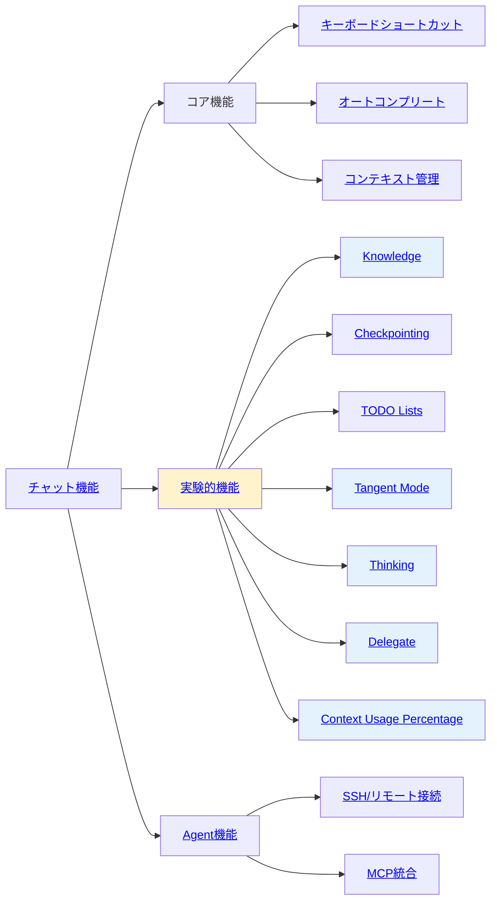

[ホーム](../../README.md) > [ユーザーガイド](../README.md) > [機能ガイド](README.md)

---

# 機能ガイド

---

## 📋 このセクションについて

機能ガイドでは、Q CLIの各機能の使い方を詳しく説明します。

---

## 🚀 クイックアクセス

### よく使う情報

- **[クイックリファレンス](../07_reference/08_quick-reference.md)** ⭐ - よく使うコマンドと設定の早見表
- **[トピック別インデックス](../07_reference/09_topic-index.md)** ⭐ - やりたいことから適切なドキュメントを発見

---

## 📚 ドキュメント一覧

| # | 機能 | 対象ユーザー | 内容 |
|---|------|-------------|------|
| 1 | [チャット機能](01_chat.md) | 全レベル | チャット機能、コマンド、AIツール |
| 2 | [Agent機能](02_agents.md) | 中級者以上 | Agent管理、作成、カスタマイズ |
| 3 | [オートコンプリート](03_autocomplete.md) | 全レベル | オートコンプリート機能 |
| 4 | [キーボードショートカット](04_keyboard-shortcuts.md) | 全レベル | ショートカット一覧と活用方法 |
| 5 | [Checkpoint機能](05_checkpoints.md) | 中級者以上 | Checkpoint機能の使い方 |
| 6 | [SSH/リモート](06_ssh-remote.md) | 中級者以上 | リモート環境での使用 |
| 7 | [実験的機能](07_experimental.md) | 上級者 | 実験的機能（Tangent, TODO, Thinking, Delegate） |

---

## 📂 02_chat-commands/ - チャット内コマンド詳細

チャット機能の詳細なコマンドガイドです。各機能別に分類されています：

| ファイル | 内容 | 主要コマンド | 対象ユーザー |
|---------|------|-------------|-------------|
| [01_basic-commands.md](02_chat-commands/01_basic-commands.md) | 基本・会話管理 | help, save, load, quit, clear, paste, tangent | 全レベル |
| [02_context-management.md](02_chat-commands/02_context-management.md) | コンテキスト管理 | context, compact, hooks | 中級者以上 |
| [03_prompt-management.md](02_chat-commands/03_prompt-management.md) | プロンプト管理 | prompts, editor | 中級者以上 |
| [04_knowledge-management.md](02_chat-commands/04_knowledge-management.md) | Knowledge管理 | knowledge show/add/remove/update/clear/cancel | 中級者以上 |
| [05_checkpoint-management.md](02_chat-commands/05_checkpoint-management.md) | Checkpoint管理 | checkpoint init/list/restore/expand/diff/clean | 上級者 |
| [06_todo-management.md](02_chat-commands/06_todo-management.md) | TODO管理 | todos view/resume/clear-finished/delete | 中級者以上 |
| [07_agent-management.md](02_chat-commands/07_agent-management.md) | Agent管理 | agent, agent list/switch, model | 中級者以上 |
| [08_developer-commands.md](02_chat-commands/08_developer-commands.md) | 開発者向け | logdump, tools, mcp, reply, usage, experiment | 上級者 |

### 📖 学習順序

**初心者向け**:
1. [基本コマンド・会話管理](02_chat-commands/01_basic-commands.md) - 基本操作をマスター
2. [コンテキスト管理](02_chat-commands/02_context-management.md) - ファイル認識を理解
3. [Agent管理](02_chat-commands/07_agent-management.md) - プロジェクト別設定を学習

**中級者向け**:
1. [プロンプト管理](02_chat-commands/03_prompt-management.md) - 効率化テクニック
2. [Knowledge管理](02_chat-commands/04_knowledge-management.md) - 大規模プロジェクト対応
3. [TODO管理](02_chat-commands/06_todo-management.md) - タスク管理の活用

**上級者向け**:
1. [Checkpoint管理](02_chat-commands/05_checkpoint-management.md) - ワークスペース管理
2. [開発者向けコマンド](02_chat-commands/08_developer-commands.md) - トラブルシューティング

---

## 🚀 推奨読み順

### 初めての方
1. **[チャット機能](01_chat.md)** - 基本を理解
2. **[基本コマンド・会話管理](02_chat-commands/01_basic-commands.md)** - 基本操作をマスター
3. **[キーボードショートカット](04_keyboard-shortcuts.md)** - 効率的な操作方法
4. **[Agent機能](02_agents.md)** - カスタマイズ方法を学習

### 中級者の方
1. **[Agent機能](02_agents.md)** - カスタマイズを深める
2. **[コンテキスト管理](02_chat-commands/02_context-management.md)** - 効果的なファイル管理
3. **[プロンプト管理](02_chat-commands/03_prompt-management.md)** - 効率化テクニック
4. **[実験的機能](07_experimental.md)** - 高度な機能を活用

### 上級者の方
1. **[開発者向けコマンド](02_chat-commands/08_developer-commands.md)** - トラブルシューティング
2. **[Checkpoint管理](02_chat-commands/05_checkpoint-management.md)** - ワークスペース管理
3. **[実験的機能](07_experimental.md)** - 最新機能の活用

---

## 📊 統計情報

- **総ドキュメント数**: 15ファイル（メイン7 + チャットコマンド8）
- **チャット内コマンド**: 25個（8分類）
- **対象バージョン**: v1.13.0以降
- **最終更新**: 2025年11月13日

---

最終更新: 2025年11月13日
1. **[実験的機能](07_experimental.md)** - 最新機能を試す
2. **[SSH/リモート接続](06_ssh-remote.md)** - リモート環境での活用

### 機能関係図

**凡例**:
- **コア機能**: 常に利用可能な基本機能
- **実験的機能**: 設定で有効化が必要な機能（黄色背景）
- **Agent機能**: Agent設定に依存する機能

**注**: MCPサーバーの詳細は[MCP設定ガイド](../03_configuration/04_mcp-configuration.md)、実験的機能の詳細は[実験的機能ガイド](07_experimental.md)を参照してください。

---

最終更新: 2025-11-01
