# 機能ガイド

**最終更新**: 2025-10-11

---

## 📋 このセクションについて

機能ガイドでは、Q CLIの各機能の使い方を詳しく説明します。

---

## 📚 ドキュメント一覧

| # | 機能 | 対象ユーザー | 内容 |
|---|------|-------------|------|
| 1 | [チャット機能](01_chat.md) | 全レベル | チャット機能の詳細 |
| 2 | [Agent機能](02_agents.md) | 中級者以上 | Agent機能の詳細 |
| 3 | [Checkpoint機能](05_checkpoints.md) | 中級者以上 | Checkpoint機能の使い方 |
| 4 | [キーボードショートカット](04_keyboard-shortcuts.md) | 全レベル | ショートカット一覧と活用方法 |
| 5 | [オートコンプリート](03_autocomplete.md) | 全レベル | オートコンプリート機能 |
| 6 | [SSH/リモート接続](06_ssh-remote.md) | 中級者以上 | リモート環境での使用 |
| 7 | [実験的機能](07_experimental.md) | 上級者 | 実験的機能の紹介 |

---

## 🚀 推奨読み順

### 初めての方
1. **[チャット機能](01_chat.md)** - 基本を理解
2. **[キーボードショートカット](04_keyboard-shortcuts.md)** - 効率的な操作方法
3. **[Agent機能](02_agents.md)** - カスタマイズ方法を学習

### 中級者の方
1. **[Agent機能](02_agents.md)** - カスタマイズを深める
2. **[実験的機能](07_experimental.md)** - 高度な機能を活用

### 上級者の方
1. **[実験的機能](07_experimental.md)** - 最新機能を試す
2. **[SSH/リモート接続](06_ssh-remote.md)** - リモート環境での活用

### 機能関係図

```mermaid
graph TB
    Chat[チャット機能] --> Core[コア機能]
    Chat --> Exp[実験的機能]
    Chat --> Agent[Agent機能]
    
    Core --> Keyboard[キーボードショートカット]
    Core --> Autocomplete[オートコンプリート]
    Core --> Context[コンテキスト管理]
    
    Exp --> Knowledge[Knowledge]
    Exp --> Checkpoint[Checkpoint]
    Exp --> TODO[TODO]
    Exp --> Tangent[Tangent Mode]
    Exp --> Thinking[Thinking]
    Exp --> Delegate[Delegate Mode]
    Exp --> ContextUsage[Context Usage Indicator]
    
    Agent --> SSH[SSH/リモート接続]
    Agent --> MCP[MCP統合]
    
    style Exp fill:#fff3cd
    style Knowledge fill:#e3f2fd
    style Checkpoint fill:#e3f2fd
    style TODO fill:#e3f2fd
    style Tangent fill:#e3f2fd
    style Thinking fill:#e3f2fd
    style Delegate fill:#e3f2fd
    style ContextUsage fill:#e3f2fd
```

**凡例**:
- **コア機能**: 常に利用可能な基本機能
- **実験的機能**: 設定で有効化が必要な機能（黄色背景）
- **Agent機能**: Agent設定に依存する機能

**注**: MCPサーバーの詳細は[MCP設定ガイド](../03_configuration/06_mcp-configuration.md)、実験的機能の詳細は[実験的機能ガイド](07_experimental.md)を参照してください。

---

**作成日**: 2025-10-11
