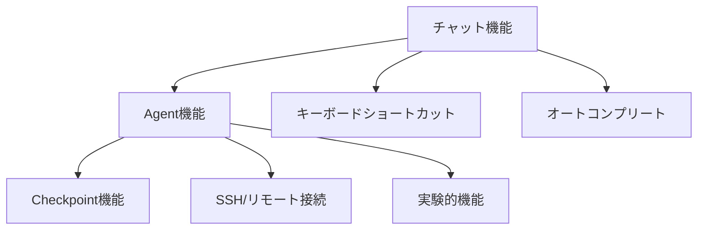

# 機能ガイド

**最終更新**: 2025-10-11

---

## 📋 このセクションについて

機能ガイドでは、Q CLIの各機能の使い方を詳しく説明します。

---

## 📚 ドキュメント一覧

| # | 機能 | 対象ユーザー | 内容 |
|---|------|-------------|------|
| 1 | [チャット機能](01_chat.md) | 全レベル | チャット機能の詳細 |
| 2 | [Agent機能](02_agents.md) | 中級者以上 | Agent機能の詳細 |
| 3 | [Checkpoint機能](05_checkpoints.md) | 中級者以上 | Checkpoint機能の使い方 |
| 4 | [キーボードショートカット](04_keyboard-shortcuts.md) | 全レベル | ショートカット一覧と活用方法 |
| 5 | [オートコンプリート](03_autocomplete.md) | 全レベル | オートコンプリート機能 |
| 6 | [SSH/リモート接続](06_ssh-remote.md) | 中級者以上 | リモート環境での使用 |
| 7 | [実験的機能](07_experimental.md) | 上級者 | 実験的機能の紹介 |

---

## 🚀 推奨読み順

### 初めての方
1. **[チャット機能](01_chat.md)** - 基本を理解
2. **[キーボードショートカット](04_keyboard-shortcuts.md)** - 効率的な操作方法
3. **[Agent機能](02_agents.md)** - カスタマイズ方法を学習

### 中級者の方
1. **[Agent機能](02_agents.md)** - カスタマイズを深める
2. **[実験的機能](07_experimental.md)** - 高度な機能を活用

### 上級者の方
1. **[実験的機能](07_experimental.md)** - 最新機能を試す
2. **[SSH/リモート接続](06_ssh-remote.md)** - リモート環境での活用

### 機能関係図

**注**: MCPサーバーの詳細は[MCP設定ガイド](../03_configuration/06_mcp-configuration.md)、Knowledge機能の詳細は[パフォーマンス最適化](../04_best-practices/03_performance.md)を参照してください。

---

**作成日**: 2025-10-11
