[ホーム](../../README.md) > [ユーザーガイド](../README.md) > [設定ガイド](README.md) > 06 Mcp Configuration

---

# MCP設定

**ドキュメント対象バージョン**: v1.13.0以降

> **Note**: 本サイトではv1.13.0以降のMCP設定を対象に記述しています。

---

## 📋 このガイドについて

このドキュメントでは、Q CLIのMCP（Model Context Protocol）サーバー設定について詳しく説明します。

### 🔗 AWS公式MCPサーバー

> **重要**: AWS公式MCPサーバーの最新情報は、以下の公式リポジトリを参照してください。
>
> **[AWS Labs MCP - GitHub](https://github.com/awslabs/mcp)**
>
> このリポジトリには以下が含まれます：
> - 利用可能なMCPサーバー一覧
> - 各サーバーの詳細ドキュメント
> - インストール手順と設定例
> - トラブルシューティング
> - 最新のアップデート情報

---

## 🎯 MCPとは

MCP（Model Context Protocol）は、AIモデルと外部ツールを接続するための標準プロトコルです。MCPサーバーを使用することで、Q CLIの機能を拡張できます。

### MCPでできること
- 外部APIとの連携
- データベースアクセス
- カスタムツールの追加
- サードパーティサービスとの統合

---

## 🛠️ 利用可能なAWS MCPサーバー

AWS Labsは、AWSサービスと連携する高品質なMCPサーバーを提供しています。

### 主要なMCPサーバー

以下は代表的なAWS公式MCPサーバーです。

| サーバー名 | 用途 | 主な機能 |
|-----------|------|---------|
| **AWS MCP** | AWS操作 | EC2、S3、Lambda等のAWSサービス操作 |
| **Bedrock MCP** | 生成AI | Amazon Bedrockモデルの呼び出し |
| **CloudWatch MCP** | 監視・ログ | ログ検索、メトリクス取得 |
| **DynamoDB MCP** | データベース | DynamoDBテーブル操作 |
| **S3 MCP** | ストレージ | S3バケット操作、ファイル管理 |

> **💡 最新情報**: 利用可能なサーバーの完全なリストと詳細は、**[AWS Labs MCP公式リポジトリ](https://github.com/awslabs/mcp)** を参照してください。

### クイックスタート

AWS公式MCPサーバーの基本的な使い方：

**1. 公式リポジトリで詳細を確認**

[AWS Labs MCP](https://github.com/awslabs/mcp)にアクセスし、使用したいサーバーのREADMEを確認します。

**2. Agent設定に追加**

```json
{
  "name": "my-agent",
  "mcpServers": {
    "aws": {
      "command": "npx",
      "args": ["-y", "@aws/mcp-server-aws"]
    }
  }
}
```

**3. Q CLIで使用**

```bash
q agent set-default my-agent
q chat
```

チャット内で指示：
```
> EC2インスタンスの一覧を表示して
```

> **⚠️ 注意**: 各サーバーのインストール方法、設定オプション、認証情報の設定、トラブルシューティングは、**[公式リポジトリ](https://github.com/awslabs/mcp)** を参照してください。

---

## 📁 MCP設定の配置場所

### Agent設定内に記述

```json
{
  "name": "my-agent",
  "mcpServers": {
    "server-name": {
      // MCP設定
    }
  }
}
```

### レガシーMCP設定（後方互換性）

```
~/.aws/amazonq/mcp.json          # グローバル
<workspace>/.amazonq/mcp.json    # ローカル
```

**注意**: レガシーMCP設定は後方互換性のために維持されています。Agent設定の`useLegacyMcpJson: true`で有効化できます。

---

## 🔄 MCP設定の読込フロー

### 設定の優先順位（全体像）

Q CLIの設定は、以下の階層で優先順位が決定されます：

#### 優先順位レベル

| レベル | 設定種別 | 対象 | 設定方法 | 説明 |
|--------|---------|------|---------|------|
| **1** | 管理者設定 | MCP機能の有効/無効 | AWS側の組織ポリシー | 最優先。ローカルで変更不可 |
| **2** | コマンドライン引数 | Agent選択 | `--agent <NAME>` | 実行時に指定 |
| **3** | データベース設定 | デフォルトAgent | `chat.defaultAgent` | `q settings`で設定 |
| **4** | ファイルベース設定 | MCP/Agent設定 | 設定ファイル | 次項の表を参照 |
| **5** | デフォルト値 | 全設定 | コード内定義 | 最低優先 |

#### 重要な注意事項

> **⚠️ 管理者設定の最優先度**
>
> **レベル1の管理者設定でMCPが無効化されている場合、レベル2〜5の設定に関わらずMCP機能は使用できません。**
>
> - 管理者設定は AWS CodeWhisperer プロファイルの `opt_in_features.mcp_configuration` で制御されます
> - 組織管理者のみが変更可能で、個人ユーザーはローカルで変更できません
> - MCP無効時は警告が表示されます: "⚠️ WARNING: MCP functionality has been disabled by your administrator."

#### 設定レベルの詳細

| レベル | 設定場所 | 制御項目 | 変更方法 | 優先度 |
|--------|----------|----------|----------|--------|
| **レベル1: 管理者設定（AWS側）** | AWS CodeWhisperer プロファイル | MCP機能の有効/無効 | 組織管理者がAWS側で設定 | 絶対優先（他の全設定を上書き） |
| **レベル2: コマンドライン引数** | `q chat`コマンドの引数 | Agent選択（`--agent <NAME>`） | コマンド実行時に指定 | データベース設定・ファイル設定より優先 |
| **レベル3: データベース設定** | `~/.local/share/amazon-q/settings.json` | デフォルトAgent（`chat.defaultAgent`） | `q settings chat.defaultAgent <NAME>` | ファイル設定より優先 |
| **レベル4: ファイルベース設定** | Agent設定ファイル、レガシーMCP設定ファイル | MCP/Agent詳細設定 | JSONファイルを直接編集 | 次項の「MCP設定ファイルの優先順位」を参照 |
| **レベル5: デフォルト値** | Q CLIのソースコード | 全設定のデフォルト値 | 変更不可 | 最低（他の設定がない場合のみ使用） |

---

### MCP設定ファイルの優先順位

レベル4（ファイルベース設定）内での優先順位は以下の通りです：

| 優先度 | 設定種別 | パス | 説明 |
|--------|---------|------|------|
| **1** | Agent設定内のMCPサーバー | `.amazonq/cli-agents/{agent_name}.json`<br/>`~/.aws/amazonq/cli-agents/{agent_name}.json` | 最優先。Agent設定内の`mcpServers`セクション |
| **2** | ワークスペースレガシーMCP設定 | `.amazonq/mcp.json` | 中優先。プロジェクト固有のMCP設定 |
| **3** | グローバルレガシーMCP設定 | `~/.aws/amazonq/mcp.json` | 最低優先。ユーザー全体のMCP設定 |

**重複処理**: 同じ`command`を持つMCPサーバーは、上位優先度のものが使用されます（下位は無視）。

### 全パターン対応フロー図

> **💡 このフロー図について**
> 
> このフロー図は、Q CLIのソースコード調査と全パターン検証に基づいて作成されました。
> 
> **出典**:
> - [Agent読み込みロジック](https://github.com/aws/amazon-q-developer-cli/blob/main/crates/chat-cli/src/cli/agent/mod.rs) - `use_legacy_mcp_json`フラグの定義とデフォルト値
> - [MCP読み込みロジック](https://github.com/aws/amazon-q-developer-cli/blob/main/crates/chat-cli/src/cli/mcp.rs) - MCP設定の読み込みフロー
> 
> **検証方法**:
> - ソースコードで全11パターン（A-1, B-1～B-10）の動作を確認
> - 各分岐条件（MCP有効/無効、Agent存在、use_legacy_mcp_json等）を確認
> - 重複処理（commandフィールドでの判定）を確認
> - 優先順位（Agent設定 > ワークスペースレガシー > グローバルレガシー）を確認

```mermaid
flowchart TD
    Start([Q CLI起動]) --> CheckMCPEnabled{MCP有効?<br/>管理者設定}
    
    CheckMCPEnabled -->|無効<br/>パターンA-1| MCPDisabled[MCP機能無効<br/>警告表示]
    CheckMCPEnabled -->|有効| LoadAgents[Agent設定読込開始]
    
    MCPDisabled --> End([終了<br/>MCPサーバーなし])
    
    LoadAgents --> CheckCWD{カレントディレクトリ<br/>= ホームディレクトリ?}
    
    CheckCWD -->|Yes| SkipLocal[ワークスペースAgent<br/>読込スキップ]
    CheckCWD -->|No| LoadLocal[ワークスペースAgent読込<br/>.amazonq/cli-agents/*.json]
    
    SkipLocal --> LoadGlobal[グローバルAgent読込<br/>~/.aws/amazonq/cli-agents/*.json]
    LoadLocal --> CheckConflict{Agent名衝突?}
    
    CheckConflict -->|衝突あり<br/>パターンB-10| UseWorkspace[ワークスペース版使用<br/>警告表示]
    CheckConflict -->|衝突なし| LoadGlobal
    
    UseWorkspace --> LoadGlobal
    LoadGlobal --> CheckAgentExists{Agentファイル<br/>存在する?}
    
    CheckAgentExists -->|存在しない<br/>パターンB-1,2,3| CreateDefault[デフォルトAgent作成<br/>use_legacy_mcp_json=true<br/>mcp_servers=空]
    CheckAgentExists -->|存在する<br/>パターンB-4~9| LoadAgent[指定Agent読込]
    
    CreateDefault --> LoadLegacyForDefault[グローバルレガシーMCP読込<br/>~/.aws/amazonq/mcp.json]
    LoadAgent --> CheckLegacyFlag{use_legacy_mcp_json<br/>= true?}
    
    CheckLegacyFlag -->|Yes<br/>パターンB-4,5,6,7| LoadLegacyGlobal[グローバルレガシーMCP読込<br/>~/.aws/amazonq/mcp.json]
    CheckLegacyFlag -->|No<br/>パターンB-8,9| SkipLegacyGlobal[グローバルレガシーMCP<br/>読込スキップ]
    
    LoadLegacyForDefault --> MergeDefault[デフォルトAgentにマージ<br/>重複commandスキップ]
    LoadLegacyGlobal --> MergeAgent[Agentにマージ<br/>重複commandスキップ]
    
    MergeDefault --> CollectServers[MCPサーバー収集開始<br/>優先度1: Agent設定]
    MergeAgent --> CollectServers
    SkipLegacyGlobal --> CollectServers
    
    CollectServers --> LoadWorkspaceLegacy[ワークスペースレガシー読込<br/>.amazonq/mcp.json<br/>優先度2]
    
    LoadWorkspaceLegacy --> CheckWorkspaceLegacy{ワークスペース<br/>レガシーあり?}
    
    CheckWorkspaceLegacy -->|あり<br/>パターンB-3,7,8,9| MergeWorkspace[ワークスペースレガシーをマージ<br/>重複commandスキップ]
    CheckWorkspaceLegacy -->|なし<br/>パターンB-1,2,4,5,6| LoadGlobalLegacy2
    
    MergeWorkspace --> LoadGlobalLegacy2[グローバルレガシー読込<br/>~/.aws/amazonq/mcp.json<br/>優先度3]
    
    LoadGlobalLegacy2 --> CheckGlobalLegacy{グローバル<br/>レガシーあり?}
    
    CheckGlobalLegacy -->|あり<br/>パターンB-2,3,6,7| MergeGlobal[グローバルレガシーをマージ<br/>重複commandスキップ]
    CheckGlobalLegacy -->|なし<br/>パターンB-1,4,5,8,9| Deduplicate
    
    MergeGlobal --> Deduplicate[最終重複除去<br/>commandフィールドで判定]
    
    Deduplicate --> FilterDisabled[disabled=trueを除外]
    
    FilterDisabled --> CheckResult{MCPサーバー<br/>存在する?}
    
    CheckResult -->|存在する| MCPStart([MCP起動])
    CheckResult -->|存在しない<br/>パターンB-1,4| NoMCP([MCPサーバーなし])
    
    style Start fill:#e1f5ff
    style End fill:#ffcdd2
    style MCPStart fill:#c8e6c9
    style NoMCP fill:#fff9c4
    style CheckMCPEnabled fill:#fff9c4
    style CheckCWD fill:#fff9c4
    style CheckConflict fill:#fff9c4
    style CheckAgentExists fill:#fff9c4
    style CheckLegacyFlag fill:#fff9c4
    style CheckWorkspaceLegacy fill:#fff9c4
    style CheckGlobalLegacy fill:#fff9c4
    style CheckResult fill:#fff9c4
    style MCPDisabled fill:#ffcdd2
    style CreateDefault fill:#ffe0b2
    style LoadAgent fill:#c5e1a5
    style LoadLocal fill:#c5e1a5
    style LoadGlobal fill:#dcedc8
    style LoadLegacyGlobal fill:#ffe0b2
    style LoadWorkspaceLegacy fill:#ffccbc
    style LoadGlobalLegacy2 fill:#ffccbc
    style Deduplicate fill:#b3e5fc
```



### 設定パターン一覧

Q CLIのMCP設定には、以下の11パターンが存在します：

#### パターンA: MCP無効（1パターン）

| パターン | 条件 | 結果 |
|---------|------|------|
| **A-1** | 管理者によるMCP無効化 | MCPなし（警告表示） |

#### パターンB: MCP有効（10パターン）

| パターン | Agentファイル | use_legacy_mcp_json | レガシーMCP設定 | 結果 |
|---------|--------------|---------------------|----------------|------|
| **B-1** | ❌ なし | true (デフォルト) | ❌ なし | MCPなし |
| **B-2** | ❌ なし | true (デフォルト) | ✅ グローバルのみ | グローバルレガシー |
| **B-3** | ❌ なし | true (デフォルト) | ✅ ワークスペースあり | ワークスペース + グローバルレガシー |
| **B-4** | ✅ あり（MCP空） | true | ❌ なし | MCPなし |
| **B-5** | ✅ あり（MCPあり） | true | ❌ なし | Agent内MCPのみ |
| **B-6** | ✅ あり（MCPあり） | true | ✅ グローバルのみ | Agent + グローバルレガシー |
| **B-7** | ✅ あり（MCPあり） | true | ✅ ワークスペースあり | Agent + ワークスペース + グローバルレガシー |
| **B-8** | ✅ あり（MCP空） | false | ✅ あり | ワークスペースレガシーのみ |
| **B-9** | ✅ あり（MCPあり） | false | ✅ あり | Agent + ワークスペースレガシー |
| **B-10** | ✅ 複数（名前衝突） | - | - | ワークスペースAgent優先 |

### 重複処理の詳細

**重複判定基準**: `command`フィールドで判定

同じ`command`を持つMCPサーバーが複数の設定ファイルに存在する場合、上位優先度の設定が使用されます。

**例**:
```json
// Agent設定 (優先度1)
{
  "mcpServers": {
    "server-a": {
      "command": "node",
      "args": ["server.js"]
    }
  }
}

// ワークスペースレガシーMCP設定 (優先度2)
{
  "mcpServers": {
    "server-b": {
      "command": "node",  // 同じcommand
      "args": ["other.js"]
    }
  }
}
```

**結果**: `server-a` のみ使用される（Agent設定が優先、`server-b`は無視）

### use_legacy_mcp_json フラグ

Agent設定で`useLegacyMcpJson`フラグを使用して、グローバルレガシーMCP設定の読込を制御できます。

**デフォルト値**: `true`

**影響範囲**:
- ✅ **影響あり**: グローバルレガシーMCP設定（`~/.aws/amazonq/mcp.json`）のAgent読込時の統合
- ❌ **影響なし**: ワークスペースレガシーMCP設定（`.amazonq/mcp.json`）- 常に読込

**レガシー設定を統合する（デフォルト）**:
```json
{
  "name": "my-agent",
  "useLegacyMcpJson": true,  // グローバルレガシーMCP設定を統合
  "mcpServers": {
    // Agent固有のMCPサーバー
  }
}
```

**レガシー設定を無視する**:
```json
{
  "name": "isolated-agent",
  "useLegacyMcpJson": false,  // グローバルレガシーMCP設定を無視
  "mcpServers": {
    // Agent固有のMCPサーバーのみ使用
  }
}
```

> **⚠️ 注意**: `useLegacyMcpJson: false`でも、ワークスペースレガシーMCP設定（`.amazonq/mcp.json`）は読み込まれます。

### デフォルトAgent

Agentファイルが存在しない場合、Q CLIは自動的にデフォルトAgentを作成します：

**デフォルトAgentの特性**:
- `name: "default"`
- `useLegacyMcpJson: true`
- `mcpServers: {}` (空)
- `tools: ["*"]` (全ツール許可)

このため、Agentファイルを作成しなくても、レガシーMCP設定（`~/.aws/amazonq/mcp.json`または`.amazonq/mcp.json`）があれば、MCPサーバーは起動します。

### 特殊なケース

#### ケース1: ワークスペース = ホームディレクトリ

カレントディレクトリがホームディレクトリと同じ場合、ワークスペースAgent設定の読込はスキップされます（グローバルAgent設定と重複するため）。

#### ケース2: Agent名の衝突

ワークスペースとグローバルに同名のAgentファイルが存在する場合：
- ワークスペース版が優先
- 警告表示: "WARNING: Agent conflict for {name}. Using workspace version."

#### ケース3: MCP無効化

管理者設定でMCP機能が無効化されている場合：
- Agent設定は読み込まれる
- MCPサーバーは起動しない
- 警告表示: "⚠️ WARNING: MCP functionality has been disabled by your administrator."

---

## 🔧 MCP設定スキーマ

> **💡 このセクションについて**
> 
> このスキーマは、Q CLIのソースコード調査に基づいています。
> 
> **出典**: [ソースコード](https://github.com/aws/amazon-q-developer-cli/blob/main/crates/chat-cli/src/cli/chat/tools/custom_tool.rs) - `CustomToolConfig` 構造体の定義
> 
> **検証方法**:
> - ソースコードで全フィールドの定義を確認
> - 各フィールドの型、デフォルト値、必須/任意を確認
> - serdeアトリビュートでシリアライズ動作を確認

### 基本構造

```json
{
  "mcpServers": {
    "server-name": {
      "type": "stdio",
      "command": "実行コマンド",
      "args": ["引数"],
      "env": {"環境変数": "値"},
      "timeout": 120000,
      "disabled": false
    }
  }
}
```

### 設定項目

| フィールド | 型 | デフォルト | 必須 | 説明 |
|-----------|-----|-----------|------|------|
| `type` | "stdio" \| "http" | "stdio" | No | トランスポートタイプ |
| `url` | string | "" | No | HTTPサーバーのURL |
| `headers` | object | {} | No | HTTPヘッダー |
| `oauth` | object/null | - | No | OAuth設定 |
| `oauthScopes` | array | ["openid", "email", "profile", "offline_access"] | No | OAuth スコープ |
| `command` | string | "" | Yes | 起動コマンド |
| `args` | array | [] | No | コマンド引数 |
| `env` | object | null | No | 環境変数 |
| `timeout` | integer | 120000 | No | タイムアウト（ミリ秒） |
| `disabled` | boolean | false | No | 無効化フラグ |

---

## 📝 トランスポートタイプ

### stdio（標準入出力）

ローカルプロセスとの通信に使用します。

```json
{
  "mcpServers": {
    "local-tool": {
      "type": "stdio",
      "command": "node",
      "args": ["./mcp-server.js"]
    }
  }
}
```

### HTTP

リモートサーバーとの通信に使用します。

```json
{
  "mcpServers": {
    "remote-api": {
      "type": "http",
      "url": "https://api.example.com/mcp",
      "headers": {
        "Authorization": "Bearer ${env:API_TOKEN}"
      }
    }
  }
}
```

---

## 🔐 環境変数の使用

**HTTP headers環境変数サポート**: v1.19.0以降で正式サポート（[PR #3075](https://github.com/aws/amazon-q-developer-cli/pull/3075)）

### 基本的な使い方

HTTP MCPサーバーのheadersで環境変数を使用できます：

```json
{
  "mcpServers": {
    "github": {
      "type": "http",
      "url": "https://api.github.com",
      "headers": {
        "Authorization": "token ${env:GITHUB_TOKEN}"
      }
    }
  }
}
```

**メリット**:
- ✅ 認証情報の安全な管理
- ✅ 環境ごとの設定切り替え
- ✅ バージョン管理から機密情報を除外

### 環境変数の設定

```bash
# シェルで設定
export GITHUB_TOKEN="your-token-here"

# または.envファイルで管理
echo "GITHUB_TOKEN=your-token-here" >> .env
```

### env設定

```json
{
  "mcpServers": {
    "custom-tool": {
      "type": "stdio",
      "command": "python",
      "args": ["tool.py"],
      "env": {
        "API_KEY": "${env:MY_API_KEY}",
        "DEBUG": "true"
      }
    }
  }
}
```

---

## 🔑 OAuth設定

### OAuth対応MCPサーバー

```json
{
  "mcpServers": {
    "oauth-service": {
      "type": "http",
      "url": "https://api.service.com",
      "oauthScopes": [
        "openid",
        "email",
        "profile",
        "offline_access",
        "custom_scope"
      ]
    }
  }
}
```

### OAuth認証フロー

1. Amazon Q CLIがブラウザを開く
2. ユーザーが認証
3. トークンが自動的に管理される

### OAuth redirect URI設定（v1.19.0以降）

カスタムredirect URIを指定できます：

```json
{
  "mcpServers": {
    "my-server": {
      "type": "http",
      "url": "https://api.example.com",
      "oauth": {
        "redirectUri": "127.0.0.1:7778"
      }
    }
  }
}
```

**デフォルト動作**: 指定しない場合、OSが自動的に利用可能なポートを割り当てます。

**メリット**:
- ✅ ファイアウォール設定の簡素化
- ✅ 固定ポートでの動作保証
- ✅ 複数サーバーの同時起動

**出典**: [PR #3124](https://github.com/aws/amazon-q-developer-cli/pull/3124)

---

## ⏱️ タイムアウト設定

### デフォルトタイムアウト

```json
{
  "mcpServers": {
    "slow-service": {
      "type": "http",
      "url": "https://slow-api.example.com",
      "timeout": 300000  // 5分
    }
  }
}
```

### タイムアウトの推奨値

- **高速API**: 30000（30秒）
- **通常API**: 120000（2分、デフォルト）
- **低速API**: 300000（5分）

---

## 🎨 設定例

### AWS Documentation MCP Server（推奨）

```json
{
  "name": "aws-docs-agent",
  "mcpServers": {
    "awslabs.aws-documentation-mcp-server": {
      "command": "uvx",
      "args": ["awslabs.aws-documentation-mcp-server@1.1.8"],
      "env": {
        "FASTMCP_LOG_LEVEL": "ERROR",
        "AWS_DOCUMENTATION_PARTITION": "aws"
      },
      "disabled": false,
      "autoApprove": []
    }
  }
}
```

> **⚠️ 重要: uvxキャッシュによるストレージ逼迫に注意**
>
> **問題**: `@latest`を使用すると、MCPサーバー起動のたびに新しいキャッシュが作成され、ストレージを圧迫します（1サーバーあたり約30MB/回）。
>
> **原因**: uvxは実行時に仮想環境をキャッシュディレクトリ（`~/.cache/uv`）に作成しますが、`@latest`指定時はキャッシュが再利用されず、毎回新規作成されます。
>
> **対策（いずれかを選択）**:
>
> 1. **バージョンを明示する（推奨）**
>    ```json
>    "args": ["awslabs.aws-documentation-mcp-server@1.1.8"]
>    ```
>    - キャッシュが再利用され、ストレージ消費を抑制
>    - バージョン更新時は手動で変更が必要
>
> 2. **定期的にキャッシュをクリーンアップ**
>    ```bash
>    # 未使用キャッシュを削除
>    uv cache prune
>    
>    # すべてのキャッシュを削除
>    uv cache clean
>    
>    # crontabで1時間ごとに自動実行（例）
>    1 * * * * /path/to/uv cache prune
>    ```
>
> **キャッシュ確認方法**:
> ```bash
> # キャッシュディレクトリの場所を確認
> uv cache dir
> 
> # キャッシュサイズを確認
> du -sh ~/.cache/uv
> ```
>
> 参考: [uvxでローカルMCPサーバーを利用する場合はキャッシュによるストレージ逼迫にご注意ください](https://blog.serverworks.co.jp/warnings-to-use-local-mcp)

### AWS Knowledge MCP Server（リモート）

```json
{
  "name": "aws-knowledge-agent",
  "mcpServers": {
    "aws-knowledge-mcp-server": {
      "url": "https://knowledge-mcp.global.api.aws"
    }
  }
}
```

### GitHub API連携

```json
{
  "name": "github-agent",
  "mcpServers": {
    "github": {
      "type": "http",
      "url": "https://api.github.com",
      "headers": {
        "Authorization": "token ${env:GITHUB_TOKEN}",
        "Accept": "application/vnd.github.v3+json"
      },
      "timeout": 60000
    }
  }
}
```

### ローカルPythonツール

```json
{
  "name": "python-tools",
  "mcpServers": {
    "data-processor": {
      "type": "stdio",
      "command": "python",
      "args": ["-m", "my_mcp_server"],
      "env": {
        "PYTHONPATH": "${env:HOME}/my-tools"
      }
    }
  }
}
```

### 複数MCPサーバー

```json
{
  "name": "multi-service",
  "mcpServers": {
    "github": {
      "type": "http",
      "url": "https://api.github.com",
      "headers": {
        "Authorization": "token ${env:GITHUB_TOKEN}"
      }
    },
    "slack": {
      "type": "http",
      "url": "https://slack.com/api",
      "headers": {
        "Authorization": "Bearer ${env:SLACK_TOKEN}"
      }
    },
    "local-db": {
      "type": "stdio",
      "command": "node",
      "args": ["./db-mcp-server.js"]
    }
  }
}
```

---

## 🔄 MCPサーバーの管理

### MCPサーバーの確認

```bash
# Agent設定を確認
q agent list my-agent
```

### MCPサーバーの無効化

```json
{
  "mcpServers": {
    "temporary-disabled": {
      "type": "stdio",
      "command": "node",
      "args": ["server.js"],
      "disabled": true  // 一時的に無効化
    }
  }
}
```

---

## ベストプラクティス

詳細なベストプラクティスは以下を参照してください：
- [設定のベストプラクティス](../04_best-practices/01_configuration.md)
- [セキュリティベストプラクティス](../04_best-practices/02_security.md)
- [パフォーマンス最適化](../04_best-practices/03_performance.md)

---

## トラブルシューティング

MCP設定に関する問題が発生した場合は、[トラブルシューティングガイド](../06_troubleshooting/02_common-issues.md)を参照してください。

**関連トピック**:
- [MCP設定のトラブルシューティング](../06_troubleshooting/02_common-issues.md#mcp関連の問題)
- [Agent設定のトラブルシューティング](../06_troubleshooting/02_common-issues.md#agent関連の問題)
- [よくある質問](../06_troubleshooting/01_faq.md)

---

## 設定例

基本的な設定例については、[設定例集](08_examples.md)を参照してください。

**主な設定例**:
- Agent設定の実践例
- MCP設定の実践例
- ユースケース別設定
- セキュリティ設定

---
## 📚 関連ドキュメント

- **[Agent設定](03_agent-configuration.md)** - Agent設定の詳細
- **[環境変数](06_environment-variables.md)** - 環境変数の使い方
- **[設定例集](08_examples.md)** - 実践的な設定例
- **[k6を使った負荷テストの自動化](../04_best-practices/05_load-testing-with-k6.md)** - Playwright MCPの実践例

---

## 🔗 外部リンク

- [MCP 公式サイト](https://modelcontextprotocol.io/)
- [MCP GitHub](https://github.com/modelcontextprotocol)
- [Amazon Q Developer CLI GitHub](https://github.com/aws/amazon-q-developer-cli)

## 関連ドキュメント

- [セキュリティ概要](../09_security/01_security-overview.md) - MCP設定のセキュリティ
- [セキュリティチェックリスト](../05_deployment/03_security-checklist.md) - MCP設定の確認項目

---

最終更新: 2025-11-01
