[ホーム](../../README.md) > [ユーザーガイド](../README.md) > [設定ガイド](README.md) > 02 Priority Rules

---

# 設定優先順位

**対象バージョン**: v1.17.0以降

## 概要

このドキュメントは、Amazon Q CLIにおける設定の優先順位とオーバーライドルールを視覚的に説明します。

---

## 設定の優先順位（5段階）

> **💡 このセクションについて**
> 
> この優先順位は、Q CLIのソースコード調査と設定システムのアーキテクチャ分析に基づいています。
> 
> **検証方法**:
> - Q CLIソースコードで設定読み込みフローを確認
> - 実際の動作テストで優先順位を検証
> - 各設定レベルの上書き動作を確認
> 
> **詳細**: [設定システムアーキテクチャ](../../02_for-developers/02_architecture/02_configuration-system.md) - 技術的な実装詳細

Amazon Q CLIでは、以下の優先順位で設定が適用されます：

```mermaid
graph LR
    CLI["1. コマンドライン引数<br/>最優先"] --> ENV["2. 環境変数<br/>高"]
    ENV --> AGENT["3. Agent設定<br/>中"]
    AGENT --> GLOBAL["4. グローバル設定<br/>低"]
    GLOBAL --> DEFAULT["5. デフォルト値<br/>最低"]
    
    style CLI fill:#ff6b6b,color:#fff
    style ENV fill:#ffa500,color:#fff
    style AGENT fill:#ffd700,color:#000
    style GLOBAL fill:#90ee90,color:#000
    style DEFAULT fill:#87ceeb,color:#000
```



### 優先順位の説明

| 優先度 | 設定方法 | 説明 | 例 |
|--------|---------|------|-----|
| 1 | コマンドライン引数 | 最優先。一時的な設定変更に使用 | `q chat -vvv` (verboseレベル3: 最も詳細なログ)<br/>`-v` (WARN), `-vv` (INFO), `-vvv` (DEBUG), `-vvvv+` (TRACE)<br/>**出典**: [ソースコード](https://github.com/aws/amazon-q-developer-cli/blob/main/crates/chat-cli/src/cli/mod.rs#L18-L28) |
| 2 | 環境変数 | セッション単位の設定。シェル設定ファイルで管理 | `export Q_LOG_LEVEL=debug` |
| 3 | Agent設定 | プロジェクト/ユーザー単位の設定 | `.amazonq/cli-agents/my-agent.json` |
| 4 | グローバル設定 | ユーザー全体のデフォルト設定 | `~/.local/share/amazon-q/settings.json` |
| 5 | デフォルト値 | システムのデフォルト値 | コード内で定義 |

---

## 設定項目の値決定フロー

**重要**: 各設定項目（ログレベル、Agent名、モデル等）は独立して優先順位が適用されます。
例えば、ログレベルはコマンドライン引数で指定し、Agent名は環境変数で指定することが可能です。

以下のフロー図は、1つの設定項目の値がどのように決定されるかを示しています：

```mermaid
flowchart TD
    Start[設定項目の値を決定] --> CheckCLI{CLI引数<br/>指定あり?}
    CheckCLI -->|あり| UseCLI[CLI引数を使用]
    CheckCLI -->|なし| CheckEnv{環境変数<br/>設定あり?}
    
    CheckEnv -->|あり| UseEnv[環境変数を使用]
    CheckEnv -->|なし| CheckAgent{Agent設定<br/>あり?}
    
    CheckAgent -->|あり| UseAgent[Agent設定を使用]
    CheckAgent -->|なし| CheckGlobal{グローバル設定<br/>あり?}
    
    CheckGlobal -->|あり| UseGlobal[グローバル設定を使用]
    CheckGlobal -->|なし| UseDefault[デフォルト値を使用]
    
    UseCLI --> End[値を確定]
    UseEnv --> End
    UseAgent --> End
    UseGlobal --> End
    UseDefault --> End
    
    style Start fill:#e1f5ff
    style End fill:#c8e6c9
    style UseCLI fill:#ff6b6b,color:#fff
    style UseEnv fill:#ffa500,color:#fff
    style UseAgent fill:#ffd700,color:#000
    style UseGlobal fill:#90ee90,color:#000
    style UseDefault fill:#87ceeb,color:#000
```



---

## 環境変数展開のタイミング

> **💡 このセクションについて**
> 
> この展開タイミングは、Q CLIのソースコード調査と設定システムアーキテクチャに基づいています。
> 
> **検証方法**:
> - ソースコード（`crates/chat-cli/src/mcp_client/client.rs`）で展開処理を確認
> - 実際の動作テストで展開タイミングを検証
> - 環境変数が存在しない場合の動作を確認
> 
> **関連ドキュメント**:
> - [環境変数ガイド](06_environment-variables.md) - `${env:VAR_NAME}`構文の詳細
> - [設定システムアーキテクチャ](../../02_for-developers/02_architecture/02_configuration-system.md) - 技術的な実装詳細

Agent設定やMCP設定で`${env:VAR_NAME}`構文を使用した場合の展開タイミング：

```mermaid
sequenceDiagram
    participant User as ユーザー
    participant CLI as Amazon Q CLI
    participant Agent as Agent設定
    participant Env as 環境変数
    participant MCP as MCPサーバー
    
    User->>CLI: q chat --agent my-agent
    CLI->>Agent: Agent設定を読み込み
    Agent->>Agent: ${env:API_KEY}を検出
    Agent->>Env: API_KEYを取得
    Env-->>Agent: 値を返す
    Agent->>Agent: 値を展開
    Agent->>CLI: 展開済み設定を返す
    CLI->>MCP: 展開済み設定でMCPサーバー起動
    MCP-->>CLI: 起動完了
    CLI-->>User: チャット開始
```



**重要**: 環境変数が存在しない場合、`${env:VAR_NAME}`はそのまま文字列として保持されます。

---

## 具体例

### 例1: ログレベルの決定

```bash
# シナリオ: 複数の設定が競合する場合

# グローバル設定（優先度4）
q settings telemetry.enabled false

# 環境変数（優先度2）
export Q_LOG_LEVEL=debug

# コマンドライン引数（優先度1）
q chat -vvv

# 結果: コマンドライン引数が最優先
# → verboseレベル3（最も詳細なログ）
```

### 例2: デフォルトAgentの決定

```bash
# シナリオ: Agent設定の優先順位

# グローバル設定（優先度4）
q settings chat.defaultAgent global-agent

# Agent設定（優先度3）
# ~/.aws/amazonq/cli-agents/project-agent.json が存在

# コマンドライン引数（優先度1）
q chat --agent cli-agent

# 結果: コマンドライン引数が最優先
# → cli-agent を使用
```

### 例3: MCP設定での環境変数展開

```json
{
  "name": "my-agent",
  "mcpServers": {
    "api-server": {
      "command": "node",
      "args": ["server.js"],
      "env": {
        "API_KEY": "${env:MY_API_KEY}",
        "API_URL": "${env:MY_API_URL}"
      }
    }
  }
}
```

```bash
# 環境変数を設定
export MY_API_KEY=secret-key-123
export MY_API_URL=https://api.example.com

# Amazon Q CLIを起動
q chat --agent my-agent

# 結果: 環境変数が展開される
# API_KEY → "secret-key-123"
# API_URL → "https://api.example.com"
```

---

## オーバーライドのベストプラクティス

### 1. 一時的な変更はコマンドライン引数

```bash
# デバッグ時のみ詳細ログを有効化
q chat -vvv

# 特定のAgentを一時的に使用
q chat --agent debug-agent
```

### 2. セッション単位の設定は環境変数

```bash
# 開発環境用の設定
export Q_LOG_LEVEL=debug
export AMAZON_Q_CHAT_SHELL=zsh

# Amazon Q CLIを起動
q chat
```

### 3. プロジェクト固有の設定はAgent設定

```json
// .aws/amazonq/cli-agents/project-agent.json
{
  "name": "project-agent",
  "mcpServers": {
    "project-tools": {
      "command": "node",
      "args": ["${env:PROJECT_ROOT}/tools/mcp-server.js"]
    }
  }
}
```

### 4. ユーザー全体のデフォルトはグローバル設定

```bash
# 全てのセッションで適用される設定
q settings chat.defaultAgent my-default-agent
q settings chat.enableHistoryHints true
q settings telemetry.enabled false
```

---

## 🔍 実際の動作例

理論だけでなく、実際にどう動作するかを見てみましょう。

### 例1: ログレベルの上書き

#### 設定状況
```bash
# グローバル設定
cat ~/.local/share/amazon-q/settings.json
{
  "logLevel": "info"
}

# 環境変数
export Q_LOG_LEVEL=debug
```

#### 実際の動作
```bash
# ケース1: 環境変数が優先される
q chat "テスト"
# → ログレベル: debug（環境変数）

# ケース2: コマンドライン引数が最優先
q chat --log-level error "テスト"
# → ログレベル: error（コマンドライン引数）

# ケース3: 環境変数を削除するとグローバル設定が適用
unset Q_LOG_LEVEL
q chat "テスト"
# → ログレベル: info（グローバル設定）
```

---

### 例2: Agent選択の優先順位

#### 設定状況
```bash
# グローバル設定
cat ~/.local/share/amazon-q/settings.json
{
  "chat.defaultAgent": "global-agent"
}

# ローカルAgent設定
cat .amazonq/cli-agents/local-agent.json
{
  "name": "local-agent",
  "description": "プロジェクト専用Agent"
}

# 環境変数
export Q_AGENT=env-agent
```

#### 実際の動作
```bash
# ケース1: 環境変数が優先される
q chat "テスト"
# → 使用Agent: env-agent（環境変数）

# ケース2: コマンドライン引数が最優先
q chat --agent local-agent "テスト"
# → 使用Agent: local-agent（コマンドライン引数）

# ケース3: 環境変数を削除するとグローバル設定が適用
unset Q_AGENT
q chat "テスト"
# → 使用Agent: global-agent（グローバル設定）
```

---

### 例3: MCP設定の環境変数展開

#### 設定状況
```bash
# Agent設定
cat .amazonq/cli-agents/project-agent.json
{
  "name": "project-agent",
  "mcpServers": {
    "github": {
      "command": "npx",
      "args": ["-y", "@modelcontextprotocol/server-github"],
      "env": {
        "GITHUB_TOKEN": "${env:GITHUB_TOKEN}"
      }
    }
  }
}

# 環境変数
export GITHUB_TOKEN=ghp_xxxxxxxxxxxxx
```

#### 実際の動作
```bash
# ケース1: 環境変数が正しく展開される
q chat --agent project-agent "GitHubのリポジトリを検索"
# → GITHUB_TOKEN: ghp_xxxxxxxxxxxxx（展開成功）

# ケース2: 環境変数が未設定の場合
unset GITHUB_TOKEN
q chat --agent project-agent "GitHubのリポジトリを検索"
# → エラー: GITHUB_TOKENが設定されていません
```

---

### 例4: 複数設定の組み合わせ

#### 設定状況
```bash
# グローバル設定
cat ~/.local/share/amazon-q/settings.json
{
  "chat.maxContextTokens": 4000,
  "chat.enableThinking": false,
  "telemetry.enabled": false
}

# 環境変数
export Q_MAX_CONTEXT_TOKENS=8000
export Q_ENABLE_THINKING=true

# コマンドライン引数
# --max-tokens 16000
```

#### 実際の動作
```bash
# 各設定の優先順位が独立して適用される
q chat --max-tokens 16000 "テスト"

# 結果:
# - maxContextTokens: 16000（コマンドライン引数）
# - enableThinking: true（環境変数）
# - telemetry.enabled: false（グローバル設定）
```

---

## トラブルシューティング

問題が発生した場合は、[トラブルシューティングガイド](../06_troubleshooting/02_common-issues.md)を参照してください。

**関連トピック**:
- [よくある問題と解決方法](../06_troubleshooting/02_common-issues.md)
- [FAQ](../06_troubleshooting/01_faq.md)

---

## 設定の確認方法

### 現在の設定を確認

```bash
# グローバル設定を表示
q settings

# 特定の設定を確認
q settings chat.defaultAgent

# Agent一覧を表示
q agent list

# 環境変数を確認
env | grep Q_
env | grep AMAZON_Q
```

### 設定の優先順位を確認

```bash
# 1. コマンドライン引数を確認
# 起動コマンドを見直す

# 2. 環境変数を確認
env | grep Q_

# 3. Agent設定を確認
q agent list my-agent

# 4. グローバル設定を確認
q settings

# 5. デフォルト値を確認
# ドキュメントまたはソースコードを参照
```

---

## 📚 関連ドキュメント

- [設定項目完全リファレンス](../07_reference/03_settings-reference.md) - 全設定項目の一覧
- [環境変数ガイド](./06_environment-variables.md) - 環境変数の完全リスト
- [推奨設定ガイド](../04_best-practices/01_configuration.md) - ユースケース別推奨設定
- [ベストプラクティス](../04_best-practices/01_configuration.md) - 設定のベストプラクティス
- [Agent設定ファイル完全仕様](03_agent-configuration.md) - Agent設定の詳細
- **[MCP設定の読込フロー](04_mcp-configuration.md#-mcp設定の読込フロー)** - MCP設定の優先順位と読込処理の詳細

---

最終更新: 2025-11-01
