# 設定ガイド

**最終更新**: 2025-10-11

---

## 📋 このセクションについて

設定ガイドでは、Q CLIの設定方法を詳しく説明します。基本的な設定から高度なカスタマイズまで、段階的に学べます。

---

## 📚 ドキュメント一覧

| # | ドキュメント | ステータス | 対象ユーザー | 内容 |
|---|-------------|-----------|-------------|------|
| 1 | [設定システム概要](01_overview.md) | 完成 | 初級〜中級 | 設定システム全体像、優先順位、設定の種類 |
| 2 | [グローバル設定](03_global-settings.md) | 完成 | 初級 | settings.json、35項目の詳細 |
| 3 | [Agent設定](04_agent-configuration.md) | 完成 | 中級 | Agent設定の詳細、スキーマ、検証方法 |
| 4 | [MCP設定](06_mcp-configuration.md) | 完成 | 中級 | MCPサーバー設定、stdio/HTTP接続 |
| 5 | [環境変数](05_environment-variables.md) | 完成 | 中級 | 23項目の環境変数、設定方法 |
| 6 | [優先順位ルール](02_priority-rules.md) | 完成 | 中級 | 5段階の優先順位、読み込みフロー |
| 7 | [設定例集](07_examples.md) | 完成 | 全レベル | 実践的な設定例、ユースケース別 |

---

## 🚀 推奨読み順

### 初めての方
1. **[設定システム概要](01_overview.md)** - 設定の全体像を理解
2. **[グローバル設定](03_global-settings.md)** - 基本的な設定項目
3. **[Agent設定](04_agent-configuration.md)** - Agentのカスタマイズ
4. **[設定例集](07_examples.md)** - 実践的な例を参考に

### 特定の目的がある方
- **設定の全体像を知りたい** → [設定システム概要](01_overview.md)
- **基本設定を変更したい** → [グローバル設定](03_global-settings.md)
- **Agentをカスタマイズしたい** → [Agent設定](04_agent-configuration.md)
- **外部ツールと連携したい** → [MCP設定](06_mcp-configuration.md)
- **環境変数を使いたい** → [環境変数](05_environment-variables.md)
- **設定が反映されない** → [優先順位ルール](02_priority-rules.md)

### 設定フロー

```mermaid
graph TD
    A[設定システム概要] --> B[グローバル設定]
    B --> C[Agent設定]
    C --> D[MCP設定]
    C --> E[環境変数]
    D --> F[優先順位確認]
    E --> F
    F --> G[設定例集で確認]
```

---

## 📚 関連ドキュメント

- **[ベストプラクティス](../04_best-practices/01_configuration.md)** - 設定のベストプラクティス
- **[トラブルシューティング](../06_troubleshooting/02_common-issues.md)** - よくある問題
- **[設定項目リファレンス](../07_reference/settings-reference.md)** - 全設定項目
- **[設定ファイル配置マップ](../07_reference/configuration-file-locations.md)** - すべての設定ファイルの配置場所

---

**作成日**: 2025-10-11
