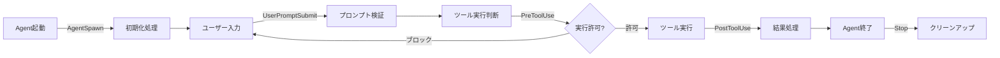

[ホーム](../../README.md) > [ユーザーガイド](../README.md) > [ベストプラクティス](README.md) > 05 Agent Hooks比較

---

# Agent Hooks vs Kiro AIエージェントフック 比較ガイド

最終更新: 2025-10-25  
**対象バージョン**: v1.17.0以降  
**難易度**: 中級

---

## 📋 概要

このガイドでは、Q CLI Agent HooksとKiro AIエージェントフックの機能を詳細に比較し、それぞれの優位性と適用シナリオを解説します。

---

## 🎯 このガイドで学べること

- Q CLI Agent HooksとKiroの機能比較
- それぞれの優位性と制限事項
- エンタープライズ視点での評価
- 実装ロードマップ

---

## 📚 目次

1. [エグゼクティブサマリー](#1-エグゼクティブサマリー)
2. [機能比較マトリクス](#2-機能比較マトリクス)
3. [Q CLI Agent Hooksの詳細仕様](#3-q-cli-agent-hooksの詳細仕様)
4. [Q CLI Agent Hooksの優位性](#4-q-cli-agent-hooksの優位性)
5. [Kiroの優位性](#5-kiroの優位性)
6. [制限事項と回避策](#6-制限事項と回避策)
7. [実装ロードマップ](#7-実装ロードマップ)
8. [エンタープライズ視点の分析](#8-エンタープライズ視点の分析)
9. [推奨事項](#9-推奨事項)

---

## 1. エグゼクティブサマリー

### 主要な発見

1. **Q CLIはKiroと同等以上の自動化が可能**
   - 5種類のライフサイクルトリガー（Kiroは主にonFileSave）
   - ツール実行のブロック機能（PreToolUseで実現）
   - 既存シェルスクリプトの活用が可能

2. **アプローチの違い**
   - Kiro: 自然言語設定、AI中心の処理
   - Q CLI: JSON設定、シェルコマンド中心、より柔軟

3. **エンタープライズ適性**
   - Q CLI: バージョン管理、監査、セキュリティ制御が容易
   - Kiro: 開発者体験重視、設定が簡単

---

## 2. 機能比較マトリクス

| 機能カテゴリ | Kiro | Q CLI Agent Hooks | 優位性 |
|------------|------|-------------------|--------|
| **トリガーポイント** | onFileSave | AgentSpawn, UserPromptSubmit, PreToolUse, PostToolUse, Stop | Q CLI |
| **設定形式** | 自然言語 | JSON | Kiro（簡単）/ Q CLI（厳密） |
| **実行環境** | AI処理中心 | シェルコマンド | Q CLI（柔軟性） |
| **ツール制御** | 限定的 | ブロック可能（PreToolUse） | Q CLI |
| **キャッシング** | 不明 | cache_ttl_seconds | Q CLI |
| **タイムアウト制御** | 不明 | timeout_ms | Q CLI |
| **Tool Matcher** | 不明 | ワイルドカード、MCP対応 | Q CLI |
| **既存スクリプト活用** | 困難 | 容易 | Q CLI |
| **バージョン管理** | 困難 | 容易（JSON） | Q CLI |
| **監査・ログ** | 限定的 | 詳細（終了コード、stdout/stderr） | Q CLI |

---

## 3. Q CLI Agent Hooksの詳細仕様

### 3.1 トリガータイプ

Q CLI Agent Hooksは5種類のトリガーポイントを提供します：



#### AgentSpawn
- **タイミング**: Agent起動時（1回のみ）
- **用途**: 環境初期化、設定検証、依存関係チェック
- **終了コード**: 0=成功、その他=失敗（Agent起動中止）

#### UserPromptSubmit
- **タイミング**: ユーザーがプロンプトを送信した直後
- **用途**: プロンプト検証、コンテキスト追加、ログ記録
- **終了コード**: 0=成功、その他=失敗（プロンプト処理中止）

#### PreToolUse
- **タイミング**: ツール実行直前
- **用途**: ツール実行の許可/拒否、パラメータ検証、セキュリティチェック
- **終了コード**: 
  - 0=許可
  - 2=ブロック（ツール実行を中止）
  - その他=失敗

#### PostToolUse
- **タイミング**: ツール実行直後
- **用途**: 結果の検証、ログ記録、後処理
- **終了コード**: 0=成功、その他=失敗

#### Stop
- **タイミング**: Agent終了時
- **用途**: クリーンアップ、統計情報の保存、リソース解放
- **終了コード**: 0=成功、その他=失敗

### 3.2 Tool Matcher

Tool Matcherは、どのツールに対してHookを実行するかを指定します：

```json
{
  "hooks": [
    {
      "trigger": "PreToolUse",
      "tool_matcher": "fs_*",
      "command": ["./scripts/check-file-access.sh"]
    },
    {
      "trigger": "PreToolUse",
      "tool_matcher": "@git",
      "command": ["./scripts/check-git-access.sh"]
    },
    {
      "trigger": "PreToolUse",
      "tool_matcher": "@git/status",
      "command": ["./scripts/log-git-status.sh"]
    }
  ]
}
```

**サポートされるパターン**:
- `fs_*`: ワイルドカード（すべてのファイルシステムツール）
- `@git`: MCPサーバー全体
- `@git/status`: MCPサーバーの特定ツール
- `execute_bash`: 特定ツール

### 3.3 キャッシング機能

重複実行を回避するためのキャッシング機能：

```json
{
  "hooks": [
    {
      "trigger": "PreToolUse",
      "tool_matcher": "fs_*",
      "command": ["./scripts/expensive-check.sh"],
      "cache_ttl_seconds": 300
    }
  ]
}
```

- **cache_ttl_seconds**: キャッシュの有効期限（秒）
- **用途**: 高コストな処理（外部API呼び出し、重い計算）の重複実行を回避

### 3.4 タイムアウト制御

```json
{
  "hooks": [
    {
      "trigger": "PreToolUse",
      "tool_matcher": "execute_bash",
      "command": ["./scripts/security-scan.sh"],
      "timeout_ms": 5000
    }
  ]
}
```

- **デフォルト**: 30秒
- **timeout_ms**: ミリ秒単位でタイムアウトを指定
- **用途**: 長時間実行を防止、応答性の確保

---

## 4. Q CLI Agent Hooksの優位性

### 1. 柔軟性

- **5種類のトリガーポイント**: Agent起動からツール実行、終了まで細かく制御
- **Tool Matcher**: ワイルドカード、MCP対応で柔軟なツール指定
- **シェルスクリプト**: 任意の処理を実装可能

### 2. 制御性

- **ツール実行のブロック**: PreToolUseで実行前にブロック可能
- **タイムアウト制御**: 長時間実行を防止
- **キャッシング**: 重複実行を回避

### 3. 既存資産活用

- **シェルスクリプト**: 既存のスクリプトをそのまま活用
- **既存ツール**: npm、pytest、eslintなど既存ツールと統合
- **CI/CDとの統合**: 同じスクリプトをCI/CDでも使用可能

### 4. エンタープライズ適性

- **バージョン管理**: JSON設定ファイルをGitで管理
- **監査ログ**: 詳細な実行ログ（終了コード、stdout/stderr）
- **セキュリティ制御**: 実行権限、入力検証、機密情報保護

---

## 5. Kiroの優位性

### 1. 開発者体験

- **自然言語設定**: 技術的な知識が少なくても設定可能
- **設定が簡単**: JSON設定やスクリプト作成が不要
- **AI統合**: AI処理との統合が容易

### 2. AI中心の処理

- **AI判断**: AIが状況に応じて処理を判断
- **柔軟な対応**: 自然言語で柔軟に対応

---

## 6. 制限事項と回避策

### 6.1 Q CLI Agent Hooksの制限

| 制限事項 | 影響 | 回避策 |
|---------|------|--------|
| 同期実行のみ | 長時間処理でブロック | バックグラウンド実行、キャッシング |
| 環境変数経由の情報取得 | 複雑なデータ構造の扱いが困難 | JSON形式で渡し、jqで解析 |
| 標準出力/エラー出力のみ | リッチな通知が困難 | 外部通知サービスと統合 |
| タイムアウト制限 | 長時間処理が中断 | timeout_msを調整、処理を分割 |

### 6.2 Kiroとの機能ギャップ

| Kiro機能 | Q CLI対応 | 実現方法 |
|---------|----------|---------|
| 自然言語設定 | ❌ | JSON設定（より厳密） |
| AI処理統合 | ⚠️ | 外部AIサービスをスクリプトから呼び出し |
| リアルタイムフィードバック | ⚠️ | 標準出力経由で限定的に可能 |

---

## 7. 実装ロードマップ

### フェーズ1: 基本実装（1-2週間）

- [ ] AgentSpawnでの環境初期化
- [ ] PostToolUseでの基本的な自動化（フォーマット、lint）
- [ ] 基本的なログ記録

### フェーズ2: 高度な制御（2-4週間）

- [ ] PreToolUseでのツール実行制御
- [ ] キャッシング機能の活用
- [ ] 条件付き実行の実装

### フェーズ3: 統合と最適化（4-6週間）

- [ ] 外部サービスとの統合（Slack、GitHub Actions）
- [ ] メトリクス収集と可視化
- [ ] パフォーマンス最適化

### フェーズ4: エンタープライズ対応（6-8週間）

- [ ] セキュリティ強化
- [ ] 監査ログの実装
- [ ] チーム全体での標準化

---

## 8. エンタープライズ視点の分析

### セキュリティとコンプライアンス

**Q CLI Agent Hooks**:
- ✅ バージョン管理可能（Git）
- ✅ 監査ログ詳細
- ✅ 実行権限制御
- ✅ 入力検証可能

**Kiro**:
- ⚠️ バージョン管理が困難
- ⚠️ 監査ログが限定的
- ⚠️ 実行制御が限定的

### チーム開発

**Q CLI Agent Hooks**:
- ✅ 設定ファイルを共有可能
- ✅ コードレビュー可能
- ✅ CI/CDと統合可能

**Kiro**:
- ⚠️ 設定共有が困難
- ⚠️ レビュープロセスが不明確

### コスト

**Q CLI Agent Hooks**:
- ✅ 追加コストなし
- ✅ 既存ツール活用

**Kiro**:
- ⚠️ ライセンスコスト（要確認）

---

## 9. 推奨事項

### 個人開発者向け

- **Kiro**: 設定が簡単、すぐに始められる
- **Q CLI**: より細かい制御が必要な場合

### チーム開発向け

- **Q CLI推奨**: バージョン管理、コードレビュー、標準化が容易

### エンタープライズ向け

- **Q CLI強く推奨**: セキュリティ、監査、コンプライアンス要件を満たしやすい

### 選択基準

| 要件 | Kiro | Q CLI |
|-----|------|-------|
| 簡単に始めたい | ⭐⭐⭐⭐⭐ | ⭐⭐⭐ |
| 細かい制御が必要 | ⭐⭐ | ⭐⭐⭐⭐⭐ |
| チーム開発 | ⭐⭐ | ⭐⭐⭐⭐⭐ |
| エンタープライズ | ⭐⭐ | ⭐⭐⭐⭐⭐ |
| 既存ツール活用 | ⭐⭐ | ⭐⭐⭐⭐⭐ |

---

## 📚 関連ドキュメント

- **[実践ガイド](../08_guides/09_workflow-automation.md)** - Agent Hooksの実践的な使い方
- **[Agent設定ガイド](../03_configuration/03_agent-configuration.md)** - Hooks設定の技術仕様
- **[Agent機能](../02_features/02_agents.md)** - Agent機能の概要

---

## 📖 参考資料

### Kiro関連

- [Kiro AIエージェントフック記事](https://aws.amazon.com/jp/blogs/news/automate-your-development-workflow-with-agent-hooks/)

### 関連技術

- [GitHub Actions](https://docs.github.com/actions)
- [Pre-commit Hooks](https://pre-commit.com/)
- [Husky](https://typicode.github.io/husky/)

---

**作成者**: Amazon Q Developer CLI  
**レビュー**: katoh  
**バージョン**: 1.0
