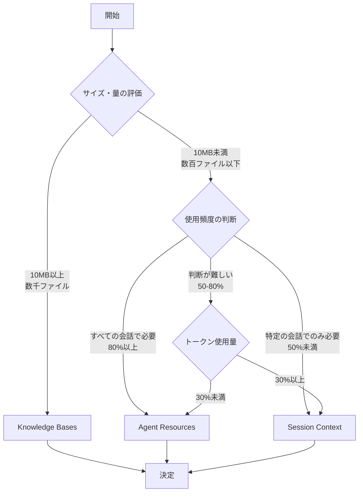

## 4. ベストプラクティスの考え方（最重要章）

この章では、コンテキスト設定の「考え方」と「思考プロセス」を学びます。単なる設定例ではなく、**なぜそうするのか**、**どう判断するのか**を理解することが目標です。

---

### 4.1 コンテキスト設計の基本原則

#### 4.1.1 必要最小限の原則

#### なぜ重要か

1. **トークン制限**: コンテキストは全トークンの75%まで
   - 残り25%は会話と応答に必要
   - 超過すると自動的にファイルがドロップされる

2. **パフォーマンス**: ファイルが多いほど遅くなる
   - Agent起動時間の増加
   - 応答時間の増加
   - メモリ使用量の増加

3. **明確性**: 情報が多すぎるとAIが混乱
   - 関連性の低い情報が含まれる
   - 応答の精度が下がる

#### どう実現するか

**ステップ1: 本当に必要か問う**

各ファイルについて自問:
- このファイルはすべての会話で必要か？
- このファイルがないと困るか？
- このファイルの情報は他のファイルと重複していないか？

**ステップ2: 定期的に見直す**

月次または四半期ごとに:
- 使用頻度の確認
- 不要なファイルの削除
- 新しい必要なファイルの追加

**ステップ3: トークン使用量を監視**

```bash
# 定期的に確認
/context show

# 出力例:
# Total tokens: 30000/80000 (37.5%)
# Files: 15
# - README.md: 5000 tokens
# - .amazonq/rules/coding.md: 3000 tokens
# ...
```

#### 何を意識するか

- **「あれば便利」ではなく「必須」かどうか**
- **トークン使用量が50%を超えたら警戒**
- **ファイル数が20を超えたら見直し**

💡 **初心者向けポイント**: 最初は少なく始めて、必要に応じて追加する方が安全です。

📝 **良い例**:

```json
{
  "resources": [
    "file://README.md",
    "file://.amazonq/rules/coding.md",
    "file://architecture.md"
  ]
}
```
- 3ファイルのみ
- すべて必須の情報
- トークン使用量: 約15000（18.75%）

📝 **悪い例**:

```json
{
  "resources": [
    "file://**/*.md",
    "file://**/*.yaml",
    "file://**/*.json"
  ]
}
```
- ファイル数が不明（数百になる可能性）
- 不要なファイルも含まれる
- トークン制限を超える可能性

⚠️ **よくある間違い**: 「とりあえず全部入れておけば安心」という考え方。これは逆効果です。

---

#### 4.1.2 焦点を絞る原則

#### なぜ重要か

1. **AIの理解精度**: 関連性の高い情報のみを提供
   - 無関係な情報が混ざると精度が下がる
   - 焦点が絞られているほど正確な応答

2. **応答の関連性**: プロジェクト固有の情報に限定
   - 汎用的すぎる情報は不要
   - プロジェクト特有の知識が重要

3. **トークンの効率**: 限られたトークンを有効活用
   - 関連性の低い情報にトークンを使わない
   - 重要な情報により多くのトークンを割り当て

#### どう実現するか

**ステップ1: プロジェクトの特徴を特定**

質問:
- このプロジェクトの独自性は何か？
- 他のプロジェクトと何が違うか？
- プロジェクト固有のルールは何か？

**ステップ2: 汎用的な情報を除外**

除外すべき情報:
- 一般的なプログラミング知識（AIは既に知っている）
- 公式ドキュメントの内容（AIは既に知っている）
- プロジェクトに関係ない情報

**ステップ3: プロジェクト固有の情報を含める**

含めるべき情報:
- プロジェクト独自の命名規則
- プロジェクト固有のアーキテクチャ
- プロジェクト特有のワークフロー
- チーム固有のルール

#### 何を意識するか

- **「AIが既に知っている情報」は不要**
- **「このプロジェクトだけの情報」を優先**
- **「なぜこのプロジェクトでこうするのか」を説明**

💡 **初心者向けポイント**: AIは一般的な知識を既に持っています。プロジェクト固有の情報だけを提供しましょう。

📝 **良い例** - プロジェクト固有のルール:

```markdown
# .amazonq/rules/naming.md

## Lambda関数の命名規則

このプロジェクトでは以下の形式を使用:
{service}-{environment}-{function}

例:
- user-service-prod-create-user
- order-service-dev-process-payment

理由: CloudWatch Logsでのフィルタリングを容易にするため
```

📝 **悪い例** - 汎用的な情報:

```markdown
# .amazonq/rules/python.md

## Pythonのベストプラクティス

- PEP 8に従う
- 関数は小さく保つ
- コメントを書く
```
（これらはAIが既に知っている一般的な知識）

⚠️ **よくある間違い**: プログラミング言語の一般的なベストプラクティスをコンテキストに含める。

---

#### 4.1.3 明確性の原則

#### なぜ重要か

1. **AIの誤解を防ぐ**: 曖昧な情報は誤った解釈を招く
   - 明確な指示 → 正確な応答
   - 曖昧な指示 → 不正確な応答

2. **メンテナンス性**: 明確な構造は管理しやすい
   - ファイルの目的が明確
   - 更新が容易
   - チーム共有が簡単

3. **デバッグ**: 問題の特定が容易
   - どのファイルが原因か分かりやすい
   - 修正が簡単

#### どう実現するか

**ステップ1: 明確なファイル名**

良いファイル名:
- `coding-standards.md` - 何が書かれているか明確
- `api-endpoints.md` - 内容が分かりやすい
- `deployment-process.md` - 目的が明確

悪いファイル名:
- `rules.md` - 何のルールか不明
- `info.md` - 何の情報か不明
- `notes.md` - 内容が不明

**ステップ2: 構造化された内容**

良い構造:
```markdown
# Lambda関数の命名規則

## 形式
{service}-{environment}-{function}

## 例
- user-service-prod-create-user
- order-service-dev-process-payment

## 理由
CloudWatch Logsでのフィルタリングを容易にするため

## 例外
バッチ処理は batch-{process}-{environment} の形式
```

悪い構造:
```markdown
# ルール

Lambda関数は{service}-{environment}-{function}の形式で命名する。
例: user-service-prod-create-user
バッチ処理は違う形式。
```

**ステップ3: 明確な説明**

良い説明:
- 「なぜ」を説明
- 具体例を提供
- 例外を明記

悪い説明:
- 「何を」だけ説明
- 例がない
- 例外が不明

#### 何を意識するか

- **ファイル名で内容が分かるか**
- **構造が論理的か**
- **説明が具体的か**

💡 **初心者向けポイント**: 「1ヶ月後の自分が理解できるか」を基準に考えましょう。

📝 **良い例** - 明確な構造:

```markdown
# .amazonq/rules/api-design.md

## エンドポイント命名規則

### RESTful原則
- リソースは複数形: `/users`, `/orders`
- IDは単数形: `/users/{userId}`

### バージョニング
- URLにバージョンを含める: `/api/v1/users`
- 理由: 後方互換性の維持

### 例
✅ 良い例:
- GET /api/v1/users
- POST /api/v1/users
- GET /api/v1/users/{userId}

❌ 悪い例:
- GET /api/user
- POST /api/createUser
- GET /api/getUserById
```

📝 **悪い例** - 曖昧な内容:

```markdown
# rules.md

APIはRESTfulにする。
エンドポイントは適切に命名する。
バージョニングを考慮する。
```

⚠️ **よくある間違い**: 「何をするか」だけ書いて「なぜそうするか」を書かない。

---

#### 4.1.4 セキュリティの原則

#### なぜ重要か

1. **機密情報の保護**: 漏洩のリスクを最小化
   - APIキー、パスワードの保護
   - 個人情報（PII）の保護
   - 企業秘密の保護

2. **コンプライアンス**: 規制への準拠
   - GDPR、CCPA等のデータ保護規制
   - 業界固有の規制
   - 社内ポリシー

3. **信頼性**: セキュリティ事故の防止
   - 情報漏洩の防止
   - 不正アクセスの防止
   - レピュテーションリスクの回避

#### どう実現するか

**ステップ1: 機密情報の識別**

チェックリスト:
- [ ] APIキー、トークン
- [ ] パスワード、シークレット
- [ ] 個人情報（PII）
- [ ] クレジットカード情報
- [ ] 企業秘密
- [ ] 内部システムの詳細

**ステップ2: 除外設定**

方法1: `fs_read`の`deniedPaths`設定

```json
{
  "tools": {
    "fs_read": {
      "deniedPaths": [
        ".env",
        ".env.*",
        "**/*.key",
        "**/*.pem",
        "**/secrets/**",
        "**/credentials/**"
      ]
    }
  }
}
```

方法2: `.gitignore`との連携

```gitignore
# .gitignore
.env
.env.*
*.key
*.pem
secrets/
credentials/
```

**ステップ3: アクセス制御**

- ファイルのパーミッション設定
- ディレクトリのアクセス制限
- バージョン管理からの除外

#### 何を意識するか

- **「公開しても問題ないか」を常に確認**
- **機密情報は環境変数で管理**
- **多層防御の考え方**

💡 **初心者向けポイント**: 「迷ったら除外」が安全です。

📝 **良い例** - セキュアな設定:

```json
{
  "resources": [
    "file://README.md",
    "file://.amazonq/rules/**/*.md",
    "file://architecture.md"
  ],
  "tools": {
    "fs_read": {
      "deniedPaths": [
        ".env",
        ".env.*",
        "**/*.key",
        "**/*.pem",
        "**/secrets/**",
        "config/production.yaml"
      ]
    }
  }
}
```

📝 **悪い例** - 危険な設定:

```json
{
  "resources": [
    "file://**/*"
  ]
}
```
（すべてのファイルを読み込む = 機密情報も含まれる可能性）

⚠️ **よくある間違い**: 「開発環境だから大丈夫」という油断。開発環境にも機密情報は存在します。

---

### 4.1.5 コンテキストサイズとチューニング

#### なぜ重要か

1. **制限値の理解**: Q CLIには変更できない制限値がある
   - ハードコードされた値を理解する
   - 制限内で最適化する
   - 制限を超えた場合の対処法を知る

2. **パフォーマンス最適化**: 適切なサイズ管理で快適な動作
   - 応答速度の向上
   - メモリ使用量の削減
   - 安定した動作

3. **トラブル回避**: 制限値を超えた場合の問題を防ぐ
   - 自動ドロップの回避
   - エラーの防止
   - 予期しない動作の回避

#### ハードコードされた制限値

Q CLIには以下のハードコードされた制限値があり、ユーザーが変更できません：

**メッセージサイズ制限**:

| 項目 | 制限値 | 説明 |
|------|--------|------|
| ユーザーメッセージ | 400,000文字 | 実際のサービス制限は600,000文字 |
| ツールレスポンス | 400,000文字 | 実際のサービス制限は800,000文字 |
| 会話履歴 | 10,000メッセージ | 会話履歴の最大長 |
| カレントディレクトリパス | 256文字 | パスの最大長 |

**画像関連制限**:

| 項目 | 制限値 |
|------|--------|
| 1リクエストあたりの最大画像数 | 10枚 |
| 1画像あたりの最大サイズ | 10MB |

**コンテキストウィンドウ**:

| 項目 | 値 | 説明 |
|------|-----|------|
| デフォルトコンテキストウィンドウ | 200,000トークン | モデル情報が取得できない場合 |
| コンテキストファイル最大サイズ | コンテキストウィンドウの75% | 自動計算 |

**計算例**:
- Claude Sonnet 4 (200,000トークン): 最大 150,000 トークン
- GPT (128,000トークン): 最大 96,000 トークン

💡 **初心者向けポイント**: これらの値は変更できません。制限内で最適化することが重要です。

#### 設定可能な項目

唯一設定可能なコンテキスト関連項目：

**自動コンパクションの制御**:

```bash
# 自動要約を無効化（非推奨）
q settings set chat.disableAutoCompaction true

# 自動要約を有効化（デフォルト）
q settings set chat.disableAutoCompaction false
```

⚠️ **注意**: 自動要約を無効化すると、コンテキストウィンドウがオーバーフローした際にエラーが発生する可能性があります。

#### コンテキスト管理のベストプラクティス

**1. 定期的な使用状況確認**

```bash
# 使用率を確認
/usage

# 出力例:
# Current context window (112530 of 200k tokens used) 56.27%
#
# Context files: ~3090 tokens (1.54%)
# Tools: ~52480 tokens (26.24%)
# AI responses: ~32830 tokens (16.42%)
# Your prompts: ~24130 tokens (12.07%)

# 使用率が60%を超えたら、どの要素が多いか確認
# 80%を超えたら要約を検討
/compact
```

**2. コンテキストファイルの管理**

```bash
# コンテキストファイルの状態確認
/context show

# 出力例:
# Total tokens: 30000/150000 (20%)
# Files: 5
# - README.md: 5000 tokens
# - architecture.md: 8000 tokens
# - .amazonq/rules/coding.md: 3000 tokens
# - docs/api.md: 10000 tokens
# - CONTRIBUTING.md: 4000 tokens

# 不要なファイルを削除
/context remove docs/api.md

# すべてクリア
/context clear
```

**3. 大きなファイルの扱い**

コンテキストファイルの合計サイズはコンテキストウィンドウの75%まで：

```bash
# 通常の追加（75%制限あり）
/context add large-file.md

# 警告が表示される場合:
# Total token count exceeds limit: 150000.
# The following files will be automatically dropped when interacting with Q.
# Consider removing them.

# 強制追加（注意が必要）
/context add --force large-file.md
```

⚠️ **注意**: `--force`フラグを使用すると制限を無視できますが、パフォーマンスに影響する可能性があります。

**4. 会話の要約戦略**

```bash
# 基本的な要約
/compact

# 最新の会話を保持して要約（最新3個のメッセージペアを除外）
/compact --messages-to-exclude 3

# 大きなメッセージを切り詰めて要約
/compact --truncate-large-messages true --max-message-length 100000

# 要約内容を確認
/compact --show-summary
```

#### 何を意識するか

- **使用率が80%を超えたら要約を検討**
- **コンテキストファイルは75%制限を意識**
- **自動要約は有効のまま（デフォルト）が推奨**
- **`--force`フラグは慎重に使用**

💡 **初心者向けポイント**: 定期的に`/usage`と`/context show`で状況を確認する習慣をつけましょう。

📝 **良い例** - 定期的な監視:

```bash
# 作業開始時に確認
/usage
/context show

# 使用率が高い場合は要約
/compact --messages-to-exclude 2

# 不要なファイルを削除
/context remove old-design.md
```

📝 **悪い例** - 無計画な使用:

```bash
# 確認せずに大量のファイルを追加
/context add **/*.md

# 自動要約を無効化
q settings set chat.disableAutoCompaction true

# 強制追加を乱用
/context add --force huge-file1.md
/context add --force huge-file2.md
/context add --force huge-file3.md
```

⚠️ **よくある間違い**: 
- 使用状況を確認せずにファイルを追加し続ける
- 自動要約を無効化して放置する
- `--force`フラグを安易に使用する

#### トラブルシューティング

**問題1: コンテキストウィンドウがすぐに一杯になる**

症状:
- 頻繁に自動要約が実行される
- 「conversation is getting lengthy」という警告が表示される

解決策:
```bash
# 1. 使用状況を確認
/usage

# 2. コンテキストファイルを確認
/context show

# 3. 不要なファイルを削除
/context remove <pattern>

# 4. 会話を要約
/compact
```

**問題2: ファイルが自動的にドロップされる**

症状:
```
Total token count exceeds limit: 150000.
The following files will be automatically dropped when interacting with Q.
Consider removing them.
```

解決策:
```bash
# 1. 重要なファイルのみを追加
/context clear
/context add README.md
/context add architecture.md

# 2. 強制追加（注意が必要）
/context add --force large-file.md

# 3. より大きなコンテキストウィンドウを持つモデルを使用
/model claude-sonnet-4
```

**問題3: 自動要約を無効化したい**

⚠️ **注意**: 自動要約を無効化すると、コンテキストウィンドウがオーバーフローした際にエラーが発生する可能性があります。

設定方法:
```bash
q settings set chat.disableAutoCompaction true
```

推奨: 自動要約は有効のまま、必要に応じて手動で`/compact`を実行する方が安全です。

---

### 4.2 アプローチ選択の思考プロセス

#### 4.2.1 ステップ1: サイズと量の評価

#### 質問: コンテンツは10MB以上か？数千ファイルか？

**Yes → Knowledge Basesを選択**

理由:
- Agent ResourcesとSession Contextはトークン制限がある
- Knowledge Basesは大量のドキュメントを扱える
- 検索時のみトークン消費

具体的な判断基準:
- ファイル数: 100ファイル以上
- 合計サイズ: 10MB以上
- 個別ファイル: 1MB以上

**No → ステップ2へ**

💡 **初心者向けポイント**: サイズの確認方法

```bash
# ディレクトリのサイズを確認
du -sh docs/
# 出力例: 15M docs/

# ファイル数を確認
find docs/ -type f | wc -l
# 出力例: 250

# 判断:
# 15MB > 10MB → Knowledge Basesを選択
```

📝 **実例**: プロジェクトサイズの測定

```bash
# プロジェクト全体のサイズ
du -sh .
# 出力例: 50M .

# ドキュメントのサイズ
du -sh docs/
# 出力例: 15M docs/

# コードのサイズ
du -sh src/
# 出力例: 5M src/

# 判断:
# docs/ (15MB) → Knowledge Bases
# src/ (5MB) → Agent Resources または Session Context
```

⚠️ **注意**: バイナリファイル（画像、PDF等）は除外してサイズを計算してください。

---

#### 4.2.2 ステップ2: 使用頻度の判断

#### 質問: すべての会話で必要か？

**Yes → Agent Resourcesを選択**

理由:
- 自動読み込みで手間がない
- 一貫性が保たれる
- 設定忘れがない

具体的な判断基準:
- プロジェクト概要（README.md）
- プロジェクトルール（.amazonq/rules/）
- API仕様（api-spec.md）
- アーキテクチャ図（architecture.md）

**No → Session Contextを選択**

理由:
- 必要な時だけ追加
- トークンの無駄がない
- 柔軟な運用

具体的な判断基準:
- 一時的な調査（ログファイル）
- 特定タスク（実装中のコード）
- 実験的な追加（新しいルール）
- 大きなファイル（詳細な仕様書）

💡 **初心者向けポイント**: 頻度の判断基準

**「すべての会話で必要」の判断**:
- 質問: このファイルがないと困る会話は何%か？
  - 80%以上 → Agent Resources
  - 50-80% → Agent Resources（検討）
  - 50%未満 → Session Context

**「一時的に必要」の判断**:
- 質問: このファイルは特定のタスクでのみ必要か？
  - Yes → Session Context
  - No → Agent Resources

📝 **実例**: 使用頻度の分析

**プロジェクト**: AWS SAMアプリケーション

| ファイル | 使用頻度 | 判断 | 理由 |
|---------|---------|------|------|
| README.md | 100% | Agent Resources | すべての会話で参照 |
| template.yaml | 90% | Agent Resources | インフラ関連の会話で必要 |
| .amazonq/rules/coding.md | 80% | Agent Resources | コード生成時に必要 |
| src/lambda/handler.py | 30% | Session Context | 特定の機能開発時のみ |
| logs/error.log | 5% | Session Context | トラブルシューティング時のみ |
| docs/detailed-spec.md | 10% | Session Context | 詳細確認時のみ |

⚠️ **注意**: 使用頻度は定期的に見直してください。プロジェクトの進行に応じて変化します。

---

#### 4.2.3 ステップ3: アプローチの決定

#### 決定フローチャート



#### 判断基準の一覧表

| 条件 | Agent Resources | Session Context | Knowledge Bases |
|------|----------------|-----------------|-----------------|
| **ファイル数** | 10-20 | 1-5 | 100+ |
| **合計サイズ** | <5MB | <1MB | >10MB |
| **使用頻度** | 80%以上 | 50%未満 | 任意 |
| **トークン使用量** | <30% | <10% | 検索時のみ |
| **管理コスト** | 低 | 中 | 高 |
| **セットアップ** | 簡単 | 不要 | 複雑 |

💡 **初心者向けポイント**: 迷った時の判断方法

**パターン1: 小規模プロジェクト（<5MB、<50ファイル）**
→ Agent Resourcesから始める

**パターン2: 中規模プロジェクト（5-10MB、50-100ファイル）**
→ Agent Resources + Session Context

**パターン3: 大規模プロジェクト（>10MB、>100ファイル）**
→ Agent Resources + Knowledge Bases

📝 **実例**: 典型的なケース

**ケース1: 新規プロジェクト**
```json
{
  "resources": [
    "file://README.md"
  ]
}
```
- 最小限から始める
- 必要に応じて追加

**ケース2: 成熟したプロジェクト**
```json
{
  "resources": [
    "file://README.md",
    "file://.amazonq/rules/**/*.md",
    "file://architecture.md",
    "file://api-spec.md"
  ]
}
```
- 必須ファイルを含める
- 定期的に見直し

**ケース3: 大規模プロジェクト**
```json
{
  "resources": [
    "file://README.md",
    "file://.amazonq/rules/**/*.md"
  ]
}
```
```bash
# Knowledge Baseをセットアップ
/knowledge add docs/
/knowledge add legacy-code/
```
- 基本情報のみAgent Resources
- 大量のドキュメントはKnowledge Bases

⚠️ **注意**: 最初から完璧を目指さず、段階的に改善していきましょう。

---

## まとめ（Part1）

### 重要なポイント

1. **基本原則**
   - 必要最小限: トークン制限、パフォーマンス、明確性
   - 焦点を絞る: プロジェクト固有の情報に限定
   - 明確性: ファイル名、構造、説明を明確に
   - セキュリティ: 機密情報の保護

2. **アプローチ選択**
   - ステップ1: サイズと量の評価
   - ステップ2: 使用頻度の判断
   - ステップ3: アプローチの決定

### 次のステップ

Part2では、ファイル選定、パス指定、パフォーマンス最適化、セキュリティ設計の思考プロセスを学びます。

---

**出典**:
- [AWS公式ドキュメント - Best practices](https://docs.aws.amazon.com/amazonq/)
# 第4章 Part2: ファイル選定とパス指定の思考プロセス

### 4.3 ファイル選定の思考プロセス

#### 4.3.1 ステップ1: 必須ファイルの特定

#### 質問1: プロジェクトの概要を説明するファイルは？

**答え**: README.md

**理由**:
- プロジェクトの目的
- 主要な機能
- 技術スタック
- セットアップ方法

**確認方法**:
```bash
# README.mdの存在確認
ls -la README.md

# 内容の確認
head -n 20 README.md
```

💡 **初心者向けポイント**: README.mdは**最優先**で含めるべきファイルです。

#### 質問2: プロジェクト固有のルールは？

**答え**: .amazonq/rules/**/*.md

**理由**:
- コーディング規約
- 命名規則
- アーキテクチャ原則
- ワークフロー

**確認方法**:
```bash
# ルールファイルの確認
ls -la .amazonq/rules/

# 内容の確認
cat .amazonq/rules/coding.md
```

💡 **初心者向けポイント**: プロジェクト固有のルールは、AIが正しいコードを生成するために必須です。

#### 必須ファイルのチェックリスト

- [ ] README.md - プロジェクト概要
- [ ] .amazonq/rules/**/*.md - プロジェクトルール
- [ ] architecture.md - システム構成（あれば）
- [ ] CONTRIBUTING.md - 貢献ガイド（チーム開発の場合）

📝 **実例**: 最小限の設定

```json
{
  "resources": [
    "file://README.md",
    "file://.amazonq/rules/**/*.md"
  ]
}
```

この設定で:
- プロジェクトの概要を理解
- プロジェクトルールに従ったコード生成
- トークン使用量: 約10000-15000（12.5-18.75%）

⚠️ **注意**: 最小限の設定でも、多くの場合十分に機能します。

---

#### 4.3.2 ステップ2: プロジェクトタイプの考慮

#### AWS関連プロジェクト

**追加すべきファイル**:
- `architecture.md` - AWSアーキテクチャ図
- `template.yaml` - SAMテンプレート
- `infrastructure/**/*.yaml` - CloudFormation/CDKスタック

**理由**:
- AWSサービスの構成を理解
- インフラコードの生成
- ベストプラクティスの適用

📝 **設定例**:

```json
{
  "resources": [
    "file://README.md",
    "file://.amazonq/rules/**/*.md",
    "file://architecture.md",
    "file://template.yaml"
  ]
}
```

#### Web開発プロジェクト

**追加すべきファイル**:
- `api-spec.md` - API仕様
- `package.json` - 依存関係
- `tsconfig.json` - TypeScript設定（TypeScriptの場合）

**理由**:
- API設計の理解
- 依存関係の把握
- 型定義の活用

📝 **設定例**:

```json
{
  "resources": [
    "file://README.md",
    "file://.amazonq/rules/**/*.md",
    "file://api-spec.md",
    "file://package.json"
  ]
}
```

#### データサイエンスプロジェクト

**追加すべきファイル**:
- `data-schema.md` - データスキーマ
- `requirements.txt` - Python依存関係
- `notebooks/README.md` - ノートブックの説明

**理由**:
- データ構造の理解
- 依存関係の把握
- 分析フローの理解

📝 **設定例**:

```json
{
  "resources": [
    "file://README.md",
    "file://.amazonq/rules/**/*.md",
    "file://data-schema.md",
    "file://requirements.txt"
  ]
}
```

💡 **初心者向けポイント**: プロジェクトタイプに応じて、必要なファイルは異なります。

📝 **タイプ別の典型的なファイル**:

| プロジェクトタイプ | 必須ファイル | 推奨ファイル |
|------------------|------------|------------|
| AWS関連 | README.md, template.yaml | architecture.md, infrastructure/**/*.yaml |
| Web開発 | README.md, package.json | api-spec.md, tsconfig.json |
| データサイエンス | README.md, requirements.txt | data-schema.md, notebooks/README.md |
| モバイルアプリ | README.md, build.gradle | architecture.md, api-spec.md |
| ライブラリ | README.md, package.json | API.md, CONTRIBUTING.md |

---

#### 4.3.3 ステップ3: 除外ファイルの判断

#### 質問1: 機密情報を含むか？

**Yes → 除外**

機密情報のチェックリスト:
- [ ] APIキー、トークン
- [ ] パスワード、シークレット
- [ ] 個人情報（PII）
- [ ] クレジットカード情報
- [ ] 企業秘密

**除外方法**:

```json
{
  "tools": {
    "fs_read": {
      "deniedPaths": [
        ".env",
        ".env.*",
        "**/*.key",
        "**/*.pem",
        "**/secrets/**",
        "config/production.yaml"
      ]
    }
  }
}
```

#### 質問2: 10MB以上か？

**Yes → Knowledge Basesまたは除外**

**理由**:
- トークン制限を超える可能性
- パフォーマンスへの影響
- 読み込み時間の増加

**対策**:
1. Knowledge Basesに移行
2. ファイルを分割
3. 要約版を作成

#### 質問3: バイナリファイルか？

**Yes → 除外**

**バイナリファイルの例**:
- 画像: .png, .jpg, .gif
- PDF: .pdf
- Office: .docx, .xlsx, .pptx
- 圧縮: .zip, .tar.gz

**理由**:
- Q CLIはテキストファイルのみサポート
- バイナリファイルは読み込めない

**対策**:
1. テキスト形式に変換
2. 必要な部分を抽出
3. 別の方法で情報を提供

💡 **初心者向けポイント**: 除外すべきファイルのチェックリスト

**必ず除外**:
- [ ] .env, .env.*
- [ ] *.key, *.pem
- [ ] secrets/, credentials/
- [ ] node_modules/, venv/
- [ ] .git/
- [ ] *.pdf, *.docx, *.xlsx
- [ ] *.png, *.jpg, *.gif
- [ ] *.zip, *.tar.gz

**検討して除外**:
- [ ] logs/ - ログファイル（必要な時だけSession Context）
- [ ] test/ - テストコード（必要な時だけ）
- [ ] build/, dist/ - ビルド成果物
- [ ] coverage/ - カバレッジレポート

📝 **実例**: 除外設定

```json
{
  "resources": [
    "file://README.md",
    "file://.amazonq/rules/**/*.md",
    "file://src/**/*.py"
  ],
  "tools": {
    "fs_read": {
      "deniedPaths": [
        ".env",
        ".env.*",
        "**/*.key",
        "**/*.pem",
        "**/secrets/**",
        "node_modules/**",
        "venv/**",
        ".git/**",
        "**/*.pdf",
        "**/*.png",
        "**/*.jpg",
        "logs/**",
        "test/**",
        "build/**",
        "dist/**"
      ]
    }
  }
}
```

⚠️ **警告**: 除外設定を忘れると、機密情報が読み込まれる可能性があります。

---

### 4.4 パス指定の思考プロセス

#### 4.4.1 相対パス vs 絶対パス - どちらを選ぶか

#### 質問1: チームで共有するか？

**Yes → 相対パス**

**理由**:
- 環境依存を避ける
- ポータビリティの確保
- チームメンバー全員が使える

**例**:

```json
{
  "resources": [
    "file://README.md",
    "file://.amazonq/rules/**/*.md"
  ]
}
```

**No → どちらでも可**

**理由**:
- 個人利用なら環境依存でも問題ない
- 絶対パスの方が明確な場合もある

**例**:

```json
{
  "resources": [
    "file:///home/user/projects/my-project/README.md",
    "file:///home/user/projects/my-project/.amazonq/rules/**/*.md"
  ]
}
```

#### 質問2: 環境依存を避けたいか？

**Yes → 相対パス**

**理由**:
- 異なる環境でも動作
- CI/CDでも使用可能
- ドキュメント化が容易

💡 **初心者向けポイント**: ポータビリティの重要性

**ポータビリティとは**:
- 異なる環境でも動作すること
- チームメンバー全員が使えること
- 設定の共有が容易なこと

**ポータビリティの確認方法**:
1. 別のマシンで設定をコピー
2. 動作するか確認
3. 問題があれば相対パスに変更

📝 **実例**: 相対パスの設定

```json
{
  "resources": [
    "file://README.md",
    "file://.amazonq/rules/**/*.md",
    "file://docs/architecture.md"
  ]
}
```

この設定は:
- どの環境でも動作
- チームで共有可能
- バージョン管理に含められる

⚠️ **注意**: 絶対パスは環境依存になるため、チーム開発では避けてください。

---

#### 4.4.2 ワイルドカードの使用 - どこまで広げるか

#### 質問1: 特定のディレクトリ配下のすべてのファイルが必要か？

**Yes → `dir/**/*.ext`**

**理由**:
- 個別指定の手間がない
- 新しいファイルも自動的に含まれる
- メンテナンスが容易

**例**:

```json
{
  "resources": [
    "file://.amazonq/rules/**/*.md"
  ]
}
```

これは以下を含む:
- `.amazonq/rules/coding.md`
- `.amazonq/rules/api-design.md`
- `.amazonq/rules/deployment/process.md`

**No → 個別指定**

**理由**:
- 必要なファイルのみ含める
- トークンの無駄がない
- 明確な管理

**例**:

```json
{
  "resources": [
    "file://.amazonq/rules/coding.md",
    "file://.amazonq/rules/api-design.md"
  ]
}
```

#### 質問2: トークン制限内に収まるか？

**No → パターンを限定**

**対策**:
1. ディレクトリを限定
2. ファイル拡張子を限定
3. 個別指定に変更

**例**:

```json
// 広すぎる
{
  "resources": [
    "file://**/*.md"
  ]
}

// 適切に限定
{
  "resources": [
    "file://docs/**/*.md",
    "file://.amazonq/rules/**/*.md"
  ]
}
```

💡 **初心者向けポイント**: ワイルドカードの影響範囲

**ワイルドカードの種類**:
- `*` - 単一ディレクトリ内のファイル
- `**` - サブディレクトリを含むすべてのファイル
- `*.ext` - 特定の拡張子のファイル

**影響範囲の確認方法**:

```bash
# マッチするファイルを確認
find .amazonq/rules/ -name "*.md"

# ファイル数を確認
find .amazonq/rules/ -name "*.md" | wc -l

# 合計サイズを確認
find .amazonq/rules/ -name "*.md" -exec du -ch {} + | tail -1
```

📝 **実例**: 適切なワイルドカード

```json
{
  "resources": [
    "file://README.md",
    "file://.amazonq/rules/**/*.md",
    "file://docs/architecture.md",
    "file://docs/api-spec.md"
  ]
}
```

この設定は:
- ルールファイルのみワイルドカード
- 重要なファイルは個別指定
- トークン使用量: 約20000（25%）

⚠️ **警告**: `file://**/*.md`のような広すぎるパターンは避けてください。

---

#### 4.4.3 ポータビリティ - どう確保するか

#### 質問: 他の環境でも動作する必要があるか？

**Yes → 相対パス、環境変数を避ける**

**ポータビリティのチェックリスト**:
- [ ] 相対パスを使用
- [ ] 環境変数を避ける（または明示的にドキュメント化）
- [ ] 絶対パスを避ける
- [ ] プラットフォーム固有のパスを避ける

**良い例**:

```json
{
  "resources": [
    "file://README.md",
    "file://.amazonq/rules/**/*.md",
    "file://docs/architecture.md"
  ]
}
```

**悪い例**:

```json
{
  "resources": [
    "file:///home/user/projects/my-project/README.md",
    "file://${HOME}/projects/my-project/.amazonq/rules/**/*.md"
  ]
}
```

💡 **初心者向けポイント**: ポータビリティのチェック方法

**ステップ1: 設定ファイルの確認**
```bash
# 絶対パスがないか確認
grep -r "file:///" .amazonq/

# 環境変数がないか確認
grep -r "\${" .amazonq/
```

**ステップ2: 別の環境でテスト**
```bash
# 設定をコピー
cp .amazonq/agent.json /tmp/test-agent.json

# 別のディレクトリで実行
cd /tmp
q chat --agent test-agent
```

**ステップ3: チームメンバーに確認**
- 設定を共有
- 動作確認を依頼
- フィードバックを収集

📝 **実例**: ポータブルな設定

```json
{
  "name": "my-project-agent",
  "description": "My project agent",
  "resources": [
    "file://README.md",
    "file://.amazonq/rules/**/*.md",
    "file://docs/architecture.md"
  ],
  "tools": {
    "fs_read": {
      "deniedPaths": [
        ".env",
        ".env.*",
        "**/*.key",
        "**/*.pem",
        "**/secrets/**"
      ]
    }
  }
}
```

この設定は:
- すべて相対パス
- 環境変数なし
- どの環境でも動作

⚠️ **注意**: ポータビリティを確保することで、チーム開発が円滑になります。

---

## まとめ（Part2）

### 重要なポイント

1. **ファイル選定**
   - ステップ1: 必須ファイルの特定（README.md、ルール）
   - ステップ2: プロジェクトタイプの考慮
   - ステップ3: 除外ファイルの判断

2. **パス指定**
   - 相対パス vs 絶対パス: チーム共有なら相対パス
   - ワイルドカードの使用: 影響範囲を確認
   - ポータビリティ: 環境依存を避ける

### 次のステップ

Part3では、パフォーマンス最適化とセキュリティ設計の思考プロセスを学びます。

---

**出典**:
- [AWS公式ドキュメント - Best practices](https://docs.aws.amazon.com/amazonq/)
# 第4章 Part3: パフォーマンス最適化とセキュリティ設計の思考プロセス

### 4.5 パフォーマンス最適化の思考プロセス

#### 4.5.1 トークン使用量の監視方法

#### 手順1: Context Usage Indicator で常時監視（推奨）

**実験的機能の有効化**:

Context Usage Indicator は実験的機能です。プロンプトにトークン使用率が常時表示されます。

```bash
# 方法1: /experimentコマンドで有効化（推奨）
> /experiment
# メニューから「Context Usage Indicator」を選択してONに

# 方法2: 設定コマンドで有効化
q settings set chat.enableContextUsageIndicator true
```

**プロンプトでの表示**:

有効化すると、プロンプトにトークン使用率が常時表示されます：

```
[default] 37% > 
[default] 61% > 
[default] 73% > ⚠️  警告レベル
```

**確認すべきポイント**:
- プロンプトの%表示を確認
- 作業中に常時監視できる
- 75%に近づいたら最適化を検討

💡 **初心者向けポイント**: プロンプトの%表示を見るだけで、トークン使用量を常時監視できます。

📝 **詳細**: Context Usage Indicatorの詳細は[実験的機能ガイド](../../02_features/07_experimental.md#-context-usage-indicator)を参照

#### 手順2: 75%制限との比較

**判断基準**:
- **0-50%**: 🟢 安全圏 - 問題なし
- **50-60%**: 🟡 注意 - 監視を強化
- **60-70%**: 🟠 警戒 - 最適化を検討
- **70-75%**: 🔴 危険 - すぐに最適化
- **75%以上**: ⛔ 制限超過 - 自動的にファイルがドロップ

**対策のタイミング**:
```
0-50%  → 対策不要
50-60% → 定期的な監視
60-70% → 最適化を計画
70-75% → すぐに最適化
75%以上 → 緊急対応
```

#### 手順3: 詳細確認が必要な場合は `/context show`

**使用タイミング**:
- %が高くなった時の原因調査
- どのファイルがトークンを消費しているか確認
- 最適化の対象ファイルを特定

**コマンド**:
```bash
/context show
```

**出力例**:
```
👤 Agent (default):
    README.md (1 match)
    .amazonq/rules/**/*.md

💬 Session (temporary):
    /home/user/.amazonq/rules/default.md (1 match)

2 matched files in use:
💬 /home/user/.amazonq/rules/default.md (~400 tkns)
👤 /home/user/projects/myapp/README.md (~2620 tkns)

Total: ~3020 tokens
```

**確認すべきポイント**:
- 総トークン数（`Total: ~XXXX tokens`）
- Agent設定のファイル（👤マーク）
- Session追加のファイル（💬マーク）
- 各ファイルのトークン数（`~XXX tkns`）

📝 **実例**: トークン使用量が高い場合の調査

**状況**: プロンプトに `[default] 73%` と表示

**ステップ1**: `/context show`で詳細確認
```bash
/context show
```

**ステップ2**: トークン数の多いファイルを特定
```
👤 /home/user/projects/myapp/README.md (~5000 tkns)  ← 大きい
👤 /home/user/projects/myapp/docs/api.md (~3500 tkns)  ← 大きい
💬 /home/user/.amazonq/rules/default.md (~400 tkns)
```

**ステップ3**: 最適化を実施
- 大きいファイルを除外
- または、必要な部分のみを抽出

#### 手順4: 必要に応じて調整

**即座の対処方法**:

使用率が高い（70%以上）場合、まず`/compact`で会話履歴を要約：

```bash
# 会話履歴を要約してトークンを削減
/compact
```

**効果**:
- 会話履歴が要約され、トークン数が大幅に削減
- コンテキストの本質は維持
- 即座に実行可能

**使用例**:
```
[default] 73% > /compact

会話履歴を要約しました。
トークン使用量: 73% → 45%
```

💡 **初心者向けポイント**: `/compact`は70%を超えたら実行しましょう。

⚠️ **注意事項**: `/compact`実行時の副作用

`/compact`を実行すると以下の影響があります：

1. **会話履歴の要約化**
   - 詳細な会話履歴が要約に置き換わる
   - 以降の応答では要約のみを参照
   - 細かいニュアンスや詳細が失われる可能性

2. **表示と実際の違い**
   - チャット画面には完全な履歴が表示される（セッション終了まで）
   - しかしAIは要約のみを使用して応答
   - IDE再起動で詳細履歴も消去される

3. **いつ使うべきか**
   - 同じトピックを継続する場合: `/compact`を使用
   - 新しいトピックに切り替える場合: `/clear`を使用
   - 機密情報を削除したい場合: `/clear`を使用

4. **自動実行の注意**
   - コンテキストウィンドウが80%に達すると自動実行の通知
   - 無効化: `q settings set chat.disableAutoCompaction true`

📝 **詳細**: [AWS公式ドキュメント - Chat history compaction](https://docs.aws.amazon.com/amazonq/latest/qdeveloper-ug/ide-chat-history-compaction.html)

**根本的な調整方法**:

1. **不要なファイルを削除**
   - Agent設定から使用頻度の低いファイルを除外
   - Session Contextで追加したファイルを削除

2. **ファイルを分割**
   - 大きなファイルを小さく分割
   - 必要な部分のみを含める

3. **Knowledge Basesへ移行**
   - 参照頻度の低いドキュメントを移行
   - 必要時のみ検索で取得

4. **Session Contextに変更**
   - 一時的に必要なファイルはSession Contextで追加
   - Agent Resourcesから除外

💡 **初心者向けポイント**: 監視の頻度

**推奨頻度**:
- 新規プロジェクト: 毎日
- 安定したプロジェクト: 週次
- 大規模プロジェクト: 毎日

**監視のタイミング**:
- ファイル追加後
- 大きな変更後
- パフォーマンス問題発生時

📝 **実例**: トークン使用量の確認と対処

```bash
# ステップ1: 現在の使用量を確認（プロンプトで）
[default] 73% > 

# ステップ2: 即座に/compactで対処
[default] 73% > /compact

# ステップ3: 効果を確認
[default] 45% > 

# 判断: 45% → 安全圏に戻った
# 対策: 定期的な監視を継続

# 1週間後に再確認
/context show

# 出力:
# Total tokens: 55000/80000 (68.75%)
# Files: 22

# 判断: 68.75% → 警戒レベル
# 対策: 最適化を実施
```

⚠️ **警告**: 60%を超えたら、最適化を検討してください。

---

#### 4.5.2 ファイル数とサイズのバランス

#### 質問1: ファイル数が多すぎないか？

**推奨**: 10-20ファイル

**理由**:
- 読み込み時間の増加
- 管理の複雑化
- パフォーマンスへの影響

**確認方法**:
```bash
# ファイル数を確認
/context show

# 出力例から「Files (XX):」の行を確認
# Files (25):
```

**対策**:
- 25ファイル以上 → 削減を検討
- 30ファイル以上 → すぐに削減
- 50ファイル以上 → 緊急対応

#### 質問2: 1ファイルが大きすぎないか？

**推奨**: 5000トークン以下（約20KB）

**理由**:
- トークン制限への影響
- 読み込み時間の増加
- AIの理解精度への影響

**確認方法**:
```bash
# ファイルサイズを確認
ls -lh README.md

# 出力例:
# -rw-r--r-- 1 user user 25K Oct 13 14:00 README.md

# トークン数の推定（日本語の場合）
# 25KB ≈ 25000文字 ≈ 8000-12000トークン
```

**対策**:
- 10KB以上 → 分割を検討
- 20KB以上 → すぐに分割
- 50KB以上 → 緊急対応

💡 **初心者向けポイント**: バランスの取り方

**理想的なバランス**:
- ファイル数: 10-20
- 1ファイル: 5000トークン以下
- 合計: 30000トークン以下（37.5%）

**バランスの確認**:
```bash
# /context showで全体を確認
/context show

# 出力例:
# 👤 Agent (default):
#     README.md (1 match)
#     .amazonq/rules/**/*.md
# 
# 💬 Session (temporary):
#     /home/user/.amazonq/rules/default.md (1 match)
# 
# 2 matched files in use:
# 💬 /home/user/.amazonq/rules/default.md (~400 tkns)
# 👤 /home/user/projects/myapp/README.md (~2620 tkns)
# 
# Total: ~3020 tokens

# 確認ポイント:
# - Files (XX): ファイル数を確認
# - ~XXX tkns: 各ファイルのトークン数を確認
# - Total: ~XXXX tokens: 合計トークン数を確認
```

📝 **実例**: 最適化の実践

**最適化前**:
```
Total tokens: 55000/80000 (68.75%)
Files (25):
1. README.md - 8000 tokens (大きすぎる)
2. .amazonq/rules/coding.md - 3000 tokens
3. .amazonq/rules/api-design.md - 2500 tokens
...
25. legacy-docs.md - 5000 tokens (不要)
```

**最適化後**:
```
Total tokens: 30000/80000 (37.5%)
Files (15):
1. README.md - 4000 tokens (分割)
2. .amazonq/rules/coding.md - 3000 tokens
3. .amazonq/rules/api-design.md - 2500 tokens
...
15. api-spec.md - 3500 tokens
```

**最適化の内容**:
1. README.mdを分割（8000 → 4000トークン）
2. 不要なファイルを削除（10ファイル削除）
3. 大きなファイルをKnowledge Basesへ移行

⚠️ **注意**: 最適化は段階的に行い、効果を確認しながら進めてください。

---

#### 4.5.3 最適化の判断基準

#### トークン使用量が60%以上 → 最適化を検討

**最適化の優先順位**:
1. **不要なファイルを削除** - 最も効果的
2. **大きなファイルを分割** - 効果的
3. **Knowledge Basesへ移行** - 効果的
4. **Session Contextに変更** - 状況による

**最適化の手順**:

**ステップ1: 不要なファイルの特定**
```bash
# 各ファイルの使用頻度を確認
# （主観的な判断）

# 質問:
# - このファイルは本当に必要か？
# - 最後にこのファイルを参照したのはいつか？
# - このファイルがないと困るか？
```

**ステップ2: 削除の実施**
```json
{
  "resources": [
    "file://README.md",
    "file://.amazonq/rules/**/*.md",
    // "file://legacy-docs.md", // 削除
    // "file://old-architecture.md" // 削除
  ]
}
```

**ステップ3: 効果の確認**
```bash
# 削除後の確認
/context show

# トークン使用量が減少したか確認
```

#### 応答が遅い → ファイル数を削減

**症状**:
- Agent起動が10秒以上
- 応答が5秒以上
- メモリ使用量が高い

**対策**:
1. ファイル数を20以下に削減
2. 大きなファイルを分割
3. Knowledge Basesへ移行

**確認方法**:
```bash
# Agent起動時間の測定
time q chat --agent my-agent

# 出力例:
# real    0m15.234s  # 15秒 → 遅い
# user    0m2.345s
# sys     0m0.567s
```

💡 **初心者向けポイント**: 最適化のタイミング

**最適化すべきタイミング**:
- トークン使用量が60%以上
- Agent起動が10秒以上
- 応答が5秒以上
- ファイル数が25以上
- 1ファイルが10KB以上

**最適化の効果測定**:
```bash
# 最適化前
time q chat --agent my-agent
# real 0m15.234s

# 最適化後
time q chat --agent my-agent
# real 0m5.123s

# 改善: 15秒 → 5秒（67%改善）
```

📝 **実例**: 最適化の手順

**問題**: トークン使用量68%、応答が遅い

**ステップ1: 現状分析**
```bash
/context show
# Total tokens: 54400/80000 (68%)
# Files (22):
# 1. README.md - 8000 tokens
# 2. legacy-docs.md - 6000 tokens
# ...
```

**ステップ2: 最適化計画**
- README.mdを分割（8000 → 4000）
- legacy-docs.mdを削除（6000削減）
- 不要なファイル5つを削除（10000削減）

**ステップ3: 実施**
```json
{
  "resources": [
    "file://README.md",
    "file://.amazonq/rules/**/*.md",
    "file://architecture.md"
    // legacy-docs.md削除
    // 不要なファイル削除
  ]
}
```

**ステップ4: 効果確認**
```bash
/context show
# Total tokens: 30000/80000 (37.5%)
# Files (15):

# 改善: 68% → 37.5%（45%削減）
```

⚠️ **警告**: 最適化しすぎると、必要な情報が不足する可能性があります。バランスが重要です。

---

### 4.6 セキュリティ設計の思考プロセス

#### 4.6.1 機密情報の識別

#### 機密情報のチェックリスト

**レベル1: 絶対に含めてはいけない**
- [ ] APIキー、アクセストークン
- [ ] パスワード、シークレット
- [ ] 秘密鍵（.key, .pem）
- [ ] クレジットカード情報
- [ ] 社会保障番号

**レベル2: 慎重に扱うべき**
- [ ] 個人情報（PII）
- [ ] メールアドレス
- [ ] 電話番号
- [ ] 住所
- [ ] 企業秘密

**レベル3: 状況による**
- [ ] 内部システムの詳細
- [ ] データベーススキーマ
- [ ] API仕様（内部用）
- [ ] ログファイル

💡 **初心者向けポイント**: 機密情報のチェック方法

**ステップ1: ファイルの内容を確認**
```bash
# ファイルの内容を確認
cat .env

# 機密情報が含まれているか確認
grep -r "password" .
grep -r "api_key" .
grep -r "secret" .
```

**ステップ2: 機密情報の種類を特定**
- APIキー: `API_KEY=`, `ACCESS_TOKEN=`
- パスワード: `PASSWORD=`, `DB_PASSWORD=`
- 秘密鍵: `.key`, `.pem`

**ステップ3: 除外設定に追加**
```json
{
  "tools": {
    "fs_read": {
      "deniedPaths": [
        ".env",
        ".env.*",
        "**/*.key",
        "**/*.pem",
        "**/secrets/**"
      ]
    }
  }
}
```

📝 **実例**: 機密情報の識別方法

**プロジェクト**: AWS SAMアプリケーション

**ステップ1: ファイルのスキャン**
```bash
# 機密情報を含む可能性のあるファイルを検索
find . -name ".env*"
find . -name "*.key"
find . -name "*.pem"
find . -name "*secret*"
find . -name "*credential*"
```

**ステップ2: 内容の確認**
```bash
# .envファイルの確認
cat .env
# AWS_ACCESS_KEY_ID=AKIA...
# AWS_SECRET_ACCESS_KEY=...
# DB_PASSWORD=...

# 判断: 機密情報を含む → 除外
```

**ステップ3: 除外設定**
```json
{
  "tools": {
    "fs_read": {
      "deniedPaths": [
        ".env",
        ".env.*",
        "config/production.yaml",
        "**/*.key",
        "**/*.pem"
      ]
    }
  }
}
```

⚠️ **警告**: 機密情報の識別は慎重に行ってください。見落としがあると重大な問題になります。

---

#### 4.6.2 アクセス制御の設計

#### `fs_read`の`deniedPaths`設定

**基本設定**:
```json
{
  "tools": {
    "fs_read": {
      "deniedPaths": [
        ".env",
        ".env.*",
        "**/*.key",
        "**/*.pem",
        "**/secrets/**",
        "**/credentials/**"
      ]
    }
  }
}
```

**拡張設定**:
```json
{
  "tools": {
    "fs_read": {
      "deniedPaths": [
        // 環境変数
        ".env",
        ".env.*",
        
        // 秘密鍵
        "**/*.key",
        "**/*.pem",
        "**/*.p12",
        
        // 機密ディレクトリ
        "**/secrets/**",
        "**/credentials/**",
        "**/private/**",
        
        // 設定ファイル
        "config/production.yaml",
        "config/staging.yaml",
        
        // ログファイル
        "logs/**",
        "*.log",
        
        // バックアップ
        "**/*.bak",
        "**/*.backup"
      ]
    }
  }
}
```

#### `.gitignore`との連携

**`.gitignore`の内容**:
```gitignore
# 環境変数
.env
.env.*

# 秘密鍵
*.key
*.pem
*.p12

# 機密ディレクトリ
secrets/
credentials/
private/

# 設定ファイル
config/production.yaml
config/staging.yaml
```

**Agent設定との連携**:
```json
{
  "tools": {
    "fs_read": {
      "deniedPaths": [
        // .gitignoreと同じ内容
        ".env",
        ".env.*",
        "**/*.key",
        "**/*.pem",
        "**/*.p12",
        "**/secrets/**",
        "**/credentials/**",
        "**/private/**",
        "config/production.yaml",
        "config/staging.yaml"
      ]
    }
  }
}
```

💡 **初心者向けポイント**: 多層防御の考え方

**多層防御とは**:
- 複数の防御層を設ける
- 1つの防御が破られても他の防御が機能
- セキュリティの強化

**多層防御の実装**:
1. **ファイルシステム**: パーミッション設定
2. **バージョン管理**: `.gitignore`
3. **Agent設定**: `deniedPaths`
4. **環境変数**: 機密情報を環境変数で管理

📝 **実例**: アクセス制御の設定

**プロジェクト**: AWS SAMアプリケーション

**レイヤー1: ファイルシステム**
```bash
# 機密ファイルのパーミッション設定
chmod 600 .env
chmod 600 config/production.yaml
```

**レイヤー2: バージョン管理**
```gitignore
# .gitignore
.env
.env.*
config/production.yaml
*.key
*.pem
```

**レイヤー3: Agent設定**
```json
{
  "tools": {
    "fs_read": {
      "deniedPaths": [
        ".env",
        ".env.*",
        "config/production.yaml",
        "**/*.key",
        "**/*.pem"
      ]
    }
  }
}
```

**レイヤー4: 環境変数**
```bash
# 機密情報は環境変数で管理
export AWS_ACCESS_KEY_ID=AKIA...
export AWS_SECRET_ACCESS_KEY=...
```

⚠️ **警告**: 多層防御を実装することで、セキュリティが大幅に向上します。

---

#### 4.6.3 チーム共有時の考慮事項

#### バージョン管理に含めるべきファイル

**含めるべき**:
- Agent設定ファイル（`.amazonq/agent.json`）
- ルールファイル（`.amazonq/rules/**/*.md`）
- プロジェクトドキュメント（`README.md`, `architecture.md`）

**含めないべき**:
- 個人設定（`.amazonq/config.json`）
- 機密情報（`.env`, `*.key`）
- ログファイル（`logs/**`）

#### 個人設定の除外

**個人設定の例**:
- エディタ設定
- ローカルパス
- 個人的なルール

**除外方法**:
```gitignore
# .gitignore
.amazonq/config.json
.amazonq/local-rules.md
```

💡 **初心者向けポイント**: チーム共有のベストプラクティス

**ベストプラクティス**:
1. **Agent設定は共有** - チーム全体で同じ設定
2. **個人設定は除外** - 個人の好みは共有しない
3. **機密情報は除外** - セキュリティを確保
4. **ドキュメント化** - 設定の意図を説明

**ドキュメント化の例**:
```markdown
# .amazonq/README.md

## Agent設定

このプロジェクトでは以下のAgent設定を使用しています。

### 含まれるファイル
- README.md - プロジェクト概要
- .amazonq/rules/**/*.md - プロジェクトルール
- architecture.md - システム構成

### 除外されるファイル
- .env - 環境変数（機密情報）
- config/production.yaml - 本番設定（機密情報）
- logs/** - ログファイル

### 使用方法
```bash
q chat --agent my-project
```
```

📝 **実例**: チーム設定の例

**プロジェクト**: AWS SAMアプリケーション

**Agent設定（共有）**:
```json
{
  "name": "my-project-agent",
  "description": "My project agent for team",
  "resources": [
    "file://README.md",
    "file://.amazonq/rules/**/*.md",
    "file://architecture.md"
  ],
  "tools": {
    "fs_read": {
      "deniedPaths": [
        ".env",
        ".env.*",
        "config/production.yaml",
        "**/*.key",
        "**/*.pem"
      ]
    }
  }
}
```

**.gitignore（共有）**:
```gitignore
# 機密情報
.env
.env.*
config/production.yaml
*.key
*.pem

# 個人設定
.amazonq/config.json
.amazonq/local-rules.md

# ログ
logs/
*.log
```

**README.md（共有）**:
```markdown
# My Project

## Agent設定

このプロジェクトではAmazon Q Developer CLIのAgent機能を使用しています。

### セットアップ
```bash
# Agent設定を確認
cat .amazonq/agent.json

# Agentを起動
q chat --agent my-project
```

### 注意事項
- `.env`ファイルは各自で作成してください
- 機密情報は環境変数で管理してください
```

⚠️ **警告**: チーム共有時は、機密情報が含まれていないか必ず確認してください。

---

## 🔧 コンテキストサイズとチューニング

### ハードコードされた制限値

Q CLIには以下のハードコードされた制限値があり、**ユーザーが変更できません**：

#### メッセージサイズ制限

| 項目 | 制限値 | 説明 |
|------|--------|------|
| ユーザーメッセージ | 400,000文字 | 実際のサービス制限は600,000文字 |
| ツールレスポンス | 400,000文字 | 実際のサービス制限は800,000文字 |
| 会話履歴 | 10,000メッセージ | 会話履歴の最大長 |
| カレントディレクトリパス | 256文字 | パスの最大長 |

#### 画像関連制限

| 項目 | 制限値 |
|------|--------|
| 1リクエストあたりの最大画像数 | 10枚 |
| 1画像あたりの最大サイズ | 10MB |

#### コンテキストウィンドウ

| 項目 | 値 | 説明 |
|------|-----|------|
| デフォルトコンテキストウィンドウ | 200,000トークン | モデル情報が取得できない場合 |
| コンテキストファイル最大サイズ | コンテキストウィンドウの75% | 計算式: `context_window_tokens * 3 / 4` |

**計算例**:
- Claude Sonnet 4 (200,000トークン): 最大 150,000 トークン
- GPT (128,000トークン): 最大 96,000 トークン

**ソースコード**: `crates/chat-cli/src/cli/chat/consts.rs`, `crates/chat-cli/src/cli/chat/context.rs`

---

### 設定可能な項目

唯一設定可能なコンテキスト関連項目：

#### 自動コンパクションの制御

```bash
# 自動要約を無効化（非推奨）
q settings set chat.disableAutoCompaction true

# 自動要約を有効化（デフォルト）
q settings set chat.disableAutoCompaction false
```

**注意**: 自動要約を無効化すると、コンテキストウィンドウがオーバーフローした際にエラーが発生する可能性があります。

---

### コンテキスト管理のベストプラクティス

#### 1. 定期的な使用状況確認

```bash
# 使用率を確認
/usage

# 使用率が80%を超えたら要約を検討
/compact
```

**推奨アクション**:
- 70%以下: 正常範囲
- 70-80%: 要約を検討
- 80-90%: 要約を推奨
- 90%以上: すぐに要約を実行

#### 2. コンテキストファイルの管理

```bash
# コンテキストファイルの状態確認
/context show

# 不要なファイルを削除
/context remove <pattern>

# すべてクリア
/context clear
```

**制限事項**:
- コンテキストファイルの合計サイズはコンテキストウィンドウの75%まで
- 超過すると自動的にドロップされる
- `--force`フラグで強制追加可能（注意が必要）

#### 3. 大きなファイルの扱い

**問題**: コンテキストファイルが75%制限を超える

**解決策**:
```bash
# 重要なファイルのみを追加
/context clear
/context add README.md
/context add docs/architecture.md

# 強制追加（パフォーマンスに影響する可能性あり）
/context add --force large-file.md
```

#### 4. 会話の要約戦略

```bash
# 基本的な要約
/compact

# 最新の会話を保持して要約
/compact --messages-to-exclude 3

# 大きなメッセージを切り詰めて要約
/compact --truncate-large-messages true --max-message-length 100000

# 要約内容を確認
/compact --show-summary
```

**コンパクション戦略のデフォルト値**:
- `messages_to_exclude`: 0
- `truncate_large_messages`: false
- `max_message_length`: 400,000文字

---

### トラブルシューティング

#### 問題: コンテキストウィンドウがすぐに一杯になる

**症状**:
```
⚠️ This conversation is getting lengthy.
To ensure continued smooth operation, please use /compact to summarize the conversation.
```

**原因**:
- 大量のコンテキストファイルを追加している
- 長い会話を続けている
- 大きなツールレスポンスが含まれている

**解決策**:
1. 使用状況を確認:
   ```bash
   /usage
   ```

2. コンテキストファイルを確認:
   ```bash
   /context show
   ```

3. 不要なコンテキストファイルを削除:
   ```bash
   /context remove <pattern>
   ```

4. 会話を要約:
   ```bash
   /compact
   ```

#### 問題: ファイルが自動的にドロップされる

**症状**:
```
Total token count exceeds limit: 150000.
The following files will be automatically dropped when interacting with Q.
Consider removing them.
```

**原因**:
- コンテキストファイルの合計サイズがコンテキストウィンドウの75%を超えている

**解決策**:
1. 重要なファイルのみを追加:
   ```bash
   /context clear
   /context add important-file.md
   ```

2. 強制追加（注意が必要）:
   ```bash
   /context add --force large-file.md
   ```

3. より大きなコンテキストウィンドウを持つモデルを使用:
   ```bash
   /model claude-sonnet-4
   ```

---

## まとめ（Part3）

### 重要なポイント

1. **パフォーマンス最適化**
   - トークン使用量の監視: `/context show`で定期的に確認
   - ファイル数とサイズのバランス: 10-20ファイル、5000トークン以下
   - 最適化の判断基準: 60%以上で検討、70%以上ですぐに実施

2. **セキュリティ設計**
   - 機密情報の識別: チェックリストで確認
   - アクセス制御: `deniedPaths`で除外
   - 多層防御: ファイルシステム、バージョン管理、Agent設定

3. **チーム共有**
   - Agent設定は共有
   - 個人設定は除外
   - 機密情報は除外
   - ドキュメント化

4. **コンテキストサイズとチューニング**
   - ハードコード制限値の理解
   - 唯一の設定可能項目: `chat.disableAutoCompaction`
   - 定期的な使用状況確認
   - 適切な要約戦略

### 第4章全体のまとめ

**基本原則**:
1. 必要最小限
2. 焦点を絞る
3. 明確性
4. セキュリティ

**思考プロセス**:
1. アプローチ選択: サイズ・量 → 使用頻度
2. ファイル選定: 必須 → タイプ別 → 除外
3. パス指定: 相対パス → ワイルドカード → ポータビリティ
4. パフォーマンス: 監視 → バランス → 最適化
5. セキュリティ: 識別 → 制御 → 多層防御

### 次のステップ

第5章では、これらの考え方を実践する具体的な設定例を学びます。

---

**出典**:
- [AWS公式ドキュメント - Best practices](https://docs.aws.amazon.com/amazonq/)
- [AWS公式ドキュメント - Security best practices](https://docs.aws.amazon.com/amazonq/)
- [Q CLI ソースコード - consts.rs](https://github.com/aws/amazon-q-developer-cli/blob/main/crates/chat-cli/src/cli/chat/consts.rs)
- [Q CLI ソースコード - context.rs](https://github.com/aws/amazon-q-developer-cli/blob/main/crates/chat-cli/src/cli/chat/context.rs)

---

**次の章**: [第5章: 実践ガイド](05_practical-guide.md)
---

**関連トピック**:
- [よくある問題と解決方法](../06_troubleshooting/02_common-issues.md)
- [FAQ](../06_troubleshooting/01_faq.md)
