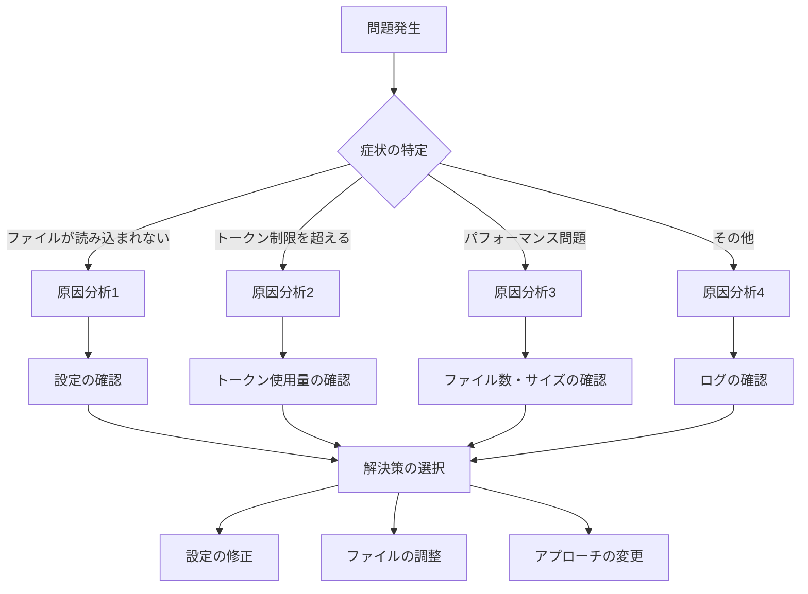

## 6. トラブルシューティング

この章では、コンテキスト設定で発生する問題の診断と解決方法を提供します。

---

### 6.1 問題の診断

#### 6.1.1 診断フローチャート



#### 6.1.2 症状の特定

#### 症状1: ファイルが読み込まれない

**確認方法**:
```bash
/context show
```

**症状**:
- ファイルが一覧に表示されない
- トークン数が0または予想より少ない

**次のステップ**: 原因分析1へ

---

#### 症状2: トークン制限を超える

**確認方法**:
```bash
/context show
# Total tokens: 65000/80000 (81.25%)
# ⚠️ Context limit exceeded!
```

**症状**:
- トークン使用量が75%以上
- ファイルが自動的にドロップされる
- 警告メッセージが表示される

**次のステップ**: 原因分析2へ

---

#### 症状3: パフォーマンス問題

**確認方法**:
```bash
# Agent起動時間の測定
time q chat --agent my-agent
```

**症状**:
- Agent起動が10秒以上
- 応答が5秒以上
- メモリ使用量が高い

**次のステップ**: 原因分析3へ

---

#### 症状4: その他

**症状**:
- エラーメッセージが表示される
- 予期しない動作
- 設定が反映されない

**次のステップ**: 原因分析4へ

---

#### 6.1.3 原因の分析

#### 原因分析1: ファイルが読み込まれない

**チェックリスト**:
- [ ] `file://`プレフィックスがあるか
- [ ] パスが正しいか
- [ ] ファイルが存在するか
- [ ] ファイルの権限が正しいか
- [ ] ワイルドカードが正しいか

**確認コマンド**:
```bash
# ファイルの存在確認
ls -la README.md

# パスの確認
find . -name "README.md"

# 権限の確認
ls -la README.md
# -rw-r--r-- 1 user user 5000 Oct 13 14:00 README.md

# ワイルドカードのマッチ確認
find .amazonq/rules/ -name "*.md"
```

---

#### 原因分析2: トークン制限を超える

**チェックリスト**:
- [ ] トークン使用量が75%以上か
- [ ] ファイル数が多すぎないか（25以上）
- [ ] 1ファイルが大きすぎないか（10KB以上）
- [ ] 不要なファイルが含まれていないか

**確認コマンド**:
```bash
# トークン使用量の確認
/context show

# ファイル数の確認
/context show | grep "Files:"

# 各ファイルのトークン数を確認
/context show | grep "tokens"

# ファイルサイズの確認
ls -lh README.md
```

---

#### 原因分析3: パフォーマンス問題

**チェックリスト**:
- [ ] ファイル数が多すぎないか（30以上）
- [ ] 1ファイルが大きすぎないか（20KB以上）
- [ ] 合計サイズが大きすぎないか（100KB以上）
- [ ] ワイルドカードが広すぎないか

**確認コマンド**:
```bash
# Agent起動時間の測定
time q chat --agent my-agent

# ファイル数の確認
find .amazonq/rules/ -name "*.md" | wc -l

# 合計サイズの確認
du -sh .amazonq/rules/
```

---

#### 原因分析4: その他

**チェックリスト**:
- [ ] エラーメッセージを確認
- [ ] ログを確認
- [ ] 設定ファイルの構文を確認
- [ ] 環境変数を確認

**確認コマンド**:
```bash
# 設定ファイルの構文確認
cat .amazonq/agent.json | jq .

# ログの確認（存在する場合）
cat ~/.amazonq/logs/agent.log

# 環境変数の確認
env | grep AMAZONQ
```

---

#### 6.1.4 解決策の選択

#### 解決策1: 設定の修正

**適用場面**:
- `file://`プレフィックスがない
- パスが間違っている
- ワイルドカードが間違っている

**手順**:
1. 設定ファイルを開く
2. 問題箇所を修正
3. 保存
4. Agent再起動
5. 確認

---

#### 解決策2: ファイルの調整

**適用場面**:
- トークン制限を超える
- ファイルが大きすぎる
- 不要なファイルが含まれる

**手順**:
1. 不要なファイルを削除
2. 大きなファイルを分割
3. Knowledge Basesへ移行
4. Agent再起動
5. 確認

---

#### 解決策3: アプローチの変更

**適用場面**:
- Agent Resourcesが適切でない
- パフォーマンス問題が解決しない
- トークン制限が厳しい

**手順**:
1. Session Contextへ変更
2. Knowledge Basesへ移行
3. 複数Agentに分割
4. 確認

---

### 6.2 よくある問題と解決方法

#### 6.2.1 問題1: ファイルが読み込まれない

#### 症状

```bash
/context show
# Files (0):
# Total tokens: 0/80000 (0%)
```

ファイルが一覧に表示されない。

#### 原因

**原因1: `file://`プレフィックスがない**

間違った設定:
```json
{
  "resources": [
    "README.md"
  ]
}
```

**原因2: パスが間違っている**

間違った設定:
```json
{
  "resources": [
    "file://docs/architecture.md"
  ]
}
```

実際のパス: `doc/architecture.md`（`docs`ではなく`doc`）

**原因3: ファイルが存在しない**

設定は正しいが、ファイルが存在しない。

#### 解決方法（ステップバイステップ）

📝 **ステップ1: `file://`プレフィックスの確認**

```bash
# 設定ファイルを確認
cat .amazonq/agent.json | jq '.resources'

# 出力例:
# [
#   "README.md"  # ← file://がない
# ]
```

**修正**:
```json
{
  "resources": [
    "file://README.md"
  ]
}
```

📝 **ステップ2: パスの確認**

```bash
# ファイルの存在確認
ls -la docs/architecture.md
# ls: cannot access 'docs/architecture.md': No such file or directory

# 正しいパスを検索
find . -name "architecture.md"
# ./doc/architecture.md
```

**修正**:
```json
{
  "resources": [
    "file://doc/architecture.md"
  ]
}
```

📝 **ステップ3: ファイルの存在確認**

```bash
# ファイルが存在するか確認
ls -la README.md

# 存在しない場合は作成
touch README.md
echo "# My Project" > README.md
```

📝 **ステップ4: Agent再起動**

```bash
# Agentを再起動
q chat --agent my-agent

# 確認
/context show
# Files (1):
# 1. README.md - 100 tokens
```

#### 予防方法

**チェックリスト**:
- [ ] すべてのパスに`file://`を付ける
- [ ] ファイルの存在を確認してから設定
- [ ] 相対パスを使用
- [ ] 設定後に`/context show`で確認

💡 **初心者向けポイント**: 設定を変更したら、必ず`/context show`で確認しましょう。

---

#### 6.2.2 問題2: トークン制限を超える

#### 症状

```bash
/context show
# Total tokens: 65000/80000 (81.25%)
# ⚠️ Context limit exceeded!
# Some files were automatically dropped.
```

トークン使用量が75%を超え、ファイルが自動的にドロップされる。

#### 原因

**原因1: ファイルが多すぎる**

```json
{
  "resources": [
    "file://**/*.md"  # すべての.mdファイル
  ]
}
```

**原因2: 1ファイルが大きすぎる**

```bash
ls -lh docs/complete-spec.md
# -rw-r--r-- 1 user user 50K Oct 13 14:00 docs/complete-spec.md
```

**原因3: 不要なファイルが含まれる**

```json
{
  "resources": [
    "file://README.md",
    "file://.amazonq/rules/**/*.md",
    "file://docs/**/*.md",
    "file://legacy-docs/**/*.md",  # 不要
    "file://archive/**/*.md"  # 不要
  ]
}
```

#### 解決方法（ステップバイステップ）

📝 **ステップ1: 現状分析**

```bash
/context show
# Total tokens: 65000/80000 (81.25%)
# Files (30):
# 1. README.md - 5000 tokens
# 2. legacy-docs/old-spec.md - 8000 tokens  # 大きい
# 3. archive/history.md - 6000 tokens  # 不要
# ...
```

📝 **ステップ2: 不要なファイルの削除**

```json
{
  "resources": [
    "file://README.md",
    "file://.amazonq/rules/**/*.md",
    "file://docs/architecture.md"
    // legacy-docs削除
    // archive削除
  ]
}
```

📝 **ステップ3: 大きなファイルの分割**

```bash
# 大きなファイルを分割
split -l 100 docs/complete-spec.md docs/spec-part-

# 分割されたファイル:
# docs/spec-part-aa
# docs/spec-part-ab
# docs/spec-part-ac
```

または、Knowledge Basesへ移行:

```bash
# Knowledge Baseをセットアップ
/knowledge add docs/
```

📝 **ステップ4: 効果確認**

```bash
/context show
# Total tokens: 30000/80000 (37.5%)
# Files (15):
# ✓ Context limit OK
```

#### 予防方法

**定期的な監視**:
```bash
# 週次で確認
/context show

# 60%以上なら最適化を検討
# 70%以上ならすぐに最適化
```

**ファイル追加時の確認**:
```bash
# ファイル追加前
/context show
# Total tokens: 25000/80000 (31.25%)

# ファイル追加

# ファイル追加後
/context show
# Total tokens: 32000/80000 (40%)
# ✓ まだ余裕あり
```

💡 **初心者向けポイント**: トークン使用量は50%以下を目標にしましょう。

---

## まとめ（Part1）

### 重要なポイント

1. **問題の診断**
   - 症状の特定: ファイル読み込み、トークン制限、パフォーマンス
   - 原因の分析: チェックリストで確認
   - 解決策の選択: 設定修正、ファイル調整、アプローチ変更

2. **よくある問題**
   - ファイルが読み込まれない: `file://`、パス、存在確認
   - トークン制限を超える: ファイル削減、分割、Knowledge Bases

### 次のステップ

Part2では、残りの問題とデバッグ手法を学びます。

---

**出典**:
- [調査報告書](202510131418_context_best_practices_report.md)
- [トラブルシューティングガイド](docs/01_for-users/06_troubleshooting/02_common-issues.md)
# 第6章 Part2: 残りの問題とデバッグ手法

#### 6.2.3 問題3: ワイルドカードがマッチしない

#### 症状

```bash
/context show
# Files (1):
# 1. README.md - 5000 tokens
# 
# 期待: .amazonq/rules/配下の複数ファイル
```

ワイルドカードを使用しているが、期待したファイルが読み込まれない。

#### 原因

**原因1: パターンが間違っている**

間違った設定:
```json
{
  "resources": [
    "file://.amazonq/rules/*.md"  # 直下のみ
  ]
}
```

実際のファイル構造:
```
.amazonq/
└── rules/
    ├── coding.md
    └── aws/
        └── naming.md  # ← マッチしない
```

**原因2: ファイルが存在しない**

設定は正しいが、ファイルが存在しない。

**原因3: ファイル拡張子が違う**

設定: `*.md`
実際: `*.markdown`

#### 解決方法（ステップバイステップ）

📝 **ステップ1: パターンの検証**

```bash
# マッチするファイルを確認
find .amazonq/rules/ -name "*.md"

# 出力例:
# .amazonq/rules/coding.md
# .amazonq/rules/aws/naming.md
```

📝 **ステップ2: パターンの修正**

```json
{
  "resources": [
    "file://.amazonq/rules/**/*.md"  # すべての子孫
  ]
}
```

📝 **ステップ3: ファイルの存在確認**

```bash
# ディレクトリ構造を確認
tree .amazonq/rules/

# 出力例:
# .amazonq/rules/
# ├── coding.md
# └── aws/
#     └── naming.md
```

📝 **ステップ4: Agent再起動**

```bash
q chat --agent my-agent

/context show
# Files (2):
# 1. coding.md - 3000 tokens
# 2. aws/naming.md - 2500 tokens
```

#### 予防方法

**パターンのテスト**:
```bash
# パターンをテスト
find . -path "./.amazonq/rules/**/*.md"

# マッチするファイル数を確認
find . -path "./.amazonq/rules/**/*.md" | wc -l
```

**ファイル作成時の確認**:
```bash
# 新しいルールファイルを作成
touch .amazonq/rules/new-rule.md

# マッチするか確認
find .amazonq/rules/ -name "*.md"
```

💡 **初心者向けポイント**: ワイルドカードは`find`コマンドでテストしましょう。

---

#### 6.2.4 問題4: パフォーマンス問題

#### 症状

```bash
# Agent起動時間の測定
time q chat --agent my-agent
# real    0m15.234s  # 15秒 → 遅い
```

Agent起動が遅い、応答が遅い。

#### 原因

**原因1: ファイル数が多すぎる**

```bash
/context show
# Files (35):  # 多すぎる
```

**原因2: 1ファイルが大きすぎる**

```bash
ls -lh docs/complete-spec.md
# -rw-r--r-- 1 user user 50K Oct 13 14:00 docs/complete-spec.md
```

**原因3: 合計サイズが大きすぎる**

```bash
/context show
# Total tokens: 55000/80000 (68.75%)  # 大きい
```

#### 解決方法（ステップバイステップ）

📝 **ステップ1: 現状分析**

```bash
# Agent起動時間
time q chat --agent my-agent
# real 0m15.234s

# ファイル数
/context show | grep "Files:"
# Files (35):

# トークン使用量
/context show | grep "Total tokens:"
# Total tokens: 55000/80000 (68.75%)
```

📝 **ステップ2: ファイル数の削減**

```json
{
  "resources": [
    "file://README.md",
    "file://.amazonq/rules/**/*.md",
    "file://docs/architecture.md"
    // 不要なファイルを削除
  ]
}
```

📝 **ステップ3: 大きなファイルの処理**

**方法1: 分割**
```bash
# ファイルを分割
split -l 100 docs/complete-spec.md docs/spec-part-
```

**方法2: Knowledge Basesへ移行**
```bash
/knowledge add docs/
```

📝 **ステップ4: 効果確認**

```bash
# Agent起動時間
time q chat --agent my-agent
# real 0m5.123s  # 改善: 15秒 → 5秒

# ファイル数
/context show | grep "Files:"
# Files (15):  # 改善: 35 → 15

# トークン使用量
/context show | grep "Total tokens:"
# Total tokens: 30000/80000 (37.5%)  # 改善: 68.75% → 37.5%
```

#### 予防方法

**定期的なパフォーマンス測定**:
```bash
# 月次で測定
time q chat --agent my-agent

# 10秒以上なら最適化を検討
```

**ファイル追加時の確認**:
```bash
# ファイル追加前
time q chat --agent my-agent
# real 0m5.123s

# ファイル追加

# ファイル追加後
time q chat --agent my-agent
# real 0m6.234s
# ✓ まだ許容範囲
```

💡 **初心者向けポイント**: Agent起動時間は5秒以下を目標にしましょう。

---

### 6.3 デバッグ手法

#### 6.3.1 `/context show`での確認

#### 基本的な使用方法

```bash
/context show
```

#### 出力の読み方

```
Context Information:
Total tokens: 30000/80000 (37.5%)

Files (15):
1. README.md - 5000 tokens
2. .amazonq/rules/coding.md - 3000 tokens
3. .amazonq/rules/api-design.md - 2500 tokens
4. docs/architecture.md - 4000 tokens
5. docs/api-spec.md - 3500 tokens
...
```

**確認すべきポイント**:

1. **総トークン数**: `30000/80000`
   - 現在の使用量: 30000トークン
   - 最大容量: 80000トークン
   - 使用率: 37.5%

2. **ファイル数**: `Files (15)`
   - 読み込まれているファイル数: 15
   - 推奨: 10-20ファイル

3. **各ファイルのトークン数**:
   - README.md: 5000トークン
   - 推奨: 5000トークン以下

#### 問題の特定

**問題1: トークン使用量が高い**
```
Total tokens: 65000/80000 (81.25%)
⚠️ Context limit exceeded!
```

**対策**: ファイルを削減、分割、Knowledge Basesへ移行

**問題2: ファイル数が多い**
```
Files (35):
```

**対策**: 不要なファイルを削除

**問題3: 1ファイルが大きい**
```
1. docs/complete-spec.md - 15000 tokens
```

**対策**: ファイルを分割

💡 **初心者向けポイント**: `/context show`は最も重要なデバッグコマンドです。

---

#### 6.3.2 トークン使用量の分析

#### 分析方法

📝 **ステップ1: 総トークン数の確認**

```bash
/context show | grep "Total tokens:"
# Total tokens: 30000/80000 (37.5%)
```

**判断**:
- 0-50%: 安全圏
- 50-60%: 注意
- 60-70%: 警戒
- 70-75%: 危険
- 75%以上: 制限超過

📝 **ステップ2: ファイルごとのトークン数を確認**

```bash
/context show | grep "tokens"
# 1. README.md - 5000 tokens
# 2. .amazonq/rules/coding.md - 3000 tokens
# 3. docs/complete-spec.md - 15000 tokens  # 大きい
```

**判断**:
- 5000トークン以下: 適切
- 5000-10000トークン: 注意
- 10000トークン以上: 分割を検討

📝 **ステップ3: 問題ファイルの特定**

```bash
# トークン数でソート（手動）
/context show

# 大きいファイルを特定
# 3. docs/complete-spec.md - 15000 tokens  # ← これ
```

📝 **ステップ4: 最適化の計画**

```
現状: 30000トークン (37.5%)
目標: 25000トークン (31.25%)

削減対象:
- docs/complete-spec.md: 15000 → 5000 (10000削減)
  方法: Knowledge Basesへ移行

期待結果: 30000 - 10000 = 20000トークン (25%)
```

#### 最適化の実施

```bash
# Knowledge Baseをセットアップ
/knowledge add docs/

# 設定から削除
# "file://docs/complete-spec.md" を削除

# Agent再起動

# 確認
/context show
# Total tokens: 20000/80000 (25%)
# ✓ 目標達成
```

💡 **初心者向けポイント**: トークン使用量は定期的に分析しましょう。

---

#### 6.3.3 ファイルパスの検証

#### 検証方法

📝 **ステップ1: 設定ファイルの確認**

```bash
cat .amazonq/agent.json | jq '.resources'
# [
#   "file://README.md",
#   "file://.amazonq/rules/**/*.md",
#   "file://docs/architecture.md"
# ]
```

📝 **ステップ2: 各パスの検証**

```bash
# README.mdの確認
ls -la README.md
# -rw-r--r-- 1 user user 5000 Oct 13 14:00 README.md
# ✓ 存在する

# .amazonq/rules/**/*.mdの確認
find .amazonq/rules/ -name "*.md"
# .amazonq/rules/coding.md
# .amazonq/rules/api-design.md
# ✓ マッチする

# docs/architecture.mdの確認
ls -la docs/architecture.md
# ls: cannot access 'docs/architecture.md': No such file or directory
# ✗ 存在しない
```

📝 **ステップ3: 問題の修正**

```bash
# 正しいパスを検索
find . -name "architecture.md"
# ./doc/architecture.md

# 設定を修正
# "file://docs/architecture.md" → "file://doc/architecture.md"
```

📝 **ステップ4: 再検証**

```bash
# 修正後の確認
ls -la doc/architecture.md
# -rw-r--r-- 1 user user 4000 Oct 13 14:00 doc/architecture.md
# ✓ 存在する

# Agent再起動

# 確認
/context show
# Files (3):
# 1. README.md - 5000 tokens
# 2. .amazonq/rules/coding.md - 3000 tokens
# 3. doc/architecture.md - 4000 tokens
# ✓ すべて読み込まれた
```

#### よくある間違い

**間違い1: `file://`の忘れ**
```json
{
  "resources": [
    "README.md"  // ✗
  ]
}
```

**正しい**:
```json
{
  "resources": [
    "file://README.md"  // ✓
  ]
}
```

**間違い2: パスの間違い**
```json
{
  "resources": [
    "file://docs/architecture.md"  // ✗ (実際はdoc/)
  ]
}
```

**正しい**:
```json
{
  "resources": [
    "file://doc/architecture.md"  // ✓
  ]
}
```

**間違い3: ワイルドカードの間違い**
```json
{
  "resources": [
    "file://.amazonq/rules/*.md"  // ✗ (直下のみ)
  ]
}
```

**正しい**:
```json
{
  "resources": [
    "file://.amazonq/rules/**/*.md"  // ✓ (すべての子孫)
  ]
}
```

💡 **初心者向けポイント**: パスは必ず`ls`や`find`で検証しましょう。

---

## まとめ（Part2）

### 重要なポイント

1. **残りの問題**
   - ワイルドカードがマッチしない: パターンの検証
   - パフォーマンス問題: ファイル数・サイズの削減

2. **デバッグ手法**
   - `/context show`: 最も重要なコマンド
   - トークン使用量の分析: 定期的に実施
   - ファイルパスの検証: `ls`、`find`で確認

### 次のステップ

第7章では、高度なトピックを学びます。

---

**出典**:
- [調査報告書](202510131418_context_best_practices_report.md)
- [トラブルシューティングガイド](docs/01_for-users/06_troubleshooting/02_common-issues.md)
- [コマンドリファレンス](docs/01_for-users/07_reference/02_commands.md)

---

**次の章**: [第7章: 高度なトピック](07_advanced.md)

