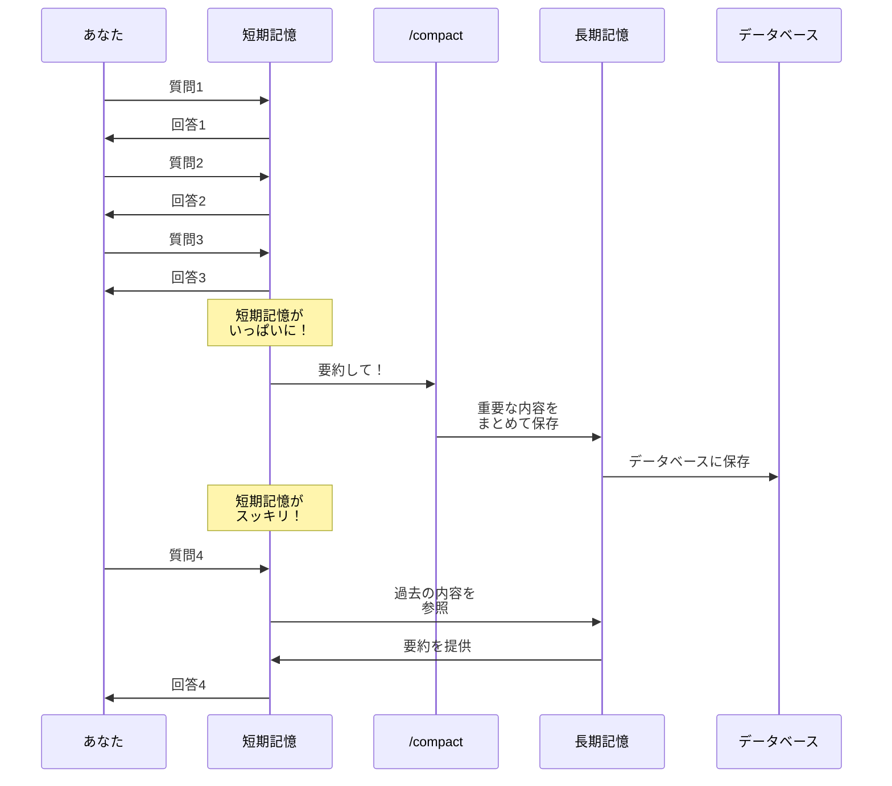
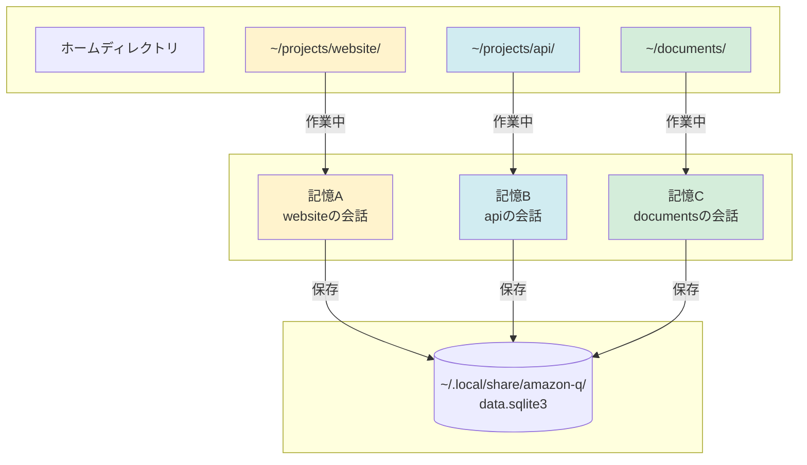
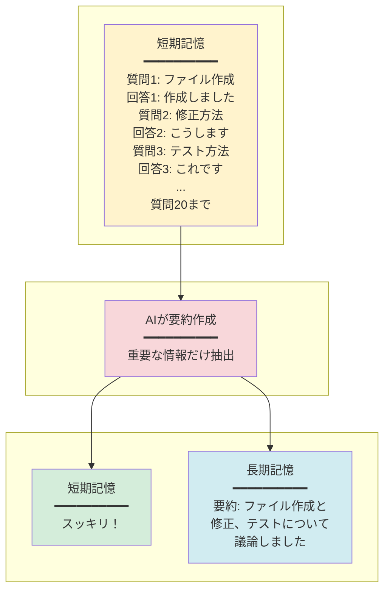
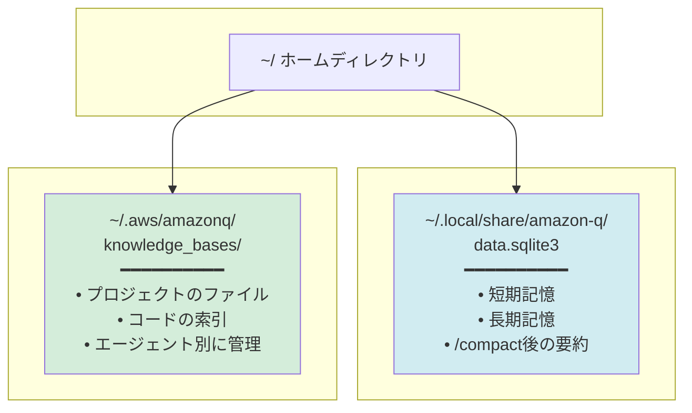

[ホーム](../../README.md) > [ユーザーガイド](../README.md) > [ガイド](README.md) > 記憶管理ガイド

---

# 猫でもわかるQ CLIの記憶管理

**対象読者**: Q CLI初心者  
**所要時間**: 5分  
**前提知識**: なし

---

## 🎯 この記事で分かること

- Q CLIの「短期記憶」と「長期記憶」の違い
- `/compact`コマンドの役割と使い方
- フォルダごとに会話が分かれる仕組み
- 記憶がどこに保存されているか

---

## 💡 Q CLIの記憶は2種類ある

Q CLIは人間の脳のように、**短期記憶**と**長期記憶**の2種類の記憶を持っています。

### 短期記憶（作業記憶）

**何を覚えている？**
- 今の会話の内容
- 直前のやり取り
- 実行したコマンドの結果

**特徴**:
- ✅ すぐに思い出せる（高速）
- ❌ 容量が限られている
- ❌ 会話が長くなると忘れる

**例え**: 人間の「作業記憶」と同じ。今考えていることは覚えているけど、昨日の夕食は忘れる。

### 長期記憶（会話履歴）

**何を覚えている？**
- 過去の会話の要約
- 重要なコードや情報
- プロジェクトの背景

**特徴**:
- ✅ 大量の情報を保存できる
- ✅ 次回起動時も覚えている
- ❌ 思い出すのに時間がかかる

**例え**: 人間の「長期記憶」と同じ。昔のことは覚えているけど、詳細は曖昧。

---

## 🧠 記憶の仕組みを図で理解する

### 会話の流れと記憶の関係

```mermaid
graph TB
    subgraph user[" "]
        User[ユーザー]
    end
    
    subgraph qcli[" "]
        STM[短期記憶<br/>今の会話]
        LTM[長期記憶<br/>過去の要約]
        Compact[/compact<br/>コマンド]
    end
    
    subgraph storage[" "]
        DB[(データベース<br/>~/.local/share/amazon-q/<br/>data.sqlite3)]
    end
    
    User -->|質問| STM
    STM -->|回答| User
    STM -->|容量いっぱい| Compact
    Compact -->|要約作成| LTM
    LTM -->|保存| DB
    DB -->|次回起動時<br/>読み込み| LTM
    LTM -->|参照| STM
    
    style STM fill:#fff3cd
    style LTM fill:#d1ecf1
    style Compact fill:#f8d7da
    style DB fill:#d4edda
```

### 記憶の流れ（ステップバイステップ）



---

## 📁 フォルダごとに記憶が分かれる仕組み

Q CLIは**作業フォルダごと**に別々の記憶を持っています。

### 具体例で理解する



### 実際の動作

```bash
# プロジェクトAで作業
cd ~/projects/website/
q chat "このプロジェクトについて教えて"
# → 記憶A（websiteの会話）を使用

# プロジェクトBに移動
cd ~/projects/api/
q chat "このプロジェクトについて教えて"
# → 記憶B（apiの会話）を使用

# プロジェクトAに戻る
cd ~/projects/website/
q chat "さっきの続きを教えて"
# → 記憶A（websiteの会話）を復元！
```

**ポイント**:
- ✅ フォルダが違えば、会話も別々
- ✅ 同じフォルダに戻れば、会話が復元される
- ✅ プロジェクトごとに独立した会話ができる

---

## 🔄 /compactコマンドの使い方

### /compactコマンドとは？

**一言で言うと**: 「会話を要約して、記憶をスッキリさせるコマンド」

### いつ使う？

```mermaid
graph LR
    A[会話が長くなった] --> B{記憶がいっぱい？}
    B -->|はい| C[/compactを実行]
    B -->|いいえ| D[そのまま続ける]
    C --> E[記憶がスッキリ！]
    E --> F[会話を続ける]
    
    style A fill:#fff3cd
    style C fill:#f8d7da
    style E fill:#d4edda
```

**使うタイミング**:
1. ⚠️ 「記憶容量の警告」が表示された時
2. 📝 長い会話が続いた後
3. 🔄 新しい話題に切り替える前
4. 🛠️ 複雑なツール操作の後

### 使い方

```bash
# 基本的な使い方
/compact

# 要約を確認しながら実行
/compact --show-summary

# 最近のN個のメッセージを除外して要約
/compact --messages-to-exclude 3
```

### /compactの動作



---

## 💾 記憶はどこに保存される？

### 保存場所の全体像



### 詳細な保存場所

| 種類 | 保存場所 | 内容 |
|------|---------|------|
| **会話履歴** | `~/.local/share/amazon-q/data.sqlite3` | • 短期記憶（今の会話）<br/>• 長期記憶（過去の要約）<br/>• フォルダごとに管理 |
| **Knowledge Base** | `~/.aws/amazonq/knowledge_bases/` | • プロジェクトのファイル索引<br/>• エージェント別に管理<br/>• `{agent_name}_{hash}/`形式 |

---

## 🎓 実践例：記憶管理を体験する

### ステップ1: 新しいプロジェクトで会話を始める

```bash
cd ~/projects/my-app/
q chat "このプロジェクトのREADMEを作成して"
```

### ステップ2: 会話を続ける

```bash
# Q CLIのチャット内で
"次にテストコードを作成して"
"デプロイ方法も教えて"
"エラーハンドリングを追加して"
# ... 会話が長くなる
```

### ステップ3: 記憶がいっぱいになったら

```bash
# 警告が表示される
⚠️ Context window is approaching its limit...

# /compactを実行
/compact --show-summary
```

### ステップ4: 別のプロジェクトに移動

```bash
cd ~/projects/another-app/
q chat "このプロジェクトについて教えて"
# → 別の記憶を使用（my-appの会話は保存されている）
```

### ステップ5: 元のプロジェクトに戻る

```bash
cd ~/projects/my-app/
q chat "さっきの続きを教えて"
# → my-appの会話が復元される！
```

---

## 🤔 よくある質問

### Q1: 短期記憶と長期記憶、どっちが重要？

**A**: 両方重要です！

- **短期記憶**: 今の会話に必要（速い）
- **長期記憶**: 過去の文脈を保持（大容量）

人間の脳と同じで、両方がうまく連携することで効果的な会話ができます。

### Q2: /compactは自動で実行される？

**A**: はい、自動実行されます！

- 記憶容量がいっぱいになると自動で実行
- 無効化したい場合: `q settings chat.disableAutoCompaction true`

### Q3: フォルダを移動すると会話が消える？

**A**: いいえ、消えません！

- 会話はデータベースに保存されている
- 元のフォルダに戻れば会話が復元される
- 別のフォルダでは別の会話が始まる

### Q4: 記憶を完全に削除したい場合は？

**A**: データベースファイルを削除します。

```bash
# 注意: すべての会話履歴が削除されます
rm ~/.local/share/amazon-q/data.sqlite3
```

### Q5: Knowledge Baseと会話履歴の違いは？

**A**: 保存場所と目的が違います。

| 項目 | 会話履歴 | Knowledge Base |
|------|---------|---------------|
| **保存場所** | `~/.local/share/amazon-q/` | `~/.aws/amazonq/knowledge_bases/` |
| **内容** | 会話のやり取り | プロジェクトのファイル索引 |
| **管理単位** | フォルダごと | エージェント+フォルダごと |

---

## 📚 関連ドキュメント

- **[/compactコマンドの詳細](../07_reference/02_commands.md#compact)** - コマンドリファレンス
- **[コンテキスト管理ガイド](README.md)** - 高度な使い方
- **[設定ガイド](../03_configuration/README.md)** - 記憶管理の設定

---

## 🔬 技術的な詳細（上級者向け）

この記憶管理の仕組みは、Q CLI v1.19.6のソースコードを調査して確認されています。

詳細な技術検証については、以下のドキュメントを参照してください：
- **検証レポート**: `/home/katoh/work_records/20251115/202511151830_compact_memory_verification.md`

---

## 🎯 まとめ

### 覚えておくべき3つのポイント

1. **記憶は2種類**
   - 短期記憶（今の会話）
   - 長期記憶（過去の要約）

2. **フォルダごとに記憶が分かれる**
   - プロジェクトごとに独立した会話
   - 元のフォルダに戻れば会話が復元

3. **/compactで記憶をスッキリ**
   - 会話が長くなったら実行
   - 自動実行もされる

### 次のステップ

- ✅ 実際にQ CLIで会話してみる
- ✅ /compactコマンドを試してみる
- ✅ 複数のプロジェクトで使ってみる

---

**最終更新**: 2025-11-15  
**対象バージョン**: v1.19.6以降
