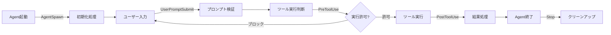

[ホーム](../../README.md) > [ユーザーガイド](../README.md) > [ガイド](README.md) > 09 ワークフロー自動化

---

# Agent Hooksによるワークフロー自動化 実践ガイド

**最終更新**: 2025-10-25  
**対象バージョン**: v1.17.0以降  
**難易度**: 中級〜上級

---

## 📋 概要

このガイドでは、Q CLI Agent Hooksを使用して開発ワークフローを自動化する方法を説明します。ファイル保存時の自動フォーマット、コミット前のテスト実行、セキュリティスキャンなど、実践的なユースケースを網羅します。

---

## 🎯 このガイドで学べること

- Agent Hooksの基本的な使い方
- 実践的な自動化パターン
- スクリプトの作成方法
- トラブルシューティング
- パフォーマンス最適化
- セキュリティベストプラクティス

---

## 📚 目次

1. [Agent Hooksとは](#1-agent-hooksとは)
2. [クイックスタート](#2-クイックスタート)
3. [実践的なユースケース](#3-実践的なユースケース)
4. [高度な実装パターン](#4-高度な実装パターン)
5. [トラブルシューティング](#5-トラブルシューティング)
6. [パフォーマンス最適化](#6-パフォーマンス最適化)
7. [セキュリティベストプラクティス](#7-セキュリティベストプラクティス)
8. [次のステップ](#8-次のステップ)

---

## 1. Agent Hooksとは

Agent Hooksは、Agent実行時の特定のタイミングでスクリプトを自動実行する機能です。開発ワークフローを自動化し、コード品質の向上と作業効率化を実現します。

### 5種類のトリガー

Q CLI Agent Hooksは5種類のトリガーポイントを提供します：



#### AgentSpawn
- **タイミング**: Agent起動時（1回のみ）
- **用途**: 環境初期化、設定検証、依存関係チェック
- **終了コード**: 0=成功、その他=失敗（Agent起動中止）

#### UserPromptSubmit
- **タイミング**: ユーザーがプロンプトを送信した直後
- **用途**: プロンプト検証、コンテキスト追加、ログ記録
- **終了コード**: 0=成功、その他=失敗（プロンプト処理中止）

#### PreToolUse
- **タイミング**: ツール実行直前
- **用途**: ツール実行の許可/拒否、パラメータ検証、セキュリティチェック
- **終了コード**: 0=許可、2=ブロック、その他=失敗

#### PostToolUse
- **タイミング**: ツール実行直後
- **用途**: 結果の検証、ログ記録、後処理
- **終了コード**: 0=成功、その他=失敗

#### Stop
- **タイミング**: Agent終了時
- **用途**: クリーンアップ、統計情報の保存、リソース解放
- **終了コード**: 0=成功、その他=失敗

### 学習の進め方

1. **初心者**: クイックスタート → ユースケース1-2
2. **中級者**: ユースケース3-5 → 高度なパターン
3. **上級者**: トラブルシューティング → パフォーマンス最適化

---

## 2. クイックスタート

最も簡単な例として、ファイル保存時にメッセージを表示するHookを作成します。

### ステップ1: Agent設定ファイルの作成

```bash
mkdir -p ~/.aws/amazonq/cli-agents
vi ~/.aws/amazonq/cli-agents/hello-hook.json
```

```json
{
  "name": "hello-hook",
  "description": "Hello World Hook",
  "hooks": [
    {
      "trigger": "PostToolUse",
      "tool_matcher": "fs_write",
      "command": ["echo", "✅ File saved!"]
    }
  ]
}
```

### ステップ2: Agentの起動

```bash
q chat --agent hello-hook
```

### ステップ3: 動作確認

Q CLIでファイルを保存すると、`✅ File saved!` が表示されます。

---

## 3. 実践的なユースケース

### ユースケース1: 自動フォーマット

ファイル保存時に自動的にコードをフォーマットします。

#### ステップ1: スクリプトの作成

```bash
mkdir -p ~/.aws/amazonq/scripts
vi ~/.aws/amazonq/scripts/auto-format.sh
```

```bash
#!/bin/bash
# 自動フォーマットスクリプト

set -e

# 環境変数から情報を取得
FILE_PATH=$(echo "${Q_HOOK_TOOL_PARAMS}" | jq -r '.path')

# ファイルが存在しない場合は終了
if [ ! -f "$FILE_PATH" ]; then
  exit 0
fi

# ファイル拡張子を取得
EXT="${FILE_PATH##*.}"

# 拡張子に応じてフォーマッターを実行
case "$EXT" in
  js|jsx|ts|tsx)
    if command -v prettier &> /dev/null; then
      echo "✨ Formatting with Prettier: $FILE_PATH"
      prettier --write "$FILE_PATH" 2>&1
    fi
    ;;
  py)
    if command -v black &> /dev/null; then
      echo "✨ Formatting with Black: $FILE_PATH"
      black "$FILE_PATH" 2>&1
    fi
    ;;
  go)
    if command -v gofmt &> /dev/null; then
      echo "✨ Formatting with gofmt: $FILE_PATH"
      gofmt -w "$FILE_PATH" 2>&1
    fi
    ;;
  *)
    echo "ℹ️  No formatter configured for .$EXT files"
    ;;
esac

exit 0
```

```bash
chmod +x ~/.aws/amazonq/scripts/auto-format.sh
```

#### ステップ2: Agent設定

```bash
vi ~/.aws/amazonq/cli-agents/auto-format-agent.json
```

```json
{
  "name": "auto-format-agent",
  "description": "ファイル保存時に自動フォーマット",
  "hooks": [
    {
      "trigger": "PostToolUse",
      "tool_matcher": "fs_write",
      "command": ["~/.aws/amazonq/scripts/auto-format.sh"],
      "timeout_ms": 10000
    }
  ]
}
```

#### ステップ3: 使用

```bash
q chat --agent auto-format-agent
```

---

### ユースケース2: コミット前のテスト実行

Gitコミット前に自動的にテストを実行し、失敗時はコミットをブロックします。

#### ステップ1: スクリプトの作成

```bash
vi ~/.aws/amazonq/scripts/run-tests.sh
```

```bash
#!/bin/bash
# コミット前テスト実行スクリプト

set -e

echo "🧪 Running tests before commit..."

# プロジェクトタイプを検出してテストを実行
if [ -f "package.json" ]; then
  echo "📦 Detected Node.js project"
  npm test
elif [ -f "pytest.ini" ] || [ -f "setup.py" ]; then
  echo "🐍 Detected Python project"
  pytest
elif [ -f "Cargo.toml" ]; then
  echo "🦀 Detected Rust project"
  cargo test
elif [ -f "go.mod" ]; then
  echo "🐹 Detected Go project"
  go test ./...
else
  echo "ℹ️  No test configuration found, skipping tests"
  exit 0
fi

# テスト失敗時はコミットをブロック
if [ $? -ne 0 ]; then
  echo "❌ Tests failed. Commit blocked."
  exit 2  # ブロック
fi

echo "✅ Tests passed. Commit allowed."
exit 0
```

```bash
chmod +x ~/.aws/amazonq/scripts/run-tests.sh
```

#### ステップ2: Agent設定

```bash
vi ~/.aws/amazonq/cli-agents/test-before-commit.json
```

```json
{
  "name": "test-before-commit",
  "description": "コミット前にテストを実行",
  "hooks": [
    {
      "trigger": "PreToolUse",
      "tool_matcher": "@git/commit",
      "command": ["~/.aws/amazonq/scripts/run-tests.sh"],
      "timeout_ms": 60000,
      "cache_ttl_seconds": 60
    }
  ]
}
```

**注意**: MCPサーバー `@git` が設定されている必要があります。

---

### ユースケース3: セキュリティスキャン

依存関係ファイルの変更時に自動的にセキュリティスキャンを実行します。

#### ステップ1: スクリプトの作成

```bash
vi ~/.aws/amazonq/scripts/security-scan.sh
```

```bash
#!/bin/bash
# セキュリティスキャンスクリプト

set -e

FILE_PATH=$(echo "${Q_HOOK_TOOL_PARAMS}" | jq -r '.path')
FILENAME=$(basename "$FILE_PATH")

echo "🔒 Checking file: $FILENAME"

# 依存関係ファイルのみスキャン
case "$FILENAME" in
  package.json|package-lock.json)
    if command -v npm &> /dev/null; then
      echo "🔍 Running npm audit..."
      npm audit --audit-level=moderate
    fi
    ;;
  requirements.txt|Pipfile.lock)
    if command -v safety &> /dev/null; then
      echo "🔍 Running safety check..."
      safety check
    fi
    ;;
  Gemfile.lock)
    if command -v bundle &> /dev/null; then
      echo "🔍 Running bundle audit..."
      bundle audit check --update
    fi
    ;;
  *)
    echo "ℹ️  Not a dependency file, skipping security scan"
    exit 0
    ;;
esac

exit 0
```

```bash
chmod +x ~/.aws/amazonq/scripts/security-scan.sh
```

#### ステップ2: Agent設定

```bash
vi ~/.aws/amazonq/cli-agents/security-scan-agent.json
```

```json
{
  "name": "security-scan-agent",
  "description": "依存関係ファイルのセキュリティスキャン",
  "hooks": [
    {
      "trigger": "PostToolUse",
      "tool_matcher": "fs_write",
      "command": ["~/.aws/amazonq/scripts/security-scan.sh"],
      "cache_ttl_seconds": 300
    }
  ]
}
```

---

### ユースケース4: コード品質チェック

コミット前にlinterを実行し、品質基準を満たさない場合はコミットをブロックします。

#### ステップ1: スクリプトの作成

```bash
vi ~/.aws/amazonq/scripts/quality-check.sh
```

```bash
#!/bin/bash
# コード品質チェックスクリプト

set -e

echo "📊 Running code quality checks..."

# 変更されたファイルを取得
CHANGED_FILES=$(git diff --cached --name-only --diff-filter=ACM)

if [ -z "$CHANGED_FILES" ]; then
  echo "ℹ️  No files to check"
  exit 0
fi

# エラーカウンター
ERROR_COUNT=0

# ファイルタイプごとにlinterを実行
for FILE in $CHANGED_FILES; do
  if [ ! -f "$FILE" ]; then
    continue
  fi
  
  EXT="${FILE##*.}"
  
  case "$EXT" in
    js|jsx|ts|tsx)
      if command -v eslint &> /dev/null; then
        echo "🔍 Linting $FILE with ESLint..."
        eslint "$FILE" || ((ERROR_COUNT++))
      fi
      ;;
    py)
      if command -v pylint &> /dev/null; then
        echo "🔍 Linting $FILE with Pylint..."
        pylint "$FILE" || ((ERROR_COUNT++))
      fi
      ;;
    go)
      if command -v golint &> /dev/null; then
        echo "🔍 Linting $FILE with golint..."
        golint "$FILE" || ((ERROR_COUNT++))
      fi
      ;;
  esac
done

if [ $ERROR_COUNT -gt 0 ]; then
  echo "❌ Quality checks failed with $ERROR_COUNT errors. Commit blocked."
  exit 2  # ブロック
fi

echo "✅ Quality checks passed."
exit 0
```

```bash
chmod +x ~/.aws/amazonq/scripts/quality-check.sh
```

#### ステップ2: Agent設定

```bash
vi ~/.aws/amazonq/cli-agents/quality-check-agent.json
```

```json
{
  "name": "quality-check-agent",
  "description": "コミット前のコード品質チェック",
  "hooks": [
    {
      "trigger": "PreToolUse",
      "tool_matcher": "@git/commit",
      "command": ["~/.aws/amazonq/scripts/quality-check.sh"],
      "timeout_ms": 30000
    }
  ]
}
```

---

### ユースケース5: 複合Agent（すべてを統合）

すべての自動化を1つのAgentに統合します。

```bash
vi ~/.aws/amazonq/cli-agents/full-automation-agent.json
```

```json
{
  "name": "full-automation-agent",
  "description": "完全自動化Agent",
  "hooks": [
    {
      "trigger": "PostToolUse",
      "tool_matcher": "fs_write",
      "command": ["~/.aws/amazonq/scripts/auto-format.sh"],
      "timeout_ms": 10000
    },
    {
      "trigger": "PostToolUse",
      "tool_matcher": "fs_write",
      "command": ["~/.aws/amazonq/scripts/security-scan.sh"],
      "cache_ttl_seconds": 300
    },
    {
      "trigger": "PreToolUse",
      "tool_matcher": "@git/commit",
      "command": ["~/.aws/amazonq/scripts/run-tests.sh"],
      "timeout_ms": 60000,
      "cache_ttl_seconds": 60
    },
    {
      "trigger": "PreToolUse",
      "tool_matcher": "@git/commit",
      "command": ["~/.aws/amazonq/scripts/quality-check.sh"],
      "timeout_ms": 30000
    }
  ]
}
```

---

## 4. 高度な実装パターン

### パターン1: 条件付き実行

環境変数や設定ファイルに基づいて実行を制御します。

```bash
#!/bin/bash
# 条件付き実行パターン

# CI環境では実行しない
if [ "$CI" = "true" ]; then
  echo "⏭️  Skipping in CI environment"
  exit 0
fi

# 設定ファイルで制御
if [ -f ".hook-config.json" ]; then
  ENABLED=$(jq -r '.hooks.format.enabled' .hook-config.json)
  if [ "$ENABLED" != "true" ]; then
    echo "⏭️  Hook disabled in config"
    exit 0
  fi
fi

# 実際の処理
echo "🚀 Running hook..."
```

### パターン2: 並列実行

複数のチェックを並列実行して高速化します。

```bash
#!/bin/bash
# 並列実行パターン

# バックグラウンドで複数のチェックを実行
~/.aws/amazonq/scripts/lint-check.sh &
PID1=$!

~/.aws/amazonq/scripts/test-check.sh &
PID2=$!

~/.aws/amazonq/scripts/security-check.sh &
PID3=$!

# すべての完了を待つ
wait $PID1
EXIT1=$?

wait $PID2
EXIT2=$?

wait $PID3
EXIT3=$?

# いずれかが失敗した場合はブロック
if [ $EXIT1 -ne 0 ] || [ $EXIT2 -ne 0 ] || [ $EXIT3 -ne 0 ]; then
  echo "❌ One or more checks failed"
  exit 2
fi

echo "✅ All checks passed"
exit 0
```

### パターン3: 通知統合

Slack、メール、デスクトップ通知との統合：

```bash
#!/bin/bash
# 通知統合パターン

RESULT=$(~/.aws/amazonq/scripts/expensive-check.sh 2>&1)
EXIT_CODE=$?

if [ $EXIT_CODE -ne 0 ]; then
  # Slack通知
  if [ -n "$SLACK_WEBHOOK_URL" ]; then
    curl -X POST -H 'Content-type: application/json' \
      --data "{\"text\":\"❌ Hook failed: $RESULT\"}" \
      "$SLACK_WEBHOOK_URL"
  fi
  
  # デスクトップ通知（macOS）
  if command -v osascript &> /dev/null; then
    osascript -e "display notification \"$RESULT\" with title \"Q CLI Hook Failed\""
  fi
  
  # デスクトップ通知（Linux）
  if command -v notify-send &> /dev/null; then
    notify-send "Q CLI Hook Failed" "$RESULT"
  fi
fi

exit $EXIT_CODE
```

### パターン4: メトリクス収集

実行時間、成功率などのメトリクスを収集します。

```bash
#!/bin/bash
# メトリクス収集パターン

START_TIME=$(date +%s)

# 実際の処理
~/.aws/amazonq/scripts/main-check.sh
EXIT_CODE=$?

END_TIME=$(date +%s)
DURATION=$((END_TIME - START_TIME))

# メトリクスをCSVファイルに記録
METRICS_FILE="$HOME/.amazonq/hook-metrics.csv"

# ヘッダーがない場合は作成
if [ ! -f "$METRICS_FILE" ]; then
  echo "timestamp,trigger,tool,duration_sec,exit_code" > "$METRICS_FILE"
fi

# メトリクスを追記
echo "$(date -Iseconds),${Q_HOOK_TRIGGER},${Q_HOOK_TOOL_NAME},$DURATION,$EXIT_CODE" \
  >> "$METRICS_FILE"

exit $EXIT_CODE
```

---

## 5. トラブルシューティング

### 問題1: Hookが実行されない

**症状**: ファイルを保存してもHookが実行されない

**原因と解決策**:

1. **スクリプトに実行権限がない**
   ```bash
   chmod +x ~/.aws/amazonq/scripts/*.sh
   ```

2. **Agent設定が正しくない**
   ```bash
   # Agent設定を確認
   q agent list
   
   # Agent設定ファイルを確認
   cat ~/.aws/amazonq/cli-agents/your-agent.json
   ```

3. **Tool Matcherが一致しない**
   ```json
   {
     "tool_matcher": "fs_write"  // 正しい
     // "tool_matcher": "write_file"  // 間違い
   }
   ```

### 問題2: Hookがタイムアウトする

**症状**: Hook実行中にタイムアウトエラーが発生

**解決策**:

1. **タイムアウト時間を延長**
   ```json
   {
     "timeout_ms": 60000  // 60秒に延長
   }
   ```

2. **処理を高速化**
   - キャッシングを活用
   - 並列実行を検討
   - 不要な処理を削除

### 問題3: 環境変数が取得できない

**症状**: `Q_HOOK_*` 環境変数が空

**解決策**:

1. **環境変数の確認**
   ```bash
   #!/bin/bash
   echo "Trigger: ${Q_HOOK_TRIGGER}"
   echo "Tool: ${Q_HOOK_TOOL_NAME}"
   echo "Params: ${Q_HOOK_TOOL_PARAMS}"
   ```

2. **jqでパラメータを解析**
   ```bash
   FILE_PATH=$(echo "${Q_HOOK_TOOL_PARAMS}" | jq -r '.path')
   ```

### 問題4: Hookがコミットをブロックしない

**症状**: PreToolUseで終了コード2を返してもツールが実行される

**解決策**:

1. **終了コードを確認**
   ```bash
   # 正しい
   exit 2  # ブロック
   
   # 間違い
   exit 1  # 失敗（ブロックしない）
   ```

2. **Tool Matcherを確認**
   ```json
   {
     "trigger": "PreToolUse",  // 正しい
     "tool_matcher": "@git/commit"
   }
   ```

---

## 6. パフォーマンス最適化

### 1. キャッシングの活用

重い処理はキャッシングを活用して高速化：

```json
{
  "hooks": [
    {
      "trigger": "PreToolUse",
      "tool_matcher": "fs_*",
      "command": ["~/.aws/amazonq/scripts/expensive-check.sh"],
      "cache_ttl_seconds": 300  // 5分間キャッシュ
    }
  ]
}
```

### 2. 並列実行

独立した複数のチェックは並列実行：

```bash
# 並列実行で高速化
./check1.sh & PID1=$!
./check2.sh & PID2=$!
./check3.sh & PID3=$!
wait $PID1 $PID2 $PID3
```

### 3. 条件付きスキップ

不要な場合は早期に終了：

```bash
# ファイルタイプをチェックして早期終了
EXT="${FILE_PATH##*.}"
if [ "$EXT" != "js" ] && [ "$EXT" != "ts" ]; then
  exit 0
fi
```

---

## 7. セキュリティベストプラクティス

### 1. 最小権限の原則

スクリプトには必要最小限の権限のみを付与：

```bash
# 実行権限のみ
chmod 755 ~/.aws/amazonq/scripts/*.sh

# 読み取り専用の設定ファイル
chmod 644 ~/.aws/amazonq/cli-agents/*.json
```

### 2. 入力検証

環境変数やパラメータを検証：

```bash
# パラメータの検証
if [ -z "$FILE_PATH" ]; then
  echo "Error: FILE_PATH is empty"
  exit 1
fi

# パスの検証
if [[ "$FILE_PATH" == *".."* ]]; then
  echo "Error: Invalid path"
  exit 1
fi
```

### 3. 機密情報の保護

ログに機密情報を含めない：

```bash
# 機密情報をマスク
echo "Processing file: $(basename $FILE_PATH)"
# echo "Processing file: $FILE_PATH"  # フルパスは避ける
```

---

## 8. 次のステップ

### 学習の進め方

1. **基本的なHookを試す**: 自動フォーマットから始める
2. **複数のHookを組み合わせる**: テスト + Lint + セキュリティスキャン
3. **チーム全体で標準化**: 共通のAgent設定を作成
4. **メトリクスを収集**: 実行時間や成功率を可視化

### 関連ドキュメント

- **[Agent設定ガイド](../03_configuration/03_agent-configuration.md)** - Hooks設定の技術仕様
- **[Kiro比較](../04_best-practices/05_agent-hooks-comparison.md)** - Kiroとの機能比較とエンタープライズ視点
- **[Agent機能](../02_features/02_agents.md)** - Agent機能の概要

---

**作成者**: Amazon Q Developer CLI  
**レビュー**: katoh  
**バージョン**: 1.0
