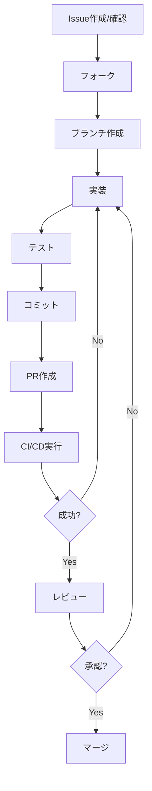

# コントリビューションガイド

**最終更新**: 2025-10-13

---

## 🤝 貢献方法

Amazon Q CLIへの貢献を歓迎します！バグ報告、機能要望、コード貢献、ドキュメント改善など、あらゆる形での貢献をお待ちしています。

---

## 📚 ドキュメント一覧

| # | ドキュメント | 対象 | 内容 |
|---|-------------|------|------|
| 1 | [開発環境セットアップ](01_development-setup.md) | 開発者 | 開発環境の構築手順 |
| 2 | [プルリクエストガイド](02_pull-request-guide.md) | 開発者 | PRの作成手順とレビュープロセス |

---

## 📝 貢献の種類

### バグ報告
[GitHub Issues](https://github.com/aws/amazon-q-developer-cli/issues)で報告してください。

**報告時に含めるべき情報**:
- Q CLIのバージョン（`q --version`）
- OS・環境情報
- 再現手順
- 期待される動作と実際の動作
- エラーメッセージ・ログ

### 機能要望
[GitHub Issues](https://github.com/aws/amazon-q-developer-cli/issues)で提案してください。

**提案時に含めるべき情報**:
- 機能の概要
- ユースケース
- 期待される動作
- 代替案（あれば）

### コード貢献
Pull Requestを送ってください。詳細は下記の「プルリクエストの作成手順」を参照。

### ドキュメント改善
誤字・脱字の修正や内容の改善を歓迎します。

---

## 📝 プルリクエストの作成手順

### 1. Issueの確認
- 既存のIssueを確認
- 新規の場合はIssueを作成して議論
- 大きな変更の場合は事前に相談

### 2. フォークとクローン
```bash
# リポジトリをフォーク（GitHubのWebUIで実施）

# フォークしたリポジトリをクローン
git clone https://github.com/YOUR_USERNAME/amazon-q-developer-cli.git
cd amazon-q-developer-cli

# アップストリームを追加
git remote add upstream https://github.com/aws/amazon-q-developer-cli.git
```

### 3. ブランチの作成
```bash
# 最新のmainブランチを取得
git checkout main
git pull upstream main

# 機能ブランチを作成
git checkout -b feature/your-feature-name
# または
git checkout -b fix/your-bug-fix
```

### 4. 実装とテスト
```bash
# ビルド
cargo build

# テスト実行
cargo test

# リント
cargo clippy

# フォーマット
cargo fmt
```

### 5. コミットとプッシュ
```bash
# 変更をステージング
git add .

# コミット（Conventional Commits形式）
git commit -m "feat: add your feature"
# または
git commit -m "fix: fix your bug"

# プッシュ
git push origin feature/your-feature-name
```

### 6. PRの作成
1. GitHubでPRを作成
2. PRテンプレートに従って記入
3. レビューを待つ
4. フィードバックに対応

---

## 📐 コーディング規約

### Rustコード
- **フォーマット**: `cargo fmt` でフォーマット
- **リント**: `cargo clippy` でリント
- **コメント**: 英語で記述
- **命名規則**: Rustの標準規約に従う
  - 関数・変数: `snake_case`
  - 型・トレイト: `PascalCase`
  - 定数: `SCREAMING_SNAKE_CASE`

### コミットメッセージ
**Conventional Commits形式**を使用：
```
<type>(<scope>): <subject>

<body>

<footer>
```

**Type**:
- `feat`: 新機能
- `fix`: バグ修正
- `docs`: ドキュメントのみの変更
- `style`: コードの意味に影響しない変更（空白、フォーマット等）
- `refactor`: リファクタリング
- `perf`: パフォーマンス改善
- `test`: テストの追加・修正
- `chore`: ビルドプロセスやツールの変更

**例**:
```
feat(agent): add custom agent creation command

Add `q agent create` command to create custom agents
with interactive prompts.

Closes #123
```

---

## 👀 レビュープロセス

### 1. 自動チェック
- CI/CDが自動実行
- ビルド、テスト、リントが成功する必要がある

### 2. コードレビュー
- メンテナーがレビュー
- 通常1-3営業日以内に初回レビュー

### 3. 修正対応
- フィードバックに対応
- 追加コミットをプッシュ

### 4. マージ
- 承認後にメンテナーがマージ
- Squash mergeが使用される

---

## 🔄 貢献フロー図



---

## 🔧 開発環境

詳細は[開発環境セットアップ](01_development-setup.md)を参照してください。

---

## 📚 参考リソース

- [Rust Book](https://doc.rust-lang.org/book/) - Rust学習
- [Conventional Commits](https://www.conventionalcommits.org/) - コミットメッセージ規約
- [GitHub Flow](https://guides.github.com/introduction/flow/) - ブランチ戦略

---

**作成日**: 2025-10-11  
**最終更新日**: 2025-10-13
