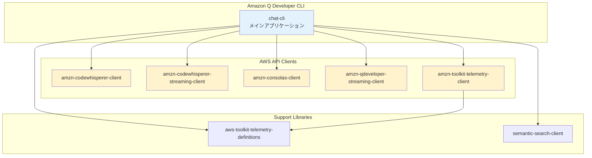
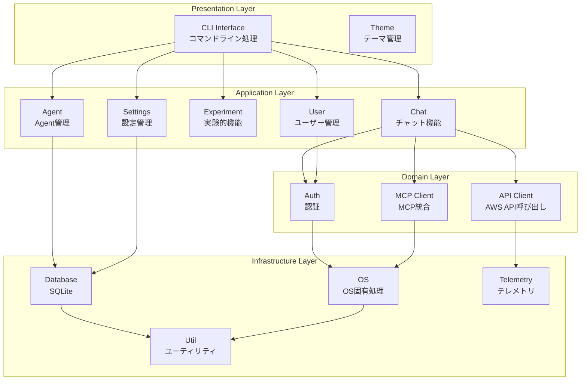
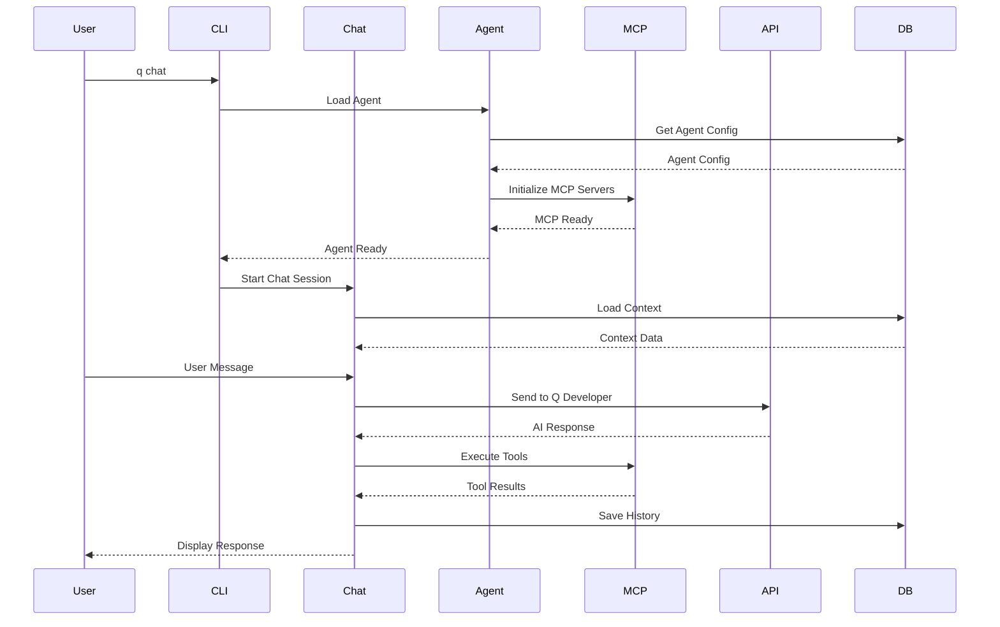
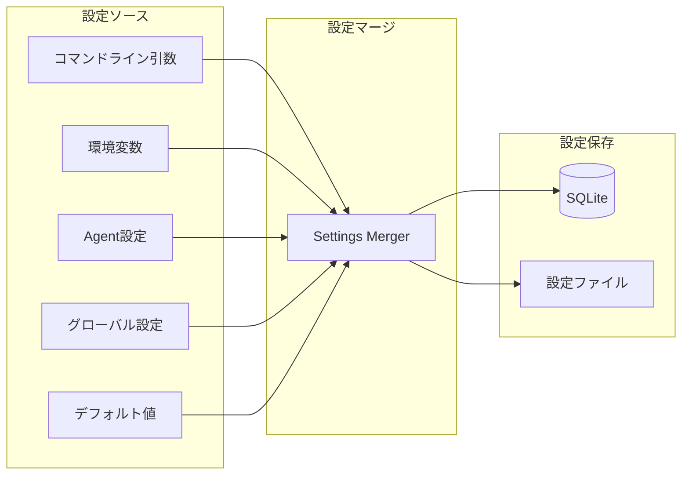

[ホーム](../../README.md) > [開発者ガイド](../README.md) > [アーキテクチャ](README.md) > 01 Overview

---

# アーキテクチャ概要

最終更新: 2025-10-13  
**対象バージョン**: v1.18.0

---

## 🏗️ システム構成

> **💡 このセクションについて**
> 
> このシステム構成は、Q CLIのソースコード調査に基づいています。
> 
> **出典**: [Cargo.toml](https://github.com/aws/amazon-q-developer-cli/blob/main/Cargo.toml) - Workspace構成の定義
> 
> **検証方法**:
> - Cargo.tomlで全crateのメンバーを確認
> - 各crateのディレクトリ構造を確認
> - 依存関係をCargo.tomlで確認

Amazon Q CLIは、Rustで実装されたモノレポ構成のプロジェクトです。

### Workspace構成（8つのcrate）

---

## 🔄 レイヤー構造

> **💡 このセクションについて**
> 
> このレイヤー構造は、chat-cliのソースコード構造に基づいています。
> 
> **出典**: [crates/chat-cli/src/](https://github.com/aws/amazon-q-developer-cli/tree/main/crates/chat-cli/src) - ディレクトリ構造
> 
> **検証方法**:
> - ソースコードのディレクトリ構造を確認
> - 各モジュールの責務を確認
> - モジュール間の依存関係を確認
> 
> **レイヤー分類**:
> - **Presentation Layer**: cli/, theme/
> - **Application Layer**: cli/chat/, cli/agent/, cli/experiment/, cli/settings/, cli/user/
> - **Domain Layer**: auth/, mcp_client/, api_client/
> - **Infrastructure Layer**: database/, os/, util/, telemetry/

chat-cliは4層アーキテクチャで構成されています：

### 主要モジュール

| レイヤー | モジュール | 責務 |
|---------|-----------|------|
| **Presentation** | CLI Interface | コマンドライン処理とルーティング |
| | Theme | テーマ管理 |
| **Application** | Chat | チャット機能の実装 |
| | Agent | Agent管理機能 |
| | Experiment | 実験的機能 |
| | Settings | 設定管理 |
| | User | ユーザー管理 |
| **Domain** | Auth | 認証・認可 |
| | MCP Client | MCP統合 |
| | API Client | AWS API呼び出し |
| **Infrastructure** | Database | データ永続化（SQLite） |
| | OS | OS固有処理の抽象化 |
| | Util | 共通ユーティリティ |
| | Telemetry | テレメトリデータ送信 |

---

## 🔄 データフロー

### チャットセッションのフロー

### 設定管理フロー

---

## 🛠️ 技術スタック

### 言語・フレームワーク

- **言語**: Rust (Edition 2024)
- **UI**: crossterm, rustyline, dialoguer
- **非同期**: tokio, futures
- **プロトコル**: MCP

### AWS SDK

- aws-config, aws-sdk-ssooidc, aws-sdk-cognitoidentity
- aws-smithy-* (Smithy runtime)

### データ処理

- **シリアライゼーション**: serde, serde_json
- **データベース**: rusqlite, r2d2
- **パターンマッチング**: regex, glob, globset

### ネットワーク

- **HTTP**: reqwest, hyper
- **TLS**: rustls

### パフォーマンス

- **メモリ**: mimalloc
- **並行処理**: rayon
- **ロック**: parking_lot

---

## 🔒 セキュリティ機能

### 認証

- Builder ID認証
- Identity Center認証
- トークン管理

### 権限管理

- ツール実行権限チェック
- ファイルアクセス制御
- コマンド実行制限

### データ保護

- 設定ファイルの暗号化
- トークンの安全な保存
- 機密情報のマスキング

---

## 📚 詳細情報

- [ソースコード構造](03_source-code-structure.md)
- [設定システム詳細](02_configuration-system.md)

---

**作成日**: 2025-10-11  
**更新日**: 2025-10-13
