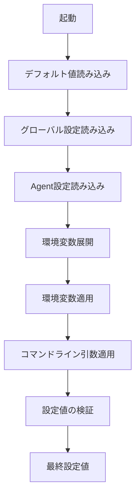

[ホーム](../../README.md) > [開発者ガイド](../README.md) > [アーキテクチャ](README.md) > 02 Configuration System

---

# 設定システム詳細


---

## 📋 概要

Amazon Q CLIの設定システムは、柔軟で拡張可能なアーキテクチャを採用しています。5段階の優先順位、環境変数展開、スキーマ検証など、エンタープライズグレードの機能を提供します。

### 主な特徴
- **5段階の優先順位**: コマンドライン引数 → 環境変数 → Agent設定 → グローバル設定 → デフォルト値
- **環境変数展開**: `${env:VAR_NAME}` 構文のサポート
- **スキーマ検証**: JSON Schemaによる設定値の検証
- **型安全**: Rustの型システムによる安全性
- **拡張性**: 新しい設定項目の追加が容易

---

## 🔧 設定システムのアーキテクチャ

> **💡 このセクションについて**
> 
> この設定システムのアーキテクチャは、Q CLIのソースコード実装に基づいています。
> 
> **出典**:
> - **設定の読み込みフロー**: [crates/chat-cli/src/cli/chat/mod.rs](https://github.com/aws/amazon-q-developer-cli/blob/main/crates/chat-cli/src/cli/chat/mod.rs) - `ChatArgs::execute`メソッド
> - **優先順位の実装**: [crates/chat-cli/src/cli/chat/mod.rs](https://github.com/aws/amazon-q-developer-cli/blob/main/crates/chat-cli/src/cli/chat/mod.rs) - L367-395（モデル選択の優先順位）
> - **環境変数展開**: [crates/chat-cli/src/mcp_client/client.rs](https://github.com/aws/amazon-q-developer-cli/blob/main/crates/chat-cli/src/mcp_client/client.rs) - `substitute_env_vars`関数（L113-127）
> - **設定値の取得**: [crates/chat-cli/src/database/settings.rs](https://github.com/aws/amazon-q-developer-cli/blob/main/crates/chat-cli/src/database/settings.rs) - `Settings::get`/`get_int_or`メソッド
> - **Agent設定読み込み**: [crates/chat-cli/src/cli/agent/mod.rs](https://github.com/aws/amazon-q-developer-cli/blob/main/crates/chat-cli/src/cli/agent/mod.rs) - `Agent::load`/`Agents::load`メソッド
> 
> **検証方法**:
> - `ChatArgs::execute`で設定読み込みフローを確認
> - モデル選択の優先順位実装（CLI引数 > Agent設定 > デフォルト）を確認
> - `substitute_env_vars`で`${env:VAR_NAME}`展開を確認
> - `Settings::get_int_or`でデフォルト値フォールバックを確認
> 
> **実装の詳細**:
> - **優先順位**: CLI引数（L367）> Agent設定（L379）> デフォルト値（L360）
> - **環境変数展開**: 正規表現`\$\{env:([^}]+)\}`でパターンマッチ（L116）
> - **デフォルト値**: `get_int_or`メソッドで値がない場合にデフォルト値を返す（L250-251）
> - **Agent読み込み**: `Agents::load`でローカル/グローバルAgentを読み込み（L500-600）

### 設定の読み込みフロー



### 優先順位の実装

設定値は以下の順序で上書きされます：

1. **デフォルト値** - ハードコードされた初期値
2. **グローバル設定** - `~/.aws/amazonq/config.toml`
3. **Agent設定** - `~/.aws/amazonq/agents/<agent-name>/agent.json`
4. **環境変数** - `Q_*` プレフィックス
5. **コマンドライン引数** - 最優先

---

## 📊 Setting Enum

全35項目の設定が`Setting` enumで定義されています。

### 実装例

```rust
#[derive(Debug, Clone, PartialEq, Eq, Hash)]
pub enum Setting {
    // テレメトリ
    TelemetryEnabled,
    TelemetryEndpoint,
    
    // チャット
    ChatModel,
    ChatMaxTokens,
    ChatTemperature,
    
    // Knowledge
    KnowledgeEnabled,
    KnowledgeIndexPath,
    KnowledgeSearchAlgorithm,
    
    // MCP
    McpEnabled,
    McpServers,
    
    // ... 他25項目
}
```

### 設定値の型

各設定項目は以下の型を持ちます：

```rust
pub enum SettingValue {
    String(String),
    Boolean(bool),
    Integer(i64),
    Float(f64),
    Array(Vec<SettingValue>),
    Object(HashMap<String, SettingValue>),
}
```

---

## 🔄 設定の読み込み実装

### 1. グローバル設定ファイル読み込み

**場所**: `~/.aws/amazonq/config.toml`

**実装**:
```rust
pub fn load_global_config() -> Result<Config> {
    let config_path = get_config_path()?;
    let content = fs::read_to_string(config_path)?;
    let config: Config = toml::from_str(&content)?;
    Ok(config)
}
```

**フォーマット**:
```toml
[telemetry]
enabled = false

[chat]
model = "anthropic.claude-3-5-sonnet-20241022-v2:0"
max_tokens = 4096
temperature = 0.7

[knowledge]
enabled = true
index_path = "~/.aws/amazonq/knowledge"
search_algorithm = "bm25"
```

### 2. Agent設定ファイル読み込み

**場所**: `~/.aws/amazonq/agents/<agent-name>/agent.json`

**実装**:
```rust
pub fn load_agent_config(agent_name: &str) -> Result<AgentConfig> {
    let agent_path = get_agent_path(agent_name)?;
    let content = fs::read_to_string(agent_path)?;
    let config: AgentConfig = serde_json::from_str(&content)?;
    Ok(config)
}
```

**フォーマット**:
```json
{
  "name": "my-agent",
  "description": "Custom agent",
  "settings": {
    "chat.model": "custom-model",
    "chat.max_tokens": 8192
  },
  "mcpServers": {
    "my-server": {
      "command": "node",
      "args": ["/path/to/server.js"]
    }
  }
}
```

### 3. 環境変数の展開

**構文**: `${env:VAR_NAME}`

**実装**:
```rust
pub fn expand_env_vars(value: &str) -> String {
    let re = Regex::new(r"\$\{env:([A-Z_]+)\}").unwrap();
    re.replace_all(value, |caps: &Captures| {
        env::var(&caps[1]).unwrap_or_default()
    }).to_string()
}
```

**使用例**:
```json
{
  "settings": {
    "mcp.servers.github.env.GITHUB_TOKEN": "${env:GITHUB_TOKEN}"
  }
}
```

### 4. 環境変数の適用

**プレフィックス**: `Q_`

**実装**:
```rust
pub fn apply_env_vars(config: &mut Config) {
    for (key, value) in env::vars() {
        if key.starts_with("Q_") {
            let setting_key = key[2..].to_lowercase().replace('_', '.');
            config.set(&setting_key, value);
        }
    }
}
```

**例**:
```bash
export Q_CHAT_MODEL="custom-model"
export Q_TELEMETRY_ENABLED="false"
```

### 5. コマンドライン引数の適用

**実装**:
```rust
pub fn apply_cli_args(config: &mut Config, args: &Args) {
    if let Some(model) = &args.model {
        config.set("chat.model", model);
    }
    if let Some(agent) = &args.agent {
        config.set("agent.name", agent);
    }
}
```

---

## ✅ 設定の検証

### スキーマ検証

**JSON Schema**を使用して設定値を検証：

```rust
pub fn validate_config(config: &Config) -> Result<()> {
    let schema = load_schema()?;
    let instance = serde_json::to_value(config)?;
    
    let result = jsonschema::validate(&schema, &instance);
    if let Err(errors) = result {
        return Err(ConfigError::ValidationFailed(errors));
    }
    
    Ok(())
}
```

### 型チェック

Rustの型システムによる型チェック：

```rust
impl Setting {
    pub fn validate_value(&self, value: &SettingValue) -> Result<()> {
        match (self, value) {
            (Setting::TelemetryEnabled, SettingValue::Boolean(_)) => Ok(()),
            (Setting::ChatModel, SettingValue::String(_)) => Ok(()),
            (Setting::ChatMaxTokens, SettingValue::Integer(n)) if *n > 0 => Ok(()),
            _ => Err(ConfigError::InvalidType),
        }
    }
}
```

### 値の範囲チェック

```rust
pub fn validate_range(setting: &Setting, value: &SettingValue) -> Result<()> {
    match (setting, value) {
        (Setting::ChatTemperature, SettingValue::Float(t)) => {
            if *t < 0.0 || *t > 2.0 {
                return Err(ConfigError::OutOfRange);
            }
        }
        (Setting::ChatMaxTokens, SettingValue::Integer(n)) => {
            if *n < 1 || *n > 100000 {
                return Err(ConfigError::OutOfRange);
            }
        }
        _ => {}
    }
    Ok(())
}
```

---

## 🔐 エラーハンドリング

### エラーの種類

```rust
#[derive(Debug, Error)]
pub enum ConfigError {
    #[error("設定ファイルが見つかりません: {0}")]
    FileNotFound(String),
    
    #[error("設定ファイルの解析に失敗しました: {0}")]
    ParseError(String),
    
    #[error("設定値の検証に失敗しました: {0}")]
    ValidationFailed(String),
    
    #[error("不正な型です")]
    InvalidType,
    
    #[error("値が範囲外です")]
    OutOfRange,
}
```

### デフォルト値へのフォールバック

```rust
pub fn get_setting_with_fallback(
    config: &Config,
    setting: &Setting
) -> SettingValue {
    config.get(setting)
        .unwrap_or_else(|| setting.default_value())
}
```

### エラーメッセージの表示

```rust
pub fn display_config_error(error: &ConfigError) {
    eprintln!("設定エラー: {}", error);
    
    match error {
        ConfigError::FileNotFound(path) => {
            eprintln!("ヒント: 設定ファイルを作成してください: {}", path);
        }
        ConfigError::ValidationFailed(msg) => {
            eprintln!("ヒント: 設定値を確認してください: {}", msg);
        }
        _ => {}
    }
}
```

---

## 📁 設定ファイルの構造

### グローバル設定

**場所**: `~/.aws/amazonq/config.toml`

**構造**:
```toml
# テレメトリ設定
[telemetry]
enabled = false
endpoint = "https://telemetry.aws.amazon.com"

# チャット設定
[chat]
model = "anthropic.claude-3-5-sonnet-20241022-v2:0"
max_tokens = 4096
temperature = 0.7
top_p = 0.9

# Knowledge設定
[knowledge]
enabled = true
index_path = "~/.aws/amazonq/knowledge"
search_algorithm = "bm25"
max_results = 10

# MCP設定
[mcp]
enabled = true
timeout = 30000

# ログ設定
[logging]
level = "info"
file = "~/.aws/amazonq/logs/q-cli.log"
```

### Agent設定

**場所**: `~/.aws/amazonq/agents/<agent-name>/agent.json`

**構造**:
```json
{
  "name": "my-agent",
  "description": "Custom agent for development",
  "version": "1.0.0",
  "settings": {
    "chat.model": "custom-model",
    "chat.max_tokens": 8192,
    "chat.temperature": 0.5
  },
  "mcpServers": {
    "github": {
      "command": "npx",
      "args": ["-y", "@modelcontextprotocol/server-github"],
      "env": {
        "GITHUB_TOKEN": "${env:GITHUB_TOKEN}"
      }
    },
    "filesystem": {
      "command": "npx",
      "args": ["-y", "@modelcontextprotocol/server-filesystem", "/path/to/project"]
    }
  },
  "tools": {
    "allowed": ["read_file", "write_file", "execute_bash"],
    "denied": ["delete_file"]
  }
}
```

---

## 🔍 デバッグ

### 設定値の確認

```bash
# 全設定を表示
q settings list

# 特定の設定を表示
q settings get chat.model

# Agent設定を表示
q agent list <agent-name>
```

### 設定の優先順位を確認

```bash
# デバッグモードで起動
export Q_LOG_LEVEL=debug
q

# ログで設定の読み込み順序を確認
tail -f ~/.aws/amazonq/logs/q-cli.log | grep "config"
```

---

## 📚 参考リソース

- [設定項目完全リファレンス](../../01_for-users/07_reference/03_settings-reference.md) - 全35設定項目
- [設定優先順位ガイド](../../01_for-users/03_configuration/07_priority-rules.md) - 優先順位の詳細
- [Agent設定ガイド](../../01_for-users/03_configuration/03_agent-configuration.md) - Agent設定の使い方
- [環境変数ガイド](../../01_for-users/03_configuration/06_environment-variables.md) - 環境変数の使い方

---


---

最終更新: 2025-11-01
