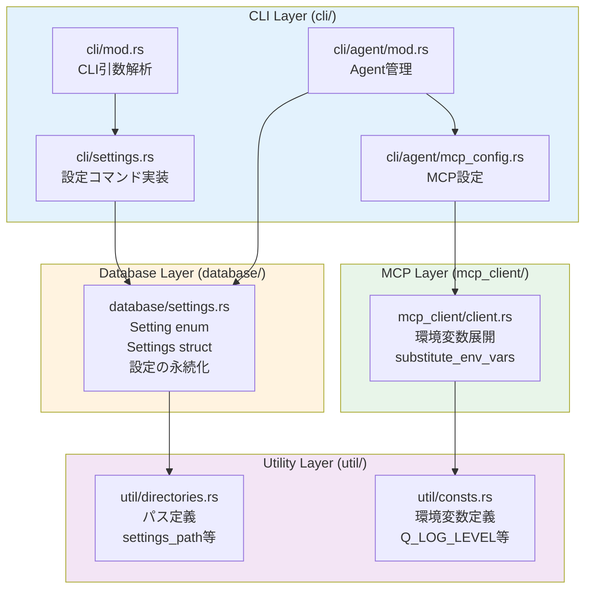
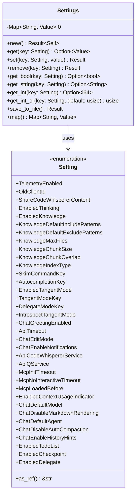
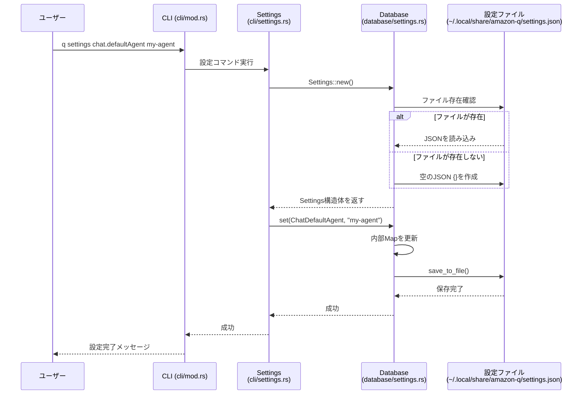
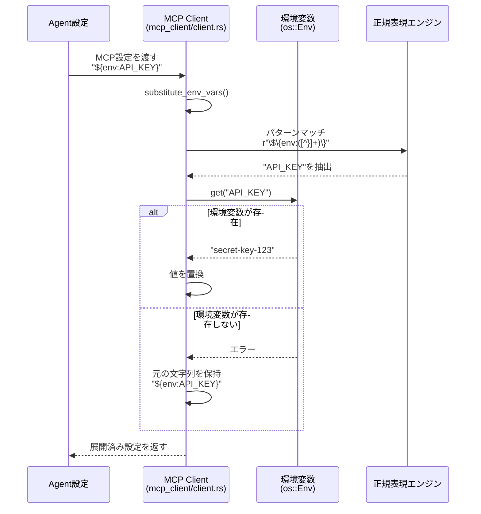

[ホーム](../../README.md) > [開発者ガイド](../README.md) > [アーキテクチャ](README.md) > 03 Source Code Structure

---

# Amazon Q CLI ソースコード構造マップ

**作成日**: 2025-10-08  
**対象バージョン**: v1.17.0  
**ソースコード**: `crates/chat-cli/src/`

## 概要

このドキュメントは、Amazon Q CLIの設定関連ソースコードの構造を視覚的に説明します。開発者向けの技術資料です。

---

## 設定関連ファイルの構造

> **💡 このセクションについて**
> 
> この設定関連ファイルの構造は、Q CLIのソースコード実装に基づいています。
> 
> **出典**:
> - **ファイル構造**: [crates/chat-cli/src/](https://github.com/aws/amazon-q-developer-cli/tree/main/crates/chat-cli/src) - 実際のディレクトリ構造
> - **Setting enum**: [crates/chat-cli/src/database/settings.rs](https://github.com/aws/amazon-q-developer-cli/blob/main/crates/chat-cli/src/database/settings.rs) - L16-85（35項目の定義）
> - **Settings構造体**: [crates/chat-cli/src/database/settings.rs](https://github.com/aws/amazon-q-developer-cli/blob/main/crates/chat-cli/src/database/settings.rs) - L186-290（メソッド定義）
> - **環境変数展開**: [crates/chat-cli/src/mcp_client/client.rs](https://github.com/aws/amazon-q-developer-cli/blob/main/crates/chat-cli/src/mcp_client/client.rs) - L113-127（substitute_env_vars関数）
> - **環境変数定義**: [crates/chat-cli/src/util/consts.rs](https://github.com/aws/amazon-q-developer-cli/blob/main/crates/chat-cli/src/util/consts.rs) - L20-60（env_varモジュール）
> - **パス定義**: [crates/chat-cli/src/util/directories.rs](https://github.com/aws/amazon-q-developer-cli/blob/main/crates/chat-cli/src/util/directories.rs) - settings_path等の関数
> 
> **検証方法**:
> - `find`コマンドで実際のファイル構造を確認
> - `Setting` enumの項目数を確認（35項目）
> - `Settings`構造体のメソッド一覧を確認（10メソッド）
> - `substitute_env_vars`関数の実装を確認
> - `env_var`モジュールのマクロ定義を確認
> - `settings_path`関数の実装を確認
> 
> **実装の詳細**:
> - **Setting enum**: 35項目、`as_ref()`で文字列変換、`strum`で説明付与
> - **Settingsメソッド**: `new`, `get`, `set`, `remove`, `get_bool`, `get_string`, `get_int`, `get_int_or`, `save_to_file`, `map`
> - **環境変数展開**: 正規表現`\$\{env:([^}]+)\}`でマッチ、存在しない場合は元の文字列保持
> - **環境変数定義**: `define_env_vars!`マクロで定義、`ALL`配列で管理
> - **パス定義**: `settings_path() -> fig_data_dir()/settings.json`



---

## Setting enumのクラス図



**Setting enumの特徴**:
- 35項目の設定を定義
- `as_ref()`で設定キー文字列に変換（例: `TelemetryEnabled` → `"telemetry.enabled"`）
- `strum`クレートで説明メッセージを付与

**Settings構造体の特徴**:
- JSON形式で設定を保存（`Map<String, Value>`）
- 型安全なアクセスメソッド（`get_bool`, `get_string`, `get_int`）
- ファイルへの永続化（`save_to_file()`）

---

## 設定読み込みのシーケンス図

> **💡 このセクションについて**
> 
> この設定読み込みのシーケンス図は、Q CLIのソースコード実装に基づいています。
> 
> **出典**:
> - **設定コマンド実行**: [crates/chat-cli/src/cli/settings.rs](https://github.com/aws/amazon-q-developer-cli/blob/main/crates/chat-cli/src/cli/settings.rs) - `SettingsArgs::execute`メソッド（L58-150）
> - **Settings初期化**: [crates/chat-cli/src/database/settings.rs](https://github.com/aws/amazon-q-developer-cli/blob/main/crates/chat-cli/src/database/settings.rs) - `Settings::new`メソッド（L190-217）
> - **設定値の保存**: [crates/chat-cli/src/database/settings.rs](https://github.com/aws/amazon-q-developer-cli/blob/main/crates/chat-cli/src/database/settings.rs) - `Settings::set`メソッド（L227-231）
> - **ファイル保存**: [crates/chat-cli/src/database/settings.rs](https://github.com/aws/amazon-q-developer-cli/blob/main/crates/chat-cli/src/database/settings.rs) - `Settings::save_to_file`メソッド（L254-285）
> 
> **検証方法**:
> - `SettingsArgs::execute`で設定コマンドの処理フローを確認
> - `Settings::new`でファイル存在確認と読み込み処理を確認
> - `Settings::set`で内部Map更新と自動保存を確認
> - `save_to_file`でJSON書き込み処理を確認
> 
> **実装の詳細**:
> - **ファイル存在確認**: `path.exists()`で確認（L205）
> - **ファイル読み込み**: `File::open`→`read_to_end`→`serde_json::from_slice`（L206-209）
> - **ファイル作成**: `File::create`→`write_all(b"{}")`（L211-213）
> - **設定値更新**: `self.0.insert(key.to_string(), value.into())`（L228）
> - **自動保存**: `set`メソッド内で`save_to_file()`を呼び出し（L229）



---

## 環境変数展開の処理フロー



**環境変数展開の実装**:

```rust
fn substitute_env_vars(input: &str, env: &crate::os::Env) -> String {
    let re = Regex::new(r"\$\{env:([^}]+)\}").unwrap();
    re.replace_all(input, |caps: &regex::Captures<'_>| {
        let var_name = &caps[1];
        env.get(var_name).unwrap_or_else(|_| format!("${{{}}}", var_name))
    }).to_string()
}
```

**特徴**:
- 正規表現で`${env:VAR_NAME}`パターンをマッチ
- 環境変数が存在しない場合は元の文字列を保持
- エラーを発生させず、安全にフォールバック

---

## 主要な関数とメソッド

### database/settings.rs

#### Settings::new()
```rust
pub async fn new() -> Result<Self, DatabaseError>
```
- 設定ファイルを読み込み、Settings構造体を初期化
- ファイルが存在しない場合は空のJSONを作成
- パス: `crate::util::directories::settings_path()`

#### Settings::get()
```rust
pub fn get(&self, key: Setting) -> Option<&Value>
```
- 設定値を取得
- 型変換は呼び出し側で実施

#### Settings::set()
```rust
pub async fn set(&mut self, key: Setting, value: impl Into<serde_json::Value>) -> Result<(), DatabaseError>
```
- 設定値を設定
- 自動的にファイルに保存

#### Settings::get_bool() / get_string() / get_int()
```rust
pub fn get_bool(&self, key: Setting) -> Option<bool>
pub fn get_string(&self, key: Setting) -> Option<String>
pub fn get_int(&self, key: Setting) -> Option<i64>
```
- 型安全なアクセスメソッド
- 型が一致しない場合は`None`を返す

### mcp_client/client.rs

#### substitute_env_vars()
```rust
fn substitute_env_vars(input: &str, env: &crate::os::Env) -> String
```
- `${env:VAR_NAME}`構文を環境変数の値に展開
- 環境変数が存在しない場合は元の文字列を保持

#### process_env_vars()
```rust
fn process_env_vars(env_vars: &mut HashMap<String, String>, env: &crate::os::Env)
```
- HashMap内の全ての値に対して環境変数展開を実行

---

## ファイルパスの定義

### util/directories.rs

```rust
// 設定ファイルのパス
pub fn settings_path() -> Result<PathBuf, DirectoryError> {
    // ~/.local/share/amazon-q/settings.json
}

// Agent設定ディレクトリ
pub fn chat_agents_dir() -> Result<PathBuf, DirectoryError> {
    // ~/.aws/amazonq/cli-agents/
}

// グローバルMCP設定（レガシー）
pub fn chat_legacy_global_mcp_config() -> Result<PathBuf, DirectoryError> {
    // ~/.aws/amazonq/mcp.json
}
```

---

## 環境変数の定義

### util/consts.rs

```rust
pub mod env_var {
    pub const Q_LOG_LEVEL: &str = "Q_LOG_LEVEL";
    pub const Q_LOG_STDOUT: &str = "Q_LOG_STDOUT";
    pub const Q_CLI_CLIENT_APPLICATION: &str = "Q_CLI_CLIENT_APPLICATION";
    // ... 他13項目
    
    pub const ALL: &[&str] = &[
        QTERM_SESSION_ID,
        Q_PARENT,
        Q_SET_PARENT,
        // ... 全ての環境変数
    ];
}
```

**特徴**:
- マクロで環境変数を定義
- `ALL`配列で全ての環境変数を管理
- ドキュメントコメント付き

---

## データフロー

### 設定の読み込み

```
ユーザー
  ↓
CLI引数解析 (cli/mod.rs)
  ↓
設定コマンド (cli/settings.rs)
  ↓
Settings::new() (database/settings.rs)
  ↓
ファイル読み込み (~/.local/share/amazon-q/settings.json)
  ↓
Settings構造体
```

### 設定の保存

```
ユーザー
  ↓
設定コマンド (cli/settings.rs)
  ↓
Settings::set() (database/settings.rs)
  ↓
内部Map更新
  ↓
save_to_file()
  ↓
ファイル保存 (~/.local/share/amazon-q/settings.json)
```

### 環境変数展開

```
Agent設定読み込み
  ↓
MCP設定解析 (cli/agent/mcp_config.rs)
  ↓
環境変数展開 (mcp_client/client.rs)
  ↓
substitute_env_vars()
  ↓
正規表現マッチ
  ↓
環境変数取得 (os::Env)
  ↓
値の置換
  ↓
展開済み設定
```

---

## 開発者向けの注意事項

### 1. 設定の追加方法

新しい設定項目を追加する場合：

1. **Setting enumに追加** (`database/settings.rs`)
   ```rust
   #[strum(message = "説明文 (型)")]
   NewSetting,
   ```

2. **as_ref()に追加**
   ```rust
   Self::NewSetting => "category.newSetting",
   ```

3. **TryFromに追加**
   ```rust
   "category.newSetting" => Ok(Self::NewSetting),
   ```

### 2. 環境変数の追加方法

新しい環境変数を追加する場合：

1. **util/consts.rsに追加**
   ```rust
   /// 説明文
   NEW_VAR = "NEW_VAR",
   ```

2. **使用箇所で参照**
   ```rust
   use crate::util::consts::env_var::NEW_VAR;
   std::env::var(NEW_VAR)
   ```

### 3. テスト

設定関連のテストは`database/settings.rs`の`#[cfg(test)]`モジュールに記載。

---

## 参考リンク

- [設定優先順位ガイド](../../01_for-users/03_configuration/07_priority-rules.md) - 設定の優先順位と図解
- [設定項目完全リファレンス](../../01_for-users/07_reference/03_settings-reference.md) - 全設定項目の一覧
- [環境変数ガイド](../../01_for-users/03_configuration/06_environment-variables.md) - 環境変数の完全リスト
- [Agent設定ファイル完全仕様](../../01_for-users/03_configuration/03_agent-configuration.md) - Agent設定の詳細

---

**ドキュメント作成日**: 2025-10-08  
最終更新: 2025-10-26  
**対象バージョン**: v1.17.0  
**ソースコード**: `crates/chat-cli/src/` (amazon-q-developer-cli)
