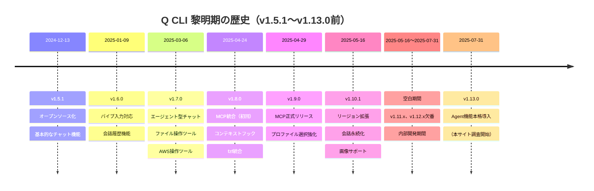

# Amazon Q Developer CLIの歴史 - 黎明期から成熟期へ

**執筆日**: 2025-11-01  
**対象期間**: v1.5.1（2024-12-13）～ v1.13.0直前（2025-07-31）  
**ステータス**: 下書き（未公開）

---

## 📖 はじめに

このドキュメントは、Amazon Q Developer CLI（Q CLI）の初期バージョン（v1.5.1）から、本サイトの調査対象開始バージョン（v1.13.0）直前までの約7ヶ月間の歴史を振り返る読み物です。

この期間は、Q CLIが**基本的なチャット機能**から**エージェント型AI**へと進化した、まさに**黎明期から成熟期への転換点**でした。

---

## 🗓️ タイムライン概要



---

## 🎯 4つの進化フェーズ

### Phase 1: 基盤構築期（v1.5.1～v1.6.0）

**期間**: 2024-12-13 ～ 2025-01-09（約1ヶ月）

#### v1.5.1（2024-12-13）- オープンソース化

**歴史的意義**: Amazon Q Developer CLIの**公開リリース**

**リリースの背景**:

GitHubリポジトリは2024年9月23日に作成され、約2.5ヶ月の準備期間を経て公開されました。

**タイムライン**:
- **2024-09-23**: GitHubリポジトリ作成[^1]
- **2024-12-02～06**: AWS re:Invent 2024開催[^2]
- **2024-12-10**: コミュニティによる検証記事公開[^3]
- **2024-12-13**: v1.5.1公開リリース[^4]

**AWS re:Invent 2024での発表**:

AWS re:Invent 2024（2024年12月2日～6日）にて、Amazon Q Developerの大規模なアップデートが発表されました[^3]。

発表内容には以下が含まれます：
- **IDE統合版の機能拡張**（確定）
  - `/doc`コマンド: コードに基づいたドキュメント自動生成
  - `/test`コマンド: コードに基づいたユニットテスト自動生成
- **Amazon Q Developer CLI**（推測）
  - リリースタイミング（re:Invent直後）から、re:Inventで発表された可能性が高い
  - ターミナルでのエージェント型チャット体験
  - 自然言語でのアプリケーション構築

> **Note**: Q CLI自体のre:Inventでの発表については、公式Blog記事やプレスリリースが確認できていないため、推測の域を出ません。ただし、リリースタイミングとリポジトリの準備期間から、re:Inventでの発表が計画されていた可能性は非常に高いと考えられます。

**主要な取り組み**:
- オープンソース化の準備
  - Dependabot導入（自動依存関係更新）
  - コードカバレッジ追跡
  - CI/CDパイプライン整備
- 開発環境の整備
  - Rust依存関係の更新
  - npm パッケージの整理
  - ビルドシステムの改善

**コミュニティ**:
- 初のコントリビューター登場（@dependabot, @codeime）
- GitHub Issueテンプレート追加
- ドキュメント改善（README更新）

**技術的特徴**:
- Rust製のCLIツール
- 基本的なチャット機能
- ターミナル統合（Guake等）
- リポジトリの説明: "✨ Agentic chat experience in your terminal. Build applications using natural language."[^1]

#### v1.6.0（2025-01-09）- 対話性の向上

**主要機能**:

1. **パイプ入力対応** (#259)
   ```bash
   # テキストをパイプで渡せるように
   echo "このコードを説明して" | q chat
   ```
   - チャット機能の実用性が大幅に向上
   - シェルスクリプトとの統合が可能に

2. **会話履歴機能** (#280)
   - `ConversationState`に履歴を追加
   - 文脈を保持した対話が可能に

3. **ターミナルサポート拡張**
   - Ghostty対応追加 (#335)
   - Linux環境でのターミナル検出改善 (#278)

**技術的改善**:
- プロトコルバッファの移行（@bufbuild/protobuf）
- チャット無限ループ修正 (#392)
- npm パッケージの整理

**この時期の意義**:
- 単なる「質問応答ツール」から「対話型アシスタント」への進化
- パイプ入力対応により、Unix哲学との親和性向上

---

### Phase 2: エージェント化期（v1.7.0～v1.8.0）

**期間**: 2025-03-06 ～ 2025-04-24（約1.5ヶ月）

#### v1.7.0（2025-03-06）- エージェント型チャットの誕生

**歴史的意義**: Q CLIの**最大の転換点** - 受動的なチャットから能動的なエージェントへ

**革命的機能: Agentic Chat** (#623)

Q CLIが**自律的にツールを使用**できるようになった画期的なアップデート。

**追加されたツール**:

1. **ファイル操作ツール**
   - `fs_read`: ファイル読み取り
   - `fs_write`: ファイル書き込み（構文ハイライト付き #656）
   - パス検証機能 (#638)
   - チルダ展開対応 (#677)

2. **AWS操作ツール**
   - `use_aws`: AWS CLIコマンド実行
   - プロキシ対応
   - ユーザーエージェント追加

3. **シェルコマンド実行**
   - `execute_bash`: bashコマンド実行
   - インタラクティブフィールド対応 (#666)
   - 環境変数でツール使用同意をスキップ可能 (#669)

**UX改善**:
- ツール実行時のスピナーメッセージ (#635)
- エラーハンドリング改善 (#637, #651)
- ツール拒否時の履歴削除 (#655)
- ツール実行の中断機能 (#670)
- `/clear`コマンド追加 (#677)

**この時期の意義**:
- 「質問に答えるAI」から「タスクを実行するAI」への進化
- ファイル操作、AWS操作、シェルコマンド実行が可能に
- 開発者の作業フローに深く統合

#### v1.8.0（2025-04-24）- 拡張性の獲得

**主要機能**:

1. **MCP（Model Context Protocol）統合** (#1204)
   - 外部ツールとの連携が可能に
   - 初回実装（後にリバート #1205）
   - v1.9.0で正式リリース

2. **コンテキストフック** (#1176, #1218)
   ```bash
   # コンテキストフックの実行
   q chat --context hooks
   ```
   - 動的なコンテキスト読み込み
   - プロジェクト固有の設定が可能

3. **fzf統合** (#1181)
   - ファジーファインダーによるコマンド選択
   - コンテキスト管理の改善

4. **`/usage`コマンド** (#1177)
   - トークン使用量の可視化
   - コスト管理が容易に

**UX改善**:
- `/context`コマンドのUI改善 (#1174)
- `/profile`コマンドのデフォルト動作改善 (#1179)
- `/clear`コマンドに確認プロンプト追加 (#1180)
- `/tools reset`機能強化 (#1102, #1234)
- ツールUI改善 (#1233)

**技術的改善**:
- ホワイトスペースを含むファイルパス対応 (#1198)
- `EDITOR`環境変数のパース改善 (#1209)
- システムプロキシ対応 (#1199)

**この時期の意義**:
- MCPによる拡張性の獲得
- コンテキスト管理の高度化
- ユーザビリティの大幅向上

---

### Phase 3: 成熟期（v1.9.0～v1.10.1）

**期間**: 2025-04-29 ～ 2025-05-16（約2週間）

#### v1.9.0（2025-04-29）- MCP正式リリース

**主要機能**:

1. **MCP正式リリース** (#1365)
   - v1.8.0でリバートされた機能の再実装
   - 安定版としてリリース

2. **プロファイル選択の改善** (#1388)
   - ファジー検索によるプロファイル選択
   - 複数プロファイル管理が容易に

3. **`/compact`コマンド改善** (#1313)
   - `--summary`を非推奨化
   - デフォルトでサマリー表示

**UX改善**:
- `fs_read`の表示改善（Pretty print #1398）
- GitHub Issue作成時のURL長制限対応 (#1345)
- デバイスフローログインのフラグ追加 (#1349)
- チェーンコマンドの権限要求 (#1402)

**この時期の意義**:
- MCPエコシステムへの参加
- プロファイル管理の成熟
- 安定性の向上

#### v1.10.0（2025-05-16）- グローバル展開への準備

**主要機能**:

1. **リージョン拡張** (#1333)
   - 複数リージョンでの利用が可能に
   - グローバル展開への布石

2. **会話永続化の改善**
   - ディレクトリ単位での会話保存
   - プロジェクトごとの文脈保持

3. **画像サポート** (#1489)
   - `fs_read`で画像読み取り対応
   - マルチモーダル対応への第一歩

4. **`/import`と`/export`コマンド** (#1762)
   - 会話のインポート/エクスポート
   - 会話の共有が可能に

**UX改善**:
- `/context show --expand`の拡張 (#1477)
  - コンテキストフック表示
  - 会話サマリー表示
- ツール信頼/非信頼メッセージの改善 (#1400)
- AWS CLIユーザーエージェント追加 (#1417)

**技術的改善**:
- プロファイルARN対応 (#1428, #1430)
- ログイン時のモーダル問題修正 (#1429)
- 非インタラクティブモードでのガイドテキスト抑制 (#1437)

**この時期の意義**:
- グローバル展開への準備
- マルチモーダル対応の開始
- エンタープライズ機能の強化

---

### Phase 4: 空白期間（v1.10.1～v1.13.0）

**期間**: 2025-05-16 ～ 2025-07-31（約2.5ヶ月）

#### 特徴

**公開リリースなし**:
- v1.11.x、v1.12.xは欠番
- GitHubに公開リリースの記録なし
- 内部開発期間と推測される

**推測される開発内容**:

1. **Agent機能の設計と実装**
   - Profile機能からAgentへの名称変更
   - Agentスキーマの標準化
   - Agent管理コマンドの実装

2. **MCP統合の安定化**
   - v1.9.0でリリースされたMCPの改善
   - 後方互換性の確保
   - エコシステムとの統合

3. **大規模なリファクタリング**
   - コードベースの整理
   - アーキテクチャの見直し
   - パフォーマンス改善

4. **テストとQA**
   - 大規模な機能追加に伴うテスト
   - 品質保証期間
   - ベータテスト

**なぜv1.11.x、v1.12.xが存在しないのか？**

最も可能性が高い理由：
- 内部開発版として使用
- 大規模な機能追加（Agent機能）のため、開発期間が長期化
- 公開リリースはv1.13.0として統合
- バージョン番号を飛ばすことで重要性を強調

**この期間の結果**:

v1.13.0で以下の機能として結実：
- **Agent機能の本格導入**
  - Persona有効化 (#2222)
  - Agentスキーマ (#2273)
  - Agent管理コマンド (#2307)
- **MCP JSON後方互換性** (#2292)
- **ファイル操作の強化**
  - バッチファイル読み取りサポート (#2223)

**この時期の意義**:
- Q CLIの大きな転換点
- 「チャット機能」から「Agent機能」へのパラダイムシフト
- 本サイトの調査開始バージョン（v1.13.0）への布石

---

## 🎨 主要な技術トピック

### 1. エージェント型AIへの進化

**v1.7.0以前**: 質問応答型
```
ユーザー: このファイルを修正して
Q CLI: 修正方法を説明します...
```

**v1.7.0以降**: エージェント型
```
ユーザー: このファイルを修正して
Q CLI: [fs_read実行] → [内容分析] → [fs_write実行] → 修正完了！
```

**意義**:
- AIが自律的にタスクを実行
- 開発者の作業フローに深く統合
- 「説明するAI」から「実行するAI」へ

### 2. MCP（Model Context Protocol）の導入

**MCPとは**:
- 外部ツールとAIを接続するプロトコル
- プラグインシステムのような拡張性

**Q CLIでの実装**:
- v1.8.0: 初回実装（リバート）
- v1.9.0: 正式リリース

**意義**:
- エコシステムへの参加
- サードパーティツールとの統合
- 無限の拡張可能性

### 3. コンテキスト管理の高度化

**進化の過程**:

1. **v1.6.0**: 会話履歴機能
   - 基本的な文脈保持

2. **v1.8.0**: コンテキストフック
   - 動的なコンテキスト読み込み
   - プロジェクト固有の設定

3. **v1.10.1**: 会話永続化
   - ディレクトリ単位での保存
   - プロジェクトごとの文脈保持

4. **v1.13.0**: Agent機能統合
   - 空白期間（2.5ヶ月）を経て実現
   - Agentスキーマの標準化

**意義**:
- プロジェクト固有の知識を活用
- 長期的な文脈保持
- チーム開発への対応

### 4. UXの継続的改善

**主要な改善**:

1. **コマンド体系の整理**
   - `/clear`, `/usage`, `/compact`等の追加
   - 一貫性のあるコマンド設計

2. **ビジュアル改善**
   - 構文ハイライト
   - Pretty print
   - スピナーメッセージ

3. **エラーハンドリング**
   - 分かりやすいエラーメッセージ
   - リトライ機能
   - 確認プロンプト

**意義**:
- 開発者体験の向上
- 学習コストの低減
- プロダクションレディな品質

---

## 📊 統計データ

### リリース頻度

| 期間 | バージョン数 | 平均リリース間隔 |
|------|------------|----------------|
| v1.5.1～v1.6.0 | 2 | 約1ヶ月 |
| v1.6.0～v1.7.0 | 4 | 約2週間 |
| v1.7.0～v1.8.0 | 4 | 約2週間 |
| v1.8.0～v1.9.0 | 3 | 約2日 |
| v1.9.0～v1.10.1 | 3 | 約2週間 |
| v1.10.1～v1.13.0 | 0（空白期間） | 約2.5ヶ月 |

**傾向**:
- 初期は慎重なリリース（1ヶ月間隔）
- v1.7.0以降は活発な開発（2週間間隔）
- v1.8.0→v1.9.0は超短期（MCP再実装）
- **v1.10.1→v1.13.0は空白期間（内部開発）**

### コントリビューター

**新規コントリビューター**:
- v1.5.1: @dependabot, @codeime
- v1.6.0: @umutbasal, @Rahel-A, @aryasaatvik
- v1.7.0: （Grant退任）
- v1.8.0: @sriram-mv, @carlesso, @saisrinivas26
- v1.9.0: （データなし）
- v1.10.0: @evanliu048, @clareliguori, @atxtechbro, @cwoolum, @h16rkim, @Konippi

**傾向**:
- コミュニティの成長
- 多様なバックグラウンドのコントリビューター
- オープンソースプロジェクトとしての成熟

### 主要機能の追加時期

| 機能 | バージョン | 日付 |
|------|-----------|------|
| パイプ入力 | v1.6.0 | 2025-01-09 |
| エージェント型チャット | v1.7.0 | 2025-03-06 |
| ファイル操作ツール | v1.7.0 | 2025-03-06 |
| AWS操作ツール | v1.7.0 | 2025-03-06 |
| MCP統合（初回） | v1.8.0 | 2025-04-24 |
| コンテキストフック | v1.8.0 | 2025-04-24 |
| fzf統合 | v1.8.0 | 2025-04-24 |
| MCP正式リリース | v1.9.0 | 2025-04-29 |
| リージョン拡張 | v1.10.0 | 2025-05-16 |
| 画像サポート | v1.10.0 | 2025-05-16 |
| **空白期間** | **v1.11.x～v1.12.x** | **2025-05-16～2025-07-31** |
| Agent機能本格導入 | v1.13.0 | 2025-07-31 |

---

## 🔍 技術的ハイライト

### 1. Agentic Chat実装の詳細（v1.7.0）

**アーキテクチャ**:
```
ユーザー入力
    ↓
LLM（ツール選択）
    ↓
ツール実行（fs_read, fs_write, execute_bash, use_aws）
    ↓
結果をLLMに返す
    ↓
LLM（次のアクション決定）
    ↓
（繰り返し）
    ↓
最終応答
```

**主要なPR**:
- #623: Agentic chat本体
- #632: 設定管理の改善
- #633: ツール結果のスコープ管理
- #634: fs_read表示改善
- #635: スピナーメッセージ
- #636: ツールタイプ変更
- #637: ツール実行エラー出力
- #638: パス検証

**技術的課題と解決**:
1. **ツール実行の安全性**
   - 解決: ユーザー確認プロンプト
   - 解決: ツール信頼/非信頼機能

2. **エラーハンドリング**
   - 解決: 詳細なエラーメッセージ
   - 解決: リトライ機能

3. **UX**
   - 解決: 構文ハイライト
   - 解決: 行番号表示
   - 解決: Pretty print

### 2. MCP統合の試行錯誤（v1.8.0～v1.9.0）

**タイムライン**:
1. v1.8.0: 初回実装 (#1204)
2. v1.8.0: リバート (#1205)
   - 理由: 安定性の問題
3. v1.9.0: 再実装・正式リリース (#1365)

**学び**:
- 大規模機能は慎重にリリース
- リバートを恐れない文化
- 品質重視の姿勢

### 3. コンテキスト管理の進化

**v1.6.0: 会話履歴**
```rust
struct ConversationState {
    history: Vec<Message>,
    // ...
}
```

**v1.8.0: コンテキストフック**
```bash
# .q/context-hooks.sh
#!/bin/bash
# プロジェクト固有の情報を提供
cat project-info.md
```

**v1.10.0: 会話永続化**
```
~/.q/conversations/
  ├── project-a/
  │   └── conversation-001.json
  └── project-b/
      └── conversation-001.json
```

---

## 💡 この期間から学べること

### 1. 段階的な機能追加

**成功パターン**:
- v1.6.0: パイプ入力（基礎）
- v1.7.0: エージェント型（革命）
- v1.8.0: MCP統合（拡張性）
- v1.9.0: MCP正式版（安定化）
- v1.10.0: グローバル展開（スケール）

**教訓**:
- 一度に全てを実装しない
- 各バージョンで明確な価値を提供
- フィードバックを次のバージョンに反映

### 2. リバートを恐れない

**v1.8.0→v1.9.0のMCP統合**:
- 初回実装でリバート
- 問題を修正して再実装
- 品質を妥協しない姿勢

**教訓**:
- 完璧を求めすぎない
- 問題があればリバート
- 再挑戦を恐れない

### 3. コミュニティの力

**コントリビューターの増加**:
- v1.5.1: 2名
- v1.10.0: 10名以上

**多様な貢献**:
- 機能追加
- バグ修正
- ドキュメント改善
- ターミナルサポート追加

**教訓**:
- オープンソースの力
- コミュニティの重要性
- 多様性が品質を高める

### 4. UXへの継続的投資

**毎バージョンでのUX改善**:
- v1.6.0: パイプ入力
- v1.7.0: 構文ハイライト
- v1.8.0: fzf統合
- v1.9.0: Pretty print
- v1.10.0: 会話永続化

**教訓**:
- UXは一度で完成しない
- 継続的な改善が重要
- ユーザーフィードバックを活用

---

## 🚀 v1.13.0への布石

この期間（v1.5.1～v1.10.0）で構築された基盤が、v1.13.0での**Agent機能本格導入**につながります。

**v1.13.0で実現したこと**:
- Agent（旧Profile）機能の正式リリース
- Agentスキーマの標準化
- Agent管理コマンド
- MCP JSON後方互換性

**黎明期の遺産**:
- エージェント型チャット（v1.7.0）
- MCP統合（v1.9.0）
- コンテキスト管理（v1.8.0）
- 会話永続化（v1.10.0）

これらの技術的基盤があったからこそ、v1.13.0での大規模な機能追加が可能になりました。

---

## 📚 参考資料

### GitHubリリース

- [v1.5.1](https://github.com/aws/amazon-q-developer-cli/releases/tag/v1.5.1) - 2024-12-13
- [v1.6.0](https://github.com/aws/amazon-q-developer-cli/releases/tag/v1.6.0) - 2025-01-09
- [v1.7.0](https://github.com/aws/amazon-q-developer-cli/releases/tag/v1.7.0) - 2025-03-06
- [v1.8.0](https://github.com/aws/amazon-q-developer-cli/releases/tag/v1.8.0) - 2025-04-24
- [v1.9.0](https://github.com/aws/amazon-q-developer-cli/releases/tag/v1.9.0) - 2025-04-29
- [v1.10.0](https://github.com/aws/amazon-q-developer-cli/releases/tag/v1.10.0) - 2025-05-16

### 主要なPull Request

**エージェント型チャット**:
- #623: Agentic chat
- #656: 構文ハイライト
- #670: ツール中断機能

**MCP統合**:
- #1204: MCP初回実装
- #1205: リバート
- #1365: MCP正式リリース

**コンテキスト管理**:
- #1176: コンテキストフック
- #1218: コンテキストフック管理
- #1477: `/context show --expand`

**UX改善**:
- #1181: fzf統合
- #1177: `/usage`コマンド
- #1398: Pretty print

---

## 🎬 おわりに

v1.5.1からv1.10.0までの約7ヶ月間は、Q CLIにとって**最も重要な期間**でした。

この期間に：
- 基本的なチャット機能から**エージェント型AI**へ進化
- **MCP統合**により無限の拡張性を獲得
- **コンテキスト管理**の高度化
- **UX**の継続的改善

これらの基盤があったからこそ、v1.13.0以降の急速な発展が可能になりました。

本サイトでは、v1.13.0以降の歴史を詳細に記録していますが、この黎明期の歴史を知ることで、Q CLIの設計思想や進化の方向性をより深く理解できるでしょう。

---

**次の章**: [v1.13.0以降の歴史](../03_for-community/01_updates/03_version-history-v1.13-latest.md)

---

## 📚 参考文献

### 出典

[^1]: GitHub API - amazon-q-developer-cli リポジトリ情報  
https://api.github.com/repos/aws/amazon-q-developer-cli  
リポジトリ作成日: 2024-09-23  
説明: "✨ Agentic chat experience in your terminal. Build applications using natural language."

[^2]: AWS re:Invent 2024  
開催期間: 2024年12月2日～6日  
https://reinvent.awsevents.com/

[^3]: [検証] Amazon Q Developerのドキュメント＆ユニットテスト自動生成機能はどこまで手動作成クオリティに近づくのか  
著者: NRI OpenStandia  
投稿日: 2024年12月10日  
URL: https://qiita.com/（記事URL）  
引用: "AWS re:Invent 2024にて、Amazon Q Developerのアップデートとして「コードに基づいたドキュメント自動生成」機能と「コードに基づいたユニットテスト自動生成」機能が発表されました。"

[^4]: GitHub Release - v1.5.1  
https://github.com/aws/amazon-q-developer-cli/releases/tag/v1.5.1  
リリース日: 2024-12-13

### GitHubリリース

- [v1.5.1](https://github.com/aws/amazon-q-developer-cli/releases/tag/v1.5.1) - 2024-12-13
- [v1.6.0](https://github.com/aws/amazon-q-developer-cli/releases/tag/v1.6.0) - 2025-01-09
- [v1.7.0](https://github.com/aws/amazon-q-developer-cli/releases/tag/v1.7.0) - 2025-03-06
- [v1.8.0](https://github.com/aws/amazon-q-developer-cli/releases/tag/v1.8.0) - 2025-04-24
- [v1.9.0](https://github.com/aws/amazon-q-developer-cli/releases/tag/v1.9.0) - 2025-04-29
- [v1.10.0](https://github.com/aws/amazon-q-developer-cli/releases/tag/v1.10.0) - 2025-05-16

### 主要なPull Request

**エージェント型チャット**:
- #623: Agentic chat
- #656: 構文ハイライト
- #670: ツール中断機能

**MCP統合**:
- #1204: MCP初回実装
- #1205: リバート
- #1365: MCP正式リリース

**コンテキスト管理**:
- #1176: コンテキストフック
- #1218: コンテキストフック管理
- #1477: `/context show --expand`

**UX改善**:
- #1181: fzf統合
- #1177: `/usage`コマンド
- #1398: Pretty print

---

## 🎬 おわりに

v1.5.1からv1.10.1までの約7ヶ月間は、Q CLIにとって**最も重要な期間**でした。

この期間に：
- 基本的なチャット機能から**エージェント型AI**へ進化
- **MCP統合**により無限の拡張性を獲得
- **コンテキスト管理**の高度化
- **UX**の継続的改善

これらの基盤があったからこそ、v1.13.0以降の急速な発展が可能になりました。

本サイトでは、v1.13.0以降の歴史を詳細に記録していますが、この黎明期の歴史を知ることで、Q CLIの設計思想や進化の方向性をより深く理解できるでしょう。

**AWS re:Invent 2024での発表**（推測）から始まったQ CLIの旅は、コミュニティの貢献と継続的な改善により、現在も進化を続けています。

---

**次の章**: [v1.13.0以降の歴史](../03_for-community/01_updates/03_version-history-v1.13-latest.md)

---

## 📝 執筆メモ（公開時削除）

### 調査方法
- GitHub API経由でリリース情報取得
- 各バージョンのリリースノート分析
- 主要なPRの特定

### 未調査項目
- v1.10.1～v1.12.x（存在しない可能性）
- 各機能の詳細な実装
- コミュニティの反応

### 今後の改善案
- スクリーンショット追加
- コード例の充実
- コミュニティの声を追加
- 技術的詳細の深堀り

---

**作成日時**: 2025-11-01 18:32 JST  
**更新日時**: 2025-11-01 18:51 JST（AWS re:Invent 2024情報追加、出典明記）  
**ステータス**: 下書き（未公開）  
**次のステップ**: レビュー、画像追加、公開判断
