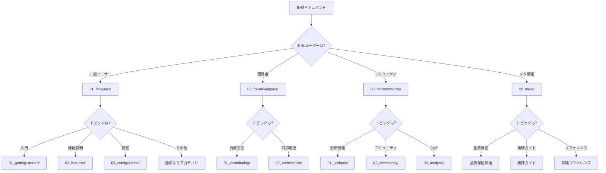

[ホーム](../README.md) > [Meta](README.md) > ファイル構造リファレンス

---

# ファイル構造リファレンス

本サイトのファイル構造と配置ルールを説明します。

**最終更新**: 2025-11-01

---

## 📋 目次

1. [全体構造](#全体構造)
2. [カテゴリ別詳細](#カテゴリ別詳細)
3. [ファイル配置ルール](#ファイル配置ルール)
4. [命名規則](#命名規則)
5. [README.mdの役割](#readmemdの役割)

---

## 全体構造

### ディレクトリツリー

```
docs/
├── README.md                    # ドキュメントサイトのトップページ
├── 01_for-users/               # ユーザー向けドキュメント（73文書）
│   ├── 01_getting-started/     # 入門ガイド
│   ├── 02_features/            # 機能説明
│   ├── 03_configuration/       # 設定ガイド
│   ├── 04_best-practices/      # ベストプラクティス
│   ├── 05_deployment/          # デプロイメント
│   ├── 06_troubleshooting/     # トラブルシューティング
│   ├── 07_reference/           # リファレンス
│   ├── 08_guides/              # 詳細ガイド
│   ├── 09_security/            # セキュリティ
│   └── 10_file-specifications/ # ファイル仕様
├── 02_for-developers/          # 開発者向けドキュメント（11文書）
│   ├── 01_contributing/        # コントリビューション
│   └── 02_architecture/        # アーキテクチャ
├── 03_for-community/           # コミュニティ向けドキュメント（14文書）
│   ├── 01_updates/             # アップデート情報
│   ├── 02_community/           # コミュニティ
│   └── 03_analysis/            # 分析レポート
├── 04_issues/                  # 課題管理（1文書）
└── 05_meta/                    # メタドキュメント（28文書）
    ├── 01_overview.md          # 品質保証概要
    ├── 02_why-quality-matters.md
    ├── 03_how-we-ensure-quality.md
    ├── 04_quality-principles.md
    ├── 05_automation-tools.md
    ├── 06_manual-checks.md
    ├── 07_lessons-learned.md
    ├── 08_getting-started.md
    ├── 09_daily-workflow.md
    ├── 10_version-update-guide.md
    ├── 11_file-structure.md    # 本ファイル
    ├── 12_naming-conventions.md
    ├── 13_validation-reference.md
    └── README.md
```

### 統計

| カテゴリ | 文書数 | 割合 |
|---------|--------|------|
| 01_for-users | 73文書 | 61.3% |
| 02_for-developers | 11文書 | 9.2% |
| 03_for-community | 14文書 | 11.8% |
| 04_issues | 1文書 | 0.8% |
| 05_meta | 28文書 | 23.5% |
| **合計** | **119文書** | **100%** |

---

## カテゴリ別詳細

### 01_for-users（ユーザー向け）

**対象**: Q CLIを使用する全てのユーザー

**サブカテゴリ**:

#### 01_getting-started（入門ガイド）
- **目的**: Q CLIを初めて使う人向けの導入
- **内容**: インストール、クイックスタート、最初の一歩、料金
- **文書数**: 5文書

#### 02_features（機能説明）
- **目的**: Q CLIの各機能の詳細説明
- **内容**: Chat、Agent、オートコンプリート、キーボードショートカット、Knowledge、SSH、実験的機能
- **文書数**: 8文書

#### 03_configuration（設定ガイド）
- **目的**: Q CLIの設定方法
- **内容**: 概要、グローバル設定、Agent設定、MCP設定、テレメトリ、環境変数、優先順位、設定例
- **文書数**: 9文書

#### 04_best-practices（ベストプラクティス）
- **目的**: 効果的な使い方の推奨事項
- **内容**: 設定、セキュリティ、パフォーマンス、Agent Hooks、負荷テスト
- **文書数**: 7文書

#### 05_deployment（デプロイメント）
- **目的**: エンタープライズ環境での展開
- **内容**: エンタープライズ展開、料金比較、セキュリティチェックリスト
- **文書数**: 4文書

#### 06_troubleshooting（トラブルシューティング）
- **目的**: 問題解決
- **内容**: 概要、よくある問題、ログ分析
- **文書数**: 4文書

#### 07_reference（リファレンス）
- **目的**: 技術仕様とクイックリファレンス
- **内容**: 用語集、コマンド、設定、ファイル配置、環境、コンテキストウィンドウ、クイックリファレンス、トピック索引、エラーメッセージ
- **文書数**: 11文書

#### 08_guides（詳細ガイド）
- **目的**: 特定トピックの深掘り
- **内容**: コンテキスト管理完全ガイド（8章構成）
- **文書数**: 9文書

#### 09_security（セキュリティ）
- **目的**: セキュリティとプライバシー
- **内容**: セキュリティ概要、データプライバシー
- **文書数**: 3文書

#### 10_file-specifications（ファイル仕様）
- **目的**: Q CLIが使用するファイルの仕様
- **内容**: bash履歴、Agent設定、MCP設定、グローバル設定、チェックポイント、会話状態、メッセージ構造
- **文書数**: 8文書

---

### 02_for-developers（開発者向け）

**対象**: Q CLIの開発に貢献する人

**サブカテゴリ**:

#### 01_contributing（コントリビューション）
- **目的**: 開発環境のセットアップと貢献方法
- **内容**: 開発環境、コントリビューションガイド、エラー管理、エラーメッセージ追加
- **文書数**: 5文書

#### 02_architecture（アーキテクチャ）
- **目的**: Q CLIの内部構造の理解
- **内容**: 概要、設定システム、ソースコード構造、コード統計
- **文書数**: 5文書

---

### 03_for-community（コミュニティ向け）

**対象**: Q CLIコミュニティのメンバー

**サブカテゴリ**:

#### 01_updates（アップデート情報）
- **目的**: バージョン履歴と変更内容
- **内容**: changelog、リリースノート、バージョン履歴、ロードマップ
- **文書数**: 5文書

#### 02_community（コミュニティ）
- **目的**: コミュニティ活動
- **内容**: コントリビューター、リソース、FAQ
- **文書数**: 4文書

#### 03_analysis（分析レポート）
- **目的**: 詳細な技術分析
- **内容**: ロードマップ分析、設定システム分析、ソースコード構造
- **文書数**: 4文書

---

### 04_issues（課題管理）

**対象**: プロジェクトメンテナー

**内容**: 既知の問題と対応状況
**文書数**: 1文書

---

### 05_meta（メタドキュメント）

**対象**: ドキュメントメンテナー、コントリビューター

**目的**: ドキュメント自体の品質保証とメンテナンス

**構成**:

#### はじめに（01-03）
- 品質保証の概要と重要性
- 本サイトの品質保証への取り組み

#### 品質保証の仕組み（04-07）
- 作業原則
- 自動化ツール
- 手動チェック
- 過去の教訓

#### 実践ガイド（08-10）
- コントリビューション開始方法
- 日常的な作業フロー
- バージョンアップ対応

#### 詳細リファレンス（11-13）
- ファイル構造（本ファイル）
- 命名規則
- 検証ツールリファレンス

#### 旧ファイル（01-15の重複）
- Case C実装前の旧構造
- Phase 3で削除予定

**文書数**: 28文書（新13文書 + 旧15文書）

---

## ファイル配置ルール

### 基本原則

1. **対象ユーザー別に分類**
   - ユーザー向け: `01_for-users/`
   - 開発者向け: `02_for-developers/`
   - コミュニティ向け: `03_for-community/`
   - メタ情報: `05_meta/`

2. **機能・トピック別にサブディレクトリ化**
   - 関連するドキュメントをグループ化
   - 1サブディレクトリ = 1つの明確なトピック

3. **階層は最大3レベル**
   - `docs/カテゴリ/サブカテゴリ/ファイル.md`
   - これ以上深くしない（可読性低下）

### 配置判断フロー



### 配置例

#### 例1: 新機能のドキュメント
**内容**: Q CLI v1.20.0で追加された新機能「X」の説明

**判断**:
1. 対象ユーザー: 一般ユーザー → `01_for-users/`
2. トピック: 機能説明 → `02_features/`
3. ファイル名: `09_feature-x.md`（番号は既存ファイルの次）

**配置**: `docs/01_for-users/02_features/09_feature-x.md`

#### 例2: トラブルシューティング記事
**内容**: 「MCP接続エラーの解決方法」

**判断**:
1. 対象ユーザー: 一般ユーザー → `01_for-users/`
2. トピック: トラブルシューティング → `06_troubleshooting/`
3. 既存ファイルに追記 or 新規ファイル

**配置**: `docs/01_for-users/06_troubleshooting/02_common-issues.md`（既存ファイルに追記）

#### 例3: アーキテクチャ解説
**内容**: 「Q CLIのプラグインシステム」

**判断**:
1. 対象ユーザー: 開発者 → `02_for-developers/`
2. トピック: 内部構造 → `02_architecture/`
3. ファイル名: `05_plugin-system.md`

**配置**: `docs/02_for-developers/02_architecture/05_plugin-system.md`

---

## 命名規則

詳細は[命名規則リファレンス](12_naming-conventions.md)を参照してください。

### ファイル名の基本形式

```
番号_トピック名.md
```

**例**:
- `01_installation.md`
- `02_quick-start.md`
- `03_agent-configuration.md`

### ディレクトリ名の基本形式

```
番号_カテゴリ名
```

**例**:
- `01_for-users`
- `02_features`
- `03_configuration`

### 番号付けルール

1. **連番**: 01, 02, 03, ...
2. **ゼロパディング**: 2桁（01-99）
3. **欠番なし**: 連続した番号を使用
4. **追加時**: 既存の最大番号 + 1

---

## README.mdの役割

### 各ディレクトリのREADME.md

**必須配置**:
- 全てのサブディレクトリに配置
- そのディレクトリの概要とファイル一覧を提供

**内容**:
1. **パンくずリスト**: ナビゲーション
2. **概要**: ディレクトリの目的
3. **ファイル一覧**: 表形式で整理
4. **関連リンク**: 他のセクションへのリンク

**例**:
```markdown
[ホーム](../README.md) > [01_for-users](README.md) > [02_features](README.md)

---

# 機能説明

Q CLIの各機能の詳細説明です。

## 📖 ドキュメント一覧

| # | ドキュメント | 内容 |
|---|-------------|------|
| 01 | [chat.md](01_chat.md) | Chat機能 |
| 02 | [agents.md](02_agents.md) | Agent機能 |
...
```

### docs/README.md（トップページ）

**役割**:
- ドキュメントサイト全体のエントリーポイント
- 全カテゴリの概要
- クイックスタートガイド
- 統計情報

**更新タイミング**:
- 新規カテゴリ追加時
- 文書数の大幅な変更時
- 構造の変更時

---

## ファイル追加の手順

### 1. 配置場所の決定

```bash
# 対象ユーザーとトピックを明確化
# 例: 一般ユーザー向けの設定ガイド
# → docs/01_for-users/03_configuration/
```

### 2. 番号の決定

```bash
# 既存ファイルの最大番号を確認
ls docs/01_for-users/03_configuration/

# 出力例:
# 01_overview.md
# 02_global-settings.md
# ...
# 08_examples.md

# 次の番号: 09
```

### 3. ファイル作成

```bash
# ファイル作成
touch docs/01_for-users/03_configuration/09_new-topic.md

# テンプレートを使用（推奨）
# 詳細は 08_getting-started.md を参照
```

### 4. README.md更新

```bash
# 該当ディレクトリのREADME.mdを更新
# ファイル一覧に新規ファイルを追加
```

### 5. 検証

```bash
# リンク切れチェック
cd tools/verification
make validate-all

# 日付整合性チェック
cd ../..
bash scripts/check-dates.sh docs/
```

---

## ファイル削除の手順

### 1. 影響範囲の確認

```bash
# 削除対象ファイルへのリンクを検索
rg "削除対象ファイル名" docs/

# 例: 03_old-topic.md を削除する場合
rg "03_old-topic.md" docs/
```

### 2. リンクの更新

```bash
# 検出されたリンクを全て更新または削除
# 代替ファイルへのリンクに変更 or リンク自体を削除
```

### 3. ファイル削除

```bash
# Gitで削除（履歴保持）
git rm docs/01_for-users/03_configuration/03_old-topic.md
```

### 4. 番号の振り直し（オプション）

**原則**: 番号は振り直さない（Git履歴が複雑化）

**例外**: 大規模な再構成時のみ

### 5. README.md更新

```bash
# 該当ディレクトリのREADME.mdを更新
# ファイル一覧から削除したファイルを除外
```

### 6. 検証

```bash
# リンク切れチェック
cd tools/verification
make validate-all
```

---

## ディレクトリ追加の手順

### 1. 必要性の確認

**追加が必要な場合**:
- 新しいトピックで5文書以上
- 既存ディレクトリに収まらない
- 明確に独立したトピック

**追加が不要な場合**:
- 文書数が少ない（1-2文書）
- 既存ディレクトリに収まる
- 一時的なトピック

### 2. ディレクトリ作成

```bash
# ディレクトリ作成
mkdir -p docs/01_for-users/11_new-category

# README.md作成
touch docs/01_for-users/11_new-category/README.md
```

### 3. README.md作成

```markdown
[ホーム](../../README.md) > [01_for-users](../README.md) > [11_new-category](README.md)

---

# 新カテゴリ

このカテゴリの説明。

## 📖 ドキュメント一覧

| # | ドキュメント | 内容 |
|---|-------------|------|
| 01 | [topic1.md](01_topic1.md) | トピック1 |
...
```

### 4. 親README.md更新

```bash
# docs/01_for-users/README.md を更新
# 新しいサブカテゴリを追加
```

### 5. 検証

```bash
# ファイル数チェック
bash scripts/count-files.sh

# 構造確認
tree docs/01_for-users/11_new-category/
```

---

## 関連ドキュメント

- **[命名規則リファレンス](12_naming-conventions.md)** - ファイル・ディレクトリの命名規則
- **[検証ツールリファレンス](13_validation-reference.md)** - 自動検証ツールの使い方
- **[コントリビューション開始](08_getting-started.md)** - 初めてのコントリビューション
- **[日常ワークフロー](09_daily-workflow.md)** - 日常的な作業の流れ

---

**最終更新**: 2025-11-01  
**メンテナー**: ドキュメントチーム
