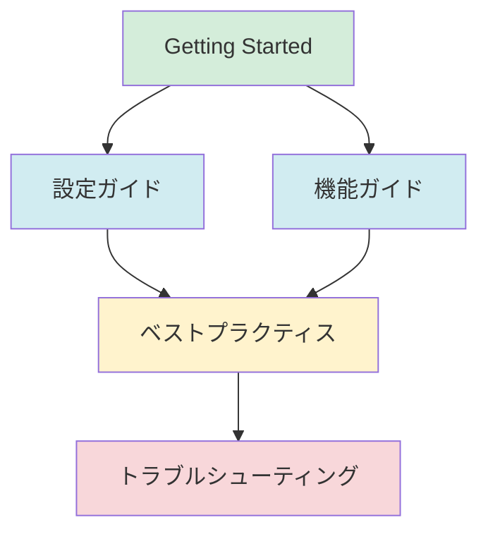

# Amazon Q CLI ドキュメント

**最終更新**: 2025-10-11  
**対象バージョン**: v1.17.0以降  
**総ドキュメント数**: 65文書

---

## 🚀 はじめに

Amazon Q CLI（Amazon Q CLI）は、AIを活用した開発者向けコマンドラインツールです。このドキュメントサイトでは、インストールから高度な活用方法まで、Q CLIを効果的に使用するための情報を提供します。

> **💡 ワンポイント**: 主要な用語
> - **Agent（エージェント）**: Q CLIの動作をカスタマイズする設定ファイル。プロジェクトごとに異なる設定が可能
> - **MCP（Model Context Protocol）**: 外部ツールと連携するためのプロトコル。AWS CLIやデータベースなどと統合できる
> - **Knowledge Base**: プロジェクトのドキュメントやコードを検索する機能。BM25/Vector検索をサポート
> - **IAM Identity Center**: エンタープライズ向けの統合認証システム。組織全体でQ CLIを管理できる

---

## 🎬 Q CLIを使うとこんなに便利！

### Before（従来の方法）

**AWS リソースの確認**
```bash
# 複数のコマンドを覚える必要がある
aws s3 ls
aws ec2 describe-instances --query 'Reservations[].Instances[].[InstanceId,State.Name]'
aws lambda list-functions --query 'Functions[].[FunctionName,Runtime]'

# → 3つのコマンド、複雑なクエリ構文
```

**コードの生成**
```bash
# 1. ブラウザでStack Overflowを検索
# 2. コードをコピー
# 3. エディタに貼り付け
# 4. 自分のプロジェクトに合わせて修正

# → 約5-10分
```

**ドキュメントの作成**
```bash
# 1. コードを読んで理解
# 2. マークダウンファイルを作成
# 3. 手動で説明を記述
# 4. コード例を追加

# → 約30-60分
```

### After（Q CLI）

**AWS リソースの確認**
```bash
q chat "S3バケット、EC2インスタンス、Lambda関数の一覧を教えて"

# → 1つのコマンド、自然言語で一度に確認可能
```

**コードの生成**
```bash
q chat "Pythonでファクトリアルを計算する関数を書いて"

# → 約30秒
```

**ドキュメントの作成**
```bash
q chat "このプロジェクトのREADME.mdを作成して"

# → 約2-3分
```

### 効果

| タスク | 従来の方法 | Q CLI | 削減率 |
|--------|-----------|-------|--------|
| AWS リソース確認 | 3コマンド | 1コマンド | **67%削減** |
| コード生成 | 5-10分 | 30秒 | **90%削減** |
| ドキュメント作成 | 30-60分 | 2-3分 | **95%削減** |

**平均的な効果**: 作業時間を**60-90%削減**

---

### クイックスタート

初めての方は、以下の順序でドキュメントをお読みください：

1. **[インストール](for-users/getting-started/installation.md)** - Amazon Q CLIのインストール方法
2. **[クイックスタート](for-users/getting-started/quick-start.md)** - 5分で始めるQ CLI
3. **[最初の一歩](for-users/getting-started/first-steps.md)** - 基本的な使い方

### 学習パス



**推奨学習順序**:
1. 🟢 Getting Started（初級）→ 基本を習得
2. 🔵 設定ガイド・機能ガイド（中級）→ カスタマイズを学ぶ
3. 🟡 ベストプラクティス（中級〜上級）→ 効果的な使い方を習得
4. 🔴 トラブルシューティング（必要時）→ 問題を解決

---

## 📖 ドキュメント構成

### 🎯 Getting Started（初心者向け）- 全5文書

Amazon Q CLIを初めて使う方向けのガイドです。

| # | ドキュメント | 対象ユーザー | 主な内容 |
|---|------------|------------|---------|
| 1 | [README](for-users/getting-started/README.md) | 初級 | Getting Startedセクションの概要とナビゲーション |
| 2 | [インストールガイド](for-users/getting-started/installation.md) | 初級 | OS別インストール手順（macOS/Linux）、Homebrew/手動インストール、システム要件 |
| 3 | [クイックスタート](for-users/getting-started/quick-start.md) | 初級 | 5分で始める、インストール→認証→初回チャット、基本コマンド |
| 4 | [最初の一歩](for-users/getting-started/first-steps.md) | 初級 | 基本操作、チャット/ファイル操作/コマンド実行、Agent切り替え、履歴管理 |
| 5 | [料金プラン](for-users/getting-started/pricing.md) | 初級 | Free/Proプランの違い、料金体系、エンタープライズ向けオプション |

**次のステップ**: Getting Startedを完了したら、[設定ガイド](#設定ガイド8文書)でQ CLIをカスタマイズしましょう。

---

### 📚 User Guide（ユーザーガイド）- 全24文書

Amazon Q CLIの機能と設定を詳しく学びたい方向けのガイドです。

#### 設定ガイド（8文書）

| # | ドキュメント | 対象ユーザー | 主な内容 |
|---|------------|------------|---------|
| 1 | [README](for-users/configuration/README.md) | 初級 | 設定ガイドセクションの概要とナビゲーション |
| 2 | [設定システム概要](for-users/configuration/overview.md) | 初級〜中級 | 設定システム全体像、5段階優先順位、4種類の設定（グローバル/Agent/MCP/環境変数） |
| 3 | [グローバル設定](for-users/configuration/global-settings.md) | 初級 | settings.json、35項目（テレメトリ/チャット/Knowledge/デフォルトAgent） |
| 4 | [Agent設定](for-users/configuration/agent-configuration.md) | 中級 | JSONスキーマ、グローバル/ローカルAgent、必須/オプションフィールド、検証方法 |
| 5 | [MCP設定](for-users/configuration/mcp-configuration.md) | 中級 | MCPサーバー設定、stdio/HTTP接続、OAuth認証、環境変数展開 |
| 6 | [環境変数](for-users/configuration/environment-variables.md) | 中級 | 23項目、Q CLI固有18項目、設定方法、実践パターン |
| 7 | [優先順位ルール](for-users/configuration/priority-rules.md) | 中級 | 5段階優先順位（CLI引数→環境変数→ローカルAgent→グローバルAgent→デフォルト）、フロー図 |
| 8 | [設定例集](for-users/configuration/examples.md) | 中級 | 実践的な設定例、ユースケース別（開発/本番/チーム） |

**次のステップ**: 設定をカスタマイズしたら、[機能ガイド](#機能ガイド8文書)で各機能の使い方を学びましょう。

#### 機能ガイド（8文書）

| # | ドキュメント | 対象ユーザー | 主な内容 |
|---|------------|------------|---------|
| 1 | [README](for-users/features/README.md) | 初級〜中級 | Featuresセクションの概要 |
| 2 | [チャット機能](for-users/features/chat.md) | 初級 | 基本操作、チャットコマンド（/help, /agent, /context）、Tips |
| 3 | [Agent機能](for-users/features/agents.md) | 中級 | Agent概要、管理コマンド（list/切り替え）、カスタマイズ項目 |
| 4 | [オートコンプリート](for-users/features/autocomplete.md) | 初級 | オートコンプリート機能、設定、使い方 |
| 5 | [Checkpoint機能](for-users/features/checkpoints.md) | 初級〜中級 | チェックポイント機能、保存/復元、自動保存設定 |
| 6 | [キーボードショートカット](for-users/features/keyboard-shortcuts.md) | 初級〜中級 | ショートカット一覧、Tangent/Skim/Delegateモード、カスタマイズ |
| 7 | [SSH/リモート接続](for-users/features/ssh-remote.md) | 中級 | リモート環境での使用、SSH接続、設定方法 |
| 8 | [実験的機能](for-users/features/experimental.md) | 上級 | 実験的機能、Delegate Mode、安全性警告、ベストプラクティス |

**次のステップ**: 機能を理解したら、[ベストプラクティス](#ベストプラクティス4文書)で効果的な使い方を学びましょう。

#### エンタープライズ導入（2文書）

| # | ドキュメント | 対象ユーザー | 主な内容 |
|---|------------|------------|---------|
| 1 | [README](for-users/deployment/README.md) | 中級〜上級 | Deploymentセクションの概要 |
| 2 | [エンタープライズ導入ガイド](for-users/deployment/enterprise-deployment.md) | 中級〜上級 | IAM Identity Center、組織導入、Pro契約、段階的ロールアウト、セキュリティ |

#### ベストプラクティス（4文書）

| # | ドキュメント | 対象ユーザー | 主な内容 |
|---|------------|------------|---------|
| 1 | [README](for-users/best-practices/README.md) | 中級 | ベストプラクティスセクションの概要 |
| 2 | [設定のベストプラクティス](for-users/best-practices/configuration.md) | 中級 | Agent設定、MCP設定、セキュリティ、パフォーマンス最適化 |
| 3 | [セキュリティ](for-users/best-practices/security.md) | 中級〜上級 | ツール権限管理、認証情報管理、最小権限原則 |
| 4 | [パフォーマンス最適化](for-users/best-practices/performance.md) | 中級 | コンテキスト管理、MCP最適化、レスポンス時間改善 |

**次のステップ**: 問題が発生した場合は、[トラブルシューティング](#トラブルシューティング3文書)を参照してください。

#### トラブルシューティング（3文書）

| # | ドキュメント | 対象ユーザー | 主な内容 |
|---|------------|------------|---------|
| 1 | [README](for-users/troubleshooting/README.md) | 初級〜中級 | トラブルシューティングセクションの概要 |
| 2 | [よくある問題](for-users/troubleshooting/common-issues.md) | 初級〜中級 | 15の一般的問題、診断コマンド、高度なトラブルシューティング |
| 3 | [FAQ](for-users/troubleshooting/faq.md) | 初級 | よくある質問と回答、カテゴリ別整理 |

---

### 🔧 Developer Guide（開発者向け）- 全9文書

Amazon Q CLIの内部構造を理解したい方、コントリビューションしたい方向けのガイドです。

#### アーキテクチャ（5文書）

| # | ドキュメント | 対象ユーザー | 主な内容 |
|---|------------|------------|---------|
| 1 | [README](for-developers/architecture/README.md) | 上級 | アーキテクチャセクションの概要 |
| 2 | [アーキテクチャ概要](for-developers/architecture/overview.md) | 上級 | システム全体像、コンポーネント構成、アーキテクチャ図 |
| 3 | [設定システム](for-developers/architecture/configuration-system.md) | 上級 | 設定システムの内部実装、優先順位処理、読み込みフロー |
| 4 | [ソースコード構造](for-developers/architecture/source-code-structure.md) | 上級 | ソースコード構造マップ、設定関連ファイル、クラス図、シーケンス図 |
| 5 | [コード統計](for-developers/architecture/code-statistics.md) | 上級 | 263k行Rust、8クレート、TOP5モジュール分析 |

#### コントリビューション（3文書）

| # | ドキュメント | 対象ユーザー | 主な内容 |
|---|------------|------------|---------|
| 1 | [README](for-developers/contributing/README.md) | 上級 | コントリビューションセクションの概要 |
| 2 | [開発環境セットアップ](for-developers/contributing/development-setup.md) | 上級 | 開発環境構築、ビルド方法、テスト実行 |
| 3 | [プルリクエストガイド](for-developers/contributing/pull-request-guide.md) | 上級 | PR作成手順、レビュー基準、マージプロセス |

---

### 📚 Reference（リファレンス）- 全6文書

詳細な仕様や完全なリストを確認したい方向けのリファレンスです。

| # | ドキュメント | 対象ユーザー | 主な内容 |
|---|------------|------------|---------|
| 1 | [README](for-users/reference/README.md) | 中級 | Referenceセクションの概要 |
| 2 | [設定項目リファレンス](for-users/reference/settings-reference.md) | 中級〜上級 | 全35設定項目、カテゴリ別分類（テレメトリ/チャット/Knowledge/MCP） |
| 3 | [設定ファイル配置マップ](for-users/reference/configuration-file-locations.md) | 中級 | 5種類の設定ファイル配置マップ、ディレクトリ構造、実践例 |
| 4 | [環境変数リファレンス](for-users/configuration/environment-variables.md) | 中級〜上級 | 全環境変数リスト、Q CLI固有18項目、AWS/システム変数 |
| 5 | [コマンドリファレンス](for-users/reference/commands.md) | 初級〜中級 | 全コマンドリスト、サブコマンド、オプション |
| 6 | [用語集](for-users/reference/glossary.md) | 初級 | Amazon Q CLI用語集、Agent/MCP/Knowledge等の定義 |

---

### 📰 Updates（アップデート情報）- 全5文書

最新の変更やロードマップを確認したい方向けの情報です。

| # | ドキュメント | 対象ユーザー | 主な内容 |
|---|------------|------------|---------|
| 1 | [README](for-community/updates/README.md) | 初級〜中級 | Updatesセクションの概要 |
| 2 | [変更履歴](for-community/updates/changelog.md) | 初級〜中級 | バージョン別変更履歴、機能追加/バグ修正 |
| 3 | [ロードマップ](for-community/updates/roadmap.md) | 中級〜上級 | 開発計画、35アイテム、優先順位マトリクス、エンタープライズ課題 |
| 4 | [バージョン履歴 v1.13-v1.17](for-community/updates/version-history-v1.13-v1.17.md) | 中級 | v1.13-v1.17詳細履歴、135+ PRs、主要機能進化 |
| 5 | [マイグレーションガイド](for-community/updates/migration-guides.md) | 中級 | バージョン間の移行ガイド、破壊的変更への対応 |

---

### 👥 Community（コミュニティ）- 全4文書

コミュニティリソースや活用事例を知りたい方向けの情報です。

| # | ドキュメント | 対象ユーザー | 主な内容 |
|---|------------|------------|---------|
| 1 | [README](for-community/community/README.md) | 初級 | Communityセクションの概要 |
| 2 | [コントリビューションガイド](for-community/community/contributing.md) | 中級 | コミュニティへの貢献方法、PR作成手順 |
| 3 | [リソース集](for-community/community/resources.md) | 初級〜中級 | 関連リンク、公式リソース、コミュニティツール |
| 4 | [ショーケース](for-community/community/showcase.md) | 初級〜中級 | 活用事例、ユースケース紹介 |

---

### 📊 Analysis（分析レポート）- 全4文書

詳細な分析レポートを確認したい方向けの情報です。

| # | ドキュメント | 対象ユーザー | 主な内容 |
|---|------------|------------|---------|
| 1 | [README](for-community/analysis/README.md) | 中級〜上級 | Analysisセクションの概要 |
| 2 | [ロードマップ分析](for-community/analysis/roadmap-analysis-20251008.md) | 中級〜上級 | 35件のRoadmapアイテム分析、優先順位マトリクス、エンタープライズ採用への障壁 |
| 3 | [ソースコード構造分析](for-community/analysis/source-code-structure.md) | 上級 | ソースコード構造の詳細分析、設定システムの実装 |
| 4 | [コード規模分析](for-community/analysis/source-code-scale-analysis.md) | 上級 | プロジェクト規模統計、言語別コード量、モジュール分析 |

---

## 🔍 ドキュメントの探し方

### 目的別ガイド

#### Amazon Q CLIを始めたい
→ [Getting Started](for-users/getting-started/) セクション（5文書）から始めてください

#### 設定を変更したい
→ [設定ガイド](for-users/configuration/)（8文書）で設定方法を確認してください

#### 特定の機能を使いたい
→ [機能ガイド](for-users/features/)（8文書）で各機能の使い方を確認してください

#### 問題を解決したい
→ [トラブルシューティング](for-users/troubleshooting/)（3文書）で解決方法を探してください

#### 詳細な仕様を知りたい
→ [リファレンス](for-users/reference/)（6文書）で完全なリストを確認してください

#### コントリビューションしたい
→ [Developer Guide](for-developers/)（9文書）で開発方法を確認してください

---

## 📊 ドキュメント統計

### カテゴリ別文書数

| カテゴリ | 文書数 | 対象ユーザー |
|---------|--------|------------|
| Getting Started | 5 | 初級 |
| User Guide - Configuration | 8 | 初級〜中級 |
| User Guide - Features | 8 | 初級〜上級 |
| User Guide - Deployment | 1 | 中級〜上級 |
| User Guide - Best Practices | 4 | 中級〜上級 |
| User Guide - Troubleshooting | 3 | 初級〜中級 |
| User Guide - Reference | 6 | 初級〜上級 |
| Developer Guide - Architecture | 5 | 上級 |
| Developer Guide - Contributing | 3 | 上級 |
| Community - Updates | 5 | 初級〜上級 |
| Community - Community | 4 | 初級〜中級 |
| Community - Analysis | 3 | 中級〜上級 |
| Meta | 5 | 中級〜上級 |
| **合計** | **65** | - |

### 対象ユーザー別文書数

- **初級向け**: 12文書
- **中級向け**: 20文書
- **上級向け**: 8文書

---

## 📌 重要なリンク

### 公式リソース
- **GitHub リポジトリ**: https://github.com/aws/amazon-q-developer-cli
- **AWS 公式サイト**: https://aws.amazon.com/q/developer/

### よく使うドキュメント
- [クイックスタート](for-users/getting-started/quick-start.md) - 5分で始める
- [Agent設定](for-users/configuration/agent-configuration.md) - Agent設定の詳細
- [よくある問題](for-users/troubleshooting/common-issues.md) - トラブルシューティング
- [設定項目リファレンス](for-users/reference/settings-reference.md) - 全設定項目

---

## 🤝 コントリビューション

このドキュメントへの貢献を歓迎します！

- **誤字・脱字の修正**: 気軽にPRを送ってください
- **内容の改善**: より良い説明や例があれば提案してください
- **新しいドキュメント**: 不足している情報があれば追加してください

詳細は [コントリビューションガイド](for-developers/contributing/README.md) をご覧ください。

---

## 📝 ドキュメントのバージョン

このドキュメントは、Amazon Q CLI v1.17.0以降を対象としています。古いバージョンをお使いの場合、一部の機能や設定が異なる可能性があります。

最新バージョンへのアップデート方法は [インストールガイド](for-users/getting-started/installation.md) をご覧ください。

---

## 💡 ヒント

- **検索機能**: ブラウザの検索機能（Ctrl+F / Cmd+F）を使って、キーワードで情報を探せます
- **目次**: 各ドキュメントには目次があり、必要な情報に素早くアクセスできます
- **リンク**: 関連するドキュメントへのリンクが豊富にあります
- **対象ユーザー**: 各ドキュメントには対象ユーザーレベルが記載されています

---

**作成日**: 2025-10-11  
**最終更新日**: 2025-10-11
