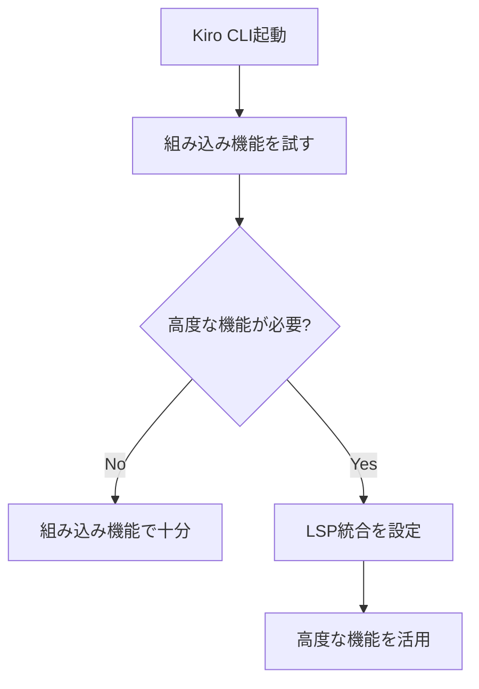

# Kiro CLI LSP統合機能（Code Intelligence）

**出典**: [Kiro CLI のコード理解が進化？ LSP 統合がもたらす新しい開発体験](https://zenn.dev/aws_japan/articles/bca7fdc3a15f46) - Zenn記事 by konippi

## 概要

Kiro CLI v1.22.0（2025年12月11日リリース）で追加されたLSP（Language Server Protocol）統合機能について詳細に解説します。この機能により、Kiro CLIがコードの構造や意味を理解し、IDE のような高度なコード操作を自然言語で実行できるようになりました。

### v1.24.0での進化（2026年1月16日リリース）

v1.24.0では、Code Intelligence機能がさらに進化しました：

- **18言語で組み込み対応**: LSPセットアップ不要で即座に利用開始
- **新コマンド追加**: `/code overview` でコードベース全体の概要を取得
- **対応言語の拡大**: 7言語から18言語に拡大（Bash, C, C++, C#, Elixir, Go, Java, JavaScript, Kotlin, Lua, PHP, Python, Ruby, Rust, Scala, Swift, TSX, TypeScript）
- **オプションのLSP統合**: より高度な機能が必要な場合のみLSPを設定

**公式情報**: [Kiro CLI v1.24.0 Changelog](https://kiro.dev/changelog/cli/1-24/)

## 📋 Zenn記事の詳細内容確認

### v1.22.0のLSP統合（Code Intelligence機能）の詳細

#### 主要な機能・特徴

1. **Code Intelligence機能の本質**
   - LSPを通じてコードのセマンティック（意味的）理解を実現
   - 単なるテキスト検索ではなく、クラス・関数・変数などのシンボルを正確に識別
   - コードの構造・型・関係性を理解した上での操作が可能

2. **LSP統合によるメリット**
   - **コードの「意味」理解**: 確率的生成から構造的理解への進化
   - **リアルタイムフィードバック**: IDEのようなリアルタイム診断情報
   - **コンテキスト最適化**: 必要な情報への直接アクセスでトークン消費削減

3. **セットアップ手順**
   - Language Serverの事前インストールが必要
   - `/code init`コマンドでプロジェクト単位の初期化
   - `.kiro/settings/lsp.json`設定ファイルの自動生成

4. **対応言語（7言語）**
   - TypeScript/JavaScript (typescript-language-server)
   - Rust (rust-analyzer)
   - Python (pyright)
   - Go (gopls)
   - Java (jdtls)
   - Ruby (solargraph)
   - C/C++ (clangd)

5. **カスタム言語サポート**
   - `.kiro/settings/lsp.json`の設定で他言語追加可能
   - PHP (intelephense)の追加例も記載
   - 独自Language Serverの設定方法も詳細に説明

6. **具体的なユースケース**
   - **シンボル検索**: `useToast 関数はどこで定義されていますか？`
   - **参照検索**: `Person クラスの参照を探して`
   - **定義ジャンプ**: `UserService の定義を教えて`
   - **シンボル一覧**: `auth.service.ts にはどんなシンボルがある？`
   - **診断情報**: `main.ts の診断情報を教えて`

7. **効果的な使い方のポイント**
   - プロジェクトルートでの初期化必須
   - 具体的な検索語の使用で精度向上
   - リネーム前の影響範囲確認
   - 診断情報の優先確認

### v1.24.0: 組み込みCode Intelligence（LSPセットアップ不要）

v1.24.0では、18言語で**LSPセットアップ不要**の組み込みCode Intelligence機能が提供されます。

#### サポート言語（18言語）

| 言語 | 組み込み対応 | LSP統合（オプション） |
|------|-------------|---------------------|
| Bash | ✅ | - |
| C | ✅ | clangd |
| C++ | ✅ | clangd |
| C# | ✅ | - |
| Elixir | ✅ | - |
| Go | ✅ | gopls |
| Java | ✅ | jdtls |
| JavaScript | ✅ | typescript-language-server |
| Kotlin | ✅ | - |
| Lua | ✅ | - |
| PHP | ✅ | intelephense |
| Python | ✅ | pyright |
| Ruby | ✅ | solargraph |
| Rust | ✅ | rust-analyzer |
| Scala | ✅ | - |
| Swift | ✅ | - |
| TSX | ✅ | typescript-language-server |
| TypeScript | ✅ | typescript-language-server |

#### 組み込み機能（LSP不要）

以下の機能は、LSPセットアップなしで即座に利用できます：

| 機能 | 説明 | 使用例 |
|------|------|--------|
| **Symbol search** | 関数、クラス、変数をコードベース全体から検索 | `UserService クラスを検索して` |
| **Document symbols** | ファイル内のすべてのシンボルをリスト表示 | `auth.service.ts のシンボル一覧を表示` |
| **Symbol lookup** | 定義に即座にジャンプ | `useToast 関数の定義を表示` |
| **Pattern search** | ASTベースの構造的コード検索 | `async function を検索` |
| **Pattern rewrite** | ASTパターンを使用した自動コード変換 | `var を const に変換` |
| **Codebase map** | ディレクトリ構造の探索とコード構成の理解 | `プロジェクト構造を表示` |

#### オプション: LSP統合（高度な機能）

より高度な機能が必要な場合は、オプションでLSP統合を有効化できます：

| 機能 | 説明 | LSP必要 |
|------|------|---------|
| **参照検索** | シンボルの使用箇所をすべて検索 | ✅ |
| **ホバードキュメント** | シンボルの型情報やドキュメントを表示 | ✅ |
| **リネームリファクタリング** | シンボルをプロジェクト全体で一括リネーム | ✅ |
| **診断情報** | コンパイルエラーや警告をリアルタイム表示 | ✅ |

**LSP統合の初期化**:

```bash
# プロジェクトルートで実行
/code init

# LSPサーバーの再起動
/code init -f
```

#### v1.22.0との比較

| 項目 | v1.22.0 | v1.24.0 |
|------|---------|---------|
| 対応言語 | 7言語 | 18言語 |
| LSPセットアップ | 必須 | オプション |
| 利用開始 | LSPインストール後 | 即座に利用可能 |
| 基本機能 | LSP統合が前提 | 組み込みで提供 |
| 高度な機能 | LSP統合で提供 | LSP統合で提供（オプション） |

## セットアップ詳細

### v1.24.0: 即座に利用開始（LSPセットアップ不要）

v1.24.0では、18言語でLSPセットアップなしで即座にCode Intelligence機能を利用できます。

#### 1. 利用開始（セットアップ不要）

```bash
# Kiro CLIを起動するだけで利用可能
kiro-cli chat

# コードベースの概要を取得
/code overview

# クリーンな出力（サイレントモード）
/code overview --silent
```

#### 2. 基本的な使用例

```bash
# シンボル検索
「UserService クラスを検索して」

# ファイル内のシンボル一覧
「auth.service.ts のシンボル一覧を表示」

# 定義の表示
「useToast 関数の定義を表示」
```

#### 3. オプション: LSP統合（高度な機能が必要な場合）

参照検索、ホバードキュメント、リネームリファクタリングなどの高度な機能が必要な場合のみ、LSP統合を設定します。

**LSP統合の設定手順は、以下の「v1.22.0: LSP統合のセットアップ」セクションを参照してください。**

### v1.22.0: LSP統合のセットアップ（オプション）

### 1. Language Serverのインストール

使用したい言語のLanguage Serverを事前にインストールする必要があります。

例：TypeScriptの場合
```bash
npm install -g typescript-language-server typescript
```

### 2. Code Intelligenceの初期化

プロジェクトルートで以下のコマンドを実行：
```bash
/code init
```

このコマンドは以下を実行します：
1. `.kiro/settings/lsp.json`設定ファイルを生成
2. プロジェクト内の言語を自動検出
3. インストール済みのLanguage Serverを起動

### 3. ステータス確認

初期化後のステータス表示：
- ✓ : 初期化完了、使用可能
- ◐ : 初期化中
- ○ available : インストール済みだが、プロジェクトで未使用
- ○ not installed : 未インストール

## 対応言語とインストールコマンド

| 言語 | 拡張子 | Language Server | インストールコマンド |
|------|--------|-----------------|---------------------|
| TypeScript/JavaScript | .ts, .js, .tsx, .jsx | typescript-language-server | `npm install -g typescript-language-server typescript` |
| Rust | .rs | rust-analyzer | `rustup component add rust-analyzer` |
| Python | .py | pyright | `npm install -g pyright` または `pip install pyright` |
| Go | .go | gopls | `go install golang.org/x/tools/gopls@latest` |
| Java | .java | jdtls | `brew install jdtls` (macOS) |
| Ruby | .rb | solargraph | `gem install solargraph` |
| C/C++ | .c, .cpp, .h, .hpp | clangd | `brew install llvm` (macOS) または `apt install clangd` (Linux) |

## カスタム言語の追加

### PHP Language Serverの追加例

1. PHP Language Serverをインストール：
```bash
npm install -g intelephense
```

2. `.kiro/settings/lsp.json`に設定を追加：
```json
{
  "languages": {
    "php": {
      "name": "intelephense",
      "command": "intelephense",
      "args": ["--stdio"],
      "file_extensions": ["php"],
      "project_patterns": ["composer.json"],
      "exclude_patterns": ["**/vendor/**"],
      "multi_workspace": false,
      "initialization_options": {},
      "request_timeout_secs": 60
    }
  }
}
```

### 設定項目の説明

- **name**: Language Serverの表示名
- **command**: 実行するバイナリ/コマンド
- **args**: コマンドライン引数（通常は ["--stdio"]）
- **file_extensions**: 対応するファイル拡張子
- **project_patterns**: プロジェクトルートを示すファイル（例: package.json）
- **exclude_patterns**: 解析から除外するGlobパターン
- **multi_workspace**: 複数ワークスペースフォルダのサポート（デフォルト: false）
- **initialization_options**: LSP固有の初期化設定
- **request_timeout_secs**: LSPリクエストのタイムアウト秒数（デフォルト: 60）

## 実用的なユースケース

### v1.24.0: 新しいコードベースの迅速な理解

#### ユースケース: プロジェクトへのオンボーディング

新しいプロジェクトに参加した際、`/code overview` コマンドでコードベース全体の概要を即座に把握できます。

**実行例**:

```bash
# コードベースの概要を取得
/code overview
```

**出力例**（推定）:

```
プロジェクト構造:
- src/
  - controllers/ (5 files)
  - services/ (8 files)
  - models/ (12 files)
  - utils/ (3 files)

主要なシンボル:
- UserService (src/services/user.service.ts)
- AuthController (src/controllers/auth.controller.ts)
- User (src/models/user.model.ts)

依存関係:
- Express.js (Web framework)
- TypeORM (Database ORM)
- Jest (Testing framework)
```

**メリット**:

- **即座に利用可能**: LSPセットアップ不要で即座に実行
- **全体像の把握**: プロジェクト構造、主要なシンボル、依存関係を一覧表示
- **効率的なオンボーディング**: 数分でプロジェクトの全体像を理解

#### ユースケース: 未知のパッケージの理解

サードパーティライブラリやレガシーコードの理解にも活用できます。

**実行例**:

```bash
# サイレントモードでクリーンな出力
/code overview --silent
```

**メリット**:

- **構造的理解**: コードの構造を体系的に把握
- **迅速な理解**: ドキュメントを読む前にコードの全体像を把握
- **効率的な学習**: 重要なシンボルから優先的に学習

### v1.22.0: LSP統合によるユースケース

### シンボル検索
```
> useToast 関数はどこで定義されていますか？
```

出力例：
```
Searching for symbols matching: "useToast" (using tool: code) - Completed in 0.0s

> useToast 関数は ec-site/src/utils/useToast.ts で定義されています。

この関数は、トースト通知を管理するカスタムフックで、以下を提供します:
- toast: 現在のトースト状態（メッセージとタイプ）
- showToast: トーストを表示する関数
- hideToast: トーストを非表示にする関数
```

### 参照検索
```
> Person クラスの参照を探して
```

出力例：
```
Finding all references at: auth.ts:42:10

  1. src/auth.ts:42:10 - export function authenticate(...)
  2. src/handlers/login.ts:15:5 - authenticate(credentials)
  3. src/handlers/api.ts:89:12 - await authenticate(token)
  (3 more items found)
```

### 定義ジャンプ
```
> UserService の定義を教えて
```

出力例：
```
src/services/user.service.ts:42:1: export class UserService { ...
```

### 診断情報の取得
```
> main.ts の診断情報を教えて
```

出力例：
```
  1. Error line 15:10: Cannot find name 'undefined_var'
  2. Warning line 42:5: 'result' is declared but never used
```

## 効果的な使い方

### v1.24.0: 組み込みCode Intelligenceの活用

#### 1. まずは組み込み機能から始める

v1.24.0では、LSPセットアップなしで多くの機能が利用できます。まずは組み込み機能を試してから、必要に応じてLSP統合を検討しましょう。

**推奨フロー**:



#### 2. /code overview を活用する

新しいプロジェクトやコードベースに取り組む際は、まず `/code overview` でプロジェクト全体の概要を把握しましょう。

**推奨タイミング**:

- プロジェクトへの参加初日
- 新しいモジュールの開発開始時
- レガシーコードのリファクタリング開始時
- コードレビュー前の全体把握

#### 3. 組み込み機能とLSP統合の使い分け

| 用途 | 推奨 | 理由 |
|------|------|------|
| シンボル検索 | 組み込み | セットアップ不要で十分 |
| 定義ジャンプ | 組み込み | セットアップ不要で十分 |
| ファイル内シンボル一覧 | 組み込み | セットアップ不要で十分 |
| 参照検索 | LSP統合 | より正確な結果 |
| リネームリファクタリング | LSP統合 | プロジェクト全体の一括変更 |
| 診断情報 | LSP統合 | リアルタイムエラー検出 |

#### 4. 18言語対応を活用する

v1.24.0では18言語に対応しているため、マルチ言語プロジェクトでも統一的な開発体験が得られます。

**マルチ言語プロジェクトの例**:

- フロントエンド（TypeScript/TSX）+ バックエンド（Go/Rust）
- スクリプト（Bash/Python）+ アプリケーション（Java/Kotlin）
- システムプログラミング（C/C++）+ スクリプト（Lua/Ruby）

### v1.22.0: LSP統合のベストプラクティス

### ベストプラクティス

1. **プロジェクトルートで初期化**
   - `/code init`は必ずプロジェクトルートで実行

2. **具体的な検索語を使用**
   - 良い例: "UserService"
   - 悪い例: "user"

3. **リネーム前の確認**
   - ファイル横断のリネームを実行する前に影響範囲を確認

4. **診断情報の優先確認**
   - シンボルが見つからない場合、まず診断情報を確認

### 無効化方法

LSP統合を無効化したい場合：
1. `.kiro/settings/lsp.json`を削除
2. セッションを再起動

## トラブルシューティング

### v1.24.0: 組み込みCode Intelligence関連

#### 問題: /code overview が動作しない

**症状**:

```bash
/code overview
# エラー: Command not found
```

**原因と対処法**:

1. **Kiro CLIのバージョンが古い**
   ```bash
   # バージョン確認
   kiro-cli --version
   
   # v1.24.0以降であることを確認
   # 古い場合はアップデート
   ```

2. **プロジェクトルート以外で実行している**
   ```bash
   # プロジェクトルートに移動
   cd /path/to/project
   
   # 再度実行
   /code overview
   ```

#### 問題: 組み込み機能で検索結果が表示されない

**症状**:

```bash
「UserService クラスを検索して」
# 結果: 見つかりませんでした
```

**原因と対処法**:

1. **対応言語以外のファイル**
   - 18言語以外のファイルは組み込み機能で検索できません
   - 対応言語: Bash, C, C++, C#, Elixir, Go, Java, JavaScript, Kotlin, Lua, PHP, Python, Ruby, Rust, Scala, Swift, TSX, TypeScript

2. **ファイルが大きすぎる**
   - 非常に大きなファイルは処理に時間がかかる場合があります
   - `/code overview --silent` でクリーンな出力を試してください

3. **シンボル名が間違っている**
   - 正確なシンボル名を指定してください
   - 大文字小文字を区別します

#### 問題: 組み込み機能とLSP統合の違いがわからない

**判断基準**:

| 機能 | 組み込み | LSP統合 |
|------|---------|---------|
| シンボル検索 | ✅ | ✅ |
| 定義ジャンプ | ✅ | ✅ |
| ファイル内シンボル一覧 | ✅ | ✅ |
| 参照検索 | ❌ | ✅ |
| ホバードキュメント | ❌ | ✅ |
| リネームリファクタリング | ❌ | ✅ |
| 診断情報 | ❌ | ✅ |

**推奨**:

- まずは組み込み機能を試す
- 参照検索やリネームが必要になったらLSP統合を設定

## まとめ

Kiro CLI v1.22.0のLSP統合機能は、コーディングエージェントの根本的な能力向上を実現する重要なアップデートです。単なるテキスト検索から、コードの意味を理解した構造的な操作への進化により、開発効率が大幅に向上します。

この機能により、Kiro CLIは：
- IDEレベルのコード理解能力を獲得
- トークン消費の最適化を実現
- リアルタイムフィードバックによる開発体験向上

を提供し、AI駆動開発の新しい標準を確立しています。

### v1.24.0での進化

v1.24.0では、Code Intelligence機能がさらに進化しました：

- **18言語で組み込み対応**: LSPセットアップ不要で即座に利用開始
- **新コマンド `/code overview`**: コードベース全体の概要を即座に把握
- **オプションのLSP統合**: 高度な機能が必要な場合のみ設定

**v1.22.0からの主な変更点**:

| 項目 | v1.22.0 | v1.24.0 |
|------|---------|---------|
| 対応言語 | 7言語 | 18言語 |
| LSPセットアップ | 必須 | オプション |
| 利用開始 | LSPインストール後 | 即座に利用可能 |
| 新コマンド | なし | `/code overview` |

**推奨される使い方**:

1. まずは組み込み機能を試す（LSPセットアップ不要）
2. `/code overview` でプロジェクト全体を把握
3. 高度な機能が必要になったらLSP統合を設定

**参考リンク**:

- [Kiro CLI v1.24.0 Changelog](https://kiro.dev/changelog/cli/1-24/)
- [Code Intelligence Documentation](https://kiro.dev/docs/cli/code-intelligence/)
