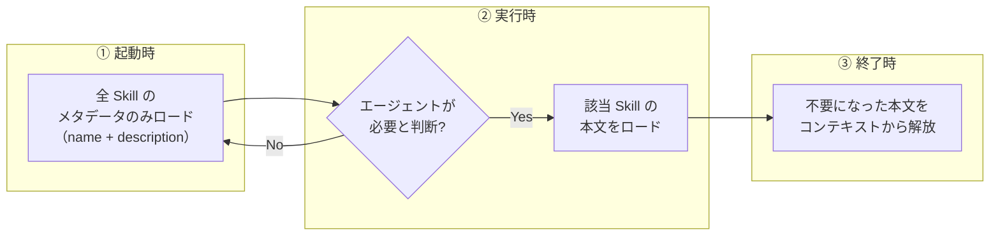

[ホーム](../README.md) > [機能詳細ガイド](README.md) > Skills（Agent Skills）

---

# Kiro CLI Skills機能（Agent Skills）

**出典**: [Kiro CLI v1.24.0 Changelog](https://kiro.dev/changelog/cli/1-24/)、`kiro-cli version --changelog=all`（v1.26.0情報）、[公式Changelog v2.1.0](https://kiro.dev/changelog/cli/2-1/)、[Agent Skills（公式・現行仕様）](https://kiro.dev/docs/skills/)

> 📝 **記述更新（2026-08-16）**: 公式サイトの現行ページでは、Skillは「オープンな**Agent Skills標準**（[agentskills.io](https://agentskills.io)）に準拠したポータブルな指示パッケージ」と再定義され、構造も**フォルダ + `SKILL.md`**（単一の`.md`ファイルではない）に整理されています。本ページはv1.24.0登場時の経緯とProgressive Context Loadingの技術的な仕組み（現在も有効）を保持しつつ、現行の構造・フロントマター仕様・概念枠組みに合わせて全面的に更新しています。

## 概要

Kiro CLI v1.24.0（2026年1月16日リリース）で追加されたSkills機能について詳細に解説します。v1.26.0（2026年2月12日リリース）では、**Skills自動読み込み**が追加され、Agent設定での明示的な指定なしにSkillsが利用可能になりました。その後、公式サイトは Skills を**オープンな Agent Skills 標準**に準拠したポータブルな指示パッケージとして再定義しています（本ページはこの現行定義に基づき更新済み）。

### Skills機能とは（現行定義）

公式現行ページは次のように定義しています。

> Skills are portable instruction packages that follow the open [Agent Skills](https://agentskills.io) standard. They bundle instructions, scripts, and templates into reusable packages that Kiro can activate when relevant to your task.
>
> （Skillsは、オープンな Agent Skills 標準に準拠した**ポータブルな指示パッケージ**です。指示・スクリプト・テンプレートを再利用可能なパッケージにまとめ、タスクに関連する時に Kiro が起動できます。）

技術的な中核は、**段階的開示（Progressive Disclosure）**による**コンテキストの効率的な利用**です。従来の`file://`リソースとは異なり、起動時にはメタデータ（名前と説明）のみをロードし、本文はエージェントが必要と判断した時にオンデマンドでロードします。

### 主な特徴

- **オープン標準**: [Agent Skills標準](https://agentskills.io)に準拠。コミュニティや他の互換AIツールからSkillをインポートしたり、自作のSkillをエコシステム全体で共有できる
- **段階的開示（Progressive Disclosure）**: 起動時はメタデータのみ、本文はオンデマンドでロード
- **スクリプト・テンプレート同梱**: `scripts/`（実行コード）・`references/`（参考文書）・`assets/`（テンプレート）を`SKILL.md`と同じフォルダに配置可能
- **コンテキスト効率化**: 常時コンテキストウィンドウを消費しない
- **自動読み込み（v1.26.0以降）**: `.kiro/skills/`と`~/.kiro/skills/`のSkillsがデフォルトエージェントに自動提供

### 従来のfile://リソースとの違い

| 項目 | file:// | skill:// |
|------|---------|----------|
| ロードタイミング | 起動時に全文 | メタデータのみ起動時、本文はオンデマンド |
| コンテキスト消費 | 常時消費 | 必要時のみ消費 |
| 適用場面 | 小規模な必須ファイル | 大規模なドキュメントセット |
| メタデータ | 不要 | YAMLフロントマター必須 |
| 用途 | プロジェクト設定、標準 | ガイド、リファレンス、ベストプラクティス |

### なぜSkills機能が必要なのか

従来の`file://`リソースでは、すべてのファイルが起動時に全文ロードされるため、大規模なドキュメントセットを扱う場合、以下の問題が発生していました：

1. **コンテキストウィンドウの圧迫**: 起動時に大量のトークンを消費
2. **起動時間の増加**: 大量のファイルを読み込むため起動が遅い
3. **不要な情報のロード**: 使用しない情報もすべてロードされる

Skills機能は、これらの問題を解決し、大規模なドキュメントセットを効率的に管理できるようにします。

## Skills機能詳細

### 基本概念

Skills機能は、大規模なドキュメントセット向けに設計された新しいリソースタイプです。従来の`file://`リソースとは異なり、**段階的コンテキストロード**を実現します。

#### 段階的コンテキストロードとは

1. **起動時**: メタデータ（名前と説明）のみロード
2. **実行時**: エージェントが必要と判断した時に本文をオンデマンドでロード
3. **終了時**: 不要になった本文はコンテキストから解放

この仕組みにより、大規模なドキュメントセットを扱う場合でも、コンテキストウィンドウを効率的に使用できます。



> `file://` リソースが**起動時に全文をロードする**のに対し、Skills は必要な本文だけを必要な間だけ保持します。

### Skillの構造（フォルダ + SKILL.md）

> 📝 **構造の訂正（2026-08-16）**: 公式現行仕様では、Skillは**単一の`.md`ファイルではなく、`SKILL.md`を含むフォルダ**です。本節は現行仕様に基づき記述します（旧版は単一`.md`ファイル前提の記述でしたが誤りです）。

公式現行ページは次のように定義しています。

```
my-skill/
├── SKILL.md           # 必須
├── scripts/           # 任意: 実行可能なコード
├── references/        # 任意: 参考文書
└── assets/            # 任意: テンプレート
```

`SKILL.md`はYAMLフロントマターとMarkdown本文で構成されます。

#### 必須要素

1. **YAMLフロントマター**: メタデータ（`name`・`description`が必須）
2. **Markdown本文**: 実際の指示内容

#### ファイル形式

```markdown
---
name: pr-review
description: Review pull requests for code quality, security issues, and test coverage. Use when reviewing PRs or preparing code for review.
---

## Review checklist

... 指示内容 ...
```

#### YAMLフロントマターの詳細（現行仕様・全5フィールド）

| フィールド | 必須 | 説明 |
|-----------|------|------|
| `name` | ✅ | **フォルダ名と一致**する必要がある。小文字・数字・ハイフンのみ、**最大64文字** |
| `description` | ✅ | このSkillをいつ使うか。Kiroがユーザーのリクエストと照合する。**最大1024文字** |
| `license` | ➖ | ライセンス名、または同梱するライセンスファイルへの参照 |
| `compatibility` | ➖ | 環境要件（必要なツール、ネットワークアクセス等） |
| `metadata` | ➖ | 作者・バージョンなどの追加のキー・バリューデータ |

**重要**: `description`フィールドは、エージェントが適切なタイミングで本文をロードするための判断材料となります。明確で具体的な説明を記述してください。詳細なフィールド制約は[公式仕様（agentskills.io）](https://agentskills.io/specification)を参照してください。

#### 参考文書フォルダ（references/）

詳細なドキュメントは`references/`フォルダに分離できます。

```
aws-deployment/
├── SKILL.md
└── references/
    ├── ecs-guide.md
    └── troubleshooting.md
```

`SKILL.md`内から参照します。

```markdown
For ECS deployments, follow the guide in `references/ecs-guide.md`.
```

Kiroは、指示内容がそう指示している時にのみ参考文書をロードします。

### 設定方法

#### Skills自動読み込み（v1.26.0以降）

v1.26.0以降、以下のディレクトリに配置されたSkillファイルは、**Agent設定での明示的な`skill://`指定なしに**デフォルトエージェントで自動的に利用可能になります。

| ディレクトリ | スコープ | 説明 |
|-------------|---------|------|
| `.kiro/skills/` | プロジェクト | プロジェクト固有のSkills |
| `~/.kiro/skills/` | グローバル | 全プロジェクト共通のSkills |

```bash
# プロジェクト固有のSkillを配置するだけで自動的に利用可能
mkdir -p .kiro/skills/my-skill
cat > .kiro/skills/my-skill/SKILL.md << 'EOF'
---
name: my-skill
description: My custom skill. Use when...
---

# My Skill Content
...
EOF

# Agent設定でのskill://指定は不要（v1.26.0以降）
kiro-cli chat
```

**注意**: v1.24.0〜v1.25.xでは、Agent設定ファイルでの`skill://`指定が必要です（下記参照）。**当時のバージョンでは単一の`.md`ファイル（フォルダ化なし）が使われていましたが、現行の公式仕様は「フォルダ + `SKILL.md`」で統一されています**。

#### Agent設定ファイルでの指定（v1.24.0〜）

```json
{
  "resources": [
    "skill://.kiro/skills/**/SKILL.md"
  ]
}
```

#### 設定のポイント

| 項目 | 説明 | 例 |
|------|------|-----|
| プロトコル | `skill://` を使用 | `skill://.kiro/skills/` |
| パス | プロジェクトルートからの相対パス、または`~`によるホームディレクトリ展開 | `.kiro/skills/`、`~/.kiro/skills/` |
| Globパターン | ワイルドカードで複数フォルダ指定可能（各フォルダの`SKILL.md`を対象） | `*/SKILL.md` |

#### 複数のSkillディレクトリ

公式現行仕様の例（ワークスペース・グローバル双方を指定）:

```json
{
  "name": "my-agent",
  "resources": [
    "skill://.kiro/skills/*/SKILL.md",
    "skill://~/.kiro/skills/*/SKILL.md"
  ]
}
```

カテゴリ別にサブフォルダを分けて個別指定することも可能です（各Skillは依然としてフォルダ+`SKILL.md`）。

```json
{
  "resources": [
    "skill://.kiro/skills/aws/**/SKILL.md",
    "skill://.kiro/skills/architecture/**/SKILL.md",
    "skill://.kiro/skills/best-practices/**/SKILL.md"
  ]
}
```

### コンテキスト管理との関連

Skills機能は、Kiro CLIの4つのコンテキスト管理アプローチの1つです。

| アプローチ | コンテキスト消費 | 永続性 | 最適な用途 |
|-----------|----------------|--------|-----------|
| **Agent Resources** | 常時消費 | セッション間で永続 | 必須プロジェクトファイル、標準、設定 |
| **Skills** | オンデマンド | セッション間で永続 | 大規模ガイド、リファレンスドキュメント |
| **Session Context** | 常時消費 | 現在のセッションのみ | 一時ファイル、クイック実験 |
| **Knowledge Bases** | 検索時のみ | セッション間で永続 | 大規模コードベース、広範なドキュメント |

#### 使い分けの基準

| 条件 | 推奨アプローチ |
|------|--------------|
| 小規模な必須ファイル（< 10KB） | Agent Resources (`file://`) |
| 大規模なガイド（> 10KB） | Skills (`skill://`) |
| 巨大なコードベース（> 1MB） | Knowledge Bases |
| 一時的な参照 | Session Context |

### 動作の仕組み

#### 1. 起動時

```
Kiro CLI起動
  ↓
Agent設定読み込み
  ↓
Skillファイル検索（Globパターン）
  ↓
YAMLフロントマター読み込み（メタデータのみ）
  ↓
Skillリスト作成（name + description）
```

**コンテキスト消費**: メタデータのみ（数百バイト程度）

#### 2. 実行時

```
ユーザーの質問
  ↓
エージェントがSkillリストを確認
  ↓
関連するSkillを判断（descriptionから）
  ↓
必要なSkillの本文をロード
  ↓
本文を使用して回答生成
```

**コンテキスト消費**: 必要なSkillの本文のみ

#### 3. 終了時

```
タスク完了
  ↓
不要になったSkillの本文を解放
  ↓
メタデータのみ保持
```

**コンテキスト消費**: メタデータのみに戻る

## セットアップ/使用方法

### 1. Skillの作成

#### ステップ1: ディレクトリ構造の作成

Skillは**フォルダ + `SKILL.md`**で構成されます。フォルダ名は`SKILL.md`内の`name`フィールドと一致させる必要があります。

```bash
# プロジェクトルートで実行
mkdir -p .kiro/skills/aws/dynamodb-data-modeling
mkdir -p .kiro/skills/architecture
mkdir -p .kiro/skills/best-practices
```

#### ステップ2: SKILL.mdの作成

```bash
# DynamoDBデータモデリングのSkillを作成
cat > .kiro/skills/aws/dynamodb-data-modeling/SKILL.md << 'EOF'
---
name: dynamodb-data-modeling
description: Guide for DynamoDB data modeling best practices. Use when designing or analyzing DynamoDB schema.
---

# DynamoDB Data Modeling

## Overview

This guide provides best practices for DynamoDB data modeling.

## Key Concepts

### Single Table Design

...

### Access Patterns

...

## Examples

...
EOF
```

#### ステップ3: Agent設定ファイルの更新

```bash
# .kiro/agents/my-agent.json
cat > .kiro/agents/my-agent.json << 'EOF'
{
  "name": "my-agent",
  "description": "My custom agent with Skills",
  "resources": [
    "skill://.kiro/skills/*/SKILL.md",
    "skill://.kiro/skills/aws/*/SKILL.md"
  ]
}
EOF
```

### 2. Skillの使用

#### 起動

```bash
# カスタムエージェントで起動
kiro-cli chat --agent my-agent
```

#### 使用例

```bash
# DynamoDBのデータモデリングについて質問
> DynamoDBのシングルテーブルデザインについて教えて

# エージェントが自動的にdynamodb-data-modelingスキルをロード
# 本文を使用して回答を生成
```

Skillは**スラッシュコマンドとしても直接呼び出せます**（v2.1.0以降）。チャット入力で`/`に続けてSkill名を入力すると、候補として表示されます。

```bash
# フォルダ名（=name）で直接呼び出す
> /dynamodb-data-modeling
```

### 3. Skillの確認

#### 利用可能なSkillの確認

```bash
# エージェント内で確認
> 利用可能なSkillを教えて
```

**出力イメージ**（例示。エージェントは自然言語で応答するため、実際の表示はロード済み Skills や質問の仕方により異なります）:

```
利用可能なSkills:
1. dynamodb-data-modeling - Guide for DynamoDB data modeling best practices
2. lambda-best-practices - Best practices for AWS Lambda development
3. api-design-patterns - RESTful API design patterns and guidelines
```

現在のセッションで利用可能なSkillは`/context show`コマンドでも確認できます（公式doc記載）。

### 4. Skillファイルのテンプレート

#### 基本テンプレート

`<skill-name>/SKILL.md`として保存します（`<skill-name>`はフォルダ名かつ`name`フィールドの値）。

```markdown
---
name: skill-name
description: Brief description. Use when...
---

# Skill Title

## Overview

Brief overview of the skill.

## Key Concepts

### Concept 1

...

### Concept 2

...

## Examples

### Example 1

...

## Best Practices

1. ...
2. ...

## Common Pitfalls

1. ...
2. ...

## References

- [Link 1](https://example.com)
- [Link 2](https://example.com)
```

#### 高度なテンプレート（複数セクション）

```markdown
---
name: advanced-skill
description: Comprehensive guide for advanced topics. Use when...
---

# Advanced Skill

## Table of Contents

1. [Overview](#overview)
2. [Prerequisites](#prerequisites)
3. [Core Concepts](#core-concepts)
4. [Implementation](#implementation)
5. [Examples](#examples)
6. [Best Practices](#best-practices)
7. [Troubleshooting](#troubleshooting)
8. [References](#references)
```

## Overview

...

## Prerequisites

...

## Core Concepts

...

## Implementation

...

## Examples

...

## Best Practices

...

## Troubleshooting

...

## References

...
```

## 実用的なユースケース

### ユースケース1: AWSサービスのベストプラクティス集

#### シナリオ

AWSの各サービスのベストプラクティスを大量に管理し、必要な時にだけ参照したい。

#### 実装

```bash
# ディレクトリ構造（各Skillはフォルダ + SKILL.md）
.kiro/skills/aws/
├── dynamodb-best-practices/
│   └── SKILL.md
├── lambda-best-practices/
│   └── SKILL.md
├── s3-best-practices/
│   └── SKILL.md
├── api-gateway-best-practices/
│   └── SKILL.md
└── cloudformation-best-practices/
    └── SKILL.md
```

**Skillファイル例**（`aws/lambda-best-practices/SKILL.md`）:

```markdown
---
name: lambda-best-practices
description: Best practices for AWS Lambda development. Use when designing, implementing, or optimizing Lambda functions.
---

# AWS Lambda Best Practices

## Cold Start Optimization

...

## Memory Configuration

...

## Error Handling

...
```

**Agent設定**:

```json
{
  "resources": [
    "skill://.kiro/skills/aws/*/SKILL.md"
  ]
}
```

#### メリット

- **コンテキスト効率化**: 5つのベストプラクティス文書（合計50KB）を常時ロードせず、必要な時だけロード
- **起動時間短縮**: メタデータのみロードするため起動が高速
- **柔軟な拡張**: 新しいサービスのベストプラクティスを追加しても起動時間に影響しない

### ユースケース2: アーキテクチャパターン集

#### シナリオ

マイクロサービス、サーバーレス、イベント駆動など、複数のアーキテクチャパターンを管理したい。

#### 実装

```bash
# ディレクトリ構造
.kiro/skills/architecture/
├── microservices-patterns/
│   └── SKILL.md
├── serverless-patterns/
│   └── SKILL.md
├── event-driven-patterns/
│   └── SKILL.md
└── cqrs-patterns/
    └── SKILL.md
```

**Skillファイル例**（`architecture/serverless-patterns/SKILL.md`）:

```markdown
---
name: serverless-patterns
description: Serverless architecture patterns and best practices. Use when designing serverless applications or discussing serverless architecture.
---

# Serverless Architecture Patterns

## API Gateway + Lambda Pattern

...

## Event-Driven Pattern

...

## Step Functions Orchestration

...
```

#### メリット

- **専門知識の分離**: 各パターンを独立したSkillとして管理
- **オンデマンドロード**: 議論しているパターンのみロード
- **保守性向上**: パターンごとに独立して更新可能

### ユースケース3: チーム標準・ガイドライン

#### シナリオ

コーディング規約、レビューガイドライン、デプロイ手順など、チームの標準文書を管理したい。

#### 実装

```bash
# ディレクトリ構造
.kiro/skills/team-standards/
├── coding-standards/
│   └── SKILL.md
├── review-guidelines/
│   └── SKILL.md
├── deployment-procedures/
│   └── SKILL.md
└── security-checklist/
    └── SKILL.md
```

**Skillファイル例**（`team-standards/coding-standards/SKILL.md`）:

```markdown
---
name: coding-standards
description: Team coding standards and conventions. Use when writing code or reviewing code.
---

# Coding Standards

## Naming Conventions

...

## Code Structure

...

## Documentation Requirements

...
```

#### メリット

- **標準の一元管理**: すべての標準文書を1箇所で管理
- **自動適用**: コード生成時に自動的に標準を参照
- **一貫性確保**: チーム全体で同じ標準を使用

## ベストプラクティス

### 1. 具体的で明確なdescriptionを記述する

#### ❌ 悪い例

```yaml
---
name: dynamodb
description: DynamoDB guide
---
```

**問題点**: エージェントがいつこのSkillをロードすべきか判断できない

#### ✅ 良い例

```yaml
---
name: dynamodb-data-modeling
description: Guide for DynamoDB data modeling best practices. Use when designing or analyzing DynamoDB schema, discussing access patterns, or implementing single table design.
---
```

**理由**: 具体的な使用タイミングを明示することで、エージェントが適切に判断できる

### 2. 適切な粒度でSkillを分割する

#### 粒度の基準

| 粒度 | ファイルサイズ | 推奨 | 理由 |
|------|--------------|------|------|
| 細かすぎる | < 5KB | ❌ | 管理コストが高い、メタデータのオーバーヘッド |
| 適切 | 5-50KB | ✅ | バランスが良い、必要な情報のみロード |
| 粗すぎる | > 50KB | ❌ | ロード時のコンテキスト消費が大きい。公式ベストプラクティスも「Keep SKILL.md focused」として、詳細情報は`references/`フォルダへ分離することを推奨 |

#### 分割の例

**❌ 粗すぎる**:

```
aws-all-services/SKILL.md (200KB)
```

**✅ 適切**:

```
aws/dynamodb-best-practices/SKILL.md (20KB)
aws/lambda-best-practices/SKILL.md (15KB)
aws/s3-best-practices/SKILL.md (18KB)
```

**✅ さらに適切（大規模な場合はreferences/へ分離）**:

```
aws/dynamodb-best-practices/
├── SKILL.md（要点のみ、アクション可能な指示）
└── references/
    ├── single-table-design.md
    └── access-patterns.md
```

### 3. 階層的なディレクトリ構造を使用する

#### 推奨構造

```bash
.kiro/skills/
├── aws/
│   ├── compute/
│   │   ├── lambda-best-practices/
│   │   │   └── SKILL.md
│   │   └── ec2-best-practices/
│   │       └── SKILL.md
│   ├── storage/
│   │   ├── s3-best-practices/
│   │   │   └── SKILL.md
│   │   └── dynamodb-best-practices/
│   │       └── SKILL.md
│   └── networking/
│       ├── vpc-design/
│       │   └── SKILL.md
│       └── api-gateway-patterns/
│           └── SKILL.md
├── architecture/
│   ├── microservices-patterns/
│   │   └── SKILL.md
│   └── serverless-patterns/
│       └── SKILL.md
└── team-standards/
    ├── coding-standards/
    │   └── SKILL.md
    └── review-guidelines/
        └── SKILL.md
```

**メリット**:

- 論理的な整理
- 検索性の向上
- 保守性の向上

### 4. file://とskill://を適切に使い分ける

#### 使い分けの基準

| 条件 | 使用するプロトコル | 理由 |
|------|------------------|------|
| 常に必要な情報 | `file://` | 常時ロードが効率的 |
| 時々必要な情報 | `skill://` | オンデマンドロードが効率的 |
| ファイルサイズ < 10KB | `file://` | ロードコストが小さい |
| ファイルサイズ > 10KB | `skill://` | コンテキスト節約 |

#### 実装例

```json
{
  "resources": [
    "file://.kiro/project-config.md",
    "file://.kiro/coding-standards-summary.md",
    "skill://.kiro/skills/*/SKILL.md"
  ]
}
```

### 5. Skillフォルダの命名規則

#### 推奨命名規則

`name`フィールドとフォルダ名は一致させる必要があります（小文字・数字・ハイフンのみ、最大64文字）。

- **ケバブケース**: `dynamodb-data-modeling/`
- **説明的な名前**: 内容が明確にわかる名前
- **一貫性**: プロジェクト全体で統一

#### 例

```
✅ dynamodb-data-modeling/SKILL.md
✅ lambda-best-practices/SKILL.md
✅ api-design-patterns/SKILL.md

❌ db/SKILL.md (不明確)
❌ DynamoDB_DataModeling/SKILL.md (スネークケース)
❌ dynamoDBDataModeling/SKILL.md (キャメルケース)
```

### 6. Skillの更新管理

#### バージョン管理

> 📝 **フィールド名の訂正（2026-08-16）**: 公式現行仕様のフロントマターには`version`・`last_updated`という専用フィールドはありません。バージョンや作者などの追加情報は任意フィールドの**`metadata`**（キー・バリュー形式）に格納します。

```markdown
---
name: dynamodb-data-modeling
description: Guide for DynamoDB data modeling best practices. Use when designing or analyzing DynamoDB schema.
metadata:
  version: 1.2.0
  last_updated: 2026-01-15
---

# DynamoDB Data Modeling
```

**Version**: 1.2.0  
**Last Updated**: 2026-01-15

## Changelog

### v1.2.0 (2026-01-15)
- Added section on Global Secondary Indexes
- Updated examples for single table design

### v1.1.0 (2025-12-01)
- Added access pattern examples
- Improved best practices section

...
```

**メリット**:

- 変更履歴の追跡
- チーム内での情報共有
- 古い情報の識別

## トラブルシューティング

### 問題1: Skillが認識されない

#### 症状

```bash
> 利用可能なSkillを教えて
# 結果: Skillが見つかりません
```

#### 原因と対処法

**原因1: Agent設定ファイルにSkillが登録されていない**

```bash
# Agent設定ファイルを確認
cat .kiro/agents/my-agent.json

# resourcesセクションにskill://が含まれているか確認
```

**対処法**:

```json
{
  "resources": [
    "skill://.kiro/skills/*/SKILL.md"
  ]
}
```

**原因2: Skillフォルダのパスが間違っている**

```bash
# Skillフォルダの存在確認
ls -la .kiro/skills/

# SKILL.mdの存在確認
find .kiro/skills/ -name "SKILL.md"
```

**対処法**: パスを修正。フォルダ名と`SKILL.md`内の`name`フィールドが一致しているかも確認

**原因3: YAMLフロントマターが不正**

```bash
# SKILL.mdの先頭を確認
head -n 10 .kiro/skills/aws/dynamodb-data-modeling/SKILL.md
```

**対処法**: YAMLフロントマターを修正

```markdown
---
name: dynamodb-data-modeling
description: Guide for DynamoDB data modeling best practices.
---
```

### 問題2: Skillの本文がロードされない

#### 症状

```bash
> DynamoDBのデータモデリングについて教えて
# 結果: 一般的な情報のみ、Skillの内容が反映されていない
```

#### 原因と対処法

**原因1: descriptionが不明確**

```yaml
# 悪い例
description: DynamoDB guide
```

**対処法**: より具体的なdescriptionに変更

```yaml
# 良い例
description: Guide for DynamoDB data modeling best practices. Use when designing or analyzing DynamoDB schema, discussing access patterns, or implementing single table design.
```

**原因2: 質問がSkillの内容と関連していない**

**対処法**: Skillの内容に関連する質問をする

```bash
# 関連する質問
> DynamoDBのシングルテーブルデザインについて教えて
> DynamoDBのアクセスパターンの設計方法は？
```

### 問題3: コンテキストウィンドウがすぐに埋まる

#### 症状

```bash
# 数回の質問でコンテキストウィンドウが埋まる
> コンテキストウィンドウの使用状況を教えて
# 結果: 90%以上使用
```

#### 原因と対処法

**原因: Skillファイルが大きすぎる**

```bash
# Skillファイルのサイズ確認
du -h .kiro/skills/**/*.md
```

**対処法**: Skillファイルを分割

```bash
# 1つの大きなファイル（100KB）
# aws-all-services.md

# 複数の小さなファイル（各20KB）
# aws/dynamodb-best-practices.md
# aws/lambda-best-practices.md
# aws/s3-best-practices.md
```

### 問題4: Skillファイルの文法エラー

#### 症状

```bash
# Kiro CLI起動時にエラー
Error: Invalid YAML front matter in skill file
```

#### 原因と対処法

**原因: YAMLフロントマターの文法エラー**

```bash
# SKILL.mdを確認
cat .kiro/skills/aws/dynamodb-data-modeling/SKILL.md
```

**よくあるエラー**:

```yaml
# ❌ クォートが閉じていない
description: "Guide for DynamoDB

# ❌ コロンの後にスペースがない
name:dynamodb-data-modeling

# ❌ フロントマターの区切りが不正
--
name: dynamodb-data-modeling
--
```

**対処法**: 正しいYAML文法に修正

```yaml
# ✅ 正しい例
---
name: dynamodb-data-modeling
description: Guide for DynamoDB data modeling best practices.
---
```

## v2.1.0での進化（2026年4月24日リリース）

**出典**: [公式Changelog v2.1.0](https://kiro.dev/changelog/cli/2-1/)、[Agent Skills（現行）](https://kiro.dev/docs/skills/)

v2.1.0では、Skillsをスラッシュコマンドとして直接呼び出せるようになりました。

### Skills as Slash Commands

`.kiro/skills/`に配置されたSkillが、`/skill-name`スラッシュコマンドとして利用可能になりました。`/`に続けてSkill名を入力するだけで直接呼び出せます。

**公式Changelog原文**:
> Skills defined in `.kiro/skills/` are now available as `/skill-name` slash commands. Type `/` and the skill name to invoke it directly, giving you quick access to reusable agent instructions without switching agents or copying instructions into your prompt.

### 2つの起動方法（公式doc記載）

Skillは以下の2つの方法で起動できます:

| 起動方法 | 説明 | 例 |
|---------|------|-----|
| 自動アクティベーション | リクエスト内容とSkillのdescriptionをマッチングして自動起動 | `Review this PR for security issues` |
| スラッシュコマンド | `/skill-name`で直接呼び出し | `/pr-review` |

### 確認方法

現在のセッションで利用可能なSkillは`/context show`コマンドで確認できます。

### Skillが見つからない場合（公式doc記載）

| 問題 | 解決方法 |
|------|---------|
| Skillが自動起動しない | descriptionをより具体的なキーワードに変更 |
| スラッシュコマンドが見つからない | Skillフォルダ名が入力と一致しているか確認。SKILL.mdに有効なフロントマターがあるか確認。`/context show`でSkillがロードされているか確認 |
| カスタムエージェントでSkillが見つからない | エージェントの`resources`フィールドに`skill://` URIを追加 |
| 間違ったSkillが起動する | descriptionをより具体的なキーワードで差別化 |

### 参考リンク

- [Agent Skills 公式ドキュメント](https://kiro.dev/docs/skills/)
- [公式Changelog v2.1.0](https://kiro.dev/changelog/cli/2-1/)

## オープンなAgent Skills標準とインポート機能（現行仕様）

> 📝 **概念枠組みの更新（2026-08-16）**: 公式現行ページは、Skillsを「Progressive Context Loadingの実装」という技術的な説明よりも「**オープンなポータブル標準に準拠した指示パッケージ**」として位置付けています。以下は現行仕様に基づく追加情報です。

### Agent Skills標準（agentskills.io）

Kiroが対応する`SKILL.md`形式は、[Agent Skills標準（agentskills.io）](https://agentskills.io)という**Kiro固有ではないオープン標準**に準拠しています。そのため以下が可能です。

- **コミュニティ・他ツールからのインポート**: 標準に準拠したSkillであれば、他の互換AIツール向けに作られたものもKiroへインポートできる
- **エコシステム全体での共有**: 自作のSkillを標準に準拠した形で公開すれば、Kiro以外のツールでも使われうる

### Skillのインポート

公式手順（IDE/CLI/Web共通の操作フロー）:

1. Kiroパネルの **Agent Steering & Skills** セクションを開く
2. **+** をクリックし **Import a skill** を選択
3. インポート元を選択:
   - **GitHub**: 公開リポジトリのURLからインポート。SkillフォルダまたはSKILL.mdファイルへの直接URLを指定可能（リポジトリのルートではなく、サブディレクトリを指すURLが必要）
   - **Local folder**: ファイルシステムのローカルフォルダからインポート

インポートされたSkillはSkillsディレクトリにコピーされ、即座に使用可能になります。

### スクリプトの活用（ベストプラクティス）

公式は、**決定論的なタスク（検証、ファイル生成、API呼び出し等）はLLM生成コードよりスクリプトの方が適している**と推奨しています。`scripts/`フォルダに実行可能コードを同梱し、SKILL.mdから参照できます。

### Skillsとsteering・Powersの違い（公式比較）

公式現行ページは3つの機能を次のように区別しています。

| 機能 | 定義 | 用途 |
|------|------|------|
| **Skills** | オープン標準に準拠したポータブルなパッケージ。オンデマンドでロードされ、スクリプトを同梱可能 | 共有・インポートしたい再利用可能なワークフロー |
| **[Steering](23_Steering.md)** | Kiro固有のコンテキスト。`always`／`auto`／`fileMatch`／`manual`のモードに対応 | プロジェクトの標準・規約 |
| **Powers** | MCPツールとナレッジ・ワークフローをバンドル。コンテキストに応じて動的に起動 | ツールとガイダンスの両方が必要な統合 |

> 💡 MCP統合には、通常**Powers**の方が適しています。ツールと組み込みガイダンスをバンドルし、作業内容に応じて自動起動するためです（公式Tip）。

## まとめ

### Skills機能の重要ポイント

1. **オープン標準準拠**: [Agent Skills標準（agentskills.io）](https://agentskills.io)に準拠したポータブルなパッケージ。他ツールからのインポート・エコシステム間の共有が可能
2. **構造**: フォルダ + `SKILL.md`（必須）＋ `scripts/`／`references/`／`assets/`（任意）
3. **段階的開示（Progressive Disclosure）**: 起動時はメタデータのみ、本文はオンデマンド
4. **フロントマター**: `name`・`description`が必須、`license`・`compatibility`・`metadata`は任意
5. **file://との使い分け**: 小規模な必須ファイルは`file://`、大規模なガイドは`skill://`
6. **自動読み込み（v1.26.0以降）**: `.kiro/skills/`と`~/.kiro/skills/`に配置するだけでデフォルトエージェントに自動提供（同名時はワークスペースがグローバルに優先）

### Skills機能の活用シーン

| シーン | メリット |
|--------|---------|
| AWSサービスのベストプラクティス集 | 数十のサービスのガイドを効率的に管理 |
| アーキテクチャパターン集 | 必要なパターンのみオンデマンドロード |
| チーム標準・ガイドライン | 標準文書を一元管理、自動適用 |
| 大規模リファレンス | 数百MBのドキュメントも管理可能 |
| 他ツール・コミュニティ製Skillの活用 | GitHubやローカルフォルダからインポートしてすぐ使える |

### file://、skill://、Knowledge Basesの使い分け

| 条件 | 推奨 |
|------|------|
| 小規模な必須ファイル（< 10KB） | `file://` |
| 大規模なガイド（10-100KB） | `skill://` |
| 巨大なコードベース（> 1MB） | Knowledge Bases |

### ベストプラクティスのまとめ

1. **具体的なdescription**: エージェントが判断できる明確な説明（`name`と`description`は必須、最大64字／1024字）
2. **適切な粒度**: `SKILL.md`は要点のみに絞り、詳細は`references/`へ分離
3. **階層的な構造**: 論理的なディレクトリ構成
4. **命名規則の統一**: ケバブケース、フォルダ名と`name`を一致させる
5. **決定論的な処理はスクリプト化**: 検証・生成・API呼び出しは`scripts/`へ
6. **スコープの選択**: 個人の作業パターンはグローバル、チームの手順はワークスペース（`.kiro/skills/`をリポジトリにコミット）

### 次のステップ

1. **Skillの作成**: `<skill-name>/SKILL.md`としてプロジェクトに必要なガイドを作成
2. **Agent設定の更新**: `skill://`リソースを追加（デフォルトエージェントは自動読み込み）
3. **動作確認**: `/context show`でSkillが正しく認識されるか確認
4. **継続的な改善**: Skillを継続的に更新・改善

### 参考リンク

- [Kiro CLI v1.24.0 Changelog](https://kiro.dev/changelog/cli/1-24/)
- [Agent Skills（公式・現行仕様）](https://kiro.dev/docs/skills/)
- [Agent Skills 仕様詳細（agentskills.io）](https://agentskills.io/specification)
- [Custom agents（公式）](https://kiro.dev/docs/custom-agents/)

---

## 関連リンク

### コンテキスト管理 4 アプローチの使い分け（重要）

| アプローチ | 適性 | 詳細 |
|--------|------|------|
| **Skills**（本ページ） | オープン標準準拠のポータブルな指示パッケージ。大規模ドキュメントの **オンデマンド** ロード | フォルダ + `SKILL.md`、段階的開示 |
| **[Steering](23_Steering.md)** 🆕 | プロジェクト規約・コーディング標準の **永続的** 注入 | `.kiro/steering/`、AGENTS.md 標準 |
| **[@file references](24_FileReferences.md)** 🆕 | チャット入力での **即時** ファイル参照 | `@file` `@directory` 構文、Tab補完 |
| **Knowledge**（experimental） | セマンティック検索可能な独立 KB | `kiro-cli settings chat.enableKnowledge true` |

### 関連機能
- [22. Smart Hooks](22_Hooks.md) 🆕 — Skills のロード/アンロードを Hook で観測可能
- [10. Conversation Compaction](10_ConversationCompaction.md) — Skills と組み合わせた長時間セッション

### 関連 OSS Skills

- [08. cdk-skills（CDK 開発支援 Skills 集）](../08_cdk-skills/README.md) 🛠️ — **AWS DevTools Hero（go-to-k 後藤さん）が公開する CDK 開発支援 Skills 集（MIT）**。本機能（Skills 自動読み込み、v1.26.0+）の **応用例として最も具体的** で、AI コーディングエージェントが AWS CDK 単体テストの「**どの場面でどれを書くべきか / 書かなくて良いか**」を判断できるようにします。
  - **収録 Skill**: `aws-cdk-unit-testing`（スナップショット / Fine-grained / バリデーションの 3 種類の使い分けを判断フロー化）
  - **配置先**: `~/.kiro/skills/aws-cdk-unit-testing/SKILL.md`（フォルダ + `SKILL.md`という現行仕様に準拠）
  - **インストール**: `gh skill install go-to-k/cdk-skills aws-cdk-unit-testing` または `npx skills add` または手動配置（公式仕様準拠）

### リファレンス（辞書）
- [04_reference/01_settings.md](../04_reference/01_settings.md) — `chat.skillsPath`、`knowledge.*` 設定
- [04_reference/04_built-in-tools.md](../04_reference/04_built-in-tools.md) — `knowledge` ツールの詳細

---

**最終更新**: 2026-08-16（Skill構造をフォルダ+SKILL.md形式に全面訂正、フロントマター全フィールド追記、オープンAgent Skills標準・import機能・Steering/Powers比較を追加）
**対象バージョン**: Kiro CLI v1.24.0+（v1.26.0 自動読み込み・v2.1.0 スラッシュコマンド呼び出し・現行のオープン標準準拠仕様を含む）
