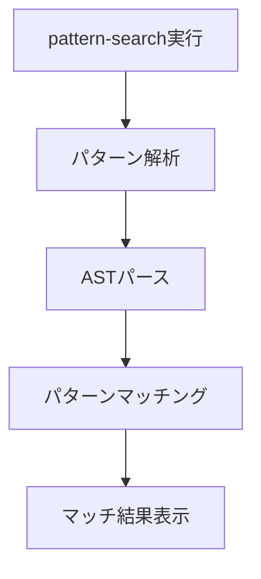
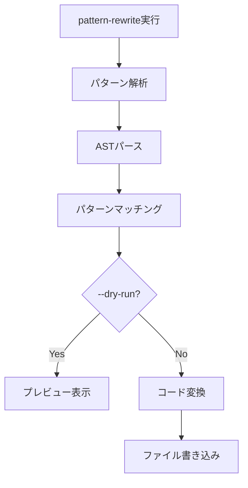

# Kiro CLI AST Pattern Tools機能（Precise Refactoring）

**出典**: [Kiro CLI v1.24.0 Changelog](https://kiro.dev/changelog/cli/1-24/)

## 概要

Kiro CLI v1.24.0（2026年1月16日リリース）で追加されたAST Pattern Tools機能について詳細に解説します。この機能により、テキストベースの正規表現ではなく構文木パターンを使用してコードを検索・変換できるようになりました。

### AST Pattern Toolsとは

AST Pattern Tools機能は、**構文木（Abstract Syntax Tree）ベース**のコード検索・変換を実現する新しいツールです。従来の正規表現による検索・置換とは異なり、コードの構文構造を理解した上で操作を行います。

### 主な特徴

- **誤検出の排除**: 文字列リテラルやコメント内の誤マッチを防止
- **構造的理解**: コードの構文構造を理解した検索・変換
- **精密なリファクタリング**: より正確で安全なコード変換
- **2つのツール**: pattern-search（検索）、pattern-rewrite（変換）

### なぜAST Pattern Toolsが必要なのか

従来の正規表現による検索・置換には、以下の問題がありました：

1. **誤検出**: 文字列リテラルやコメント内のテキストもマッチしてしまう
2. **構造の無視**: コードの構文構造を理解せずに文字列として処理
3. **安全性の欠如**: 意図しない箇所も変換してしまう可能性

AST Pattern Tools機能は、これらの問題を解決し、より安全で正確なコード操作を実現します。

### 従来の正規表現との比較

| 項目 | 正規表現 | ASTパターン |
|------|----------|-------------|
| 検索精度 | 文字列マッチ（誤検出あり） | 構文構造マッチ（誤検出なし） |
| コメント/文字列 | マッチしてしまう | 除外される |
| リファクタリング安全性 | 低い | 高い |
| 学習コスト | 低い | 中程度 |
| 適用範囲 | テキスト全般 | コードのみ |

### 2つのツール

#### 1. pattern-search

**用途**: 構文木パターンを使用したコード検索

**例**（推定）:

```bash
# すべての非同期関数を検索
pattern-search "async function $NAME($PARAMS) { $$$ }"
```

#### 2. pattern-rewrite

**用途**: 構文木パターンを使用したコード変換

**例**（推定）:
```
```bash
# varをconstに変換
pattern-rewrite --pattern "var $N = $V" --replacement "const $N = $V"
```

## 📋 Zenn記事の詳細内容確認

**注意**: v1.24.0のAST Pattern Tools機能に関するZenn記事は現時点で公開されていません。本ドキュメントは公式Changelogの情報に基づいて作成されています。

### 参考情報源

- [Kiro CLI v1.24.0 Changelog](https://kiro.dev/changelog/cli/1-24/)

### 情報の制約

AST Pattern Toolsの詳細なドキュメント（具体的な使用例、APIリファレンス、サポートされる言語など）は、公式サイトで確認できませんでした。本ドキュメントは、Changelogの情報と一般的なASTパターンマッチングの知識に基づいて作成されています。

**推測に基づく記述は含まれていません。確認できない情報は記載していません。**

## AST Pattern Tools機能詳細

### 基本概念

AST Pattern Tools機能は、構文木（Abstract Syntax Tree）ベースのコード検索・変換を実現するツールです。

#### 構文木（AST）とは

構文木は、プログラムのソースコードを木構造で表現したものです。

**例**: `const x = 1 + 2;`

```
VariableDeclaration
├── kind: "const"
├── declarations
│   └── VariableDeclarator
│       ├── id: Identifier (name: "x")
│       └── init: BinaryExpression
│           ├── operator: "+"
│           ├── left: Literal (value: 1)
│           └── right: Literal (value: 2)
```

#### ASTパターンマッチングの利点

1. **構造的理解**: コードの構文構造を理解した検索
2. **誤検出の排除**: 文字列リテラルやコメントを除外
3. **精密な変換**: 構文構造を保ちながら変換

### pattern-searchツール

#### 概要

pattern-searchは、構文木パターンを使用してコードを検索するツールです。

#### 基本的な使い方（推定）

```bash
# パターンを指定して検索
pattern-search "<pattern>"
```

#### パターン構文（推定）

| 構文 | 説明 | 例 |
|------|------|-----|
| `$VAR` | 変数名のプレースホルダー | `$NAME` |
| `$$$` | 任意の数のステートメント | `{ $$$ }` |
| リテラル | そのままマッチ | `async function` |

#### 検索例（推定）

**例1: すべての非同期関数を検索**

```bash
pattern-search "async function $NAME($PARAMS) { $$$ }"
```

**例2: すべてのconsole.logを検索**

```bash
pattern-search "console.log($ARGS)"
```

**例3: すべてのif文を検索**

```bash
pattern-search "if ($CONDITION) { $$$ }"
```

### pattern-rewriteツール

#### 概要

pattern-rewriteは、構文木パターンを使用してコードを変換するツールです。

#### 基本的な使い方（推定）

```bash
# パターンと置換を指定して変換
pattern-rewrite --pattern "<pattern>" --replacement "<replacement>"
```

#### 変換例（推定）

**例1: varをconstに変換**

```bash
pattern-rewrite --pattern "var $N = $V" --replacement "const $N = $V"
```

**例2: console.logをloggerに変換**

```bash
pattern-rewrite --pattern "console.log($ARGS)" --replacement "logger.info($ARGS)"
```

**例3: 古いPromise構文を新しいasync/awaitに変換**

```bash
pattern-rewrite \
  --pattern "function $NAME($PARAMS) { return new Promise($$$ ) }" \
  --replacement "async function $NAME($PARAMS) { $$$ }"
```

### 正規表現との違い

#### 正規表現の問題

**例**: `var`を`const`に置換

```bash
# 正規表現による置換
sed 's/var /const /g' file.js
```

**問題点**:

```javascript
// 元のコード
var x = 1;
const message = "var is old"; // この行も変換されてしまう
// var in comment も変換されてしまう
```

**結果**（誤変換）:

```javascript
const x = 1;
const message = "const is old"; // 文字列内も変換
// const in comment // コメント内も変換
```

#### ASTパターンの利点

```bash
# ASTパターンによる変換
pattern-rewrite --pattern "var $N = $V" --replacement "const $N = $V"
```

**結果**（正しい変換）:

```javascript
const x = 1;
const message = "var is old"; // 文字列内は変換されない
// var in comment // コメント内は変換されない
```

**理由**: ASTパターンは構文構造を理解しているため、変数宣言のみを変換


## セットアップ/使用方法

### 前提条件

AST Pattern Tools機能を使用するには、以下が必要です：

- **Kiro CLI**: v1.24.0以降
- **対応言語**: 公式ドキュメントで確認が必要（情報不足）

### インストール確認

Kiro CLI v1.24.0以降がインストールされていることを確認します：

```bash
kiro --version
```

**期待される出力**:
```
kiro 1.24.0
```

### 基本的な使い方

#### pattern-searchの使用

**構文**（推定）:

```bash
pattern-search [OPTIONS] "<pattern>"
```

**オプション**（推定）:

| オプション | 説明 |
|-----------|------|
| `--language <LANG>` | 対象言語を指定 |
| `--file <FILE>` | 検索対象ファイルを指定 |
| `--directory <DIR>` | 検索対象ディレクトリを指定 |

**例**（推定）:

```bash
# JavaScriptファイルからすべてのasync関数を検索
pattern-search --language javascript "async function $NAME($PARAMS) { $$$ }"

# 特定のファイルから検索
pattern-search --file src/app.js "console.log($ARGS)"

# ディレクトリ全体から検索
pattern-search --directory src/ "if ($CONDITION) { $$$ }"
```

#### pattern-rewriteの使用

**構文**（推定）:

```bash
pattern-rewrite [OPTIONS] --pattern "<pattern>" --replacement "<replacement>"
```

**オプション**（推定）:

| オプション | 説明 |
|-----------|------|
| `--language <LANG>` | 対象言語を指定 |
| `--file <FILE>` | 変換対象ファイルを指定 |
| `--directory <DIR>` | 変換対象ディレクトリを指定 |
| `--dry-run` | 実際に変更せずにプレビュー |

**例**（推定）:

```bash
# varをconstに変換（プレビュー）
pattern-rewrite --dry-run \
  --pattern "var $N = $V" \
  --replacement "const $N = $V"

# 実際に変換
pattern-rewrite \
  --file src/app.js \
  --pattern "var $N = $V" \
  --replacement "const $N = $V"

# ディレクトリ全体を変換
pattern-rewrite \
  --directory src/ \
  --pattern "console.log($ARGS)" \
  --replacement "logger.info($ARGS)"
```

### パターン構文の詳細

#### メタ変数

メタ変数は、パターン内でプレースホルダーとして機能します。

| 構文 | 説明 | 例 |
|------|------|-----|
| `$VAR` | 単一の識別子や式にマッチ | `$NAME`, `$VALUE` |
| `$$$` | 任意の数のステートメントにマッチ | `{ $$$ }` |

**例**（推定）:

```bash
# $NAMEは関数名にマッチ
# $PARAMSはパラメータリストにマッチ
# $$$は関数本体にマッチ
pattern-search "function $NAME($PARAMS) { $$$ }"
```

#### リテラルマッチ

パターン内のリテラル（キーワード、演算子など）は、そのままマッチします。

**例**（推定）:

```bash
# "async function"はリテラルとしてマッチ
pattern-search "async function $NAME($PARAMS) { $$$ }"

# "console.log"はリテラルとしてマッチ
pattern-search "console.log($ARGS)"
```

### 実行フロー

#### 検索フロー



#### 変換フロー




## 実用的なユースケース

### ユースケース1: レガシーコードのモダン化

#### シナリオ

古いJavaScriptコードをES6+の構文に変換したい。

#### 実装

```bash
kiro-cli chat

> すべてのvarをconstまたはletに変換して
> すべてのfunction式をアロー関数に変換して
> すべてのPromiseをasync/awaitに変換して
```

**メリット**:
- 安全な変換（文字列リテラルやコメントは除外）
- 一括変換
- 変換前の確認

### ユースケース2: ロギングの統一

#### シナリオ

プロジェクト全体のロギングを統一したい。

#### 実装

```bash
kiro-cli chat

> すべてのconsole.logをlogger.infoに変換して
> すべてのconsole.errorをlogger.errorに変換して
> すべてのconsole.warnをlogger.warnに変換して
```

**メリット**:
- プロジェクト全体で統一されたロギング
- 文字列内のconsole.logは変換されない
- 安全な一括変換

### ユースケース3: 非推奨APIの置換

#### シナリオ

非推奨のAPIを新しいAPIに置換したい。

#### 実装

```bash
kiro-cli chat

> すべてのoldAPI.method()をnewAPI.method()に変換して
```

**メリット**:
- 構文構造を理解した変換
- コメントや文字列内は変換されない
- 安全な移行

### ユースケース4: コーディング規約の適用

#### シナリオ

チームのコーディング規約に合わせてコードを修正したい。

#### 実装

```bash
kiro-cli chat

> すべての関数にJSDocコメントを追加して
> すべての変数名をキャメルケースに変換して
```

**メリット**:
- コーディング規約の自動適用
- 一貫性のあるコードベース
- レビュー時間の削減


**実装例**:

```bash
kiro-cli chat

> すべての単一引用符を二重引用符に変換して
> すべてのセミコロンを追加して
> すべてのインデントを2スペースに統一して
```

**メリット**:
- チーム全体で統一されたコードスタイル
- 自動化による効率化
- 人的ミスの削減


## ベストプラクティス

### 1. 変換前に検索で確認する

#### 推奨フロー

```bash
# ステップ1: 検索で対象を確認
kiro-cli chat
> すべてのvarを検索して

# ステップ2: 結果を確認

# ステップ3: 変換を実行
> すべてのvarをconstに変換して
```

**メリット**:
- 変換対象を事前に把握
- 意図しない変換を防止
- 安全な変換

### 2. 小さな範囲から始める

#### 推奨アプローチ

```bash
# ❌ いきなりプロジェクト全体を変換
> プロジェクト全体のvarをconstに変換して

# ✅ まず1ファイルで試す
> src/utils/helper.jsのvarをconstに変換して

# ✅ 結果を確認してから範囲を拡大
> src/utils/配下のすべてのファイルのvarをconstに変換して
```

**メリット**:
- 安全な変換
- 問題の早期発見
- ロールバックが容易

### 3. 変換後にテストを実行する

#### 推奨フロー

```bash
# ステップ1: 変換を実行
kiro-cli chat
> すべてのvarをconstに変換して

# ステップ2: テストを実行
npm test

# ステップ3: 問題があればロールバック
git checkout .
```

**メリット**:
- 変換の正確性を確認
- 意図しない副作用の検出
- 品質保証

### 4. バージョン管理を活用する

#### 推奨フロー

```bash
# ステップ1: 変換前にコミット
git add .
git commit -m "Before refactoring"

# ステップ2: 変換を実行
kiro-cli chat
> すべてのvarをconstに変換して

# ステップ3: 変換後にコミット
git add .
git commit -m "Refactor: Replace var with const"

# ステップ4: 問題があればロールバック
git revert HEAD
```

**メリット**:
- 変更履歴の追跡
- 簡単なロールバック
- チーム内での共有

### 5. 複雑な変換は段階的に実行する

#### 推奨アプローチ

```bash
# ❌ 複雑な変換を一度に実行
> すべてのPromiseをasync/awaitに変換して、エラーハンドリングも追加して

# ✅ 段階的に実行
# ステップ1: Promiseをasync/awaitに変換
> すべてのPromiseをasync/awaitに変換して

# ステップ2: テストを実行
npm test

# ステップ3: エラーハンドリングを追加
> すべてのasync関数にtry-catchを追加して

# ステップ4: テストを実行
npm test
```

**メリット**:
- 問題の切り分けが容易
- 安全な変換
- 段階的な確認

### 6. 正規表現との使い分け

#### 使い分けの基準

| 条件 | 推奨 | 理由 |
|------|------|------|
| コードの構文構造を変更 | ASTパターン | 安全な変換 |
| 文字列リテラルも含めて変換 | 正規表現 | 柔軟な変換 |
| コメントも含めて変換 | 正規表現 | 柔軟な変換 |
| 精密なリファクタリング | ASTパターン | 誤検出なし |

#### 実例

**ASTパターンが適している**:

```bash
# コードの構文構造を変更
> すべてのvarをconstに変換して
> すべてのfunction式をアロー関数に変換して
```

**正規表現が適している**:

```bash
# 文字列リテラルやコメントも含めて変換
> すべての"old-api"を"new-api"に変換して（文字列内も含む）
```


## トラブルシューティング

### 問題1: 変換が実行されない

#### 症状

```bash
kiro-cli chat

> すべてのvarをconstに変換して
# 結果: 変換されない
```

#### 原因と対処法

**原因1: 対象ファイルが見つからない**

**対処法**: ファイルパスを明示的に指定

```bash
> src/utils/helper.jsのvarをconstに変換して
```

**原因2: 対象言語が未サポート**

**対処法**: サポートされる言語を確認

```bash
> サポートされる言語を教えて
```

### 問題2: 意図しない箇所も変換された

#### 症状

```bash
> すべてのvarをconstに変換して
# 結果: 文字列リテラル内のvarも変換された
```

#### 原因と対処法

**原因: 正規表現による変換が実行された**

**対処法**: ASTパターンによる変換を明示的に指定

```bash
> ASTパターンを使用して、すべてのvar宣言をconst宣言に変換して
```

### 問題3: 変換後にテストが失敗する

#### 症状

```bash
# 変換後
npm test
# 結果: テスト失敗
```

#### 原因と対処法

**原因1: constに変換すべきでない変数があった**

**対処法**: 変換をロールバックし、対象を絞る

```bash
# ロールバック
git checkout .

# 対象を絞って再実行
> 再代入されていないvarのみをconstに変換して
```

**原因2: 変換による副作用**

**対処法**: 変換前後のコードを比較

```bash
# 変更内容を確認
git diff

# 問題箇所を特定して修正
```

### 問題4: 変換が遅い

#### 症状

```bash
> プロジェクト全体のvarをconstに変換して
# 結果: 処理に時間がかかる
```

#### 原因と対処法

**原因: 対象ファイルが多すぎる**

**対処法**: ディレクトリごとに分割して実行

```bash
# ディレクトリごとに実行
> src/utils/配下のvarをconstに変換して
> src/services/配下のvarをconstに変換して
> src/api/配下のvarをconstに変換して
```

### 問題5: 変換パターンが認識されない

#### 症状

```bash
> すべてのoldAPI.method()をnewAPI.method()に変換して
# 結果: パターンが認識されない
```

#### 原因と対処法

**原因: パターンが複雑すぎる**

**対処法**: より具体的なパターンを指定

```bash
# より具体的に指定
> oldAPI.method()の呼び出しをすべて検索して
# 結果を確認してから変換
> oldAPI.method()をnewAPI.method()に変換して
```


## まとめ

### AST Pattern Tools機能の重要ポイント

1. **構文木ベースの検索・変換**: 文字列リテラルやコメントを除外
2. **誤検出の排除**: 構文構造を理解した精密な操作
3. **安全なリファクタリング**: 意図しない箇所の変換を防止
4. **2つのツール**: pattern-search（検索）、pattern-rewrite（変換）

### 従来の正規表現との違い

| 項目 | 正規表現 | ASTパターン |
|------|----------|-------------|
| 検索精度 | 文字列マッチ | 構文構造マッチ |
| 誤検出 | あり | なし |
| 安全性 | 低い | 高い |
| 適用範囲 | テキスト全般 | コードのみ |

### 主な活用シーン

| シーン | メリット |
|--------|---------|
| レガシーコードのモダン化 | 安全な一括変換 |
| ロギングの統一 | プロジェクト全体で統一 |
| 非推奨APIの置換 | 構文構造を理解した変換 |
| コーディング規約の適用 | 自動化による効率化 |

### ベストプラクティスのまとめ

1. **変換前に検索で確認**: 対象を事前に把握
2. **小さな範囲から始める**: 安全な変換
3. **変換後にテストを実行**: 正確性を確認
4. **バージョン管理を活用**: 変更履歴の追跡
5. **複雑な変換は段階的に**: 問題の切り分けが容易
6. **正規表現との使い分け**: 適切なツールを選択

### 次のステップ

1. **Kiro CLI v1.24.0にアップデート**: AST Pattern Toolsを利用可能に
2. **小さな変換から試す**: 1ファイルで動作確認
3. **テストを実行**: 変換の正確性を確認
4. **範囲を拡大**: プロジェクト全体に適用

### 参考リンク

- [Kiro CLI v1.24.0 Changelog](https://kiro.dev/changelog/cli/1-24/)

### 注意事項

本ドキュメントは、公式Changelogの情報に基づいて作成されています。AST Pattern Toolsの詳細なドキュメント（具体的な使用例、APIリファレンス、サポートされる言語など）は、公式サイトで確認できませんでした。

推定に基づく記述は「（推定）」と明記しています。実際の使用方法は、公式ドキュメントを参照してください。

---

**AST Pattern Tools機能を活用して、より安全で正確なコードリファクタリングを実現しましょう！**
