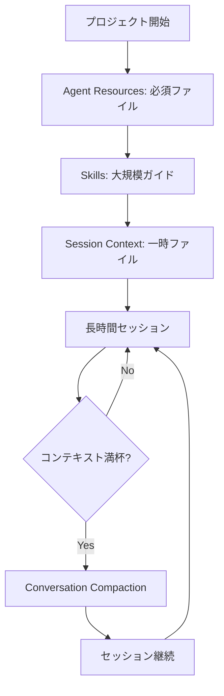

# Kiro CLI Conversation Compaction機能

**出典**: [Kiro CLI v1.24.0 Changelog](https://kiro.dev/changelog/cli/1-24/)

## 概要

Kiro CLI v1.24.0（2026年1月18日リリース）で追加されたConversation Compaction機能について詳細に解説します。この機能により、長時間のセッションをスムーズに継続するため、会話履歴を要約してコンテキストスペースを解放できるようになりました。

### Conversation Compactionとは

Conversation Compaction機能は、**会話履歴の圧縮**を実現する機能です。長時間のセッションでコンテキストウィンドウがいっぱいになった際、会話履歴を要約してコンテキストスペースを解放します。

### 主な特徴

- **手動実行**: `/compact`コマンドで手動実行
- **自動実行**: コンテキストウィンドウがオーバーフローした際に自動トリガー
- **重要情報の保持**: 会話履歴を要約しながら重要な情報を保持
- **新セッション作成**: 圧縮により新しいセッションが作成される
- **元のセッションへの復帰**: `/chat resume`でいつでも元のセッションに戻れる

### なぜConversation Compactionが必要なのか

長時間のセッションでは、以下の問題が発生していました：

1. **コンテキストウィンドウの枯渇**: 会話履歴がコンテキストウィンドウを圧迫
2. **セッションの中断**: コンテキストが満杯になるとセッションを終了する必要があった
3. **情報の喪失**: 新しいセッションを開始すると、以前の会話履歴が失われる

Conversation Compaction機能は、これらの問題を解決し、長時間のセッションを継続できるようにします。

### 動作の仕組み

```mermaid
graph TD
    A[長時間のセッション] --> B{コンテキスト満杯?}
    B -->|No| A
    B -->|Yes| C[自動圧縮トリガー]
    C --> D[会話履歴を要約]
    D --> E[新セッション作成]
    E --> F[要約を新セッションに引き継ぎ]
    F --> G[セッション継続]
    G --> H{元のセッションに戻る?}
    H -->|Yes| I[/chat resume]
    H -->|No| G
```

### 手動実行と自動実行

| 実行方法 | トリガー | 用途 |
|---------|---------|------|
| 手動実行 | `/compact`コマンド | 任意のタイミングで圧縮 |
| 自動実行 | コンテキストウィンドウのオーバーフロー | コンテキスト満杯時に自動圧縮 |


## 📋 Zenn記事の詳細内容確認

**注意**: v1.24.0のConversation Compaction機能に関するZenn記事は現時点で公開されていません。本ドキュメントは公式Changelogおよび公式ドキュメントの情報に基づいて作成されています。

### 参考情報源

- [Kiro CLI v1.24.0 Changelog](https://kiro.dev/changelog/cli/1-24/)
- [Context Management - Conversation Compaction](https://kiro.dev/docs/cli/chat/context/#conversation-compaction)

## Conversation Compaction機能詳細

### 基本概念

Conversation Compaction機能は、会話履歴を要約してコンテキストスペースを解放する機能です。

#### 圧縮の仕組み

1. **会話履歴の分析**: 現在の会話履歴を分析
2. **重要情報の抽出**: 重要な情報を抽出
3. **要約の生成**: 会話履歴を要約
4. **新セッションの作成**: 要約を含む新しいセッションを作成
5. **元のセッションの保持**: 元のセッションは保持され、いつでも復帰可能

#### 保持される情報

| 情報 | 保持 | 説明 |
|------|------|------|
| 重要な決定事項 | ✅ | プロジェクトの方針、設計決定など |
| コンテキスト情報 | ✅ | プロジェクト構造、技術スタックなど |
| 最近のメッセージ | ✅ | 設定で指定した数のメッセージペア |
| 詳細な会話履歴 | ❌ | 要約に置き換えられる |

### 手動実行

#### `/compact`コマンド

```bash
# 会話を手動で圧縮
/compact
```

**実行タイミング**:
- コンテキストウィンドウが80%以上使用されている時
- 長時間のセッションで会話履歴が多い時
- 新しいトピックに移る前

**実行結果**:

```
Compacting conversation...

Summary:
- Discussed project architecture
- Decided to use TypeScript and React
- Implemented authentication module
- Fixed 3 bugs in user service

New session created with summary.
Previous session saved. Use /chat resume to return.
```

### 自動実行

#### トリガー条件

自動実行は、以下の条件で自動的にトリガーされます：

- コンテキストウィンドウがオーバーフローした時
- コンテキストウィンドウの使用率が設定値を超えた時

#### 自動実行の動作

```
[System] Context window is full. Compacting conversation...

Summary:
- ...

New session created. Continuing conversation...
```

### 設定

#### 設定項目

| 設定項目 | デフォルト値 | 説明 |
|---------|-------------|------|
| `compaction.excludeMessages` | 2 | 保持する最小メッセージペア数 |
| `compaction.excludeContextWindowPercent` | 2 | 保持する最小コンテキストウィンドウ割合（%） |

**注意**: 両方の設定が評価され、より保守的な（大きい）値が採用されます。

#### 設定方法

**グローバル設定**:

```json
{
  "compaction": {
    "excludeMessages": 3,
    "excludeContextWindowPercent": 5
  }
}
```

**Agent設定**:

```json
{
  "compaction": {
    "excludeMessages": 5,
    "excludeContextWindowPercent": 10
  }
}
```


**コマンドラインでの設定**:

```bash
# 保持するメッセージペア数を変更
kiro-cli settings compaction.excludeMessages 5

# 保持するコンテキストウィンドウ割合を変更
kiro-cli settings compaction.excludeContextWindowPercent 5

# 設定確認
kiro-cli settings compaction.excludeMessages
kiro-cli settings compaction.excludeContextWindowPercent
```

**Agent設定ファイルでの指定**:

```json
{
  "name": "my-agent",
  "description": "My custom agent",
  "settings": {
    "compaction": {
      "excludeMessages": 5,
      "excludeContextWindowPercent": 5
    }
  }
}
```

### 元のセッションへの復帰

#### `/chat resume`コマンド

```bash
# 元のセッションに復帰
/chat resume
```

**実行結果**:

```
Resuming previous session...

Session restored. You can continue from where you left off.
```

**注意**: 元のセッションに復帰すると、圧縮後の新セッションは保存されます。


### コンテキスト管理との関連

Conversation Compaction機能は、Kiro CLIの4つのコンテキスト管理アプローチと組み合わせて使用します。

| アプローチ | コンテキスト消費 | 永続性 | 最適な用途 |
|-----------|----------------|--------|-----------|
| **Agent Resources** | 常時消費 | セッション間で永続 | 必須プロジェクトファイル、標準、設定 |
| **Skills** | オンデマンド | セッション間で永続 | 大規模ガイド、リファレンスドキュメント |
| **Session Context** | 常時消費 | 現在のセッションのみ | 一時ファイル、クイック実験 |
| **Knowledge Bases** | 検索時のみ | セッション間で永続 | 大規模コードベース、広範なドキュメント |
| **Conversation Compaction** | 会話履歴の圧縮 | セッション継続 | 長時間セッションの継続 |

#### 統合的なコンテキスト戦略



### 設定の詳細

#### excludeMessagesとexcludeContextWindowPercentの関係

両方の設定が評価され、より保守的な（大きい）値が採用されます。

**例1**: excludeMessages=2, excludeContextWindowPercent=2

```
メッセージペア数: 50
コンテキストウィンドウ: 100,000トークン
1メッセージペアあたり: 2,000トークン

excludeMessages=2 → 4,000トークン保持（2ペア × 2,000トークン）
excludeContextWindowPercent=2 → 2,000トークン保持（100,000 × 2%）

採用される値: 4,000トークン（より保守的）
```

**例2**: excludeMessages=2, excludeContextWindowPercent=10

```
メッセージペア数: 50
コンテキストウィンドウ: 100,000トークン
1メッセージペアあたり: 2,000トークン

excludeMessages=2 → 4,000トークン保持
excludeContextWindowPercent=10 → 10,000トークン保持（100,000 × 10%）

採用される値: 10,000トークン（より保守的）
```

#### 推奨設定値

| 用途 | excludeMessages | excludeContextWindowPercent | 理由 |
|------|----------------|---------------------------|------|
| 短期セッション | 2 | 2 | デフォルト値で十分 |
| 中期セッション | 5 | 5 | より多くの履歴を保持 |
| 長期セッション | 10 | 10 | 最大限の履歴を保持 |
| ペアプログラミング | 10 | 10 | 会話の流れを保持 |

## セットアップ/使用方法

### 1. 前提条件

Conversation Compaction機能は、Kiro CLI v1.24.0以降で利用可能です。

#### バージョン確認

```bash
# Kiro CLIのバージョン確認
kiro-cli --version

# v1.24.0以降であることを確認
```

### 2. 基本的な使用方法

#### 手動圧縮の実行

```bash
# Kiro CLIを起動
kiro-cli chat

# 長時間のセッション後
> /compact
```

**実行結果**:

```
Compacting conversation...

Summary:
- Discussed project architecture (TypeScript + React)
- Implemented authentication module
- Fixed 3 bugs in user service
- Added unit tests for API endpoints

New session created with summary.
Previous session saved. Use /chat resume to return.

You can continue the conversation from here.
```

#### 元のセッションへの復帰

```bash
# 新セッションで作業中
> /chat resume
```

**実行結果**:

```
Resuming previous session...

Session restored. You are now in the original session.
All conversation history is available.
```

### 3. 設定のカスタマイズ

#### グローバル設定

```bash
# 保持するメッセージペア数を変更
kiro-cli settings compaction.excludeMessages 5

# 保持するコンテキストウィンドウ割合を変更
kiro-cli settings compaction.excludeContextWindowPercent 5
```


**設定例**:

```bash
# 保持するメッセージペア数を5に変更
kiro-cli settings compaction.excludeMessages 5

# 保持するコンテキストウィンドウ割合を5%に変更
kiro-cli settings compaction.excludeContextWindowPercent 5

# 設定確認
kiro-cli settings compaction.excludeMessages
# 出力: 5

kiro-cli settings compaction.excludeContextWindowPercent
# 出力: 5
```

#### Agent設定ファイル

```json
{
  "name": "long-session-agent",
  "description": "Agent for long sessions",
  "settings": {
    "compaction": {
      "excludeMessages": 10,
      "excludeContextWindowPercent": 10
    }
  }
}
```

**使用例**:

```bash
# カスタムエージェントで起動
kiro-cli chat --agent long-session-agent

# このエージェントでは10メッセージペアまたは10%のコンテキストが保持される
```

### 4. 自動圧縮の動作確認

#### コンテキスト使用状況の確認

```bash
kiro-cli chat

> コンテキストウィンドウの使用状況を教えて
```

**出力例**（推定）:

```
Context Window Usage:
- Total: 100,000 tokens
- Used: 85,000 tokens (85%)
- Available: 15,000 tokens (15%)

Conversation will be automatically compacted when usage reaches 100%.
```

#### 自動圧縮のトリガー

```bash
# 長時間のセッションを継続
> （多数の質問と回答）

# コンテキストが満杯になると自動圧縮
[System] Context window is full. Compacting conversation...

Summary:
- ...

New session created. Continuing conversation...
```

### 5. 複数セッションの管理

#### セッション一覧の確認

```bash
> /chat list
```

**出力例**（推定）:

```
Available sessions:
1. Current session (compacted from session 2)
2. Previous session (original)
3. Session from 2026-01-17

Use /chat resume <number> to switch sessions.
```

#### 特定のセッションへの切り替え

```bash
> /chat resume 2
```

**実行結果**:

```
Resuming session 2...

Session restored.
```

## 実用的なユースケース

### ユースケース1: 長時間のペアプログラミング

#### シナリオ

複数時間にわたるペアプログラミングセッションで、会話履歴を保ちながら作業を継続したい。

#### 実装

**Agent設定ファイル**:

```json
{
  "name": "pair-programming-agent",
  "settings": {
    "compaction": {
      "excludeMessages": 10,
      "excludeContextWindowPercent": 10
    }
  }
}
```

**使用方法**:

```bash
# ペアプログラミング用エージェントで起動
kiro-cli chat --agent pair-programming-agent

# 長時間のセッション
> （多数の質問と回答）

# コンテキストが満杯になったら自動圧縮
[System] Context window is full. Compacting conversation...

# セッション継続
> （作業を継続）
```

**メリット**:
- 会話の流れを保ちながら長時間作業可能
- 重要な決定事項が要約に保持される
- 元のセッションにいつでも復帰可能


### ユースケース2: 大規模リファクタリング

#### シナリオ

大規模なリファクタリング作業で、多数のファイルを変更しながら作業を継続したい。

#### 実装

```bash
kiro-cli chat

# リファクタリング開始
> プロジェクト全体のvarをconstに変換して

# 多数のファイルを変更
> （変更を継続）

# コンテキストが80%を超えたら手動圧縮
> /compact

# 作業を継続
> （リファクタリングを継続）
```

**メリット**:
- 大規模な変更を中断せずに実行
- 変更履歴は要約に保持
- 必要に応じて元のセッションに復帰可能

### ユースケース3: 複雑な問題のデバッグ

#### シナリオ

複雑なバグのデバッグで、多数の仮説を検証しながら作業を継続したい。

#### 実装

```bash
kiro-cli chat

# デバッグ開始
> ユーザー認証が失敗する問題を調査して

# 多数の仮説を検証
> （ログ確認、コード確認、テスト実行）

# コンテキストが満杯になると自動圧縮
[System] Compacting conversation...

Summary:
- Investigated authentication failure
- Checked logs: Found JWT token expiration issue
- Verified code: Token refresh logic is missing
- Next step: Implement token refresh

# デバッグを継続
> トークンリフレッシュロジックを実装して
```

**メリット**:
- 長時間のデバッグセッションを継続
- 調査結果は要約に保持
- 次のステップが明確

### ユースケース4: 学習セッション

#### シナリオ

新しい技術を学習する際、多数の質問をしながら学習を継続したい。

#### 実装

```bash
kiro-cli chat

# 学習開始
> TypeScriptの高度な型システムについて教えて

# 多数の質問
> （ジェネリクス、ユニオン型、インターセクション型など）

# コンテキストが満杯になると自動圧縮
[System] Compacting conversation...

Summary:
- Learned about TypeScript advanced types
- Generics: Type parameters for reusable code
- Union types: Multiple possible types
- Intersection types: Combining multiple types
- Next: Practice with real examples

# 学習を継続
> 実際のコード例で練習したい
```

**メリット**:
- 長時間の学習セッションを継続
- 学習内容は要約に保持
- 段階的な学習が可能


## ベストプラクティス

### 1. 適切なタイミングで手動圧縮を実行する

#### 推奨タイミング

| タイミング | 理由 |
|-----------|------|
| コンテキスト使用率80%以上 | 自動圧縮前に手動で実行 |
| 新しいトピックに移る前 | 前のトピックを要約 |
| 重要な決定後 | 決定事項を要約に保持 |
| 長時間セッションの区切り | セッションを整理 |

#### 実装例

```bash
kiro-cli chat

# コンテキスト使用状況を確認
> コンテキストウィンドウの使用状況を教えて
# 出力: 85% used

# 手動圧縮を実行
> /compact
```

### 2. 設定値を用途に合わせて調整する

#### 用途別の推奨設定

| 用途 | excludeMessages | excludeContextWindowPercent |
|------|----------------|---------------------------|
| 短期タスク（< 1時間） | 2 | 2 |
| 中期タスク（1-3時間） | 5 | 5 |
| 長期タスク（> 3時間） | 10 | 10 |
| ペアプログラミング | 10 | 10 |
| 学習セッション | 5 | 5 |

#### 実装例

```json
{
  "name": "long-task-agent",
  "settings": {
    "compaction": {
      "excludeMessages": 10,
      "excludeContextWindowPercent": 10
    }
  }
}
```

### 3. 重要な情報は明示的に記録する

#### 推奨方法

```bash
kiro-cli chat

# 重要な決定を明示的に記録
> 重要な決定: TypeScriptとReactを使用することに決定

# 圧縮時に要約に含まれやすくなる
> /compact
```

**メリット**:
- 重要な情報が要約に確実に含まれる
- 後で振り返りやすい

### 4. 元のセッションを定期的に確認する

#### 推奨フロー

```bash
# 新セッションで作業中
> /chat resume

# 元のセッションで詳細を確認
> （詳細な会話履歴を確認）

# 新セッションに戻る
> /chat resume
```

**メリット**:
- 詳細な会話履歴を確認可能
- 要約で失われた情報を取得

### 5. コンテキスト管理戦略と組み合わせる

#### 統合的なアプローチ

```json
{
  "name": "optimized-agent",
  "resources": [
    "file://.kiro/project-config.md",
    "skill://.kiro/skills/**/*.md"
  ],
  "settings": {
    "compaction": {
      "excludeMessages": 5,
      "excludeContextWindowPercent": 5
    }
  }
}
```

**戦略**:
1. **Agent Resources**: 必須ファイル（常時ロード）
2. **Skills**: 大規模ガイド（オンデマンドロード）
3. **Conversation Compaction**: 会話履歴の圧縮

**メリット**:
- コンテキストウィンドウの最適化
- 長時間セッションの継続
- 必要な情報への即座のアクセス

### 6. 圧縮前に重要な成果物を保存する

#### 推奨フロー

```bash
kiro-cli chat

# 重要な成果物を生成
> プロジェクトの設計書を作成して

# ファイルに保存
> これをdocs/design.mdに保存して

# 圧縮を実行
> /compact
```

**メリット**:
- 重要な成果物が失われない
- ファイルとして永続化


## トラブルシューティング

### 問題1: 圧縮後に重要な情報が失われた

#### 症状

```bash
> /compact

# 圧縮後
> 先ほど決定した技術スタックは？
# 結果: 要約に含まれていない
```

#### 原因と対処法

**原因: 重要な情報が要約に含まれなかった**

**対処法1**: 元のセッションに復帰

```bash
> /chat resume

# 元のセッションで情報を確認
> 技術スタックの決定事項を教えて
```

**対処法2**: 重要な情報を明示的に記録

```bash
# 次回から重要な情報を明示的に記録
> 重要な決定: TypeScriptとReactを使用
```

### 問題2: 自動圧縮が頻繁に発生する

#### 症状

```bash
# 短時間で自動圧縮が発生
[System] Compacting conversation...
```

#### 原因と対処法

**原因: コンテキストウィンドウの消費が大きい**

**対処法1**: Agent Resourcesを見直す

```bash
# 大きなファイルをSkillsに移行
# Before
{
  "resources": [
    "file://.kiro/large-guide.md"  # 50KB
  ]
}

# After
{
  "resources": [
    "skill://.kiro/skills/large-guide.md"  # オンデマンドロード
  ]
}
```

**対処法2**: 設定値を調整

```bash
# 保持するメッセージ数を減らす
kiro-cli settings compaction.excludeMessages 1
kiro-cli settings compaction.excludeContextWindowPercent 1
```

### 問題3: 元のセッションに復帰できない

#### 症状

```bash
> /chat resume
# エラー: No previous session found
```

#### 原因と対処法

**原因: セッションが削除された**

**対処法**: セッション一覧を確認

```bash
> /chat list

# 利用可能なセッションを確認
# 特定のセッションに切り替え
> /chat resume <number>
```

### 問題4: 圧縮が遅い

#### 症状

```bash
> /compact
# 処理に時間がかかる
```

#### 原因と対処法

**原因: 会話履歴が非常に多い**

**対処法**: 定期的に圧縮を実行

```bash
# コンテキスト使用率が80%を超えたら圧縮
> コンテキストウィンドウの使用状況を教えて
# 出力: 85% used

> /compact
```

### 問題5: 圧縮後のセッションが混乱する

#### 症状

```bash
> /compact

# 圧縮後
> （会話の流れが分からなくなる）
```

#### 原因と対処法

**原因: 要約が不十分**

**対処法**: 設定値を増やす

```bash
# 保持するメッセージ数を増やす
kiro-cli settings compaction.excludeMessages 10
kiro-cli settings compaction.excludeContextWindowPercent 10
```


## まとめ

### Conversation Compaction機能の重要ポイント

1. **会話履歴の圧縮**: コンテキストスペースを解放
2. **手動・自動実行**: `/compact`コマンドまたは自動トリガー
3. **重要情報の保持**: 要約に重要な情報を保持
4. **元のセッションへの復帰**: `/chat resume`でいつでも復帰可能

### 主な活用シーン

| シーン | メリット |
|--------|---------|
| 長時間のペアプログラミング | セッションを中断せずに継続 |
| 大規模リファクタリング | 変更履歴を保持しながら作業 |
| 複雑な問題のデバッグ | 調査結果を要約に保持 |
| 学習セッション | 学習内容を要約に保持 |

### 設定のまとめ

| 設定項目 | デフォルト値 | 推奨値（長期セッション） |
|---------|-------------|---------------------|
| `compaction.excludeMessages` | 2 | 10 |
| `compaction.excludeContextWindowPercent` | 2 | 10 |

### コンテキスト管理戦略

Conversation Compaction機能は、以下の4つのアプローチと組み合わせて使用します：

1. **Agent Resources**: 必須ファイル（常時ロード）
2. **Skills**: 大規模ガイド（オンデマンドロード）
3. **Session Context**: 一時ファイル
4. **Knowledge Bases**: 大規模コードベース
5. **Conversation Compaction**: 会話履歴の圧縮

### ベストプラクティスのまとめ

1. **適切なタイミングで手動圧縮**: コンテキスト使用率80%以上
2. **設定値を用途に合わせて調整**: 長期セッションは10/10
3. **重要な情報は明示的に記録**: 要約に確実に含める
4. **元のセッションを定期的に確認**: 詳細な会話履歴を確認
5. **コンテキスト管理戦略と組み合わせる**: 統合的なアプローチ
6. **圧縮前に重要な成果物を保存**: ファイルとして永続化

### 次のステップ

1. **Kiro CLI v1.24.0にアップデート**: Conversation Compaction機能を利用可能に
2. **設定をカスタマイズ**: 用途に合わせて設定値を調整
3. **手動圧縮を試す**: `/compact`コマンドで動作確認
4. **長時間セッションで活用**: 実際のプロジェクトで使用

### 参考リンク

- [Kiro CLI v1.24.0 Changelog](https://kiro.dev/changelog/cli/1-24/)
- [Context Management - Conversation Compaction](https://kiro.dev/docs/cli/chat/context/#conversation-compaction)

---

**Conversation Compaction機能を活用して、長時間のセッションをスムーズに継続しましょう！**
