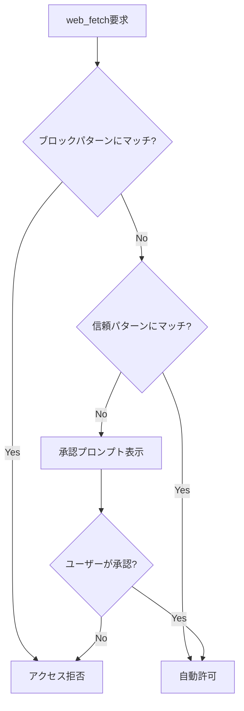

# Kiro CLI Granular URL Permissions機能

**出典**: [Kiro CLI v1.24.0 Changelog](https://kiro.dev/changelog/cli/1-24/)

## 概要

Kiro CLI v1.24.0（2026年1月16日リリース）で追加されたGranular URL Permissions機能について詳細に解説します。この機能により、エージェント設定を通じて、エージェントがアクセスできるURLを細かく制御できるようになりました。

### Granular URL Permissionsとは

Granular URL Permissions機能は、**web_fetchツールのURL権限を細粒度で制御**する機能です。正規表現パターンを使用して、信頼できるドメインを自動許可したり、特定サイトをブロックしたりできます。

### 主な特徴

- **正規表現パターン**: 信頼できるドメインを自動許可、特定サイトをブロック
- **優先順位**: ブロックパターンが信頼パターンより優先
- **承認プロンプト**: 信頼パターンにマッチしないURLは承認プロンプトを表示
- **Agent設定での指定**: プロジェクトごとに異なる権限設定が可能

### なぜGranular URL Permissionsが必要なのか

従来のweb_fetchツールでは、以下の問題がありました：

1. **すべてのURLで承認プロンプト**: 信頼できるドメインでも毎回承認が必要
2. **セキュリティリスク**: 不正なURLへのアクセスを防止できない
3. **効率の低下**: 頻繁な承認プロンプトで作業が中断

Granular URL Permissions機能は、これらの問題を解決し、セキュリティと効率を両立します。

### web_fetchツールとは

web_fetchツールは、Kiro CLIの組み込みツールで、指定されたURLからコンテンツを取得します。

**用途**:
- 公式ドキュメントの参照
- GitHubリポジトリの確認
- APIドキュメントの取得

### 権限制御の仕組み




### 3つのパターン

| パターン | 動作 | 用途 |
|---------|------|------|
| **信頼パターン** | 自動許可 | 公式ドキュメント、社内サイト |
| **ブロックパターン** | 自動拒否 | 不正サイト、禁止ドメイン |
| **未マッチ** | 承認プロンプト | その他のURL |

## 📋 Zenn記事の詳細内容確認

**注意**: v1.24.0のGranular URL Permissions機能に関するZenn記事は現時点で公開されていません。本ドキュメントは公式Changelogおよび公式ドキュメントの情報に基づいて作成されています。

### 参考情報源

- [Kiro CLI v1.24.0 Changelog](https://kiro.dev/changelog/cli/1-24/)
- [Built-in Tools - Web Search and Fetch](https://kiro.dev/docs/cli/reference/built-in-tools/#web-search-and-fetch)

## Granular URL Permissions機能詳細

### 基本概念

Granular URL Permissions機能は、web_fetchツールのURL権限を細粒度で制御する機能です。

#### 権限制御の3つのレベル

1. **信頼パターン（trusted）**: 自動許可
2. **ブロックパターン（blocked）**: 自動拒否
3. **未マッチ**: 承認プロンプト

#### 優先順位

```
ブロックパターン > 信頼パターン > 未マッチ
```

**重要**: ブロックパターンが信頼パターンより優先されます。

**例**:

```json
{
  "toolsSettings": {
    "web_fetch": {
      "trusted": [
        "^https://docs\\.aws\\.amazon\\.com/.*"
      ],
      "blocked": [
        "^https://docs\\.aws\\.amazon\\.com/marketplace/.*"
      ]
    }
  }
}
```

**動作**:
- `https://docs.aws.amazon.com/lambda/` → 自動許可（信頼パターン）
- `https://docs.aws.amazon.com/marketplace/` → 自動拒否（ブロックパターン優先）
- `https://example.com/` → 承認プロンプト（未マッチ）

### 正規表現パターンの構文

#### 基本構文

| 構文 | 説明 | 例 |
|------|------|-----|
| `^` | 文字列の開始 | `^https://` |
| `$` | 文字列の終了 | `\.com$` |
| `\.` | ドット（エスケープ） | `example\.com` |
| `.*` | 任意の文字列 | `https://.*\.com` |
| `\|` | OR | `\.com\|\.org` |
| `[...]` | 文字クラス | `[a-z]` |

#### パターン例

**例1: 特定ドメインを許可**

```json
"trusted": [
  "^https://docs\\.aws\\.amazon\\.com/.*"
]
```

**マッチ**:
- `https://docs.aws.amazon.com/lambda/`
- `https://docs.aws.amazon.com/s3/`

**非マッチ**:
- `http://docs.aws.amazon.com/` （httpはマッチしない）
- `https://aws.amazon.com/` （docs.がない）


**例2: 複数ドメインを許可**

```json
"trusted": [
  "^https://(docs\\.aws\\.amazon\\.com|github\\.com)/.*"
]
```

**マッチ**:
- `https://docs.aws.amazon.com/lambda/`
- `https://github.com/aws/`

**例3: サブドメインを含めて許可**

```json
"trusted": [
  "^https://.*\\.example\\.com/.*"
]
```

**マッチ**:
- `https://api.example.com/`
- `https://docs.example.com/`
- `https://www.example.com/`

**例4: 特定パスをブロック**

```json
"blocked": [
  "^https://.*\\.example\\.com/admin/.*"
]
```

**マッチ（ブロック）**:
- `https://api.example.com/admin/`
- `https://www.example.com/admin/users`

### Agent設定での指定

#### 基本設定

```json
{
  "name": "my-agent",
  "description": "My custom agent",
  "toolsSettings": {
    "web_fetch": {
      "trusted": [
        "^https://docs\\.aws\\.amazon\\.com/.*",
        "^https://github\\.com/.*"
      ],
      "blocked": [
        "^https://.*\\.example\\.com/.*"
      ]
    }
  }
}
```

#### 設定項目

| 項目 | 型 | 必須 | 説明 |
|------|-----|------|------|
| `trusted` | 配列 | No | 信頼するURLパターン（正規表現） |
| `blocked` | 配列 | No | ブロックするURLパターン（正規表現） |


### セキュリティ上の利点

#### 1. データ漏洩防止

不正なURLへのアクセスを防止し、機密情報の漏洩を防ぎます。

**例**:

```json
{
  "blocked": [
    "^https://malicious-site\\.com/.*",
    "^https://.*\\.suspicious\\.com/.*"
  ]
}
```

#### 2. コンプライアンス

組織のセキュリティポリシーに準拠したURL制御が可能です。

**例**:

```json
{
  "trusted": [
    "^https://docs\\.company\\.com/.*",
    "^https://internal\\.company\\.com/.*"
  ],
  "blocked": [
    "^https://.*(?!company\\.com).*"
  ]
}
```

#### 3. 監査

アクセス可能なURLを明示的に管理し、監査証跡を残します。

### 承認プロンプトの動作

#### 信頼パターンにマッチしない場合

```bash
kiro-cli chat

> https://example.com/docs を参照して

# 承認プロンプト表示
[web_fetch] Request to access: https://example.com/docs
Allow access? (y/n):
```

**ユーザーの選択**:
- `y`: アクセスを許可
- `n`: アクセスを拒否

#### ブロックパターンにマッチした場合

```bash
kiro-cli chat

> https://blocked-site.com/ を参照して

# 自動拒否
[web_fetch] Access denied: URL matches blocked pattern
```

## セットアップ/使用方法

### 1. Agent設定ファイルの作成

#### ステップ1: Agent設定ファイルを作成

```bash
# .kiro/agents/my-agent.json
cat > .kiro/agents/my-agent.json << 'EOF'
{
  "name": "my-agent",
  "description": "Agent with URL permissions",
  "toolsSettings": {
    "web_fetch": {
      "trusted": [
        "^https://docs\\.aws\\.amazon\\.com/.*",
        "^https://github\\.com/.*"
      ],
      "blocked": [
        "^https://.*\\.example\\.com/.*"
      ]
    }
  }
}
EOF
```

#### ステップ2: Agent設定を確認

```bash
# 設定ファイルの内容を確認
cat .kiro/agents/my-agent.json
```

### 2. Agentの使用

#### 起動

```bash
# カスタムエージェントで起動
kiro-cli chat --agent my-agent
```

#### 信頼パターンのテスト

```bash
kiro-cli chat --agent my-agent

> https://docs.aws.amazon.com/lambda/ を参照して

# 自動許可（承認プロンプトなし）
[web_fetch] Accessing: https://docs.aws.amazon.com/lambda/
```

#### ブロックパターンのテスト

```bash
kiro-cli chat --agent my-agent

> https://blocked.example.com/ を参照して

# 自動拒否
[web_fetch] Access denied: URL matches blocked pattern
```


#### 未マッチのテスト

```bash
kiro-cli chat --agent my-agent

> https://other-site.com/ を参照して

# 承認プロンプト表示
[web_fetch] Request to access: https://other-site.com/
Allow access? (y/n): y

# アクセス許可
[web_fetch] Accessing: https://other-site.com/
```

### 3. パターンのカスタマイズ

#### AWS公式ドキュメントのみ許可

```json
{
  "toolsSettings": {
    "web_fetch": {
      "trusted": [
        "^https://docs\\.aws\\.amazon\\.com/.*",
        "^https://aws\\.amazon\\.com/.*"
      ]
    }
  }
}
```

#### GitHub + AWS公式ドキュメントを許可

```json
{
  "toolsSettings": {
    "web_fetch": {
      "trusted": [
        "^https://docs\\.aws\\.amazon\\.com/.*",
        "^https://github\\.com/.*",
        "^https://raw\\.githubusercontent\\.com/.*"
      ]
    }
  }
}
```

#### 社内ドメインのみ許可

```json
{
  "toolsSettings": {
    "web_fetch": {
      "trusted": [
        "^https://.*\\.company\\.com/.*"
      ],
      "blocked": [
        "^https://(?!.*\\.company\\.com).*"
      ]
    }
  }
}
```

### 4. パターンのテスト

#### 正規表現のテスト

```bash
# Pythonで正規表現をテスト
python3 << 'EOF'
import re

pattern = r"^https://docs\.aws\.amazon\.com/.*"
urls = [
    "https://docs.aws.amazon.com/lambda/",
    "https://aws.amazon.com/",
    "http://docs.aws.amazon.com/"
]

for url in urls:
    if re.match(pattern, url):
        print(f"✅ {url}")
    else:
        print(f"❌ {url}")
EOF
```

**出力**:

```
✅ https://docs.aws.amazon.com/lambda/
❌ https://aws.amazon.com/
❌ http://docs.aws.amazon.com/
```

### 5. グローバル設定とAgent設定の優先順位

| 設定レベル | 優先順位 | 設定方法 |
|-----------|---------|---------|
| Agent設定 | 高 | `.kiro/agents/my-agent.json` |
| グローバル設定 | 低 | （現在未サポート） |

**注意**: 現在、URL権限はAgent設定でのみ指定可能です。

## 実用的なユースケース

### ユースケース1: AWS開発プロジェクト

#### シナリオ

AWS開発プロジェクトで、AWS公式ドキュメントとGitHubのみアクセスを許可したい。

#### 実装

**Agent設定**:

```json
{
  "name": "aws-dev-agent",
  "description": "Agent for AWS development",
  "toolsSettings": {
    "web_fetch": {
      "trusted": [
        "^https://docs\\.aws\\.amazon\\.com/.*",
        "^https://aws\\.amazon\\.com/.*",
        "^https://github\\.com/.*",
        "^https://raw\\.githubusercontent\\.com/.*"
      ]
    }
  }
}
```

**使用例**:

```bash
kiro-cli chat --agent aws-dev-agent

> Lambda関数の作成方法を教えて
# AWS公式ドキュメントを自動参照（承認プロンプトなし）

> GitHubのサンプルコードを参照して
# GitHubを自動参照（承認プロンプトなし）
```

**メリット**:
- AWS公式ドキュメントへの迅速なアクセス
- GitHubサンプルコードの参照が容易
- 不正サイトへのアクセスを防止


### ユースケース2: エンタープライズ環境

#### シナリオ

社内ドキュメントのみアクセスを許可し、外部サイトはすべてブロックしたい。

#### 実装

```json
{
  "name": "enterprise-agent",
  "description": "Enterprise agent with strict URL control",
  "toolsSettings": {
    "web_fetch": {
      "trusted": [
        "^https://docs\\.company\\.com/.*",
        "^https://wiki\\.company\\.com/.*",
        "^https://internal\\.company\\.com/.*"
      ],
      "blocked": [
        "^https://(?!.*\\.company\\.com).*",
        "^http://.*"
      ]
    }
  }
}
```

**メリット**:
- 社内ドキュメントへの自動アクセス
- 外部サイトへのアクセスを完全ブロック
- セキュリティポリシーへの準拠

### ユースケース3: オープンソースプロジェクト

#### シナリオ

オープンソースプロジェクトで、GitHub、公式ドキュメント、パッケージレジストリへのアクセスを許可したい。

#### 実装

```json
{
  "name": "opensource-agent",
  "description": "Open source development agent",
  "toolsSettings": {
    "web_fetch": {
      "trusted": [
        "^https://github\\.com/.*",
        "^https://raw\\.githubusercontent\\.com/.*",
        "^https://docs\\..*",
        "^https://registry\\.npmjs\\.org/.*",
        "^https://pypi\\.org/.*",
        "^https://crates\\.io/.*"
      ]
    }
  }
}
```

**メリット**:
- GitHubへの自動アクセス
- 各言語の公式ドキュメントへの自動アクセス
- パッケージレジストリへの自動アクセス

### ユースケース4: セキュリティ重視プロジェクト

#### シナリオ

特定の信頼できるドメインのみ許可し、既知の不正サイトをブロックしたい。

#### 実装

```json
{
  "name": "secure-agent",
  "description": "Security-focused agent",
  "toolsSettings": {
    "web_fetch": {
      "trusted": [
        "^https://docs\\.aws\\.amazon\\.com/.*",
        "^https://github\\.com/.*"
      ],
      "blocked": [
        "^https://malicious-site\\.com/.*",
        "^https://.*\\.suspicious\\.com/.*",
        "^http://.*"
      ]
    }
  }
}
```

**メリット**:
- 信頼できるドメインへの自動アクセス
- 既知の不正サイトを自動ブロック
- HTTPサイトを自動ブロック（HTTPS強制）


## ベストプラクティス

### 1. 最小権限の原則を適用する

#### 推奨アプローチ

必要最小限のドメインのみを信頼パターンに追加します。

**❌ 悪い例**:

```json
{
  "trusted": [
    "^https://.*"  // すべてのHTTPSサイトを許可
  ]
}
```

**✅ 良い例**:

```json
{
  "trusted": [
    "^https://docs\\.aws\\.amazon\\.com/.*",
    "^https://github\\.com/aws/.*"
  ]
}
```

### 2. ブロックパターンを積極的に使用する

#### 推奨アプローチ

既知の不正サイトや禁止ドメインをブロックパターンに追加します。

```json
{
  "blocked": [
    "^http://.*",  // HTTPサイトをブロック
    "^https://.*\\.suspicious\\.com/.*",  // 不正ドメインをブロック
    "^https://.*\\.example\\.com/admin/.*"  // 管理画面をブロック
  ]
}
```

### 3. 正規表現パターンを正確に記述する

#### 注意点

| 誤り | 正しい | 説明 |
|------|--------|------|
| `https://example.com` | `^https://example\\.com/.*` | ドットをエスケープ、開始・終了を明示 |
| `.*example.com.*` | `^https://.*\\.example\\.com/.*` | プロトコルを明示 |
| `example.com` | `^https://example\\.com/.*` | プロトコルと開始を明示 |

#### テスト方法

```bash
# Pythonで正規表現をテスト
python3 << 'EOF'
import re

pattern = r"^https://docs\.aws\.amazon\.com/.*"
test_urls = [
    "https://docs.aws.amazon.com/lambda/",
    "https://aws.amazon.com/",
    "http://docs.aws.amazon.com/"
]

for url in test_urls:
    match = re.match(pattern, url)
    print(f"{'✅' if match else '❌'} {url}")
EOF
```

### 4. プロジェクトごとに異なる設定を使用する

#### 推奨アプローチ

プロジェクトの特性に合わせて、異なるAgent設定を作成します。

**AWS開発プロジェクト**:

```json
{
  "name": "aws-dev-agent",
  "toolsSettings": {
    "web_fetch": {
      "trusted": [
        "^https://docs\\.aws\\.amazon\\.com/.*"
      ]
    }
  }
}
```

**フロントエンド開発プロジェクト**:

```json
{
  "name": "frontend-agent",
  "toolsSettings": {
    "web_fetch": {
      "trusted": [
        "^https://developer\\.mozilla\\.org/.*",
        "^https://react\\.dev/.*"
      ]
    }
  }
}
```

### 5. チーム内で標準化する

#### 推奨アプローチ

チーム全体で統一されたURL権限設定を使用します。

```json
{
  "name": "team-standard-agent",
  "toolsSettings": {
    "web_fetch": {
      "trusted": [
        "^https://docs\\.company\\.com/.*",
        "^https://wiki\\.company\\.com/.*",
        "^https://github\\.com/company/.*"
      ],
      "blocked": [
        "^http://.*"
      ]
    }
  }
}
```

**メリット**:
- チーム全体で統一されたセキュリティポリシー
- 設定の共有と管理が容易
- 新メンバーのオンボーディングが簡単


### 6. 定期的にパターンを見直す

#### 推奨フロー

```bash
# 月次レビュー
1. 信頼パターンの確認
   - 不要なドメインを削除
   - 新しい信頼ドメインを追加

2. ブロックパターンの確認
   - 新しい不正サイトを追加
   - 誤ってブロックしているドメインを削除

3. 承認プロンプトのログを確認
   - 頻繁に承認しているドメインを信頼パターンに追加
```

## トラブルシューティング

### 問題1: 信頼パターンにマッチしない

#### 症状

```bash
kiro-cli chat --agent my-agent

> https://docs.aws.amazon.com/lambda/ を参照して

# 承認プロンプトが表示される
[web_fetch] Request to access: https://docs.aws.amazon.com/lambda/
Allow access? (y/n):
```

#### 原因と対処法

**原因: 正規表現パターンが間違っている**

```json
// ❌ 間違い
{
  "trusted": [
    "https://docs.aws.amazon.com"  // ドットがエスケープされていない
  ]
}

// ✅ 正しい
{
  "trusted": [
    "^https://docs\\.aws\\.amazon\\.com/.*"
  ]
}
```

**対処法**: 正規表現パターンを修正

```bash
# パターンをテスト
python3 << 'EOF'
import re
pattern = r"^https://docs\.aws\.amazon\.com/.*"
url = "https://docs.aws.amazon.com/lambda/"
print("Match" if re.match(pattern, url) else "No match")
EOF
```

### 問題2: ブロックパターンが優先されない

#### 症状

```bash
kiro-cli chat --agent my-agent

> https://blocked-site.com/ を参照して

# 承認プロンプトが表示される（ブロックされない）
```

#### 原因と対処法

**原因: ブロックパターンが間違っている**

```json
// ❌ 間違い
{
  "blocked": [
    "blocked-site.com"  // プロトコルと開始が明示されていない
  ]
}

// ✅ 正しい
{
  "blocked": [
    "^https://blocked-site\\.com/.*"
  ]
}
```

### 問題3: すべてのURLがブロックされる

#### 症状

```bash
kiro-cli chat --agent my-agent

> https://docs.aws.amazon.com/ を参照して

# アクセス拒否
[web_fetch] Access denied: URL matches blocked pattern
```

#### 原因と対処法

**原因: ブロックパターンが広すぎる**

```json
// ❌ 間違い
{
  "blocked": [
    "^https://.*"  // すべてのHTTPSサイトをブロック
  ]
}

// ✅ 正しい
{
  "blocked": [
    "^https://blocked-site\\.com/.*"
  ]
}
```


### 問題4: Agent設定が反映されない

#### 症状

```bash
kiro-cli chat --agent my-agent

# URL権限設定が反映されない
```

#### 原因と対処法

**原因1: Agent設定ファイルのJSON構文エラー**

```bash
# JSON構文をチェック
cat .kiro/agents/my-agent.json | python3 -m json.tool
```

**原因2: Agent設定ファイルのパスが間違っている**

```bash
# Agent設定ファイルの存在確認
ls -la .kiro/agents/my-agent.json
```

### 問題5: 正規表現パターンが複雑すぎる

#### 症状

```json
{
  "trusted": [
    "^https://(?!.*\\.suspicious\\.com).*\\.company\\.com/.*"
  ]
}

# パターンが複雑で理解しにくい
```

#### 原因と対処法

**対処法**: シンプルなパターンに分割

```json
{
  "trusted": [
    "^https://.*\\.company\\.com/.*"
  ],
  "blocked": [
    "^https://.*\\.suspicious\\.com/.*"
  ]
}
```

## まとめ

### Granular URL Permissions機能の重要ポイント

1. **正規表現パターン**: 信頼できるドメインを自動許可、特定サイトをブロック
2. **優先順位**: ブロックパターンが信頼パターンより優先
3. **承認プロンプト**: 信頼パターンにマッチしないURLは承認プロンプトを表示
4. **Agent設定での指定**: プロジェクトごとに異なる権限設定が可能

### セキュリティ上の利点

| 利点 | 説明 |
|------|------|
| データ漏洩防止 | 不正なURLへのアクセスを防止 |
| コンプライアンス | 組織のセキュリティポリシーに準拠 |
| 監査 | アクセス可能なURLを明示的に管理 |

### 主な活用シーン

| シーン | 設定例 |
|--------|--------|
| AWS開発プロジェクト | AWS公式ドキュメント + GitHub |
| エンタープライズ環境 | 社内ドメインのみ許可 |
| オープンソースプロジェクト | GitHub + 公式ドキュメント + パッケージレジストリ |
| セキュリティ重視プロジェクト | 信頼ドメインのみ + 不正サイトブロック |

### ベストプラクティスのまとめ

1. **最小権限の原則**: 必要最小限のドメインのみ許可
2. **ブロックパターンの活用**: 既知の不正サイトをブロック
3. **正規表現の正確性**: パターンを正確に記述
4. **プロジェクトごとの設定**: 特性に合わせた設定
5. **チーム内での標準化**: 統一されたセキュリティポリシー
6. **定期的な見直し**: 月次レビューで最新化

### 次のステップ

1. **Agent設定ファイルの作成**: URL権限設定を追加
2. **パターンのテスト**: 正規表現パターンを検証
3. **動作確認**: 信頼パターン、ブロックパターン、承認プロンプトを確認
4. **チーム内での共有**: 標準設定を共有

### 参考リンク

- [Kiro CLI v1.24.0 Changelog](https://kiro.dev/changelog/cli/1-24/)
- [Built-in Tools - Web Search and Fetch](https://kiro.dev/docs/cli/reference/built-in-tools/#web-search-and-fetch)

---

**Granular URL Permissions機能を活用して、セキュアで効率的なURL制御を実現しましょう！**
