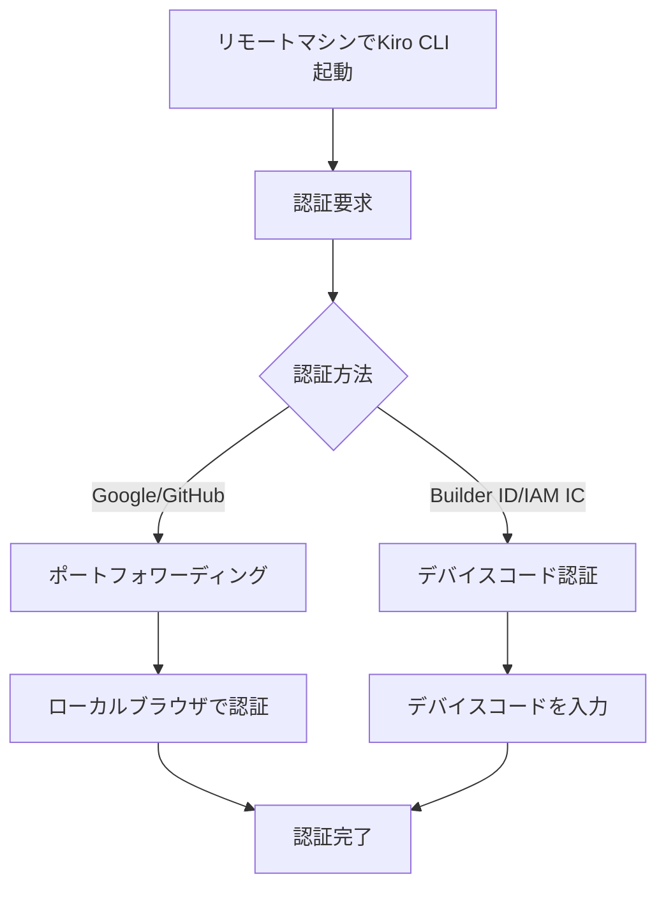

# Kiro CLI Remote Authentication機能

**出典**: [Kiro CLI v1.24.0 Changelog](https://kiro.dev/changelog/cli/1-24/)

## 概要

Kiro CLI v1.24.0（2026年1月16日リリース）で追加されたRemote Authentication機能について詳細に解説します。この機能により、リモートマシン（SSH、SSM、コンテナ経由）でKiro CLIを実行する際に、GoogleまたはGitHubでサインインできるようになりました。

### Remote Authenticationとは

Remote Authentication機能は、**リモートマシンでのGoogle/GitHub認証**を実現する機能です。SSH、SSM、コンテナ環境でKiro CLIを実行する際に、ローカルブラウザを使用して認証できます。

### 主な特徴

- **ポートフォワーディング対応**: Google/GitHub認証でポートフォワーディングを使用
- **デバイスコード認証**: Builder ID/IAM Identity Centerは標準対応
- **複数環境対応**: SSH、SSM、コンテナ環境で利用可能
- **ローカルブラウザ使用**: リモートマシンでもローカルブラウザで認証

### なぜRemote Authenticationが必要なのか

従来、リモートマシンでKiro CLIを使用する際、以下の問題がありました：

1. **認証の制限**: Google/GitHub認証がリモート環境で使用できない
2. **Builder IDのみ**: デバイスコード認証のみ対応
3. **開発体験の低下**: リモート開発環境での利用が制限される

Remote Authentication機能は、これらの問題を解決し、リモート環境でもフル機能を利用できるようにします。

### サポートされる認証方法

#### ポートフォワーディング対応（v1.24.0で追加）

| 認証方法 | 環境 | 対応 |
|---------|------|------|
| Google認証 | SSH/SSM/コンテナ | ✅ v1.24.0 |
| GitHub認証 | SSH/SSM/コンテナ | ✅ v1.24.0 |

#### デバイスコード認証（標準対応）

| 認証方法 | 環境 | 対応 |
|---------|------|------|
| Builder ID | すべて | ✅ 標準 |
| IAM Identity Center | すべて | ✅ 標準 |

### リモート環境の種類

| 環境 | 説明 | 例 |
|------|------|-----|
| **SSH** | SSH接続したリモートマシン | EC2インスタンス、オンプレミスサーバー |
| **SSM** | AWS Systems Manager Session Manager | EC2インスタンス（SSM経由） |
| **コンテナ** | Docker/Podmanコンテナ | 開発用コンテナ、CI/CDコンテナ |


## 📋 Zenn記事の詳細内容確認

**注意**: v1.24.0のRemote Authentication機能に関するZenn記事は現時点で公開されていません。本ドキュメントは公式Changelogおよび公式ドキュメントの情報に基づいて作成されています。

### 参考情報源

- [Kiro CLI v1.24.0 Changelog](https://kiro.dev/changelog/cli/1-24/)
- [Authentication - Sign in from a Remote Machine](https://kiro.dev/docs/cli/authentication/#sign-in-from-a-remote-machine)

## Remote Authentication機能詳細

### 基本概念

Remote Authentication機能は、リモートマシンでのGoogle/GitHub認証を実現する機能です。

#### 認証フロー



### ポートフォワーディング認証

#### 仕組み

1. **リモートマシンでKiro CLI起動**: 認証要求が発生
2. **ポートフォワーディング設定**: ローカルマシンとリモートマシン間でポートを転送
3. **ローカルブラウザで認証**: ローカルマシンのブラウザで認証ページを開く
4. **認証完了**: 認証情報がリモートマシンに送信される

#### 対応環境

| 環境 | ポートフォワーディング | 設定方法 |
|------|---------------------|---------|
| SSH | ✅ | `-L`オプション |
| SSM | ✅ | ポートフォワーディングセッション |
| Docker | ✅ | `-p`オプション |
| Podman | ✅ | `-p`オプション |

### デバイスコード認証

#### 仕組み

1. **リモートマシンでKiro CLI起動**: 認証要求が発生
2. **デバイスコード表示**: 認証コードとURLが表示される
3. **ローカルブラウザで認証**: URLを開き、コードを入力
4. **認証完了**: 認証情報がリモートマシンに送信される

#### 対応認証方法

| 認証方法 | デバイスコード認証 |
|---------|------------------|
| Builder ID | ✅ 標準対応 |
| IAM Identity Center | ✅ 標準対応 |
| Google | ❌ ポートフォワーディング必須 |
| GitHub | ❌ ポートフォワーディング必須 |

### 認証方法の選択

#### 推奨される選択

| 環境 | 推奨認証方法 | 理由 |
|------|------------|------|
| SSH（ポートフォワーディング可能） | Google/GitHub | 既存アカウントを使用 |
| SSH（ポートフォワーディング不可） | Builder ID | デバイスコード認証 |
| SSM | Google/GitHub | ポートフォワーディング対応 |
| コンテナ | Google/GitHub | ポートフォワーディング対応 |
| CI/CD | Builder ID | 自動化に適している |


### SSH環境での認証

#### ポートフォワーディングの設定

```bash
# ローカルポート8080をリモートマシンのポート8080に転送
ssh -L 8080:localhost:8080 user@remote-host
```

#### 認証フロー

1. SSH接続（ポートフォワーディング有効）
2. リモートマシンでKiro CLI起動
3. 認証要求が発生
4. ローカルブラウザで認証ページが開く
5. 認証完了

### SSM環境での認証

#### ポートフォワーディングセッションの開始

```bash
# SSMポートフォワーディングセッション
aws ssm start-session \
  --target i-1234567890abcdef0 \
  --document-name AWS-StartPortForwardingSession \
  --parameters '{"portNumber":["8080"],"localPortNumber":["8080"]}'
```

#### 認証フロー

1. SSMポートフォワーディングセッション開始
2. リモートマシンでKiro CLI起動
3. 認証要求が発生
4. ローカルブラウザで認証ページが開く
5. 認証完了

### コンテナ環境での認証

#### Dockerでのポートフォワーディング

```bash
# ポート8080を転送してコンテナを起動
docker run -it -p 8080:8080 my-dev-container
```

#### Podmanでのポートフォワーディング

```bash
# ポート8080を転送してコンテナを起動
podman run -it -p 8080:8080 my-dev-container
```

#### 認証フロー

1. コンテナ起動（ポートフォワーディング有効）
2. コンテナ内でKiro CLI起動
3. 認証要求が発生
4. ローカルブラウザで認証ページが開く
5. 認証完了

## セットアップ/使用方法

### 1. SSH環境でのセットアップ

#### ステップ1: ポートフォワーディング付きでSSH接続

```bash
# ローカルポート8080をリモートマシンのポート8080に転送
ssh -L 8080:localhost:8080 user@remote-host
```

#### ステップ2: Kiro CLIを起動

```bash
# リモートマシンで実行
kiro-cli chat
```

#### ステップ3: 認証

> **注意**: 認証プロンプトや認証成功メッセージの具体的な出力例は、公式情報が不足しているため現在検証中です。

認証プロンプトが表示され、ローカルブラウザで認証ページが開きます。Google/GitHubで認証すると、認証が完了します。

### 2. SSM環境でのセットアップ

#### ステップ1: SSMポートフォワーディングセッション開始

```bash
# ローカルマシンで実行
aws ssm start-session \
  --target i-1234567890abcdef0 \
  --document-name AWS-StartPortForwardingSession \
  --parameters '{"portNumber":["8080"],"localPortNumber":["8080"]}'
```

#### ステップ2: 別のターミナルでSSM接続

```bash
# 別のターミナルで実行
aws ssm start-session --target i-1234567890abcdef0
```

#### ステップ3: Kiro CLIを起動

```bash
# リモートマシンで実行
kiro-cli chat
```

#### ステップ4: 認証

> **注意**: 認証プロンプトや認証成功メッセージの具体的な出力例は、公式情報が不足しているため現在検証中です。

認証プロンプトが表示され、ローカルブラウザで認証ページが開きます。Google/GitHubで認証すると、認証が完了します。

### 3. Docker環境でのセットアップ

#### ステップ1: Dockerfileの作成

```dockerfile
FROM ubuntu:22.04

# Kiro CLIのインストール
RUN apt-get update && \
    apt-get install -y curl && \
    curl -fsSL https://kiro.dev/install.sh | sh

# 作業ディレクトリ
WORKDIR /workspace
```


CMD ["/bin/bash"]
```

#### ステップ2: コンテナの起動

```bash
# ポート8080を転送してコンテナを起動
docker run -it -p 8080:8080 my-dev-container
```

#### ステップ3: Kiro CLIを起動

```bash
# コンテナ内で実行
kiro-cli chat
```

#### ステップ4: 認証

> **注意**: 認証プロンプトや認証成功メッセージの具体的な出力例は、公式情報が不足しているため現在検証中です。

認証プロンプトが表示され、ローカルブラウザで認証ページが開きます。Google/GitHubで認証すると、認証が完了します。

### 4. Builder IDでの認証（デバイスコード）

#### ステップ1: リモートマシンでKiro CLI起動

```bash
# SSH接続（ポートフォワーディングなし）
ssh user@remote-host

# Kiro CLIを起動
kiro-cli chat
```

#### ステップ2: デバイスコード認証

> **注意**: デバイスコードの表示形式や認証成功メッセージの具体的な出力例は、公式情報が不足しているため現在検証中です。

デバイスコードが表示されます。ローカルブラウザでURLを開き、コードを入力すると、認証が完了します。

### 5. 認証状態の確認

#### 認証状態の確認

```bash
# 認証状態を確認
kiro-cli auth status
```

> **注意**: `kiro-cli auth status`コマンドの出力例は、公式情報が不足しているため現在検証中です。

#### ログアウト

```bash
# ログアウト
kiro-cli auth logout
```

## 実用的なユースケース

### ユースケース1: EC2インスタンスでの開発

#### シナリオ

EC2インスタンスにSSH接続して、Kiro CLIを使用したい。

#### 実装

```bash
# ステップ1: ポートフォワーディング付きでSSH接続
ssh -L 8080:localhost:8080 ec2-user@ec2-instance

# ステップ2: Kiro CLIを起動
kiro-cli chat

# ステップ3: Google/GitHubで認証
# ローカルブラウザで認証ページが開く

# ステップ4: 開発作業
> プロジェクトのコードを確認して
```

**メリット**:
- EC2インスタンスでKiro CLIをフル活用
- ローカルマシンと同じ認証方法
- 開発体験の向上

### ユースケース2: SSM経由でのアクセス

#### シナリオ

SSM Session Managerを使用してEC2インスタンスにアクセスし、Kiro CLIを使用したい。

#### 実装

```bash
# ステップ1: SSMポートフォワーディングセッション開始
aws ssm start-session \
  --target i-1234567890abcdef0 \
  --document-name AWS-StartPortForwardingSession \
  --parameters '{"portNumber":["8080"],"localPortNumber":["8080"]}'

# ステップ2: 別のターミナルでSSM接続
aws ssm start-session --target i-1234567890abcdef0

# ステップ3: Kiro CLIを起動
kiro-cli chat

# ステップ4: Google/GitHubで認証
```

**メリット**:
- SSM経由でもKiro CLIをフル活用
- セキュアなアクセス
- IAMロールベースの認証

### ユースケース3: 開発用コンテナ

#### シナリオ

Dockerコンテナ内でKiro CLIを使用したい。

#### 実装

```bash
# ステップ1: コンテナ起動
docker run -it -p 8080:8080 my-dev-container

# ステップ2: Kiro CLIを起動
kiro-cli chat

# ステップ3: Google/GitHubで認証
```

**メリット**:
- コンテナ内でもKiro CLIをフル活用
- 開発環境の統一
- チーム内での共有が容易


### ユースケース4: CI/CD環境

#### シナリオ

CI/CDパイプラインでKiro CLIを使用したい。

#### 実装

```yaml
# .github/workflows/ci.yml
name: CI

on: [push]

jobs:
  build:
    runs-on: ubuntu-latest
    steps:
      - uses: actions/checkout@v2
      
      - name: Install Kiro CLI
        run: curl -fsSL https://kiro.dev/install.sh | sh
      
      - name: Authenticate with Builder ID
        run: |
          # デバイスコード認証
          kiro-cli auth login --builder-id
        env:
          KIRO_AUTH_TOKEN: ${{ secrets.KIRO_AUTH_TOKEN }}
      
      - name: Run Kiro CLI
        run: kiro-cli chat --non-interactive "プロジェクトのテストを実行して"
```

**メリット**:
- CI/CD環境でKiro CLIを自動化
- Builder IDでの認証
- 自動化されたワークフロー


## ベストプラクティス

### 1. 環境に応じた認証方法を選択する

#### 推奨される選択

| 環境 | 推奨認証方法 | 理由 |
|------|------------|------|
| SSH（開発） | Google/GitHub | 既存アカウント、ポートフォワーディング容易 |
| SSH（本番） | Builder ID | セキュリティ、デバイスコード認証 |
| SSM | Google/GitHub | ポートフォワーディング対応 |
| コンテナ（開発） | Google/GitHub | ポートフォワーディング容易 |
| コンテナ（CI/CD） | Builder ID | 自動化に適している |

### 2. ポートフォワーディングのポート番号を統一する

#### 推奨アプローチ

```bash
# 常にポート8080を使用
ssh -L 8080:localhost:8080 user@remote-host

# または環境変数で管理
export KIRO_AUTH_PORT=8080
ssh -L ${KIRO_AUTH_PORT}:localhost:${KIRO_AUTH_PORT} user@remote-host
```

**メリット**:
- 設定の統一
- トラブルシューティングが容易
- チーム内での共有が容易

### 3. SSH設定ファイルでポートフォワーディングを自動化する

#### ~/.ssh/configの設定

```bash
# ~/.ssh/config
Host remote-dev
    HostName ec2-instance.amazonaws.com
    User ec2-user
    LocalForward 8080 localhost:8080
```

**使用例**:

```bash
# ポートフォワーディングが自動的に設定される
ssh remote-dev

# Kiro CLIを起動
kiro-cli chat
```

**メリット**:
- 毎回ポートフォワーディングを指定する必要がない
- 設定の一元管理
- ミスの削減

### 4. 認証トークンの有効期限を管理する

#### 定期的な認証状態の確認

```bash
# 認証状態を確認
kiro-cli auth status

# 有効期限が近い場合は再認証
kiro-cli auth login
```

#### 自動化スクリプト

```bash
#!/bin/bash
# check-auth.sh

# 認証状態を確認
if ! kiro-cli auth status &> /dev/null; then
    echo "Authentication expired. Please re-authenticate."
    kiro-cli auth login
fi
```

### 5. CI/CD環境では環境変数を使用する

#### 推奨アプローチ

```yaml
# .github/workflows/ci.yml
env:
  KIRO_AUTH_TOKEN: ${{ secrets.KIRO_AUTH_TOKEN }}
  KIRO_AUTH_METHOD: builder-id
```

**メリット**:
- セキュアな認証情報の管理
- 自動化が容易
- 監査証跡

### 6. チーム内で認証方法を統一する

#### 推奨アプローチ

チーム全体で統一された認証方法を使用します。

**開発環境**:
- Google/GitHub認証（ポートフォワーディング）

**本番環境**:
- Builder ID（デバイスコード認証）

**CI/CD環境**:
- Builder ID（環境変数）

**メリット**:
- チーム内で統一された手順
- トラブルシューティングが容易
- 新メンバーのオンボーディングが容易

## トラブルシューティング

### 問題1: ポートフォワーディングが機能しない

#### 症状

```bash
ssh -L 8080:localhost:8080 user@remote-host
kiro-cli chat

# 認証ページが開かない
```

#### 原因と対処法

**原因1: ポートが既に使用されている**

**対処法**: 別のポートを使用

```bash
# ポート8081を使用
ssh -L 8081:localhost:8081 user@remote-host
```

**原因2: ファイアウォールでブロックされている**

**対処法**: ファイアウォール設定を確認

```bash
# ポート8080を許可
sudo ufw allow 8080
```


### 問題2: 認証ページが開かない

#### 症状

```bash
kiro-cli chat
```

> **注意**: 認証プロンプトやエラーメッセージの具体的な出力例は、公式情報が不足しているため現在検証中です。

認証プロンプトが表示されるが、ブラウザが開かない場合があります。

#### 原因と対処法

**原因: ローカルマシンでブラウザが起動しない**

**対処法**: 手動でURLを開く

表示されたURLを手動でブラウザで開きます。

### 問題3: デバイスコード認証が失敗する

#### 症状

```bash
kiro-cli chat
```

> **注意**: デバイスコードの表示形式やエラーメッセージの具体的な出力例は、公式情報が不足しているため現在検証中です。

デバイスコードが表示されるが、認証が失敗する場合があります。

#### 原因と対処法

**原因1: コードの入力ミス**

**対処法**: コードを正確に入力します（大文字小文字を区別）。

**原因2: コードの有効期限切れ**

**対処法**: 再度認証を試行

```bash
# 再度Kiro CLIを起動
kiro-cli chat
```

### 問題4: SSMポートフォワーディングが機能しない

#### 症状

```bash
aws ssm start-session \
  --target i-1234567890abcdef0 \
  --document-name AWS-StartPortForwardingSession \
  --parameters '{"portNumber":["8080"],"localPortNumber":["8080"]}'
```

> **注意**: エラーメッセージの具体的な出力例は、公式情報が不足しているため現在検証中です。

SSMポートフォワーディングセッションの開始に失敗する場合があります。

#### 原因と対処法

**原因1: SSM Agentが未インストール**

> **注意**: SSM Agentのインストール手順は、公式情報が不足しているため現在検証中です。詳細は[AWS Systems Manager公式ドキュメント](https://docs.aws.amazon.com/systems-manager/)を参照してください。

**対処法**: SSM Agentをインストールします。

**原因2: IAMロールが不足**

> **注意**: IAMロールの詳細な設定例は、公式情報が不足しているため現在検証中です。詳細は[AWS IAM公式ドキュメント](https://docs.aws.amazon.com/iam/)を参照してください。

**対処法**: 必要なIAMロールを付与します。

### 問題5: コンテナ内で認証が失敗する

#### 症状

```bash
docker run -it -p 8080:8080 my-dev-container
kiro-cli chat
```

> **注意**: エラーメッセージの具体的な出力例は、公式情報が不足しているため現在検証中です。

コンテナ内で認証が失敗する場合があります。

#### 原因と対処法

**原因: ポートマッピングが間違っている**

**対処法**: ポートマッピングを確認

```bash
# ポートマッピングを確認
docker ps

# 正しいポートマッピングで再起動
docker run -it -p 8080:8080 my-dev-container
```


## まとめ

### Remote Authentication機能の重要ポイント

1. **ポートフォワーディング対応**: Google/GitHub認証でポートフォワーディングを使用
2. **デバイスコード認証**: Builder ID/IAM Identity Centerは標準対応
3. **複数環境対応**: SSH、SSM、コンテナ環境で利用可能
4. **ローカルブラウザ使用**: リモートマシンでもローカルブラウザで認証

### サポートされる認証方法

| 認証方法 | 環境 | 認証方式 |
|---------|------|---------|
| Google | SSH/SSM/コンテナ | ポートフォワーディング |
| GitHub | SSH/SSM/コンテナ | ポートフォワーディング |
| Builder ID | すべて | デバイスコード認証 |
| IAM Identity Center | すべて | デバイスコード認証 |

### 主な活用シーン

| シーン | 推奨認証方法 |
|--------|------------|
| EC2インスタンスでの開発 | Google/GitHub（ポートフォワーディング） |
| SSM経由でのアクセス | Google/GitHub（ポートフォワーディング） |
| 開発用コンテナ | Google/GitHub（ポートフォワーディング） |
| CI/CD環境 | Builder ID（デバイスコード認証） |

### ベストプラクティスのまとめ

1. **環境に応じた認証方法の選択**: 開発はGoogle/GitHub、本番はBuilder ID
2. **ポート番号の統一**: 常にポート8080を使用
3. **SSH設定の自動化**: ~/.ssh/configでポートフォワーディングを自動化
4. **認証トークンの管理**: 定期的な認証状態の確認
5. **CI/CD環境での環境変数使用**: セキュアな認証情報の管理
6. **チーム内での統一**: 統一された認証方法

### 次のステップ

1. **環境の選択**: SSH、SSM、コンテナのいずれかを選択
2. **ポートフォワーディングの設定**: 必要に応じて設定
3. **Kiro CLIの起動**: リモートマシンでKiro CLIを起動
4. **認証**: Google/GitHubまたはBuilder IDで認証

### 参考リンク

- [Kiro CLI v1.24.0 Changelog](https://kiro.dev/changelog/cli/1-24/)
- [Authentication - Sign in from a Remote Machine](https://kiro.dev/docs/cli/authentication/#sign-in-from-a-remote-machine)

---

**Remote Authentication機能を活用して、リモート環境でもKiro CLIをフル活用しましょう！**
