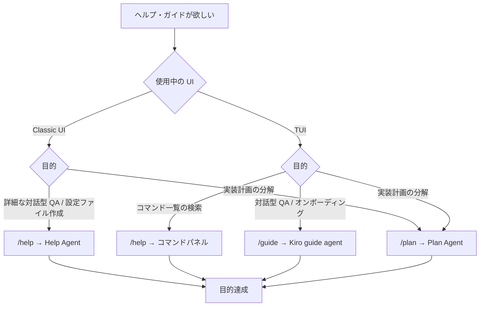

[ホーム](../README.md) > [機能詳細ガイド](README.md) > Kiro guide agent

---

# Kiro guide agent（`/guide` コマンド）

## 概要

**Kiro CLI v1.29.7（2026-04-10 リリース）で追加された、TUI 専用のオンボーディング・ヘルプ用組み込みエージェント**です。`/guide` スラッシュコマンドで Kiro guide agent に切り替えます。

### 🆕 Kiro CLI の Built-in Agent 3 種類

Kiro CLI には 3 種類の組み込みエージェントがあり、用途ごとに使い分けます:

| Agent | コマンド | 用途 | 導入バージョン |
|-------|--------|------|-------------|
| **kiro_default** | （デフォルト） | 汎用のコード支援 | - |
| **[kiro_help](14_HelpAgent.md)** | `/help` | CLI ドキュメントベースの詳細 QA、設定ファイル作成支援 | v1.25.0 |
| **kiro_planner** | `/plan` / `Shift+Tab` | 複雑なアイデアを実装計画に分解 | v1.23.0 |
| **Kiro guide agent** ⭐ | `/guide` | **オンボーディング・TUI でのヘルプ** | **v1.29.7** |

### Kiro guide agent が提供する体験（公式説明に基づく）

公式 TUI 比較ページ（[https://kiro.dev/docs/cli/terminal-ui/comparison/](https://kiro.dev/docs/cli/terminal-ui/comparison/)）より:

> `/guide` — Switch to the Kiro guide agent for help and onboarding

つまり:

- **ヘルプ**: TUI 環境での CLI 機能の案内
- **オンボーディング**: 初見ユーザーが CLI の使い方を学ぶ導入体験

### なぜ `/guide` が必要なのか

**v2.0.0 で TUI がデフォルト化された際に、`/help` コマンドの挙動が Classic UI と TUI で異なる** ようになりました:

| UI モード | `/help` の挙動 |
|---------|--------------|
| **Classic UI** | Launches a help agent for interactive Q&A（Help Agent を起動） |
| **TUI** | **Opens a searchable command panel**（検索可能なコマンドパネルを開く） |

そのため、TUI では **「対話型の Q&A でヘルプを得る手段」が必要** となり、`/guide` がその役割を担うために設計されました。

> **💡 ワンポイント**: TUI では `/help` がコマンド一覧のパネル表示に変わるため、Help Agent のような対話型ヘルプが欲しい場合は **`/guide` を使用** します。

---

## 📋 目次

- [/help / /plan / /guide の使い分け](#help--plan--guide-の使い分け)
- [使い方](#使い方)
- [仕組み（公開情報）](#仕組み公開情報)
- [調査で判明した事実と未確認事項](#調査で判明した事実と未確認事項)
- [Help Agent との違い](#help-agent-との違い)
- [TUI 環境での位置づけ](#tui-環境での位置づけ)
- [注意点・制限事項](#注意点制限事項)
- [関連リンク](#関連リンク)

---

## /help / /plan / /guide の使い分け

### 使い分けフローチャート



### 簡易対応表

| やりたいこと | Classic UI | TUI |
|----------|-----------|-----|
| CLI の使い方を学びたい | `/help` （Help Agent） | `/guide` （Kiro guide agent） |
| コマンド一覧を見たい | `/help --legacy` | `/help` （コマンドパネル） |
| 特定コマンドのヘルプ | `/help --legacy <command>` | `/help` パネル内で検索 |
| 詳細な対話型 QA | `/help` | **`/guide`** |
| 実装計画を立てる | `/plan` / `Shift+Tab` | 同左 |
| 設定ファイル作成を依頼 | `/help` | `/guide`（推定） |

---

## 使い方

### 基本的な切り替え

TUI モードで以下を入力すると、Kiro guide agent に切り替わります:

```bash
> /guide
```

以降、エージェントから案内を受けながら対話を進めることができます（具体的な応答内容は実機確認で把握が必要）。

### 元のエージェントに戻る

公式ドキュメントに明示的な記述はありませんが、他の built-in agent と同様に **再度 `/guide` を実行するとトグル** する、または **`/agent swap <元のエージェント名>`** で切り替え可能と推測されます（要検証）。

---

## 仕組み（公開情報）

### 確定している情報（公式・CLI 内蔵）

| 項目 | 内容 | 出典 |
|------|------|------|
| 導入バージョン | **v1.29.7（2026-04-10）** | `kiro-cli version --changelog=1.29.7` |
| CLI 内蔵 changelog の記述 | `Added /guide command to swap to the Kiro guide agent` | CLI 内蔵 changelog |
| 対応 UI | **TUI 専用**（公式 TUI 比較ページに記載） | [terminal-ui/comparison](https://kiro.dev/docs/cli/terminal-ui/comparison/) |
| 用途 | help and onboarding（公式表記） | 同上 |

### 関連する他機能

- [Terminal UI（TUI）機能](18_TerminalUI.md) - `/guide` が動作する TUI モードの詳細
- [Help Agent](14_HelpAgent.md) - Classic UI でのヘルプ体験
- [v2.0.0 メジャーアップデート](16_v2MajorUpdate.md) - TUI デフォルト化の文脈

---

## 調査で判明した事実と未確認事項

本セクションは、2026-05-10 に実施した詳細調査の結果をまとめたものです（調査計画書・結果報告書は本プロジェクトのリポジトリ外の作業記録に保管）。

### ✅ 確定している事実

- `/guide` は **v1.29.7 で追加** された
- **TUI 専用**と公式に位置付けられている
- `/help` の挙動が TUI で変わる（コマンドパネル化）ため、**対話型ヘルプの代替**として設計された

### ⚠️ 公式ドキュメント化されていない事項

| 項目 | 現状 |
|------|------|
| `/guide` 専用の公式ドキュメントページ | **存在しない**（`/docs/cli/chat/guide-agent/` 等 404） |
| 公式 Changelog ページ（`/changelog/cli/1-29/`）での言及 | **なし**（CLI 内蔵 changelog のみに記載） |
| 公式スラッシュコマンドリファレンスでの言及 | **なし**（`/help` や `/plan` は掲載あり） |
| 唯一の公式言及 | [TUI 比較ページ](https://kiro.dev/docs/cli/terminal-ui/comparison/) 内のテーブル 1 行のみ |

### ❓ 一次情報から確認できなかった事項（**推測を避けるため未記述**）

| 項目 | 調査状況 |
|------|---------|
| 内部エージェント名（`kiro_guide` 等） | `kiro-cli agent list` に表示されず、バイナリからも検出不可 |
| 使用ツール・プロンプトインジケーター | バイナリ strings で `[guide]` 等は検出不可 |
| 情報源・知識ベース | 新規の埋め込みドキュメントは検出不可（既存の `introspect` 利用の可能性あり） |
| Classic UI で `/guide` を実行した時の挙動 | 対話式 CLI のため実機確認が必要 |
| 初回オンボーディングの具体的フロー | 公開情報なし |
| トグル動作の有無 | 公開情報なし |

> **⚠️ 注意**: 上記「確認できなかった事項」について本サイトでは**推測での記述を避けています**。公式ドキュメントの更新を注視し、判明次第反映します。

---

## Help Agent との違い

### 比較表

| 項目 | [Help Agent](14_HelpAgent.md) | Kiro guide agent |
|------|--------------------|-----------------|
| **コマンド** | `/help` | `/guide` |
| **導入バージョン** | v1.25.0（2026-02-03） | v1.29.7（2026-04-10） |
| **対応 UI** | Classic UI / TUI 両対応（TUI では別挙動） | **TUI 専用** |
| **エージェント名** | `kiro_help`（`agent list` で確認可能） | 未公開（`agent list` に非表示） |
| **公式専用ページ** | ✅ [https://kiro.dev/docs/cli/chat/help-agent/](https://kiro.dev/docs/cli/chat/help-agent/) | ❌ なし |
| **主な用途** | CLI 機能・設定・コマンドの詳細 QA、設定ファイル作成支援 | オンボーディング・TUI ヘルプ |
| **使用ツール** | `introspect`、`fs_write`（`.kiro/**` `~/.kiro/**` 限定） | 未公開 |
| **プロンプトインジケーター** | `[help]`（紫色） | 未公開 |
| **MCPサーバー** | 無効（`includeMcpJson: false`） | 未公開 |
| **オフライン対応** | ✅ 可能（バイナリ内蔵ドキュメント参照） | 未公開（同様と推測） |

### 共通点

- Kiro CLI の built-in エージェントとして組み込まれている
- `/help`・`/guide` のスラッシュコマンドで切替可能
- スペシャリスト系エージェント（汎用の `kiro_default` より特化した用途）

---

## TUI 環境での位置づけ

### v2.x で強化された TUI 体験における `/guide` の役割

TUI モードがデフォルト化された v2.0.0 以降、TUI はデフォルトのユーザー体験になりました。その中で、ヘルプ・オンボーディング系コマンドは以下のように再編されています:

| TUI 専用コマンド | 役割 |
|-------------|------|
| **`/guide`** | ヘルプ・オンボーディング（Kiro guide agent 切替） |
| `/theme` | テーマカラーのカスタマイズ |
| `/transcript` | 会話トランスクリプトを `$PAGER` で表示 |
| `/copy` | 最後のアシスタントレスポンスをクリップボードにコピー |
| `/spawn` | 並列エージェントセッション実行 |
| `/feedback` | フィードバック送信（Classic の `/issue` を置換） |

参考: [Terminal UI 機能](18_TerminalUI.md)

---

## 注意点・制限事項

### Classic UI との互換性

- **`/guide` は公式に TUI 専用**と位置付けられています
- Classic UI での実行結果は公式に記載されていません（**「Unknown command」エラー相当**になる可能性が高い）
- Classic UI で対話型ヘルプが欲しい場合は **`/help`**（Help Agent）を使用してください

### 公式ドキュメント状況

- **公式専用ページが未整備**のため、詳細仕様は実機で確認するか、公式ドキュメントの今後の更新を待つ必要があります
- 本サイトでは**推測を避けて確定事実のみ記述**しているため、上記「未確認事項」は公式更新後に追記予定です

### 他エージェントとの切替

- `/agent swap <name>` での切替時、エージェント別のモデル設定がない限り現在のモデルは維持されます
- Kiro guide agent が `/agent list` に表示されないため、`/agent swap kiro_guide` 相当の直接切替は機能しない可能性があります

---

## 関連リンク

### 公式ドキュメント

- [Kiro CLI 公式サイト](https://kiro.dev/cli/)
- [Kiro CLI Terminal UI 比較](https://kiro.dev/docs/cli/terminal-ui/comparison/) - `/guide` の唯一の公式言及
- [Kiro CLI Help Agent](https://kiro.dev/docs/cli/chat/help-agent/) - Help Agent の公式解説
- [Kiro CLI スラッシュコマンドリファレンス](https://kiro.dev/docs/cli/reference/slash-commands/)

### 関連機能（本サイト内）

- [14. Help Agent](14_HelpAgent.md) - Classic UI でのヘルプ体験
- [16. v2.0.0 メジャーアップデート](16_v2MajorUpdate.md) - TUI デフォルト化の経緯
- [18. Terminal UI 機能](18_TerminalUI.md) - `/guide` が動作する TUI の詳細
- [02. サブエージェント機能](02_Subagents.md) - Plan Agent も含むエージェント機能全般

### リファレンス（辞書）
- [04_reference/02_slash-commands.md](../04_reference/02_slash-commands.md) — `/guide` の正規仕様

### 調査記録

本機能の詳細調査は 2026-05-10 に実施しました。調査計画書・結果報告書・関連する過去調査は、本プロジェクトのリポジトリ外（作業記録ディレクトリ）に保管されています。主な内容:

- Kiro guide agent 詳細調査計画書 Rev.2（2026-05-10）
- Kiro guide agent 詳細調査結果報告書（2026-05-10）
- Help Agent + /guide 差分調査報告書（2026-05-10）
- Help Agent コンテキスト調査報告書（2026-03-15、v1.26.0 時代）

---

**最終更新**: 2026年05月10日  
**対象バージョン**: Kiro CLI v1.29.7+（TUI モード）  
**公式ドキュメント状況**: 未整備（Kiro CLI 公式サイトで今後の更新を待つ）
