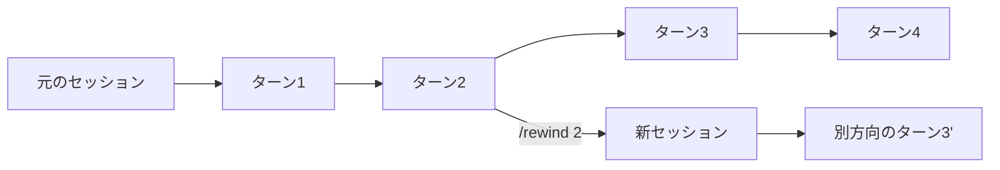

[ホーム](../README.md) > [機能詳細ガイド](README.md) > v2.4 新コマンド

---

# v2.4 新コマンド（/rewind, /effort, /settings）

## 概要

Kiro CLI v2.4.0（2026-05-20）で追加された3つの主要な新スラッシュコマンドを解説します。会話フローの制御（`/rewind`）、モデル推論レベルの調整（`/effort`）、統合設定メニュー（`/settings`）により、CLIの操作性と柔軟性が大幅に向上しました。

**対応バージョン**: Kiro CLI v2.4.0+

---

## /rewind - 会話の巻き戻し

### 機能概要

`/rewind` は会話の任意のターンに戻り、そこから新しいセッションとして別方向に分岐するコマンドです。元のセッションは変更されずに残るため、いつでも戻ることができます。

### 使い方

```bash
# インタラクティブなターンピッカーを開く
/rewind

# 直接ターン4に戻る
/rewind 4
```

インタラクティブピッカーには以下が表示されます:
- 各ターンのプロンプトプレビュー
- その時点のコンテキストウィンドウ使用率
- 新しい順にターンを一覧表示

### 仕組み



- `/rewind` 実行時、選択したターンから新しいセッションが作成される
- 元のセッションはそのまま保持される（`/chat resume` で戻れる）
- ファイルの変更は巻き戻されない（ディスク上のファイルはそのまま。ファイルも巻き戻したい場合はバージョン管理システムを使用）

### ユースケース

| シナリオ | 説明 |
|---------|------|
| **バックトラッキング** | エージェントが数ターン前に誤った前提を置き、以降全てがそれに基づいている場合 |
| **代替アプローチの探索** | 最初の試みを失わずに同じ問題に別のアプローチを試す |
| **コンテキスト汚染からの回復** | 無関係なコンテキストが蓄積し、クリーンな出発点が必要な場合 |
| **プロンプトのA/Bテスト** | 同じターンから異なる指示で分岐し結果を比較 |

---

## /effort - モデル推論レベル制御

### 機能概要

`/effort` はモデルが応答に費やす推論の深さを制御するコマンドです。低レベルでは高速・簡潔な応答、高レベルでは複雑な問題に対する深い分析が得られます。

### 使い方

```bash
# インタラクティブピッカーを開く
/effort

# 直接レベルを設定
/effort high
```

### レベル一覧

| レベル | 動作 | 適したタスク |
|--------|------|-------------|
| `low` | 高速・簡潔な応答 | 単純な質問、クイックルックアップ |
| `medium` | バランスの取れた推論 | 一般的な開発タスク |
| `high` | 徹底的な分析 | 複雑なリファクタリング、アーキテクチャ判断 |
| `xhigh` | 拡張推論 | マルチファイル変更、微妙な問題 |
| `max` | 最大深度 | 難解なデバッグ、セキュリティ分析、複雑なロジック |

### 対応モデル

| モデル | 利用可能レベル |
|--------|-------------|
| Claude Opus 4.7 | low, medium, high, xhigh, max |
| Claude Opus 4.6 | low, medium, high, max |
| Claude Sonnet 4.6 | low, medium, high, max |

全モデルが全レベルをサポートするわけではありません。ピッカーは現在のモデルで利用可能なレベルのみ表示します。

### 使い分けの指針

- **レベルを上げる**: エージェントが浅い回答をする、エッジケースを見逃す、不完全な実装を生成する場合
- **レベルを下げる**: 素早い回答が必要で、拡張推論を待ちたくない場合
- **`max`を使う**: セキュリティレビュー、複雑なデバッグセッション、多くの制約が相互作用する場合

### Per-model default settings

v2.4.0では `~/.kiro/settings/cli.json` の `chat.modelDefaults` でモデルごとのデフォルトeffortレベルを設定可能:

```json
{
  "chat": {
    "modelDefaults": {
      "claude-opus-4": {
        "effort": "max"
      },
      "claude-sonnet-4": {
        "effort": "high"
      }
    }
  }
}
```

この設定は全新規セッションに適用されます。

- 設定キー: `chat.modelDefaults`（[公式設定リファレンス](https://kiro.dev/docs/cli/reference/settings/)で確認）
- ワークスペース単位でオーバーライドする場合はプロジェクトルートの `.kiro/settings/cli.json` に同様の構造で記述

---

## /settings - 統合設定メニュー

### 機能概要

`/settings` はテーマカスタマイズ、キーボードショートカット、ターミナル設定、表示設定を1つのコマンドから管理する統合メニューです。既存の `/theme` コマンドは引き続きショートカットとして動作します。

### サブコマンド

#### `/settings theme`

カラーカスタマイズ。プロンプト入力とエージェント応答テキストの色を変更。ライブプレビュー付き。

```bash
/settings theme
```

テーマシステムは名前付きANSIカラーを使用するため、異なるカラーパレットのターミナル間でも正しくレンダリングされます。

#### `/settings keybindings`

現在のキーボードショートカット設定を表示（読み取り専用）。

```bash
/settings keybindings
```

キーバインドの変更は `kiro-cli settings` コマンドで行います:

```bash
kiro-cli settings chat.keybindings.cancelStream "ctrl+x"
kiro-cli settings chat.keybindings.closeMenu "ctrl+["
kiro-cli settings chat.keybindings.quit "ctrl+shift+q"
```

#### `/settings terminal`

`Shift+Enter` / `Option+Enter` をマルチライン入力のショートカットとして有効化。ターミナルを自動検出し適切なキーバインド設定を適用。

```bash
/settings terminal
```

**設定が必要なターミナル**（`/settings terminal` で自動適用）:
- VS Code統合ターミナル
- Alacritty
- Zed
- Apple Terminal

**ネイティブサポート済み**（設定不要）:
- iTerm2
- Kitty
- Ghostty
- WezTerm
- Warp

**tmuxユーザー向け**: `tmux.conf` に以下を追加:

```bash
set -s extended-keys on
set -as terminal-features 'xterm*:extkeys'
```

設定ファイル変更前に `.bak` バックアップが自動作成されます。

#### `/settings display`

アクセシビリティや好みに応じた表示トグル:

```bash
/settings display
```

- **Animations**: ストリーミングアニメーションとスピナーの有効/無効
- **ASCII art**: 挨拶やパネルの装飾ASCII artのトグル
- **Icons**: アイコンとテキストのみの表示切替

### 設定の永続化

`/settings` で行った変更は `~/.kiro/settings/cli.json` に保存され、以降のセッションに適用されます。`kiro-cli settings open` で直接編集も可能。

---

## その他の関連新機能（v2.4.0）

### /changelog

リリースノートをCLI内で直接表示するコマンド。ターミナルを離れずに最新の変更内容を確認できます。

```bash
/changelog
```

### KIRO_ACP_RECORD_PATH

TUI ACP（Agent Client Protocol）のwire trafficをJSONLトレースファイルに記録するデバッグ用環境変数。

```bash
export KIRO_ACP_RECORD_PATH=/tmp/acp-trace.jsonl
kiro-cli chat
```

---

## 関連リンク

- [/rewind 公式ドキュメント](https://kiro.dev/docs/cli/chat/rewind/)
- [/effort 公式ドキュメント](https://kiro.dev/docs/cli/chat/effort/)
- [/settings 公式ドキュメント](https://kiro.dev/docs/cli/chat/settings/)
- [スラッシュコマンドリファレンス](https://kiro.dev/docs/cli/reference/slash-commands/)
- [設定リファレンス](https://kiro.dev/docs/cli/reference/settings/)
- [公式Changelog v2.4](https://kiro.dev/changelog/cli/2-4/)
- [Kiro CLI v2.4.0 の新機能まとめ — Rewind・Effort 制御・統合された設定メニュー](https://zenn.dev/aws_japan/articles/b77bf7748f515f) - Zenn記事 by konippi（v2.4.0新機能の詳細解説・スクリーンショット付き）

---

**最終更新**: 2026年5月23日
**対象バージョン**: Kiro CLI v2.4.0+
