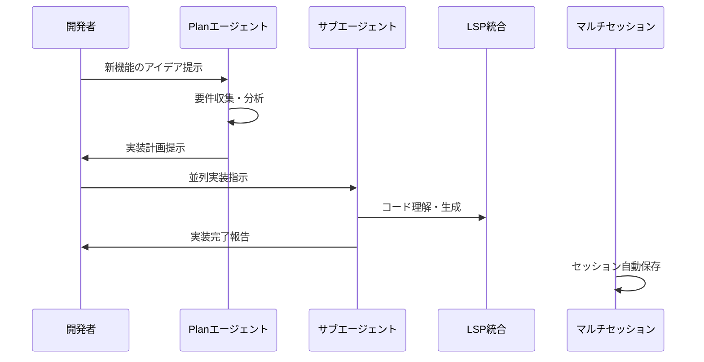
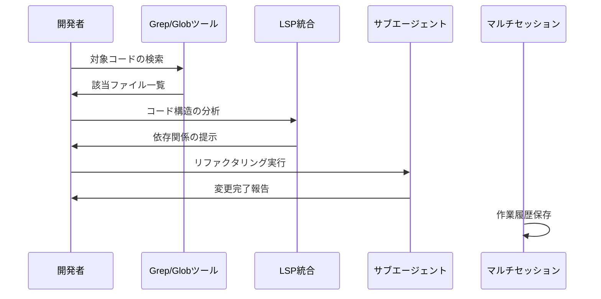
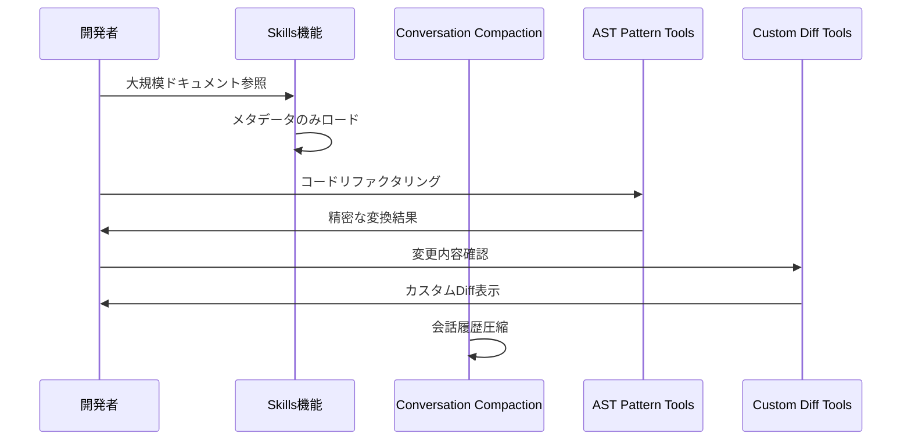
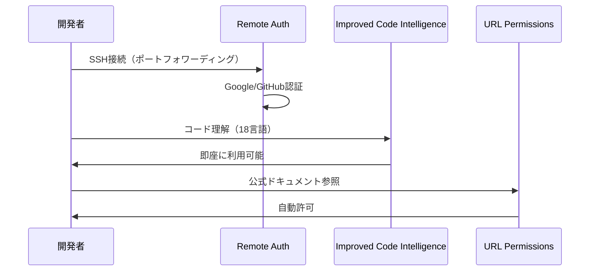

# 主要アップデート情報

## 📋 機能概要

| 機能 | リリース | 概要 | 主要機能 |
|------|----------|------|----------|
| **[LSP統合機能（Code Intelligence）](01_LSP.md)** | v1.22.0 （2025-12-11） v1.24.0更新 | Language Server Protocol統合による高精度コード理解 | v1.22.0: 7言語対応、LSP統合 v1.24.0: 18言語組み込み対応、/code overview |
| **[サブエージェント機能（Subagents）](02_Subagents.md)** | v1.23.0 （2025-12-18） | 複雑なタスクを専門エージェントに委譲し並列実行 | 自律実行、リアルタイム進捗追跡、結果の自動集約 |
| **[Planエージェント機能（Plan Agent）](03_PlanAgent.md)** | v1.23.0 （2025-12-18） | アイデアを構造化された実装計画に変換 | 要件収集、リサーチ分析、実装計画作成、計画引き継ぎ |
| **[マルチセッション機能（Multi-Session Support）](04_MultiSession.md)** | v1.23.0 （2025-12-18） | 複数のチャットセッションを効率的に管理 | セッションピッカー、自動保存、ディレクトリベース管理 |
| **[Grep/Globツール機能（Grep/Glob Tools）](05_GrepGlob.md)** | v1.23.0 （2025-12-18） | 高速なファイル検索を実現する2つのビルトインツール | 正規表現検索、Globパターン検索、.gitignore自動尊重 |
| **[/usage コマンド（使用量・契約プラン確認）](06_UsageCommand.md)** | 仕様変更 （2026-01-01確認時点） | 契約プラン情報と月間使用量を確認するコマンド | プラン表示、使用量可視化、課金情報、オーバーエイジ管理 |
| **[Skills機能（Progressive Context Loading）](07_Skills.md)** | v1.24.0 （2026-01-16） | 大規模ドキュメント向けの段階的コンテキストロード | メタデータのみ起動時、本文はオンデマンド、YAMLフロントマター |
| **[Custom Diff Tools機能](08_CustomDiffTools.md)** | v1.24.0 （2026-01-16） | 外部Diffツール統合（15種類対応） | delta、difftastic、VS Code等、カスタム引数対応 |
| **[AST Pattern Tools機能（Precise Refactoring）](09_ASTPatternTools.md)** | v1.24.0 （2026-01-16） | 構文木ベースの精密なコード検索・変換 | pattern-search、pattern-rewrite、誤検出排除 |
| **[Conversation Compaction機能](10_ConversationCompaction.md)** | v1.24.0 （2026-01-16） | 会話履歴の圧縮でコンテキストスペースを解放 | 手動・自動実行、重要情報保持、元セッション復帰可能 |
| **[Granular URL Permissions機能](11_URLPermissions.md)** | v1.24.0 （2026-01-16） | web_fetchツールのURL権限細粒度制御 | 正規表現パターン、信頼・ブロックパターン、承認プロンプト |
| **[Remote Authentication機能](12_RemoteAuth.md)** | v1.24.0 （2026-01-16） | リモートマシンでのGoogle/GitHub認証対応 | SSH/SSM/コンテナ環境、ポートフォワーディング対応 |

## 🔗 機能間の連携

### 計画から実装への流れ
1. **Planエージェント**で要件を整理し実装計画を作成
2. **サブエージェント**で並列実装を実行
3. **LSP統合**で高精度なコード理解を活用
4. **Grep/Globツール**で効率的なコード探索

### セッション管理
- **マルチセッション機能**で全ての作業履歴を管理
- プロジェクトごとの独立したセッション保持
- 重要な計画や実装過程の永続化

### コンテキスト管理の最適化（v1.24.0）
1. **Skills機能**で大規模ドキュメントをオンデマンドロード
2. **Conversation Compaction**で会話履歴を圧縮
3. **Improved Code Intelligence**で18言語を即座に理解
4. **Granular URL Permissions**でセキュアなURL制御

### 開発体験の向上（v1.24.0）
- **Custom Diff Tools**で好みのDiffツールを使用
- **AST Pattern Tools**で精密なリファクタリング
- **Remote Authentication**でリモート環境でもフル活用

## 📈 バージョン別進化

### v1.22.0（2025-12-11）
- **LSP統合機能**の追加
- コード理解能力の飛躍的向上
- IDEレベルの開発支援機能

### v1.23.0（2025-12-18）
- **4つの主要機能**を同時リリース
- AI駆動開発の完全なワークフロー実現
- 並列処理と効率的な管理機能

### v1.24.0（2026-01-16）
- **7つの主要機能**を追加
- コンテキスト管理の最適化（Skills、Conversation Compaction）
- 開発体験の向上（Custom Diff Tools、AST Pattern Tools）
- セキュリティ強化（Granular URL Permissions）
- リモート対応（Remote Authentication）
- コード理解の強化（18言語組み込み対応）
- 並列処理と効率的な管理機能

## 🎯 使用シナリオ例

### シナリオ1: 新機能開発

### シナリオ2: コードリファクタリング

### シナリオ3: 大規模プロジェクトの管理（v1.24.0）

### シナリオ4: リモート開発環境（v1.24.0）

## 🚀 導入効果

### 開発効率の向上
- **計画立案**: Planエージェントによる構造化された要件定義
- **並列開発**: サブエージェントによる複数タスクの同時実行
- **コード理解**: LSP統合による高精度な開発支援
- **効率的検索**: Grep/Globツールによる高速ファイル探索

### 管理効率の向上
- **セッション管理**: マルチセッション機能による履歴の永続化
- **プロジェクト管理**: ディレクトリベースの独立した管理
- **知識共有**: セッション共有による チーム協業の促進

### コンテキスト管理の最適化（v1.24.0）
- **Skills機能**: 大規模ドキュメントをコンテキストウィンドウを圧迫せずに管理
- **Conversation Compaction**: 長時間セッションを中断せずに継続
- **Improved Code Intelligence**: 18言語で即座にコード理解

### セキュリティの強化（v1.24.0）
- **Granular URL Permissions**: URL権限の細粒度制御
- **Remote Authentication**: リモート環境でのセキュアな認証

## 📚 各機能の詳細ドキュメント

1. **[LSP統合機能（Code Intelligence）](01_LSP.md)**
   - Language Server Protocol統合の詳細
   - 対応言語とセットアップ方法
   - 実用的なユースケース

2. **[サブエージェント機能（Subagents）](02_Subagents.md)**
   - 並列実行の仕組みと効果
   - カスタムエージェントの作成方法
   - 効果的な使い方とベストプラクティス

3. **[Planエージェント機能（Plan Agent）](03_PlanAgent.md)**
   - 計画立案の4段階プロセス
   - 読み取り専用設計の理由
   - 実装計画の構成要素

4. **[マルチセッション機能（Multi-Session Support）](04_MultiSession.md)**
   - セッション管理の仕組み
   - コマンドラインとチャット内操作
   - プロジェクトベースの管理方法

5. **[Grep/Globツール機能（Grep/Glob Tools）](05_GrepGlob.md)**
   - 高速検索の仕組み
   - shellツールとの違い
   - セキュリティとアクセス制御

6. **[/usage コマンド（使用量・契約プラン確認）](06_UsageCommand.md)**
   - 契約プラン情報の表示機能
   - 使用量の可視化とクレジット管理
   - Q Developer CLIからの仕様変更点

7. **[Skills機能（Progressive Context Loading）](07_Skills.md)**
   - 段階的コンテキストロードの仕組み
   - YAMLフロントマターの記述方法
   - file://リソースとの使い分け

8. **[Custom Diff Tools機能](08_CustomDiffTools.md)**
   - 15種類のDiffツール対応
   - カスタム引数の使用方法
   - プロジェクトごとの設定

9. **[AST Pattern Tools機能（Precise Refactoring）](09_ASTPatternTools.md)**
   - 構文木ベースの検索・変換
   - 正規表現との違い
   - 安全なリファクタリング

10. **[Conversation Compaction機能](10_ConversationCompaction.md)**
    - 会話履歴の圧縮の仕組み
    - 手動・自動実行の使い分け
    - 設定のカスタマイズ

11. **[Granular URL Permissions機能](11_URLPermissions.md)**
    - 正規表現パターンの記述方法
    - 信頼・ブロックパターンの使い分け
    - セキュリティベストプラクティス

12. **[Remote Authentication機能](12_RemoteAuth.md)**
    - ポートフォワーディング認証
    - デバイスコード認証
    - SSH/SSM/コンテナ環境での使用方法

## 🔮 今後の展望

Kiro CLIは継続的に進化を続けており、以下の分野での更なる改善が期待されます：

- **AI機能の強化**: より高度な理解と生成能力
- **統合機能の拡充**: 外部ツールとの連携強化
- **パフォーマンス向上**: 処理速度と効率の最適化
- **ユーザビリティ改善**: より直感的な操作体験

## 📞 サポート・コミュニティ

- **公式サイト**: [kiro.dev](https://kiro.dev/)
- **GitHub**: [kirodotdev/Kiro](https://github.com/kirodotdev/Kiro)
- **Discord**: [Kiro Community](https://discord.gg/kirodotdev)

---

**最終更新**: 2026年01月18日  
**対象バージョン**: Kiro CLI v1.24.0+
