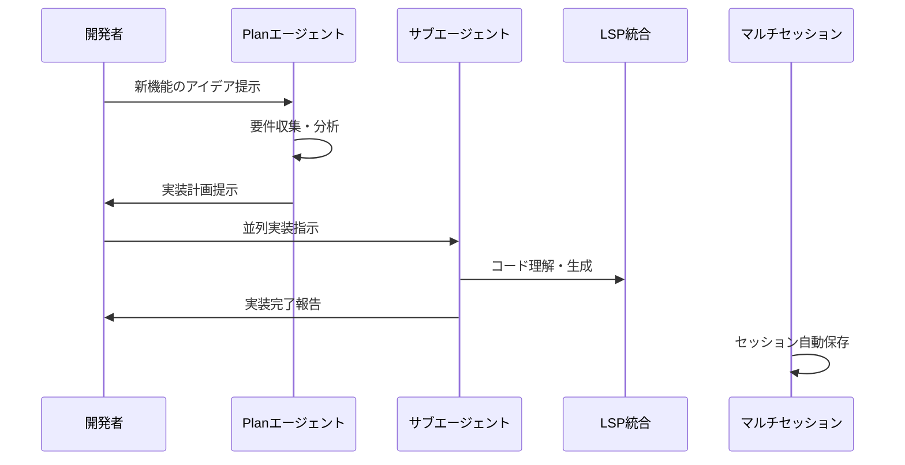
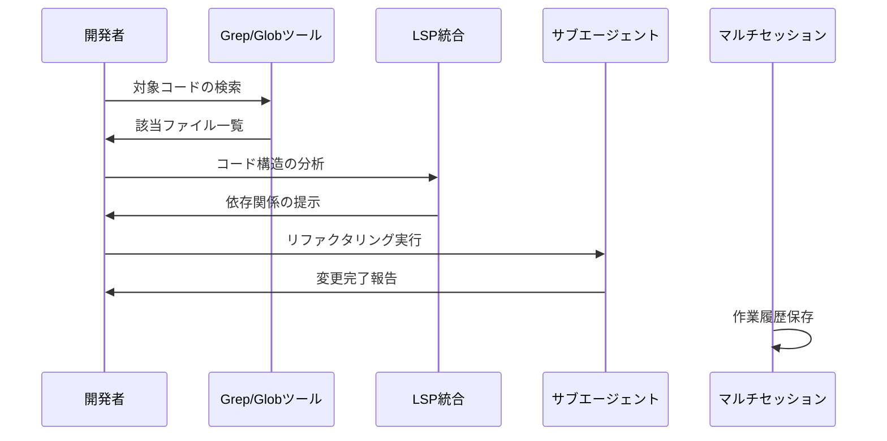

# 主要アップデート情報

## 📋 機能概要

| 機能 | リリース | 概要 | 主要機能 |
|------|----------|------|----------|
| **[LSP統合機能（Code Intelligence）](01_LSP.md)** | v1.22.0 （2025-12-11） | Language Server Protocol統合による高精度コード理解 | Go-to-definition、Find references、Hover情報、Diagnostics |
| **[サブエージェント機能（Subagents）](02_Subagents.md)** | v1.23.0 （2025-12-18） | 複雑なタスクを専門エージェントに委譲し並列実行 | 自律実行、リアルタイム進捗追跡、結果の自動集約 |
| **[Planエージェント機能（Plan Agent）](03_PlanAgent.md)** | v1.23.0 （2025-12-18） | アイデアを構造化された実装計画に変換 | 要件収集、リサーチ分析、実装計画作成、計画引き継ぎ |
| **[マルチセッション機能（Multi-Session Support）](04_MultiSession.md)** | v1.23.0 （2025-12-18） | 複数のチャットセッションを効率的に管理 | セッションピッカー、自動保存、ディレクトリベース管理 |
| **[Grep/Globツール機能（Grep/Glob Tools）](05_GrepGlob.md)** | v1.23.0 （2025-12-18） | 高速なファイル検索を実現する2つのビルトインツール | 正規表現検索、Globパターン検索、.gitignore自動尊重 |

## 🔗 機能間の連携

### 計画から実装への流れ
1. **Planエージェント**で要件を整理し実装計画を作成
2. **サブエージェント**で並列実装を実行
3. **LSP統合**で高精度なコード理解を活用
4. **Grep/Globツール**で効率的なコード探索

### セッション管理
- **マルチセッション機能**で全ての作業履歴を管理
- プロジェクトごとの独立したセッション保持
- 重要な計画や実装過程の永続化

## 📈 バージョン別進化

### v1.22.0（2025-12-11）
- **LSP統合機能**の追加
- コード理解能力の飛躍的向上
- IDEレベルの開発支援機能

### v1.23.0（2025-12-18）
- **4つの主要機能**を同時リリース
- AI駆動開発の完全なワークフロー実現
- 並列処理と効率的な管理機能

## 🎯 使用シナリオ例

### シナリオ1: 新機能開発

### シナリオ2: コードリファクタリング

## 🚀 導入効果

### 開発効率の向上
- **計画立案**: Planエージェントによる構造化された要件定義
- **並列開発**: サブエージェントによる複数タスクの同時実行
- **コード理解**: LSP統合による高精度な開発支援
- **効率的検索**: Grep/Globツールによる高速ファイル探索

### 管理効率の向上
- **セッション管理**: マルチセッション機能による履歴の永続化
- **プロジェクト管理**: ディレクトリベースの独立した管理
- **知識共有**: セッション共有による チーム協業の促進

## 📚 各機能の詳細ドキュメント

1. **[LSP統合機能（Code Intelligence）](01_LSP.md)**
   - Language Server Protocol統合の詳細
   - 対応言語とセットアップ方法
   - 実用的なユースケース

2. **[サブエージェント機能（Subagents）](02_Subagents.md)**
   - 並列実行の仕組みと効果
   - カスタムエージェントの作成方法
   - 効果的な使い方とベストプラクティス

3. **[Planエージェント機能（Plan Agent）](03_PlanAgent.md)**
   - 計画立案の4段階プロセス
   - 読み取り専用設計の理由
   - 実装計画の構成要素

4. **[マルチセッション機能（Multi-Session Support）](04_MultiSession.md)**
   - セッション管理の仕組み
   - コマンドラインとチャット内操作
   - プロジェクトベースの管理方法

5. **[Grep/Globツール機能（Grep/Glob Tools）](05_GrepGlob.md)**
   - 高速検索の仕組み
   - shellツールとの違い
   - セキュリティとアクセス制御

## 🔮 今後の展望

Kiro CLIは継続的に進化を続けており、以下の分野での更なる改善が期待されます：

- **AI機能の強化**: より高度な理解と生成能力
- **統合機能の拡充**: 外部ツールとの連携強化
- **パフォーマンス向上**: 処理速度と効率の最適化
- **ユーザビリティ改善**: より直感的な操作体験

## 📞 サポート・コミュニティ

- **公式サイト**: [kiro.dev](https://kiro.dev/)
- **GitHub**: [kirodotdev/Kiro](https://github.com/kirodotdev/Kiro)
- **Discord**: [Kiro Community](https://discord.gg/kirodotdev)

---

**最終更新**: 2025年12月28日  
**対象バージョン**: Kiro CLI v1.23.1
