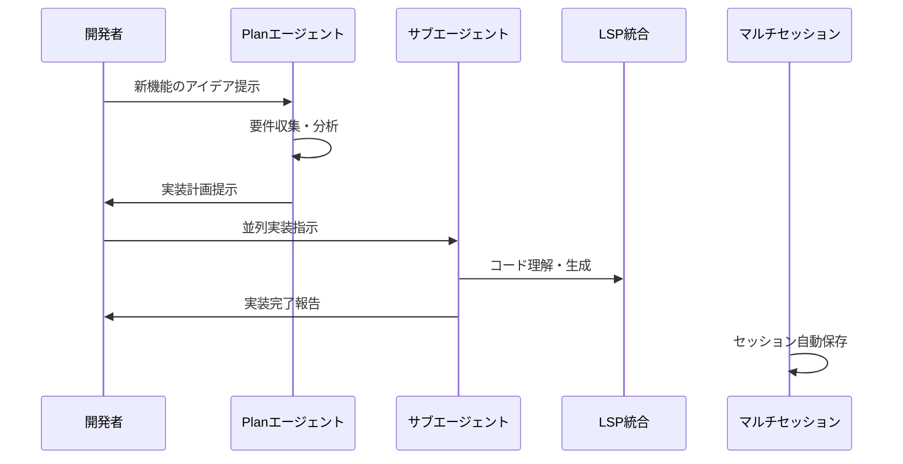
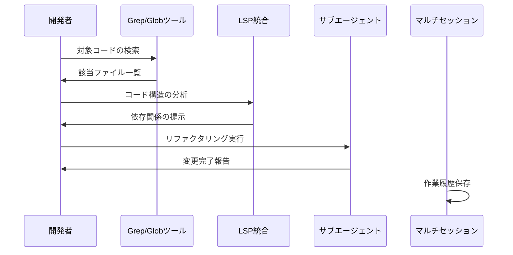
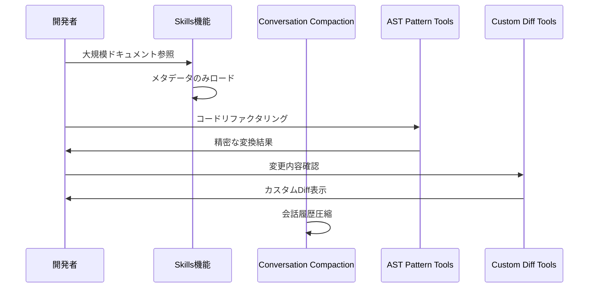
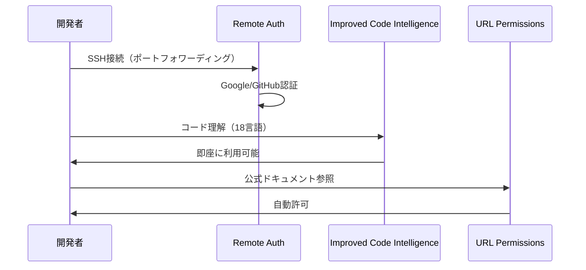
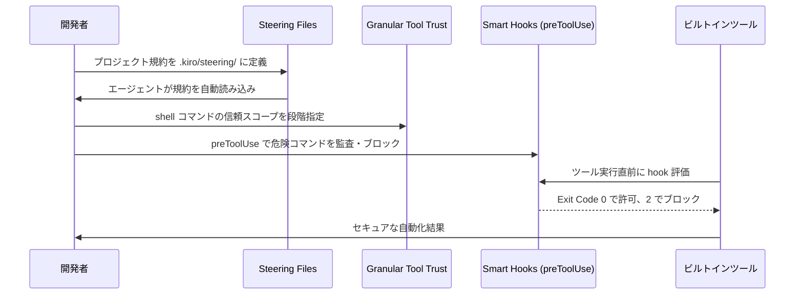
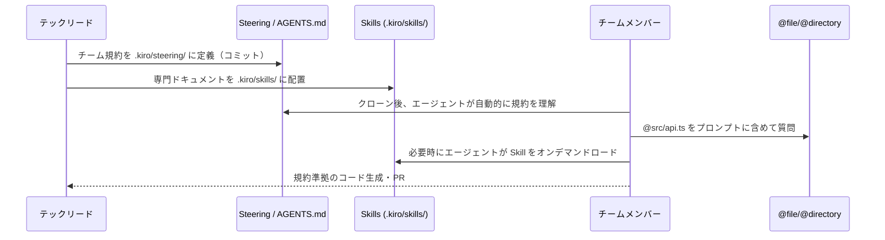

[ホーム](../README.md) > 機能詳細ガイド

# Kiro CLI 機能詳細ガイド

> 29 機能（既存 21 + v3.1 追加 4: Hooks / Steering / @file references / Auto Complete + Phase 6: Agent Toolkit for AWS + v2.5.0: Thinking Display + v2.6.0: v2.6 新コマンド + v2.7.0: v2.7 新コマンド）の詳細解説。リファレンス（辞書的・網羅的）は [04_reference/](../04_reference/README.md) にあります。

## 主要アップデート情報

## 📋 機能概要

| 機能 | リリース | 概要 | 主要機能 |
|------|----------|------|----------|
| **[LSP統合機能（Code Intelligence）](01_LSP.md)** | v1.22.0 （2025-12-11） v1.24.0更新 | Language Server Protocol統合による高精度コード理解 | v1.22.0: 7言語対応、LSP統合 v1.24.0: 18言語組み込み対応、/code overview |
| **[サブエージェント機能（Subagents）](02_Subagents.md)** | v1.23.0 （2025-12-18） v1.25.0更新 v2.0.0更新 | 複雑なタスクを専門エージェントに委譲し並列実行 | v1.23.0: 自律実行、リアルタイム進捗追跡 v1.25.0: Access Control（availableAgents、trustedAgents） v2.0.0: タスク依存関係サポート、Crew Monitor |
| **[Planエージェント機能（Plan Agent）](03_PlanAgent.md)** | v1.23.0 （2025-12-18） | アイデアを構造化された実装計画に変換 | 要件収集、リサーチ分析、実装計画作成、計画引き継ぎ |
| **[マルチセッション機能（Multi-Session Support）](04_MultiSession.md)** | v1.23.0 （2025-12-18） | 複数のチャットセッションを効率的に管理 | セッションピッカー、自動保存、ディレクトリベース管理 |
| **[Grep/Globツール機能（Grep/Glob Tools）](05_GrepGlob.md)** | v1.23.0 （2025-12-18） | 高速なファイル検索を実現する2つのビルトインツール | 正規表現検索、Globパターン検索、.gitignore自動尊重 |
| **[/usage コマンド（使用量・契約プラン確認）](06_UsageCommand.md)** | 仕様変更 （2026-01-01確認時点） | 契約プラン情報と月間使用量を確認するコマンド | プラン表示、使用量可視化、課金情報、オーバーエイジ管理 |
| **[Skills機能（Progressive Context Loading）](07_Skills.md)** | v1.24.0 （2026-01-16） v1.26.0更新 v2.1.0更新 | 大規模ドキュメント向けの段階的コンテキストロード | v1.24.0: メタデータのみ起動時、本文はオンデマンド、YAMLフロントマター v1.26.0: .kiro/skills/自動読み込み v2.1.0: /skill-nameスラッシュコマンドで直接呼び出し |
| **[Custom Diff Tools機能](08_CustomDiffTools.md)** | v1.24.0 （2026-01-16） | 外部Diffツール統合（15種類対応） | delta、difftastic、VS Code等、カスタム引数対応 |
| **[AST Pattern Tools機能（Precise Refactoring）](09_ASTPatternTools.md)** | v1.24.0 （2026-01-16） | 構文木ベースの精密なコード検索・変換 | pattern-search、pattern-rewrite、誤検出排除 |
| **[Conversation Compaction機能](10_ConversationCompaction.md)** | v1.24.0 （2026-01-16） | 会話履歴の圧縮でコンテキストスペースを解放 | 手動・自動実行、重要情報保持、元セッション復帰可能 |
| **[Granular URL Permissions機能](11_URLPermissions.md)** | v1.24.0 （2026-01-16） v1.25.0更新 | web_fetchツールのURL権限細粒度制御 | v1.24.0: 正規表現パターン、信頼・ブロックパターン v1.25.0: Enterprise Web Tools Governance |
| **[Remote Authentication機能](12_RemoteAuth.md)** | v1.24.0 （2026-01-16） v1.25.1更新 v2.1.0更新 | リモートマシンでのGoogle/GitHub認証対応 | v1.24.0: SSH/SSM/コンテナ環境、ポートフォワーディング対応 v1.25.1: Okta/Microsoft Entra ID SSO対応 v2.1.0: Device Flow認証（ポートフォワーディング不要） |
| **[Agent Client Protocol (ACP)](13_ACP.md)** | v1.25.0 （2026-02-04） v1.26.0更新 | ACP対応エディタでKiroをカスタムエージェントとして使用 | v1.25.0: JetBrains IDEs/Zed統合、JSON-RPC通信、セッション管理 v1.26.0: --agentフラグ、codeツール対応 |
| **[Help Agent](14_HelpAgent.md)** | v1.25.0 （2026-02-04） v1.26.0更新 | Kiro CLIドキュメントベースの組み込みヘルプ | v1.25.0: 即座に回答、設定ファイル作成、/helpコマンド v1.26.0: /help --legacy &lt;command&gt; |
| **[Exit Codes for CI/CD](15_ExitCodes.md)** | v1.25.0 （2026-02-04） | CI/CD向け構造化終了コード | コード0/1/3、--require-mcp-startup |
| **[v2.0.0メジャーアップデート](16_v2MajorUpdate.md)** | v2.0.0 （2026-04-13） | v2.0.0がメジャーバージョンアップである理由と3つの柱 | Windows 11対応、Headless Mode、Terminal UIデフォルト化 |
| **[Granular Tool Trust機能](17_GranularToolTrust.md)** | v1.27.0 （2026-03-02） | ツール使用時の信頼スコープ段階的制御 | Shell 4段階、Read/Write 3段階、インタラクティブピッカー |
| **[Terminal UI機能](18_TerminalUI.md)** | v1.28.0 （2026-03-20） v2.0.0デフォルト化 | 新ターミナルUIインターフェース | スラッシュコマンド、キーボードショートカット、Crew Monitor、テーマ |
| **[Tool Search機能](19_ToolSearch.md)** | v2.1.0 （2026-04-24） | MCPツールのオンデマンドロード | BM25キーワードマッチング、設定3項目、tool_searchツール |
| **[Kiro guide agent](20_GuideAgent.md)** | v1.29.7 （2026-04-10） | TUI専用オンボーディング・ヘルプ用組み込みエージェント | /guideコマンド、機能紹介、設定支援 |
| **[v2.4新コマンド（/rewind, /effort, /settings）](21_v24NewCommands.md)** | v2.4.0 （2026-05-20） | 会話巻き戻し、推論レベル制御、統合設定メニュー | /rewind、/effort（5段階）、/settings（theme/keybindings/terminal）、per-model defaults |
| **[Smart Hooks](22_Hooks.md)** 🆕 | Q CLI由来 v1.29.6 （2026-04-13公式公開） | エージェントライフサイクルにシェルコマンドを差し込む拡張機構 | 5種類の Hook Types（AgentSpawn/UserPromptSubmit/PreToolUse/PostToolUse/Stop）、Tool Matching、Caching、Timeout |
| **[Agent Steering](23_Steering.md)** 🆕 | Q CLI由来 v1.20.0継承 （2026-01-08公式公開） | プロジェクト規約・コーディング標準・アーキテクチャパターンを永続化 | 3スコープ（global/project/scoped）、Foundational 3 files、AGENTS.md標準対応、Custom Agents併用 |
| **[@file references（File References）](24_FileReferences.md)** 🆕 | v1.26.0 （2026-02-12） | チャット入力で `@file` `@directory` を介してファイル/ディレクトリ内容を即時参照 | 解決順序（Prompts→Files→Directories）、Tab補完、Manage Prompts、4アプローチ比較 |
| **[Auto Complete](25_AutoComplete.md)** 🆕 | Q CLI由来 v2.0.0で再統合 （公式公開 2025-11-16） | ターミナル AI 補完（ドロップダウン + インライン候補） | Autocomplete Dropdown Menu、Inline Suggestions（ghost text）、数百ツール対応、テーマ、ARN カスタマイズ |
| **[Agent Toolkit for AWS](26_AgentToolkitForAWS.md)** 🌟 | 2026-05-06 GA （AWS 公式製品） | AI エージェントが AWS で安全・効果的に動作するための公式ツールキット | 4 コンポーネント（MCP Server/Skills/Plugins/Rules files）、主要4ツール（call_aws/search_documentation/read_documentation/run_script）、IAM コンテキストキー、CloudWatch メトリクス、AWS Labs MCP 後継 |
| **[Thinking Display（推論のリアルタイム表示）](27_ThinkingDisplay.md)** 🆕 | v2.5.0 （2026-05-29） | エージェントの推論プロセスをリアルタイム表示（既定有効） | chat.showThinking（既定 true）、/settings display > Show thinking、Adaptive Thinking との違い |
| **[v2.6新コマンド（/transcript save, /title, --effort）](28_v26NewCommands.md)** 🆕 | v2.6.0 （2026-06-05） | 会話エクスポート・端末タイトル・起動時effort・設定の自動永続化 | /transcript save（md/plain/json）、/title、--effort 起動フラグ、/model・/effort 自動永続化、/knowledge update（全KB一括） |
| **[v2.7新コマンド（/goal, Queue Steering, enriched /rewind）](29_v27NewCommands.md)** 🆕 | v2.7.0 （2026-06-12） | 自律ループ実行・ターン中介入・/rewind preview拡張・設定追加 | /goal（5反復既定/--max、自己検証ループ）、Queue Steering（Ctrl+S で steer/queue 切替）、enriched /rewind preview、chat.terminalTitle 設定、/settings UI統一・theme Custom ウィザード化 |

## 🗂️ カテゴリ別ナビゲーション

> ファイル番号は公式の追加順、カテゴリは閲覧用です。同一文書が複数カテゴリに登場する場合があります。
> 
> [04_reference/](../04_reference/README.md) は機能文書ではなく **辞書的リファレンス** のため本カテゴリ表には含めません。

### 🚪 入門・オンボーディング
- [14. Help Agent](14_HelpAgent.md) — Kiro CLI ドキュメントベースの組み込みヘルプ
- [20. Guide Agent](20_GuideAgent.md) — TUI 専用オンボーディング・ヘルプエージェント

### 🤖 エージェント・自動化
- [02. Subagents](02_Subagents.md) — 並列 Subagent 実行
- [03. Plan Agent](03_PlanAgent.md) — 計画立案エージェント
- [22. Smart Hooks](22_Hooks.md) 🆕 — エージェントライフサイクル拡張
- [23. Agent Steering](23_Steering.md) 🆕 — 永続的プロジェクト規約注入
- [29. v2.7 New Commands](29_v27NewCommands.md) 🆕 — `/goal` 自律ループ実行・Queue Steering（v2.7.0）

### 📁 コンテキスト・知識管理
- [07. Skills](07_Skills.md) — Progressive Context Loading
- [10. Conversation Compaction](10_ConversationCompaction.md) — 会話履歴の圧縮
- [24. @file references](24_FileReferences.md) 🆕 — チャット入力でのファイル/ディレクトリ即時参照

### 📂 ファイル操作・編集
- [05. Grep / Glob Tools](05_GrepGlob.md) — 高速検索ツール
- [08. Custom Diff Tools](08_CustomDiffTools.md) — 外部 Diff ツール統合
- [09. AST Pattern Tools](09_ASTPatternTools.md) — 構文木ベースのリファクタリング

### 🧠 コード理解・LSP
- [01. LSP（Code Intelligence）](01_LSP.md) — Language Server Protocol 統合

### 💾 セッション・履歴管理
- [04. Multi-Session](04_MultiSession.md) — 複数セッション管理
- [21. v2.4 New Commands](21_v24NewCommands.md) — `/rewind`（会話巻き戻し）
- [29. v2.7 New Commands](29_v27NewCommands.md) 🆕 — enriched `/rewind` preview（v2.7.0）

### 🎨 UI/UX・補完
- [18. Terminal UI](18_TerminalUI.md) — V2 TUI、テーマ、Crew Monitor
- [21. v2.4 New Commands](21_v24NewCommands.md) — `/effort`、`/settings`
- [25. Auto Complete](25_AutoComplete.md) 🆕 — ドロップダウン + インライン補完
- [27. Thinking Display](27_ThinkingDisplay.md) 🆕 — 推論のリアルタイム表示（v2.5.0）
- [28. v2.6 New Commands](28_v26NewCommands.md) 🆕 — `/transcript save`・`/title`・`--effort`・自動永続化（v2.6.0）
- [29. v2.7 New Commands](29_v27NewCommands.md) 🆕 — Queue Steering（Ctrl+S）・`/settings` UI統一（v2.7.0）

### 🔒 セキュリティ・権限
- [11. URL Permissions](11_URLPermissions.md) — `web_fetch` の URL 権限細粒度制御
- [17. Granular Tool Trust](17_GranularToolTrust.md) — Shell 4段階・Read/Write 3段階の信頼スコープ

### 🔌 統合（IDE/MCP/CI/CD/認証）
- [12. Remote Authentication](12_RemoteAuth.md) — SSH/SSM/コンテナ認証
- [13. Agent Client Protocol (ACP)](13_ACP.md) — JetBrains/Zed 統合
- [15. Exit Codes for CI/CD](15_ExitCodes.md) — CI/CD 用構造化終了コード
- [16. v2 Major Update](16_v2MajorUpdate.md) — Windows 11 / Headless Mode
- [19. Tool Search](19_ToolSearch.md) — MCP ツールのオンデマンドロード
- [26. Agent Toolkit for AWS](26_AgentToolkitForAWS.md) 🌟 — AWS 公式 MCP Server + Skills + Plugins

### 💰 使用量・課金
- [06. /usage コマンド](06_UsageCommand.md) — 契約プラン・月間使用量

> **🔎 リファレンス（辞書）が必要な時は**: [04_reference/](../04_reference/README.md) を参照（Settings / Slash Commands / CLI Commands / Built-in Tools）

## 🔗 機能間の連携

### 計画から実装への流れ
1. **Planエージェント**で要件を整理し実装計画を作成
2. **サブエージェント**で並列実装を実行
3. **LSP統合**で高精度なコード理解を活用
4. **Grep/Globツール**で効率的なコード探索

### セッション管理
- **マルチセッション機能**で全ての作業履歴を管理
- プロジェクトごとの独立したセッション保持
- 重要な計画や実装過程の永続化

### コンテキスト管理の最適化（v1.24.0）
1. **Skills機能**で大規模ドキュメントをオンデマンドロード
2. **Conversation Compaction**で会話履歴を圧縮
3. **Improved Code Intelligence**で18言語を即座に理解
4. **Granular URL Permissions**でセキュアなURL制御

### 開発体験の向上（v1.24.0）
- **Custom Diff Tools**で好みのDiffツールを使用
- **AST Pattern Tools**で精密なリファクタリング
- **Remote Authentication**でリモート環境でもフル活用

### セキュア自動化（Hooks × Steering × Tool Trust）🆕
- **[Smart Hooks](22_Hooks.md)** の `preToolUse` で危険コマンドを実行前にブロック
- **[Agent Steering](23_Steering.md)** でプロジェクトのセキュリティポリシーを永続化
- **[Granular Tool Trust](17_GranularToolTrust.md)** で `shell` の信頼スコープを段階指定
- 3つを組み合わせて **エンタープライズグレードの自動化** を実現

### チーム標準化（Steering × Skills × @file）🆕
- **[Agent Steering](23_Steering.md)** / **AGENTS.md** でチーム規約をリポジトリにコミット
- **[Skills](07_Skills.md)** で専門ドキュメントを `.kiro/skills/` に配置（自動オンデマンドロード）
- **[@file references](24_FileReferences.md)** でメンバーが特定ファイルを即時参照
- 規約準拠のコード生成と **オンボーディングの劇的短縮**

## 📈 バージョン別進化

### Q CLI 由来の基礎機能（全バージョン共通）🆕

以下 3 機能は **Amazon Q Developer CLI 時代から継承された基礎機能** で、Kiro CLI でも継続提供されています。Kiro CLI 公式ドキュメントとして再整備されたため、本サイトでも独立した機能文書を提供しています。

- **[Smart Hooks](22_Hooks.md)** — Q CLI v1.13.0 時代から概念存在。Kiro CLI で形式化、v1.29.6 で `/hooks` コマンド追加（公式公開 2026-04-13）
- **[Agent Steering](23_Steering.md)** — Q CLI 時代から類似機能（context entries）あり。Kiro CLI で **Foundational 3 files / AGENTS.md 標準** に再整備（公式公開 2026-01-08）
- **[Auto Complete](25_AutoComplete.md)** — Q CLI 時代から提供。Kiro CLI v2.0.0 で **Terminal UI と統合**（公式公開 2025-11-16）

> **📂 Reference（全バージョン横断）**: 設定・スラッシュコマンド・CLI コマンド・ビルトインツールの辞書的リファレンスは [04_reference/](../04_reference/README.md) に集約しています。

### v1.22.0（2025-12-11）
- **LSP統合機能**の追加
- コード理解能力の飛躍的向上
- IDEレベルの開発支援機能

### v1.23.0（2025-12-18）
- **4つの主要機能**を同時リリース
- AI駆動開発の完全なワークフロー実現
- 並列処理と効率的な管理機能

### v1.24.0（2026-01-16）
- **7つの主要機能**を追加
- コンテキスト管理の最適化（Skills、Conversation Compaction）
- 開発体験の向上（Custom Diff Tools、AST Pattern Tools）
- セキュリティ強化（Granular URL Permissions）
- リモート対応（Remote Authentication）
- コード理解の強化（18言語組み込み対応）
- 並列処理と効率的な管理機能

### v1.25.0（2026-02-04）
- **5つの主要機能**を追加
- IDE統合の強化（ACP対応）
- ユーザビリティ向上（Help Agent）
- CI/CD対応強化（Exit Codes）
- エンタープライズガバナンス（Web Tools制御、Subagent制御）

### v1.25.1（2026-02-12）
- **Enterprise SSO**: Okta/Microsoft Entra IDによる外部Identity Provider対応
- IAM Identity Centerと併用可能
- SCIM自動プロビジョニング

### v1.26.0（2026-02-12）
- **UX大幅改善**: @file/@directory展開、タブ補完強化（Agent名・モデル名）
- **Skills自動読み込み**: `.kiro/skills/`と`~/.kiro/skills/`からデフォルトエージェントに自動提供
- **統合エントリポイント**: `kiro-cli integrations install kiro-command-router`
- **ACP強化**: `--agent`フラグ、ACP/subagent用`code`ツール
- **Agent CLI改善**: Agent名が位置引数に変更、editデフォルト変更
- **新規設定**: `KIRO_LOG_NO_COLOR`環境変数、`chat.enablePromptHints`設定
- **11件のバグ修正**: MCP正常終了、Compaction修正、ANSI出力修正等

### v1.27.0（2026-03-02）
- **[Granular Tool Trust](17_GranularToolTrust.md)**: Shell 4段階/Read-Write 3段階の信頼スコープ制御
- **Simplified Agent Creation**: `/agent create`がAIアシストモードにデフォルト変更
- **Session Settings Tool**: セッション内で一時的に設定を変更
- **LSP強化**: Tree-sitterフォールバック（textDocument/documentSymbol未対応時）

### v1.28.0（2026-03-20）
- **[Terminal UI](18_TerminalUI.md)**: 実験的導入（`--tui`フラグで有効化）
- リッチMarkdownレンダリング、オーバーレイパネル、ツール進捗表示
- `/chat new`コマンド、`--list-models`フラグ

### v1.29.x（2026-04）
- **Terminal UI機能充実**: `/theme`、`/guide`、`/transcript`、`/copy`、`/spawn`
- `@prompt`構文、`Ctrl+R`逆方向検索、`/hooks`コマンド
- サブエージェント・Code Intelligence・タスク管理のTUI対応
- 🆕 **[Kiro guide agent (`/guide`)](20_GuideAgent.md)**（v1.29.7、2026-04-10）: TUI 専用のオンボーディング・ヘルプ用組み込みエージェント

### v2.0.0（2026-04-13）
- **[メジャーバージョンアップ](16_v2MajorUpdate.md)**: 3つの柱による大幅な機能拡張
- **Windows 11ネイティブ対応**: macOS/Linuxに加えWindows 11で動作
- **Headless Mode**: CI/CDパイプラインでの非対話実行（`KIRO_API_KEY`認証）
- **Terminal UIデフォルト化**: Crew Monitor、サブエージェント依存関係

### v2.1.0（2026-04-24）
- **[Tool Search](19_ToolSearch.md)**: MCPツールのオンデマンドロード（BM25マッチング）
- **[Skills as Slash Commands](07_Skills.md)**: `/skill-name`で直接呼び出し
- **[Device Flow認証](12_RemoteAuth.md)**: ポートフォワーディング不要のリモート認証
- **リアルタイムシェル出力ストリーミング**
- **RHEL対応**: Red Hat Enterprise LinuxでのTUIサポート

### v2.2.0（2026-04-27）
- **Adaptive Thinking**: マルチターン会話でモデルの推論を保持し応答品質を向上

### v2.2.1（2026-05-04）
- **`chat.disableWrap`設定追加**: チャット出力のハード改行無効化（クリーンコピペ用）
- **`/model set-current-as-default` 保存先変更**: v1.23.0で初回導入済みのコマンドの保存先を `~/.kiro/settings.json` から `~/.kiro/settings/cli.json` へ変更
- **`/agent swap` オートコンプリート拡張**: シャドウテキスト補完対応
- **code toolセキュリティ強化**: ワークスペース外ファイル読み込み時の承認必須化
- **9件のバグ修正**: 非us-east-1 API key認証、tmux、CRLF改行、UTF-8切り捨て等

### v2.2.2（2026-05-05）
- **MCPガバナンス強制適用**: V2 TUIモードでのエンタープライズ・API keyユーザー向けMCP governance強制（Kiro console MCP toggle）

### v2.3.0（2026-05-12）
- **OAuth clientId設定**: DCR非対応のHTTP MCPサーバー（Slack, GitHub, Figma等）への接続サポート
- **KIRO_HOME環境変数**: `~/.kiro`ディレクトリの場所をオーバーライド（dotfiles管理、プロファイル分離）
- **V2 TUIキーバインド設定**: cancel/close menu/quitアクションのキーリマップ
- **Agent Output Side Channels**: `$AGENT_DISPLAY_OUT`/`$AGENT_CONTEXT_OUT`による出力分離
- **/session-idコマンド**: セッションID表示・resume hint
- **LSP file_patterns**: ファイル名グロブマッチングによるLSP言語設定拡張

### v2.4.0 / v2.4.1 / v2.4.2（2026-05-20 〜 05-26）
- **/rewind・/effort・/settings**（v2.4.0）: 会話巻き戻し、推論レベル5段階制御、統合設定メニュー、Workspace初期化88%高速化
- **MCP環境変数展開修正**（v2.4.1）: `${VAR_NAME}` 構文の認識不具合を修正
- **Windowsクラッシュ修正**（v2.4.2）: koffi/createRequire 起因の端末入力クラッシュを修正

### v2.5.0 / v2.5.1（2026-05-29 / 06-01）
- **Thinking Display**（v2.5.0）: エージェントの推論をリアルタイム表示（既定有効、`chat.showThinking`）
- **Subagent Review Loops**（v2.5.0）: reviewer→implementer の自動差し戻しによる自己修正パイプライン
- **/settings display・history**（v2.5.0）: 表示トグル（animations/ASCII/icons/Show thinking）と履歴スコープ設定（`chat.historyMode`）
- **APIエンドポイント移行**（v2.5.1）: `*.kiro.dev` へ移行（firewall 許可リスト要確認）

### v2.6.0（2026-06-05）
- **/transcript save**: 会話を Markdown/プレーンテキスト/JSON でエクスポート
- **/title**: ターミナルウィンドウタイトルの設定・クリア・表示
- **--effort 起動フラグ**: `kiro-cli chat --effort <level>` で初期推論レベルを指定
- **/model・/effort 自動永続化**: 選択が自動保存され `set-current-as-default` が不要に
- **/knowledge update（引数なし）**: 全ナレッジベースを一括再インデックス

### v2.6.1（2026-06-08）
- **Linux: libasound.so.2 依存除去**: Linux ビルドが起動時に libasound.so.2 を要求しなくなる（オーディオ依存パッケージ不要）

### v2.7.0（2026-06-12）
- **[/goal](29_v27NewCommands.md)**: 受入基準を満たすまで自己検証を繰り返す goal 駆動の自律ループ（最大5反復既定、`--max <N>`）
- **[Queue Steering](29_v27NewCommands.md)**: ターン実行中の方向修正（Ctrl+S で steer/queue 切替、ツール境界配信、`chat.defaultInterruptBehavior` / `chat.keybindings.toggleInterruptBehavior`）
- **[chat.terminalTitle](29_v27NewCommands.md)**: 設定キーとして正式追加（v2.6.0 時点の不一致が解消）
- **[Enriched /rewind preview](29_v27NewCommands.md)**: ターンピッカーがツール呼び出し詳細・ファイル変更・実行コマンド・コンテキスト使用量を併記
- **[/settings 改善](29_v27NewCommands.md)**: 全サブコマンド共通の overlay frame / footer hints / ESC back-navigation、theme Custom ウィザード化

## 🎯 使用シナリオ例

### シナリオ1: 新機能開発

```mermaid
sequenceDiagram
    participant User as 開発者
    participant Plan as Planエージェント
    participant Sub as サブエージェント
    participant LSP as LSP統合
    participant Multi as マルチセッション
    
    User->>Plan: 新機能のアイデア提示
    Plan->>Plan: 要件収集・分析
    Plan->>User: 実装計画提示
    User->>Sub: 並列実装指示
    Sub->>LSP: コード理解・生成
    Sub->>User: 実装完了報告
    Multi->>Multi: セッション自動保存
```

### シナリオ2: コードリファクタリング

```mermaid
sequenceDiagram
    participant User as 開発者
    participant Grep as Grep/Globツール
    participant LSP as LSP統合
    participant Sub as サブエージェント
    participant Multi as マルチセッション
    
    User->>Grep: 対象コードの検索
    Grep->>User: 該当ファイル一覧
    User->>LSP: コード構造の分析
    LSP->>User: 依存関係の提示
    User->>Sub: リファクタリング実行
    Sub->>User: 変更完了報告
    Multi->>Multi: 作業履歴保存
```

### シナリオ3: 大規模プロジェクトの管理（v1.24.0）

```mermaid
sequenceDiagram
    participant User as 開発者
    participant Skills as Skills機能
    participant Compact as Conversation Compaction
    participant AST as AST Pattern Tools
    participant Diff as Custom Diff Tools
    
    User->>Skills: 大規模ドキュメント参照
    Skills->>Skills: メタデータのみロード
    User->>AST: コードリファクタリング
    AST->>User: 精密な変換結果
    User->>Diff: 変更内容確認
    Diff->>User: カスタムDiff表示
    Compact->>Compact: 会話履歴圧縮
```

### シナリオ4: リモート開発環境（v1.24.0）

```mermaid
sequenceDiagram
    participant User as 開発者
    participant Remote as Remote Auth
    participant LSP as Improved Code Intelligence
    participant URL as URL Permissions
    
    User->>Remote: SSH接続（ポートフォワーディング）
    Remote->>Remote: Google/GitHub認証
    User->>LSP: コード理解（18言語）
    LSP->>User: 即座に利用可能
    User->>URL: 公式ドキュメント参照
    URL->>User: 自動許可
```

### シナリオ5: セキュア自動化（Hooks × Steering × Trust）🆕

```mermaid
sequenceDiagram
    participant User as 開発者
    participant Steer as Steering Files
    participant Trust as Granular Tool Trust
    participant Hook as Smart Hooks (preToolUse)
    participant Tool as ビルトインツール

    User->>Steer: プロジェクト規約を .kiro/steering/ に定義
    Steer->>User: エージェントが規約を自動読み込み
    User->>Trust: shell コマンドの信頼スコープを段階指定
    User->>Hook: preToolUse で危険コマンドを監査・ブロック
    Tool->>Hook: ツール実行直前に hook 評価
    Hook-->>Tool: Exit Code 0 で許可、2 でブロック
    Tool->>User: セキュアな自動化結果
```

### シナリオ6: チーム標準化（Steering × Skills × @file）🆕

```mermaid
sequenceDiagram
    participant Lead as テックリード
    participant Steer as Steering / AGENTS.md
    participant Skills as Skills (.kiro/skills/)
    participant Member as チームメンバー
    participant File as @file/@directory

    Lead->>Steer: チーム規約を .kiro/steering/ に定義（コミット）
    Lead->>Skills: 専門ドキュメントを .kiro/skills/ に配置
    Member->>Steer: クローン後、エージェントが自動的に規約を理解
    Member->>File: @src/api.ts をプロンプトに含めて質問
    Member->>Skills: 必要時にエージェントが Skill をオンデマンドロード
    Member-->>Lead: 規約準拠のコード生成・PR
```

## 🚀 導入効果

### 開発効率の向上
- **計画立案**: Planエージェントによる構造化された要件定義
- **並列開発**: サブエージェントによる複数タスクの同時実行
- **コード理解**: LSP統合による高精度な開発支援
- **効率的検索**: Grep/Globツールによる高速ファイル探索

### 管理効率の向上
- **セッション管理**: マルチセッション機能による履歴の永続化
- **プロジェクト管理**: ディレクトリベースの独立した管理
- **知識共有**: セッション共有による チーム協業の促進

### コンテキスト管理の最適化（v1.24.0）
- **Skills機能**: 大規模ドキュメントをコンテキストウィンドウを圧迫せずに管理
- **Conversation Compaction**: 長時間セッションを中断せずに継続
- **Improved Code Intelligence**: 18言語で即座にコード理解

### セキュリティの強化（v1.24.0）
- **Granular URL Permissions**: URL権限の細粒度制御
- **Remote Authentication**: リモート環境でのセキュアな認証

## 📚 各機能の詳細ドキュメント

1. **[LSP統合機能（Code Intelligence）](01_LSP.md)**
   - Language Server Protocol統合の詳細
   - 対応言語とセットアップ方法
   - 実用的なユースケース

2. **[サブエージェント機能（Subagents）](02_Subagents.md)**
   - 並列実行の仕組みと効果
   - カスタムエージェントの作成方法
   - 効果的な使い方とベストプラクティス

3. **[Planエージェント機能（Plan Agent）](03_PlanAgent.md)**
   - 計画立案の4段階プロセス
   - 読み取り専用設計の理由
   - 実装計画の構成要素

4. **[マルチセッション機能（Multi-Session Support）](04_MultiSession.md)**
   - セッション管理の仕組み
   - コマンドラインとチャット内操作
   - プロジェクトベースの管理方法

5. **[Grep/Globツール機能（Grep/Glob Tools）](05_GrepGlob.md)**
   - 高速検索の仕組み
   - shellツールとの違い
   - セキュリティとアクセス制御

6. **[/usage コマンド（使用量・契約プラン確認）](06_UsageCommand.md)**
   - 契約プラン情報の表示機能
   - 使用量の可視化とクレジット管理
   - Q Developer CLIからの仕様変更点

7. **[Skills機能（Progressive Context Loading）](07_Skills.md)**
   - 段階的コンテキストロードの仕組み
   - YAMLフロントマターの記述方法
   - file://リソースとの使い分け

8. **[Custom Diff Tools機能](08_CustomDiffTools.md)**
   - 15種類のDiffツール対応
   - カスタム引数の使用方法
   - プロジェクトごとの設定

9. **[AST Pattern Tools機能（Precise Refactoring）](09_ASTPatternTools.md)**
   - 構文木ベースの検索・変換
   - 正規表現との違い
   - 安全なリファクタリング

10. **[Conversation Compaction機能](10_ConversationCompaction.md)**
    - 会話履歴の圧縮の仕組み
    - 手動・自動実行の使い分け
    - 設定のカスタマイズ

11. **[Granular URL Permissions機能](11_URLPermissions.md)**
    - 正規表現パターンの記述方法
    - 信頼・ブロックパターンの使い分け
    - セキュリティベストプラクティス

12. **[Remote Authentication機能](12_RemoteAuth.md)**
    - ポートフォワーディング認証
    - デバイスコード認証
    - SSH/SSM/コンテナ環境での使用方法

13. **[Agent Client Protocol (ACP)](13_ACP.md)**
    - ACP対応エディタでKiroをカスタムエージェントとして使用
    - JetBrains IDEs/Zed統合、JSON-RPC通信

14. **[Help Agent](14_HelpAgent.md)**
    - Kiro CLIドキュメントベースの組み込みヘルプ
    - /helpコマンド、設定ファイル作成

15. **[Exit Codes for CI/CD](15_ExitCodes.md)**
    - CI/CD向け構造化終了コード
    - コード0/1/3、--require-mcp-startup

16. **[v2.0.0メジャーアップデート](16_v2MajorUpdate.md)**
    - Windows 11ネイティブ対応
    - Headless Mode（CI/CD向け非対話実行）
    - Terminal UIデフォルト化

17. **[Granular Tool Trust機能](17_GranularToolTrust.md)**
    - Shell 4段階/Read-Write 3段階の信頼スコープ制御
    - インタラクティブピッカーUI

18. **[Terminal UI機能](18_TerminalUI.md)**
    - スラッシュコマンド全一覧、キーボードショートカット
    - Crew Monitor、テーマ、リアルタイムシェル出力

19. **[Tool Search機能](19_ToolSearch.md)**
    - MCPツールのオンデマンドロード
    - BM25キーワードマッチング、設定3項目

20. **[Kiro guide agent](20_GuideAgent.md)**
    - TUI専用オンボーディング・ヘルプ用組み込みエージェント
    - /guideコマンド、機能紹介、設定支援

21. **[v2.4新コマンド（/rewind, /effort, /settings）](21_v24NewCommands.md)**
    - 会話巻き戻し（/rewind）、推論レベル制御（/effort）
    - 統合設定メニュー（/settings）、per-model defaults

22. **[Smart Hooks](22_Hooks.md)** 🆕
    - 5 種類の Hook Types（AgentSpawn / UserPromptSubmit / PreToolUse / PostToolUse / Stop）
    - Tool Matching、Caching、Timeout、MCP 連携
    - エンタープライズ規約強制とセキュリティ自動化

23. **[Agent Steering](23_Steering.md)** 🆕
    - 3 スコープ（global / project / scoped）
    - Foundational 3 files、AGENTS.md 標準（Linux Foundation スチュワード）
    - Custom Agents との併用ベストプラクティス

24. **[@file references（File References）](24_FileReferences.md)** 🆕
    - 解決順序（Prompts → Files → Directories）
    - Tab 補完、Manage Prompts、Context Management
    - 4 アプローチ比較（@file / Skills / Steering / Knowledge）

25. **[Auto Complete](25_AutoComplete.md)** 🆕
    - Autocomplete Dropdown Menu（テーマ対応）
    - Inline Suggestions（gray ghost text）
    - 数百ツール対応、エンタープライズ ARN カスタマイズ

26. **[Agent Toolkit for AWS](26_AgentToolkitForAWS.md)** 🌟
    - AWS 公式の AI エージェント統合ツールキット（2026-05-06 GA）
    - 4 コンポーネント（MCP Server / Skills / Plugins / Rules files）
    - 主要 4 ツール（call_aws / search_documentation / read_documentation / run_script）
    - IAM コンテキストキー（aws:CalledViaAWSMCP）でエージェント／人間の権限分離
    - CloudWatch メトリクス（AWS-MCP namespace）+ CloudTrail 監査
    - **Kiro CLI は公式対応エージェント**として明示

27. **[Thinking Display（推論のリアルタイム表示）](27_ThinkingDisplay.md)** 🆕
    - エージェントの推論プロセスをリアルタイム表示（既定有効）
    - `chat.showThinking`、/settings display > Show thinking
    - Adaptive Thinking との違い

28. **[v2.6新コマンド（/transcript save, /title, --effort）](28_v26NewCommands.md)** 🆕
    - 会話エクスポート（md/plain/json）、ターミナルタイトル、起動時 effort
    - /model・/effort 自動永続化、/knowledge update（全KB一括）

29. **[v2.7新コマンド（/goal, Queue Steering, enriched /rewind）](29_v27NewCommands.md)** 🆕
    - /goal（受入基準を満たすまで自己検証する自律ループ、5反復既定 / --max）
    - Queue Steering（Ctrl+S で steer/queue 切替、ツール境界配信）
    - enriched /rewind preview、chat.terminalTitle 設定、/settings UI統一

## 🔮 今後の展望

Kiro CLIは継続的に進化を続けており、以下の分野での更なる改善が期待されます：

- **AI機能の強化**: より高度な理解と生成能力
- **統合機能の拡充**: 外部ツールとの連携強化
- **パフォーマンス向上**: 処理速度と効率の最適化
- **ユーザビリティ改善**: より直感的な操作体験

## 📞 サポート・コミュニティ

- **公式サイト**: [kiro.dev](https://kiro.dev/)
- **GitHub**: [kirodotdev/Kiro](https://github.com/kirodotdev/Kiro)
- **Discord**: [Kiro Community](https://discord.gg/kirodotdev)

---

**最終更新**: 2026年6月21日  
**対象バージョン**: Kiro CLI v2.7.0+  
**機能数**: 29（既存21 + Hooks / Steering / @file / Auto Complete + Agent Toolkit for AWS + Thinking Display + v2.6 新コマンド + v2.7 新コマンド）+ Reference集約 ([04_reference/](../04_reference/README.md))
