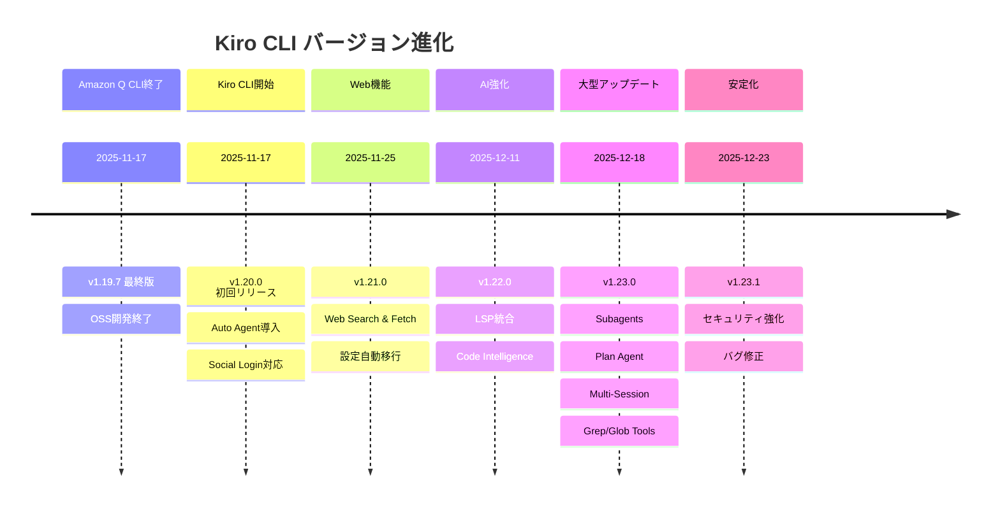

# Kiro CLI アップデート情報

## 📢 概要

このディレクトリでは、Kiro CLI（旧Amazon Q Developer CLI）のアップデート情報とバージョン履歴を管理しています。Amazon Q Developer CLIからKiro CLIへの移行に伴う変更点や新機能について詳細に記録しています。

## 🔍 バージョン履歴確認コマンド

Kiro CLIの全バージョンアップ履歴を確認するには、以下のコマンドを実行してください：

```bash
kiro-cli version --changelog=all
```

このコマンドにより、最新版から初回リリースまでの全バージョンの変更内容を確認できます。

## 📋 ドキュメント一覧

### [01_changelog.md](01_changelog.md)
- **内容**: Kiro CLIの包括的な変更履歴
- **対象バージョン**: v1.20.0（Kiro CLI初回リリース）〜 v1.23.1（最新版）
- **更新頻度**: 新バージョンリリース時
- **情報源**: 公式changelog、Zenn記事、`kiro-cli version --changelog=all`

## 🔄 主要なアップデート

| バージョン | リリース日 | 主要機能 | 概要 |
|-----------|-----------|----------|------|
| **v1.23.1** | 2025-12-23 | セキュリティ強化 | Plan Agentセキュリティ強化、Grep/Glob実行詳細追加、MCPサーバー表示修正 |
| **v1.23.0** | 2025-12-18 | 大型アップデート | Subagents、Plan Agent、Multi-Session、Grep/Globツール |
| **v1.22.0** | 2025-12-11 | Code Intelligence | LSP統合による高精度コード理解、Knowledge Index |
| **v1.21.0** | 2025-11-25 | Web機能 | Web Search & Fetch、リアルタイムWeb情報アクセス |
| **v1.20.0** | 2025-11-17 | 初回リリース | Auto Agent導入、Social Login対応、Claude Haiku 4.5 |

## 📈 バージョン進化の流れ



## 🔗 移行情報

### Amazon Q Developer CLI → Kiro CLI
- **移行日**: 2025年11月17日
- **開発形態**: OSS → クローズドソース
- **ライセンス**: MIT → AWS Intellectual Property License
- **継続性**: 既存ワークフロー・購読は継続

### 主要な変更点
- **新機能**: Auto Agent、Social Login、Claude Haiku 4.5対応
- **技術継承**: Agent機能、MCP統合、Steering Files
- **互換性**: 基本的なコマンド体系は維持

## 📚 関連リンク

### 公式情報
- [Kiro CLI公式サイト](https://kiro.dev/cli/)
- [公式Changelog](https://kiro.dev/changelog/)
- [GitHub Repository](https://github.com/kirodotdev/Kiro)

### 詳細機能ドキュメント
- [機能詳細ガイド](../01_features/README.md) - 各機能の詳細説明
- [LSP統合機能](../01_features/01_LSP.md)
- [サブエージェント機能](../01_features/02_Subagents.md)
- [Planエージェント機能](../01_features/03_PlanAgent.md)
- [マルチセッション機能](../01_features/04_MultiSession.md)
- [Grep/Globツール](../01_features/05_GrepGlob.md)

### コミュニティ
- [Discord Community](https://discord.gg/kirodotdev)
- [旧Amazon Q Developer CLI](https://github.com/aws/amazon-q-developer-cli)

## 🔄 更新方針

### 更新タイミング
- 新バージョンリリース時
- 重要な機能追加・変更時
- セキュリティアップデート時
- コミュニティからの重要なフィードバック時

### 情報源
- `kiro-cli version --changelog=all`コマンド出力
- 公式Changelogページ
- Zenn記事（AWS Japan有志による詳細解説）
- GitHub Issues・Releases

### 品質保証
- 公式情報との整合性確認
- バージョン情報の正確性検証
- リンクの有効性チェック
- 定期的な内容更新

---

**最終更新**: 2025年12月28日  
**対象バージョン**: Kiro CLI v1.23.1
