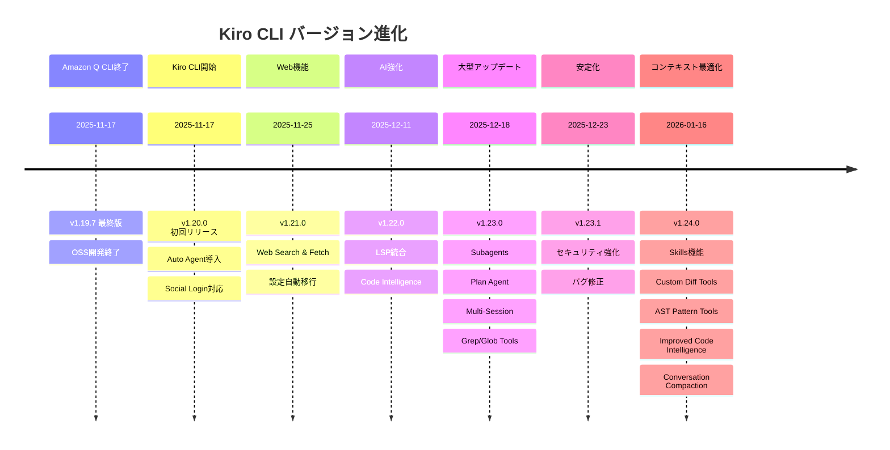

# Kiro CLI アップデート情報

## 📢 概要

このディレクトリでは、Kiro CLI（旧Amazon Q Developer CLI）のアップデート情報とバージョン履歴を管理しています。Amazon Q Developer CLIからKiro CLIへの移行に伴う変更点や新機能について詳細に記録しています。

## 🔍 バージョン履歴確認コマンド

Kiro CLIの全バージョンアップ履歴を確認するには、以下のコマンドを実行してください：

```bash
kiro-cli version --changelog=all
```

このコマンドにより、最新版から初回リリースまでの全バージョンの変更内容を確認できます。

## 📋 ドキュメント一覧

### [01_changelog.md](01_changelog.md)
- **内容**: Kiro CLIの包括的な変更履歴
- **対象バージョン**: v1.20.0（Kiro CLI初回リリース）〜 v1.23.1（最新版）
- **更新頻度**: 新バージョンリリース時
- **情報源**: 公式changelog、Zenn記事、`kiro-cli version --changelog=all`

## 🔄 主要なアップデート

| バージョン | リリース日 | 主要機能 | 概要 |
|-----------|-----------|----------|------|
| **v1.24.0** | 2026-01-16 | コンテキスト最適化 | Skills、Custom Diff Tools、AST Pattern Tools、Improved Code Intelligence、Conversation Compaction、URL Permissions、Remote Auth |
| **v1.23.1** | 2025-12-23 | セキュリティ強化 | Plan Agentセキュリティ強化、Grep/Glob実行詳細追加、MCPサーバー表示修正 |
| **v1.23.0** | 2025-12-18 | 大型アップデート | Subagents、Plan Agent、Multi-Session、Grep/Globツール |
| **v1.22.0** | 2025-12-11 | Code Intelligence | LSP統合による高精度コード理解、Knowledge Index |
| **v1.21.0** | 2025-11-25 | Web機能 | Web Search & Fetch、リアルタイムWeb情報アクセス |
| **v1.20.0** | 2025-11-17 | 初回リリース | Auto Agent導入、Social Login対応、Claude Haiku 4.5 |

## 🎯 v1.24.0 詳細（2026-01-16）

### 主要機能

Kiro CLI v1.24.0では、**7つの主要機能**が追加されました：

#### 1. Skills機能（Progressive Context Loading）
- **概要**: 大規模ドキュメント向けの段階的コンテキストロード
- **特徴**: メタデータのみ起動時、本文はオンデマンド
- **詳細**: [kiro-docs/01_features/07_Skills.md](../01_features/07_Skills.md)

#### 2. Custom Diff Tools機能
- **概要**: 外部Diffツール統合（15種類対応）
- **特徴**: delta、difftastic、VS Code等
- **詳細**: [kiro-docs/01_features/08_CustomDiffTools.md](../01_features/08_CustomDiffTools.md)

#### 3. AST Pattern Tools機能（Precise Refactoring）
- **概要**: 構文木ベースの精密なコード検索・変換
- **特徴**: 誤検出排除、安全なリファクタリング
- **詳細**: [kiro-docs/01_features/09_ASTPatternTools.md](../01_features/09_ASTPatternTools.md)

#### 4. Improved Code Intelligence
- **概要**: 18言語組み込み対応（v1.22.0は7言語）
- **特徴**: /code overviewコマンド追加
- **詳細**: [kiro-docs/01_features/01_LSP.md](../01_features/01_LSP.md)

#### 5. Conversation Compaction機能
- **概要**: 会話履歴の圧縮でコンテキストスペースを解放
- **特徴**: 手動・自動実行、元セッション復帰可能
- **詳細**: [kiro-docs/01_features/10_ConversationCompaction.md](../01_features/10_ConversationCompaction.md)

#### 6. Granular URL Permissions機能
- **概要**: web_fetchツールのURL権限細粒度制御
- **特徴**: 正規表現パターン、信頼・ブロックパターン
- **詳細**: [kiro-docs/01_features/11_URLPermissions.md](../01_features/11_URLPermissions.md)

#### 7. Remote Authentication機能
- **概要**: リモートマシンでのGoogle/GitHub認証対応
- **特徴**: SSH/SSM/コンテナ環境対応
- **詳細**: [kiro-docs/01_features/12_RemoteAuth.md](../01_features/12_RemoteAuth.md)

### 影響範囲

- **コンテキスト管理**: Skills、Conversation Compactionで大幅改善
- **開発体験**: Custom Diff Tools、AST Pattern Toolsで効率化
- **セキュリティ**: Granular URL Permissionsで強化
- **リモート対応**: Remote Authenticationで柔軟性向上
- **コード理解**: 18言語対応で適用範囲拡大

## 📈 バージョン進化の流れ



## 🔗 移行情報

### Amazon Q Developer CLI → Kiro CLI
- **移行日**: 2025年11月17日
- **開発形態**: OSS → クローズドソース
- **ライセンス**: MIT → AWS Intellectual Property License
- **継続性**: 既存ワークフロー・購読は継続

### 主要な変更点
- **新機能**: Auto Agent、Social Login、Claude Haiku 4.5対応
- **技術継承**: Agent機能、MCP統合、Steering Files
- **互換性**: 基本的なコマンド体系は維持

## 📚 関連リンク

### 公式情報
- [Kiro CLI公式サイト](https://kiro.dev/cli/)
- [公式Changelog](https://kiro.dev/changelog/)
- [GitHub Repository](https://github.com/kirodotdev/Kiro)

### 詳細機能ドキュメント
- [機能詳細ガイド](../01_features/README.md) - 各機能の詳細説明
- [LSP統合機能](../01_features/01_LSP.md)
- [サブエージェント機能](../01_features/02_Subagents.md)
- [Planエージェント機能](../01_features/03_PlanAgent.md)
- [マルチセッション機能](../01_features/04_MultiSession.md)
- [Grep/Globツール](../01_features/05_GrepGlob.md)

### コミュニティ
- [Discord Community](https://discord.gg/kirodotdev)
- [旧Amazon Q Developer CLI](https://github.com/aws/amazon-q-developer-cli)

## 🔄 更新方針

### 更新タイミング
- 新バージョンリリース時
- 重要な機能追加・変更時
- セキュリティアップデート時
- コミュニティからの重要なフィードバック時

### 情報源
- `kiro-cli version --changelog=all`コマンド出力
- 公式Changelogページ
- Zenn記事（AWS Japan有志による詳細解説）
- GitHub Issues・Releases

### 品質保証
- 公式情報との整合性確認
- バージョン情報の正確性検証
- リンクの有効性チェック
- 定期的な内容更新

---

**最終更新**: 2026年1月18日  
**対象バージョン**: Kiro CLI v1.24.0
