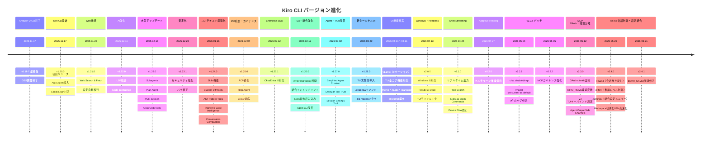

# Kiro CLI アップデート情報

## 📢 概要

このディレクトリでは、Kiro CLI（旧Amazon Q Developer CLI）のアップデート情報とバージョン履歴を管理しています。Amazon Q Developer CLIからKiro CLIへの移行に伴う変更点や新機能について詳細に記録しています。

## 🔍 バージョン履歴確認コマンド

Kiro CLIの全バージョンアップ履歴を確認するには、以下のコマンドを実行してください：

```bash
kiro-cli version --changelog=all
```

このコマンドにより、最新版から初回リリースまでの全バージョンの変更内容を確認できます。

## 📋 ドキュメント一覧

### [01_changelog.md](01_changelog.md)
- **内容**: Kiro CLIの包括的な変更履歴
- **対象バージョン**: v1.20.0（Kiro CLI初回リリース）〜 v2.4.1（最新版）
- **更新頻度**: 新バージョンリリース時
- **情報源**: 公式changelog、Zenn記事、`kiro-cli version --changelog=all`

## 🔄 主要なアップデート

| バージョン | リリース日 | 主要機能 | 概要 |
|-----------|-----------|----------|------|
| **v2.4.1** | 2026-05-21 | MCP環境変数修正 | ${VAR_NAME}環境変数展開の修正 |
| **v2.4.0** | 2026-05-20 | /rewind・/effort・/settings | 会話巻き戻し、推論レベル制御、統合設定メニュー、88%高速化 |
| **v2.3.0** | 2026-05-12 | MCP OAuth・KIRO_HOME・Keybindings | OAuth clientId設定、KIRO_HOME環境変数、V2 TUIキーバインド設定、Agent Output Side Channels |
| **v2.2.2** | 2026-05-05 | MCPガバナンス強化 | V2 TUIモードでのMCP governance強制適用（エンタープライズ・API keyユーザー） |
| **v2.2.1** | 2026-05-04 | UX改善・安定性修正 | chat.disableWrap設定追加、/model set-current-as-defaultの保存先変更、/agent swapオートコンプリート、9件のバグ修正 |
| **v2.2.0** | 2026-04-27 | Adaptive Thinking | マルチターン会話でモデル推論保持、応答品質向上 |
| **v2.1.0** | 2026-04-24 | Shell Streaming・Tool Search | リアルタイム出力ストリーミング、Skills as Slash Commands、Device Flow認証 |
| **v2.0.0** | 2026-04-13 | Windows・Headless | Windows 11ネイティブ対応、CI/CD Headless Mode、新TUIデフォルト化 |
| **v1.29.x** | 2026-04-01〜04-11 | TUI機能充実 | TUI全コア機能対応、/theme、/guide、/transcript、@prompt構文 |
| **v1.28.0** | 2026-03-20 | 新ターミナルUI | TUI実験的導入、/chat new、--list-models |
| **v1.27.0** | 2026-03-02 | Agent・Trust改善 | Simplified Agent Creation、Granular Tool Trust、Session Settings |
| **v1.26.0** | 2026-02-12 | UX・統合強化 | @file/@directory展開、統合エントリポイント、Skills自動読み込み、Agent CLI改善 |
| **v1.25.1** | 2026-02-12 | Enterprise SSO | Okta/Microsoft Entra ID対応 |
| **v1.25.0** | 2026-02-04 | IDE統合・ガバナンス | ACP、Help Agent、Exit Codes、Subagent Access Control、Enterprise Web Tools |
| **v1.24.0** | 2026-01-16 | コンテキスト最適化 | Skills、Custom Diff Tools、AST Pattern Tools、Improved Code Intelligence、Conversation Compaction、URL Permissions、Remote Auth |
| **v1.23.1** | 2025-12-23 | セキュリティ強化 | Plan Agentセキュリティ強化、Grep/Glob実行詳細追加、MCPサーバー表示修正 |
| **v1.23.0** | 2025-12-18 | 大型アップデート | Subagents、Plan Agent、Multi-Session、Grep/Globツール |
| **v1.22.0** | 2025-12-11 | Code Intelligence | LSP統合による高精度コード理解、Knowledge Index |
| **v1.21.0** | 2025-11-25 | Web機能 | Web Search & Fetch、リアルタイムWeb情報アクセス |
| **v1.20.0** | 2025-11-17 | 初回リリース | Auto Agent導入、Social Login対応、Claude Haiku 4.5 |

## 📈 バージョン進化の流れ


```mermaid
timeline
    title Kiro CLI バージョン進化
    
    section Amazon Q CLI終了
        2025-11-17 : v1.19.7 最終版
                   : OSS開発終了
    
    section Kiro CLI開始
        2025-11-17 : v1.20.0 初回リリース
                   : Auto Agent導入
                   : Social Login対応
    
    section Web機能
        2025-11-25 : v1.21.0
                   : Web Search & Fetch
                   : 設定自動移行
    
    section AI強化
        2025-12-11 : v1.22.0
                   : LSP統合
                   : Code Intelligence
    
    section 大型アップデート
        2025-12-18 : v1.23.0
                   : Subagents
                   : Plan Agent
                   : Multi-Session
                   : Grep/Glob Tools
    
    section 安定化
        2025-12-23 : v1.23.1
                   : セキュリティ強化
                   : バグ修正
    
    section コンテキスト最適化
        2026-01-16 : v1.24.0
                   : Skills機能
                   : Custom Diff Tools
                   : AST Pattern Tools
                   : Improved Code Intelligence
                   : Conversation Compaction
    
    section IDE統合・ガバナンス
        2026-02-04 : v1.25.0
                   : ACP統合
                   : Help Agent
                   : CI/CD対応
    
    section Enterprise SSO
        2026-02-12 : v1.25.1
                   : Okta/Entra ID対応
    
    section UX・統合強化
        2026-02-12 : v1.26.0
                   : @file/@directory展開
                   : 統合エントリポイント
                   : Skills自動読み込み
                   : Agent CLI改善
    
    section Agent・Trust改善
        2026-03-02 : v1.27.0
                   : Simplified Agent Creation
                   : Granular Tool Trust
                   : Session Settings Tool
    
    section 新ターミナルUI
        2026-03-20 : v1.28.0
                   : TUI実験的導入
                   : /chat newコマンド
                   : --list-modelsフラグ
    
    section TUI機能充実
        2026-04-01〜04-11 : v1.29.x（9バージョン）
                          : TUI全コア機能対応
                          : /theme・/guide・/transcript
                          : @prompt構文
    
    section Windows・Headless
        2026-04-13 : v2.0.0
                   : Windows 11対応
                   : Headless Mode
                   : TUIデフォルト化
    
    section Shell Streaming
        2026-04-24 : v2.1.0
                   : リアルタイム出力
                   : Tool Search
                   : Skills as Slash Commands
                   : Device Flow認証
    
    section Adaptive Thinking
        2026-04-27 : v2.2.0
                   : マルチターン推論保持
    
    section v2.2.x パッチ
        2026-05-04 : v2.2.1
                   : chat.disableWrap
                   : /model set-current-as-default
                   : 9件のバグ修正
        2026-05-05 : v2.2.2
                   : MCPガバナンス強化
    
    section MCP OAuth・環境分離
        2026-05-12 : v2.3.0
                   : OAuth clientId設定
                   : KIRO_HOME環境変数
                   : V2 TUIキーバインド設定
                   : Agent Output Side Channels
    
    section v2.4.x 会話制御・設定統合
        2026-05-20 : v2.4.0
                   : /rewind（会話巻き戻し）
                   : /effort（推論レベル制御）
                   : /settings（統合設定メニュー）
                   : Workspace初期化88%高速化
        2026-05-21 : v2.4.1
                   : ${VAR_NAME}展開修正
```

## 🔗 移行情報

### Amazon Q Developer CLI → Kiro CLI
- **移行日**: 2025年11月17日
- **開発形態**: OSS → クローズドソース
- **ライセンス**: MIT → AWS Intellectual Property License
- **継続性**: 既存ワークフロー・購読は継続

### 主要な変更点
- **新機能**: Auto Agent、Social Login、Claude Haiku 4.5対応
- **技術継承**: Agent機能、MCP統合、Steering Files
- **互換性**: 基本的なコマンド体系は維持

## 📚 関連リンク

### 公式情報
- [Kiro CLI公式サイト](https://kiro.dev/cli/)
- [公式Changelog](https://kiro.dev/changelog/)
- [GitHub Repository](https://github.com/kirodotdev/Kiro)

### 詳細機能ドキュメント
- [機能詳細ガイド](../01_features/README.md) - 各機能の詳細説明
- [LSP統合機能](../01_features/01_LSP.md)
- [サブエージェント機能](../01_features/02_Subagents.md)
- [Planエージェント機能](../01_features/03_PlanAgent.md)
- [マルチセッション機能](../01_features/04_MultiSession.md)
- [Grep/Globツール](../01_features/05_GrepGlob.md)
- [/usage コマンド](../01_features/06_UsageCommand.md)
- [Skills機能](../01_features/07_Skills.md)
- [Custom Diff Tools機能](../01_features/08_CustomDiffTools.md)
- [AST Pattern Tools機能](../01_features/09_ASTPatternTools.md)
- [Conversation Compaction機能](../01_features/10_ConversationCompaction.md)
- [Granular URL Permissions機能](../01_features/11_URLPermissions.md)
- [Remote Authentication機能](../01_features/12_RemoteAuth.md)
- [Agent Client Protocol (ACP)](../01_features/13_ACP.md)
- [Help Agent](../01_features/14_HelpAgent.md)
- [Exit Codes for CI/CD](../01_features/15_ExitCodes.md)
- [v2.0.0メジャーアップデート](../01_features/16_v2MajorUpdate.md)
- [Granular Tool Trust機能](../01_features/17_GranularToolTrust.md)
- [Terminal UI機能](../01_features/18_TerminalUI.md)
- [Kiro guide agent](../01_features/20_GuideAgent.md) 🆕 - TUI 専用のオンボーディング・ヘルプ用組み込みエージェント（v1.29.7）
- [Tool Search機能](../01_features/19_ToolSearch.md)
- [v2.4新コマンド（/rewind, /effort, /settings）](../01_features/21_v24NewCommands.md) 🆕 - 会話巻き戻し、推論レベル制御、統合設定メニュー（v2.4.0）
- [Smart Hooks](../01_features/22_Hooks.md) 🆕 - エージェントライフサイクル拡張（5種フック、Q CLI由来・公式公開 v1.29.6）
- [Agent Steering](../01_features/23_Steering.md) 🆕 - 永続的プロジェクト規約注入（AGENTS.md対応、Q CLI由来・公式公開 v1.20.0+）
- [@file references（File References）](../01_features/24_FileReferences.md) 🆕 - チャット入力でファイル/ディレクトリ即時参照（v1.26.0）
- [Auto Complete](../01_features/25_AutoComplete.md) 🆕 - ターミナルAI補完（ドロップダウン+インライン、Q CLI由来）
- [Agent Toolkit for AWS](../01_features/26_AgentToolkitForAWS.md) 🌟 - AWS 公式エージェント統合ツールキット（2026-05-06 GA、Kiro CLI 公式対応）

### リファレンス（辞書） 🆕
- [04_reference/](../04_reference/README.md) — Settings / Slash Commands / CLI Commands / Built-in Tools の網羅的辞書

### コミュニティ
- [Discord Community](https://discord.gg/kirodotdev)
- [旧Amazon Q Developer CLI](https://github.com/aws/amazon-q-developer-cli)

## 🔄 更新方針

### 更新タイミング
- 新バージョンリリース時
- 重要な機能追加・変更時
- セキュリティアップデート時
- コミュニティからの重要なフィードバック時

### 情報源
- `kiro-cli version --changelog=all`コマンド出力
- 公式Changelogページ
- Zenn記事（AWS Japan有志による詳細解説）
- GitHub Issues・Releases

### 品質保証
- 公式情報との整合性確認
- バージョン情報の正確性検証
- リンクの有効性チェック
- 定期的な内容更新

---

**最終更新**: 2026年5月24日  
**対象バージョン**: Kiro CLI v2.4.1
