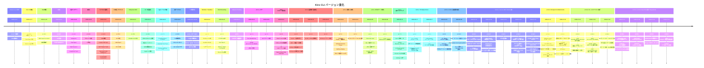

# Kiro CLI アップデート情報

## 📢 概要

このディレクトリでは、Kiro CLI（旧Amazon Q Developer CLI）のアップデート情報とバージョン履歴を管理しています。Amazon Q Developer CLIからKiro CLIへの移行に伴う変更点や新機能について詳細に記録しています。

## 🔍 バージョン履歴確認コマンド

Kiro CLIの全バージョンアップ履歴を確認するには、以下のコマンドを実行してください：

```bash
kiro-cli version --changelog=all
```

このコマンドにより、最新版から初回リリースまでの全バージョンの変更内容を確認できます。

## 📋 ドキュメント一覧

### [01_changelog.md](01_changelog.md)
- **内容**: Kiro CLIの包括的な変更履歴
- **対象バージョン**: v1.20.0（Kiro CLI初回リリース）〜 v2.16.0（本サイト反映済。v2.8.0 で CLI v3 Early Access）
- **更新頻度**: 新バージョンリリース時
- **情報源**: 公式changelog、Zenn記事、`kiro-cli version --changelog=all`

## 🔄 主要なアップデート

| バージョン | リリース日 | 主要機能 | 概要 |
|-----------|-----------|----------|------|
| **v2.16.0** | 2026-07-31 | [V3] `/tangent`（名前付き側枝会話）・`/context`ツール別内訳 | [V3] 名前付き・ネスト可能な側枝会話`/tangent`（既存classic版とは別仕様、ビジュアルピッカー`/tangent ls`対応）、`/context`のツール別トークン内訳表示、`/model`切替時のコンテキスト使用率再計算修正 |
| **v2.15.2** | 2026-07-29 | `update.baseUrl`ポリシー・KIRO_API_KEY案内 | IT管理者向け`update.baseUrl`管理ポリシー（macOS MDM/Windows Group Policy）、`login`・`logout`が`KIRO_API_KEY`のunset要否を案内 |
| **v2.15.1** | 2026-07-28 | [V3]限定バグ修正5件 | Hooks `confirmCommand`、GPT `invalid_union`修正、workspace-scope policy永続化、`/tools`リフレッシュ、`.kiroignore`書き込みブロック |
| **v2.15.0** | 2026-07-27 | [V3] `/spec new`ガイド化・Plan mode自動実行 | `/spec new`にガイド付き説明ステップ追加、Plan mode承認後の自動実行、`chat.showThinkingTips`設定追加、`@prompt`参照・classicモードtrust prompt警告の修正 |
| **v2.14.2** | 2026-07-24 | EUテレメトリのリージョンローカル化・モデル拒否メッセージ具体化 | テレメトリを EU ユーザー向けリージョンローカルエンドポイントへ送信、モデル拒否メッセージが `/model`・`/rewind`・`/chat new` を提示、TUI 強制色検出時のカラーコード漏れ修正、kitty 互換端末の終了後問題修正（※公式Changelogサイト未掲載・CLI内蔵changelogで確認） |
| **v2.14.1** | 2026-07-23 | /model・/effort のセッション限定化（方針転換） | `/effort set-current-as-default` 追加、起動スピナー追加、`/model`・`/effort` の選択がセッション限定へ回帰（既定化には `set-current-as-default`）、MCP の `structuredContent` 応答でのツール呼び出し失敗修正、終了時のターミナルモード復元修正 |
| **v2.14.0** | 2026-07-22 | [V3] /upgrade-agent（V2 → V3 エージェント設定移行） | V2 エージェント設定を V2/V3 両対応の universal 形式へ変換する `/upgrade-agent`（`run`・`diagnostics`）、[V3] 自動ストリームリトライ、待機中の機能ヒント表示、`Ctrl+Z` 後の制御キー修復、[V3] `/plan` デッドロック・supervised 承認永続化ほか修正 |
| **v2.13.1** | 2026-07-22 | エラー区別・Windows 安定性のバグ修正 | モデル過負荷と月次クォータのエラーを区別、`/context` の重複ファイル列挙修正、`/agent generate` のコードフェンス対応、Windows で MCP のコンソールウィンドウ非表示化・レジストリアクセスエラーの抑制 |
| **v2.13.0** | 2026-07-17 | [V3] Introspect サブエージェント・グローバル hooks | [V3] Kiro 機能説明の組み込みサブエージェント（カスタム agent/hooks/steering 作成支援）、`~/.kiro/hooks/` の全ワークスペース自動適用、モデル拒否エラーのスクロールバック表示化、レート制限エラー永続化、[V3] Always-accept バックスラッシュループ修正・`HTTP_PROXY`/`HTTPS_PROXY` 尊重 |
| **v2.12.3** | 2026-07-15 | /model・/effort sticky default・MCP OAuth User-Agent | `/model`・`/effort` の恒久デフォルト化（`chat.disableAutoDefaultModel`/`chat.disableAutoDefaultEffort` でオプトアウト。※**v2.14.1 でセッション限定へ回帰**し、両設定は v2.14.2 実機では存在しません）、Welcome 起動 tip、MCP OAuth discovery の User-Agent 送信（CloudFront WAF 背後の 403 解消）、V3 `/chat` パス復元・diff 配色・shell `!` 固着修正 |
| **v2.12.2** | 2026-07-14 | バグ修正（ACP・セッション・非対話） | ACP `--agent` を新規セッションごとに適用（デフォルトエージェント/MCPへのフォールバック防止）、アクティブセッション再読込で旧インスタンス終了（MCPサーバープロセスのリーク防止）、stdin パイプ/非対話時に `chat` が TUI 非描画 |
| **v2.12.1** | 2026-07-09 | モデル拒否通知 | モデルがリクエストを拒否した理由をエラーアラートで表示 |
| **v2.12.0** | 2026-07-09 | MCP OAuth 拡張（事前登録アプリ） | `clientSecret`（confidential client）、`redirectUri` フルURL＋loopback検証、カスタム `clientId` 時 DCR スキップ、全TUIグリフの ASCIIモード尊重、shell 権限検出器の結合ショートオプション検出（セキュリティ） |
| **v2.11.0** | 2026-07-02 | MCP 認証管理コマンド・/usage 刷新 | `/mcp auth`・`/mcp cancel-auth`・`/mcp logout`（リモートMCPのOAuth再認証/中止/資格情報削除）、MCPパネルショートカット `^A`/`^X`/`^R`、`/usage` プリペイド「Additional credits」表示（cap無しはバー非表示）、Fixed 6件 |
| **v2.10.0** | 2026-06-26 | 設定ホットリロード・リソース継承制御 | MCP・エージェント設定のホットリロード（file watcher、変更サーバーのみ再起動、会話コンテキスト保持）、`chat.disableInheritingDefaultResources`（既定リソース継承のオプトアウト）、メニュー操作ヒント、Windows RCE（CWE-426）堅牢化 |
| **v2.9.0** | 2026-06-24 | V3安定化・Entra ID修正 | [V3] ツールカード1行プレビュー（ctrl+o）、Entra ID セッション更新修正、カスタムエージェント二重読込修正、[V3] 各種UX修正（機能追加なし） |
| **v2.8.1** | 2026-06-17 | MCP OAuth / spec 表示の改善 | MCP OAuth のクリップボードコピー・パネル確認表示、Welcome リンクを V3 docs へ、spec ワークフロー中の subagent 表示修正 |
| **v2.8.0** | 2026-06-17 | CLI v3 Early Access | `kiro-cli --v3` で V3 エンジン先行公開（2.x 併存）。統一エンジン＋仕様駆動開発・permissions.yaml・強化版 Hooks・タグ Agent設定（→ [09_v3/](../09_v3/README.md)） |
| **v2.7.1** | 2026-06-16 | web ツール無効化警告・各種修正 | web ツール無効化時の警告通知、Windows マップドライブ glob 修正、`--classic` 再開モデル復元、drill-in フィードバック同一ターン到達 |
| **v2.7.0** | 2026-06-12 | /goal・Queue Steering・enriched /rewind | 自律ループ実行(/goal、5反復既定/--max)、ターン中介入(Ctrl+S で steer/queue 切替、chat.defaultInterruptBehavior)、/rewind preview拡張(ツール呼出・ファイル変更・コンテキスト使用量)、chat.terminalTitle設定追加、/settings overlay統一・theme Customウィザード化 |
| **v2.6.1** | 2026-06-08 | Linux: libasound.so.2 依存除去 | Linuxビルドが起動時に libasound.so.2 を要求しなくなる（オーディオ依存パッケージ不要） |
| **v2.6.0** | 2026-06-05 | Transcript Export・/title・永続化 | 会話エクスポート(md/plain/json)、端末ウィンドウタイトル、--effort起動フラグ、/model・/effort自動永続化、/knowledge全KB一括更新 |
| **v2.5.1** | 2026-06-01 | APIエンドポイント移行 | `*.kiro.dev`へ移行（firewall許可リスト要確認） |
| **v2.5.0** | 2026-05-29 | Thinking Display・Review Loops | 推論リアルタイム表示（既定有効）、subagentレビューループ、/settings display、プロンプト履歴のセッション単位化 |
| **v2.4.2** | 2026-05-26 | Windowsクラッシュ修正 | koffi/createRequire起因のWindows端末入力クラッシュ修正 |
| **v2.4.1** | 2026-05-21 | MCP環境変数修正 | ${VAR_NAME}環境変数展開の修正 |
| **v2.4.0** | 2026-05-20 | /rewind・/effort・/settings | 会話巻き戻し、推論レベル制御、統合設定メニュー、88%高速化 |
| **v2.3.0** | 2026-05-12 | MCP OAuth・KIRO_HOME・Keybindings | OAuth clientId設定、KIRO_HOME環境変数、V2 TUIキーバインド設定、Agent Output Side Channels |
| **v2.2.2** | 2026-05-05 | MCPガバナンス強化 | V2 TUIモードでのMCP governance強制適用（エンタープライズ・API keyユーザー） |
| **v2.2.1** | 2026-05-04 | UX改善・安定性修正 | chat.disableWrap設定追加、/model set-current-as-defaultの保存先変更、/agent swapオートコンプリート、9件のバグ修正 |
| **v2.2.0** | 2026-04-27 | Adaptive Thinking | マルチターン会話でモデル推論保持、応答品質向上 |
| **v2.1.0** | 2026-04-24 | Shell Streaming・Tool Search | リアルタイム出力ストリーミング、Skills as Slash Commands、Device Flow認証 |
| **v2.0.0** | 2026-04-13 | Windows・Headless | Windows 11ネイティブ対応、CI/CD Headless Mode、新TUIデフォルト化 |
| **v1.29.x** | 2026-04-01〜04-11 | TUI機能充実 | TUI全コア機能対応、/theme、/guide、/transcript、@prompt構文 |
| **v1.28.0** | 2026-03-20 | 新ターミナルUI | TUI実験的導入、/chat new、--list-models |
| **v1.27.0** | 2026-03-02 | Agent・Trust改善 | Simplified Agent Creation、Granular Tool Trust、Session Settings |
| **v1.26.0** | 2026-02-12 | UX・統合強化 | @file/@directory展開、統合エントリポイント、Skills自動読み込み、Agent CLI改善 |
| **v1.25.1** | 2026-02-12 | Enterprise SSO | Okta/Microsoft Entra ID対応 |
| **v1.25.0** | 2026-02-04 | IDE統合・ガバナンス | ACP、Help Agent、Exit Codes、Subagent Access Control、Enterprise Web Tools |
| **v1.24.0** | 2026-01-16 | コンテキスト最適化 | Skills、Custom Diff Tools、AST Pattern Tools、Improved Code Intelligence、Conversation Compaction、URL Permissions、Remote Auth |
| **v1.23.1** | 2025-12-23 | セキュリティ強化 | Plan Agentセキュリティ強化、Grep/Glob実行詳細追加、MCPサーバー表示修正 |
| **v1.23.0** | 2025-12-18 | 大型アップデート | Subagents、Plan Agent、Multi-Session、Grep/Globツール |
| **v1.22.0** | 2025-12-11 | Code Intelligence | LSP統合による高精度コード理解、Knowledge Index |
| **v1.21.0** | 2025-11-25 | Web機能 | Web Search & Fetch、リアルタイムWeb情報アクセス |
| **v1.20.0** | 2025-11-17 | 初回リリース | Auto Agent導入、Social Login対応、Claude Haiku 4.5 |

## 📈 バージョン進化の流れ


```mermaid
timeline
    title Kiro CLI バージョン進化
    
    section Amazon Q CLI終了
        2025-11-17 : v1.19.7 最終版
                   : OSS開発終了
    
    section Kiro CLI開始
        2025-11-17 : v1.20.0 初回リリース
                   : Auto Agent導入
                   : Social Login対応
    
    section Web機能
        2025-11-25 : v1.21.0
                   : Web Search & Fetch
                   : 設定自動移行
    
    section AI強化
        2025-12-11 : v1.22.0
                   : LSP統合
                   : Code Intelligence
    
    section 大型アップデート
        2025-12-18 : v1.23.0
                   : Subagents
                   : Plan Agent
                   : Multi-Session
                   : Grep/Glob Tools
    
    section 安定化
        2025-12-23 : v1.23.1
                   : セキュリティ強化
                   : バグ修正
    
    section コンテキスト最適化
        2026-01-16 : v1.24.0
                   : Skills機能
                   : Custom Diff Tools
                   : AST Pattern Tools
                   : Improved Code Intelligence
                   : Conversation Compaction
    
    section IDE統合・ガバナンス
        2026-02-04 : v1.25.0
                   : ACP統合
                   : Help Agent
                   : CI/CD対応
    
    section Enterprise SSO
        2026-02-12 : v1.25.1
                   : Okta/Entra ID対応
    
    section UX・統合強化
        2026-02-12 : v1.26.0
                   : @file/@directory展開
                   : 統合エントリポイント
                   : Skills自動読み込み
                   : Agent CLI改善
    
    section Agent・Trust改善
        2026-03-02 : v1.27.0
                   : Simplified Agent Creation
                   : Granular Tool Trust
                   : Session Settings Tool
    
    section 新ターミナルUI
        2026-03-20 : v1.28.0
                   : TUI実験的導入
                   : /chat newコマンド
                   : --list-modelsフラグ
    
    section TUI機能充実
        2026-04-01〜04-11 : v1.29.x（9バージョン）
                          : TUI全コア機能対応
                          : /theme・/guide・/transcript
                          : @prompt構文
    
    section Windows・Headless
        2026-04-13 : v2.0.0
                   : Windows 11対応
                   : Headless Mode
                   : TUIデフォルト化
    
    section Shell Streaming
        2026-04-24 : v2.1.0
                   : リアルタイム出力
                   : Tool Search
                   : Skills as Slash Commands
                   : Device Flow認証
    
    section Adaptive Thinking
        2026-04-27 : v2.2.0
                   : マルチターン推論保持
    
    section v2.2.x パッチ
        2026-05-04 : v2.2.1
                   : chat.disableWrap
                   : /model set-current-as-default
                   : 9件のバグ修正
        2026-05-05 : v2.2.2
                   : MCPガバナンス強化
    
    section MCP OAuth・環境分離
        2026-05-12 : v2.3.0
                   : OAuth clientId設定
                   : KIRO_HOME環境変数
                   : V2 TUIキーバインド設定
                   : Agent Output Side Channels
    
    section v2.4.x 会話制御・設定統合
        2026-05-20 : v2.4.0
                   : /rewind（会話巻き戻し）
                   : /effort（推論レベル制御）
                   : /settings（統合設定メニュー）
                   : Workspace初期化88%高速化
        2026-05-21 : v2.4.1
                   : ${VAR_NAME}展開修正
        2026-05-26 : v2.4.2
                   : Windowsクラッシュ修正

    section v2.5.x 透明性・自律性
        2026-05-29 : v2.5.0
                   : Thinking Display（推論表示）
                   : Subagent Review Loops
                   : /settings display
                   : プロンプト履歴セッション化
        2026-06-01 : v2.5.1
                   : APIエンドポイント*.kiro.dev移行

    section v2.6.x エクスポート・永続化
        2026-06-05 : v2.6.0
                   : /transcript save
                   : /title（端末タイトル）
                   : --effort 起動フラグ
                   : /model・/effort 自動永続化
        2026-06-08 : v2.6.1
                   : Linux libasound.so.2依存除去

    section v2.7.x 自律・ステアリング
        2026-06-12 : v2.7.0
                   : /goal（自律ループ）
                   : Queue Steering（Ctrl+S）
                   : enriched /rewind preview
                   : chat.terminalTitle設定
                   : /settings UI統一

    section v2.8.x / V3 Early Access
        2026-06-17 : v2.8.0
                   : CLI v3 Early Access（--v3）
                   : 統一エンジン＋仕様駆動開発
                   : permissions.yaml / 強化版Hooks / タグAgent設定
        2026-06-17 : v2.8.1
                   : MCP OAuth クリップボードコピー
                   : spec ワークフロー表示改善

    section v2.9.x / v2.10.x 設定運用の強化
        2026-06-24 : v2.9.0
                   : V3（Early Access）安定化
                   : Entra ID セッション更新修正
                   : カスタムエージェント二重読込修正
        2026-06-26 : v2.10.0
                   : MCP・エージェント設定ホットリロード
                   : chat.disableInheritingDefaultResources
                   : メニュー操作ヒント / Windows RCE 堅牢化

    section v2.11.x / v2.12.x MCP OAuth 強化
        2026-07-02 : v2.11.0
                   : /mcp auth・cancel-auth・logout
                   : MCPパネルショートカット（^A/^X/^R）
                   : /usage プリペイド表示刷新
        2026-07-09 : v2.12.0
                   : MCP OAuth 事前登録アプリ対応
                   : clientSecret / redirectUri / DCRスキップ
                   : ASCIIモード全グリフ適用・shell権限検出強化
        2026-07-09 : v2.12.1
                   : モデル拒否通知
        2026-07-14 : v2.12.2
                   : ACP --agent を新規セッション毎に適用
                   : セッション再読込で MCP プロセスリーク防止
                   : 非対話 stdin で TUI 非描画
        2026-07-15 : v2.12.3
                   : /model・/effort sticky default
                   : chat.disableAutoDefaultModel/Effort でオプトアウト
                   : MCP OAuth User-Agent（CloudFront 403 解消）

    section v2.13.x Introspect & Global Hooks
        2026-07-17 : v2.13.0
                   : [V3] Introspect サブエージェント
                   : [V3] グローバル hooks（~/.kiro/hooks/）
                   : モデル拒否エラー表示改善・レート制限永続化
                   : [V3] HTTP(S)_PROXY 尊重
        2026-07-22 : v2.13.1
                   : 過負荷/月次クォータのエラー区別
                   : /context 重複列挙・/agent generate 修正
                   : Windows: MCPコンソール非表示・レジストリ抑制

    section v2.14.x V2→V3 エージェント移行
        2026-07-22 : v2.14.0
                   : [V3] /upgrade-agent（universal 形式へ変換）
                   : [V3] 自動ストリームリトライ
                   : 待機中の機能ヒント表示
        2026-07-23 : v2.14.1
                   : /effort set-current-as-default
                   : /model・/effort をセッション限定へ回帰
                   : MCP structuredContent 修正・端末モード復元
        2026-07-24 : v2.14.2
                   : EUテレメトリのリージョンローカル化
                   : モデル拒否メッセージの具体化
                   : カラーコード漏れ・kitty端末の修正

    section v2.15.x / v2.16.0 Spec/Plan強化・Tangent(V3)
        2026-07-27 : v2.15.0
                   : [V3] /spec new ガイド付き説明ステップ
                   : [V3] Plan mode自動実行
                   : chat.showThinkingTips設定追加
        2026-07-28 : v2.15.1
                   : [V3] Hooks confirmCommand
                   : [V3] GPT invalid_union修正
        2026-07-29 : v2.15.2
                   : update.baseUrl管理ポリシー
                   : login/logoutのKIRO_API_KEY案内
        2026-07-31 : v2.16.0
                   : [V3] /tangent（名前付き側枝会話）
                   : /context ツール別トークン内訳
```

## 🔗 移行情報

### Amazon Q Developer CLI → Kiro CLI
- **移行日**: 2025年11月17日
- **開発形態**: OSS → クローズドソース
- **ライセンス**: MIT → AWS Intellectual Property License
- **継続性**: 既存ワークフロー・購読は継続

### 主要な変更点
- **新機能**: Auto Agent、Social Login、Claude Haiku 4.5対応
- **技術継承**: Agent機能、MCP統合、Steering Files
- **互換性**: 基本的なコマンド体系は維持

## 📚 関連リンク

### 公式情報
- [Kiro CLI公式サイト](https://kiro.dev/cli/)
- [公式Changelog](https://kiro.dev/changelog/)
- [GitHub Repository](https://github.com/kirodotdev/Kiro)

### 詳細機能ドキュメント
- [機能詳細ガイド](../01_features/README.md) - 各機能の詳細説明
- [LSP統合機能](../01_features/01_LSP.md)
- [サブエージェント機能](../01_features/02_Subagents.md)
- [Planエージェント機能](../01_features/03_PlanAgent.md)
- [マルチセッション機能](../01_features/04_MultiSession.md)
- [Grep/Globツール](../01_features/05_GrepGlob.md)
- [/usage コマンド](../01_features/06_UsageCommand.md)
- [Skills機能](../01_features/07_Skills.md)
- [Custom Diff Tools機能](../01_features/08_CustomDiffTools.md)
- [AST Pattern Tools機能](../01_features/09_ASTPatternTools.md)
- [Conversation Compaction機能](../01_features/10_ConversationCompaction.md)
- [Granular URL Permissions機能](../01_features/11_URLPermissions.md)
- [Remote Authentication機能](../01_features/12_RemoteAuth.md)
- [Agent Client Protocol (ACP)](../01_features/13_ACP.md)
- [Help Agent](../01_features/14_HelpAgent.md)
- [Exit Codes for CI/CD](../01_features/15_ExitCodes.md)
- [v2.0.0メジャーアップデート](../01_features/16_v2MajorUpdate.md)
- [Granular Tool Trust機能](../01_features/17_GranularToolTrust.md)
- [Terminal UI機能](../01_features/18_TerminalUI.md)
- [Kiro guide agent](../01_features/20_GuideAgent.md) 🆕 - TUI 専用のオンボーディング・ヘルプ用組み込みエージェント（v1.29.7）
- [Tool Search機能](../01_features/19_ToolSearch.md)
- [v2.4新コマンド（/rewind, /effort, /settings）](../01_features/21_v24NewCommands.md) 🆕 - 会話巻き戻し、推論レベル制御、統合設定メニュー（v2.4.0）
- [Smart Hooks](../01_features/22_Hooks.md) 🆕 - エージェントライフサイクル拡張（5種フック、Q CLI由来・公式公開 v1.29.6）
- [Agent Steering](../01_features/23_Steering.md) 🆕 - 永続的プロジェクト規約注入（AGENTS.md対応、Q CLI由来・公式公開 v1.20.0+）
- [@file references（File References）](../01_features/24_FileReferences.md) 🆕 - チャット入力でファイル/ディレクトリ即時参照（v1.26.0）
- [Auto Complete](../01_features/25_AutoComplete.md) 🆕 - ターミナルAI補完（ドロップダウン+インライン、Q CLI由来）
- [Agent Toolkit for AWS](../01_features/26_AgentToolkitForAWS.md) 🌟 - AWS 公式エージェント統合ツールキット（2026-05-06 GA、Kiro CLI 公式対応）
- [Thinking Display](../01_features/27_ThinkingDisplay.md) 🆕 - エージェントの推論をリアルタイム表示（既定有効、v2.5.0）
- [v2.6新コマンド（/transcript save, /title, --effort）](../01_features/28_v26NewCommands.md) 🆕 - 会話エクスポート・端末タイトル・起動時effort・自動永続化（v2.6.0）
- [v2.7新コマンド（/goal, Queue Steering, enriched /rewind）](../01_features/29_v27NewCommands.md) 🆕 - 自律ループ・ターン中介入・/rewind preview拡張・chat.terminalTitle（v2.7.0）
- [v2.8 / V3プレビュー（CLI v3 Early Access）](../01_features/30_v28V3Preview.md) 🆕 - CLI v3 Early Access（--v3）・統一エンジン・仕様駆動開発のプレビュー（v2.8.0/v2.8.1、→ [09_v3/](../09_v3/README.md)）
- [v2.10 設定ホットリロード & リソース継承制御](../01_features/31_v210ConfigHotReload.md) 🆕 - MCP・エージェント設定のホットリロードと既定リソース継承制御（`chat.disableInheritingDefaultResources`、v2.10.0）
- [MCP OAuth 認証管理・事前登録アプリ対応](../01_features/32_MCPOAuthManagement.md) 🆕 - リモート MCP の OAuth 再認証コマンド（`/mcp auth` 等）・事前登録アプリ対応（`clientSecret`/`redirectUri`/DCRスキップ、v2.11.0/v2.12.0）
- [v2.13 Introspect サブエージェント・グローバル hooks](../01_features/33_v213IntrospectGlobalHooks.md) 🆕 - [V3] Kiro 機能説明の組み込みサブエージェントと `~/.kiro/hooks/` の全ワークスペース自動適用（v2.13.0、→ [09_v3/](../09_v3/README.md)）
- [v2.14 /upgrade-agent](../01_features/34_v214UpgradeAgent.md) 🆕 - [V3] V2 のカスタムエージェント設定を V2/V3 両対応の universal 形式へ変換（v2.14.0、→ [09_v3/](../09_v3/README.md)）
- [v2.16 Tangent（V3側枝会話）](../01_features/35_v216Tangent.md) 🆕 - [V3] 名前付き・ネスト可能な側枝会話。既存classic版`/tangent`とは別仕様（v2.16.0、→ [09_v3/](../09_v3/README.md)）

### リファレンス（辞書） 🆕
- [04_reference/](../04_reference/README.md) — Settings / Slash Commands / CLI Commands / Built-in Tools の網羅的辞書

### コミュニティ
- [Discord Community](https://discord.gg/kirodotdev)
- [旧Amazon Q Developer CLI](https://github.com/aws/amazon-q-developer-cli)

## 🔄 更新方針

### 更新タイミング
- 新バージョンリリース時
- 重要な機能追加・変更時
- セキュリティアップデート時
- コミュニティからの重要なフィードバック時

### 情報源
- `kiro-cli version --changelog=all`コマンド出力
- 公式Changelogページ
- Zenn記事（AWS Japan有志による詳細解説）
- GitHub Issues・Releases

### 品質保証
- 公式情報との整合性確認
- バージョン情報の正確性検証
- リンクの有効性チェック
- 定期的な内容更新

---

**最終更新**: 2026-08-01  
**対象バージョン**: Kiro CLI v2.16.0
