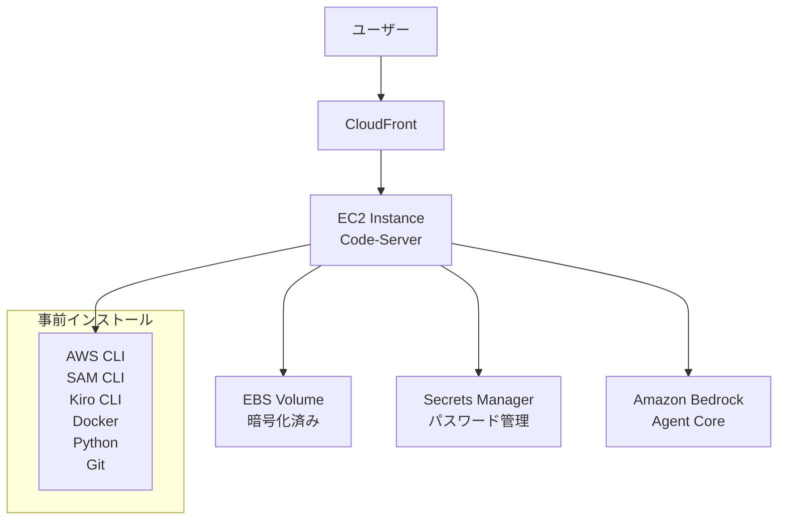
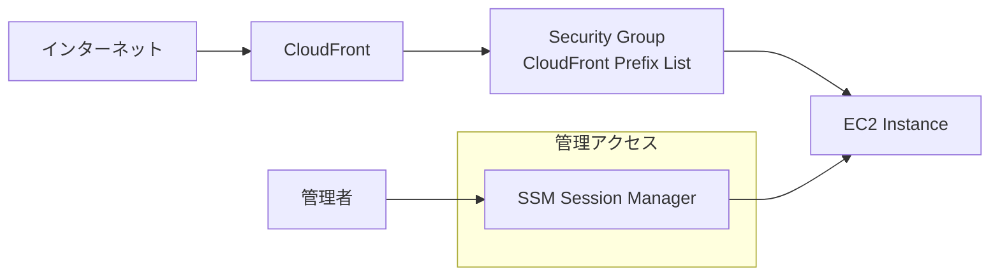

# AWS Samples AI Agent Development Code Server

**出典**: [AI Agent Development Code Server](https://aws-samples.github.io/sample-one-click-generative-ai-solutions/solutions/aiagentdev/) - AWS Samples公式サイト

## 概要

AI Agent Development Code Server は、Amazon Bedrock Agent Core を活用した AI エージェントの開発に必要なソフトウェア等が事前セットアップされた開発環境です。ブラウザベースの VS Code (Code-Server) を使用し、AWS 上に開発環境を構築します。

## ⚠️ 重要な注意事項：EC2停止時の接続問題

### 問題の概要

**このソリューションでは、EC2インスタンスにElastic IP（EIP）が付与されていません。** そのため、以下の問題が発生します：

- **EC2停止・再起動時にIPアドレスが変更される**
- **CloudFrontのオリジン設定が古いIPアドレスを参照し続ける**
- **結果として、再起動後にブラウザからアクセスできなくなる**

### 影響範囲

| 状況 | CloudFront動作 | 結果 |
|------|---------------|------|
| **EC2停止前** | 正常にオリジンに接続 | ✅ 正常動作 |
| **EC2停止・再起動後** | 古いIPアドレスに接続試行 | ❌ 503エラー、接続不可 |

### 対処法

#### 1. **推奨：Elastic IP（EIP）の追加**
- **コスト**: 月額約500円
- **効果**: IPアドレス固定、自動復旧
- **実装**: CloudFormationテンプレートにEIPリソースを追加

#### 2. **代替案：手動でのオリジン設定更新**
- EC2再起動後、CloudFrontコンソールでオリジンのIPアドレスを手動更新
- 一時的な回避策として有効

#### 3. **長期的解決：Route 53 + カスタムドメイン**
- DNS名でオリジンを指定し、IPアドレス変更時にDNSレコードを更新
- より複雑だが、柔軟性が高い

### 推奨事項

- **本格運用前にEIPの追加を強く推奨**
- **テスト目的の場合は、EC2停止時の制限を理解した上で使用**
- **コスト削減のためのEC2停止は、接続復旧作業が必要になることを考慮**

## ⚠️ 重要な注意事項：マルチユーザー利用の制限

**このソリューションは、シングルユーザー設計です。** 複数ユーザーでの同時利用を検討している場合は、以下の重要な制限があります：

- **ポート競合問題**: デフォルトポート8080の競合により、2人目以降のユーザーは起動不可
- **設定ファイル競合**: 同一設定ファイルの上書きリスク
- **セキュリティリスク**: ファイルアクセス競合、プロセス分離不足

### 詳細情報

マルチユーザー対応の詳細な調査結果と解決策については、**[code-server マルチユーザー対応調査報告](02_multiuser-code-server-investigation.md)** をご確認ください。

## 📋 主な機能・特徴

### 1. ブラウザベース開発環境
- **Code-Server**: VS Code 互換の開発体験をブラウザで提供
- **リモートアクセス**: インターネット経由でどこからでもアクセス可能
- **クロスプラットフォーム**: OS に依存しない開発環境

### 2. 事前設定済み開発ツール
- **AWS CLI v2**: AWS サービスの操作・管理
- **AWS SAM CLI**: サーバーレスアプリケーションの開発・デプロイ
- **Kiro CLI**: AI 駆動の開発支援ツール
- **uv**: 高速 Python パッケージマネージャー
- **Docker**: コンテナ化技術
- **Git**: バージョン管理システム
- **Python**: プログラミング言語
- **NVM (Node.js LTS、NPM)**: Node.js 環境管理

### 3. Amazon Bedrock Agent Core 対応
- **エージェント開発権限**: 必要な IAM 権限を事前設定
- **開発ツール**: エージェント開発に特化したツールセット
- **サンプルコード**: ハンズオン用リポジトリの自動クローン

### 4. セキュリティ機能
- **CloudFront 経由アクセス**: HTTPS による安全な接続
- **直接アクセス制限**: EC2 インスタンスへの直接アクセスを制限
- **セキュリティグループ**: CloudFront の Prefix List のみを許可
- **パスワード管理**: AWS Secrets Manager で安全に管理
- **EBS 暗号化**: ストレージの暗号化
- **SSM Session Manager**: 管理アクセスの提供

### 5. 自動環境構築
- **SSM Document**: 一貫性のある環境セットアップ
- **CloudFormation**: インフラストラクチャのコード化
- **自動通知**: デプロイ完了の SNS 通知

## 🚀 デプロイ手順

### 1. パラメーター設定

デプロイ時に以下のパラメーターを設定できます：

| パラメーター | デフォルト値 | 説明 |
|-------------|-------------|------|
| **UserEmail** | (必須) | ユーザーのメールアドレス。Git 設定と Code Server のユーザー名として使用 |
| **UserFullName** | AIAgent Developer | Git 設定に使用されるフルネーム |
| **InstanceType** | t4g.medium | EC2 インスタンスタイプ（ARM64 アーキテクチャ） |
| **InstanceVolumeSize** | 40 | EBS ボリュームサイズ (GB) |
| **HomeFolder** | /workshop | 作業ディレクトリのパス |
| **RepoUrl** | sample-amazon-bedrock-agentcore-onboarding.git | 自動クローンする Git リポジトリの URL |

### 2. インスタンスタイプの選択指針

| インスタンスタイプ | vCPU | メモリ | 24時間コスト目安 | 用途 |
|------------------|------|--------|-----------------|------|
| **t4g.small** | 2 | 2GB | 約60円 | 軽量開発・学習 |
| **t4g.medium** | 2 | 4GB | 約120円 | 標準開発 |
| **t4g.large** | 2 | 8GB | 約250円 | 中規模開発 |
| **t4g.xlarge** | 4 | 16GB | 約480円 | 大規模開発 |

> **注意**: 価格は目安です。最新の料金情報は [AWS EC2 料金ページ](https://aws.amazon.com/jp/ec2/pricing/on-demand/) で確認してください。

### 3. デプロイ手順

1. **デプロイボタンクリック**
   - [Deploy ボタン](https://ap-northeast-1.console.aws.amazon.com/cloudformation/home#/stacks/create/review?stackName=AIAgentDevDeploymentStack&templateURL=https://aws-ml-jp.s3.ap-northeast-1.amazonaws.com/asset-deployments/AIAgentDevelopmentCodeServerDeploymentStack.yaml) からデプロイ開始

2. **通知設定**
   - `AI Agent Dev Code Server Deployment Notifications - Subscription Confirmation` メールを確認
   - `Confirm subscription` リンクをクリック

3. **デプロイ完了確認**
   - 通知メールに記載された URL を確認
   - CloudFormation の出力でパスワードを確認

## ⚙️ デプロイ後の設定

### 1. 初回アクセス
```bash
# ブラウザで通知メールの URL にアクセス
# CloudFormation の Outputs でパスワードを確認してログイン
```

### 2. Amazon Bedrock モデル有効化
```bash
# 必要に応じて Amazon Bedrock のモデルを有効化
# AWS コンソールから Bedrock サービスにアクセス
```

### 3. Kiro CLI 認証
```bash
# Kiro CLI の認証を完了
kiro-cli login --use-device-flow
```

### 4. 環境変数確認
```bash
# 自動設定される環境変数
echo $AWS_REGION      # デプロイしたリージョン
echo $AWS_ACCOUNTID   # AWS アカウント ID
```

## 💰 コスト構成

### 主要コスト要素

| リソース | 課金方式 | コスト目安 |
|---------|---------|-----------|
| **EC2 インスタンス** | 実行時間課金 | t4g.medium で24時間約250円 |
| **EBS ボリューム** | 容量課金 | 40GB gp3 で月額約500円 |
| **CloudFront** | データ転送量課金 | 使用量に応じて |
| **その他** | 最小限 | VPC、Secrets Manager、SNS など |

### コスト最適化

```bash
# 使用しない場合は EC2 インスタンスを停止
aws ec2 stop-instances --instance-ids i-xxxxxxxxx

# 注意: CloudFront と EBS ボリュームは停止中も課金される
```

## 🗑️ リソースの削除

### 削除手順

1. **CloudFormation コンソールにアクセス**
   - [CloudFormation コンソール](https://console.aws.amazon.com/cloudformation/) を開く

2. **スタック削除**
   ```bash
   # デフォルトスタック名: AIAgentDevDeploymentStack
   # 「削除」ボタンをクリック
   ```

### 削除時の注意事項

- ✅ **バックアップ**: 作業中のコードやデータを事前にバックアップ
- ⚠️ **完全削除**: EC2 インスタンスと EBS ボリュームも削除される
- 🔄 **復旧期間**: Secrets Manager のシークレットは30日間の復旧期間あり

## 📚 活用リソース

### 1. デフォルト設定リポジトリ
- **[Amazon Bedrock Agent Core ハンズオン](https://github.com/aws-samples/sample-amazon-bedrock-agentcore-onboarding)**
  - エージェント開発の基本的なハンズオン
  - サンプルコードとドキュメント

### 2. 推奨書籍
- **[AIエージェント開発 / 運用入門 [生成AI深掘りガイド]](https://amzn.asia/d/eX6ZBSZ)**
  - AI エージェント開発の包括的ガイド
  - 実践的な開発手法とベストプラクティス

- **[AWS生成AIアプリ構築実践ガイド](https://amzn.asia/d/cnMEqrO)**
  - AWS での生成 AI アプリケーション構築
  - 実装例とアーキテクチャパターン

### 3. 関連記事
- **[ワンクリックでKiro-CLI環境を構築できる「AI Agent Development Code Server」を試してみた](https://dev.classmethod.jp/articles/kiro-ai-agent-development-code-server/)**
  - 実際の使用体験レポート
  - セットアップから開発までの流れ

## 🔧 技術仕様

### アーキテクチャ概要



### セキュリティ設計



## 🎯 ユースケース

### 1. AI エージェント開発
- Amazon Bedrock Agent Core を使用したエージェント開発
- 自然言語処理とツール統合の実装
- エージェントのテストとデバッグ

### 2. 学習・研修環境
- AI/ML 技術の学習環境
- ハンズオン研修の実施
- チーム開発の練習環境

### 3. プロトタイプ開発
- 迅速なプロトタイプ作成
- 概念実証（PoC）の実装
- アイデアの検証環境

## 🔗 関連リンク

- **[AWS Samples 公式サイト](https://aws-samples.github.io/sample-one-click-generative-ai-solutions/solutions/aiagentdev/)**
- **[GitHub リポジトリ](https://github.com/aws-samples/sample-one-click-generative-ai-solutions)**
- **[Code-Server 公式](https://github.com/coder/code-server)**
- **[Amazon Bedrock Agent Core](https://docs.aws.amazon.com/bedrock/latest/userguide/agents.html)**

---

**最終更新**: 2025-12-30
