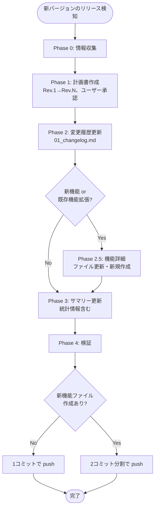
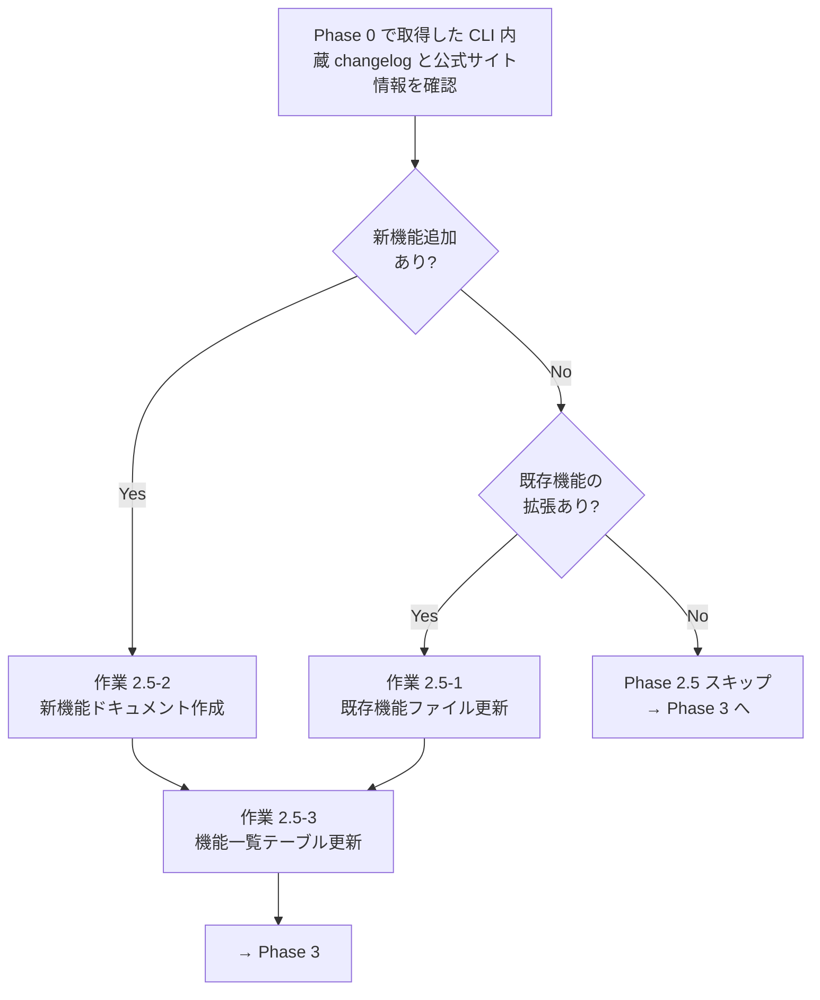

# Kiro CLI バージョンアップ対応ガイド

**最終更新**: 2026-05-10  
**改訂版**: **Rev.2**（2026-05-10 16:00 JST、批判的レビュー結果を反映）
**対象読者**: ドキュメントメンテナー、コントリビューター  
**前提条件**: Git、curl、Python 3、Kiro CLI（`kiro-cli`）がインストール済み  
**関連手順書**: [Amazon Q CLI向けバージョンアップ対応ガイド](../../docs/05_meta/10_version-update-guide.md)（参考）

---

## 📋 目次

1. [概要](#概要)
2. [Amazon Q CLI 時代との主な違い](#amazon-q-cli-時代との主な違い)
3. [事前準備](#事前準備)
4. [Phase 0: 情報収集（必須・最優先）](#phase-0-情報収集必須最優先)
5. [Phase 1: 作業計画書作成（必須）](#phase-1-作業計画書作成必須)
6. [Phase 2: 変更履歴メインファイル更新（必須）](#phase-2-変更履歴メインファイル更新必須)
7. [Phase 2.5: 機能詳細ファイル更新・新規作成（条件付き必須）](#phase-25-機能詳細ファイル更新新規作成条件付き必須)
8. [Phase 3: サマリー・インデックスファイル更新（必須）](#phase-3-サマリーインデックスファイル更新必須)
9. [Phase 4: 検証と品質確認（必須）](#phase-4-検証と品質確認必須)
10. [最終確認とコミット](#最終確認とコミット)
11. [トラブルシューティング](#トラブルシューティング)
12. [実施例](#実施例-1-v222対応2026-05-10)
13. [作業テンプレート](#作業テンプレート)
14. [関連リンク](#関連リンク)

---

## 概要

### 目的

Kiro CLI の新バージョンリリース時に、本サイトの `kiro-docs/` 配下のドキュメントを正確かつ効率的に更新するための標準手順を提供します。

### 重要な原則

1. **品質最優先**: 時間より正確性を優先する
2. **推測禁止**: 一次情報（CLI内蔵 changelog、公式サイト、公式 Atom フィード）のみを使用
3. **検証徹底**: 推論や曖昧さを排除、各記述に根拠を持つ
4. **完全性の追求**: 漏れのない網羅的な更新
5. **取得日は本サイトに記載しない**: 本サイトの記述内に「YYYY-MM-DD 取得」「YYYY-MM-DD 時点」の記載は原則含めない
6. **計画書は Rev 運用**: レビューを複数回重ねて精度を高める

### 作業フロー

```
Phase 0: 情報収集（必須・最優先）
    ↓
Phase 1: 作業計画書作成（Rev.1 → Rev.N、ユーザーレビューを経て確定）
    ↓
Phase 2: 変更履歴メインファイル更新
    ↓
Phase 2.5: 機能詳細ファイル更新・新規作成【条件付き必須】
    ↓     （新機能 or 既存機能拡張がある場合のみ。パッチ系ならスキップ）
Phase 3: サマリー・インデックスファイル更新
    ↓
Phase 4: 検証と品質確認
    ↓
最終確認・コミット・Push（コミット戦略: 1コミット or 2コミット分割）
```

### 視覚的フロー図（Mermaid）



---

## Amazon Q CLI 時代との主な違い

Kiro CLI は Amazon Q CLI の後継ですが、ドキュメント更新の観点では以下の違いがあります。

| 項目 | Amazon Q CLI（旧） | Kiro CLI（現行） |
|------|-------------------|-----------------|
| **ソースコード** | オープンソース | **クローズドソース**（閲覧不可） |
| **Phase 0 ソース解析** | 必須 | **不可能**（CLI 内蔵情報のみ） |
| **情報源** | GitHub リポジトリ、リリースノート | CLI 内蔵 changelog、公式サイト、公式 Atom フィード |
| **バージョン確認** | `q --version` | `kiro-cli --version` |
| **変更履歴取得** | GitHub Releases | `kiro-cli version --changelog=all` |
| **更新対象ディレクトリ** | `docs/` 配下 | `kiro-docs/` 配下 |
| **取得日記載** | 本サイトに記載 | **本サイトに記載しない** |
| **計画書の扱い** | （明示なし） | **`.gitignore` 対象**（`kiro-docs/*_update_plan.md`） |
| **検証スクリプト** | `scripts/check-consistency.sh`, `check-urls.sh` | **使用不可**（`kiro-docs/` 非対応）→ Python 代替 |

### Kiro CLI 独自の制約

- **ソースコード非公開**: Rust コードや内部実装の確認ができないため、**リリースノートと CLI 内蔵情報を「一次情報」として扱う**
- **リリースノートの公式 URL パターン**: `https://kiro.dev/changelog/cli/<メジャー>-<マイナー>/`
- **日付の揺れ**: CLI 内蔵 changelog と公式サイト表示日付に差異がある場合があるため、**公式サイト表示を優先**

---

## 事前準備

### 必要なツール

| ツール | 用途 | インストール確認 |
|--------|------|----------------|
| Git | コミット・プッシュ | `git --version` |
| curl | 公式サイト・フィード取得 | `curl --version` |
| Python 3 | リンク切れ検証スクリプト | `python3 --version` |
| Kiro CLI | 内蔵 changelog 確認 | `kiro-cli --version` |
| jq（推奨） | Atom フィード解析 | `jq --version` |

### 作業ディレクトリ

```bash
# プロジェクトルート
cd /path/to/q-cli-docs

# 作業記録ディレクトリ（日付別）
mkdir -p /path/to/work_records/$(date +%Y%m%d)
```

### 作業前チェックリスト

#### ✅ 必須確認事項

- [ ] **新バージョンの確認**
  - `kiro-cli --version` でローカル版を確認
  - 公式サイト（https://kiro.dev/changelog/）で最新版を確認
- [ ] **差分バージョンの特定**
  - 本サイト（`kiro-docs/02_update/01_changelog.md`）の「最新バージョン」セクションを確認
  - ローカル最新とドキュメント記載の差分バージョンをリストアップ
- [ ] **作業記録ディレクトリの用意**
- [ ] **pre-commit hook の動作原理を理解**（後述）

#### ⚠️ 禁止事項

- ❌ 推測表現（「たぶん」「おそらく」）の使用
- ❌ 出典なしの記述
- ❌ 未検証のリンク・URL の記載
- ❌ 本サイト記述内の「YYYY-MM-DD 取得」「YYYY-MM-DD 時点」記載（計画書・作業記録には記録可）
- ❌ 検証スキップ（品質優先）

---

## Phase 0: 情報収集（必須・最優先）

### 📥 入力成果物

- ローカルにインストール済みの `kiro-cli`（最新版）
- インターネット接続（公式サイト・Atom フィード取得）

### 📤 出力成果物

- 情報収集結果ファイル（`work_records/YYYYMMDD/HHMM_vX.Y.x_investigation.md`）
- 差分バージョンリスト（ローカル版 vs 本サイト記載）
- 日付正規化ルールの適用済みデータ

### 目的

Kiro CLI の新バージョン情報を一次情報から正確に収集し、差分を特定する。

### 作業 0-1: ローカル Kiro CLI バージョン確認

```bash
kiro-cli --version
# 例: kiro-cli 2.2.2
```

**✅ 成果物確認**:

```bash
# 期待結果: 現行のローカルバージョンが正確に取得できていること
kiro-cli --version | grep -E "kiro-cli [0-9]+\.[0-9]+\.[0-9]+"
```

### 作業 0-2: CLI 内蔵 changelog の取得

```bash
# 全バージョンのchangelogを取得
kiro-cli version --changelog=all > /tmp/kiro-cli-changelog-all.txt

# 最新版のみ取得（特定バージョンを指定）
kiro-cli version --changelog=<version>

# 例: v2.2.1 の changelog を確認
kiro-cli version --changelog=2.2.1
```

CLI 内蔵 changelog は以下のフィールドを含みます:

- バージョン番号
- 日付（CLI 内蔵の日付、公式サイト表示と異なる場合あり）
- Added / Changed / Fixed / Security 等のカテゴリ別変更
- 詳細な説明

**✅ 成果物確認**:

```bash
# 期待結果: ファイルが空ではなく、最新バージョンのエントリが含まれていること
test -s /tmp/kiro-cli-changelog-all.txt && echo "✅ ファイル取得済み" || echo "❌ 空ファイル"
grep -c "^##\|^###" /tmp/kiro-cli-changelog-all.txt
# 期待: 複数件のセクションが検出されること
```

### 作業 0-3: 公式サイト情報の取得

#### 公式 Changelog ページ

```bash
# URL パターン: https://kiro.dev/changelog/cli/<メジャー>-<マイナー>/
# 例: v2.2.x の場合
curl -sL "https://kiro.dev/changelog/cli/2-2/" | head -200
```

公式 Changelog ページには以下が含まれます:

- リリース日付（表示日）
- Improvements / Bug Fixes / Security 等のセクション（折りたたみ可能な詳細含む）
- 設定項目、コマンド、保存先パス等の具体的情報

#### 公式 Atom フィード

```bash
curl -sL "https://kiro.dev/changelog/feed.atom" > /tmp/kiro-feed.atom

# 特定バージョンのエントリを抽出
grep -A 30 "v2.2.1" /tmp/kiro-feed.atom
```

Atom フィードには以下が含まれます:

- `<published>` タグで ISO 8601 形式のリリース日時（例: `2026-05-04T00:00:00Z`）
- タイトル（バージョン番号と概要）
- HTML 形式の変更概要

**✅ 成果物確認**:

```bash
# 公式 Changelog ページの HTTP 200 確認
curl -s -o /dev/null -w "%{http_code}" "https://kiro.dev/changelog/cli/<メジャー>-<マイナー>/"
# 期待結果: 200

# Atom フィードの取得確認
test -s /tmp/kiro-feed.atom && echo "✅ Atomフィード取得済み" || echo "❌ 空ファイル"
grep -c "<entry>" /tmp/kiro-feed.atom
# 期待: 複数のエントリが存在すること
```

#### 関連リファレンス

必要に応じて以下も確認:

- **設定リファレンス**: https://kiro.dev/docs/cli/reference/settings/
- **スラッシュコマンドリファレンス**: https://kiro.dev/docs/cli/reference/slash-commands/
- **MCP ガバナンス**: https://kiro.dev/docs/enterprise/governance/mcp/

### 作業 0-4: 差分バージョンの特定

```bash
# ドキュメント済みの最新バージョンを確認
grep -E "^### v2\." kiro-docs/02_update/01_changelog.md | head -3

# ローカル最新（作業0-1）と本サイト記載（上記）の差分を整理
```

**差分リスト例**:

| バージョン | CLI 内蔵日付 | 公式サイト表示日 | 本サイト記載 |
|---------|-----------|--------------|------------|
| v2.2.2 | 2026-05-05 | 未掲載 | ❌ 未記載 |
| v2.2.1 | 2026-04-29 | 2026-05-04 | ❌ 未記載 |
| v2.2.0 | 2026-04-27 | 2026-04-27 | ✅ 記載済み |

### 作業 0-5: 日付の正規化

**ルール**: CLI 内蔵 changelog の日付と公式サイト表示日付に差異がある場合、**公式サイト表示日付を採用**する。

**理由**: 公式サイトは一般ユーザー向けのリリース告知であり、本サイトの読者が他情報源と突合しやすくなる。

### 作業 0-6: 情報収集結果を作業記録ファイルに保存

**保存場所**: `/path/to/work_records/YYYYMMDD/YYYYMMDDHHMM_vX.Y.x_investigation.md`

**テンプレート**:

```markdown
# Kiro CLI vX.Y.x 情報収集結果

**取得日時**: YYYY-MM-DD HH:MM JST
**ローカル版**: `kiro-cli X.Y.Z`
**ドキュメント済み最新**: vA.B.C
**差分バージョン**: vX.Y.Z, vX.Y.W（以下省略）

## CLI 内蔵 changelog（生データ）

（`kiro-cli version --changelog=all` の出力から該当部分を抜粋）

## 公式 Changelog ページ

- URL: https://kiro.dev/changelog/cli/X-Y/
- HTTP Status: 200
- リリース日付: YYYY-MM-DD
- 主要な記述:
  - （Improvements/Fixed/Security 各項目の引用）

## 公式 Atom フィード

- URL: https://kiro.dev/changelog/feed.atom
- 該当エントリの published: YYYY-MM-DDTHH:MM:SSZ
- タイトル: （タイトル全文）

## 日付の確定

| バージョン | 採用日付 | 根拠 |
|---------|--------|------|
| vX.Y.Z | YYYY-MM-DD | 公式サイト表示日を採用（CLI 内蔵との差異あり） |

## 重要な発見

- （例: `/model set-current-as-default` の保存先が v1.23.0 時点と現行で異なる）
- （例: 新規追加の設定項目）
```

### Phase 0 完了チェックリスト

- [ ] ローカル Kiro CLI バージョン確認済み
- [ ] CLI 内蔵 changelog を取得済み
- [ ] 公式 Changelog ページ HTTP 200 確認済み
- [ ] 公式 Atom フィード取得済み
- [ ] 差分バージョンを特定済み
- [ ] 日付の正規化ルールを適用済み
- [ ] 情報収集結果を作業記録ファイルに保存済み

---

## Phase 1: 作業計画書作成（必須）

### 📥 入力成果物

- Phase 0 で作成した情報収集結果ファイル
- 差分バージョンリスト

### 📤 出力成果物

- 作業計画書 Rev.N（ユーザー承認済み、`kiro-docs/YYYYMMDD_vX.Y.x_update_plan.md`）
- レビュー報告書（必要に応じて、`work_records/YYYYMMDD/HHMM_review_report.md`）

### 目的

実作業の前に、更新対象・順序・検証手順を明文化した計画書を作成する。計画書はレビュー可能であり、ユーザー承認を経て実作業に入る。

### 重要な方針

- **計画書ファイル名**: `kiro-docs/YYYYMMDD_vX.Y.x_update_plan.md`
- **計画書は `.gitignore` 対象**: `kiro-docs/*_update_plan.md` がワイルドカードで除外されている
- **Rev 運用**: Rev.1 初版 → レビュー → Rev.2 → ... → Rev.N（ユーザー承認）
- **作業見積（所要時間・行数）は計画書に含めない**: 正確で高品質な作業を優先し、時間は考慮しない

### 計画書に含めるセクション

1. **メタ情報**（作成日、対象バージョン、ローカル環境確認バージョン、改訂版）
2. **目次**
3. **作業概要**（本作業の目的、成果物、前提）
4. **Phase 0: 情報収集と検証（完了状況）**（Phase 0 の結果のサマリー）
5. **Phase 1: 既存ドキュメント不整合の調査と修正**
   - 既存記述の陳腐化部分、新バージョンと関連する過去バージョン項目への相互参照追加
6. **Phase 2: 変更履歴メインファイル更新**（`01_changelog.md`）
   - 最新バージョンセクションへの追加
   - 旧最新バージョンの「バージョン履歴」への移動
   - 出典表記（取得日なし、公式リンクあり）
   - 他バージョンの取得日記載削除
7. **Phase 3: サマリー・インデックスファイル更新**
   - `02_update/README.md`, `01_features/README.md`, `kiro-docs/README.md`, プロジェクトルート `README.md`
8. **Phase 4: 検証・品質確認**
9. **依存関係・影響範囲分析**
10. **想定リスクと対応**
11. **更新対象ファイル一覧**
12. **一次情報リンク集**
13. **Rev 改訂履歴**（各 Rev ごとの変更内容を明記）

### レビューサイクル

**Rev.1（初版）**: 作成直後、ユーザーに提示

**Rev.2（批判的レビュー）**: 以下を検証して反映
- 既存ドキュメントと計画書記述の矛盾
- 外部 URL の有効性
- 一次情報との整合性

**Rev.3（整合性・網羅性レビュー）**: 以下を検証して反映
- 計画書内の Phase 間相互参照の整合性
- 更新対象ファイル一覧と実際の Phase 記述の一致
- 想定リスク記述が Rev.2 で確定した事実を反映しているか

**Rev.4（最終レビュー）**: 以下を検証して反映
- **依存関係**: Phase 間順序、同一ファイル内の修正競合、バックアップ順序
- **水平展開**: 取得日削除・バージョン番号記載・相互参照追加の全箇所カバー
- **Rev.3 新規追加セクションの内部整合性**
- **Phase 4 検証手順の網羅性**（Rev.3 で追加された修正をカバーするか）

**レビュー手法（Rev.4 の例）**:

1. 依存関係チェック: `grep` で Phase 間の参照を抽出、順序を確認
2. 水平展開1: `grep -rnE "[0-9]{4}-[0-9]{2}-[0-9]{2}取得|時点" kiro-docs/ README.md` で全取得日を列挙
3. 水平展開2: `grep -rnE "\(v[0-9]+\.[0-9]+\.[0-9]+対応\)" kiro-docs/ README.md` で更新要箇所を列挙
4. 計画書と実ファイルの `grep` 結果を照合し、漏れを検出

### レビュー報告書の作成

各レビューで発見した事項は別ファイルに記録:

- `work_records/YYYYMMDD/HHMM_review_report.md`
- `work_records/YYYYMMDD/HHMM_final_review_report.md`

**記載内容**:

- レビュー観点（何を検証したか）
- 発見事項（重要度別）
- 推奨対応（どの Rev で反映するか）
- 最終判定（実作業着手可否）

### Phase 1 完了チェックリスト

- [ ] 計画書 Rev.1 作成済み
- [ ] 計画書ファイル名が命名規則に従っている（`YYYYMMDD_vX.Y.x_update_plan.md`）
- [ ] `.gitignore` で計画書が除外されていることを確認
- [ ] レビュー（Rev.2〜Rev.N）を実施済み
- [ ] ユーザー承認取得済み
- [ ] 各 Rev の改訂履歴が計画書内に記載されている

---

## Phase 2: 変更履歴メインファイル更新（必須）

### 📥 入力成果物

- Phase 1 で作成した承認済み計画書
- Phase 0 の情報収集結果（新バージョンの詳細情報、出典URL）

### 📤 出力成果物

- 更新済み `kiro-docs/02_update/01_changelog.md`
- バックアップファイル 5 件（`*.bak`）
- 更新内容の `git diff` 出力

### 目的

`kiro-docs/02_update/01_changelog.md` を新バージョン対応に更新する。これは本作業の中核。

### 作業 2-1: バックアップ作成

実作業開始前に、全更新対象ファイルを `.bak` でバックアップする。`.bak` は `.gitignore` で除外されているため、誤コミットされない。

```bash
cd /path/to/q-cli-docs

cp kiro-docs/02_update/01_changelog.md    kiro-docs/02_update/01_changelog.md.bak
cp kiro-docs/02_update/README.md          kiro-docs/02_update/README.md.bak
cp kiro-docs/01_features/README.md        kiro-docs/01_features/README.md.bak
cp kiro-docs/README.md                    kiro-docs/README.md.bak
cp README.md                               README.md.bak
```

**✅ 成果物確認**:

```bash
# バックアップファイル5件の存在確認
ls -la kiro-docs/02_update/*.bak kiro-docs/01_features/README.md.bak kiro-docs/README.md.bak README.md.bak 2>/dev/null | wc -l
# 期待結果: 5
```

### 作業 2-2: 既存不整合の修正

新バージョンに関連する過去バージョンセクションに、**相互参照**や**最新仕様への注記**を追加。

**例（v2.2.1 で保存先変更された機能の v1.23.0 セクション）**:

```diff
- - ⚙️ **Model Persistence**: /model set-current-as-defaultコマンドでモデル選択を永続化
+ - ⚙️ **Model Persistence**: /model set-current-as-defaultコマンドでモデル選択を永続化（保存先: `~/.kiro/settings.json`。※v2.2.1で `~/.kiro/settings/cli.json` に変更）
```

**目的**: v1.23.0 セクションのみを読む読者にも、現行の仕様変更が伝わるようにする。

**✅ 成果物確認**:

```bash
# 相互参照が正しく追加されているか確認
grep -n "<相互参照キーワード>" kiro-docs/02_update/01_changelog.md
# 期待結果: 該当行が追加された内容で検出されること
```

### 作業 2-3: 旧最新バージョンセクションの整理

**従来の最新バージョン**の出典記述を更新:

- 「※公式 Changelog サイト未掲載」等の陳腐化した注記を削除
- 公式 Changelog リンクを追加（公式サイト掲載が確認できた場合）
- 取得日を削除

```diff
- **出典**: `kiro-cli version --changelog=all`（2026-05-03取得）
- ※公式Changelogサイト未掲載（2026-05-03時点）
+ **出典**: `kiro-cli version --changelog=all`、[公式Changelog v2.2](https://kiro.dev/changelog/cli/2-2/)
```

### 作業 2-4: 旧最新バージョンを「バージョン履歴」へ移動

**現状構造**:

```markdown
## 最新バージョン

### v2.2.0 CLI（2026-04-27）
（内容）

## バージョン履歴

### v1.29.x CLI（2026-04-01〜04-11）
（内容）
```

**新構造**:

```markdown
## 最新バージョン

### v2.2.2 CLI（2026-05-05）
（新規追加）

### v2.2.1 CLI（2026-05-04）
（新規追加）

## バージョン履歴

### v2.2.0 CLI（2026-04-27）
（旧最新から移動）

### v1.29.x CLI（2026-04-01〜04-11）
（内容）
```

**注意点**:

- **最新バージョンセクション**: 新しい順（v2.2.2 → v2.2.1）
- **バージョン履歴セクション**: 新しい順（v2.2.0 → v1.29.x → ...）
- 「最新バージョン」には**新規バージョンのみ**を追加（中間バージョン v2.1.0, v2.0.0 は元のまま「最新バージョン」セクションに残すか「バージョン履歴」に移すかは、既存構造を尊重する）

### 作業 2-5: 新バージョンセクションの記述

**テンプレート**:

```markdown
### vX.Y.Z CLI（YYYY-MM-DD）

**主要な変更**:

**機能追加（N件）**:
- 🔧 **機能名**: 機能の説明
  - 詳細な使用例や注意点
  - 詳細: [公式リファレンス](https://kiro.dev/docs/...)

**セキュリティ（N件）**:
- 🔒 **セキュリティ対応**: 説明

**バグ修正（N件）**:
- 修正内容1
- 修正内容2

**出典**: `kiro-cli version --changelog=all`、[公式Atomフィード](https://kiro.dev/changelog/feed.atom)、[公式Changelog vX.Y](https://kiro.dev/changelog/cli/X-Y/)

**注記**（必要な場合）:
- CLI 内蔵日付と公式サイト日付に差異ある場合の注記
- 既存機能の変更（保存先パス変更等）の場合の注記
```

### 絵文字パターン（既存ドキュメント踏襲）

- 🧠 AI/推論関連
- 🔧 設定・ツール関連
- ⚙️ コマンド・永続化関連
- 🔒 セキュリティ関連
- 🔐 認証・暗号化・ガバナンス関連
- 💡 UX・ヒント関連
- 📡 ネットワーク・ストリーミング関連
- 🎨 UI・テーマ関連
- 📋 一覧・管理関連

### 作業 2-6: 他バージョンの取得日記載一括削除

本サイトでは取得日を記載しない方針のため、既存の全バージョンの取得日記載を削除する。

**Python スクリプト例**:

```python
import re

path = 'kiro-docs/02_update/01_changelog.md'
with open(path, 'r', encoding='utf-8') as f:
    content = f.read()

# パターン1: 「（YYYY-MM-DD取得）、[公式Changelog]」→「、[公式Changelog]」
content = content.replace('（2026-05-03取得）、[公式Changelog]', '、[公式Changelog]')

# パターン2: 「`kiro-cli version --changelog=all`（YYYY-MM-DD取得）」→ 取得日削除
content = content.replace('`kiro-cli version --changelog=all`（2026-05-03取得）\n', '`kiro-cli version --changelog=all`\n')

# パターン3: 「※...（YYYY-MM-DD時点）」→「※...」
content = content.replace('※公式Changelogサイトに独立ページなし（2026-05-03時点）', '※公式Changelogサイトに独立ページなし')

# パターン4: 「（CLI起動メッセージ、YYYY-MM-DD取得）」→「（CLI起動メッセージ）」
content = content.replace('（CLI起動メッセージ、2026-02-15取得）', '（CLI起動メッセージ）')

with open(path, 'w', encoding='utf-8') as f:
    f.write(content)
```

**検証**:

```bash
grep -rnE "[0-9]{4}-[0-9]{2}-[0-9]{2}取得|[0-9]{4}-[0-9]{2}-[0-9]{2}時点" \
  kiro-docs/ README.md --include="*.md" | grep -v '.bak'
# 期待結果: 0件（v2.2.x対応スコープ外の例外を除く）
```

### 作業 2-7: 末尾メタ情報更新

```diff
- **最終更新**: YYYY-MM-DD（前バージョン対応、全バージョン履歴更新）
+ **最終更新**: YYYY-MM-DD（vX.Y.Z対応追加、vX.Y.W対応追加、旧最新をバージョン履歴へ移動、全バージョンの取得日記載を削除）
```

### Phase 2 完了チェックリスト

- [ ] バックアップファイル作成済み
- [ ] 既存不整合（相互参照等）を修正済み
- [ ] 旧最新バージョンの出典記述を更新済み
- [ ] 旧最新バージョンを「バージョン履歴」セクションへ移動済み
- [ ] 新バージョンを「最新バージョン」セクションに記述済み
- [ ] 他バージョンの取得日記載を全削除済み
- [ ] 末尾メタ情報を更新済み

---

## Phase 2.5: 機能詳細ファイル更新・新規作成（条件付き必須）

### 目的

新バージョンで **新機能の追加** または **既存機能の拡張** がある場合、`kiro-docs/01_features/` 配下の機能詳細ガイドを更新する。パッチ・バグ修正のみのバージョンアップでは本 Phase をスキップする。

### 📥 入力成果物

- Phase 1 で作成した計画書（Phase 2.5 の実施方針）
- Phase 2 完了後の状態（`01_changelog.md` が最新）

### 📤 出力成果物

- 更新済み既存機能ファイル（`kiro-docs/01_features/NN_*.md`）
- 新規機能ファイル（新規作成時、`kiro-docs/01_features/NN_CamelCase.md`）
- 更新済み機能一覧テーブル（`kiro-docs/README.md`, `01_features/README.md`, `02_update/README.md`）

### 作業 2.5-0: Phase 2.5 実施判断【必須】

**判断フローチャート**:



**パッチ系のスキップ例**:
- v2.2.1/v2.2.2 対応（2026-05-10）: 新機能追加なし・既存機能の挙動変更なし → Phase 2.5 全体スキップ

**メジャー系の実施例**:
- v2.2.0 対応（2026-05-03）: Adaptive Thinking（既存機能拡張）、v2.0.0 の新 TUI（新機能）、Skills as Slash Commands（既存拡張）等 → Phase 2.5 実施

**✅ 成果物確認**:

```bash
# 新バージョンの Added / Changed 項目の有無を確認
kiro-cli version --changelog=<NEW_VERSION> | grep -E "Added|Changed|Features"
# 期待結果: Added/Changed がある → Phase 2.5 実施、なし → スキップ
```

### 作業 2.5-1: 既存機能ファイルの更新【既存機能が拡張された場合】

**対象**: 既存の機能ファイル（`01_features/NN_*.md`）に新バージョンでの機能拡張を追記。

**対象ファイル特定方法**:

```bash
# 拡張された機能名から対応ファイルを検索
grep -l "<機能キーワード>" kiro-docs/01_features/*.md
```

**追記する書式テンプレート**:

```markdown
## vX.Y.Zでの進化（YYYY年M月D日リリース）

### （拡張内容の見出し）
- 拡張内容の説明
- 使用例（コード例があれば）
- 注意点
- 詳細: [公式リファレンス](https://kiro.dev/docs/...)
```

**実例（前回 v2.2.0 対応時）**:
- `01_LSP.md`: v1.27.0 Tree-sitter Fallback 追記
- `02_Subagents.md`: v2.0.0 タスク依存関係・Crew Monitor 追記
- `07_Skills.md`: v2.1.0 Skills as Slash Commands 追記
- `12_RemoteAuth.md`: v2.1.0 Device Flow 認証追記

**✅ 成果物確認**:

```bash
# 拡張された既存ファイルに新バージョンセクションが含まれているか確認
for f in <更新したファイルのリスト>; do
  echo "=== $f ==="
  grep -c "vX.Y.Zでの進化" "$f"
done
# 期待結果: 各ファイルで 1 件以上
```

### 作業 2.5-2: 新機能ドキュメント作成【新機能追加時】

**対象**: 完全に新規の独立機能が追加された場合、`01_features/NN_CamelCase.md` を新規作成。

#### ファイル命名規則

- **パターン**: `NN_CamelCase.md`
- **NN**: 既存最大番号 + 1（既存最大が `19_ToolSearch.md` なら `20_`）
- **CamelCase**: 機能名の英数字表記（先頭大文字）

**ファイル番号決定コマンド**:

```bash
ls kiro-docs/01_features/[0-9]*.md | sort -V | tail -1
# 結果例: kiro-docs/01_features/19_ToolSearch.md
# 次の番号: 20
```

#### 新機能ファイルのテンプレート

```markdown
[ホーム](../README.md) > [機能詳細ガイド](README.md) > （機能名）

---

# （機能名）

## 概要

（1〜3段落で機能の全体像、対応バージョン、主な目的）

## 仕組み／アーキテクチャ

（必要に応じて Mermaid 図）

## 設定・使い方

（有効化方法、設定項目、コマンド例）

## 使用例

（実践的な使用シナリオ 2〜3 件）

## 注意点・制限事項

## 関連リンク

- [公式リファレンス](https://kiro.dev/docs/...)
- [関連機能](他機能ファイルへのリンク)

---

**最終更新**: YYYY年MM月DD日  
**対象バージョン**: Kiro CLI vX.Y.Z+
```

#### 参考にすべき公式リファレンス（機能種別ごと）

| 機能種別 | 参考 URL |
|---------|---------|
| 設定項目 | https://kiro.dev/docs/cli/reference/settings/ |
| スラッシュコマンド | https://kiro.dev/docs/cli/reference/slash-commands/ |
| MCP 関連 | https://kiro.dev/docs/enterprise/governance/mcp/ |
| 認証・セキュリティ | https://kiro.dev/docs/cli/authentication/ |
| テーマ・UI | https://kiro.dev/docs/cli/themes/ |

#### 参考にすべき類似既存ファイル

| 機能種別 | 類似既存ファイル |
|---------|-------------|
| UI機能 | `18_TerminalUI.md` (362 行) |
| 設定・ツール統合 | `08_CustomDiffTools.md`, `17_GranularToolTrust.md` |
| メジャーアップデート概観 | `16_v2MajorUpdate.md` (242 行) |
| 認証機能 | `12_RemoteAuth.md` |
| ツール機能 | `19_ToolSearch.md` (159 行) |

**実例（前回 v2.2.0 対応時、17c47c6）**:
- `16_v2MajorUpdate.md` (242 行) - v2.0.0 メジャーアップデート解説
- `17_GranularToolTrust.md` (196 行) - Granular Tool Trust
- `18_TerminalUI.md` (362 行) - Terminal UI
- `19_ToolSearch.md` (159 行) - Tool Search

**✅ 成果物確認**:

```bash
# 新規ファイルが正しい命名規則で作成されているか
ls kiro-docs/01_features/[0-9]*.md | sort -V | tail -5
# 期待結果: 新規ファイルが正しい連番で存在

# 各新規ファイルに必須セクションが含まれているか
for f in <新規作成ファイル>; do
  echo "=== $f ==="
  grep -E "^## (概要|使い方|関連リンク)" "$f" | wc -l
done
# 期待結果: 各ファイルで 3 件以上
```

### 作業 2.5-3: 機能一覧テーブルへの参照追加【2.5-2 実施時は必須】

新規機能ファイルを作成した場合、以下 4 箇所の上位ファイルに参照を追加する。

#### 更新対象 1: `kiro-docs/README.md` の機能テーブル

```diff
 | 機能 | 説明 | バージョン |
 |------|------|-----------|
 | （既存行） | ... | ... |
+| **[新機能名](01_features/NN_NewFeature.md)** | 機能の簡潔な説明 | vX.Y.Z |
```

**バージョン昇順に挿入**（過去に順序ミスが発生した実績あり、注意）。

#### 更新対象 2: `kiro-docs/01_features/README.md` の機能テーブル・詳細リスト

- 機能テーブルへの行追加
- 「各機能の詳細ドキュメント」リストへの項目追加

#### 更新対象 3: `kiro-docs/02_update/README.md` の詳細機能ドキュメントリンク

- 「詳細機能ドキュメント」セクションへのリンク追加

#### 更新対象 4: プロジェクトルート `README.md`

新機能がユーザー向け主要アップデートに該当する場合、「Kiro CLI v2.x 主要アップデート」セクション等に反映。

**✅ 成果物確認**:

```bash
# 4 箇所全てで新規ファイルへの参照が追加されているか
NEW_FILE="01_features/NN_NewFeature.md"
for target in "kiro-docs/README.md" "kiro-docs/01_features/README.md" "kiro-docs/02_update/README.md" "README.md"; do
  COUNT=$(grep -c "$NEW_FILE" "$target" 2>/dev/null || echo 0)
  echo "$target: $COUNT 件"
done
# 期待結果: 各ファイルで 1 件以上（README.md は該当時のみ）
```

### Phase 2.5 完了チェックリスト

- [ ] 作業 2.5-0 実施判断完了（実施 or スキップ）
- [ ] 【実施時】作業 2.5-1 既存機能ファイル更新済み（対象がある場合）
- [ ] 【実施時】作業 2.5-2 新機能ドキュメント作成済み（対象がある場合、命名規則遵守）
- [ ] 【実施時】作業 2.5-3 機能一覧テーブルへの参照追加済み（4 箇所）
- [ ] 【スキップ時】判断根拠（パッチ系等）を作業記録に明記済み

---

## Phase 3: サマリー・インデックスファイル更新（必須）

### 📥 入力成果物

- Phase 2 完了後の `01_changelog.md`（最新状態）
- Phase 2.5 完了後の `01_features/` 配下（条件付き、該当時）

### 📤 出力成果物

- 更新済み `kiro-docs/02_update/README.md`
- 更新済み `kiro-docs/01_features/README.md`
- 更新済み `kiro-docs/README.md`（必要時）
- 更新済みプロジェクトルート `README.md`（統計情報含む）

### 作業 3-1: `kiro-docs/02_update/README.md`

**更新項目**:

1. **ドキュメント一覧の対象バージョン**

```diff
- **対象バージョン**: v1.20.0（Kiro CLI初回リリース）〜 vA.B.C（最新版）
+ **対象バージョン**: v1.20.0（Kiro CLI初回リリース）〜 vX.Y.Z（最新版）
```

2. **主要アップデート表**（新規バージョン行を追加）

```markdown
| バージョン | リリース日 | 主要機能 | 概要 |
|-----------|-----------|----------|------|
| **vX.Y.Z** | YYYY-MM-DD | 主要機能名 | 概要 |
| **vX.Y.W** | YYYY-MM-DD | 主要機能名 | 概要 |
| （既存行） | ...        | ...      | ... |
```

3. **Mermaid タイムライン**（新規セクション追加）

```mermaid
    section 既存セクション
        YYYY-MM-DD : 既存

    section vX.Y.x パッチ
        YYYY-MM-DD : vX.Y.W
                   : 概要
        YYYY-MM-DD : vX.Y.Z
                   : 概要
```

4. **末尾メタ情報**

```diff
- **最終更新**: YYYY年MM月DD日
- **対象バージョン**: Kiro CLI vA.B.C
+ **最終更新**: YYYY年MM月DD日
+ **対象バージョン**: Kiro CLI vX.Y.Z
```

### 作業 3-2: `kiro-docs/01_features/README.md`

**更新項目**:

1. **「バージョン別進化」セクションへの追記**

```markdown
### vX.Y.Z（YYYY-MM-DD）
- **機能名**: 機能の説明

### vX.Y.W（YYYY-MM-DD）
- **機能名**: 機能の説明
```

2. **末尾メタ情報**

```diff
- **最終更新**: YYYY年MM月DD日
- **対象バージョン**: Kiro CLI vA.B.C+
+ **最終更新**: YYYY年MM月DD日
+ **対象バージョン**: Kiro CLI vX.Y.Z+
```

### 作業 3-3: `kiro-docs/README.md`（機能一覧表のバージョン順序に注意）

**更新判断基準**:

- 新バージョンで**新機能ドキュメントを追加しない**場合: **更新不要**
- 新バージョンで**新機能ドキュメントを追加する**場合: 機能一覧表に新規行を追加

**バージョン順序確認**（重要）:

機能一覧表の「バージョン」列が**正しい昇順**になっているか確認する。

```bash
# 機能一覧表のバージョン列を抽出
grep "01_features/" kiro-docs/README.md | grep -oE "v[0-9]+\.[0-9]+\.[0-9]+" | nl
```

**検出された順序ミス例**（過去事例）:

```
v1.25.0 → v2.0.0 → v1.27.0 → v1.28.0 → v2.1.0
               ↑ここが不正（v2.0.0 が v1.27.0 より前にある）
```

**修正**:

```
v1.25.0 → v1.27.0 → v1.28.0 → v2.0.0 → v2.1.0
```

**注意**: ファイル番号（`16_v2MajorUpdate.md` 等）とバージョン順序は必ずしも一致しない（後発リリースが低番号ファイルに該当する場合あり）。**バージョンでソート**する。

### 作業 3-4: プロジェクトルート `README.md`

**更新項目**:

1. **「Kiro CLI v2.x 主要アップデート」セクション**

以下はプロジェクトルート `README.md` に記載する内容の例（パスはプロジェクトルートを基点とする）:

```markdown
### 📚 Kiro CLI v2.x 主要アップデート

1. **[vX.Y.Z 主要機能名](kiro-docs/02_update/01_changelog.md)**（YYYY-MM-DD）
   - 概要

2. **[vX.Y.W 主要機能名](kiro-docs/02_update/01_changelog.md)**（YYYY-MM-DD）
   - 概要

3. **[vA.B.C 既存](kiro-docs/02_update/01_changelog.md)**（YYYY-MM-DD）
   - 概要
```

**番号の連番性に注意**: 既存の番号と衝突しないよう、全体を連番に振り直す。

2. **ドキュメント構成コードブロック**

```diff
 kiro-docs/
 ├── 00_information/   # 基本情報・公式サイト情報
-├── 01_features/      # 機能詳細ガイド（vA.B.C対応）
+├── 01_features/      # 機能詳細ガイド（vX.Y.Z対応）
 ├── 02_update/        # アップデート情報
 └── 03_deployment/    # デプロイメント・環境構築
```

3. **更新履歴表**

```diff
 | 日付 | 内容 |
 |------|------|
+| YYYY-MM-DD | vX.Y.Z、vX.Y.W対応 |
 | YYYY-MM-DD | vA.B.C対応 |
```

#### 3-4-4. 統計情報と事実反映の更新【Rev.2追加】

新バージョンで機能数や対応プラットフォームが変化した場合、プロジェクトルート `README.md` の統計情報と事実記述を更新する。

**機能数の実測**:

```bash
# 機能詳細ガイドのファイル数を実測
ls kiro-docs/01_features/[0-9]*.md | wc -l
# 結果: 現在の機能数
```

**更新箇所の例**:

```diff
-- **[機能詳細ガイド](kiro-docs/01_features/README.md)** - 15機能の詳細解説
+- **[機能詳細ガイド](kiro-docs/01_features/README.md)** - 19機能の詳細解説
```

**陳腐化した事実の発見**:

```bash
# v2.0.0 以降で陳腐化する可能性のある記述を検索
grep -nE "Windows未対応|〜まで|対応予定" README.md

# 変化した事実の例
# - 「Windows未対応」→「v2.0.0で対応済み」（v2.0.0 以降）
# - 「CI/CD未対応」→「Headless Mode で対応」（v2.0.0 以降）
```

**更新判断**:
- 機能数が変化（Phase 2.5-2 で新規ファイル作成した場合）→ 統計更新必須
- 対応プラットフォーム変化（Windows対応等）→ 該当記述の修正必須
- 対応バージョンレンジ更新（「v1.13.0〜vA.B.C」→ 「v1.13.0〜vX.Y.Z」）→ 更新必須

**✅ 成果物確認**:

```bash
# 実測値と記載値の整合性確認
FEATURES_COUNT=$(ls kiro-docs/01_features/[0-9]*.md | wc -l)
README_STATED=$(grep -oE '[0-9]+機能' README.md | head -1 | grep -oE '[0-9]+')
echo "実測: ${FEATURES_COUNT}機能, README記載: ${README_STATED}機能"
# 期待結果: 両者が一致

# 陳腐化した記述が残っていないか
grep -nE "Windows未対応|未対応（.*ではない）" README.md
# 期待結果: 検出されないこと（新バージョンで対応済みの事実が反映済み）
```

### Phase 3 完了チェックリスト

- [ ] `02_update/README.md` 更新済み（表、Mermaid、メタ情報）
- [ ] `01_features/README.md` 更新済み（バージョン別進化、メタ情報）
- [ ] `kiro-docs/README.md` 更新済み（必要時）、バージョン順序確認済み
- [ ] プロジェクトルート `README.md` 更新済み（v2.x 主要アップデート、ドキュメント構成、更新履歴）
- [ ] プロジェクトルート `README.md` の番号連番性確認済み
- [ ] **統計情報（機能数、対応バージョン）と事実反映を更新済み【Rev.2追加】**

---

## Phase 4: 検証と品質確認（必須）

### 📥 入力成果物

- Phase 2, Phase 2.5（該当時）, Phase 3 完了後の全ファイル更新済み状態
- バックアップファイル `*.bak`

### 📤 出力成果物

- 検証合格報告（全検証項目 OK）
- Git 変更ファイルリスト（`git status --short` の出力）
- 外部 URL HTTP 200 確認結果

### 検証 1: 整合性チェック

```bash
cd /path/to/q-cli-docs

# v2.x 関連表記の揺れ
echo "=== バージョン番号表記の揺れ ==="
grep -rnE 'v?2\.[0-9]+\.[0-9]+' kiro-docs/ README.md --include="*.md" | grep -v '.bak' | head -30

# 全バージョン行の順序確認
echo "=== 01_changelog.md のセクション順序 ==="
grep -nE "^### v[0-9]+\.[0-9]+" kiro-docs/02_update/01_changelog.md
```

**期待結果**:

- 「最新バージョン」セクション: 新しい順
- 「バージョン履歴」セクション: 新しい順

### 検証 2: 内部リンク切れ検証（Python 厳密）

**scripts/check-urls.sh は `kiro-docs/` 非対応**のため、Python スクリプトを使用。

```python
import re, os

files_to_check = [
    'kiro-docs/README.md',
    'kiro-docs/02_update/README.md',
    'kiro-docs/02_update/01_changelog.md',
    'kiro-docs/01_features/README.md',
    'README.md',
]

link_pattern = re.compile(r'\[([^\]]+)\]\(([^)]+)\)')
broken_links = []
total_internal = 0

for f in files_to_check:
    if not os.path.exists(f):
        print(f"⚠️ {f}: ファイルが存在しない")
        continue
    base_dir = os.path.dirname(f)
    with open(f, 'r', encoding='utf-8') as fp:
        content = fp.read()
    for m in link_pattern.finditer(content):
        url = m.group(2)
        if url.startswith(('http://', 'https://', '#', 'mailto:')):
            continue
        total_internal += 1
        path_only = url.split('#')[0]
        if path_only == '':
            continue
        full = os.path.normpath(os.path.join(base_dir, path_only))
        if not os.path.exists(full):
            line_num = content[:m.start()].count('\n') + 1
            broken_links.append(f"{f}:{line_num} → {url}")

print(f"内部リンク総数: {total_internal}")
print(f"リンク切れ件数: {len(broken_links)}")
for link in broken_links:
    print(f"  ❌ {link}")
```

**期待結果**: `リンク切れ件数: 0`

### 検証 3: 外部 URL 確認（HTTP status）

新規追加した外部 URL を確認:

```bash
for url in \
  "https://kiro.dev/changelog/cli/<メジャー>-<マイナー>/" \
  "https://kiro.dev/docs/cli/reference/settings/" \
  "https://kiro.dev/docs/cli/reference/slash-commands/" \
  "https://kiro.dev/changelog/feed.atom"; do
  status=$(curl -s -o /dev/null -w "%{http_code}" "$url")
  echo "  $status : $url"
done
```

**期待結果**: 全て `200`

### 検証 4: 表記統一確認

```bash
# 新規機能の表記統一（例: chat.disableWrap、set-current-as-default）
grep -rnE '<新機能名パターン>' kiro-docs/ README.md --include="*.md" | grep -v '.bak'
```

### 検証 5: 取得日削除の検証（重要）

```bash
echo "=== 取得日記載の削除検証 ==="
grep -rnE "[0-9]{4}-[0-9]{2}-[0-9]{2}取得|[0-9]{4}-[0-9]{2}-[0-9]{2}時点" \
  kiro-docs/ README.md --include="*.md" | grep -v '.bak'
```

**期待結果**: v2.2.x 対応スコープ外の既存記載（例: `18_TerminalUI.md`、`01_features/README.md` の一部）を除き 0 件。計画書ファイル（`.gitignore` 対象）は検出される可能性があるが、コミット対象外なので問題なし。

### 検証 6: `(vX.Y.Z対応)` 記載の更新確認

```bash
echo "=== (vX.Y.Z対応) 記載確認 ==="
grep -rnE "\(v[0-9]+\.[0-9]+\.[0-9]+対応\)|（v[0-9]+\.[0-9]+\.[0-9]+対応）" \
  kiro-docs/ README.md --include="*.md" | grep -v '.bak'
```

**期待結果**: `README.md` の該当行が新バージョンに更新されていること。

### 検証 7: バックアップファイル存在確認

```bash
ls -la kiro-docs/02_update/*.bak kiro-docs/01_features/*.bak kiro-docs/README.md.bak README.md.bak 2>/dev/null
```

### 検証 8: Git 変更確認

```bash
git status --short
git diff --stat
```

**期待結果**: 更新対象ファイル4〜5件のみが変更されていること（Phase 2.5 実施時は機能詳細ファイル含む）。

### 検証 9: Phase 2.5 関連検証【Phase 2.5 実施時】

```bash
cd /path/to/q-cli-docs

# 新規機能ファイルが作成されているか（2.5-2 実施時）
echo "=== 機能詳細ファイル一覧（上位5件） ==="
ls kiro-docs/01_features/[0-9]*.md | sort -V | tail -5

# 機能数の整合性確認（実測 vs README 記載）
FEATURES_COUNT=$(ls kiro-docs/01_features/[0-9]*.md | wc -l)
README_STATED=$(grep -oE '[0-9]+機能' kiro-docs/01_features/README.md | head -1 | grep -oE '[0-9]+')
echo "機能実測: ${FEATURES_COUNT} / README記載: ${README_STATED}"
# 期待: 一致

# 機能テーブル参照の整合性（kiro-docs/README.md のテーブル行数 = 実ファイル数）
TABLE_COUNT=$(grep -c "01_features/[0-9]" kiro-docs/README.md)
echo "機能テーブル行数: ${TABLE_COUNT} / 実ファイル数: ${FEATURES_COUNT}"
# 期待: 一致

# バージョン順序の確認（機能テーブル内のバージョン列が昇順か）
grep "01_features/" kiro-docs/README.md | grep -oE "v[0-9]+\.[0-9]+\.[0-9]+" | nl
# 期待結果: 昇順に並んでいること（過去事例: v1.25.0 → v2.0.0 → v1.27.0 の順序ミスあり）
```

**不合格時の対応**:
- 機能数不一致 → Phase 3-4-4 の統計情報更新を再実施
- テーブル参照不一致 → Phase 2.5-3 の参照追加を確認
- バージョン順序ミス → テーブル行を並び替え

### Phase 4 完了チェックリスト

- [ ] 検証1: 整合性チェック合格
- [ ] 検証2: 内部リンク切れ 0 件
- [ ] 検証3: 外部 URL 全て HTTP 200
- [ ] 検証4: 表記統一確認
- [ ] 検証5: 取得日削除検証合格（対象外を除き 0 件）
- [ ] 検証6: `(vX.Y.Z対応)` 更新確認
- [ ] 検証7: バックアップファイル存在
- [ ] 検証8: Git 変更が対象ファイルのみ
- [ ] 検証9: Phase 2.5 関連検証合格【Phase 2.5 実施時】

---

## 最終確認とコミット

### 最終確認

1. **変更内容の最終レビュー**

```bash
git diff README.md kiro-docs/
```

2. **作業記録の最終化**

`work_records/YYYYMMDD/` 配下の worklog に、Phase 0〜4 の全作業と検証結果を記録。

### Git コミット

**重要**: pre-commit hook の「作業原則確認」をスキップする必要あり（作業記録は `/home/katoh/work_records/` 配下に作成されているため、プロジェクト内の `work_records/*/worklog.md` 自動検出には該当しない）。

#### コミット戦略【Rev.2追加】

**判断フローチャート**:

```
Phase 2.5 で新機能ファイル作成 or 既存機能ファイル更新が発生したか？
  │
  ├─ Yes → 2 コミット分割（推奨）
  │   ├─ コミット1（本体）: Phase 2 + Phase 3 の変更
  │   │     メッセージ例: "docs: Kiro CLI vX.Y.Z/vX.Y.W対応（本体）"
  │   │     対象ファイル: 01_changelog.md, 02_update/README.md,
  │   │                 01_features/README.md（バージョン別進化のみ）, README.md
  │   │
  │   └─ コミット2（機能詳細）: Phase 2.5 の変更
  │         メッセージ例: "docs: 01_features配下の機能ドキュメント更新 - vA.B.C〜vX.Y.Z対応"
  │         対象ファイル: 01_features/NN_*.md（新規・既存）,
  │                     関連の機能テーブル更新を含む上位ファイル
  │
  └─ No → 1 コミット（単一）
        メッセージ例: "docs: Kiro CLI vX.Y.Z対応"
        対象ファイル: 本体4ファイル
```

**2 コミット分割の根拠**:
- 変更量が大きいとレビューが困難（17c47c6 は +1,227 行）
- `git bisect` 時の影響範囲特定が容易
- コミットメッセージで内容を明確に分離
- レビュワーの読みやすさ向上

**実例**:
- v2.2.0 対応（2026-05-03）: `808c681`（本体、+285 行）+ `17c47c6`（機能詳細、+1,227 行）の 2 コミット分割
- v2.2.2 対応（2026-05-10）: `5395122`（単一、+107 行）の 1 コミット

#### コミット実施コマンド

**1 コミット（単一）の場合**:

```bash
# 変更対象ファイルをステージ
git add README.md kiro-docs/

# コミット（SKIP_WORK_PRINCIPLES_CHECK=1 で作業原則チェックをスキップ）
SKIP_WORK_PRINCIPLES_CHECK=1 git commit -m "docs: Kiro CLI vX.Y.Z/vX.Y.W対応（取得日削除、相互参照追加）" -m "- 01_changelog.md: vX.Y.Z/vX.Y.W を「最新バージョン」に追加、vA.B.C を「バージョン履歴」へ移動
- （相互参照追加の詳細、任意）
- 全バージョンの取得日記載を削除（N箇所）
- 02_update/README.md: バージョン表、Mermaidに新規行追加
- 01_features/README.md: バージョン別進化に新規セクション追加
- README.md: v2.x 主要アップデート、更新履歴、ドキュメント構成更新

作業記録: /home/katoh/work_records/YYYYMMDD/..."
```

**2 コミット分割の場合（Phase 2.5 実施時、推奨）**:

```bash
# コミット1: 本体（01_changelog.md + サマリー）
git add kiro-docs/02_update/ kiro-docs/01_features/README.md README.md
SKIP_WORK_PRINCIPLES_CHECK=1 git commit -m "docs: Kiro CLI vX.Y.Z対応（本体）" -m "（本体の変更内容）"

# コミット2: 機能詳細（01_features 配下 + 上位ファイルの機能テーブル）
git add kiro-docs/01_features/ kiro-docs/README.md
SKIP_WORK_PRINCIPLES_CHECK=1 git commit -m "docs: 01_features配下の機能ドキュメント更新 - vA.B.C〜vX.Y.Z対応" -m "（機能詳細の変更内容）"
```

**コミットメッセージ規約**:

- **コマンドタイプ**: `docs:` (ドキュメント), `chore:` (雑務・設定)
- **スコープ**: 簡潔に主要な変更内容を記載
- **本文**: ファイル別の変更内容を箇条書き

### Git Push

```bash
git push origin main
```

**pre-push hook**: 連続区切り線チェックが実行される（自動）。

### バックアップファイル削除

```bash
rm kiro-docs/02_update/01_changelog.md.bak \
   kiro-docs/02_update/README.md.bak \
   kiro-docs/01_features/README.md.bak \
   kiro-docs/README.md.bak \
   README.md.bak
```

### 最終作業記録

作業記録ファイルに以下を追記:

- コミットハッシュ
- push 結果
- 本日のコミット履歴一覧

---

## トラブルシューティング

### pre-commit hook が作業原則確認で失敗する

**原因**: 作業記録ファイルがプロジェクト外（`/home/katoh/work_records/`）に作成されている

**対応**:

```bash
SKIP_WORK_PRINCIPLES_CHECK=1 git commit -m "..."
```

### CLI 内蔵日付と公式サイト日付が異なる

**対応**:

- **公式サイト表示日付を採用**
- CLI 内蔵日付との差異を計画書の「注記」に明記
- 例: 「CLI内蔵changelogの日付（2026-04-29）と公式サイト表示日付（2026-05-04、Atomフィード published: 2026-05-04T00:00:00Z = JST 2026-05-04 09:00）に差異あり。既存ドキュメントの方針に従い、公式サイト表示日付を採用」

### 公式 Changelog ページに新バージョンが未掲載

**対応**:

- CLI 内蔵 changelog のみを一次情報とする
- 出典欄に「※公式Changelogサイト未掲載。CLI内蔵changelogのみで確認。」と記述（**取得日は記載しない**）
- 公式掲載されたら次回更新時に公式リンクを追加

### 既存のバージョンセクションに陳腐化した注記がある

**例**: 「※公式Changelogサイト未掲載（YYYY-MM-DD時点）」が、後の更新で公式掲載された

**対応**:

- 陳腐化した注記を削除
- 公式リンクを追加
- 該当の Phase に「既存不整合の修正」として明記

### 「最新バージョン」セクションと「バージョン履歴」セクションの境界判断

**判断基準**:

- **最新バージョン**: 直近の1〜数バージョン（メジャー+パッチを含む）
- **バージョン履歴**: それより古いバージョン

**既存構造を尊重**: 既存ドキュメントが v2.2.0, v2.1.0, v2.0.0 を「最新バージョン」に含めている場合、新バージョン追加時には v2.2.0 のみを「バージョン履歴」へ移動し、v2.1.0 と v2.0.0 は元のまま残す（という既存判断があれば踏襲）。

---

## 実施例 1: v2.2.2対応（2026-05-10）- パッチ系パターン

### 概要

Kiro CLI v2.2.2 対応（v2.2.1 と v2.2.2 の2バージョンを一括追加）。**Phase 2.5 スキップ**の典型例。

### 実施内容

**Phase 0**: 情報収集
- ローカル: `kiro-cli 2.2.2` 確認
- CLI 内蔵 changelog から v2.2.1 の13項目、v2.2.2 の1項目を取得
- 公式 Changelog（https://kiro.dev/changelog/cli/2-2/）で v2.2.1 掲載確認
- 公式 Atom フィードで v2.2.1 の published: 2026-05-04 確認
- v2.2.2 は公式サイト未掲載（CLI 内蔵のみ）
- 日付: CLI 内蔵（2026-04-29）と公式サイト（2026-05-04）の差異 → 公式サイト日付を採用

**Phase 1**: 作業計画書作成
- Rev.1 → Rev.2（批判的レビュー7件反映）→ Rev.3（整合性レビュー5件反映+取得日削除方針）→ Rev.4（最終レビュー2件反映）
- 4回のレビューを経て 1142 行の計画書完成
- 計画書は `.gitignore` 対象（`kiro-docs/*_update_plan.md`）

**Phase 2**: 01_changelog.md 更新
- v2.2.0 を「バージョン履歴」先頭へ移動
- v2.2.2/v2.2.1 を「最新バージョン」に新規追加
- v1.23.0 の Model Persistence 項目に v2.2.1 での保存先変更を相互参照追加
- 全バージョンの取得日記載を削除（9箇所）
- 末尾メタ情報更新

**Phase 3**: サマリー・インデックスファイル更新
- `02_update/README.md`: バージョン表に v2.2.1/v2.2.2 追加、Mermaid タイムラインに「v2.2.x パッチ」セクション追加
- `01_features/README.md`: バージョン別進化に v2.2.1/v2.2.2 追加
- プロジェクトルート `README.md`: v2.x 主要アップデート追加、番号リナンバリング、ドキュメント構成を `(v2.2.2対応)` に更新、更新履歴追加
- **追加発見**: `kiro-docs/README.md` の機能一覧表のバージョン順序が不正（v2.0.0 が v1.27.0 の前にあった）→ 修正コミット（別コミット）

**Phase 4**: 検証
- 内部リンク切れ: 152 件中 0 件
- 外部 URL: 5 件全て HTTP 200
- 取得日削除: 対象4ファイルで0件確認
- `(vX.Y.Z対応)` 更新: `README.md:132` が `(v2.2.2対応)` に確認

### コミット履歴

```
a51273c chore: 計画書の .gitignore 指定をワイルドカードに変更
ed72965 chore: v1.25.0 対応作業計画書を .gitignore に追加（追跡解除）
9f41d25 chore: v2.2.x 対応作業計画書を .gitignore に追加
4ca5559 docs: kiro-docs/README.md の機能一覧バージョン順序を昇順に修正
5395122 docs: Kiro CLI v2.2.1/v2.2.2対応（取得日削除、v1.23.0相互参照追加）
```

### 教訓

1. **計画書の Rev 運用は有効**: 4回のレビューサイクルで漏れ・不整合を段階的に発見・修正
2. **水平展開チェックが重要**: ある修正パターン（取得日削除）を決めたら、全ファイルで類似箇所を `grep` で網羅する
3. **kiro-docs/README.md の機能一覧表のバージョン順序に注意**: ファイル番号順と異なるケースがある
4. **pre-commit hook は `SKIP_WORK_PRINCIPLES_CHECK=1` で対応**: 作業記録がプロジェクト外にある場合の標準手順
5. **計画書・バックアップは `.gitignore` 対象**: 誤コミットを防ぐ

### 統計

| 項目 | 件数 |
|------|------|
| 計画書 Rev | 4回 |
| レビュー報告書 | 2件 |
| 作業記録 | 1件（複数回追記） |
| コミット | 5件 |
| 対象ファイル | 6件（本体5 + .gitignore） |
| 変更行数 | +112/-659（.gitignore含む、うち635は v1.25.0 計画書追跡解除） |
| 内部リンク切れ | 0件 |
| 外部URL HTTP 200 | 5/5 |

---

## 実施例 2: v2.2.0対応（2026-05-03）- メジャー系パターン

### 概要

Kiro CLI v2.2.0 対応（v1.24.1〜v2.2.0 の複数バージョンを一括追加）。**Phase 2.5 実施 + 2コミット分割**の典型例。

### 実施内容

**Phase 0**: 情報収集（CLI内蔵 + 公式サイト + Atom フィード）

**Phase 1**: 作業計画書作成

**Phase 2**: `01_changelog.md` 更新
- v1.24.1〜v2.2.0 の複数バージョン情報追加
- セクション構造再編（v2.x = 最新バージョン / v1.x = バージョン履歴）

**Phase 2.5: 実施（メジャー系の核心）**

- **2.5-1. 既存機能ファイル4件更新**:
  | ファイル | 内容 | 対応バージョン |
  |---------|------|-------------|
  | `01_LSP.md` | Tree-sitter Fallback 追記 | v1.27.0 |
  | `02_Subagents.md` | タスク依存関係・Crew Monitor 追記 | v2.0.0 |
  | `07_Skills.md` | Skills as Slash Commands 追記 | v2.1.0 |
  | `12_RemoteAuth.md` | Device Flow 認証 追記 | v2.1.0 |

- **2.5-2. 新機能ドキュメント4件作成（+959行）**:
  | ファイル | 行数 | 対応バージョン |
  |---------|------|-------------|
  | `16_v2MajorUpdate.md` | 242 行 | v2.0.0 |
  | `17_GranularToolTrust.md` | 196 行 | v1.27.0 |
  | `18_TerminalUI.md` | 362 行 | v1.28.0 |
  | `19_ToolSearch.md` | 159 行 | v2.1.0 |

- **2.5-3. 機能一覧テーブル更新（4箇所）**:
  - `kiro-docs/README.md`: 機能テーブルに 7 行追加
  - `kiro-docs/01_features/README.md`: テーブル 4 行 + 詳細リスト 7 項目追加
  - `kiro-docs/02_update/README.md`: 詳細機能ドキュメントリンク 14 行追加
  - プロジェクトルート `README.md`: v2.x 主要アップデート追加

**Phase 3**: サマリー・インデックスファイル更新
- **3-4-4. 統計情報更新**:
  - 「15 機能」→「19 機能」（実測ベース）
  - 「Windows 未対応」→ v2.0.0 で対応済み（事実反映）

**Phase 4**: 検証（検証9 含む）

### コミット履歴

**2コミット分割**:

```
17c47c6 docs: 01_features配下の機能ドキュメント更新 - v1.27.0〜v2.2.0対応（機能詳細）
808c681 docs: v2.2.0対応 - v1.24.1〜v2.2.0の全バージョン情報追記（本体）
```

### 統計

| 項目 | 件数 |
|------|------|
| コミット | 2件（分割） |
| 対象ファイル数 | 16（本体4 + 機能詳細12） |
| 新規作成ファイル | 4 |
| 既存更新ファイル | 8（機能4 + 上位4） |
| 追加行数 | +1,512 (`808c681: +285` + `17c47c6: +1,227`) |
| 削除行数 | -20 |

### 教訓

1. **Phase 2.5 は独立したフェーズとして時間を確保する**: 新機能ドキュメントは各 150〜360 行規模、一次情報調査が必要
2. **2コミット分割でレビューしやすく**: 本体と機能詳細を分離することで、レビュワーが変更意図を把握しやすい
3. **統計情報の更新が重要**: Phase 2.5 で機能追加したら Phase 3-4-4 で必ず統計更新
4. **ファイル命名規則の厳守**: `NN_CamelCase.md`、既存最大番号+1
5. **類似既存ファイルを参考に**: `18_TerminalUI.md` を参考に新機能ドキュメントを構成

---

## 作業テンプレート

### 計画書テンプレート

**ファイル名**: `kiro-docs/YYYYMMDD_vX.Y.x_update_plan.md`

**構成**:

```markdown
# Kiro CLI vX.Y.Z対応 - 本サイト更新作業計画書

**作成日**: YYYY年M月D日（JST）
**対象バージョン**: Kiro CLI vX.Y.Z（YYYY-MM-DD）、vX.Y.W（YYYY-MM-DD）
**現在の最新対応バージョン**: vA.B.C（YYYY-MM-DD）
**ローカル環境確認バージョン**: `kiro-cli X.Y.Z`
**改訂版**: Rev.1

---

## 📑 目次

（自動生成）

## 📋 作業概要

（目的、成果物、前提）

## 🎯 Phase 0: 情報収集と検証（完了）

（Phase 0 の結果サマリー）

## 🔴 Phase 1: 既存ドキュメント不整合の調査と修正

## 🔴 Phase 2: 変更履歴メインファイル更新

## 🟡 Phase 3: サマリー・インデックスファイル更新

## 🟢 Phase 4: 検証・品質確認

## 📊 依存関係・影響範囲分析

## ⚠️ 想定リスクと対応

## 📝 更新対象ファイル一覧

## 🔗 一次情報リンク集

## 🔄 Rev.1 初版

（以降、Rev.2, Rev.3, ... の改訂履歴を追記）
```

### 情報収集結果テンプレート

**ファイル名**: `work_records/YYYYMMDD/HHMM_vX.Y.x_investigation.md`

（[作業 0-6](#作業-0-6-情報収集結果を作業記録ファイルに保存) のテンプレート参照）

### 作業記録テンプレート

**ファイル名**: `work_records/YYYYMMDD/HHMM_worklog.md`

```markdown
# Kiro CLI vX.Y.Z バージョンアップ対応 作業記録

## 作業サマリ

### 実施した作業

- Phase 0: 情報収集
- Phase 1: 作業計画書作成（Rev.N まで）
- Phase 2: 01_changelog.md 更新
- Phase 3: サマリー・インデックス更新
- Phase 4: 検証

## Phase 0: 情報収集

（実施内容、発見、成果物）

## Phase 1: 作業計画書作成

（Rev 推移、レビュー内容）

## Phase 2: 01_changelog.md 更新

（変更内容）

## Phase 3: サマリー・インデックス更新

（変更内容）

## Phase 4: 検証

（検証結果）

## Git コミット・Push

（コミットハッシュ、push 結果）

## 発見した問題

### 問題1: 問題の説明

**原因**: ...
**対応**: ...
**再発防止**: ...

## 改善提案

### 提案1: 提案内容

## 次回への申し送り

- （将来の作業者向けのメモ）
```

---

## 関連リンク

### 一次情報（変更履歴・フィード）

- [Kiro CLI 公式サイト](https://kiro.dev/cli/)
- [Kiro CLI Changelog（全体）](https://kiro.dev/changelog/)
- [Kiro CLI Atomフィード](https://kiro.dev/changelog/feed.atom)

### 機能リファレンス（新機能ファイル作成時の参照先）

| カテゴリ | URL |
|---------|-----|
| 設定項目 | https://kiro.dev/docs/cli/reference/settings/ |
| スラッシュコマンド | https://kiro.dev/docs/cli/reference/slash-commands/ |
| MCP 関連・エンタープライズガバナンス | https://kiro.dev/docs/enterprise/governance/mcp/ |
| 認証・セキュリティ | https://kiro.dev/docs/cli/authentication/ |
| テーマ・UI | https://kiro.dev/docs/cli/themes/ |

### 関連手順書・ガイド

- [Amazon Q CLI 向けバージョンアップ対応ガイド](../../docs/05_meta/10_version-update-guide.md)（参考、一部原則を踏襲）
- [kiro-docs/02_update/](../02_update/README.md) - アップデート情報ディレクトリ
- [kiro-docs/01_features/](../01_features/README.md) - 機能詳細ガイド

---

**Kiro CLI 公式情報は [公式サイト](https://kiro.dev/cli/) をご確認ください。**

**対象バージョン**: Kiro CLI v2.2.2（本手順書初版対応時）

---

## 改訂履歴

### Rev.2（2026-05-10 16:00 JST）

批判的レビュー結果（重大3件 + 改善4件 + 軽微3件）を反映:

**🔴 重大な追加**:
- Phase 2.5「機能詳細ファイル更新・新規作成（条件付き必須）」を新設
  - 2.5-0: 適用判断フロー
  - 2.5-1: 既存機能ファイル更新
  - 2.5-2: 新機能ドキュメント作成（命名規則、テンプレート、参考リファレンス）
  - 2.5-3: 機能一覧テーブルへの参照追加
- Phase 3-4-4「統計情報と事実反映の更新」を追加（機能数の実測、陳腐化事実の発見）
- Phase 4 検証9「Phase 2.5 関連検証」を追加

**🟡 改善**:
- 各 Phase に「📥 入力成果物 / 📤 出力成果物」セクション追加
- 各作業ステップに「✅ 成果物確認」ブロック追加
- 「コミット戦略」セクション追加（1 コミット vs 2 コミット分割の判断基準）
- 概要セクションに Mermaid フロー図追加（条件分岐明示）

**🟢 軽微**:
- 実施例2「v2.2.0 対応（メジャーパターン）」を追加
- ファイル命名規則（`NN_CamelCase.md`）を Phase 2.5-2 で明示
- 関連リンクをカテゴリ別に整理（一次情報 / 機能リファレンス / 関連ガイド）

### Rev.1（2026-05-10 15:29 JST）

初版作成。Amazon Q CLI 向けバージョンアップ手順書を参考に、Kiro CLI 独自の制約（クローズドソース、取得日非記載、計画書 Rev 運用、`.gitignore` 対応、pre-commit hook 対応）を反映。
