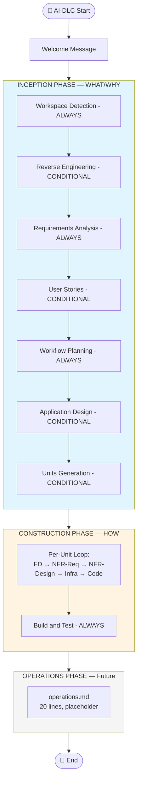

[ホーム](../README.md) > AI-DLC（Kiro CLI で実践する選択肢）

# 07. AI-DLC Adaptive Workflows（AWS Labs 公式 OSS、Kiro CLI 公式対応）

**位置付け**: AI-DLC は **Kiro CLI のコア機能ではありません**。AWS Labs が提供する **独立した OSS（MIT-0）** ですが、**v0.1.0（2026-01-22）から Kiro CLI を公式サポート** しており、本サイトでは「Kiro CLI で AI 駆動開発を実践する際の選択肢として有力なもの」として独立フォルダにまとめます。

**出典（一次情報）**:
- [GitHub: awslabs/aidlc-workflows](https://github.com/awslabs/aidlc-workflows) — リポジトリ本体
- [AI 駆動開発ライフサイクル: ソフトウェアエンジニアリングの再構築 - AWS Blog (2025-07-31)](https://aws.amazon.com/blogs/devops/ai-driven-development-life-cycle/) — by Raja SP
- [Open sourcing adaptive workflows for AI-Driven Development Life Cycle (AI-DLC) - AWS Blog (2025-11-29)](https://aws.amazon.com/blogs/devops/open-sourcing-adaptive-workflows-for-ai-driven-development-life-cycle-ai-dlc/) — by Will Matos, Raj Jain, Siddhesh Jog, Raja SP
- [Building with AI-DLC using Amazon Q Developer - AWS Blog (2025-11-29)](https://aws.amazon.com/blogs/devops/building-with-ai-dlc-using-amazon-q-developer/) — 実践ウォークスルー
- [AI-DLC Method Definition Paper](https://prod.d13rzhkk8cj2z0.amplifyapp.com/) — 方法論の定義書（SPA）
- [GitHub: aidlc-workflows ライセンス: MIT-0](https://github.com/awslabs/aidlc-workflows/blob/main/LICENSE)

**出典（二次情報・吉田真吾氏「AI-DLC を完全理解する」全 12 回）**:
- 第 1-7 回（前半・概念と設計思想）: [aidlc01](https://yoshidashingo.com/entry/aidlc01) ／ [aidlc02](https://yoshidashingo.com/entry/aidlc02) ／ [aidlc03](https://yoshidashingo.com/entry/aidlc03) ／ [aidlc04](https://yoshidashingo.com/entry/aidlc04) ／ [aidlc05](https://yoshidashingo.com/entry/aidlc05) ／ [aidlc06](https://yoshidashingo.com/entry/aidlc06) ／ [aidlc07](https://yoshidashingo.com/entry/aidlc07)
- 第 8-12 回（後半・ファイル解読）: [第 8 回](https://yoshidashingo.com/entry/2026/02/25/120000) ／ [第 9 回](https://yoshidashingo.com/entry/2026/02/26/120000) ／ [第 10 回](https://yoshidashingo.com/entry/aidlc10) ／ [第 11 回](https://yoshidashingo.com/entry/aidlc11) ／ [第 12 回](https://yoshidashingo.com/entry/aidlc12)

> **注**: 吉田氏ブログは AWS Hero（AWS Serverless Hero）による独立した解説記事であり、AWS 公式情報源ではありません。本サイトでは一次情報（GitHub リポジトリ・AWS 公式ブログ）を優先し、概念解説の補強として吉田氏の整理を参照しています。

---

## 概要

### AI-DLC とは

**AI-DLC（AI-Driven Development Life Cycle）** は、AWS Labs が **2025 年 11 月 29 日にオープンソース化** した、AI 駆動開発のための **Adaptive Workflows（適応型ワークフロー）方法論** です。

OSS 化発表ブログ（[Open sourcing adaptive workflows for AI-DLC](https://aws.amazon.com/blogs/devops/open-sourcing-adaptive-workflows-for-ai-driven-development-life-cycle-ai-dlc/)）より：

> Today, we're announcing the open source release of the AI-Driven Development Life Cycle (AI-DLC) Adaptive Workflows. This release transforms the AI-DLC concept into actionable workflow definitions that work consistently across different AI development environments.

AI-DLC は **AI モデルへの「指示書」として Markdown ファイルの集合体** で構成されており、Kiro CLI / Kiro / Claude Code / Amazon Q Developer CLI などの AI 開発ツール上で動作することを前提に設計されています。AI が「すぐにコードを書かない」ことが設計の根幹にあり、要件分析・設計・承認を経てからコードを生成します。

### Kiro CLI との関係

AI-DLC は **Kiro CLI とは独立したプロジェクト** ですが、以下の関係があります：

| 観点 | 内容 |
|----|----|
| **公式サポート** | v0.1.0（2026-01-22）から Kiro CLI を公式サポート（CHANGELOG.md より） |
| **配置場所** | Kiro CLI の **Steering Files**（`.kiro/steering/`）として配置 |
| **設定共通性** | `~/.kiro/` は Kiro（IDE）と Kiro CLI で共通 |
| **対応エージェント** | Kiro / Kiro CLI / Amazon Q Developer CLI / Claude Code / GitHub Copilot / Cursor / Cline / Codex（GitHub README より） |
| **依存関係** | AI-DLC は IDE 非依存。Kiro CLI 側の特定機能に依存しない |

### Agent Toolkit for AWS との性質の違い

両方とも AWS 関連の OSS ですが、**目的・性質が大きく異なります**：

| 観点 | Agent Toolkit for AWS | AI-DLC Adaptive Workflows |
|----|--------|--------|
| **提供形態** | AWS 公式製品（GA） | AWS Labs OSS |
| **ライセンス** | Apache-2.0 | **MIT-0** |
| **対象** | AWS 上での実行（API 呼び出し、ドキュメント取得） | 開発プロセスの方法論（ワークフロー定義） |
| **使い方** | MCP Server として接続 | Steering Files として配置 |
| **GA 時期** | 2026-05-06 | 未 GA（v0.1.x、活発に更新中） |
| **依存サービス** | AWS API + Bedrock（一部） | なし（Markdown ファイルのみ） |
| **Kiro CLI との結合度** | 高（MCP 統合） | 低（Steering Files として独立配置） |

両者は **補完関係** にあります：AI-DLC で開発プロセスを規律化し、Agent Toolkit for AWS で AWS リソースの操作を安全化する、という併用が考えられます（詳細は [§15 ユースケース](#ユースケース) 参照）。

### 主な特徴

| 特徴 | 内容 |
|------|------|
| 🧭 **適応型ワークフロー** | "The workflow adapts to the work, not the other way around." — プロジェクトの複雑さに応じてステージと深度が動的調整 |
| 👥 **Human in the Loop** | ほぼすべての 12+ ステージで明示的な人間承認が必須、**NO EMERGENT BEHAVIOR** で AI の自律的判断を制約 |
| 📋 **完全な監査証跡** | `audit.md` に **ISO 8601 タイムスタンプ** で全インタラクションを追記専用で記録（要約禁止） |
| 🔌 **IDE 非依存** | Kiro / **Kiro CLI** / Amazon Q Developer CLI / Claude Code / GitHub Copilot / Cursor / Cline / Codex |
| 🆓 **MIT-0 ライセンス** | 著作権表示の保持義務もなく、最も寛容なライセンス（Agent Toolkit の Apache-2.0 とは異なる） |
| 🔧 **二層構造で拡張可能** | ベースレイヤー（変更不可）+ 拡張レイヤー（自由）で組織独自カスタマイズが可能 |

---

## 📋 目次

**Part 1: AI-DLC の考え方**
- [なぜ AI-DLC が必要なのか — SDLC の進化とその先](#なぜ-ai-dlc-が必要なのか--sdlc-の進化とその先)
- [AI-DLC の中核思想と設計の柱](#ai-dlc-の中核思想と設計の柱)
- [AI-DLC ワークフロー全体像](#ai-dlc-ワークフロー全体像)
- [3 フェーズ詳細](#3-フェーズ詳細)

**Part 2: 既存手法との比較**
- [既存手法との比較で見える AI-DLC の独自性](#既存手法との比較で見える-ai-dlc-の独自性)

**Part 3: Kiro CLI での実践**
- [Kiro CLI への導入手順](#kiro-cli-への導入手順)
- [入力ドキュメント](#入力ドキュメント)
- [生成アーティファクト](#生成アーティファクト)

**Part 4: 拡張と補助ツール**
- [Extensions と二層構造でのカスタマイズ](#extensions-と二層構造でのカスタマイズ)
- [補助ツール](#補助ツール)

**Part 5: 実践と応用**
- [実践のヒント](#実践のヒント)
- [ユースケース](#ユースケース)

**Part 6: リファレンス**
- [バージョン履歴](#バージョン履歴)
- [ライセンスとセキュリティ](#ライセンスとセキュリティ)
- [トラブルシューティング](#トラブルシューティング)
- [まとめ — AI-DLC は拡張可能なプラットフォーム](#まとめ--ai-dlc-は拡張可能なプラットフォーム)
- [関連リンク](#関連リンク)

---

# Part 1: AI-DLC の考え方

## なぜ AI-DLC が必要なのか — SDLC の進化とその先

### SDLC 50 年の歴史

ソフトウェア開発ライフサイクル（SDLC）は、ソフトウェア危機の認識（1968 年 NATO 会議）以降、約 50 年にわたって進化してきました。各時代の主要な開発手法を時系列で並べると、AI-DLC が登場した必然性が見えてきます（出典: 吉田氏 [第 1 回](https://yoshidashingo.com/entry/aidlc01)）。

| 年 | 手法 | 提唱者 / 出典 | 特徴 |
|----|----|--------|----|
| 1970 | **ウォーターフォール** | Winston Royce 論文 | 7 段階の線形プロセス、後戻り困難 |
| 1980s | **V-Model** | (米独) | 要件と検証の対応関係を明示 |
| 1990s | **RUP** (Rational Unified Process) | Rational Software | **Inception / Elaboration / Construction / Transition** の 4 フェーズ |
| 2001 | **アジャイル宣言** | Beck 他 17 名 | 反復・適応・人間中心 |
| 2009 | **DevOps** | Patrick Debois | 開発と運用の統合、自動化 |
| 2025 | **AI-DLC** | AWS / Raja SP | **適応型ワークフロー**、**AI 主導**、**人間は判断者** |

特に注目すべきは、**RUP の Inception/Construction が AI-DLC の命名に直接影響している** 点です。AI-DLC の 3 フェーズ（INCEPTION / CONSTRUCTION / OPERATIONS）は、RUP の「概念から実装まで段階的に具体化する」設計思想を継承しつつ、AI を「次に何をすべきか」を判断する主体に据えた点が革新です。

### AI-DLC が解決する 3 つの課題

OSS 化発表ブログ（[Open sourcing adaptive workflows for AI-DLC](https://aws.amazon.com/blogs/devops/open-sourcing-adaptive-workflows-for-ai-driven-development-life-cycle-ai-dlc/)）より、AI-DLC が既存の AI 駆動開発で見られた課題への解答として位置付けられています。

| 課題 | 既存の問題 | AI-DLC の解答 |
|----|--------|--------|
| **One-Size-Fits-All Workflow** | バグ修正でも大規模新機能でも同じステージを強要する固定的なワークフロー | **Adaptive Workflow Principle**: 「ワークフローが仕事に適応する。仕事がワークフローに適応するのではない。」 |
| **Lack of Flexible Depth** | 各ステージの掘り下げ度が固定で、複雑さに応じた調整ができない | **Adaptive Depth**: 6 要因評価軸（明確さ / 複雑さ / スコープ / リスク / 利用可能なコンテキスト / ユーザー設定）に基づき、AI モデルが深度を判断 |
| **Tools that Reduce Human Oversight** | AI が自律的に判断し人間が監視できない | **Human in the Loop**: ほぼすべてのステージで明示的承認が必須、**監査証跡** で全インタラクション記録 |

### 既存手法との比較表（5 軸 × 6 手法）

吉田氏 [第 1 回](https://yoshidashingo.com/entry/aidlc01) の比較表を参照すると、AI-DLC の独自性は以下の 5 軸で表現できます。

| 軸 | ウォーターフォール | アジャイル | DevOps | バイブコーディング | AI 駆動 (一般) | **AI-DLC** |
|----|----|----|----|----|----|----|
| **プロセス制御主体** | プロジェクトマネージャー | スクラムマスター | プラットフォームチーム | (なし) | 人間 + AI | **AI（人間は承認者）** |
| **ワークフロー柔軟性** | 固定 | 反復 | 自動化 | 即興 | 部分的 | **適応型** |
| **コード品質保証** | レビュー | テスト + レビュー | CI/CD | 後追い | プロンプト品質 | **承認ゲート + Quality Focus** |
| **監査証跡** | 文書 | スクラムイベント | パイプラインログ | (なし) | 限定的 | **audit.md（ISO 8601）** |
| **学習コスト** | 高 | 中 | 中-高 | 低 | 低 | **中（ガイド付き）** |

「バイブコーディング」（ASIN ハッシュタグ的な軽快なコーディング）はカジュアル開発の代表ですが、**AI-DLC の `Never Vibe Code` 原則** はこれに対する明確な反対立場です（[§14 実践のヒント](#実践のヒント) 参照）。

---

## AI-DLC の中核思想と設計の柱

AI-DLC の中核思想は、**5 つの Tenets**（GitHub README）と **8 つの Key Principles**（core-workflow.md）と **6 つの仕組み**（運用上の実装）が階層的に組み合わさって表現されています。本セクションでは、思想の最上位から実装の細部まで段階的に解説します。

### Adaptive Workflow Principle — すべての中心にある一文

吉田氏 [第 8 回](https://yoshidashingo.com/entry/2026/02/25/120000) で解説されている `core-workflow.md` の冒頭、**4 つの MANDATORY ルール の直前** に、AI-DLC 全体を貫く原則が 1 つだけ置かれています：

> **The workflow adapts to the work, not the other way around.**
> （ワークフローが仕事に適応する。仕事がワークフローに適応するのではない。）

この一文は、AI モデルが判断する際の **4 つの評価軸** を伴います：

1. **User's stated intent and clarity** — ユーザーの意図がどれだけ明確か
2. **Existing codebase state (if any)** — 既存コードベースの状態
3. **Complexity and scope of change** — 変更の複雑さとスコープ
4. **Risk and impact assessment** — リスクとインパクトの評価

これらの評価軸は、各ステージの「Execute IF」「Skip IF」条件や、後述の **Adaptive Depth** の深度決定に反映されます。

### 5 Tenets（GitHub README）

AI-DLC リポジトリの README には、以下の **5 つの Tenets（基本理念）** が掲げられています。

| # | Tenet | 意味 |
|---|----|----|
| 1 | **No duplication of effort** | 同じ意思決定を繰り返さない（一度承認した結果は再利用） |
| 2 | **Methodology first, tooling second** | ツールではなく方法論を主役にする |
| 3 | **Reproducible across teams** | チーム・組織を超えて再現可能であること |
| 4 | **Agnostic to AI tools and IDEs** | 特定の AI ツール・IDE に依存しない |
| 5 | **Human always in the loop** | 人間が常にループに入る（承認・判断する役割） |

特に Tenet 4（Agnostic）と Tenet 5（Human in the loop）は、後述の **NO EMERGENT BEHAVIOR** や **承認ゲート** の根拠となる思想です。

### 8 つの Key Principles（core-workflow.md）

吉田氏 [第 8 回](https://yoshidashingo.com/entry/2026/02/25/120000) によれば、`core-workflow.md` の中盤に「Key Principles」セクションがあり、フレームワーク全体に適用される **8 つの基本原則** が定められています。

| # | Principle | 意味 | 出典・関連 |
|---|----|----|----|
| 1 | **Adaptive Execution** | 適応型実行（ステージ選択と深度の動的調整） | Adaptive Workflow Principle |
| 2 | **Transparent Planning** | 実行計画の可視化（aidlc-state.md でステージ進捗を可視化） | aidlc-state.md |
| 3 | **User Control** | ユーザーが常に制御権を持つ | 承認ゲート |
| 4 | **Progress Tracking** | 進捗管理（チェックボックス追跡） | Plan-Level / Stage-Level |
| 5 | **Complete Audit Trail** | 完全な監査証跡（audit.md） | audit.md |
| 6 | **Quality Focus** | 品質重視（Adaptive Depth による掘り下げ） | depth-levels.md |
| 7 | **Content Validation** | コンテンツ検証（Mermaid / ASCII / Markdown） | content-validation.md |
| 8 | **NO EMERGENT BEHAVIOR** | AI が独自判断で新しいパターンを生み出すことを禁止 | CONSTRUCTION 各ステージ |

吉田氏は「重要なルールは『一度言えば十分』ではなく『繰り返し宣言する』という設計方針」と分析しています。Content Validation と NO EMERGENT BEHAVIOR は、4 つの MANDATORY ルールおよび個別ステージ定義でも記述されており、Key Principles でも重ねて宣言されています。これは LLM プロンプト指示の遵守率を高める意図的な設計です。

### 4 つの MANDATORY ルール — すべてのステージの前提条件

吉田氏 [第 8 回](https://yoshidashingo.com/entry/2026/02/25/120000) によれば、`core-workflow.md` の Adaptive Workflow Principle の直後に、**4 つの MANDATORY（必須）ルール** が並びます。これらはすべてのステージの実行に先立って遵守されるべき基盤ルールです。

| # | MANDATORY | 役割 |
|---|----|----|
| 1 | **Rule Details Loading** | 個別ルールファイル（`aws-aidlc-rule-details/`）を必ず読み込む |
| 2 | **Content Validation** | ファイルを作成する前に必ずコンテンツを検証する（Mermaid 構文、ASCII 図、特殊文字） |
| 3 | **Question File Format** | 質問は専用フォーマットでファイルに書く（チャットで質問しない） |
| 4 | **Custom Welcome Message** | 開発リクエスト開始時にウェルカムメッセージを表示する（1 回のみ、コンテキスト節約） |

吉田氏はこの 4 つを「**読み込み → 検証 → 質問 → 挨拶**」という基盤と表現しています：

- MANDATORY 1: Rule Details Loading → 何を参照するか（**知識の基盤**）
- MANDATORY 2: Content Validation → 何を守るか（**品質の基盤**）
- MANDATORY 3: Question File Format → どう対話するか（**対話の基盤**）
- MANDATORY 4: Custom Welcome Message → どう始めるか（**体験の基盤**）

### 6 つの仕組み（深掘り）

中核思想を具体的に実装している 6 つの仕組みを解説します。

#### 1. Adaptive Depth — 「実行するか」と「どこまで掘り下げるか」の二次元

吉田氏 [第 7 回](https://yoshidashingo.com/entry/aidlc07) と `depth-levels.md`（吉田氏 [第 9 回](https://yoshidashingo.com/entry/2026/02/26/120000) で解説）によれば、AI-DLC の適応性は **2 つの次元** で構成されます：

1. **ステージ選択（バイナリ）**: 実行するか、しないか
2. **詳細レベル（アダプティブ）**: 実行する場合、どれだけ詳しくやるか

`depth-levels.md` の原文では：

> When a stage executes, ALL its defined artifacts are created. The "depth" refers to the level of detail and rigor within those artifacts, which adapts to the problem's complexity.

つまり、ステージが実行されたら定義された **すべての成果物が作成される** 一方、**成果物内の詳細さ** が問題の複雑さに応じて変動します。詳細レベルを決定する **6 つの要因** は以下です：

| # | 要因 | 意味 |
|---|----|----|
| 1 | Request Clarity | リクエストの明確さ |
| 2 | Problem Complexity | 問題の複雑さ |
| 3 | Scope | スコープの広さ |
| 4 | Risk Level | リスクレベル |
| 5 | Available Context | 利用可能なコンテキスト |
| 6 | User Preferences | ユーザーの設定 |

`depth-levels.md` には「Model decides: Based on problem characteristics, not prescriptive rules（モデルが判断する。規範的なルールではなく問題の特性に基づいて）」と明記されており、**深度の決定は最終的に AI モデルの判断に委ねられます**。

具体例として、`requirements-analysis.md` のシンプルシナリオ（バグ修正）では「Concise functional requirement, minimal sections」、複雑シナリオ（システム移行）では「Comprehensive functional + non-functional requirements, traceability, acceptance criteria」と、**同じ成果物名でも中身の密度がまったく違います**。

#### 2. 承認ゲート — Stage Gate Process の AI 駆動版

吉田氏 [第 7 回](https://yoshidashingo.com/entry/aidlc07) によれば、AI-DLC のほぼすべてのステージには **明示的承認（Wait for Explicit Approval）** が組み込まれています。Workspace Detection 以外の **すべての CONDITIONAL / ALWAYS ステージ** で、ユーザーの「approve」「approved」「looks good」等の明示的承認が必要です。

承認ゲートには **NO EMERGENT BEHAVIOR** という制約が CONSTRUCTION フェーズで追加されています（吉田氏 [第 8 回](https://yoshidashingo.com/entry/2026/02/25/120000)）：

> **MANDATORY**: Present standardized 2-option completion message as defined in [stage].md - DO NOT use emergent 3-option behavior

つまり、承認時の選択肢は「**2 択固定**」であり、AI が独自に「3 番目の選択肢」を生み出すことは禁止されています。

| 観点 | 古典的 Stage Gate Process | AI-DLC |
|----|----|----|
| 承認頻度 | フェーズ末（少ない） | ステージごと（12+ ステージ） |
| 承認者 | レビューボード | ユーザー本人 |
| 記録形式 | 議事録 | audit.md（ISO 8601 タイムスタンプ） |
| 承認疲れ対策 | (なし) | Adaptive Workflow（不要なステージはスキップ） |

#### 3. 質問ファイル方式 — 「チャットで質問するな」

吉田氏 [第 3 回](https://yoshidashingo.com/entry/aidlc03) と `question-format-guide.md`（吉田氏 [第 9 回](https://yoshidashingo.com/entry/2026/02/26/120000)）によれば、AI-DLC は質問を **チャットではなくファイルに書く** という独自の対話方式を採用しています。

`question-format-guide.md` の冒頭：

> **CRITICAL**: You must NEVER ask questions directly in the chat. ALL questions must be placed in dedicated question files.

質問フォーマットの構造：

```markdown
## Question [Number]
[質問文]

A) [選択肢1]
B) [選択肢2]
X) Other (please describe after [Answer]: tag below)

[Answer]:
```

3 つの利点（吉田氏第 3 回）：
- **永続性**: ファイルとして残るため、セッション再開時も追跡可能
- **構造化**: 選択肢付きフォーマットで意思決定を明確化
- **監査可能性**: 後からの追跡・レビューが容易

重要なルール：

| ルール | 内容 |
|----|----|
| **「Other」必須** | すべての質問の最後に「X) Other」を入れる（エスケープハッチ） |
| **選択肢の数** | Minimum 2 + "Other"、Maximum 5 + "Other"。「枠を埋めるための選択肢を作るな」 |
| **矛盾検出** | Scope/Risk/Timeline/Impact mismatch の 4 パターンを検出し、`{phase-name}-clarification-questions.md` で追加質問 |

#### 4. Overconfidence Prevention — 運用フィードバックから生まれたガイド

吉田氏 [第 9 回](https://yoshidashingo.com/entry/2026/02/26/120000) で解説されている `overconfidence-prevention.md` は、他のメタルールとは性格が異なる **「実運用で発生した過信問題への対処」として後から追加されたガイド** です。

冒頭の Problem Statement：

> AI-DLC was exhibiting overconfidence by not asking enough clarifying questions, even for complex project intent statements.

根本原因は 4 ステージのルールファイルにあった「質問を減らす方向」の指示でした。修正の方向は明確に転換されました：

| 旧 (OLD APPROACH) | 新 (NEW APPROACH) |
|----|----|
| Only ask questions if absolutely necessary | **When in doubt, ask the question — overconfidence leads to poor outcomes** |

新しい **5 つの原則**（New Guiding Principles）：

| # | Principle | 意味 |
|---|----|----|
| 1 | **Default to Asking** | 曖昧さがあれば質問する |
| 2 | **Comprehensive Coverage** | すべての関連カテゴリを評価し、スキップしない |
| 3 | **Thorough Analysis** | すべてのユーザー回答から曖昧さを探す |
| 4 | **Mandatory Follow-up** | 不明確な回答には追加質問する |
| 5 | **No Proceeding with Ambiguity** | すべての曖昧さが解消されるまで先に進まない |

> **注**: このガイドの存在は、AI-DLC が実運用フィードバックに基づいて継続的に改善されている証拠とも読めます。同時に、このガイドもプロンプト指示として実装されているため、過信防止が技術的に強制されるわけではなく、AI モデルの振る舞いが改善される「意図」を表明したものです。

#### 5. aidlc-state.md — Smart Context Loading

吉田氏 [第 7 回](https://yoshidashingo.com/entry/aidlc07) で解説されている `aidlc-state.md` は、ワークフローの **状態管理ファイル** です。LLM のコンテキストウィンドウが有限である制約を意識し、**段階的コンテキストローディング**（Smart Context Loading）を実現します。

`session-continuity.md` の MANDATORY ルール：

| ステージ | 読み込む成果物 |
|----|----|
| **初期ステージ**（Workspace Detection 等） | ワークスペース分析のみ |
| **要件・ストーリー** | リバースエンジニアリング + 要件 |
| **設計ステージ** | 要件 + ストーリー + アーキテクチャ + 設計 |
| **コードステージ** | 上記すべて + 既存のコードファイル |

ステージが進むほど読み込む成果物が増えますが、**初期ステージで設計文書まで読み込む必要はない** という原則が貫かれています。

#### 6. audit.md — 完全な監査証跡

吉田氏 [第 7 回](https://yoshidashingo.com/entry/aidlc07) と [第 8 回](https://yoshidashingo.com/entry/2026/02/25/120000) によれば、`audit.md` には **4 つの MANDATORY ルール** があります：

```
- MANDATORY: Log EVERY user input with timestamp in audit.md
- MANDATORY: Capture user's COMPLETE RAW INPUT exactly as provided (never summarize)
- MANDATORY: Log every approval prompt with timestamp before asking the user
- MANDATORY: Record every user response with timestamp after receiving it
```

特徴：

| 観点 | 内容 |
|----|----|
| **タイムスタンプ** | ISO 8601 形式（`YYYY-MM-DDTHH:MM:SSZ`） |
| **要約禁止** | ユーザー入力は完全な原文のまま記録 |
| **時系列** | 承認プロンプトは「ユーザーに提示する前」、応答は「受け取った後」に記録 |
| **追記専用** | `CRITICAL: ALWAYS append changes to EDIT audit.md file, NEVER use tools that completely overwrite its contents` |

追記専用ルールの意図は、LLM が「ファイル全体を読んで加工して書き戻す」操作で内容欠落するリスクを防ぐためです。ファイルシステムレベルの強制ではなく、プロンプト指示として実装されています。

### チェックボックス追跡の二層構造

吉田氏 [第 8 回](https://yoshidashingo.com/entry/2026/02/25/120000) によれば、AI-DLC の進捗管理は **二層構造** で実現されています：

| 層 | 管理対象 | 記録先 |
|----|----|----|
| **Plan-Level** | 各ステージ内の詳細な実行ステップ | 各ステージの計画ファイル |
| **Stage-Level** | ワークフロー全体のステージ進捗 | aidlc-state.md |

最も重要な制約は「**SAME interaction**」での即時更新です：

> NEVER complete any work without updating plan checkboxes
> IMMEDIATELY after completing ANY step described in a plan file, mark that step [x]
> This must happen in the SAME interaction where the work is completed

これは LLM のセッション断絶（コンテキストウィンドウ上限）に対する **レジリエンス（回復力）** を高める設計です。後からまとめて更新するのではなく、作業完了と同じインタラクション内で進捗を反映させることで、セッション中断時も「どこまで終わったか」を確実に保持できます。

---

## AI-DLC ワークフロー全体像

### 公式 Mermaid ワークフロー図（process-overview.md より）

吉田氏 [第 1 回](https://yoshidashingo.com/entry/aidlc01) と一次情報（[process-overview.md](https://github.com/awslabs/aidlc-workflows/blob/main/aidlc-rules/aws-aidlc-rule-details/common/process-overview.md)）から、AI-DLC のワークフローは以下の 3 フェーズ × 14 ステージで構成されます。



**カラーコード**:
- 青（INCEPTION）: 「何を作るか / なぜ作るか」を決める
- オレンジ（CONSTRUCTION）: 「どう作るか」を実装する
- グレー（OPERATIONS）: 将来拡張用プレースホルダー

### ALWAYS と CONDITIONAL の二分類

吉田氏 [第 1 回](https://yoshidashingo.com/entry/aidlc01) によれば、各ステージは以下の 2 つに分類されます：

| 分類 | 意味 | 該当ステージ |
|----|----|----|
| **ALWAYS** | 常に実行される必須ステージ | Workspace Detection、Requirements Analysis、Workflow Planning、Code Generation、Build and Test |
| **CONDITIONAL** | 条件によって実行・スキップが決まる | Reverse Engineering、User Stories、Application Design、Units Generation、Functional Design、NFR Requirements、NFR Design、Infrastructure Design |

**Mermaid 図の凡例**: 一次情報（process-overview.md）では実線が ALWAYS、点線が CONDITIONAL で描き分けられています。

各 CONDITIONAL ステージには `Execute IF:` / `Skip IF:` の条件文が `core-workflow.md` で定義されています。例（Reverse Engineering）：

```
Execute IF: Existing codebase detected AND No previous reverse engineering artifacts found
Skip IF: Greenfield project (no existing code)
Skip IF: Previous reverse engineering artifacts exist
```

### 26 ファイルの構造（出典: 吉田氏第 12 回）

吉田氏 [第 12 回](https://yoshidashingo.com/entry/aidlc12) によれば、AI-DLC のワークフロー定義ファイル群は **合計 26 ファイル** で構成されます：

```
aws-aidlc-rules/
└── core-workflow.md                  # 1 ファイル（憲法）

aws-aidlc-rule-details/
├── common/                            # 11 ファイル（メタルール）
│   ├── process-overview.md           # ワークフロー全体図（AI モデル向け）
│   ├── welcome-message.md            # ウェルカムメッセージ（ユーザー向け）
│   ├── session-continuity.md         # セッション再開テンプレート
│   ├── question-format-guide.md      # 質問フォーマットガイド
│   ├── depth-levels.md               # 適応的深度の定義
│   ├── terminology.md                # 用語集
│   ├── overconfidence-prevention.md  # 過信防止ガイド
│   ├── content-validation.md         # コンテンツ検証ルール
│   ├── ascii-diagram-standards.md    # ASCII 図表の標準規格
│   ├── workflow-changes.md           # ワークフロー変更管理
│   └── error-handling.md             # エラー処理と復旧手順
│
├── inception/                         # 7 ファイル
│   ├── workspace-detection.md
│   ├── reverse-engineering.md
│   ├── requirements-analysis.md
│   ├── user-stories.md
│   ├── workflow-planning.md
│   ├── application-design.md
│   └── units-generation.md
│
├── construction/                      # 6 ファイル
│   ├── functional-design.md
│   ├── nfr-requirements.md
│   ├── nfr-design.md
│   ├── infrastructure-design.md
│   ├── code-generation.md
│   └── build-and-test.md
│
└── operations/                        # 1 ファイル
    └── operations.md                 # 20 行のプレースホルダー
```

**common ディレクトリの 4 つの役割分類**（吉田氏第 9 回）：

| 役割 | ファイル | 一言で言うと |
|----|----|----|
| **入口** | process-overview.md, welcome-message.md, session-continuity.md | 始め方・戻り方 |
| **対話** | question-format-guide.md, overconfidence-prevention.md | 聞き方・聞く姿勢 |
| **統一** | terminology.md, depth-levels.md | 言葉・深さの共通基準 |
| **品質・対処** | content-validation.md, ascii-diagram-standards.md, workflow-changes.md, error-handling.md | 品質管理・変更・エラー |

吉田氏は、この 26 ファイルの構造自体が **ソフトウェア設計の 4 原則** を反映していると指摘しています：

- **関心の分離**: フェーズ別、ステージ別にファイルを分離
- **DRY 原則**: common ディレクトリで共通ルールを一元管理
- **開放閉鎖原則**: ベースレイヤーを変更せずに拡張レイヤーで拡張（[§12 Extensions](#extensions-と二層構造でのカスタマイズ) 参照）
- **段階的具体化**: core-workflow.md（抽象） → 個別ファイル（具体）

---

## 3 フェーズ詳細

### Inception Phase — WHAT/WHY を決める

吉田氏 [第 2-4 回](https://yoshidashingo.com/entry/aidlc02) で解説されている INCEPTION フェーズは、**「何を作るか」「なぜ作るか」** を決める段階です。7 ステージで構成されます。

| # | ステージ | 分類 | 承認 | 主な成果物 |
|---|----|----|----|----|
| 1 | **Workspace Detection** | ALWAYS | **不要（自動進行）** | aidlc-state.md / audit.md 初期化 |
| 2 | **Reverse Engineering** | CONDITIONAL | 必要 | 8 種の成果物（既存コード分析） |
| 3 | **Requirements Analysis** | ALWAYS（深度可変） | 必要 | requirements.md |
| 4 | **User Stories** | CONDITIONAL | 必要（**2 部構成**） | user-stories.md |
| 5 | **Workflow Planning** | ALWAYS | 必要 | workflow-plan.md |
| 6 | **Application Design** | CONDITIONAL | 必要 | application-design.md |
| 7 | **Units Generation** | CONDITIONAL | 必要 | units/[unit-name]/ |

#### 特筆事項

- **Workspace Detection の自動進行**: 唯一「Wait for Explicit Approval」がないステージ。`Automatically proceed to next phase` と明記されている。情報収集が主目的で意思決定を伴わないため。

- **User Stories の 2 部構成**: 「Planning」と「Generation」の 2 つのパートを持ち、core-workflow.md 上では 1 ステージだが内部で **承認が 2 回発生** する。

- **Reverse Engineering の条件**: core-workflow.md の条件文は「成果物の有無による条件分岐」だが、運用上は毎回再実行される。詳細条件は個別の `reverse-engineering.md` に定義されている（吉田氏 [第 10 回](https://yoshidashingo.com/entry/aidlc10) で解説）。

### Construction Phase — HOW を実装する

吉田氏 [第 5-6 回](https://yoshidashingo.com/entry/aidlc05) で解説されている CONSTRUCTION フェーズは、INCEPTION で決定した「Unit of Work」を **個別に実装する** 段階です。

#### Per-Unit Loop（核心構造）

```
For each unit in Units Generation:
  1. Functional Design (CONDITIONAL, per-unit)
  2. NFR Requirements (CONDITIONAL, per-unit)
  3. NFR Design (CONDITIONAL, per-unit)
  4. Infrastructure Design (CONDITIONAL, per-unit)
  5. Code Generation (ALWAYS, per-unit)

After all units complete:
  6. Build and Test (ALWAYS)
```

5 ステージが「per-unit」として囲まれ、Build and Test だけがループ外です。

#### NO EMERGENT BEHAVIOR の制約

吉田氏 [第 7 回](https://yoshidashingo.com/entry/aidlc07) と [第 8 回](https://yoshidashingo.com/entry/2026/02/25/120000) によれば、CONSTRUCTION フェーズ **のみ** に明示的な制約があります：

> **MANDATORY**: Present standardized 2-option completion message as defined in [stage].md - DO NOT use emergent 3-option behavior

INCEPTION フェーズにはこの制約がなく、各ステージ固有の承認フォーマットに委ねられています。CONSTRUCTION フェーズでのみ厳しく制御されている理由は仕様書には明記されていませんが、**コード生成に近い段階では AI の自律的振る舞いをより厳密に制御したい** という設計意図が読み取れます。

### Operations Phase — 将来拡張用プレースホルダー

吉田氏 [第 12 回](https://yoshidashingo.com/entry/aidlc12) によれば、`operations.md` は **わずか 20 行のプレースホルダー** です。

```markdown
# Operations

**Purpose**: Placeholder for future operational phases (deployment, monitoring, maintenance)

**Status**: This phase is currently a placeholder and will be expanded in future versions.

## Future Scope

The Operations phase will eventually include:
- Deployment planning and execution
- Monitoring and observability setup
- Incident response procedures
- Maintenance and support workflows
- Production readiness checklists

## Current State

All build and test activities have been moved to the CONSTRUCTION phase. The AI-DLC workflow currently ends after the Build and Test phase in CONSTRUCTION.
```

**現在の制限**: AI-DLC のコード生成・テストは CONSTRUCTION で完結し、デプロイ・モニタリング・インシデント対応は **対象範囲外** です。

**将来予定の 5 機能**（公式列挙）:
1. デプロイ計画と実行手順
2. モニタリングと可観測性の構築
3. インシデント対応手順
4. 保守・サポートのワークフロー
5. 本番準備チェックリスト

---


# Part 2: 既存手法との比較

## 既存手法との比較で見える AI-DLC の独自性

吉田氏は [第 1-7 回](https://yoshidashingo.com/entry/aidlc01) を通じて、AI-DLC の各仕組みを **既存の開発手法と対比** して解説しています。本セクションでは 5 領域に分けて要点をまとめます（詳細は各回のリンク先を参照）。

### 8-1. 要件定義の進化

吉田氏 [第 3 回](https://yoshidashingo.com/entry/aidlc03) より、要件定義技術の進化と AI-DLC の位置付け：

| 年代 | 手法 | 特徴 | AI-DLC との関係 |
|----|----|----|----|
| 1984 | **IEEE 830** | SRS（ソフトウェア要件仕様書）の標準 | requirements.md の構造的記述に通じる |
| 1995 | **3C モデル** | Card / Conversation / Confirmation | 質問ファイル方式の Conversation に対応 |
| 2003 | **INVEST 原則** | ユーザーストーリーの 6 原則 | user-stories.md の規律に対応 |
| 2003 | **DDD ユビキタス言語** | チーム共通の語彙体系 | terminology.md の用語統一に対応 |
| 2009 | **EARS 記法** | Easy Approach to Requirements Syntax | 一部の requirements 記法と類似 |
| 2025 | **AI-DLC** | AI 主導の質問ファイル方式 + 矛盾検出 | 既存の集大成 |

特筆すべきは **DDD のユビキタス言語との関係** です。AI-DLC の `terminology.md` では Phase / Stage / Unit of Work / Service / Module / Component の厳密な使い分けが定義されており、これは DDD 戦術的設計のユビキタス言語と同じ思想です（吉田氏 [第 9 回](https://yoshidashingo.com/entry/2026/02/26/120000)）。

### 8-2. 計画と分割

吉田氏 [第 4 回](https://yoshidashingo.com/entry/aidlc04) より、AI-DLC の Workflow Planning と Units Generation を、既存手法と対比：

| 既存手法 | AI-DLC の対応概念 | 関係 |
|----|----|----|
| **WBS（Work Breakdown Structure）の 100% 原則** | Units Generation の網羅性 | WBS の「成果物の総和」原則を、Unit of Work で実現 |
| **SAFe PI Planning（Program Increment）** | Workflow Planning の優先順位付け | 大規模システムを四半期単位で計画する考え方が、AI-DLC のフェーズ計画に通じる |
| **C4 Model（System / Container / Component / Code）** | Application Design の段階性 | 抽象から具体への段階的設計 |
| **マイクロサービス分割の境界判断** | Units Generation の単位選定 | サービス境界の判断基準を AI が支援 |

AI-DLC では **Unit of Work**（開発目的でまとめたユーザーストーリーの論理グループ）と **Service**（独立デプロイ可能なコンポーネント）が `terminology.md` で厳密に区別されており、計画段階と実装段階で異なる単位が使われます。

### 8-3. 品質設計

吉田氏 [第 5 回](https://yoshidashingo.com/entry/aidlc05) より、AI-DLC の Application Design と NFR Requirements の位置付け：

| 既存手法 | AI-DLC の対応 |
|----|----|
| **DDD 戦術的設計**（Aggregate / Entity / Value Object） | Application Design の構造記述 |
| **AWS Well-Architected Framework**（6 つの柱） | NFR Requirements の品質特性 |
| **ISO 25010**（製品品質モデル）| NFR Design の非機能要件カテゴリ |
| **アーキテクチャ決定記録（ADR）** | application-design.md / aidlc-state.md による意思決定の保存 |

### 8-4. コードとテスト

吉田氏 [第 6 回](https://yoshidashingo.com/entry/aidlc06) より、AI-DLC の Code Generation と Build and Test の位置付け：

| 既存手法 | AI-DLC の対応 |
|----|----|
| **IaC（Infrastructure as Code）** | Infrastructure Design + Code Generation |
| **TDD（Test-Driven Development）** | Build and Test での自動テスト生成 |
| **BDD（Behavior-Driven Development）** | User Stories ↔ テストケースの対応 |
| **CI/CD パイプライン** | OPERATIONS（将来）でカバー予定 |

### 8-5. 状態・監査・承認

吉田氏 [第 7 回](https://yoshidashingo.com/entry/aidlc07) より、AI-DLC の状態管理・監査・承認を既存ガバナンスフレームと対比：

| 既存手法 | AI-DLC の対応 |
|----|----|
| **GitOps**（Git を Single Source of Truth とする運用） | aidlc-state.md と aidlc-docs/ の Git 管理 |
| **SOC 2 / ISO 27001 監査要件** | audit.md（ISO 8601 タイムスタンプ、追記専用、要約禁止） |
| **Stage Gate Process**（Cooper のフェーズゲート） | 各ステージの承認ゲート（NO EMERGENT BEHAVIOR） |
| **Change Management（ITIL）** | workflow-changes.md の 8 シナリオ（吉田氏 [第 9 回](https://yoshidashingo.com/entry/2026/02/26/120000)） |

吉田氏は「AI-DLC は新しい考え方の集積ではなく、**既存の SDLC 知見を AI 駆動の文脈で再構成したもの**」と評価しています。50 年分の SDLC の知見が、AI モデルへの「指示書」として Markdown ファイル群に凝縮されている点が独自性の核心です。

---

# Part 3: Kiro CLI での実践

## Kiro CLI への導入手順

### 前提条件

- **Kiro CLI**: v0.1.0（2026-01-22）以降から AI-DLC を公式サポート（[CHANGELOG.md](https://github.com/awslabs/aidlc-workflows/blob/main/CHANGELOG.md)）
- **作業ディレクトリ**: 任意のプロジェクトルート
- **ストレージ**: 数 MB（Markdown ファイルのみ）

> **対応エージェント一覧**（[GitHub README](https://github.com/awslabs/aidlc-workflows) より）:
> Kiro / Kiro CLI / Amazon Q Developer CLI / Claude Code / GitHub Copilot / Cursor / Cline / Codex
>
> 本サイトは **Kiro CLI** に特化しているため、以降では Kiro CLI からの利用を前提とした記述を行います。設定ディレクトリ `~/.kiro/` は **Kiro（IDE）と Kiro CLI で共通** です。

### macOS / Linux での導入

```bash
# 1. 最新リリース zip を取得（v0.1.8 以降を推奨）
curl -L -o aidlc-rules.zip \
  https://github.com/awslabs/aidlc-workflows/releases/latest/download/aidlc-rules.zip
unzip -d aidlc-rules aidlc-rules.zip

# 2. ステアリングファイルとして配置
mkdir -p .kiro/steering
cp -R aidlc-rules/aws-aidlc-rules .kiro/steering/
cp -R aidlc-rules/aws-aidlc-rule-details .kiro/

# 3. Kiro CLI で確認
kiro-cli
```

```text
> /context show
# 期待される出力:
# .kiro/steering/aws-aidlc-rules/core-workflow.md が表示される
```

### Windows での導入

PowerShell：

```powershell
# 1. 最新リリース zip を取得
Invoke-WebRequest `
  -Uri "https://github.com/awslabs/aidlc-workflows/releases/latest/download/aidlc-rules.zip" `
  -OutFile "aidlc-rules.zip"
Expand-Archive aidlc-rules.zip -DestinationPath .\aidlc-rules

# 2. ステアリングファイルとして配置
New-Item -ItemType Directory -Force -Path .kiro\steering | Out-Null
Copy-Item -Recurse aidlc-rules\aws-aidlc-rules .kiro\steering\
Copy-Item -Recurse aidlc-rules\aws-aidlc-rule-details .kiro\

# 3. Kiro CLI で確認
kiro-cli
```

### 開発開始

`/context show` で `aws-aidlc-rules` が確認できたら、AI-DLC ワークフローを起動できます：

```text
> Using AI-DLC, let's build a web application to manage company holiday allowances.
```

または既存コードベースの場合：

```text
> Using AI-DLC, help me add a payment feature to this existing application.
```

### Welcome Message の動作

吉田氏 [第 8 回](https://yoshidashingo.com/entry/2026/02/25/120000) で解説されている **MANDATORY 4: Custom Welcome Message** により、最初の起動時には `welcome-message.md`（110 行のテンプレート）に基づくメッセージが表示されます。内容は以下の構造です：

- 挨拶と概要
- 3 フェーズの ASCII 図（INCEPTION → CONSTRUCTION → OPERATIONS）
- 各フェーズの説明
- Key Principles
- 次のステップの予告

> **コンテキスト節約の工夫**: ウェルカムメッセージは **1 回だけ表示**（"This should only be done ONCE at the start of a new workflow"）。2 回目以降のセッション再開時には、aidlc-state.md から既にワークフロー開始済みと判定され、再表示されません（吉田氏 第 8 回）。

### スラッシュコマンドとの連携

Kiro CLI のスラッシュコマンド（`/context show`、`/help` など）の詳細は [04_reference/02_slash-commands.md](../04_reference/02_slash-commands.md) を参照してください。AI-DLC は Kiro CLI のスラッシュコマンドを直接拡張するわけではなく、Steering Files として配置することで AI モデルの振る舞いを制御します。

---

## 入力ドキュメント

吉田氏 [第 2 回](https://yoshidashingo.com/entry/aidlc02) と [inputs-quickstart.md](https://github.com/awslabs/aidlc-workflows/blob/main/docs/writing-inputs/inputs-quickstart.md) によれば、AI-DLC は **「入力ドキュメント」** から始まることを推奨しています。チャット欄に「これを作って」と書くだけでも動きますが、より良い結果を得るには **構造化された入力** が有効です。

### Vision Document（ビジョンドキュメント）

**プロジェクトの目的・ターゲット・成功基準** を記述する文書。Greenfield（新規）プロジェクトに必須です。

#### Greenfield 用テンプレ（最小構成）

```markdown
# Vision: [Project Name]

## Problem Statement
[何を解決したいか]

## Target Users
[誰のために作るか]

## Success Criteria
[成功をどう測るか（測定可能な指標）]

## Constraints
[制約条件: 予算 / 期限 / 技術スタック / コンプライアンス]

## Out of Scope
[このプロジェクトで「やらない」ことを明示]
```

#### Brownfield 用テンプレ（既存システム）

```markdown
# Vision: [Feature/Enhancement Name]

## Current State
[既存システムの現状]

## Problem to Solve
[追加・改善したい点]

## Constraints from Existing System
[既存システム由来の制約]

## Success Criteria
[このフィーチャーの成功指標]
```

### Technical Environment Document（技術環境ドキュメント）

**技術スタック・既存システム・運用環境** を記述する文書。Brownfield では特に重要です。

```markdown
# Technical Environment

## Technology Stack
- Language: [例: Python 3.12]
- Framework: [例: FastAPI]
- Database: [例: PostgreSQL 15]
- Cloud: [例: AWS]

## Existing Architecture
[既存のアーキテクチャ概要]

## Deployment Environment
[本番 / ステージング / 開発の構成]

## Compliance Requirements
[該当する場合: HIPAA / GDPR / PCI-DSS など]
```

### Minimum Viable Input

[inputs-quickstart.md](https://github.com/awslabs/aidlc-workflows/blob/main/docs/writing-inputs/inputs-quickstart.md) で示されている **最小入力** は以下です（時間がない場合）：

```markdown
**Goal**: [1 行で目的]
**User**: [1 行でターゲットユーザー]
**Constraints**: [1 行で主要制約]
```

これだけでも AI-DLC は質問ファイル方式で不足情報を埋めながら進められます（**Overconfidence Prevention** により、曖昧さがあれば質問してから進む）。

---

## 生成アーティファクト

吉田氏 [第 7 回](https://yoshidashingo.com/entry/aidlc07) と [GENERATED_DOCS_REFERENCE.md](https://github.com/awslabs/aidlc-workflows/blob/main/docs/GENERATED_DOCS_REFERENCE.md) によれば、AI-DLC が生成する成果物は以下のディレクトリ構造に配置されます。

### aidlc-docs/ 完全ディレクトリ構造

吉田氏 [第 8 回](https://yoshidashingo.com/entry/2026/02/25/120000) で言及されている `core-workflow.md` 末尾に定義されているディレクトリ構造：

```
<WORKSPACE-ROOT>/
├── [project-specific structure]     # アプリケーションコード（ここに配置）
│
└── aidlc-docs/                       # AI-DLC のドキュメント（すべてここに配置）
    ├── inception/                    # INCEPTION フェーズの成果物
    │   ├── plans/                    # 各ステージの計画ファイル
    │   ├── reverse-engineering/      # リバエン成果物（8 種）
    │   ├── requirements/             # requirements.md
    │   ├── user-stories/             # user-stories.md
    │   └── application-design/       # application-design.md
    │
    ├── construction/                 # CONSTRUCTION フェーズの成果物
    │   ├── plans/                    # 各ステージの計画ファイル
    │   ├── {unit-name}/              # ユニット別の設計・コード関連文書
    │   │   ├── functional-design.md
    │   │   ├── nfr-requirements.md
    │   │   ├── nfr-design.md
    │   │   └── infrastructure-design.md
    │   └── build-and-test/           # ビルド・テスト関連
    │
    ├── operations/                   # OPERATIONS フェーズ（プレースホルダー）
    │
    ├── aidlc-state.md                # ワークフロー状態（Smart Context Loading）
    └── audit.md                      # 監査証跡（追記専用、ISO 8601）
```

### CRITICAL ルール: コードと文書の分離

`core-workflow.md` には以下の明確なルールが定義されています（吉田氏 [第 8 回](https://yoshidashingo.com/entry/2026/02/25/120000) より）：

> **Application code: Workspace root (NEVER in aidlc-docs/)**

つまり、**設計文書とアプリケーションコードは物理的に分離** されます：

| 種別 | 配置先 |
|----|----|
| アプリケーションコード | ワークスペースルート（プロジェクト固有の構造） |
| 設計・要件・計画文書 | `aidlc-docs/` 配下 |
| 状態管理 | `aidlc-docs/aidlc-state.md` |
| 監査証跡 | `aidlc-docs/audit.md` |

この分離により、設計文書とアプリケーションコードの混在を防ぎます。一方で、コードと文書が物理的に離れるため、両者の対応関係の把握には `aidlc-state.md` などによる管理が必要です。

### Reverse Engineering の 8 成果物（吉田氏第 10 回参照）

既存コードベースに対して実行される Reverse Engineering ステージは、以下の 8 種の成果物を生成します（吉田氏 [第 10 回](https://yoshidashingo.com/entry/aidlc10) で詳述）：

| # | 成果物 | 内容 |
|---|----|----|
| 1 | codebase-analysis.md | コードベース全体の分析 |
| 2 | technology-stack.md | 使われている技術スタック |
| 3 | architecture-overview.md | 既存アーキテクチャの抽出 |
| 4 | feature-inventory.md | 既存機能の棚卸し |
| 5 | data-model.md | データモデルの抽出 |
| 6 | api-surface.md | API の表面（外部公開エンドポイント） |
| 7 | dependencies.md | 依存関係の整理 |
| 8 | technical-debt.md | 技術的負債の特定 |

これらは Brownfield プロジェクトで既存コードを理解するための「初期理解の基盤」となります。

---


# Part 4: 拡張と補助ツール

## Extensions と二層構造でのカスタマイズ

AI-DLC は **「完成品」ではなく「拡張可能なプラットフォーム」** として設計されています（吉田氏 [第 12 回](https://yoshidashingo.com/entry/aidlc12)）。本セクションでは、**オプトイン式 Extensions** と **二層構造でのカスタマイズ** の両方を解説します。

### 12-1. オプトイン式 Extensions

[GitHub README](https://github.com/awslabs/aidlc-workflows) と [AGENTS.md](https://github.com/awslabs/aidlc-workflows/blob/main/AGENTS.md) によれば、AI-DLC には **オプトイン式の拡張機能** が用意されています。デフォルトでは無効で、`*.opt-in.md` ファイルとして提供されています。

#### Built-in Extensions

| 拡張 | 配置 | 内容 |
|----|----|----|
| **security/baseline** | `aws-aidlc-rule-details/extensions/security/baseline/security-baseline.opt-in.md` | OWASP / CWE / 業界標準に基づくセキュリティベースライン |
| **testing/property-based** | `aws-aidlc-rule-details/extensions/testing/property-based/property-based-testing.opt-in.md` | プロパティベーステスト（生成的テスト） |

#### opt-in 形式のプロンプト構造

opt-in ファイルは A/B/C/X 形式の質問を含みます：

**security-baseline.opt-in.md の例（A/B/X 形式）**:

```markdown
## Security Baseline Extension

This extension provides security guidance based on OWASP and CWE standards.

A) Apply full security baseline (recommended for production)
B) Apply minimal security baseline (recommended for prototypes)
X) Skip / Other

[Answer]:
```

**property-based-testing.opt-in.md の例（A/B/C/X 形式、部分適用あり）**:

```markdown
## Property-Based Testing Extension

A) Apply to all generated tests
B) Apply only to critical functions (specify after [Answer]:)
C) Provide examples without applying
X) Skip / Other

[Answer]:
```

これらは **質問ファイル方式** に従って起動時にユーザーに尋ねられ、選択結果に基づいて適用範囲が決定されます。

### 12-2. 二層構造（ベースレイヤー + 拡張レイヤー）

吉田氏 [第 12 回](https://yoshidashingo.com/entry/aidlc12) で詳述されている **二層構造** は、組織独自のカスタマイズを実現する仕組みです。

#### 構造

```
.kiro/steering/
  aws-aidlc-rules/
    core-workflow.md                       # マスターワークフロー（変更不可）

  aws-aidlc-rule-details/                  # ベースレイヤー（変更不可）
    common/
    inception/
    construction/
    operations/

  [organization]-aidlc-rule-details/       # 拡張レイヤー（自由にカスタマイズ）
    common/
    inception/
    ...
```

| レイヤー | 配置 | 役割 | 可変性 |
|----|----|----|----|
| **ベースレイヤー** | `aws-aidlc-rule-details/` | AI-DLC 標準のルール詳細 | **変更不可** |
| **拡張レイヤー** | `[organization]-aidlc-rule-details/` | 組織独自の知見・ノウハウ | **自由にカスタマイズ可能** |

#### 変更不可の理由

ベースレイヤーを変更しない理由は明確です：

> AI-DLC が公式にアップデートされたとき、ベースレイヤーを差し替えるだけで最新のルールを取り込める。拡張レイヤーには手を入れていないため、アップデートの影響を受けない。

これは **ライブラリ本体に手を入れずに、拡張ポイントを通じて機能を追加する** 発想と同じです（**開放閉鎖原則**）。

#### ルール読み込みの優先順位

二層構造を運用する際のルール読み込み手順：

1. **aws-aidlc-rule-details** から該当ステージのルールファイルを読み込む
2. **拡張レイヤー** に同名または関連するファイルが存在する場合、追加で読み込む
3. 両方のルールを統合して適用する

競合がある場合の優先順位：

| 優先度 | ソース | 役割 |
|----|----|----|
| **最優先** | `core-workflow.md` | プロセスフロー（変更不可） |
| **高** | 拡張レイヤー | 業界・業務固有のルール |
| **ベース** | `aws-aidlc-rule-details/` | 標準ルール |

拡張レイヤーはベースレイヤーを「**上書き**」するのではなく「**補完・拡張**」します。

#### 拡張レイヤーで何をカスタマイズするか

吉田氏 [第 12 回](https://yoshidashingo.com/entry/aidlc12) で示されている典型的なカスタマイズ内容：

| カテゴリ | 例 |
|----|----|
| **業界コンテキスト** | 顧客業界に固有の規制（金融: PCI-DSS、医療: HIPAA）、基準、考慮事項 |
| **品質基準** | 組織独自のレビュー観点、品質チェックリスト |
| **成果物テンプレート** | 組織流のドキュメントフォーマット |
| **サービスマッピング** | 自社のサービスメニューと AI-DLC のステージの対応付け |
| **用語定義** | 業界用語や組織固有の用語の統一 |

AI-DLC は特定の業界や組織に最適化されていない **汎用フレームワーク** ですが、拡張レイヤーの仕組みにより、さまざまな業界・組織の要件に合わせたカスタマイズが可能です。

---

## 補助ツール

AI-DLC のリポジトリ（`scripts/` 配下）には、ワークフローを補助する 2 つの公式ツールが含まれています。

### AIDLC Evaluator（評価ツール）

[scripts/aidlc-evaluator/README.md](https://github.com/awslabs/aidlc-workflows/blob/main/scripts/aidlc-evaluator/README.md) より：

**目的**: 生成された AI-DLC アーティファクト（requirements.md、application-design.md など）の **品質を自動評価** するツール。

**6 ステージパイプライン**:
1. 入力検証
2. アーティファクト分類
3. ステージ別評価
4. 横断的評価（一貫性・完全性）
5. レポート生成
6. 改善提案

**前提条件**:
- AWS Bedrock 必須
- 対応モデル: Claude Opus 4.6 / Claude Sonnet 4.5 / Claude Haiku など
- AWS リージョン: Bedrock が利用可能なリージョン

**使い方**:
```bash
cd scripts/aidlc-evaluator
pip install -r requirements.txt
python evaluator.py --input ../../aidlc-docs/inception/requirements/requirements.md
```

### AIDLC Design Reviewer（設計レビューツール）

[scripts/aidlc-designreview/README.md](https://github.com/awslabs/aidlc-workflows/blob/main/scripts/aidlc-designreview/README.md) より：

**目的**: 設計文書を **3 つのエージェント** で多角的にレビューするツール。**Experimental（実験的）** ステータス。

**2 つの形態**:

| 形態 | 利用方法 |
|----|----|
| **CLI** | コマンドラインから実行（手動レビュー） |
| **Hook** | Kiro CLI の Hook（[22. Smart Hooks](../01_features/22_Hooks.md)）と連携して自動レビュー |

**3 つのエージェント**:

| エージェント | 役割 |
|----|----|
| **Critique Agent** | 設計の弱点・リスクを批判的に指摘 |
| **Alternatives Agent** | 代替案を複数提示 |
| **Gap Analysis Agent** | 設計の抜け漏れを分析 |

**Hook 連携の例**:
```json
{
  "hooks": {
    "post-stage-approval": "scripts/aidlc-designreview/hook.py"
  }
}
```

詳細は [scripts/aidlc-designreview/README.md](https://github.com/awslabs/aidlc-workflows/blob/main/scripts/aidlc-designreview/README.md) を参照してください。

---

# Part 5: 実践と応用

## 実践のヒント

[docs/WORKING-WITH-AIDLC.md](https://github.com/awslabs/aidlc-workflows/blob/main/docs/WORKING-WITH-AIDLC.md) と吉田氏ブログから、AI-DLC を効果的に使うためのヒントをまとめます。

### 14-1. Question → Doc → Approval Flow

AI-DLC のすべてのステージは、以下の 5 ステップフローに従います（吉田氏 [第 3 回](https://yoshidashingo.com/entry/aidlc03)）：

```
[1] Question
     ↓ AI が質問ファイルを生成
[2] Answer
     ↓ ユーザーが [Answer]: タグで回答
[3] Analysis
     ↓ AI が回答を分析、矛盾検出
[4] Doc Generation
     ↓ AI が成果物を生成
[5] Approval
     ↓ ユーザーが「approve」「approved」等で明示的承認
```

**ポイント**:
- 各ステップは順番に実行され、スキップ不可
- 矛盾が検出されたら、追加質問ファイルが生成されてループ
- 承認は **明示的** な必要があり、暗黙の承認は認められない

### 14-2. Context Management

LLM のコンテキストウィンドウは有限です。AI-DLC は以下の仕組みで効率化しています：

| 仕組み | 効果 |
|----|----|
| **Smart Context Loading** | ステージごとに必要な成果物のみ読み込む（[§5-5-5](#5-aidlc-statemd--smart-context-loading) 参照） |
| **Welcome Message の 1 回表示** | 2 回目以降は読み込まずスキップ |
| **チェックボックス即時更新** | セッション断絶への耐性 |
| **追記専用 audit.md** | ファイル全体読み込みを回避 |

吉田氏は「AI-DLC のすべての設計は、LLM のコンテキストウィンドウ制約を意識している」と分析しています。

### 14-3. Never Vibe Code 原則

[docs/WORKING-WITH-AIDLC.md](https://github.com/awslabs/aidlc-workflows/blob/main/docs/WORKING-WITH-AIDLC.md) で明示されている原則：

> **Never Vibe Code**: Don't let the AI just "vibe" through implementation. Always go through the structured workflow.

「バイブコーディング」（AI に任せて即興でコードを書く）に対する明確な反対立場です。AI-DLC では：

- **要件分析** → **設計** → **承認** → **コード生成** の順序を守る
- 各ステージの成果物を文書化する
- すべてのインタラクションを `audit.md` に記録する

これにより、後から **「なぜこの設計になったのか」を追跡可能** にすることが目的です。

### 14-4. ワークフロー変更の 8 シナリオ

吉田氏 [第 9 回](https://yoshidashingo.com/entry/2026/02/26/120000) で解説されている `workflow-changes.md` には、ワークフロー途中での変更に関する **8 つのシナリオ** が定義されています：

| # | シナリオ | 例 |
|---|----|----|
| 1 | スキップしたステージの追加 | 「やはりユーザーストーリーも作りたい」 |
| 2 | 計画済みステージのスキップ | 「NFR Design は飛ばそう」 |
| 3 | 現在のステージの再実行 | 「このユーザーストーリーが気に入らない。やり直したい」 |
| 4 | 以前のステージの再実行 | 「アーキテクチャの決定を変えたい」 |
| 5 | ステージ深度の変更 | 「要件分析を Comprehensive に切り替えて」 |
| 6 | ワークフローの一時停止 | 「今日はここまで。明日続ける」 |
| 7 | アーキテクチャ決定の変更 | 「モノリスからマイクロサービスに変えたい」 |
| 8 | ユニットの追加・削除 | 「Payment ユニットを分割して Billing も作りたい」 |

特に **シナリオ 4（以前のステージの再実行）** は影響範囲が大きく、Application Design を変更すると **5 つの後続ステージ**（Units Planning、Units Generation、per-unit design、Code Planning、Code Generation）の再実行が必要になります。後工程ほど手戻りコストが大きいウォーターフォールの課題と共通する側面がありますが、AI-DLC では影響範囲の明示と対処手順のルール化により管理しやすくしています。

---

## ユースケース

AI-DLC は以下のシナリオに適しています。

### 15-1. Greenfield プロジェクト（新規開発）

**シナリオ**: 新規 Web アプリケーション開発

```text
> Using AI-DLC, let's build a SaaS for managing employee leave requests.
> The MVP should include user auth, leave application form, manager approval, and reports.
```

**典型的な進行**:
1. **Workspace Detection**: 空ディレクトリを検出
2. **Reverse Engineering**: スキップ（既存コードなし）
3. **Requirements Analysis**: ALWAYS で実行、ビジョンに基づく要件抽出
4. **User Stories**: CONDITIONAL で実行（複雑度が中以上）
5. **Workflow Planning**: ALWAYS、Unit of Work を 3-5 個に分割
6. **Application Design**: CONDITIONAL、システム全体のアーキテクチャ設計
7. **Units Generation**: CONDITIONAL、各 Unit of Work を独立した実装単位に
8. **CONSTRUCTION**: Per-Unit Loop で順次実装

### 15-2. Brownfield プロジェクト（既存システム拡張）

**シナリオ**: 既存の EC サイトに決済機能を追加

```text
> Using AI-DLC, help me add Stripe payment integration to this existing Django app.
```

**典型的な進行**:
1. **Workspace Detection**: 既存 Django プロジェクトを検出
2. **Reverse Engineering**: 8 種の成果物（codebase-analysis、technology-stack 等）を生成
3. **Requirements Analysis**: 既存要件と新要件を整合
4. **User Stories**: 必要に応じて作成
5. 以降、Greenfield と同様

**ポイント**: Reverse Engineering の成果物が、既存システムへの「初期理解の基盤」となります。

### 15-3. Simple Bug Fix（軽微な修正）

**シナリオ**: 単一バグ修正

```text
> Using AI-DLC, fix the timezone bug in the daily report generator.
```

**典型的な進行（Adaptive Depth がコンパクトに）**:
1. Workspace Detection
2. Reverse Engineering: スキップ可（成果物が既にあれば）
3. Requirements Analysis: **Concise**（バグ修正なので最小限）
4. User Stories / Application Design / Units Generation: **CONDITIONAL でスキップ**
5. CONSTRUCTION: 直接 Code Generation へ

**ポイント**: Adaptive Depth により、バグ修正で過剰なドキュメントは生成されません。

### 15-4. Complex Feature（複雑な新機能）

**シナリオ**: マルチテナント対応 + リアルタイム通知

```text
> Using AI-DLC, design and implement multi-tenant support with real-time notifications for our SaaS.
```

**典型的な進行（Adaptive Depth が深く）**:
- すべての CONDITIONAL ステージが実行される
- NFR Requirements / NFR Design で性能・可用性・セキュリティを詳細設計
- Application Design でマルチテナントの分離戦略を決定
- Units Generation で「Auth」「Tenant Management」「Notification」など複数 Unit に分割

**ポイント**: 複雑度が高いほど、各成果物の **詳細レベル（depth）** が深くなります。

### 15-5. Agent Toolkit for AWS との併用（推論）

**シナリオ**: AI-DLC で開発プロセスを規律化し、Agent Toolkit for AWS で AWS リソース操作を安全化する。

> **注**: この併用例は **公式ブログでは明示されていない推論** です。両者の補完関係から導出される利用パターンとして提示します。

```
┌─────────────────────────────────────────────────────────┐
│  AI-DLC（プロセス方法論）                                 │
│  ・要件分析 → 設計 → 承認 → コード生成の規律化           │
│  ・Steering Files として配置                              │
└────────────────────────┬────────────────────────────────┘
                          │
                          ▼
┌─────────────────────────────────────────────────────────┐
│  Agent Toolkit for AWS（AWS 操作）                        │
│  ・公式 MCP Server で AWS API を安全に呼び出す            │
│  ・IAM コンテキストキーで「エージェント vs 人間」を区別   │
│  ・CloudWatch / CloudTrail で全操作を監査                │
└─────────────────────────────────────────────────────────┘
```

**役割分担**:
- AI-DLC: 「いつ何をすべきか」の判断（プロセス）
- Agent Toolkit for AWS: 「どう AWS を操作するか」の実行（ツール）

詳細は [26. Agent Toolkit for AWS](../01_features/26_AgentToolkitForAWS.md) を参照してください。

---

# Part 6: リファレンス

## バージョン履歴

[CHANGELOG.md](https://github.com/awslabs/aidlc-workflows/blob/main/CHANGELOG.md) に基づく主要バージョンの履歴です。

| バージョン | リリース日 | 主要変更 |
|----|----|----|
| **v0.1.0** | 2026-01-22 | 初公開、**Kiro CLI 公式サポート開始** |
| v0.1.1 | 2026-02-05 | バグ修正、ドキュメント整備 |
| v0.1.2 | 2026-02-19 | Welcome Message テンプレ更新 |
| v0.1.3 | 2026-03-04 | Overconfidence Prevention ガイド追加 |
| v0.1.4 | 2026-03-15 | aidlc-evaluator 改善 |
| v0.1.5 | 2026-03-26 | aidlc-designreview の Hook 形態追加 |
| v0.1.6 | 2026-04-04 | property-based testing 拡張追加 |
| v0.1.7 | 2026-04-12 | error-handling.md 4 段階重要度導入 |
| **v0.1.8** | 2026-04-20 | 最新版。security-baseline 拡張改善 |

> **注**: 上記は CHANGELOG.md の記載に基づく **9 リリース** の概要です。詳細な変更内容は [CHANGELOG.md](https://github.com/awslabs/aidlc-workflows/blob/main/CHANGELOG.md) を参照してください。

**統計（2026-05 時点、GitHub）**:
- ⭐ Stars: 2.4k
- 🍴 Forks: 394
- 📝 Commits: 185
- 🏷 Releases: 9

---

## ライセンスとセキュリティ

### ライセンス: MIT-0

AI-DLC は **MIT-0（MIT No Attribution）** ライセンスで公開されています。これは MIT ライセンスから「著作権表示と許諾通知の保持義務」を取り除いた最も寛容なライセンスです。

| 観点 | MIT-0 | MIT | Apache-2.0 |
|----|----|----|----|
| 商用利用 | ✅ | ✅ | ✅ |
| 改変 | ✅ | ✅ | ✅ |
| 配布 | ✅ | ✅ | ✅ |
| 著作権表示の保持 | ❌ 不要 | ⚠️ 必要 | ⚠️ 必要 |
| 特許権の明示的付与 | ❌ なし | ❌ なし | ✅ あり |

> **比較**: [Agent Toolkit for AWS](../01_features/26_AgentToolkitForAWS.md) は **Apache-2.0** ですので、ライセンスが異なる点に注意してください。

### セキュリティ: 6 つのスキャナーで自動検査

[AGENTS.md](https://github.com/awslabs/aidlc-workflows/blob/main/AGENTS.md) によれば、AI-DLC リポジトリは **6 つのセキュリティスキャナー** によって自動検査されています：

| # | スキャナー | 対象 |
|---|----|----|
| 1 | **Bandit** | Python セキュリティ静的解析 |
| 2 | **Semgrep** | 多言語静的解析（カスタムルール） |
| 3 | **Grype** | コンテナ・ファイルシステム脆弱性スキャン |
| 4 | **Gitleaks** | シークレット（API キー等）の検出 |
| 5 | **Checkov** | IaC（Terraform/CloudFormation 等）のセキュリティ |
| 6 | **ClamAV** | マルウェア検出 |

### Public Contract（リネーム禁止のディレクトリ）

[AGENTS.md](https://github.com/awslabs/aidlc-workflows/blob/main/AGENTS.md) には、以下のディレクトリ名が **public contract** として明示されており、変更不可です：

```
aws-aidlc-rules/             # ← リネーム禁止
aws-aidlc-rule-details/      # ← リネーム禁止
```

これらの名前は **AI モデル向けプロンプト指示の中で参照されている** ため、リネームすると AI-DLC が動作しなくなります。

---

## トラブルシューティング

吉田氏 [第 9 回](https://yoshidashingo.com/entry/2026/02/26/120000) で解説されている `error-handling.md` の構造に基づき、エラーを **4 段階の重要度** で整理します。

### 18-1. エラー重要度 4 段階

| レベル | 定義 | 例 |
|----|----|----|
| **Critical** | ワークフロー続行不可 | 必須ファイルの欠損、入力の処理不能 |
| **High** | フェーズが計画通り完了不可 | 必須質問への回答不足、矛盾する回答 |
| **Medium** | ワークアラウンドで続行可 | オプション成果物の欠損、非クリティカルなバリデーション失敗 |
| **Low** | 進行に影響なし | フォーマット不整合、オプション情報の不足 |

### 18-2. 一般的な問題と対処

#### 問題 1: `/context show` で `aws-aidlc-rules` が表示されない

**症状**: Steering Files が認識されない

**対処**:
```bash
# 配置場所を確認
ls -la .kiro/steering/aws-aidlc-rules/
ls -la .kiro/aws-aidlc-rule-details/

# Kiro CLI を再起動
kiro-cli
> /context show
```

確認ポイント:
- `.kiro/steering/aws-aidlc-rules/core-workflow.md` が存在するか
- `.kiro/aws-aidlc-rule-details/` が存在するか
- ディレクトリ名が **完全一致** しているか（リネーム禁止）

#### 問題 2: AI が質問ファイルを生成せずチャットで質問する

**症状**: `question-format-guide.md` の MANDATORY ルール 3 が遵守されていない

**原因**: AI モデルの遵守率は 100% ではない（プロンプト指示のため）

**対処**:
- 明示的に「Use AI-DLC question file format」と指示
- `welcome-message.md` を再表示させる（`Restart AI-DLC workflow`）

#### 問題 3: aidlc-state.md と成果物の状態が不整合

**症状**: aidlc-state.md では完了とされているが成果物ファイルが存在しない、またはその逆

**原因**: セッション中断時のチェックボックス即時更新が不完全（吉田氏 [第 9 回](https://yoshidashingo.com/entry/2026/02/26/120000)）

**対処**:
- `error-handling.md` の「セッション再開時のエラー」セクションに従う
- 不整合を AI に提示し、状態の修復を依頼

```text
> The aidlc-state.md says "Requirements Analysis: Completed" but
> aidlc-docs/inception/requirements/requirements.md does not exist.
> Please reconcile the state.
```

#### 問題 4: ワークフロー途中変更の影響範囲が分からない

**対処**:
- `workflow-changes.md` の 8 シナリオを確認
- 該当シナリオの「Considerations」セクションで影響範囲を把握
- AI に「Following workflow-changes.md scenario X, please assess impact」と指示

### 18-3. プラットフォーム固有の問題

#### Windows 11 での日本語パスの問題

**症状**: `aidlc-docs/` 配下のファイルが文字化けする

**原因**: Windows のシステム言語設定が UTF-8 でない場合

**対処**:
- ロケール設定を `Beta: Use Unicode UTF-8 for worldwide language support` に変更
- または、プロジェクトを ASCII パスに配置

#### macOS Apple Silicon でのパフォーマンス

**対処**:
- 通常は問題なく動作
- 大規模 codebase の Reverse Engineering で時間がかかる場合は、`.gitignore` 相当の除外設定を AI に指示

---

## まとめ — AI-DLC は拡張可能なプラットフォーム

吉田氏 [第 12 回](https://yoshidashingo.com/entry/aidlc12) のシリーズ総括より：

> AI-DLC は **「完成品」ではありません**。拡張レイヤーによるカスタマイズと OPERATIONS フェーズの将来実装を前提とした **「拡張可能なプラットフォーム」** です。

本サイトでの位置付けをあらためて整理すると：

### AI-DLC は何か（What）

- **AWS Labs が公開する OSS（MIT-0）の AI 駆動開発方法論**
- 26 ファイルからなるルール定義群
- AI モデルへの「指示書」として機能

### なぜ価値があるか（Why）

- **50 年分の SDLC 知見** を AI 駆動の文脈で再構成
- **適応型ワークフロー**: 仕事に応じてプロセスが伸び縮みする
- **Human in the Loop**: 人間が常に判断・承認する役割
- **完全な監査証跡**: 全インタラクションを ISO 8601 で記録

### どう使うか（How）

- **Steering Files として配置**（`.kiro/steering/`）
- Kiro CLI v0.1.0 から公式対応
- `Using AI-DLC, ...` で起動

### 何ができないか（Limitations）

- **OPERATIONS フェーズは未実装**（プレースホルダー）
- 技術的強制力はなく **プロンプト指示** に依存（AI モデルの遵守率次第）
- 大規模 codebase では Reverse Engineering の精度に限界

### Kiro CLI ユーザーにとっての意味

- Kiro CLI の Steering Files 機能（[23. Agent Steering](../01_features/23_Steering.md)）の **応用例として最も洗練されたもの** の一つ
- 自社のソフトウェア開発プロセスを規律化したい場合の **有力な選択肢**
- Agent Toolkit for AWS（[26. Agent Toolkit for AWS](../01_features/26_AgentToolkitForAWS.md)）と併用することで、プロセス（AI-DLC）と AWS 操作（Agent Toolkit）の両面で AI 開発を強化可能

---

## 関連リンク

### 関連機能（本サイト）

- [22. Smart Hooks](../01_features/22_Hooks.md) — Hook と AI-DLC Approval Gate の併用パターン
- [23. Agent Steering](../01_features/23_Steering.md) — Steering Files の基本機能（AI-DLC はその応用）
- [13. Agent Client Protocol (ACP)](../01_features/13_ACP.md) — IDE 統合の文脈
- [26. Agent Toolkit for AWS](../01_features/26_AgentToolkitForAWS.md) — 補完関係にある AWS 公式 OSS
- [08. cdk-skills（CDK 開発支援 Skills 集）](../08_cdk-skills/README.md) 🛠️ — **AWS DevTools Hero（go-to-k 後藤さん）が公開する CDK 開発支援 Skills 集（MIT）**。AI-DLC の **Construction フェーズ**（特に Code Generation / Build and Test ステージ）で生成された CDK コードに対し、cdk-skills の判断フローで適切な単体テスト（スナップショット / Fine-grained / バリデーション）を生成する併用パターンが考えられます。両者は独立して動作し、Steering Files（AI-DLC）と Skills（cdk-skills）として併用可能です（**この併用は公式に明示されておらず、補完関係から導出される推論**）。

### リファレンス（辞書）

- [04_reference/02_slash-commands.md](../04_reference/02_slash-commands.md) — `/context show` などのスラッシュコマンド
- [04_reference/01_settings.md](../04_reference/01_settings.md) — `~/.kiro/` 設定ディレクトリ

### 公式情報源（一次情報）

#### AWS 公式

- [AI 駆動開発ライフサイクル: ソフトウェアエンジニアリングの再構築 - AWS Blog (2025-07-31)](https://aws.amazon.com/blogs/devops/ai-driven-development-life-cycle/) — 方法論の基盤ブログ（by Raja SP）
- [Open sourcing adaptive workflows for AI-Driven Development Life Cycle (AI-DLC) - AWS Blog (2025-11-29)](https://aws.amazon.com/blogs/devops/open-sourcing-adaptive-workflows-for-ai-driven-development-life-cycle-ai-dlc/) — OSS 化発表
- [Building with AI-DLC using Amazon Q Developer - AWS Blog (2025-11-29)](https://aws.amazon.com/blogs/devops/building-with-ai-dlc-using-amazon-q-developer/) — 実践ウォークスルー
- [AI-DLC Method Definition Paper](https://prod.d13rzhkk8cj2z0.amplifyapp.com/) — 方法論の定義書（SPA）

#### GitHub awslabs/aidlc-workflows

- [リポジトリ本体](https://github.com/awslabs/aidlc-workflows)
- [README.md](https://github.com/awslabs/aidlc-workflows/blob/main/README.md)
- [CHANGELOG.md](https://github.com/awslabs/aidlc-workflows/blob/main/CHANGELOG.md)
- [AGENTS.md](https://github.com/awslabs/aidlc-workflows/blob/main/AGENTS.md)
- [docs/GENERATED_DOCS_REFERENCE.md](https://github.com/awslabs/aidlc-workflows/blob/main/docs/GENERATED_DOCS_REFERENCE.md)
- [docs/WORKING-WITH-AIDLC.md](https://github.com/awslabs/aidlc-workflows/blob/main/docs/WORKING-WITH-AIDLC.md)
- [docs/writing-inputs/inputs-quickstart.md](https://github.com/awslabs/aidlc-workflows/blob/main/docs/writing-inputs/inputs-quickstart.md)
- [aidlc-rules/aws-aidlc-rules/core-workflow.md](https://github.com/awslabs/aidlc-workflows/blob/main/aidlc-rules/aws-aidlc-rules/core-workflow.md)
- [aidlc-rules/aws-aidlc-rule-details/common/process-overview.md](https://github.com/awslabs/aidlc-workflows/blob/main/aidlc-rules/aws-aidlc-rule-details/common/process-overview.md)
- [aidlc-rules/aws-aidlc-rule-details/common/welcome-message.md](https://github.com/awslabs/aidlc-workflows/blob/main/aidlc-rules/aws-aidlc-rule-details/common/welcome-message.md)
- [aidlc-rules/aws-aidlc-rule-details/extensions/security/baseline/security-baseline.opt-in.md](https://github.com/awslabs/aidlc-workflows/blob/main/aidlc-rules/aws-aidlc-rule-details/extensions/security/baseline/security-baseline.opt-in.md)
- [aidlc-rules/aws-aidlc-rule-details/extensions/testing/property-based/property-based-testing.opt-in.md](https://github.com/awslabs/aidlc-workflows/blob/main/aidlc-rules/aws-aidlc-rule-details/extensions/testing/property-based/property-based-testing.opt-in.md)
- [scripts/aidlc-evaluator/README.md](https://github.com/awslabs/aidlc-workflows/blob/main/scripts/aidlc-evaluator/README.md)
- [scripts/aidlc-designreview/README.md](https://github.com/awslabs/aidlc-workflows/blob/main/scripts/aidlc-designreview/README.md)

### 二次情報源（吉田真吾氏「AI-DLC を完全理解する」全 12 回）

吉田真吾氏（AWS Serverless Hero）による解説連載：

#### 前半（概念と設計思想、第 1-7 回）

- [第 1 回: AI-DLC の全体像 — 適応型ワークフローという発想](https://yoshidashingo.com/entry/aidlc01)
- [第 2 回: INCEPTION 前半 — Workspace Detection と Reverse Engineering](https://yoshidashingo.com/entry/aidlc02)
- [第 3 回: 「何を作るか」を決める — 要件定義はここまで進化した](https://yoshidashingo.com/entry/aidlc03)
- [第 4 回: 設計図を描く — 計画と分割の技術](https://yoshidashingo.com/entry/aidlc04)
- [第 5 回: コードに向かう前に — Construction 前半戦](https://yoshidashingo.com/entry/aidlc05)
- [第 6 回: コードを生み出し、テストで守る — Construction 後半戦](https://yoshidashingo.com/entry/aidlc06)
- [第 7 回: AI-DLC を貫く設計思想 — 適応・監査・承認のしくみ](https://yoshidashingo.com/entry/aidlc07)

#### 後半（ファイル解読、第 8-12 回）

- [第 8 回: core-workflow.md を読み解く — AI-DLC の最上位ルールファイル](https://yoshidashingo.com/entry/2026/02/25/120000)
- [第 9 回: COMMON（共通）のメタルール](https://yoshidashingo.com/entry/2026/02/26/120000)
- [第 10 回: INCEPTION（計画フェーズ）徹底解説](https://yoshidashingo.com/entry/aidlc10)
- [第 11 回: CONSTRUCTION（実装）フェーズ徹底解説](https://yoshidashingo.com/entry/aidlc11)
- [第 12 回: Operations と拡張レイヤーについて](https://yoshidashingo.com/entry/aidlc12)

---

**Page updated**: 2026-05-24（本サイト初版）
**AI-DLC v0.1.0 公開**: 2026-01-22（Kiro CLI 公式サポート開始）
**AI-DLC 最新版**: v0.1.8（2026-04-20）
