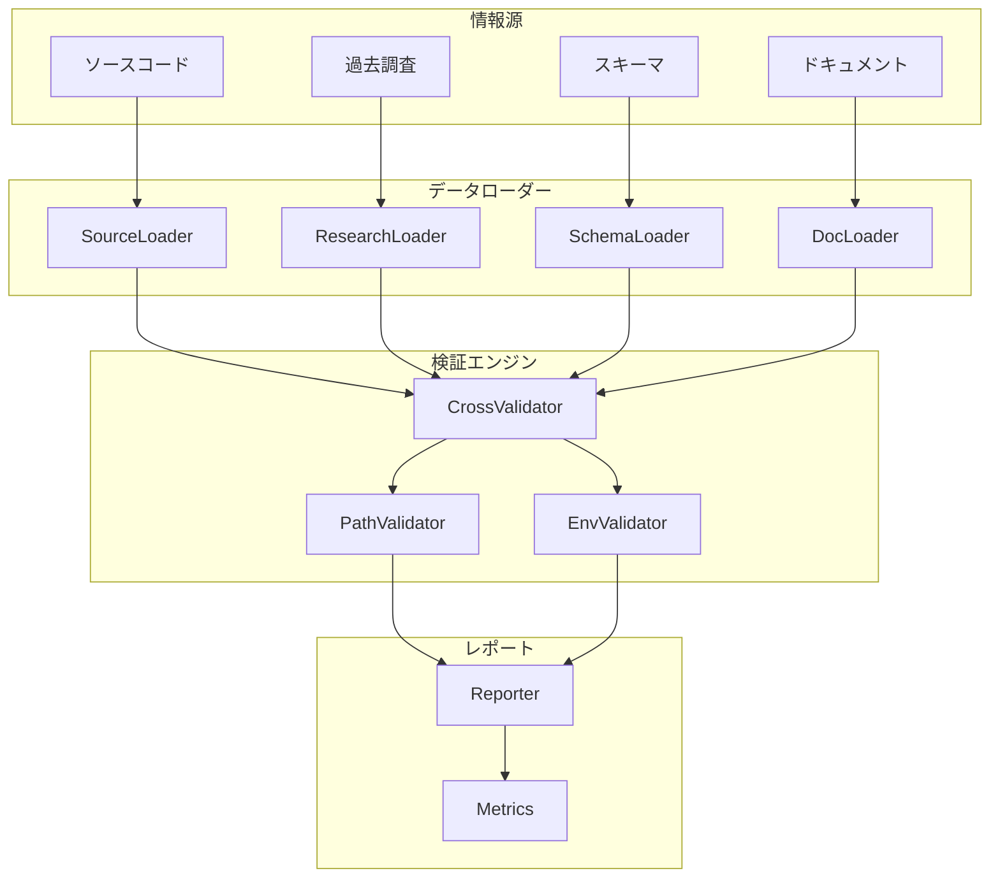
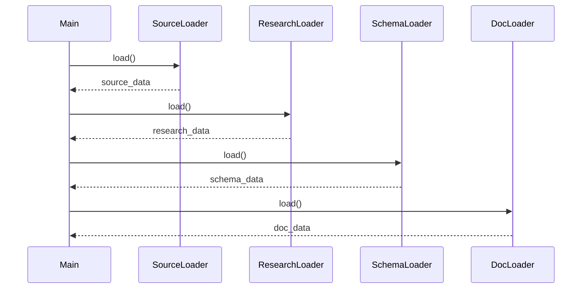
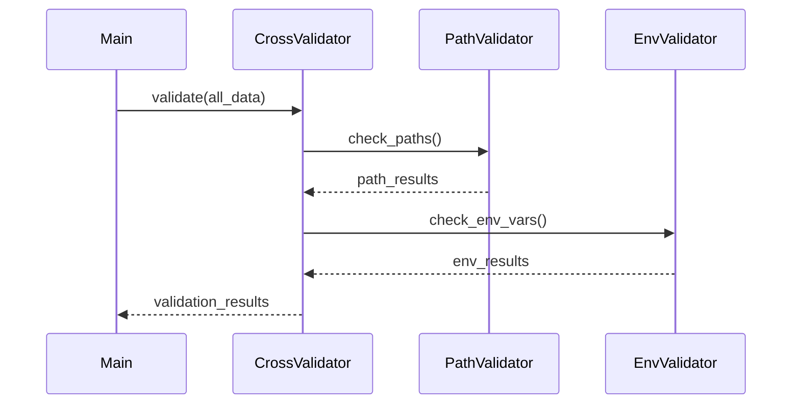
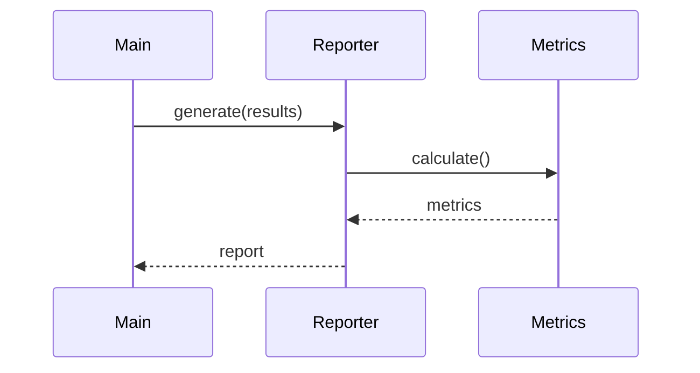

# v2.0検証ツール設計書

**作成日**: 2025-11-01  
**バージョン**: 2.0.0  
**目的**: 4つの情報源を統合した高度な検証システム

---

## 概要

v2.0検証ツールは、複数の情報源を統合し、クロスチェックによる高精度な検証を実現します。

### v1.5との違い

| 項目 | v1.5 | v2.0 |
|------|------|------|
| 情報源 | ドキュメントのみ | 4つの情報源 |
| 検証方法 | パターンマッチング | クロスチェック |
| 精度 | 高 | 超高 |
| 拡張性 | 中 | 高 |

---

## アーキテクチャ



---

## 情報源の定義

### 1. ソースコード（最優先）

**場所**: Q CLIリポジトリ  
**対象ファイル**:
- `crates/chat-cli/src/util/directories.rs` - パス定義
- `crates/chat-cli/src/config/` - 設定定義
- `crates/chat-cli/src/env.rs` - 環境変数定義

**抽出方法**: 正規表現 + AST解析

**データ形式**:
```json
{
  "paths": {
    "agent_dir": "~/.aws/amazonq/cli-agents",
    "mcp_config": "~/.aws/amazonq/mcp.json"
  },
  "env_vars": {
    "Q_LOG_LEVEL": {
      "default": "info",
      "type": "string"
    }
  }
}
```

### 2. 過去調査（高優先）

**場所**: プロジェクト内の調査ファイル  
**対象ファイル**:
- `docs/01_for-users/03_configuration/06_environment-variables.md`
- 過去の分析レポート

**抽出方法**: Markdownパース

**データ形式**:
```json
{
  "env_vars": [
    {
      "name": "Q_LOG_LEVEL",
      "default": "info",
      "description": "ログレベル"
    }
  ]
}
```

### 3. スキーマ（中優先）

**場所**: Q CLIリポジトリ  
**対象ファイル**:
- `schemas/agent-config.schema.json`
- `schemas/mcp-config.schema.json`

**抽出方法**: JSON Schema解析

**データ形式**: JSON Schema標準形式

### 4. ドキュメント（検証対象）

**場所**: `docs/`ディレクトリ  
**対象**: 全119ファイル

**抽出方法**: 正規表現

---

## データフロー

### Phase 1: データ収集



### Phase 2: クロスチェック



### Phase 3: レポート生成



---

## モジュール設計

### 1. データローダー

#### SourceLoader
```python
class SourceLoader:
    def load(self, repo_path: str) -> Dict:
        """ソースコードから情報を抽出"""
        pass
    
    def extract_paths(self, file_path: str) -> List[str]:
        """パス定義を抽出"""
        pass
    
    def extract_env_vars(self, file_path: str) -> Dict:
        """環境変数定義を抽出"""
        pass
```

#### ResearchLoader
```python
class ResearchLoader:
    def load(self, research_dir: str) -> Dict:
        """過去調査から情報を抽出"""
        pass
```

#### SchemaLoader
```python
class SchemaLoader:
    def load(self, schema_path: str) -> Dict:
        """スキーマから情報を抽出"""
        pass
```

#### DocLoader
```python
class DocLoader:
    def load(self, docs_dir: str) -> Dict:
        """ドキュメントから情報を抽出"""
        pass
```

### 2. 検証エンジン

#### CrossValidator
```python
class CrossValidator:
    def __init__(self, sources: Dict):
        self.sources = sources
    
    def validate(self) -> ValidationResult:
        """クロスチェック検証を実行"""
        pass
    
    def check_consistency(self, key: str) -> bool:
        """情報源間の一貫性をチェック"""
        pass
```

#### PathValidator
```python
class PathValidator:
    def validate(self, doc_paths: List, source_paths: List) -> List[Error]:
        """パスの妥当性を検証"""
        pass
```

#### EnvValidator
```python
class EnvValidator:
    def validate(self, doc_vars: List, source_vars: List) -> List[Error]:
        """環境変数の妥当性を検証"""
        pass
```

### 3. レポーター

#### Reporter
```python
class Reporter:
    def generate(self, results: ValidationResult) -> str:
        """レポートを生成"""
        pass
    
    def format_errors(self, errors: List[Error]) -> str:
        """エラーをフォーマット"""
        pass
    
    def format_metrics(self, metrics: Metrics) -> str:
        """メトリクスをフォーマット"""
        pass
```

---

## 検証ロジック

### 優先順位

1. **ソースコード** - 最も信頼できる情報源
2. **過去調査** - 実際の調査結果
3. **スキーマ** - 公式仕様
4. **ドキュメント** - 検証対象

### 不一致時の処理

```python
def resolve_conflict(sources: Dict) -> str:
    """
    優先順位に基づいて正しい値を決定
    
    1. ソースコードに定義がある → ソースコードを採用
    2. ソースコードになく、過去調査にある → 過去調査を採用
    3. 両方になく、スキーマにある → スキーマを採用
    4. すべてにない → エラー報告
    """
    if 'source_code' in sources:
        return sources['source_code']
    elif 'research' in sources:
        return sources['research']
    elif 'schema' in sources:
        return sources['schema']
    else:
        raise ValueError("No valid source found")
```

---

## データ構造

### ValidationResult
```python
@dataclass
class ValidationResult:
    errors: List[Error]
    warnings: List[Warning]
    metrics: Metrics
    timestamp: datetime
```

### Error
```python
@dataclass
class Error:
    file: str
    line: int
    column: int
    message: str
    expected: str
    actual: str
    source: str  # どの情報源から判明したか
```

### Metrics
```python
@dataclass
class Metrics:
    files_checked: int
    total_errors: int
    total_warnings: int
    consistency_rate: float  # 情報源間の一致率
    coverage: Dict[str, float]  # 各情報源のカバレッジ
```

---

## 実装計画

### Phase 1: 基本実装（30分）
- [ ] データローダーの実装
- [ ] 基本的な検証ロジック
- [ ] シンプルなレポート生成

### Phase 2: クロスチェック（20分）
- [ ] 情報源間の比較機能
- [ ] 不一致検出
- [ ] 優先順位に基づく解決

### Phase 3: 高度な機能（20分）
- [ ] メトリクス計算
- [ ] 詳細レポート
- [ ] 可視化

---

## テスト戦略

### ユニットテスト
- 各ローダーのテスト
- 各バリデーターのテスト
- レポーターのテスト

### 統合テスト
- エンドツーエンドのテスト
- 実際のデータでのテスト

### エッジケーステスト
- 情報源が欠けている場合
- 不一致が多い場合
- 大量のエラーがある場合

---

## 成功基準

1. **機能要件**
   - 4つの情報源を統合できる
   - クロスチェックが動作する
   - レポートが生成できる

2. **品質要件**
   - テストカバレッジ100%
   - エラー検出精度100%
   - False Positive 0件

3. **性能要件**
   - 119ファイルを10秒以内に検証
   - メモリ使用量1GB以下

---

**作成日時**: 2025-11-01 10:35 (JST)
